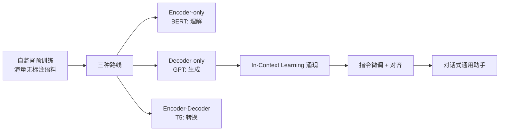
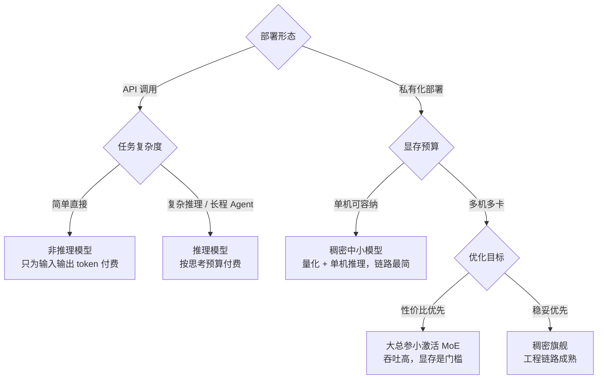

# 大语言模型架构解析

> 从 GPT 到推理模型，大语言模型的架构演进只有一条主线：**在 Transformer 骨架上，不断寻找"规模换能力"的最优结构**。这篇解析这条主线上的每个关键节点：自回归生成为什么让 KV Cache 成为推理成本核心、规模化律如何改写预训练预算、预训练到对齐的后训练管线、稠密与 MoE 的分野、MLA 类注意力压缩、推理模型的"思考"机制，以及开源权重谱系与架构选择对部署账单的影响。
> 目标读者是要做模型选型或推理方案设计的架构师与工程师；读完应能把"模型卡片上的架构特性"翻译成"我的部署要花多少钱、能扛多少并发"。

## 开篇：一个骨架与三个成本旋钮

对 LLM 的全部理解可以压缩成一句话：

> **模型在玩"预测下一个 token"的文本接龙；每生成一步，都要回看之前全部上下文，而这份上下文以 KV Cache 的形式被缓存下来。**

由此展开推理成本的三个旋钮（后文所有架构分析都建立在这个骨架上，推理侧展开见 [推理部署实战](/ai/infra/inference/llm-inference)）：

1. **算力**：生成是串行的，一个 token 一次前向；长输入的首段计算（Prefill）受算力约束
2. **显存容量**：权重（由总参数量决定）+ KV Cache（随会话长度线性增长）
3. **显存带宽**：逐字生成阶段每步计算量小，却要把权重与 KV 全部读一遍，受带宽约束

近五年的架构演进，大半可以解读为"在不损能力的前提下拧小这三个旋钮"：MoE 拧算力、GQA/MLA 拧 KV Cache、稀疏注意力拧长上下文计算，推理模型则反其道行之——主动加算力换质量。

## 预训练范式：一切的起点

- **自监督目标**：GPT 的"预测下一个 token"看似朴素，却是已知扩展性最好的学习目标——损失函数简单、数据无限、规模可加
- **Decoder-only 胜出的原因**：统一的生成式目标（一切任务皆可生成）、推理时 KV Cache 友好、训练目标与使用方式完全一致。BERT 系在理解任务上并非失败，而是"生成统一理解"的路线赢了
- **涌现能力**：规模跨过阈值后，少样本学习、思维链、指令跟随相继出现——GPT-3（2020，175B 参数）是"规模换能力"的分水岭，Scaling Law（算力/数据/参数的幂律）从经验观察变成了工程预算工具

Transformer 本身 2017 年为机器翻译而生：纯注意力取代循环与卷积，训练彻底并行化——8 卡 GPU 训 3.5 天即刷新 WMT'14 翻译纪录（英德 28.4 / 英法 41.8 BLEU）。真正改变历史的，是此后把 Decoder 半边单独拿出来、以"预测下一个 token"为唯一目标的组合。

*图源：Attention Is All You Need 论文图 1（[arXiv:1706.03762](https://arxiv.org/abs/1706.03762)）*

### 自回归生成：为什么 KV Cache 是推理成本核心

自回归推理的两个阶段，瓶颈画像完全不同：

| 阶段 | 做什么 | 瓶颈 |
| --- | --- | --- |
| 预填充（Prefill） | 输入 token 并行计算，产出 KV Cache | 算力受限，输入越长 FLOPs 越高 |
| 逐字生成（Decode） | 逐个 token 生成，每步回看全部历史 | 带宽受限，并发数受 KV Cache 显存钳制 |

KV Cache 就是"全部前文的记忆"：每一层注意力都要保存每个历史 token 的 Key/Value 向量，体量随层数 × KV 头数 × 上下文长度线性增长。粗算一笔：某 70B 级 GQA 模型（80 层、8 个 KV 头、头维 128、FP16），单 token 的 KV 约 320KB——**128K 上下文的单个请求要吃掉约 40GB 显存，比模型权重本身还大一个量级**。推理服务的并发能力与长上下文成本，本质上都是 KV Cache 的管理问题；vLLM 的 PagedAttention 借鉴操作系统虚拟内存，把 KV 分页、非连续分配、消除碎片，仅这一项就带来数倍吞吐提升（细节见 [推理部署实战](/ai/infra/inference/llm-inference)）。

## Transformer 的关键工程细节

今天的主流模型都是"Transformer + 一组补丁"：

- **Pre-Norm 与残差**：深层稳定训练的基础；每层 = 注意力子层 + FFN 子层，均带残差与归一化
- **RMSNorm 取代 LayerNorm**：LayerNorm 做两件事——减均值（中心化）与除以标准差（缩放）；RMSNorm 去掉中心化，只用均方根做缩放，少一组参数、少一步计算，深层网络下经验上更稳——LLaMA 系与此后几乎全部主流模型的标配，上面 Pre-Norm 里的归一化基本都用它
- **注意力为什么除以 √d_k**：两个维度为 d_k、元素独立且零均值单位方差的向量做点积，结果的方差随 d_k 线性放大——维度越高，点积值越发失控。logits 失控后，softmax 把几乎全部概率压到单个 token 上、进入饱和区，梯度趋近于零，训练就推不动了。除以 √d_k 把方差拉回 1 附近，让 softmax 停留在有梯度的区间。这是原论文里的一行修正，但缺了它，深层 Transformer 基本训不起来
- **RoPE 旋转位置编码**：相对位置的优雅表达，天然支持长度外推，是当前长上下文模型的标配（配 NTK/YaRN 类缩放进一步拉长）
- **MHA → MQA → GQA：注意力的 KV 压缩光谱**：原始 MHA（多头注意力）给每个 Query 头配一组独享的 KV——表达力最强，KV Cache 也最大；MQA（多查询注意力，2019）走到另一极端，全体 Query 头共享一组 KV，把解码时 KV 读取压到最小，但能力损失明显；GQA 居中（见下条），组内共享。三者构成"以少量能力换 KV Cache"的光谱，再往后把压缩做到维度方向上的就是下文 MLA 一节
- **GQA（分组查询注意力）**：多个 Query 头共享一组 KV，大幅压缩 KV Cache——上例中 KV 头从 64 减到 8 即 8 倍压缩，是推理成本优化的架构级手段
- **FFN 的膨胀**：FFN 占模型参数的大头，也是知识存储的主要载体——MoE 动的正是这块
- **SwiGLU 取代 ReLU**：经典 FFN 是"两层线性夹一个 ReLU"，SwiGLU 则引入门控结构——一路线性输出过 Swish 激活当"门"，与另一路线性输出逐元素相乘，让网络自己学每个维度该放行多少信息。门控用略多的参数（通常把隐层宽度缩到 2/3 以保持总参数量大致不变）换来明显更好的效果，2020 年的对比工作之后，成为 LLaMA、PaLM 等现代模型的 FFN 标配
- **FlashAttention：注意力的瓶颈不在算力而在 IO**：标准注意力要把 N×N 注意力矩阵（N 为序列长度）在 HBM（GPU 显存）中实体化——点积后写出、softmax 读回、softmax 后再写出，HBM 读写量随 N² 增长，而 GPU 算力单元大量时间在等数据；片上 SRAM 快得多却只有几十 MB，装不下整块矩阵。FlashAttention（2022）重排计算：把 Q、K、V 切成能装进 SRAM 的小块，分块在片上算注意力、只把部分结果写回；关键技巧是**在线 softmax**——用运行统计量增量更新归一化分母，不必等整行 logits 算完；反向传播不保存注意力矩阵，而是从前向保存的统计量按块重算，用少量多余算力换 IO。全程 N×N 矩阵不落地 HBM，HBM 访问量从 O(N²) 降到 O(N²d²/M)（M 为 SRAM 容量），显存占用从序列长度的平方降为线性，A100 上实测快 2–4 倍，且与标准注意力逐位一致（精确算法，不是近似）。它因此成为所有训练与推理框架的必备内核——长上下文时代正是建立在这项改进之上
- **FA2 / FA3 的后续方向**：FA2（2023）压低非矩阵乘操作（softmax 类逐元素运算）的比例、增加沿序列长度维度的并行、重排线程块分工，速度再翻倍，把 A100 算力利用率从 v1 的 25–40% 提到 50–70%；FA3（2024）针对 Hopper 架构，用 WGMMA 异步矩阵指令与 warp 分工（warp specialization）让矩阵乘与 softmax 重叠执行，H100 利用率从 35% 提到约 75%（FP16 峰值 740 TFLOPS），速度约为 FA2 的 1.5–2 倍，并支持 FP8 低精度。注意力的内核优化至此与硬件架构深度绑定，每一代 GPU 都要重写一遍

*图源：Tri Dao 的 FlashAttention-3 发布博客（[tridao.me](https://tridao.me/blog/2024/flash3/)）*

## 规模化律：从暴力堆参数到预算工具

预训练的"花钱方式"被两个节点改写：

1. **Scaling Law（GPT-3 时代）**：损失随算力、数据、参数呈幂律下降——对数坐标下是直线。"堆大就变强"从信仰变成可外推的工程预测
2. **Chinchilla 修正（2022）**：DeepMind 训练 400 余个规模不等的模型后给出结论——**参数量与训练 token 数必须等比扩张**，模型翻倍则数据翻倍。70B 的 Chinchilla 以与 280B Gopher 相同的算力、4 倍的数据（1.4T token），全面超越后者（MMLU 67.5%，高出 7 个百分点以上）。震撼之处在于：当时的大模型普遍"欠训"

三个工程后果随之而来：

- **LLaMA 路线**：既然推理成本也要进目标函数，就用小模型吃远超最优配比的数据（"过训"）。LLaMA-1（2023，7B–65B）证明 13B 过训模型能在多数基准超过 GPT-3 175B，并靠开放权重点燃了开源生态——今天 7B/14B/32B 的稠密小模型全是这条路
- **数据墙显现**：截至 2026-09，前沿模型预训练语料已达 10–20T token 量级，高质量网络文本趋近枯竭，合成数据与语料精炼成为数据工程主战场
- **规模化律变成预算工具**：训练前按算力预算反推模型与数据的配比、预测损失曲线再决定是否立项——预训练从"赌规模"变成"做预算"，集群与成本侧展开见 [GPU 集群与高速网络](/ai/infra/cluster)、[训练工程](/ai/infra/training)

## 从预训练到对齐：后训练管线

预训练模型只是"文本接龙引擎"：不会对话、不听指令，还会输出有害内容。InstructGPT（2022）确立的三阶段管线，把它变成了今天可用的"产品"：

| 阶段 | 做什么 | 数据 | 成本特征 |
| --- | --- | --- | --- |
| 预训练 | 学语言与世界知识 | 万亿级 token 无标注语料 | 占绝对多数算力 |
| SFT 指令微调 | 学"当助手"的格式与行为 | 数万至数百万条高质量指令对 | 算力低，数据质量杠杆极高 |
| 对齐强化学习 | 学"什么回答更好" | 人类偏好对比 / 可验证奖励 | 算力中等，决定体验上限 |

两个关键事实：

- **对齐是杠杆率极高的投入**：InstructGPT 论文中，1.3B 的对齐模型在人类评估里胜过 175B 的原始 GPT-3——参数量差百倍，体验反超
- RLHF（奖励模型 + PPO）成为标配后又分出一条谱系：**DPO** 跳过奖励模型直接用偏好对优化，工程更简单；**Constitutional AI（RLAIF）** 用 AI 反馈替代部分人工标注，解决无害性数据的规模与一致性问题；2025 年的推理模型浪潮再把 **RLVR**（可验证奖励的强化学习）推上前台——数学、代码等可自动判分的领域成为推理能力的训练场，这正是 o1/R1 的技术底座（详见 [训练工程](/ai/infra/training)）

对齐强化学习阶段的主流算法，工程账差别很大，汇总对照：

| 算法 | 奖励信号 | 是否需要奖励模型 | 关键机制 | 工程复杂度 |
| --- | --- | --- | --- | --- |
| PPO | 学习出的奖励模型打分 | 需要（另需参考模型做 KL 约束、价值网络估优势） | 策略梯度 + 裁剪目标；KL 惩罚防止模型偏离原模型太远 | 高：策略/奖励/参考/价值四个模型同时在手，超参敏感 |
| DPO | 人类或 AI 偏好对 | 不需要 | 把 KL 约束 RL 目标的闭式解代入奖励函数，奖励隐式地由策略本身表示，RL 目标退化为偏好对上的二元分类损失 | 低：单模型直接当分类器训 |
| GRPO | 规则可验证奖励为主 | 不需要 | 每题采样一组回答，用组内相对奖励（减组均值、除组标准差）充当优势，省掉 critic/价值网络 | 中：免训价值网络，但要成组采样并设计奖励函数 |

## MoE：稀疏激活的效率革命

- **机制**：FFN 替换为多个专家网络 + 路由器，每个 token 只激活 top-k 个专家——**总参数大（能力上限高），激活参数小（推理计算成本低）**
- **演进**：Switch Transformer（2021，单专家路由，把路由简化到极致、参数推向万亿级）→ Mixtral 8x7B（2024，8 选 2，47B 总参数仅激活约 13B，开源 MoE 引爆点）→ DeepSeekMoE → DeepSeek-V3（细粒度专家 + 共享专家 + 无辅助损失负载均衡；671B 总参数/37B 激活，14.8T token 预训练，全程 2.788M H800 GPU 时——按论文假设的 2 美元/卡时折算约 560 万美元）
- **工程代价**：显存占用由总参数决定（专家都要加载），通信模式改变（EP 专家并行 + All-to-All），负载均衡是训练难点（路由失衡既浪费专家容量又制造热点）
- **架构启示**：MoE 证明了"稀疏化"是规模与成本矛盾的正解——这个思想正在向推理侧延伸（稀疏注意力、动态推理深度等）

*图源：DeepSeek-V3 Technical Report 图 2（[arXiv:2412.19437](https://arxiv.org/abs/2412.19437)）*

MoE 的定价是双面的：API 厂商按激活参数计价（算力成本真实），**单价显得很便宜**；私有化部署却要为总参数买单（显存成本真实），**部署门槛高于同能力的稠密模型**。这个不对称直接决定了下文的选型逻辑。

## MLA 与注意力压缩：KV Cache 的显存战争

MoE 解决"算力"，注意力压缩解决"显存"。压缩谱系是：MHA（每头独享 KV）→ MQA（全体共享一组）→ GQA（分组共享）→ MLA（压进潜向量）：

*图源：DeepSeek-V2 论文图 3（[arXiv:2405.04434](https://arxiv.org/abs/2405.04434)）*

MLA（Multi-head Latent Attention，DeepSeek-V2 于 2024 年首创）把所有头的 K、V 联合压缩成一个低维潜向量，缓存时只存潜向量，单 token KV 体积降一个量级。官方报告的对照数字：相比前代稠密模型，DeepSeek-V2 的 **KV Cache 减少 93.3%，最大生成吞吐提升至 5.76 倍**。工程含义很直接：

- **并发直接抬升**：单请求显存下降，同一张卡能承载的会话数同比例上升
- **长上下文变得经济**：128K 上下文从"演示能力"变成"可日常使用"
- **与 PagedAttention 叠加**：分页管理 + 压缩后的 KV，两项收益相乘

2025-09，DeepSeek 进一步开源 DSA（DeepSeek Sparse Attention）：用轻量索引器为每个查询先粗筛，只对 top-k 个相关 token 做全注意力，把长上下文的计算复杂度也降了下来——这是 V3.2 敢大幅下调长上下文定价的架构底气。至此，注意力完成了"结构稀疏（MLA）→ 计算稀疏（DSA）"两步。

## 长上下文：从 8K 到百万级

- **三段式演进**：位置编码外推（RoPE 缩放）→ 注意力稀疏化/分层（滑动窗口、YaRN、DSA）→ 检索与记忆分层（KV 压缩、外部记忆）
- **成本真相**：长上下文的瓶颈是 KV Cache 的显存与带宽，不是计算——"支持 1M 上下文"与"用得起 1M 上下文"是两回事
- **与 RAG 的关系**：不是替代而是分工——长上下文管会话内，RAG 管知识库，两者在"上下文工程"里统一调度

其中第一段的 RoPE 缩放值得单独展开：它是让已训好的模型获得长上下文最便宜的手段，三代方法回答的是同一个问题——训练没见过的长位置怎么处理：

- **PI（位置插值）**：把位置索引线性压缩，将更长序列的位置映射回训练过的区间——实现最简单，但对所有维度无差别压缩，高频维度的局部分辨率被压坏
- **NTK-aware 插值**：不动位置索引，改 RoPE 的基频，让各维度的旋转频率按不同幅度放慢——高频维度近似保持原转速，低频维度压缩更多
- **YaRN**：把高低频显式分区处理（NTK-by-parts）——高频维度完全不插值（保护局部信息），低频维度完全插值，中频段平滑过渡，再补一个注意力温度补偿；以很少的继续预训练成本即可稳定支撑约 10 倍的上下文扩张，是开源长上下文模型的默认方案

一句经验：旗舰模型的 1M 上下文，很少靠单一外推技巧，而是"大 RoPE 基频 + 分频段缩放 + 长数据继续训练"的组合拳——外推是放大器，不是无米之炊。

## 推理模型：推理时计算（Reasoning）

- **范式转变**：从"训练时把能力压进权重"到"推理时用更多计算换更高质量"——OpenAI o1（2024-09，用大规模强化学习训练思维链）是开创者；DeepSeek-R1（2025-01，不依赖人工推理标注的纯 RL 路线并开源权重）是开源引爆点
- **技术要点**：思考 token 就是生成在专门推理区里的普通文本，其长度即"思考时长"；RLVR 的奖励来自可自动判分的结果（答案对错、测试通过与否）；推理预算可按任务难度调节——Qwen3 的思考/非思考双模式（截至 2026-09）已是开源旗舰标配
- **成本结构影响**：推理模型的输出 = 思考 token + 答案 token，单价与延迟都要按"思考预算"重新测算——传统的"输入/输出价格"模型被改写；思考区通常不完整展示给用户，但足额计费
- **与 Agent 的合流**：长程推理能力是 Agent 处理复杂任务的前提，两条技术线在这里交汇（参见 [Agent 子域](/ai/agent/)）；V3.2 一类模型已把"推理 + 工具调用"的合成训练管线作为核心能力来建设

## 解码与采样策略

模型前向只产出下一个 token 的概率分布，**从分布里取哪个 token，是解码策略说了算**——也就是 API 里调的 `temperature`、`top_p` 这组参数。这一层不改变模型能力，却直接决定输出的稳定性与多样性，是工程调参里理解最不透彻的一环。

常见机制，按从保守到放开排列：

- **贪心（greedy）**：每步取概率最高的 token，完全确定；短视（每步局部最优不保证全局最优），开放任务上容易掉进重复循环
- **束搜索（beam search）**：并行保留 B 条候选序列、逐步扩展，结束时取全局得分最高的一条；曾是机器翻译标配，但开放生成中输出偏单调重复，如今主要留在语音识别等受限生成场景
- **top-k**：每步只保留概率最高的 k 个 token，重新归一化后采样；k 是固定值，不随分布形状自适应——模型很确定时候选集太宽，模型犹豫时候选集又太窄
- **top-p（nucleus sampling，核采样）**：把 token 按概率从大到小累加，累到总概率恰好超过 p 时截断这个最小候选集，归一化后采样；候选集大小随分布熵自动伸缩——模型确定就只留少数几个，不确定就多留。当前主流 API 都以 top_p 为采样的主开关
- **temperature**：不做截断，改分布形状——logits 先除以 T 再过 softmax。T < 1 让分布更尖、概率向头部 token 集中；T > 1 让分布更平、低概率 token 也有机会；T 趋近 0 时近似贪心

工程含义有三条：

- **确定性任务压低温度**：分类、信息抽取、JSON 等结构化输出、工具调用参数，这类任务只有唯一正确答案，采样就是噪声——低温度（0–0.3）或贪心 + 格式约束是标配，top_p 也应同步收紧
- **创作类任务放开温度**：文案、故事、头脑风暴需要多样性，温度太低会让多次输出几乎雷同；同时配合重复惩罚（frequency/presence penalty 一类 logits 处理器，对已生成的 token 在 logits 上扣分）防循环
- **推理模型时代，采样重新变得值钱**：思考链是一段长搜索过程，贪心解码会让推理掉进重复循环。DeepSeek-R1 的官方使用建议明确要求 temperature 0.5–0.7（推荐 0.6）、top_p 0.95，其论文也记录了贪心解码下长输出推理模型的重复率显著升高、评测结果不稳——用推理模型时，别照搬对话模型时代的低温度经验

| 策略 | 机制 | 适用 | 主要风险 |
| --- | --- | --- | --- |
| 贪心 | 每步取 argmax | 抽取、分类、结构化输出 | 短视、重复、无多样性 |
| 束搜索 | 保留 B 条候选、取全局最优 | 语音识别、受限翻译 | 输出单调、算力 × B |
| top-k | 按概率留前 k 再采样 | 通用生成 | k 不自适应分布形状 |
| top-p | 按累积概率 p 截断再采样 | 通用生成（当前默认） | 分布极平时候选集仍可能偏大 |
| temperature | 用 T 重缩放 logits | 与上述组合调锐度 | 过低重复、过高失焦 |

## 开源权重谱系：从 LLaMA 到 DeepSeek

五代开源权重，各解决了一个不同的问题（截至 2026-09）：

| 世代 | 代表 | 解决的问题 |
| --- | --- | --- |
| 2023 | LLaMA 1/2 | 纯公开数据训练可行，过训路线成立，开放权重成势 |
| 2024 | Mixtral / Qwen2 / DeepSeek-V2 | MoE、MLA 等效率架构开源，对标闭源 |
| 2025 | DeepSeek-V3/R1、Qwen3 | 纯 RL 推理与架构创新成为主流，价格打至闭源 1/10 量级 |
| 2025–2026 | DeepSeek-V3.2、Qwen3.5 系、GLM-5 系 | 稀疏注意力、原生多模态、长程 Agent |

这条谱系也给出一个选型事实：**开源旗舰的能力差距在收敛，真正的差异在工程生态**——推理引擎（vLLM/SGLang）的支持速度与成熟度、量化方案、Agent 框架适配，往往比基准分数更影响落地体验。多模态方向的开源进展见 [多模态应用](/ai/application/multimodal)，更早的脉络见 [机器学习与深度学习经典](/ai/models/ml-dl)。

## 架构选择如何影响部署成本

把本文的架构特性逐一映射到推理侧：

| 架构特性 | 改变了什么 | 成本含义 |
| --- | --- | --- |
| 总参/激活分离（MoE） | 算力随激活、显存随总参 | API 单价低；私有化显存门槛高 |
| GQA / MLA | 单 token KV 体积 | 并发数、长上下文显存 |
| 稀疏注意力（DSA 类） | 长上下文注意力计算 | 长输入定价、长文档延迟 |
| 推理模式 | 输出 token 量 | 输出账单与延迟成倍上升 |
| 线性注意力/混合架构 | 长序列计算复杂度 | 1M+ 上下文的成本天花板 |

架构与推理引擎的耦合比想象中深：PagedAttention、FP8 KV Cache、前缀缓存、专家并行调度——推理工程清单上的每一项，都对应上面某个架构特性。评估模型时应把"主流引擎对它的支持程度"放进检查表（例如 DSA 发布当天即获 vLLM/SGLang 适配，这种速度本身就是竞争力的一部分）。

## 旗舰演进速览（2025–2026，更新于 2026-09）

**推理模型线**：o1（2024-09，开创者）→ **DeepSeek-R1**（2025-01，纯 RL + 开源引爆点）→ o3/o4-mini → DeepSeek-V3.2（2025-12，**DSA 稀疏注意力**大幅降低长上下文成本）→ V4（2026-04，主攻编程）

**开源旗舰线（2026）**：

| 机构 | 代表 | 要点 |
| --- | --- | --- |
| 阿里 Qwen | Qwen3.5（2026-02）/3.8 | 原生多模态、混合注意力；Qwen3-Next 首创 3:1 线性注意力混合架构 |
| DeepSeek | V3.2 → V4 | DSA 稀疏注意力 + MoE+MLA，性价比标杆 |
| 智谱 | GLM-5（2026-02）→ 5.2 | 744B MoE，定位"从 Vibe Coding 到智能体工程" |
| 月之暗面 | Kimi K2 Thinking（2025-11）→ K3 | 200-300 次连续工具调用的长程 Agent 里程碑 |
| MiniMax | M3（2026-06） | 前沿编程 + 1M 上下文 + 原生多模态三合一 |

**闭源对照**：GPT-5 → 5.5（2026-04）；Claude Opus 4.x → Opus 5（2026-07）；Gemini 3 Pro（2025-11，3.5 Pro 持续跳票）

**关键技术趋势**：
1. **MoE 极致稀疏化**：激活占比压到 3-5%，"大总参、小激活"成为开源标配
2. **注意力架构革命**：线性注意力实用化、稀疏注意力工程化——为 1M+ 上下文降本
3. **长上下文标配化**：1M token 成为旗舰门槛
4. **长程 Agent 能力取代单轮基准**成为新叙事（数百次工具调用的持续作战）
5. **开源闭源差距收敛 + 价格战**：开源旗舰对标闭源且价格低至 1/10-1/18

## 选型视角（SA 笔记）

- **稠密还是 MoE**：私有化部署看显存预算（MoE 总参数大），API 调用看激活参数定价
- **推理模型按需开启**：简单任务用非推理模式省成本，复杂任务才付思考预算——路由策略比模型选择更影响账单
- **上下文长度的账**：按真实业务长度分布测算，别被"支持长度"带节奏
- **别迷信基准分**：用真实业务样本建评测集，指令跟随稳定性、中文与工具调用等长尾能力比主榜分数更决定体验

## 常见坑

| 坑 | 现象 | 根因与对策 |
| --- | --- | --- |
| 按激活参数估私有化显存 | 部署即爆显存 | MoE 显存由总参数决定，预算要含全部专家 + KV Cache |
| 拿"支持上下文长度"做设计输入 | 账单爆炸、显存 OOM | 按真实业务长度分布测算；KV Cache 随长度线性增长 |
| 推理模式全量默认开启 | 延迟与单价成倍上升 | 按任务复杂度路由，高频简单任务走非思考模式 |
| 忽视 KV Cache 优化 | 并发量上不去 | 选 GQA/MLA 架构、FP8 KV 量化、PagedAttention 类引擎 |
| 迷信基准榜单 | 业务实测回退 | 业务样本建评测集，重点看指令跟随与长尾能力 |

## 参考资料

<Refs>

**原始论文**

- [Attention Is All You Need](https://arxiv.org/abs/1706.03762) — Transformer 开山之作（2017）（访问日期 2026-09-03）
- [Language Models are Few-Shot Learners (GPT-3)](https://arxiv.org/abs/2005.14165) — 涌现能力的分水岭（2020）（访问日期 2026-09-03）
- [Training Compute-Optimal Large Language Models (Chinchilla)](https://arxiv.org/abs/2203.15556) — 规模化律修正，"过训"路线依据（2022）（访问日期 2026-09-03）
- [Training language models to follow instructions with human feedback (InstructGPT)](https://arxiv.org/abs/2203.02155) — RLHF 三阶段原型（2022）（访问日期 2026-09-03）
- [Constitutional AI: Harmlessness from AI Feedback](https://arxiv.org/abs/2212.08073) — AI 反馈对齐（2022）（访问日期 2026-09-03）
- [LLaMA: Open and Efficient Foundation Language Models](https://arxiv.org/abs/2302.13971) — 开放权重转折点（2023）（访问日期 2026-09-03）
- [Switch Transformers](https://arxiv.org/abs/2101.03961) — MoE 路由简化与万亿参数（2021）（访问日期 2026-09-03）
- [Mixtral of Experts](https://arxiv.org/abs/2401.04088) — 开源 MoE 引爆点（2024）（访问日期 2026-09-03）
- [DeepSeek-V2: A Strong, Economical, and Efficient Mixture-of-Experts Language Model](https://arxiv.org/abs/2405.04434) — MLA 首秀与 KV Cache 压缩（2024）（访问日期 2026-09-03）
- [DeepSeek-V3 Technical Report](https://arxiv.org/abs/2412.19437) — MoE 工程化集大成（2024）（访问日期 2026-09-03）
- [DeepSeek-R1: Incentivizing Reasoning Capability in LLMs via Reinforcement Learning](https://arxiv.org/abs/2501.12948) — RLVR 与推理模型的开源里程碑（2025）（访问日期 2026-09-03）
- [Qwen3 Technical Report](https://arxiv.org/abs/2505.09388) — 稠密 + MoE 全线与思考双模式（2025）（访问日期 2026-09-03）
- [DeepSeek-V3.2: Pushing the Frontier of Open Large Language Models](https://arxiv.org/abs/2512.02556) — DSA 稀疏注意力与智能体后训练（2025）（访问日期 2026-09-03）
- [Efficient Memory Management for Large Language Model Serving with PagedAttention](https://arxiv.org/abs/2309.06180) — vLLM 论文，KV Cache 分页管理（2023）（访问日期 2026-09-03）
- [Root Mean Square Layer Normalization](https://arxiv.org/abs/1910.07467) — RMSNorm，去中心化的归一化（2019）（访问日期 2026-09-04）
- [Fast Transformer Decoding: One Write-Head is All You Need](https://arxiv.org/abs/1911.02150) — MQA 多查询注意力（2019）（访问日期 2026-09-04）
- [The Curious Case of Neural Text Degeneration](https://arxiv.org/abs/1904.09751) — top-p/核采样的提出背景（2019）（访问日期 2026-09-04）
- [GLU Variants Improve Transformer](https://arxiv.org/abs/2002.05202) — SwiGLU 门控 FFN（2020）（访问日期 2026-09-04）
- [FlashAttention: Fast and Memory-Efficient Exact Attention with IO-Awareness](https://arxiv.org/abs/2205.14135) — IO 感知注意力的起点（2022）（访问日期 2026-09-04）
- [Direct Preference Optimization: Your Language Model is Secretly a Reward Model](https://arxiv.org/abs/2305.18290) — DPO 跳过奖励模型的对齐（2023）（访问日期 2026-09-04）
- [GQA: Training Generalized Multi-Query Transformer Models from Multi-Head Checkpoints](https://arxiv.org/abs/2305.13245) — 分组查询注意力（2023）（访问日期 2026-09-04）
- [Extending Context Window of Large Language Models via Positional Interpolation](https://arxiv.org/abs/2306.15595) — 位置插值（PI）扩展上下文（2023）（访问日期 2026-09-04）
- [FlashAttention-2: Faster Attention with Better Parallelism and Work Partitioning](https://arxiv.org/abs/2307.08691) — 更好的并行与分工（2023）（访问日期 2026-09-04）
- [YaRN: Efficient Context Window Extension of Large Language Models](https://arxiv.org/abs/2309.00071) — 高低频分区的 RoPE 外推（2023）（访问日期 2026-09-04）
- [DeepSeekMath: Pushing the Limits of Mathematical Reasoning in Open Language Models](https://arxiv.org/abs/2402.03300) — GRPO 组相对策略优化（2024）（访问日期 2026-09-04）
- [FlashAttention-3: Fast and Accurate Attention with Asynchrony and Low-Precision](https://arxiv.org/abs/2407.08608) — Hopper 异步与低精度（2024）（访问日期 2026-09-04）

**官方博客与公告**

- [OpenAI: Learning to Reason with LLMs](https://openai.com/index/learning-to-reason-with-llms/) — o1 发布公告（2024-09-12）（访问日期 2026-09-03）
- [vLLM: Easy, Fast, and Cheap LLM Serving with PagedAttention](https://vllm.ai/blog/2023-06-20-vllm) — vLLM 发布博客（2023-06）（访问日期 2026-09-03）
- [DeepSeek: Introducing DeepSeek-V3.2-Exp](https://api-docs.deepseek.com/news/news250929/) — DSA 首发公告（2025-09-29）（访问日期 2026-09-03）
- [Tri Dao: FlashAttention-3](https://tridao.me/blog/2024/flash3/) — FA3 作者博客，技术细节与基准（2024-07）（访问日期 2026-09-04）

**图片来源**

- Transformer 架构图：Attention Is All You Need 图 1（[arXiv:1706.03762](https://arxiv.org/abs/1706.03762)）
- 注意力结构对比图：DeepSeek-V2 图 3（[arXiv:2405.04434](https://arxiv.org/abs/2405.04434)）
- DeepSeek-V3 架构图：DeepSeek-V3 Technical Report 图 2（[arXiv:2412.19437](https://arxiv.org/abs/2412.19437)）
- FlashAttention 数据流对比图：Tri Dao 的 FlashAttention-3 发布博客（[tridao.me](https://tridao.me/blog/2024/flash3/)）

站内相关：[机器学习与深度学习经典](/ai/models/ml-dl) · [GPU 集群与高速网络](/ai/infra/cluster) · [训练工程](/ai/infra/training) · [推理部署实战](/ai/infra/inference/llm-inference) · [多模态应用](/ai/application/multimodal) · [智能体技术全景](/ai/agent/)

</Refs>
