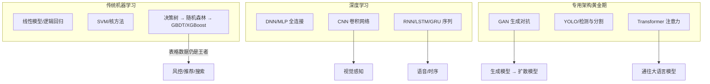

# 机器学习与深度学习经典架构

> 大模型时代容易让人忘记：今天的一切建立在经典架构的层层积累之上。这篇梳理从传统机器学习到深度学习黄金期的架构谱系——它们没有过时，而是以组件形式活在现代系统里：GBDT 还在风控里，CNN 还在感知里，GAN 的思想滋养了扩散模型。

## 谱系总览

## 传统机器学习：特征工程时代

- **核心范式**：人工设计特征 + 浅层模型。模型简单，特征决定上限
- **集成学习三杰**：随机森林（Bagging，降方差）、GBDT（Boosting，降偏差）、XGBoost/LightGBM（工程化 GBDT，至今是表格数据的默认答案）
- **为什么没被深度学习取代**：表格数据上深度模型没有稳定优势，且训练成本、可解释性、样本效率全面落后——风控、推荐 CTR、搜索排序仍是树模型的天下

## DNN/MLP：深度学习的起点

- **关键突破**：反向传播 + 非线性激活（ReLU）+ 逐层预训练→端到端训练
- **2012 年 AlexNet 时刻**：GPU + 大数据（ImageNet）+ 深度卷积，错误率骤降 10 个百分点——深度学习从学术边缘走向工业中心
- **遗留问题**：全连接网络参数爆炸、无归纳偏置——催生了 CNN 与 RNN 两大分支

## CNN：视觉感知的基石

- **架构思想**：局部连接 + 权值共享 + 池化下采样，把"平移不变性"和"层次化特征"编码进结构
- **演进线**：LeNet → AlexNet → VGG（深度）→ GoogLeNet（多尺度）→ **ResNet（残差连接，深度破百）** → EfficientNet（复合缩放）
- **关键洞察**：ResNet 的残差连接不只解决梯度消失，更揭示了"学习增量比学习完整映射容易"——这个思想后来出现在 Transformer 的每个子层里
- **后续**：ViT 用纯注意力挑战 CNN，到 ConvNeXt 时代两者已互相融合

## RNN/LSTM/GRU：序列建模时代

- **架构思想**：隐状态携带历史——把"记忆"显式建模进结构
- **LSTM 的门控机制**：遗忘门/输入门/输出门解决长程依赖的梯度问题；GRU 做了参数简化
- **应用黄金期**：机器翻译（Seq2Seq + Attention）、语音识别、时序预测
- **局限与谢幕**：串行计算无法并行、长程依赖仍有损——Transformer 的并行注意力机制终结了这个时代，但"状态与记忆"的命题在 Mamba 类状态空间模型里回归

## GAN：生成模型的第一课

- **架构思想**：生成器与判别器对抗博弈——"用对抗代替似然估计"
- **演进线**：原始 GAN → DCGAN（卷积稳定训练）→ Conditional GAN → **StyleGAN（人脸生成的天花板）** → CycleGAN（无配对翻译）
- **历史地位**：证明了"生成"可以作为独立任务被优化；其训练不稳定与模式坍缩问题，成为扩散模型"稳定生成"优势的参照系
- **遗产**：判别器思想活在扩散模型的蒸馏加速（如 LCM）与图像质量评估里

## YOLO 与目标检测：实时感知的工业化

- **架构思想**：把检测从"候选框+分类两阶段"（R-CNN 系）变成"单次前向回归"（One-Stage），速度换精度，再把精度追回来
- **演进线**：YOLOv1（2016）→ v3（多尺度）→ v5（工程化/PyTorch）→ v8+（Anchor-Free + 任务解耦头）——成为工业界部署量最大的检测家族
- **方法论启示**：一个架构的成功 = 论文创新 × 工程可复现性 × 部署友好度。YOLO 的每个版本都赢在"可部署"

## Transformer：统一一切的注意力机制

- **核心机制**：Self-Attention 让任意位置直接交互，彻底摆脱序列的串行依赖；Multi-Head 提供多子空间视角；位置编码补回顺序信息
- **三分支**：Encoder-only（BERT，理解）/ Decoder-only（GPT，生成）/ Encoder-Decoder（T5，转换）
- **为什么赢**：并行训练效率 + 规模可加性（加层加宽即变强）+ 归纳偏置弱（靠数据学到结构）——完美匹配 Scaling Law
- **扩散影响**：ViT（视觉）、Whisper（语音）、AlphaFold（蛋白质）、DiT（生成）——详见各板块

## 实践观点（从今天的视角回看）

- **选型优先级没变**：表格数据先试树模型，感知任务用预训练 CNN/ViT 微调，序列任务直接上 Transformer——2018 年成立的口诀，2026 年依然成立
- **经典架构是理解大模型的钥匙**：不看 ResNet 不懂残差，不看 Seq2Seq 不懂 Encoder-Decoder，不看 GAN 不懂扩散的动机
- **蒸馏与融合是常态**：大模型时代的生产系统里，BERT 级编码器、轻量 CNN、树模型常常与大模型共存——合适的组件做合适的事

## 参考资料

- [Attention Is All You Need](https://arxiv.org/abs/1706.03762) — Transformer 原论文（2017）
- [Deep Residual Learning for Image Recognition](https://arxiv.org/abs/1512.03385) — ResNet（2015）
- [Generative Adversarial Networks](https://arxiv.org/abs/1406.2661) — GAN 原论文（2014）
- [XGBoost: A Scalable Tree Boosting System](https://arxiv.org/abs/1603.02754) — 表格数据之王（2016）
- 《统计学习方法》（李航）· 《机器学习》（周志华，西瓜书）— 中文经典教材
- 站内相关：[大语言模型架构解析](/ai/models/llm) · [模型架构演进总览](/ai/models/)
