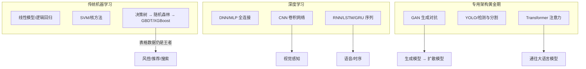
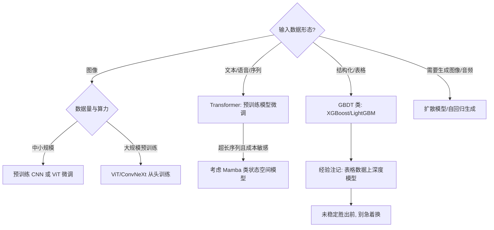

# 机器学习与深度学习经典架构

> 大模型时代容易让人忘记：今天的一切建立在经典架构的层层积累之上。这篇按时间线梳理从传统机器学习到深度学习黄金期的架构谱系，对每个关键转折点讲清楚两件事——**它解决了什么问题、付出了什么代价**，以及**这些架构今天在系统里以什么形式活着**。它们没有过时：GBDT 还在风控里，CNN 还在大模型的视觉编码器里，RNN 的教训催生了注意力机制，GAN 的思想则滋养了扩散模型。

## 谱系总览

整个架构史可以概括成一句话：**每一代架构都把人对数据的某种先验假设编进结构里，而下一代用更弱的假设替换它，代价是换来更多的数据与算力需求**。线性模型假设"特征线性可加"，CNN 假设"局部相关 + 平移不变"，RNN 假设"历史可压缩为一个状态向量"，Transformer 则把结构假设降到最低——所以它必须靠最大的数据和算力喂养，回报是跨任务的普适性。

注意箭头方向：这不是"替代"，而是**分工的固化**。我参与过的生产系统里，几乎没有哪一代架构整体退场——它们退居组件位置，让更合适的结构接管主链路。理解这一点，后面每一节的"今天的位置"才有落点。

## 传统机器学习：特征工程时代

### 线性模型：低矮但地基扎实

逻辑回归（一句话解释：把特征的加权和过一个 sigmoid 映射成概率）是工业界最老也最耐用的模型。它的全部能力就是"特征线性可加"这一条假设，换来三个至今稀缺的性质：**训练成本可忽略、单条预测毫秒级、每个特征的权重直接可读**。风控审批要能向监管解释"为什么拒贷"，逻辑回归的系数就是解释本身。今天它依然存在——往往是作为复杂系统的最后一道兜底或校准层。

### 决策树与集成学习：Bagging 和 Boosting 两条路

单棵决策树可解释但方差大（数据稍有扰动，树形就变），于是有了两条集成路线：

- **Bagging（随机森林）**：并行训练许多棵互不相同的树，投票取平均——**降方差**，抗过拟合，几乎不用调参，是"先跑个基线"的默认选择
- **Boosting（GBDT）**：串行地训练树，每棵新树拟合前面所有树的残差（更准确说是损失函数的负梯度），逐步逼近目标——**降偏差**，精度上限高，但串行训练慢、对超参敏感

梯度提升（Gradient Boosting）的框架由 Friedman 在 2001 年前后奠定，XGBoost 官方教程也把自己的思想源头追溯到这条线。两条路线的差异决定了分工：要稳、要快、要省心选随机森林；要精度上限、愿意调参选 GBDT。

### GBDT 到 XGBoost：把树模型做成工程系统

2016 年的 [XGBoost 论文](https://arxiv.org/abs/1603.02754)解决的不是算法问题而是**工程问题**：二阶泰勒展开加速优化、加权分位数草图处理稀疏与分位数分裂、缓存感知的块结构支持核外计算——它把 GBDT 从"能跑"做到"能在亿级样本上分布式地跑"。代价是系统复杂度上升、超参空间变大，但 Kaggle 时代"表格赛冠军几乎全是 XGBoost"的事实，证明这笔交换极其划算。后来的 LightGBM（直方图加速、leaf-wise 生长）与 CatBoost（类别特征原生处理）沿同一路线继续工程化，三者并称表格三巨头。

### 为什么风控与表格场景至今仍是树模型的天下

这个问题我被问过很多次，答案多年没变：**在结构化表格数据上，深度模型没有稳定优势，而劣势是全方位的**。

| 维度 | GBDT/XGBoost | 深度模型 |
| --- | --- | --- |
| 样本效率 | 数千至十万级样本即可打满 | 通常需要数量级更大的数据 |
| 类别/异质特征 | 原生处理，无需编码技巧 | 需要 embedding 等额外设计 |
| 可解释性 | 特征重要度/SHAP，监管可用 | 黑盒，解释是附加成本 |
| 训练与部署成本 | CPU 分钟级训练，部署极轻 | GPU 训练，推理链路更重 |

风控、推荐 CTR 预估、搜索排序这些场景的数据就是"百万样本 + 上千异质特征"的形态，恰好落在树模型的最优区间。我的经验边界是：当特征变成高维稠密信号（图像、文本、行为序列）时结论反转——但纯表格，2018 年的口诀到 2026 年依然成立。

## DNN/MLP：深度学习的起点

多层感知机（MLP，即全连接网络）的思想早在上世纪 80 年代就齐了：反向传播给出梯度，多层非线性逼近任意函数。真正让它可用的是三件小事的合流：**ReLU 激活**缓解深层梯度消失、**GPU** 把矩阵乘法训练变得现实、**ImageNet** 提供了百万级带标注数据。

**2012 年 AlexNet 时刻**：Krizhevsky 等人用 8 层深度卷积网络拿下 ILSVRC 竞赛，top-5 错误率 15.3%，领先第二名 10.8 个百分点（此前几年的提升都是以零点几个百分点计的）。这篇论文的意义不在网络本身，而在于它一次性验证了"大数据 + GPU + 深度结构"的配方——深度学习从此从学术边缘走向工业中心。

代价同样清楚：全连接参数爆炸（对图像尤其如此）、对输入结构毫无先验假设、需要海量数据喂养。这两个遗留问题直接催生了后面两大分支——CNN 把"空间结构"编进网络，RNN 把"时间结构"编进网络。

## CNN：视觉感知的基石

### 架构思想：把物理先验写进结构

卷积网络只做三件事：**局部连接**（每个神经元只看局部窗口，因为像素的相关性是局部的）、**权值共享**（同一个卷积核扫过全图，因为"边缘"这种模式在哪里出现都一样）、**池化下采样**（容忍微小位移，逐步扩大感受野）。这三条合起来就是"平移不变性 + 层次化特征"的显式编码。相比全连接，参数量下降几个数量级——**归纳偏置换参数效率**，这是 CNN 给所有后来者的第一课。

### 演进线：每一代解决一个问题

LeNet（手写数字）→ AlexNet（深度 + GPU）→ VGG（证明"堆深度"有效）→ GoogLeNet（Inception 模块做多尺度）→ **ResNet（残差连接，深度破百）** → EfficientNet（复合缩放统一调深度/宽度/分辨率）→ ConvNeXt（用 Transformer 时代的训练配方反哺纯卷积）。值得一提的是 2016 年 AlphaGo 的策略网络与价值网络同样是 CNN——深度感知在视觉之外拿到的里程碑时刻，是它把棋盘当作图像来理解。

### ResNet：一次把"深度"从诅咒变成资源

这是我认为最值得逐段读的论文之一。它解决的问题常被误说成"梯度消失"——论文的实际观察更微妙：**56 层网络的训练误差比 20 层还高**，这不是过拟合（过拟合应表现为训练误差低、验证误差高），而是**退化问题（degradation）**：更深的网络连"至少和浅网络一样好"都做不到，因为优化器找不到那条退化解。

解法优雅得惊人：与其让层学习完整映射 `H(x)`，不如让它学残差 `F(x) = H(x) - x`，再用一条恒等捷径把 `x` 加回来。恒等映射是零成本的保底——网络只需在"有用"时才偏离。代价是引入分支结构，对早期硬件的内存访问不够友好，且深度带来的推理延迟是实打实的。回报则改变了一切：152 层网络（比 VGG 深 8 倍但计算量更低）、ImageNet 集成 3.57% 错误率、横扫 2015 年 ILSVRC 与 COCO 全部任务。

*图源：Wikimedia Commons（[文件页](https://commons.wikimedia.org/wiki/File:ResBlock.png)，CC BY-SA 4.0），依据 ResNet 论文原图重绘*

更关键的是思想遗产：**"学习增量比学习完整映射容易"**。这个洞察后来成为所有深度架构的默认配置——Transformer 的每个子层都是 `x + Sublayer(x)`，没有残差连接，就没有百层以上的任何现代网络。不看 ResNet，不懂这一条，看大模型架构就是隔靴搔痒。

## RNN/LSTM/GRU：序列建模时代

### 架构思想：把"记忆"显式建模进结构

循环网络的假设是：历史可以被压缩成一个隐状态向量，每来一个新输入就更新一次状态。这让网络天然适配语言、语音、时序。但原始 RNN 有个致命伤——反向传播要沿时间步展开，链式求导连乘导致梯度爆炸或消失，**十几步以前的信息基本学不到**。

LSTM（1997 年，Hochreiter 与 Schmidhuber）用**门控机制**解决：细胞状态像一条传送带贯穿时间，遗忘门、输入门、输出门（遗忘门为 2000 年 Gers 等人补充）以乘性方式控制信息的删除与写入，让梯度可以沿传送带近乎无损地流动。GRU（2014）把三个门化简为两个，参数更少、效果接近。代价是结构复杂、超参敏感，且**计算必须沿时间步串行——无法并行**，这条后来成了它的死因。

### 应用黄金期与注意力的动机

Seq2Seq（编码器-解码器，2014 年 Sutskever 等人用于机器翻译）代表了这个时代的顶峰形态，但它有一个结构性瓶颈：**整句源语言被压缩进一个固定长度向量**，句子一长，信息瓶颈立刻显现。2014 年 Bahdanau 等人的解法载入史册：让解码器在生成每个词时**回头看编码器的所有隐状态，动态计算对齐权重**——这就是注意力机制的诞生。它最初只是 RNN 的一个补丁，没人预料到四年后它会反客为主。

同期的黄金应用还包括语音识别（RNN-CTC 一度是主流方案）与 WaveNet 式的自回归音频生成（DeepMind 2016 年用膨胀卷积自回归生成原始音频波形，是"逐元素自回归生成"路线的早期证明，为后来的语音合成埋下伏笔）。

### 局限与谢幕

RNN 时代的两条教训直接塑造了下一代架构：**串行计算是规模化的敌人**（训练无法吃满 GPU），**固定状态向量是有损压缩**（长程依赖靠门控维持，终究会衰减）。"状态与记忆"的命题并未消亡——2023 年 Mamba 等选择性状态空间模型以线性复杂度回归，可以看作这条线的当代回声。

## GAN：生成模型的第一课

### 架构思想：用对抗代替似然估计

2014 年 Goodfellow 的 GAN 提出了一个当时颇为激进的想法：不去直接建模数据分布（似然估计很难），而是训练两个网络博弈——**生成器**造假数据，**判别器**鉴别真假，双方在 minimax 目标下互相进化。理论上当判别器无法分辨时，生成器就学到了真实分布。

*图源：[维基百科 GAN 条目](https://en.wikipedia.org/wiki/Generative_adversarial_network)示意图（[文件页](https://commons.wikimedia.org/wiki/File:Generative_adversarial_network.svg)，CC BY-SA 4.0，绘自《动手学深度学习》）*

演进线：原始 GAN → DCGAN（用卷积替代全连接，训练稳定性大幅提升）→ Conditional GAN（把条件信息引入生成）→ CycleGAN（无配对数据的风格互译）→ StyleGAN（把人脸生成做到以假乱真，成为 GAN 时代的天花板）。

### 代价与历史地位

GAN 付出的是**训练稳定性**：两个网络的博弈均衡极难到达，超参、初始化、架构的微小变化都可能让训练发散；以及**模式坍缩（mode collapse）**——生成器发现某种样本总能骗过判别器，于是只生成那一种，多样性崩塌。这两个问题催生了 WGAN 等一系列修补工作，但始终没有根治。

历史地位却毋庸置疑：GAN 第一次证明"生成"可以作为独立任务被端到端优化，直接引爆了生成式 AI 的研究热度。它的思想遗产以两种形式活在今天：**扩散模型接过了"稳定生成"的命题**（2020 年 DDPM 用加噪-去噪的固定流程替代对抗博弈，训练稳定性成为扩散模型对 GAN 的决定性优势，详见[图像生成](/ai/models/image-gen)）；而**判别器思想**活在扩散模型的蒸馏加速（如 LCM 一致性蒸馏）与图像质量自动评估里。

## YOLO 与目标检测：实时感知的工业化

检测任务的主线是从两阶段到单阶段：R-CNN 系先提候选框再逐一分类，精度高但慢；2016 年 YOLO 把检测改写成**单次前向回归**——网格直接预测框与类别，速度换精度，之后的版本（v3 多尺度、v5 PyTorch 工程化、v8+ Anchor-Free 与解耦头）再把精度一点点追回来，成为工业部署量最大的检测家族。

对我影响最大的是它的方法论：**一个架构的成功 = 论文创新 × 工程可复现性 × 部署友好度**。YOLO 每一代的论文贡献未必最惊艳，但"下载即可训练、导出即可部署"的体验让它赢了生态。这条经验放在今天的模型选型里依然成立。

## Transformer：统一一切的注意力机制

### 核心机制

2017 年 [Attention Is All You Need](https://arxiv.org/abs/1706.03762) 把 Bahdanau 时代的补丁扶正为主结构：**Self-Attention 让序列中任意两个位置直接交互**，一步完成信息交换——RNN 需要逐步传递的长程依赖，在这里变成一次矩阵乘法。Multi-Head 让多组注意力在不同子空间并行观察（有的头可能学到语法、有的学到指代），位置编码则把"顺序"这一被抛弃的信息从外部补回。

### 解决了什么，代价是什么

它解决的是 RNN 时代的两条死因：**串行依赖被彻底移除**（整个序列可并行训练），**任意位置间梯度路径长度为 1**（长程依赖不再衰减）。论文给出的数字放在今天看依然震撼：WMT 2014 英德翻译 28.4 BLEU（超过当时最好的集成模型 2 分以上）、英法 41.8 BLEU，而训练只用了 8 块 GPU × 3.5 天——原论文摘要把"更可并行、训练时间大幅缩短"放在与精度同等的位置，这个排序本身就是宣言。

代价同样写在复杂度里：**注意力是序列长度的平方级开销**，长上下文意味着平方级的计算与显存增长——这正是此后多年稀疏注意力、KV Cache 优化、线性注意力研究的动力来源。结构假设弱也是双刃剑：没有局部性先验，小数据上反而不如 CNN。

*图源：论文原图（[Attention Is All You Need](https://arxiv.org/abs/1706.03762) 图 1）*

### 三分支与获胜逻辑

同一结构衍生出三条路线：**Encoder-only**（BERT，双向理解，适合分类/检索）、**Decoder-only**（GPT，自回归生成，最终通往大语言模型）、**Encoder-Decoder**（T5，输入转输出，适合翻译/摘要）。

它为什么赢？三点合力：**并行训练效率**吃满硬件红利、**规模可加性**（加层加宽即变强，几乎不遇到结构性的天花板）、**归纳偏置弱**（结构不预设答案，靠数据学到一切）——这三点恰好与 Scaling Law 完全咬合。余波扩散到所有模态：ViT（视觉）、Whisper（语音）、AlphaFold（蛋白质）、DiT（生成）。通往大模型的完整链路，见[大语言模型架构解析](/ai/models/llm)。

## 经典架构在大模型时代的位置

写到这里可以做一次盘点——这些"旧"架构今天活在系统里的四种形态：

- **GBDT → 特征工程的遗产**。树模型仍是结构化数据的事实标准；而深度时代沉淀的特征表示（embedding、统计特征）反过来成为树模型的新输入，"深度表示 + 树模型决策"的混合管线在推荐与风控里很常见
- **CNN → 大模型的视觉编码器**。多模态大模型的视觉塔本质上仍是视觉编码器（ViT 或其混合变体）；ConvNeXt 则证明：把 Transformer 时代的训练配方还给纯卷积，CNN 依然能打——视觉路线的细节见[视觉理解](/ai/models/vision)
- **RNN 的教训 → 注意力与状态空间**。注意力的诞生史就是 RNN 瓶颈的破解史；而"状态与记忆"命题在 Mamba 类模型里回归，长序列、低成本场景值得持续关注
- **GAN 的思想 → 扩散模型**。对抗博弈让位于稳定的去噪过程，但判别器活在蒸馏加速与质量评估里；生成主线的完整展开见[图像生成](/ai/models/image-gen)

站在 2026 年，面对一个新任务，我的选型路径大致如下：

## 实践观点与常见坑

- **选型优先级多年没变**：表格数据先试树模型，感知任务用预训练 CNN/ViT 微调，序列任务直接上 Transformer——2018 年成立的口诀，2026 年依然成立，变的只是预训练模型的获取成本降到了接近零
- **经典架构是理解大模型的钥匙**：不看 ResNet 不懂残差为何是标配，不看 Seq2Seq 不懂 Encoder-Decoder 的来龙去脉，不看 GAN 不懂扩散模型为什么那样设计训练目标
- **蒸馏与融合是生产常态**：真实的在线系统里，BERT 级编码器、轻量 CNN、树模型常常与大模型共存——贵的模型做难的事，便宜的模型兜住量大的事，合适的组件做合适的事

| 坑 | 现象 | 根因与对策 |
| --- | --- | --- |
| 表格数据直接上深度模型 | 效果不如 GBDT，成本翻倍 | 样本量与特征形态不匹配；先用 XGBoost/LightGBM 打基线 |
| 盲目堆深度 | 更深的网络训练误差反而更高 | 退化问题而非过拟合；残差连接是深网络的标配 |
| 指望加长 RNN 治遗忘 | 长序列训练不收敛 | 串行梯度路径过长；门控只是缓解，不是根治 |
| 用单张样本评价 GAN | 看着很好但产出千篇一律 | 模式坍缩；必须看验证集多样性与分布覆盖 |
| 小规模数据用 ViT 从头训 | 被 ResNet 基线按在地上 | ViT 的强依赖大规模预训练；数据量是架构选择的一部分 |

## 参考资料

<Refs>

**经典论文**

- [Attention Is All You Need](https://arxiv.org/abs/1706.03762) — Vaswani et al., Transformer 原论文（2017，访问日期 2026-09-03）
- [Deep Residual Learning for Image Recognition](https://arxiv.org/abs/1512.03385) — He et al., ResNet（2015，访问日期 2026-09-03）
- [ImageNet Classification with Deep Convolutional Neural Networks](https://papers.nips.cc/paper/4824-imagenet-classification-with-deep-convolutional-neural-networks) — Krizhevsky et al., AlexNet（NIPS 2012，访问日期 2026-09-03）
- [Generative Adversarial Networks](https://arxiv.org/abs/1406.2661) — Goodfellow et al., GAN 原论文（2014，访问日期 2026-09-03）
- [XGBoost: A Scalable Tree Boosting System](https://arxiv.org/abs/1603.02754) — Chen & Guestrin, KDD 2016（访问日期 2026-09-03）
- [Long Short-Term Memory](https://direct.mit.edu/neco/article/9/8/1735/6109/Long-Short-Term-Memory) — Hochreiter & Schmidhuber, Neural Computation（1997，访问日期 2026-09-03）
- [Neural Machine Translation by Jointly Learning to Align and Translate](https://arxiv.org/abs/1409.0473) — Bahdanau et al., 注意力机制（ICLR 2015，访问日期 2026-09-03）
- [An Image is Worth 16x16 Words](https://arxiv.org/abs/2010.11929) — Dosovitskiy et al., ViT（ICLR 2021，访问日期 2026-09-03）
- [A ConvNet for the 2020s](https://arxiv.org/abs/2201.03545) — Liu et al., ConvNeXt（CVPR 2022，访问日期 2026-09-03）
- [Mamba: Linear-Time Sequence Modeling with Selective State Spaces](https://arxiv.org/abs/2312.00752) — Gu & Dao（2023，访问日期 2026-09-03）
- [Denoising Diffusion Probabilistic Models](https://arxiv.org/abs/2006.11239) — Ho et al., DDPM（NeurIPS 2020，访问日期 2026-09-03）
- [Mastering the game of Go with deep neural networks and tree search](https://www.nature.com/articles/nature16961) — Silver et al., AlphaGo, Nature（2016，访问日期 2026-09-03）

**文档与百科**

- [Wikipedia: Gradient boosting](https://en.wikipedia.org/wiki/Gradient_boosting)（访问日期 2026-09-03）
- [Wikipedia: Generative adversarial network](https://en.wikipedia.org/wiki/Generative_adversarial_network)（访问日期 2026-09-03）
- [Wikipedia: AlexNet](https://en.wikipedia.org/wiki/AlexNet)（访问日期 2026-09-03）
- [scikit-learn: Ensembles 用户指南](https://scikit-learn.org/stable/modules/ensemble.html)（访问日期 2026-09-03）
- [XGBoost 官方教程: Introduction to Boosted Trees](https://xgboost.readthedocs.io/en/stable/tutorials/model.html)（访问日期 2026-09-03）
- [DeepMind 博客: WaveNet — A generative model for raw audio](https://deepmind.google/blog/wavenet-a-generative-model-for-raw-audio/)（访问日期 2026-09-03）
- 《统计学习方法》（李航）· 《机器学习》（周志华，西瓜书）— 中文经典教材

**图片来源**

- [arXiv:1706.03762 论文图 1](https://arxiv.org/abs/1706.03762)（Transformer 结构图）
- [Wikimedia Commons: File:ResBlock.png](https://commons.wikimedia.org/wiki/File:ResBlock.png)，CC BY-SA 4.0（ResNet 残差块）
- [Wikimedia Commons: File:Generative_adversarial_network.svg](https://commons.wikimedia.org/wiki/File:Generative_adversarial_network.svg)，CC BY-SA 4.0（GAN 示意图）

站内相关：[大语言模型架构解析](/ai/models/llm) · [视觉理解](/ai/models/vision) · [图像生成](/ai/models/image-gen) · [模型架构演进总览](/ai/models/)

</Refs>
