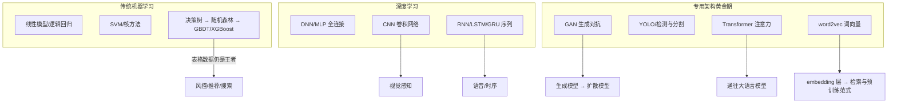
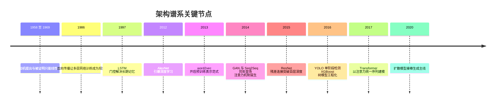
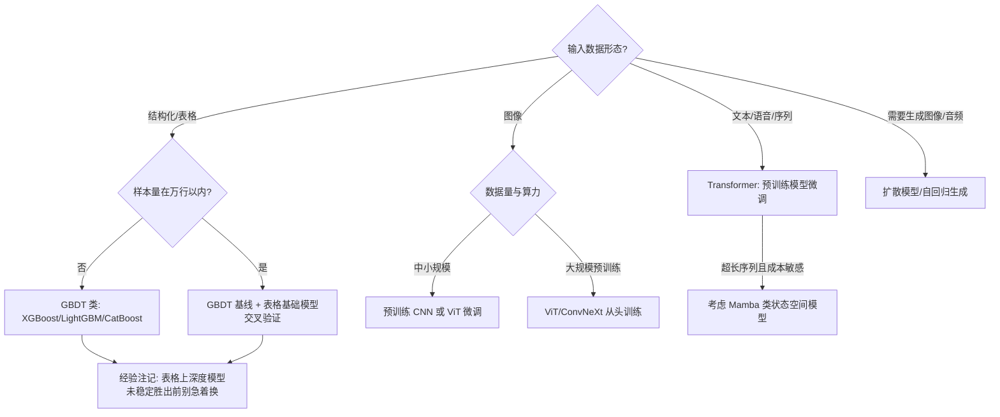
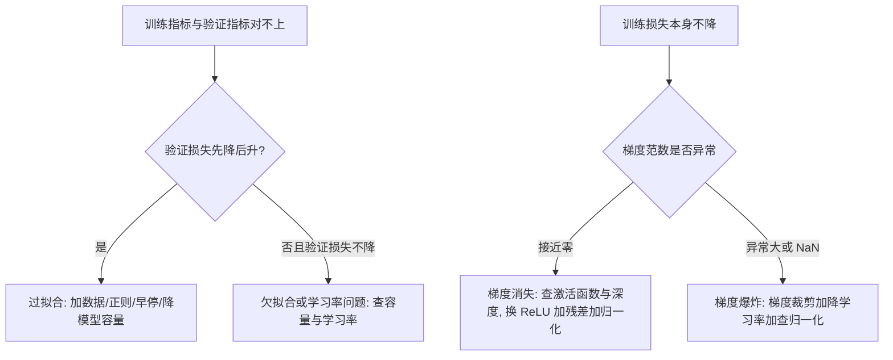

# 机器学习与深度学习经典架构

> 面向想把"大模型也看懂来路"的读者：补经典谱系的算法新人、需要在选型评审里回答"为什么不用大模型直接上"的架构师、以及面试前想系统过一遍架构史的人。这篇按时间线梳理从感知机到 Transformer 的完整谱系，对每个关键转折点讲清楚三件事——**它当年解决了什么问题、付出了什么代价、今天在系统里以什么形式活着**。全文主线只有一句：每一代架构都把人对数据的某种先验假设编进结构里，下一代用更弱的假设替换它，代价是更多的数据与算力。读完你应当能对着任何现代架构说出它携带的经典基因——残差连接来自 ResNet，注意力来自 RNN 的瓶颈，embedding 层来自 word2vec，它们都没有过时。

## 谱系总览

整个架构史可以概括成一句话：**每一代架构都把人对数据的某种先验假设编进结构里，而下一代用更弱的假设替换它，代价是换来更多的数据与算力需求**。线性模型假设"特征线性可加"，SVM 假设"存在一个最大间隔的划分面"，CNN 假设"局部相关 + 平移不变"，RNN 假设"历史可压缩为一个状态向量"，Transformer 则把结构假设降到最低——所以它必须靠最大的数据和算力喂养，回报是跨任务的普适性。



把这条谱系压到时间轴上，关键节点是这些：



注意箭头方向：这不是"替代"，而是**分工的固化**。我参与过的生产系统里，几乎没有哪一代架构整体退场——它们退居组件位置，让更合适的结构接管主链路。理解这一点，后面每一节的"今天的位置"才有落点。

## 传统机器学习：特征工程时代

### 线性模型：低矮但地基扎实

逻辑回归（一句话解释：把特征的加权和过一个 sigmoid 映射成概率）是工业界最老也最耐用的模型。它的全部能力就是"特征线性可加"这一条假设，换来三个至今稀缺的性质：**训练成本可忽略、单条预测毫秒级、每个特征的权重直接可读**。风控审批要能向监管解释"为什么拒贷"，逻辑回归的系数就是解释本身。

```text
p(y=1|x) = sigmoid(w·x + b) = 1 / (1 + exp(-(w·x + b)))
系数 w_i 的读法: 其他特征不变时, x_i 每增加 1 个单位, 对数几率 log-odds 增加 w_i
正则化: L2 压整体权重量级防过拟合; L1 产生稀疏解, 兼做特征选择
```

今天它依然存在——往往是作为复杂系统的最后一道兜底或校准层：大模型或 GBDT 输出分数之后，用逻辑回归做一次校准（calibration）把分数拉回真实概率，是我见过多次的标准做法。上线前我会检查三件事：特征是否做过单调性/分箱审查、系数符号是否符合业务先验、校准曲线在分数两端是否失真。

### SVM 与核方法：深度学习之前的最后一代荣光

支持向量机（SVM，一句话解释：找那个把两类样本分开、且离两边都最远的划分超平面）在 2000 年代是"高级机器学习"的代名词。它的核心直觉是**最大间隔**：不只要求分对，还要求分得"余裕最大"，最终决定超平面的只有离它最近的那几个样本——支持向量。这个约束让模型在小样本上也有很好的泛化边界，是当时少数有完整理论背书（统计学习理论、VC 维）的算法。


*图源：Wikimedia Commons（[文件页](https://commons.wikimedia.org/wiki/Svm_max_sep_hyperplane_with_margin.png)，public domain），最大间隔超平面与支持向量示意*

第二个关键设计是**核技巧**：数据在原始空间线性不可分时，不显式地把样本映射到高维空间（那可能无穷维），而是只替换内积计算为一个核函数（如 RBF 核），等价于在高维空间做线性划分——计算量几乎不变。这是机器学习史上最漂亮的数学设计之一。

工程上 SVM 的三个经验点，都是从调参血泪里来的：

- **必须先做特征缩放**：最大间隔对尺度敏感，特征不归一化时大尺度特征会主导超平面方向
- **C 与核参数的网格搜索不可省**：C 控制"间隔最大化"与"训练误差惩罚"的权衡，RBF 的 gamma 控制单个支持变量的影响半径，二者差一个数量级结果就可能天差地别
- **训练复杂度约在 O(n²) 到 O(n³)**：样本过万后训练时间开始难受，这是它在大数据时代退场的物理原因

SVM 退场的原因和它的优点同源：**它的表示是固定的**。核函数选定后，特征空间就定了，模型能力不随数据量增长而增长——十万样本和千万样本训出来的上限差不多，这在数据爆炸的年代是致命的；同时多分类、概率输出、大规模训练都要额外补丁。今天它的位置：小样本 + 高维稀疏场景（文本分类的老系统、部分生物信息学与工业质检任务）仍有人用；而"间隔"的思想活在了损失函数里（hinge loss、margin-based 对比学习）。我的经验边界是：样本上万、特征需要自己学的场景，不要再选 SVM。

### 决策树与集成学习：Bagging 和 Boosting 两条路

单棵决策树可解释但方差大（数据稍有扰动，树形就变），于是有了两条集成路线：

- **Bagging（随机森林）**：并行训练许多棵互不相同的树（每棵树看bootstrap抽样 + 随机特征子集），投票取平均——**降方差**，抗过拟合，几乎不用调参，是"先跑个基线"的默认选择
- **Boosting（GBDT）**：串行地训练树，每棵新树拟合前面所有树的残差（更准确说是损失函数的负梯度），逐步逼近目标——**降偏差**，精度上限高，但串行训练慢、对超参敏感

| 维度 | Bagging/随机森林 | Boosting/GBDT |
| --- | --- | --- |
| 组合方式 | 并行独立训练后投票 | 串行逐棵拟合残差 |
| 主要降低 | 方差（过拟合风险） | 偏差（欠拟合风险） |
| 训练并行度 | 树间完全并行 | 树间串行，树内可并行 |
| 调参敏感度 | 低，默认参数即能打 | 高，学习率/树深/轮数需调 |
| 典型选择时机 | 快速基线、噪声大的数据 | 冲精度上限、有调参预算 |

梯度提升（Gradient Boosting）的框架由 Friedman 在 2001 年前后奠定，XGBoost 官方教程也把自己的思想源头追溯到这条线。两条路线的差异决定了分工：要稳、要快、要省心选随机森林；要精度上限、愿意调参选 GBDT。

把 GBDT 的训练循环写成伪代码，"拟合负梯度"这件事就一目了然了：

```text
F_0(x) = 常数(如目标均值)                      # 初始化
for m = 1..M:                                  # 串行迭代 M 棵树
    r_im = -[∂L(y_i, F(x_i)) / ∂F(x_i)]        # 每个样本的负梯度, 即"残差"的推广
    训练一棵回归树 h_m 拟合 { (x_i, r_im) }     # 叶子内取最优叶权(二阶信息可修正)
    F_m(x) = F_{m-1}(x) + η · h_m(x)           # η 为学习率, 收缩防过拟合
```

### GBDT 到 XGBoost：把树模型做成工程系统

2016 年的 [XGBoost 论文](https://arxiv.org/abs/1603.02754)解决的不是算法问题而是**工程问题**：二阶泰勒展开加速优化（同时用一阶与二阶导数信息，收敛更快）、加权分位数草图处理稀疏与分位数分裂（在不可能枚举所有分裂点时给出有误差保证的候选点）、缓存感知的块结构支持核外计算（数据放不进内存时按块从磁盘读，预处理排序减少随机读）——它把 GBDT 从"能跑"做到"能在亿级样本上分布式地跑"。代价是系统复杂度上升、超参空间变大，但 Kaggle 时代"表格赛冠军几乎全是 XGBoost"的事实，证明这笔交换极其划算。

后来的 LightGBM 与 CatBoost 沿同一路线继续工程化，三者并称表格三巨头，差异集中在"怎么找分裂点、怎么长树、怎么处理类别特征"三个工程决策上：

| 维度 | XGBoost | LightGBM | CatBoost |
| --- | --- | --- | --- |
| 分裂点候选 | 预排序或分位数草图 | 直方图分桶，内存与速度大幅占优 | 直方图 + 有序 boosting |
| 树生长策略 | level-wise 逐层生长 | leaf-wise 选增益最大的叶子生长，更深更快但更易过拟合 | leaf-wise 对称树 |
| 类别特征 | 需预先编码 | 原生支持但语义简单 | 有序目标统计编码，抗目标泄漏，是其招牌 |
| 我遇到的典型场景 | 通用默认、需要稳 | 大数据量、追求训练速度 | 类别特征占比高的风控与广告数据 |

三个共通的超参经验（适用边界：万到亿级样本的表格任务）：**学习率与树轮数是一对跷跷板**（η 调小就把轮数加上去，通常 η=0.01~0.1 起步）；**max_depth/num_leaves 控制单棵树的表达力**，过深最先出现的症状是训练 AUC 涨、验证 AUC 平；**subsample/colsample 类随机化是免费的正则**，噪声大的数据上收益明显。调参顺序我一般是：学习率 + 轮数 → 树深/叶数 → 采样比例 → 正则项。

### 为什么风控与表格场景至今仍是树模型的天下

这个问题我被问过很多次，答案多年没变：**在结构化表格数据上，深度模型没有稳定优势，而劣势是全方位的**。

| 维度 | GBDT/XGBoost | 深度模型 |
| --- | --- | --- |
| 样本效率 | 数千至十万级样本即可打满 | 通常需要数量级更大的数据 |
| 类别/异质特征 | 原生处理，无需编码技巧 | 需要 embedding 等额外设计 |
| 可解释性 | 特征重要度/SHAP，监管可用 | 黑盒，解释是附加成本 |
| 训练与部署成本 | CPU 分钟级训练，部署极轻 | GPU 训练，推理链路更重 |

风控、推荐 CTR 预估、搜索排序这些场景的数据就是"百万样本 + 上千异质特征"的形态，恰好落在树模型的最优区间。我的经验边界是：当特征变成高维稠密信号（图像、文本、行为序列）时结论反转——但纯表格，2018 年的口诀到 2026 年依然成立。

需要记一笔的是 2025 年之后的新变量：**表格基础模型**开始正面挑战这个结论。TabPFN v2（[Nature, 2025](https://www.nature.com/articles/s41586-024-08328-6)）用 Transformer 在约 1.3 亿个合成数据集上预训练，推理时把"带标签的训练集 + 待预测样本"拼成一次 in-context learning 前向，宣称数秒内打过调参 4 小时的 GBDT 集成，适用边界约一万样本、五百特征以内；后续的 TabPFN-2.5 与 TabICL 把边界继续外推。截至 2026-09，我的判断是：它在**小数据、快速原型**场景确实值得进工具箱做交叉验证，但大表、强类别特征、需要可解释与稳定服务的生产链路，GBDT 仍是默认答案——而且 TabPFN 系权重多为非商业许可，商用前要先看许可证。

出现以下信号时，我会重新评估"表格是否还该用树"这个默认答案：

- 样本量长期停在一万行以内且无法扩充，GBDT 调参收益已经饱和
- 任务形态是"来了新数据集就要快速出模型"，没有调参人力（in-context 推理的优势场景）
- 特征以数值连续量为主、类别特征占比低（树的优势区恰恰相反）
- 反之，若监管要求逐特征归因、或表规模在千万行以上，结论不变：树模型或线性模型

## 从感知机到 MLP：深度学习的起点

### 感知机：一个神经元的起点与第一次冬天

1958 年 Rosenblatt 的感知机是今天一切神经网络的细胞：输入向量乘权重、求和、过阈值函数，输出 0 或 1；训练规则朴素到一句话——**分错了就把权重朝正确方向挪一点**，并有收敛定理保证线性可分数据上有限步收敛。


*图源：Wikimedia Commons（[文件页](https://commons.wikimedia.org/wiki/File:Perceptron.svg)，CC BY-SA 3.0），感知机结构示意*

它的死因和它的简单同源：1969 年 Minsky 与 Papert 在《Perceptrons》里严格证明了单层感知机**连异或（XOR）都学不会**——它只能画直线，而 XOR 需要画两条。更糟的是当时没有人知道多层感知机该怎么训练。论文引发资金撤离，神经网络进入第一段寒冬。这个教训值得记住：**一个架构的天花板由它的表示能力决定，而不是由它的热度决定**。

### 反向传播与 MLP：让"功劳分配"变得可计算

多层感知机（MLP，即全连接网络）的思想早在上世纪 80 年代就齐了：1986 年 Rumelhart 等人把**反向传播**普及化，补上了多层网络缺失的训练算法。反向传播本质是链式求导的系统化：损失对每一层参数的梯度 = 上游传回来的梯度 × 本层的局部导数，从输出层逐层往回传，每一层只算自己那一小段——"功劳分配"问题（credit assignment，每个神经元对最终错误负多少责）第一次有了可计算的解法。配合万能近似定理（单隐层足够宽即可逼近任意连续函数），MLP 在理论上已经什么都能拟合。


*图源：Wikimedia Commons（[文件页](https://commons.wikimedia.org/wiki/File:Colored_neural_network.svg)，CC BY 3.0），多层全连接网络示意*

但"能拟合"和"能训出来"之间隔了二十多年。真正让它可用的是三件小事的合流：**ReLU 激活**（导数在正半轴恒为 1，缓解深层 sigmoid 连乘导致的梯度消失）、**GPU** 把矩阵乘法训练变得现实、**ImageNet** 提供了百万级带标注数据。

反向传播的最小伪代码，把"每层只算自己那一段"的分工写清楚：

```text
前向: 逐层保存中间值   a_l = σ(z_l), z_l = W_l · a_{l-1} + b_l
损失: L = loss(a_L, y)
反向: δ_L = ∂L/∂a_L ⊙ σ'(z_L)              # 输出层的局部导数
      for l = L-1 .. 1:                     # 逐层往回传
          δ_l = (W_{l+1}^T · δ_{l+1}) ⊙ σ'(z_l)   # 上游梯度 × 本层局部导数
          ∂L/∂W_l = δ_l · a_{l-1}^T ;  ∂L/∂b_l = δ_l
更新: W_l -= η · ∂L/∂W_l                    #  SGD 或其变体
```

激活函数的选择直接决定 δ 在连乘中是衰减还是保持，这是"深网络能不能训"的第一变量：

| 激活 | 导数范围 | 深层连乘的后果 | 使用边界 |
| --- | --- | --- | --- |
| sigmoid | 最大 0.25 | 约 20 层后梯度到 1e-12 量级，浅层几乎不更新 | 仅输出层做二分类概率时用 |
| tanh | 最大 1.0 | 比 sigmoid 好但仍饱和衰减 | RNN/LSTM 门控内部仍常用 |
| ReLU | 正半轴恒为 1 | 梯度不衰减，但负半轴恒为 0 有"神经元死亡"风险 | 隐藏层默认选择 |

这里先埋一个伏笔：sigmoid 的导数最大值只有 0.25，二十层连乘就是 1e-12 量级——**梯度消失**是深网络时代前夜最大的敌人，后面 LSTM 与 ResNet 两节还会再见到它。

### AlexNet 时刻：为什么 2012 年是奇点

**2012 年 AlexNet 时刻**：Krizhevsky 等人用 8 层深度卷积网络拿下 ILSVRC 竞赛，top-5 错误率 15.3%，领先第二名 10.8 个百分点（此前几年的提升都是以零点几个百分点计的）。


*图源：Wikimedia Commons（[文件页](https://commons.wikimedia.org/wiki/File:AlexNet_block_diagram.svg)，CC BY-SA 4.0，Zhang/Lipton/Li/Smola 绘），AlexNet 层堆叠结构*

这篇论文的意义不在网络本身，而在于它一次性验证了"大数据 + GPU + 深度结构"的配方。我把它引爆的原因拆成四条，每一条单独看都不新，合起来是奇点：**深度加 ReLU**（8 层在当时算深，ReLU 让深网络训得动）、**Dropout**（随机丢弃神经元防过拟合，替代昂贵的集成）、**双 GPU 并行**（模型切两半放两块显卡，训练时间从月级降到周级）、**ImageNet 百万标注**（数据量第一次喂得饱这个规模的模型）。深度学习从此从学术边缘走向工业中心。

把 AlexNet 的层表抄在这里，是为了让你对"2012 年的深"有具体刻度——对比今天动辄上百层、千亿参数的模型，它浅得可爱，但每一类组件（大核卷积起步、池化降采样、超大全连接收尾、softmax 千类输出）都定义了此后五年的模板：

| 层 | 配置 | 输出尺度 |
| --- | --- | --- |
| Conv1 | 11×11 卷积 96 核，步长 4 + 最大池化 | 特征图边长约 27 |
| Conv2 | 5×5 卷积 256 核 + 最大池化 | 边长约 13 |
| Conv3-5 | 3×3 卷积 384/384/256 核，Conv5 后池化 | 边长 6 |
| FC6/FC7 | 4096 维全连接 + Dropout | 参数主体所在 |
| FC8 | 1000 维 softmax | ImageNet 千类 |

代价同样清楚：全连接参数爆炸（对图像尤其如此，AlexNet 约 6000 万参数里九成在全连接层）、对输入结构毫无先验假设、需要海量数据喂养。这两个遗留问题直接催生了后面两大分支——CNN 把"空间结构"编进网络，RNN 把"时间结构"编进网络。

### BatchNorm：2015 年的另一位功臣

与 ResNet 同年，还有一个让深网络训练"变成默认能成"的组件：[Batch Normalization](https://arxiv.org/abs/1502.03167)（Ioffe & Szegedy, 2015）。机制一句话：每层激活之前，对该层每个神经元维度在 batch 内做零均值单位方差归一化，再用两个可学习参数把表示能力找回来。

```text
某层某维度在 batch 内的统计量: μ_B, σ_B^2
归一化:  x_hat = (x - μ_B) / sqrt(σ_B^2 + eps)
重构:    y = γ ⊙ x_hat + β          # γ、β 可学习; 取 γ=σ_B、β=μ_B 时等价恒等变换
推理期:  用训练时统计量的滑动平均替代 batch 统计量, 保证单条推理的确定性
```

原论文给出的解释是"抑制内部协变量偏移"，后续研究（如 Santurkar et al. 2018）修正了说法：真正的收益更接近**平滑损失曲面**——归一化后损失面更平缓、梯度 Lipschitz 常数更小，于是大学习率与随机初始化都变得可用。它今天的位置很有代表性：CNN 世界里仍是标配（部署时常与卷积算子融合成一条指令）；Transformer 世界里被 [LayerNorm](https://arxiv.org/abs/1607.06450) 取代——按样本沿特征维度归一化、不依赖 batch，对变长序列与小 batch 更稳。"归一化"这个思想本身，与残差、注意力并列为现代深度架构的三根支柱。

## CNN：视觉感知的基石

### 架构思想：把物理先验写进结构

卷积网络只做三件事：**局部连接**（每个神经元只看局部窗口，因为像素的相关性是局部的）、**权值共享**（同一个卷积核扫过全图，因为"边缘"这种模式在哪里出现都一样）、**池化下采样**（容忍微小位移，逐步扩大感受野）。这三条合起来就是"平移不变性 + 层次化特征"的显式编码。

参数量对比能把"先验换效率"讲得最透：对 224×224×3 的图像，接一个 4096 神经元的全连接层需要约 6 亿参数；而一个 3×3×3→96 的卷积层只有 2688 个参数，却能覆盖全图任意位置的同类模式。**归纳偏置换参数效率**，这是 CNN 给所有后来者的第一课。

卷积层的尺寸算术是调结构时的日常计算，记住一条公式就够用：

```text
输出边长 = (输入边长 - 卷积核 K + 2 × 填充 P) / 步长 S + 1
参数量   = K × K × 输入通道 × 输出通道 + 输出通道(偏置)
感受野   : 每叠加一层, 单个输出单元能看到的输入区域扩大 K-1 (乘以下游步长)
          —— 深层单元"看到"的是整图, 浅层单元只看到局部纹理
```

感受野这个概念值得多想一秒：它解释了为什么 CNN 天然是"层次化"的——浅层学边缘与纹理，中层学部件，深层学对象，**每一层的抽象级别由它的感受野大小决定**，而不是人为规定的。


*图源：Wikimedia Commons（[文件页](https://commons.wikimedia.org/wiki/File:Convolutional_neural_network,_convolution_worked_example.png)，CC BY 4.0，Daniel Voigt Godoy 绘），卷积核滑动计算的逐步示例*

经典 CNN 的骨架高度稳定：卷积层堆叠提特征、池化层降分辨率、末尾全连接层做决策，从 LeNet 到 AlexNet 都是这个模板。


*图源：Wikimedia Commons（[文件页](https://commons.wikimedia.org/wiki/File:Alexnet.png)，CC BY-SA 4.0），经典 CNN 的卷积层加全连接层块状结构*

### 演进线：每一代解决一个问题

LeNet（手写数字）→ AlexNet（深度 + GPU）→ VGG（证明"堆深度"有效）→ GoogLeNet（Inception 模块做多尺度）→ **ResNet（残差连接，深度破百）** → EfficientNet（复合缩放统一调深度/宽度/分辨率）→ ConvNeXt（用 Transformer 时代的训练配方反哺纯卷积）。

| 代际 | 解决的问题 | 关键手段 | 代价 | 今天的位置 |
| --- | --- | --- | --- | --- |
| LeNet/AlexNet | 端到端学特征替代手工特征 | 卷积 + 池化 + GPU | 全连接层参数爆炸 | 教学与嵌入式小模型 |
| VGG | 深度到底有没有用 | 全部 3×3 小卷积核堆叠 | 19 层、1.4 亿参数，推理重 | 特征提取器（感知类损失常用 VGG 特征） |
| GoogLeNet | 多尺度特征与计算预算 | Inception 多分支并联 + 1×1 降维 | 结构复杂难调 | 思想被多分支设计继承 |
| ResNet | 深网络退化问题 | 残差恒等捷径 | 分支结构、深度带来延迟 | 一切深网络的默认组件 |
| EfficientNet | 缩放靠拍脑袋 | 深度/宽度/分辨率复合系数 | 搜索成本高 | 移动端与边缘部署常用骨干 |
| ConvNeXt | CNN 是否被 Transformer 淘汰 | 纯卷积 + 现代训练配方 | 无局部先验之外的新假设 | 与 ViT 并列的视觉骨干选项 |

VGG 的"两个 3×3 叠起来"值得单独说一句：感受野等价于一个 5×5，但参数只有后者的 18/25，还多了一次非线性——**用小核堆深度换感受野**，是它留给后世的标准操作。值得一提的是 2016 年 AlphaGo 的策略网络与价值网络同样是 CNN——深度感知在视觉之外拿到的里程碑时刻，是它把棋盘当作图像来理解。

### ResNet：一次把"深度"从诅咒变成资源

这是我认为最值得逐段读的论文之一。它解决的问题常被误说成"梯度消失"——论文的实际观察更微妙：**56 层网络的训练误差比 20 层还高**，这不是过拟合（过拟合应表现为训练误差低、验证误差高），而是**退化问题（degradation）**：更深的网络连"至少和浅网络一样好"都做不到，因为优化器找不到那条退化解。

解法优雅得惊人：与其让层学习完整映射 `H(x)`，不如让它学残差 `F(x) = H(x) - x`，再用一条恒等捷径把 `x` 加回来。恒等映射是零成本的保底——网络只需在"有用"时才偏离。

```text
普通块:  y = F(x)               # 层直接学目标映射
残差块:  y = F(x) + x           # 层学"与恒等的偏差"
         若最优解接近恒等, F(x) → 0 比 F(x) → x 容易优化得多
反向传播: ∂y/∂x = ∂F/∂x + 1     # 梯度里永远有一个不衰减的 1
```

为什么这就解决了退化？我习惯拆成三层讲：**其一**，解空间里永远包含"恒等映射"这个不差于浅网络的解（令 F(x)=0 即可），深网络至少不会更坏；**其二**，反向传播时梯度可以沿恒等捷径无损直达任意浅层，梯度消失被结构性绕开；**其三**，集成视角——残差网络行为上近似大量浅路径的集成，删掉几层性能只平滑下降而不崩塌。代价是引入分支结构，对早期硬件的内存访问不够友好，且深度带来的推理延迟是实打实的。回报则改变了一切：152 层网络（比 VGG 深 8 倍但计算量更低）、ImageNet 集成 3.57% 错误率、横扫 2015 年 ILSVRC 与 COCO 全部任务。


*图源：Wikimedia Commons（[文件页](https://commons.wikimedia.org/wiki/File:ResBlock.png)，CC BY-SA 4.0），依据 ResNet 论文原图重绘*

更关键的是思想遗产：**"学习增量比学习完整映射容易"**。这个洞察后来成为所有深度架构的默认配置——Transformer 的每个子层都是 `x + Sublayer(x)`，没有残差连接，就没有百层以上的任何现代网络。不看 ResNet，不懂这一条，看大模型架构就是隔靴搔痒。

## RNN/LSTM/GRU：序列建模时代

### RNN：把历史压缩成一个状态向量

循环网络的假设是：历史可以被压缩成一个隐状态向量，每来一个新输入就更新一次状态（`h_t = f(W_h h_{t-1} + W_x x_t)`）。这让网络天然适配语言、语音、时序。但原始 RNN 有个致命伤——训练要沿时间步展开（BPTT，backpropagation through time），链式求导意味着损失对早期步的梯度是**一连串雅可比矩阵的连乘**：每步的乘子略小于 1，十步百步之后指数衰减到机器精度以下；略大于 1 则指数爆炸。**十几步以前的信息基本学不到**，这就是梯度消失/爆炸在序列上的形态。

把连乘写出来，量级感就出来了：

```text
∂L/∂h_k = ∂L/∂h_T × Π_{t=k+1..T} ∂h_t/∂h_{t-1}      # T 为当前步, k 为早期步
每个 ∂h_t/∂h_{t-1} ≈ W_h^T ⊙ σ'(z_t)                 # 同一权重矩阵反复参与连乘
若其谱半径 ρ < 1: 距离 T-k 步的梯度按 ρ^(T-k) 衰减
   ρ=0.9、相隔 50 步 → 约 5×10^-3; 相隔 200 步 → 约 7×10^-10
若 ρ > 1: 梯度爆炸, 表现为损失 NaN 或剧烈震荡 → 梯度裁剪只能治这一半
```

### LSTM：门控机制逐步拆解

LSTM（1997 年，Hochreiter 与 Schmidhuber）用**门控机制**解决。核心是一条**细胞状态 C_t**——像传送带一样贯穿所有时间步，只接受加性修改；三个门（遗忘门为 2000 年 Gers 等人补充）以乘性方式决定传送带上内容的删与写：

1. **遗忘门** `f_t = sigmoid(W_f · [h_{t-1}, x_t] + b_f)`：输出 0 到 1 的向量，逐元素决定旧细胞状态 `C_{t-1}` 的每个分量保留多少（0 为全忘，1 为全留）
2. **输入门 + 候选值** `i_t = sigmoid(...)`、`g_t = tanh(...)`：决定新信息中哪些维度、以多大强度写入
3. **细胞状态更新** `C_t = f_t * C_{t-1} + i_t * g_t`：注意这里是**逐元素乘加**——梯度沿 C 的通路回传时只乘门值（训练良好时接近 1），不再连乘小导数，长期记忆由此成为可能
4. **输出门** `o_t = sigmoid(...)`、`h_t = o_t * tanh(C_t)`：决定此刻对外暴露细胞状态的哪一部分作为隐状态

四条公式合在一起就是 LSTM 的全部，符号统一写成"拼接 [h_{t-1}, x_t] 过线性层再过门激活"：

```text
f_t = σ(W_f · [h_{t-1}, x_t] + b_f)      # 遗忘门: 旧记忆保留比例
i_t = σ(W_i · [h_{t-1}, x_t] + b_i)      # 输入门: 新记忆写入比例
g_t = tanh(W_g · [h_{t-1}, x_t] + b_g)   # 候选记忆: 写入内容的草稿
C_t = f_t ⊙ C_{t-1} + i_t ⊙ g_t         # 细胞状态: 乘加更新, 梯度高速公路
o_t = σ(W_o · [h_{t-1}, x_t] + b_o)      # 输出门: 对外暴露比例
h_t = o_t ⊙ tanh(C_t)                    # 隐状态: 本步对外输出
```

| 门 | 激活 | 直觉角色 | 训练良好的典型取值 |
| --- | --- | --- | --- |
| 遗忘门 f | sigmoid | 传送带上旧内容的"擦除比例" | 接近 1（大部分保留） |
| 输入门 i | sigmoid | 新内容的"写入开关" | 稀疏，少数维度开启 |
| 输出门 o | sigmoid | 细胞状态的"曝光度" | 随任务波动 |
| 候选 g / 输出 tanh | tanh | 内容草稿与输出缩放 | 零均值波动 |

这张表也解释了 LSTM 为什么能记住长程信息：C 的更新是**加法**，回传梯度时乘的是 f（接近 1）而不是小导数，于是"梯度高速公路"成立——这与后来 ResNet 的恒等捷径是同一个思想在时间维度上的先行版本。


*图源：Wikimedia Commons（[文件页](https://commons.wikimedia.org/wiki/File:The_LSTM_cell.png)，CC BY 4.0），依据 Chris Olah《Understanding LSTM Networks》博客图重绘*

GRU（2014，[Cho et al.](https://arxiv.org/abs/1406.1078)）把三个门化简为两个（更新门合并遗忘与输入、重置门控制读历史），参数约少三分之一、效果接近，是"算力紧就换 GRU"的经验来源。

```text
重置门 r_t = σ(W_r · [h_{t-1}, x_t])        # 写候选时读多少历史
候选   h~_t = tanh(W · [r_t ⊙ h_{t-1}, x_t])
更新门 z_t = σ(W_z · [h_{t-1}, x_t])        # 旧状态与新候选的混合比例
状态   h_t = (1 - z_t) ⊙ h_{t-1} + z_t ⊙ h~_t   # 与 LSTM 同源的"加法式"凸组合更新
```

LSTM/GRU 的代价是结构复杂、超参敏感，且**计算必须沿时间步串行——无法并行**，这条后来成了它的死因。

### Seq2Seq 与注意力的诞生

Seq2Seq（编码器-解码器，2014 年 [Sutskever 等人](https://arxiv.org/abs/1409.3215)用于机器翻译）代表了这个时代的顶峰形态：编码器 RNN 把源句逐步读成一个固定长度向量，解码器 RNN 从该向量出发逐词生成译文。但它有一个结构性瓶颈：**整句源语言被压缩进一个固定长度向量**，句子一长，信息瓶颈立刻显现——长句翻译质量断崖式下跌。

2014 年 [Bahdanau 等人](https://arxiv.org/abs/1409.0473)的解法载入史册：让解码器在生成每个词时**回头看编码器的所有隐状态，动态计算对齐权重**——对每个解码步 i，用一个小网络给每个编码隐状态 h_j 打分 `e_ij = a(s_{i-1}, h_j)`，softmax 成权重后加权求和得到上下文向量 `c_i`。这就是注意力机制的诞生：从"整句压缩一次"变成"每步按需检索"。论文里那张法英翻译的对齐矩阵图，是注意力最直观的证据——对齐权重自动学出了词与词的对应，包括语序颠倒的部分。


*图源：论文原图（[arXiv:1409.0473](https://arxiv.org/abs/1409.0473) 图 3），法英翻译的注意力对齐可视化*

它最初只是 RNN 的一个补丁，没人预料到四年后它会反客为主。把注意力写成伪代码，可以看出它离 Transformer 只差"去掉 RNN"这一步：

```text
编码器: h_1..h_N = RNN_encode(源句)            # 所有隐状态都保留, 不再压缩
解码第 i 步:
    e_ij = a(s_{i-1}, h_j)   for j = 1..N      # 对齐打分: 小前馈网络
    α_ij = softmax_j(e_ij)                     # 归一化成注意力权重
    c_i  = Σ_j α_ij · h_j                      # 加权求和得到本步上下文
    s_i  = RNN_decode(s_{i-1}, c_i, 上一步输出)  # 带着"按需检索"的结果继续生成
```

### 应用黄金期与谢幕

同期的黄金应用还包括语音识别（RNN-CTC 一度是主流方案，细节见[语音识别与理解](/ai/models/audio)）与 WaveNet 式的自回归音频生成（DeepMind 2016 年用膨胀卷积自回归生成原始音频波形，是"逐元素自回归生成"路线的早期证明，为后来的语音合成埋下伏笔）。

RNN 时代的两条教训直接塑造了下一代架构：**串行计算是规模化的敌人**（训练无法吃满 GPU），**固定状态向量是有损压缩**（长程依赖靠门控维持，终究会衰减）。"状态与记忆"的命题并未消亡——2023 年 Mamba 等选择性状态空间模型以线性复杂度回归，2024 年的 Mamba-2 进一步打通了状态空间模型与注意力的数学联系（SSD 框架），长序列、低成本场景里"注意力 + SSM 混合"已是 2025-2026 年的活跃方向，可以看作这条线的当代回声。

## 词向量：把意义变成几何

### word2vec 的两种架构

2013 年 Mikolov 等人的 [word2vec](https://arxiv.org/abs/1301.3781) 解决的是一个看似不起眼的问题：怎么把词变成向量，让"意义相近的词距离近"。在此之前词是 one-hot 孤立项，"猫"和"狗"的距离与"猫"和"汽车"没有区别。word2vec 的答案是把词向量当作**一个预测任务的副产品**来训练，两条架构互为镜像：

- **CBOW**：用上下文窗口内的词预测中心词（`w_{t-2}...w_{t+2} → w_t`），平滑稳定，适合语料小的场景
- **Skip-gram**：用中心词预测上下文（`w_t → w_{t±1}, w_{t±2}`），对低频词与短语更敏感，大语料上效果更好


*图源：Wikimedia Commons（[文件页](https://commons.wikimedia.org/wiki/File:CBOW_eta_Skipgram.png)，CC BY-SA 4.0），CBOW 与 Skip-gram 架构及目标函数*

训练上的关键工程决策是**负采样**：不对十万级词表做完整 softmax，而是每步只抽几个负例词做二分类，把每步复杂度从 O(词表) 降到 O(常数)——这是 word2vec 能在单机上吃下百亿词语料的原因。训出来的 300 维向量甚至能满足 `king - man + woman ≈ queen` 这类线性类比，意义第一次变成了可计算的几何。

| 维度 | CBOW | Skip-gram |
| --- | --- | --- |
| 预测方向 | 上下文 → 中心词 | 中心词 → 上下文 |
| 对低频词 | 弱（被高频上下文稀释） | 强（每个词都作为中心词训练多次） |
| 训练速度 | 快 | 慢 |
| 典型选择 | 语料中小、要稳 | 语料大、要质量，论文与工业默认 |
| 窗口大小影响 | 窗口大偏主题/语义相似 | 窗口小偏句法/可替换性 |

### 为什么它是范式转折点

word2vec 的历史地位不在向量本身，而在它确立的范式：**表示可以预先在无监督语料上学好，再迁移给下游任务**——"预训练 + 微调"的种子在这里。它的直接后继（GloVe、fastText、ELMo）一路演化到 Transformer 的 contextual embedding；而"embedding 层"今天是一切大模型的输入层标配，检索与 RAG 系统里"语义相似度 = 向量距离"的假设也源自这条线（工程形态见 [RAG 架构](/ai/application/rag-architecture)）。词向量作为独立技术已被上下文表示取代，但"把离散符号嵌入连续空间"这一步，是深度学习处理语言的地基。

它的局限也指明了下一站的方向：**一词一向量**——多义词（"苹果"的水果义与公司义）被强行压进同一个点；向量训完即固定，不随句子变化。这两个局限的解法是"表示必须随上下文动态计算"，即 ELMo 与 Transformer 的上下文嵌入。词向量时代至此谢幕，但它留下的两样东西被完整继承：预训练再复用的工作流，以及"用类比与相似度基准评估表示质量"的方法论。

## GAN：生成模型的第一课

### 对抗机制：二人博弈的 minimax

2014 年 Goodfellow 的 GAN 提出了一个当时颇为激进的想法：不去直接建模数据分布（似然估计很难），而是训练两个网络博弈——**生成器** G 从噪声 z 造假数据，**判别器** D 鉴别真假，双方在 minimax 目标下互相进化：

```text
min_G max_D  V(D, G) = E_x~pdata [log D(x)] + E_z~pz [log(1 - D(G(z)))]

训练循环（交替优化，通常 D 走 k 步、G 走 1 步）:
  1. 采样真实 batch x 与噪声 batch z
  2. 固定 G，上升一步: 最大化 log D(x) + log(1 - D(G(z)))   # D 学会分辨
  3. 固定 D，下降一步: 最小化 log(1 - D(G(z)))               # G 学会骗过 D
  4. 重复直至 D 的输出稳定在 0.5 附近（理论纳什均衡）
```

理论上当判别器无法分辨（输出恒为 0.5）时，生成器就学到了真实分布。


*图源：[维基百科 GAN 条目](https://en.wikipedia.org/wiki/Generative_adversarial_network)示意图（[文件页](https://commons.wikimedia.org/wiki/File:Generative_adversarial_network.svg)，CC BY-SA 4.0，绘自《动手学深度学习》）*

### 模式崩溃与训练不稳定

GAN 付出的是**训练稳定性**：两个网络的博弈均衡极难到达，超参、初始化、架构的微小变化都可能让训练发散；以及**模式坍缩（mode collapse）**——生成器发现某种样本总能骗过判别器，于是只生成那一种，多样性崩塌。根因可以讲得很具体：当生成分布与真实分布的支撑集不重叠时（高维空间里两个低维流形几乎必然不重叠），原始目标的梯度会饱和消失，判别器"过于强大"反而让生成器无路可走；模式坍缩则是生成器在梯度信号下的理性短路——骗过 D 的最省事办法是重复少数安全样本。这两个问题催生了 WGAN（换用 Wasserstein 距离做目标，缓解梯度饱和）等一系列修补工作，但始终没有根治。

实践里我给 GAN 训练做健康诊断的三件套，比盯损失数字有效得多：

- **看多样性**：批量生成几百张样本看分布覆盖，"同一张脸换发型"就是模式坍缩的信号；单样本质量再好也不能下结论
- **看判别器输出分布**：D 对真假样本长期输出接近 0 或 1，说明博弈已崩、生成器拿不到有效梯度；健康状态是在 0.5 附近拉锯
- **看震荡模式**：G/D 损失剧烈震荡并发散，先怀疑学习率与架构不匹配；换 WGAN-GP 的梯度惩罚通常比细调超参见效快

### 演进线与历史地位

演进线：原始 GAN → DCGAN（用卷积替代全连接、给出稳定训练的架构约定，训练稳定性大幅提升）→ Conditional GAN（把条件信息引入生成）→ CycleGAN（无配对数据的风格互译）→ StyleGAN（渐进式生成 + 风格控制，把人脸生成做到以假乱真，成为 GAN 时代的天花板）。

历史地位却毋庸置疑：GAN 第一次证明"生成"可以作为独立任务被端到端优化，直接引爆了生成式 AI 的研究热度。它的思想遗产以两种形式活在今天：**扩散模型接过了"稳定生成"的命题**（2020 年 DDPM 用加噪-去噪的固定流程替代对抗博弈，训练稳定性成为扩散模型对 GAN 的决定性优势，详见[图像生成](/ai/models/image-gen)）；而**判别器思想**活在扩散模型的蒸馏加速（如 LCM 一致性蒸馏）与图像质量自动评估里。

## YOLO 与目标检测：实时感知的工业化

### 从两阶段到单阶段：把检测改写成回归

检测任务的主线是从两阶段到单阶段。R-CNN 系（2014）先提候选框（selective search 约两千个）、再逐框过 CNN 提特征、再送 SVM 分类——三段串行流水线，精度高但慢到无法在线服务（单图秒级到十秒级）。2016 年 [YOLO](https://arxiv.org/abs/1506.02640) 把检测改写成**单次前向回归**：图像切成 S×S 网格，每个格子直接回归 B 个边界框（坐标 + 置信度）加类别概率，一次前向同时输出所有框——速度换精度（v1 在 GPU 上 45 FPS，快变体 155 FPS），之后的版本（v3 多尺度预测、v5 PyTorch 工程化、v8+ Anchor-Free 与解耦头）再把精度一点点追回来，成为工业部署量最大的检测家族。


*图源：论文原图（[arXiv:1506.02640](https://arxiv.org/abs/1506.02640) 图 1），YOLO 将检测建模为单阶段回归*

YOLO 的输出张量形状值得记一下，它是"检测即回归"的全部信息载体：`S × S × (B×5 + C)`——每个网格格子输出 B 个框，每框 5 个数（x、y、w、h、置信度），外加 C 个类别概率；v1 取 S=7、B=2、C=20，即 7×7×30 的张量一次前向吐出。"哪个格子负责哪个目标"由目标中心点落在哪个格子决定，这个约定简单粗暴，也带来了小目标与密集目标的先天短板——后续版本的多尺度预测与 Anchor-Free 设计都是在补这一课。

| 版本 | 关键改动 | 工程意义 |
| --- | --- | --- |
| v1 (2016) | 检测改单阶段回归 | 45 FPS，实时检测成为可能 |
| v3 (2018) | 多尺度预测、Darknet-53 | 小目标召回显著改善 |
| v5 (2020) | PyTorch 实现、一键训练导出 | 生态爆发，工业部署量最大 |
| v8 (2023) | Anchor-Free、解耦头 | 精度追平两阶段的部分场景 |
| v12 (2025) | 区域注意力骨干 | 注意力进入实时检测且不掉速 |

### 工程方法论与今天的位置

对我影响最大的是它的方法论：**一个架构的成功 = 论文创新 × 工程可复现性 × 部署友好度**。YOLO 每一代的论文贡献未必最惊艳，但"下载即可训练、导出即可部署"的体验让它赢了生态。这条经验放在今天的模型选型里依然成立。

截至 2026-09，这条线仍在快速演进：Ultralytics 的 YOLOv8/v11 把训练导出体验做到极致，[YOLOv12](https://arxiv.org/abs/2502.12524)（NeurIPS 2025）则用区域注意力（Area Attention）把 Transformer 的注意力机制塞进实时检测骨干，在保持 CNN 级推理速度的同时拿到注意力级的精度——注意力机制对 CNN 最后一块实时领地的反攻，值得跟踪；另一条线 RT-DETR 则把 DETR 系端到端检测做到了实时档。边缘设备上的检测选型，我的默认顺序仍是：先 YOLO 系打基线，精度不够再上两阶段或 DETR 系。

## Transformer：统一一切的注意力机制

### 核心机制

2017 年 [Attention Is All You Need](https://arxiv.org/abs/1706.03762) 把 Bahdanau 时代的补丁扶正为主结构：**Self-Attention 让序列中任意两个位置直接交互**，一步完成信息交换——RNN 需要逐步传递的长程依赖，在这里变成一次矩阵乘法。机制上就是三步：每个 token 线性投影出 Query/Key/Value 三组向量；用 `Attention(Q,K,V) = softmax(QK^T / sqrt(d_k)) V` 让每个位置按相关性加权聚合全序列的 Value；Multi-Head 让多组注意力在不同子空间并行观察（有的头可能学到语法、有的学到指代）。位置编码则把"顺序"这一被抛弃的信息从外部补回。每个子层外套残差连接与层归一化——残差这一笔，正是 ResNet 的遗产。

把单头自注意力展开成计算步骤，每一步都是矩阵运算，没有循环：

```text
输入 X: n × d  (n 为序列长度, d 为模型维度)
1. 投影:  Q = X W_Q,  K = X W_K,  V = X W_V        # 三组可学习线性层
2. 打分:  S = Q K^T / sqrt(d_k)                    # n × n 相关性矩阵, 缩放防 softmax 饱和
3. 归一:  A = softmax(S, 按行)                      # 每行是"我看各位置的权重"
4. 聚合:  O = A V                                   # 每个位置得到全序列的加权和
5. 多头:  把 d 切成 h 份并行做 1-4, 拼接后再过一次线性层
复杂度:  时间 O(n^2 · d), 显存 O(n^2)                # 平方级的来源就在第 2、3 步
```

原论文表 1 把三类序列架构的算力账算得很清楚，这张表是理解"Transformer 为什么赢"的钥匙：

| 架构 | 每层计算量 | 串行操作数 | 任意两位置最大路径长度 |
| --- | --- | --- | --- |
| 自注意力 | O(n^2 · d) | O(1) | O(1) |
| 循环 RNN | O(n · d^2) | O(n) | O(n) |
| 卷积 CNN | O(k·n·d^2)，k 为核宽 | O(1) | O(log_k n)（空洞/步长卷积） |

读法：当 n 小于 d（语言任务里序列长度通常小于模型维度）时，自注意力每层计算量反而比 RNN 小；而串行操作数与路径长度两项，RNN 是 O(n)、自注意力是 O(1)——**并行效率与长程依赖这两件事，被同一次矩阵乘法一起解决**。


*图源：论文原图（[Attention Is All You Need](https://arxiv.org/abs/1706.03762) 图 1）*

### 解决了什么，代价是什么

它解决的是 RNN 时代的两条死因：**串行依赖被彻底移除**（整个序列可并行训练），**任意位置间梯度路径长度为 1**（长程依赖不再衰减）。论文给出的数字放在今天看依然震撼：WMT 2014 英德翻译 28.4 BLEU（超过当时最好的集成模型 2 分以上）、英法 41.8 BLEU，而训练只用了 8 块 GPU × 3.5 天——原论文摘要把"更可并行、训练时间大幅缩短"放在与精度同等的位置，这个排序本身就是宣言。

代价同样写在复杂度里：**注意力是序列长度的平方级开销**，长上下文意味着平方级的计算与显存增长——这正是此后多年稀疏注意力、KV Cache 优化、线性注意力研究的动力来源（工程侧的应对见[LLM 推理](/ai/infra/inference/llm-inference)）。结构假设弱也是双刃剑：没有局部性先验，小数据上反而不如 CNN。

### 三分支与获胜逻辑

同一结构衍生出三条路线：**Encoder-only**（BERT，双向理解，适合分类/检索）、**Decoder-only**（GPT，自回归生成，最终通往大语言模型）、**Encoder-Decoder**（T5，输入转输出，适合翻译/摘要）。

它为什么赢？三点合力：**并行训练效率**吃满硬件红利、**规模可加性**（加层加宽即变强，几乎不遇到结构性的天花板）、**归纳偏置弱**（结构不预设答案，靠数据学到一切）——这三点恰好与 Scaling Law 完全咬合。余波扩散到所有模态：ViT（视觉）、Whisper（语音）、AlphaFold（蛋白质）、DiT（生成）。通往大模型的完整链路，见[大语言模型架构解析](/ai/models/llm)。

## 经典架构在大模型时代的位置

写到这里可以做一次盘点——这些"旧"架构今天活在系统里的四种形态：

- **GBDT → 特征工程的遗产**。树模型仍是结构化数据的事实标准；而深度时代沉淀的特征表示（embedding、统计特征）反过来成为树模型的新输入，"深度表示 + 树模型决策"的混合管线在推荐与风控里很常见。2025 年起表格基础模型在小数据区间发起挑战，但生产主链路的默认答案暂时没变
- **CNN → 大模型的视觉编码器**。多模态大模型的视觉塔本质上仍是视觉编码器（ViT 或其混合变体）；ConvNeXt 则证明：把 Transformer 时代的训练配方还给纯卷积，CNN 依然能打——视觉路线的细节见[视觉理解](/ai/models/vision)
- **RNN 的教训 → 注意力与状态空间**。注意力的诞生史就是 RNN 瓶颈的破解史；而"状态与记忆"命题在 Mamba 类模型里回归，Mamba-2 与注意力-SSM 混合骨干是 2025-2026 年长序列、低成本场景的活跃方向
- **GAN 的思想 → 扩散模型**。对抗博弈让位于稳定的去噪过程，但判别器活在蒸馏加速与质量评估里；生成主线的完整展开见[图像生成](/ai/models/image-gen)

把这四种形态翻译成 2026 年的工程语言，就是几条可以直接执行的观察：

- 打开任何一个多模态大模型的配置，视觉塔是 ViT 或 ConvNeXt 变体、输入层是 embedding、每个子层带残差——**经典架构以组件身份活在每一个现代模型里**，没有一个是"过时技术"
- 在线服务的延迟预算里，轻量 CNN 与树模型承担大头流量、大模型承担难例，这种**分层蒸馏式部署**是我见过的最常见形态
- 长上下文成本压力让 SSM 混合骨干重新进入选型清单，**"RNN 的精神后裔"第一次有了和注意力正面比性价比的机会**
- 生成侧 GAN 已基本退出新系统设计，但**判别器作为评估器与蒸馏教师**的角色反而在扩大

站在 2026 年，面对一个新任务，我的选型路径大致如下：



## 实践观点与常见坑

- **选型优先级多年没变**：表格数据先试树模型，感知任务用预训练 CNN/ViT 微调，序列任务直接上 Transformer——2018 年成立的口诀，2026 年依然成立，变的只是预训练模型的获取成本降到了接近零
- **经典架构是理解大模型的钥匙**：不看 ResNet 不懂残差为何是标配，不看 Seq2Seq 不懂 Encoder-Decoder 的来龙去脉，不看 GAN 不懂扩散模型为什么那样设计训练目标，不看 word2vec 不懂 embedding 层从何而来
- **蒸馏与融合是生产常态**：真实的在线系统里，BERT 级编码器、轻量 CNN、树模型常常与大模型共存——贵的模型做难的事，便宜的模型兜住量大的事，合适的组件做合适的事
- **特征工程决定传统模型的上限**：树模型与线性模型时代，80% 的收益来自特征与标签口径；深度时代这部分工作变成了数据清洗与预训练语料构造——形式变了，"垃圾进垃圾出"没变。我常用的特征自检清单：
  - 标签口径是否与业务目标对齐（逾期 30 天还是 90 天，差一个定义差一个模型）
  - 是否存在时间泄漏：特征的计算时点必须不晚于预测时点，用"as-of 时间戳"逐特征审查
  - 线上线下特征口径是否一致：同一特征两套代码是线上事故的经典来源，尽量单一来源导出
  - 类别特征的基数与缺失语义：缺失本身是否是信号（"没有填收入"往往就是信息）
- **过拟合与欠拟合先用曲线诊断**：看训练/验证两条损失曲线的分离时机，比调任何超参都先做（判断流程见下图）。经验边界：小数据上分离几乎必然出现，此时优先加数据或做增强，而不是先调正则强度



| 坑 | 现象 | 根因与对策 |
| --- | --- | --- |
| 表格数据直接上深度模型 | 效果不如 GBDT，成本翻倍 | 样本量与特征形态不匹配；先用 XGBoost/LightGBM 打基线 |
| 盲目堆深度 | 更深的网络训练误差反而更高 | 退化问题而非过拟合；残差连接是深网络的标配 |
| 指望加长 RNN 治遗忘 | 长序列训练不收敛 | 串行梯度路径过长；门控只是缓解，不是根治 |
| 用单张样本评价 GAN | 看着很好但产出千篇一律 | 模式坍缩；必须看验证集多样性与分布覆盖 |
| 小规模数据用 ViT 从头训 | 被 ResNet 基线按在地上 | ViT 的强依赖大规模预训练；数据量是架构选择的一部分 |
| 特征工程忽视与标签泄漏 | 离线指标惊艳、上线即崩塌 | 训练用了未来信息或线上线下特征口径不一致；做时间切分验证与特征对齐审计 |
| 深 sigmoid 网络训不动 | 浅层梯度接近零，参数不动 | 饱和激活连乘衰减；ReLU + 残差 + 归一化三件套 |
| 过拟合误诊为欠拟合 | 不断加模型容量，验证更差 | 没看训练/验证曲线分离时机；先诊断再动手 |
| 检测模型只看 mAP | 线上漏检投诉不断 | 单一均值指标掩盖类别与尺度不均；分档看 PR 与错例 |

## 参考资料

<Refs>

**原始论文**

- [The Perceptron: A Probabilistic Model for Information Storage and Organization in the Brain](https://en.wikipedia.org/wiki/Perceptron) — Rosenblatt, 1958，感知机原始工作的百科条目入口（访问日期 2026-09-05）
- [Learning representations by back-propagating errors](https://www.nature.com/articles/323533a0) — Rumelhart, Hinton & Williams, Nature 1986，反向传播普及之作（访问日期 2026-09-05）
- [Greedy Function Approximation: A Gradient Boosting Machine](https://projecteuclid.org/journals/annals-of-statistics/volume-29/issue-5/Greedy-function-approximation-a-gradient-boosting-machine/10.1214/aos/1013203451.full) — Friedman, Annals of Statistics 2001，GBDT 理论框架（访问日期 2026-09-05）
- [XGBoost: A Scalable Tree Boosting System](https://arxiv.org/abs/1603.02754) — Chen & Guestrin, KDD 2016（访问日期 2026-09-05）
- [LightGBM: A Highly Efficient Gradient Boosting Decision Tree](https://papers.nips.cc/paper/6907-lightgbm-a-highly-efficient-gradient-boosting-decision-tree) — Ke et al., NeurIPS 2017（访问日期 2026-09-05）
- [ImageNet Classification with Deep Convolutional Neural Networks](https://papers.nips.cc/paper/4824-imagenet-classification-with-deep-convolutional-neural-networks) — Krizhevsky et al., AlexNet（NIPS 2012，访问日期 2026-09-05）
- [Very Deep Convolutional Networks for Large-Scale Image Recognition](https://arxiv.org/abs/1409.1556) — Simonyan & Zisserman, VGG（ICLR 2015，访问日期 2026-09-05）
- [Deep Residual Learning for Image Recognition](https://arxiv.org/abs/1512.03385) — He et al., ResNet（2015，访问日期 2026-09-05）
- [Long Short-Term Memory](https://www.bioinf.jku.at/publications/older/2604.pdf) — Hochreiter & Schmidhuber, Neural Computation 1997，作者机构页官方 PDF（访问日期 2026-09-05）
- [Learning Phrase Representations using RNN Encoder-Decoder for Statistical Machine Translation](https://arxiv.org/abs/1406.1078) — Cho et al., GRU 出处（2014，访问日期 2026-09-05）
- [Sequence to Sequence Learning with Neural Networks](https://arxiv.org/abs/1409.3215) — Sutskever, Vinyals & Le, Seq2Seq（NeurIPS 2014，访问日期 2026-09-05）
- [Neural Machine Translation by Jointly Learning to Align and Translate](https://arxiv.org/abs/1409.0473) — Bahdanau et al., 注意力机制（ICLR 2015，访问日期 2026-09-05）
- [Efficient Estimation of Word Representations in Vector Space](https://arxiv.org/abs/1301.3781) — Mikolov et al., word2vec（2013，访问日期 2026-09-05）
- [Generative Adversarial Networks](https://arxiv.org/abs/1406.2661) — Goodfellow et al., GAN 原论文（2014，访问日期 2026-09-05）
- [Unsupervised Representation Learning with Deep Convolutional GANs](https://arxiv.org/abs/1511.06434) — Radford, Metz & Chintala, DCGAN（2015，访问日期 2026-09-05）
- [Wasserstein GAN](https://arxiv.org/abs/1701.07875) — Arjovsky, Chintala & Bottou（2017，访问日期 2026-09-05）
- [A Style-Based Generator Architecture for GANs](https://arxiv.org/abs/1812.04948) — Karras et al., StyleGAN（CVPR 2019，访问日期 2026-09-05）
- [Batch Normalization: Accelerating Deep Network Training by Reducing Internal Covariate Shift](https://arxiv.org/abs/1502.03167) — Ioffe & Szegedy（ICML 2015，访问日期 2026-09-05）
- [Layer Normalization](https://arxiv.org/abs/1607.06450) — Ba, Kiros & Hinton（2016，访问日期 2026-09-05）
- [How Does Batch Normalization Help Optimization?](https://arxiv.org/abs/1805.11604) — Santurkar et al.（NeurIPS 2018），BN 作用机理的修正解释（访问日期 2026-09-05）
- [Rich feature hierarchies for accurate object detection and semantic segmentation](https://arxiv.org/abs/1311.2524) — Girshick et al., R-CNN（CVPR 2014，访问日期 2026-09-05）
- [You Only Look Once: Unified, Real-Time Object Detection](https://arxiv.org/abs/1506.02640) — Redmon et al., YOLO（CVPR 2016，访问日期 2026-09-05）
- [YOLOv12: Attention-Centric Real-Time Object Detectors](https://arxiv.org/abs/2502.12524) — Tian, Ye & Doermann（NeurIPS 2025，访问日期 2026-09-05）
- [Attention Is All You Need](https://arxiv.org/abs/1706.03762) — Vaswani et al., Transformer 原论文（2017，访问日期 2026-09-05）
- [An Image is Worth 16x16 Words](https://arxiv.org/abs/2010.11929) — Dosovitskiy et al., ViT（ICLR 2021，访问日期 2026-09-05）
- [A ConvNet for the 2020s](https://arxiv.org/abs/2201.03545) — Liu et al., ConvNeXt（CVPR 2022，访问日期 2026-09-05）
- [Denoising Diffusion Probabilistic Models](https://arxiv.org/abs/2006.11239) — Ho et al., DDPM（NeurIPS 2020，访问日期 2026-09-05）
- [Mamba: Linear-Time Sequence Modeling with Selective State Spaces](https://arxiv.org/abs/2312.00752) — Gu & Dao（2023，访问日期 2026-09-05）
- [Transformers are SSMs: Generalized Models and Efficient Algorithms](https://arxiv.org/abs/2405.21060) — Dao & Gu, Mamba-2（ICML 2024，访问日期 2026-09-05）
- [WaveNet: A Generative Model for Raw Audio](https://arxiv.org/abs/1609.03499) — van den Oord et al., DeepMind 2016（访问日期 2026-09-05）
- [Mastering the game of Go with deep neural networks and tree search](https://www.nature.com/articles/nature16961) — Silver et al., AlphaGo, Nature（2016，访问日期 2026-09-05）
- [Accurate predictions on small data with a tabular foundation model](https://www.nature.com/articles/s41586-024-08328-6) — Hollmann et al., TabPFN v2, Nature 2025（访问日期 2026-09-05）

**文档与百科**

- [Wikipedia: Gradient boosting](https://en.wikipedia.org/wiki/Gradient_boosting)（访问日期 2026-09-05）
- [Wikipedia: Generative adversarial network](https://en.wikipedia.org/wiki/Generative_adversarial_network)（访问日期 2026-09-05）
- [Wikipedia: AlexNet](https://en.wikipedia.org/wiki/AlexNet)（访问日期 2026-09-05）
- [Wikipedia: Perceptron](https://en.wikipedia.org/wiki/Perceptron)（访问日期 2026-09-05）
- [Wikipedia: Support vector machine](https://en.wikipedia.org/wiki/Support_vector_machine)（访问日期 2026-09-05）
- [scikit-learn: Ensembles 用户指南](https://scikit-learn.org/stable/modules/ensemble.html)（访问日期 2026-09-05）
- [XGBoost 官方教程: Introduction to Boosted Trees](https://xgboost.readthedocs.io/en/stable/tutorials/model.html)（访问日期 2026-09-05）
- [DeepMind 博客: WaveNet — A generative model for raw audio](https://deepmind.google/blog/wavenet-a-generative-model-for-raw-audio/)（访问日期 2026-09-05）
- 《统计学习方法》（李航）· 《机器学习》（周志华，西瓜书）— 中文经典教材

**图片来源**

- [Wikimedia Commons: File:Perceptron.svg](https://commons.wikimedia.org/wiki/File:Perceptron.svg)，CC BY-SA 3.0（感知机结构）
- [Wikimedia Commons: File:Colored_neural_network.svg](https://commons.wikimedia.org/wiki/File:Colored_neural_network.svg)，CC BY 3.0（MLP 全连接网络）
- [Wikimedia Commons: File:Svm_max_sep_hyperplane_with_margin.png](https://commons.wikimedia.org/wiki/File:Svm_max_sep_hyperplane_with_margin.png)，public domain（SVM 最大间隔）
- [Wikimedia Commons: File:AlexNet_block_diagram.svg](https://commons.wikimedia.org/wiki/File:AlexNet_block_diagram.svg)，CC BY-SA 4.0（AlexNet 层结构，截取右侧列）
- [Wikimedia Commons: File:Convolutional_neural_network,_convolution_worked_example.png](https://commons.wikimedia.org/wiki/File:Convolutional_neural_network,_convolution_worked_example.png)，CC BY 4.0（卷积操作示例）
- [Wikimedia Commons: File:Alexnet.png](https://commons.wikimedia.org/wiki/File:Alexnet.png)，CC BY-SA 4.0（经典 CNN 块状结构）
- [Wikimedia Commons: File:ResBlock.png](https://commons.wikimedia.org/wiki/File:ResBlock.png)，CC BY-SA 4.0（ResNet 残差块）
- [Wikimedia Commons: File:The_LSTM_cell.png](https://commons.wikimedia.org/wiki/File:The_LSTM_cell.png)，CC BY 4.0（LSTM 细胞结构）
- [arXiv:1409.0473 论文图 3](https://arxiv.org/abs/1409.0473)（Bahdanau 注意力对齐矩阵）
- [Wikimedia Commons: File:CBOW_eta_Skipgram.png](https://commons.wikimedia.org/wiki/File:CBOW_eta_Skipgram.png)，CC BY-SA 4.0（word2vec 双架构）
- [Wikimedia Commons: File:Generative_adversarial_network.svg](https://commons.wikimedia.org/wiki/File:Generative_adversarial_network.svg)，CC BY-SA 4.0（GAN 示意图）
- [arXiv:1506.02640 论文图 1](https://arxiv.org/abs/1506.02640)（YOLO 单阶段检测流程）
- [arXiv:1706.03762 论文图 1](https://arxiv.org/abs/1706.03762)（Transformer 结构图）

站内相关：[大语言模型架构解析](/ai/models/llm) · [视觉理解](/ai/models/vision) · [图像生成](/ai/models/image-gen) · [语音识别与理解](/ai/models/audio) · [RAG 架构](/ai/application/rag-architecture) · [模型架构演进总览](/ai/models/)

</Refs>
