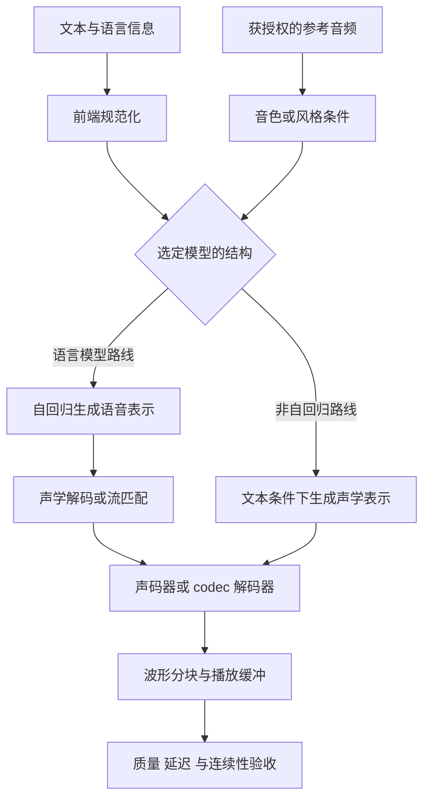

# 语音生成

> 面向将语音合成（TTS）接入产品的工程师。本文区分文本、语音表示、声学模型与声码器，再说明流式输出的条件、质量评测和服务化方法。模型案例按具体论文版本说明，不将某个项目的类名、张量尺寸或实现细节推广为所有 TTS 的通用结构。

## 是什么：从文本到可播放波形

TTS 的目标不只是读对字，还包括可懂度、韵律、音色一致性与交互时延。端到端语音对话可以同时包含识别、理解与生成；本文聚焦生成，识别与理解见[语音识别与理解](/ai/models/audio)。

| 层次 | 处理对象 | 常见混淆 |
| --- | --- | --- |
| 文本前端 | 数字、缩写、语言、分词或音素 | 显示字符串不一定等于实际应朗读的内容 |
| 条件与表示 | 文本、参考音频、音色、风格、语音 token | 语音 token 不一定是 Mel 频谱的离散编码 |
| 声学生成 | 语音表示、Mel 频谱或 codec 表示 | 各架构可合并或省略某些中间层 |
| 波形生成 | 将声学表示还原为音频采样 | 声码器、codec 解码器与声学模型并非同一组件 |
| 服务输出 | 分块、编码、传输与播放 | 逐 token 生成不自动等于可实时播放 |



这张图是用于比较的抽象，不是某一仓库的逐类调用图。部署时应从实际 checkpoint 的模型卡、配置文件和推理入口确定数据路径。

## 为什么有多条生成路线

### 自回归语音表示与声学解码

语言模型可依次预测语音离散表示，再由后续模型生成声学特征或波形。优点是便于利用序列建模与上下文条件；代价包括串行步骤、错误累积与后段解码延迟。token 的词表、采样率、每秒 token 数和特殊标记均由具体模型定义，不能假设统一为 8,192 个 Mel Code。

以 **CosyVoice 2** 的论文为例：模型使用有限标量量化（FSQ）改善语音 token 码本利用率，文本到语音语言模型可采用预训练 LLM 骨干，再用具备分块感知的因果流匹配支持流式与非流式合成。这个结构不等于“所有版本都输出 2048 维 latent，再经过 DIT + DAV”。[CosyVoice 2 论文](https://arxiv.org/abs/2412.10117)

### 非自回归与流匹配

流匹配学习从噪声状态到目标数据的连续变换，推理时通过数值求解得到结果。并行生成可减少逐语音 token 的串行依赖，但求解步数、序列长度、骨干网络与声码器仍决定耗时。

**F5-TTS** 是公开的非自回归流匹配案例，使用 DiT 和文本条件设计进行语音合成。它适合作为另一条结构路线的参考；论文中的性能与质量来自其特定评测设置，不能直接承诺任意硬件上的首包延迟。[F5-TTS 论文](https://arxiv.org/abs/2410.06885)

非自回归不意味着天然流式，流匹配也不意味着必须整句结束才可输出。是否能分块以及需要多少未来上下文，要看训练设计与实现。

## 声码器：不要混淆 HiFi-GAN 与 BigVGAN

声码器把 Mel 等声学表示变成波形。**HiFi-GAN** 使用生成器与多类判别器进行对抗训练，其中多感受野融合用于覆盖不同时间模式；推理通常只使用生成器。它不是原文所称的 Snake 激活来源。[HiFi-GAN 论文](https://arxiv.org/abs/2010.05646)

**BigVGAN** 引入具有周期性归纳偏置的抗混叠表示设计，使用 Snake 类周期激活。不能因为两者都属于神经声码器，就把论文、模块名与实现混为一谈。[BigVGAN 论文](https://arxiv.org/abs/2206.04658)

codec 路线还可能直接生成 codec token，再用相应解码器还原音频。codec 的结构与训练目标决定输出格式，不能随意换成另一声码器而不做接口和质量验证。

## 如何选择公开模型与部署版本

模型演进快，下面列的是可追溯的研究和工程入口，不称为“全市场最新排名”。

| 入口 | 用来核对什么 | 部署前需要补齐 |
| --- | --- | --- |
| [CosyVoice 官方仓库](https://github.com/FunAudioLLM/CosyVoice) | 不同代际的使用说明、模型与流式接口 | 精确 checkpoint、代码提交、语言及推理参数 |
| [F5-TTS 官方仓库](https://github.com/SWivid/F5-TTS) | 非自回归流匹配实现与推理入口 | 权重许可、声码器依赖、步数与时长设置 |
| [IndexTTS 官方仓库](https://github.com/index-tts/index-tts) | 对应版本的语音生成实现与控制接口 | 锁定版本并核对参考音频、控制条件与输出限制 |

工程建议：保存模型权重版本或哈希、代码 commit、依赖锁文件、声码器版本、采样率、种子、推理参数与硬件信息。代码许可、权重许可、参考音频使用权和托管 API 条款是不同层次，不能仅凭“仓库公开”判定可以任意商用。

## 流式服务：从首包到不中断播放

首包只描述第一个可播放片段何时到达。用户感知还取决于后续片段能否在播放缓冲耗尽前产生，以及片段拼接时是否存在音色跳变、停顿、噪声与韵律断裂。

工程上可以拆成四段观测：

```text
请求等待与前端处理 → 模型首段生成 → 编码与网络传输 → 客户端开始播放
后续片段：生成速度、到达间隔、缓冲水位、拼接连续性
```

| 设计点 | 建议 | 验证方法 |
| --- | --- | --- |
| 文本分块 | 在语言与语义边界分段，控制首段长度 | 标点、数字、缩写与跨句语调测试 |
| 模型分块 | 使用该模型支持的缓存与 look-ahead 配置 | 比较流式和整句模式的内容与音色 |
| 波形拼接 | 按实现处理重叠区域和边界 | 听测爆音、重复音节、漏字与异常静音 |
| 并发调度 | 避免长任务挤压交互任务，保留背压 | 同时观察排队、首包和播放中断 |
| 取消与超时 | 及时释放模型状态和客户端缓冲 | 中断后无残留播放、无持续 GPU 占用 |

不要直接照搬某篇示例中的线程类名或调度优先级；具体同步与内存生命周期必须结合真实引擎实现。

## 评测：音质、内容和时延分别验收

| 指标 | 说明 | 边界 |
| --- | --- | --- |
| CER / WER | 用识别或人工转写检查朗读内容 | ASR 本身有误差，关键样本需人工复核 |
| MOS / 成对偏好 | 听众对自然度、舒适度的评价 | 报告评分协议、人数、语言和不确定性 |
| 说话人相似度 | 比较参考与合成的音色特征 | 不替代可懂度、韵律或授权检查 |
| 首包延迟 | 请求到第一个可播放片段 | 明确是否包含排队、网络和前端处理 |
| RTF | 合成耗时 ÷ 生成音频时长 | RTF < 1 不保证每个流式片段都及时到达 |
| 稳定性 | 重复、漏读、长静音、异常终止 | 长文、跨语言、标点异常与并发都要覆盖 |

**自算例**：生成 10 秒音频用 2 秒，RTF 为 0.2。若首次可播放片段仍需等待 1.8 秒，实时交互体验未必满足目标。不要用平均 RTF 掩盖首包长尾，也不要把论文的单请求指标当作多租户容量。

## 加速与成本

可以评估混合精度、图编译、算子融合、声学求解步数、批处理和量化；每项都需要内容、音色与流式回归。TensorRT 适配某个子模块，不代表整个管线都被加速。优化目标应是满足质量与时延条件下，每分钟合格音频的成本。

```text
自建每分钟合格音频成本
  = 同一时间窗口内计算、存储、传输与运维成本
    ÷ 通过质量与延迟验收的音频分钟数
```

API 可能按字符、token、请求或音频时长计费；声音克隆、存储和实时通道可能单列。选择服务后再保存地区、模型 ID、计费单位与采集日期，不在架构文章里用过期单价决定方案。

## 常见坑

- 把一个模型的 token ID、层数或张量形状写成全部 TTS 的通用常量。
- 把能生成分块输出等同于首包快、播放不中断。
- 把 HiFi-GAN、BigVGAN、codec 解码器和声学流匹配当作可无条件互换的模块。
- 只测自然度，不测漏读、数字、专有名词、取消与长文稳定性。
- 只记录模型名，不保存权重、代码、参数和评测协议。

## 参考资料

<Refs>

本轮访问与核对日期：2026-09-26。架构图为本站基于公开机制绘制的抽象图；旧版无法对应到明确来源的实现类名与配图已撤下。

- [CosyVoice 2: Scalable Streaming Speech Synthesis with Large Language Models](https://arxiv.org/abs/2412.10117) · [官方仓库](https://github.com/FunAudioLLM/CosyVoice)
- [F5-TTS: A Fairytaler that Fakes Fluent and Faithful Speech with Flow Matching](https://arxiv.org/abs/2410.06885) · [官方仓库](https://github.com/SWivid/F5-TTS)
- [HiFi-GAN](https://arxiv.org/abs/2010.05646) · [BigVGAN](https://arxiv.org/abs/2206.04658)
- [IndexTTS 官方仓库](https://github.com/index-tts/index-tts)
- 站内相关：[语音理解](/ai/models/audio) · [多模态应用](/ai/application/multimodal) · [应用评测](/ai/application/evaluation) · [推理成本](/ai/infra/inference/token-economics)

</Refs>
