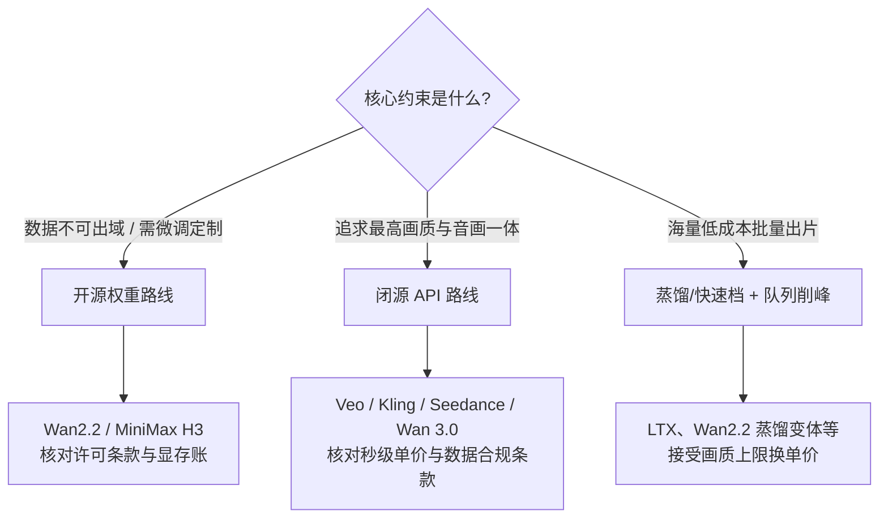

# 视频生成：时空建模的技术线

> 视频生成 = 图像生成 + 时间维度。这个"+时间"带来了数量级的计算增长，也让"一致性"（时序连贯、物理合理、镜头语言）成为核心难题。这篇面向需要评估或落地视频生成能力的工程师与方案架构师：读完你会清楚视频生成难在哪、主流架构为什么收敛到"时空 DiT"、控制能力如何分级、开源闭源怎么选，以及秒级计费背后的 GPU 分钟账怎么算。这条技术线从图像扩散出发，正在收敛到"时空 DiT + 原生音画"的形态。

## 为什么视频生成这么难

把图像生成做到可用只花了几年，视频生成却让整个行业又啃了多年，根源是三座大山：

**算力爆炸。** 一段 720p、24fps、5 秒的视频有 120 帧，像素总量是同分辨率单张图的约两个数量级；即便经过时空压缩进入潜空间，序列长度仍在数万 token 量级，而单张图像通常只有几千个。注意力机制的计算随序列长度快速增长，再叠加扩散模型几十步的迭代去噪，单条视频的推理算力比单张图高 1-2 个数量级——这是成本结构的根源（后文有账）。

**时序一致性。** 图像生成只管"这一帧对不对"，视频生成要管"每一帧与前后帧的关系对不对"：人物五官不能漂移、服装纹理不能闪烁、光照与机位要连贯。失败模式也分两类：帧间抖动（闪烁、形变）属于局部建模不足，跨镜头角色"换脸"则属于全局一致性缺失，前者靠更强的时空注意力缓解，后者只能靠参考机制从输入端约束。短片段（5-10 秒）靠时空注意力已基本可靠，长时序至今仍靠分镜拼接与自回归延展，跨镜头的角色一致性要靠参考图机制兜底。

**运动与物理。** 物体运动要符合牛顿力学，交互要符合因果：杯子倒了水要洒、人走过水面要有涟漪。Sora 技术报告自己也承认这是未解决问题（典型失败案例：玻璃碎裂不符合物理、咬过的饼干没有咬痕）。到 2026 年各旗舰模型在简单物理上显著进步，但复杂多体交互仍是检验模型成色的试金石。

## 技术演进

时间线上有几个关键节点：2022-2023 年在图像扩散主干上插入时序注意力层（伪 3D 路线）；2024 年初 Sora 技术报告确立"时空补丁 + 扩散 Transformer（DiT）+ 大规模数据"范式；2024-2025 年开源跟进（CogVideoX、Wan2.1/2.2）与音画同步竞赛（Veo 3 → Sora 2 → Wan2.5/Seedance）；2026 年竞争焦点转向参考生视频、多主体一致、原生 4K 与多镜头叙事。

## 架构主线

### 时空补丁：把视频统一成 token

Sora 技术报告的核心洞察是模仿 LLM 的 token 化：先用一个视频压缩网络把原始视频压进低维潜空间（时间与空间同时压缩），再把潜表示切成**时空补丁（spacetime patches）**，让 DiT 像处理文本 token 一样做扩散去噪。这个表示一举解决了三件事：任意时长/分辨率/宽高比可以混训（图像就是单帧视频）；推理时按目标尺寸排布随机补丁即可控制输出规格；与 Transformer 的缩放规律（scaling law）直接对接——报告展示了样本质量随训练算力可预期地提升。

*Sora 技术报告中的时空补丁示意（图源：[Video generation models as world simulators](https://openai.com/index/video-generation-models-as-world-simulators/)）*

### 两条路线：扩散主升，自回归未绝

- **扩散路线（绝对主流）**：DiT 在潜空间迭代去噪生成整个片段，所有帧同时参与全局建模，时序上下文是双向的。画质与可控性上限高，所有头部商用模型（Sora、Veo、Kling、Seedance、Wan）都在此路线上。演进重点从"时序注意力插层"走向"原生时空联合注意力 + 更大容量"。
- **自回归路线（少数派）**：把视频离散成视觉 token，用 LLM 式解码器逐 token 生成（代表如 Google 的 VideoPoet）。优势是与 LLM 技术栈统一、天然支持流式延展与交互式生成，劣势是因果方向生成导致误差累积、画质上限受限。这条路线没有消失，而是在世界模型、实时交互生成方向继续押注。

扩散路线胜出的原因值得记住：**全局去噪等价于双向时序建模**，对一致性这种全局约束天然友好；而自回归的逐步累积误差在长序列上会被放大。但反过来说，世界模型需要的恰恰是"边走边生成"的因果式生成——所以路线之争没有终局，只有场景适配。

开源时间线上还有一个坐标：智谱与清华的 CogVideoX 系列（2024 起）用 Expert Transformer + 3D 全注意力 + 3D VAE 的结构，把 5B 规模的文生视频模型压到单张桌面显卡可跑、2B 档采用 Apache 2.0 许可，为后来的开源视频生态（微调、ComfyUI 集成）打下了第一块地基。

### MoE：把容量做大而推理成本不变

Wan2.2 把 LLM 已验证的 MoE 思路搬进视频扩散：A14B 系列用双专家按去噪阶段分工——**高噪声专家**负责早期（布局与构图），**低噪声专家**负责后期（细节与纹理），按信噪比阈值切换。总参数 27B、每步激活 14B，容量翻倍而推理算力与显存基本不变，验证损失曲线也显著优于单模型基线。这是"把模型做大"与"把成本控住"之间目前最实用的平衡点。

）](/images/ai/models/video-gen/wan22-moe-architecture.png)

### VAE 的视频化：压缩比是成本阀门

时空压缩编码器（VAE）决定了潜空间序列长度，直接乘进注意力和去噪的每一步开销，是训练与推理成本的第一阀门。Wan2.1 的 3D 因果 VAE 已做到 4×8×8（时间×高×宽）压缩；Wan2.2-VAE 提升到 4×16×16，叠加 patch 化后总压缩比达 4×32×32，配合蒸馏后训练，让一个 5B 模型在单张消费级显卡上约 9 分钟生成 5 秒 720P@24fps 视频，成为最快的一档开源 720P 模型。压缩比的每一次提升，都直接换算成显存账单和推理单价的下降。

）](/images/ai/models/video-gen/wan22-vae.png)

### 可控性演进：从一句话到一套镜头语言

| 控制层级 | 输入 | 解决的问题 | 代表能力 |
| --- | --- | --- | --- |
| 文生视频 | 文本提示词 | 从 0 到 1 | 所有模型的基线能力 |
| 图生视频 | 首帧图 + 提示词 | 构图与美术可控 | I2V 已成标配 |
| 首尾帧 | 首帧 + 尾帧 | 起止确定、转场衔接 | Veo、Wan 等支持 |
| 参考主体 | 1-N 张主体参考图/视频 | 跨镜头角色一致 | Vidu 多参考、海螺 S2V、可灵 All-in-One 参考 |
| 镜头控制 | 运镜指令/分镜脚本 | 电影化叙事 | 海螺 Director 模式、可灵 Director Mode（15 秒） |
| 音画一体 | 文本/音频驱动 | 对白、音效、口型原生生成 | Sora 2、Veo 3 起成为旗舰标配 |

选型时我的经验：文生/图生是门票，**参考主体与镜头控制才是内容生产的分水岭**——它们决定了能不能做出"有角色、有叙事"的成片而不是一堆孤立镜头。

## 开源与闭源格局（截至 2026-09）

### 主力模型速览（更新于 2026-09）

| 模型 | 机构 | 时间 | 能力上限与要点 | 开源 |
| --- | --- | --- | --- | --- |
| Sora 2 / Pro | OpenAI | 2025-09 | 音画同步、Cameo 人物植入；部分消费端 2026-03 起关停（App 4 月下线、API 9 月停服） | 否 |
| Veo 3.1 / Fast / Lite | Google | 2025-10 | 原生音频先行者；参考图生视频、首尾帧、对象插入、4K；Flow 创作平台 | 否 |
| Wan2.1/2.2 → 3.0 | 通义 | 2025 全年 | 2.1/2.2 开源标杆（MoE 视频扩散）；2.5 起音画一体转闭源；3.0 原生 30 秒、四模态全能参考 | 部分 |
| Seedance 2.0 / 2.5 | 字节 Seed | 2026-02/07 | 原生多模态输入（文/图/视频/音频，最多 12 参考资产）、电影级物理真实 | 否 |
| Kling 3.0 系 | 快手 | 2026-01 起 | All-in-One 多模态；**原生 4K 直出（业内首个，2026-04）**；Director Mode 15 秒多镜头 | 否 |
| Vidu Q2 | 生数+清华 | 2025-09 | 参考生视频首创（7 参考图多主体一致）、U-ViT 架构自成一派 | 否 |
| 海螺 02 / H3 | MiniMax | 2025-06 / 2026-08 | 02 主打物理真实与 Director 运镜；H3 开源（15 秒音画、2K 直出） | 部分 |
| CogVideoX 系 | 智谱+清华 | 2024-2025 | Expert Transformer + 3D VAE，5B 单卡可跑，微调生态成熟 | 是 |

**盲测榜单佐证**：Artificial Analysis 视频竞技场（用户盲评打分，2026-09-03 快照）——文生视频无音频组前列为 Wan 3.0（Elo 1333）、Gemini Omni Flash（1324）、MiniMax H3（1301）；有音频组 Wan 3.0 与 Gemini Omni Flash 并列（1238）；开源权重第一是 MiniMax H3（无音频 1301 / 有音频 1227）。头部差距在几十分以内，排名按月洗牌，**榜单只适合当候选池过滤器，不适合当采购依据**。

**格局要点**：
- **2025 分水岭是音画同步**：Veo 3 → Sora 2 → Wan2.5/Seedance 把原生音频变成标配。
- **2026 关键词是参考/一致性/多镜头/4K**：参考生视频、多主体一致、原生 4K 成为旗舰竞争点。
- **Sora 停服的行业含义**：视频生成的 C 端独立入口难成立，竞争转向 API 与创作平台集成。
- **开源侧**：Wan2.1/2.2 是最完整的开源复现，2.5 之后前沿转闭源；MiniMax H3（2026-08 开源）接棒成为开源权重第一梯队——但私有化方案的工程验证仍应以 Wan2.2 时代的部署方法论为基准。

### 选型三角：能力、成本、数据边界

- **能力**：闭源旗舰仍领先开源权重约一代，尤其在音画同步、物理真实、多镜头叙事上。对成片质量有硬性商业要求（广告、影视预览）时，先用闭源 API 验证上限。
- **成本**：闭源按秒/按次计费，量大后账单线性增长；开源权重自建是固定成本（卡 + 运维），利用率高于五成时单价通常反超。月产量稳定且持续的场景，自建或托管开源值得做一轮测算。
- **数据边界**：涉及未公开素材、品牌资产、内部数据时，开源私有化或托管开源权重（素材不出 VPC 的 API）是唯一解。此外注意各闭源平台对生成内容的权利归属与训练使用条款，商用前需过一遍。

三者不可兼得，顺序是**先定边界，再比能力，最后算成本**——边界是硬约束，能力可以用提示词工程和重跑弥补一部分，成本则是纯算术问题。

## 成本结构：秒级计费背后的 GPU 分钟账

视频 API 普遍按"秒数 × 分辨率档 × 模型档位"计费。Artificial Analysis 的第三方采价（2026-09-03 快照，单位：美元/分钟成片）可以直观看出梯度：

| 档位 | 代表（每分钟成片价格） | 折合每秒 |
| --- | --- | --- |
| 旗舰音画档 | Sora 2 Pro（$30）、可灵 3.0 Pro（$13.4） | $0.2-0.5 |
| 主力商用档 | 可灵 3.0 标准（$10.1）、Seedance 1.5 Pro（$5.9）、MiniMax H3（$4.8） | $0.08-0.17 |
| 经济档 | 海螺 2.3（$2.8）、LTX-2 Fast（$2.4） | $0.04-0.05 |
| 开源托管档 | Wan2.2 A14B 托管（$1.1-4.8，蒸馏版最低约 $1.1） | $0.02-0.08 |

背后的账其实简单：**生成 1 秒成片，大约要占用 1 张数据中心级 GPU 几分钟**（参考量级：Wan2.2 的 5B 档在消费级显卡上约 1.8 GPU-分钟/秒成片，旗舰模型更高）。所以秒级单价 ≈ GPU 分钟数 × 卡时成本 × 毛利系数；蒸馏、量化、缓存加速（社区在 Wan 生态上已有多种实现）每省一步推理步数，就直接折算成单价下降。这也解释了为什么同一模型在不同聚合平台的报价能差 3-4 倍——差的是推理优化水位，不是模型本身。

**测算示例**（量级估算，非报价）：一条营销短视频管线，月产 100 条 6 秒成片，按主力商用档约 $0.1/秒计，一次成片即约 $60；但计入约三分之一的一次成片率（筛选、重跑），实际月账单要按 $180-200 估。若改用经济档或开源托管档（$0.02-0.05/秒），同样预算能支撑 2-5 倍产量——**选档位比砍需求有效**。自建路线则是另一本账：固定 GPU 成本摊到利用率上，持续高负载场景单价可再降一个台阶，代价是运维与迭代跟进。

## 常见坑

| 坑 | 现象 | 对策 |
| --- | --- | --- |
| 只看单条演示就选型 | 演示视频是百里挑一的幸存者 | 用自己的业务提示词盲测 20-30 条，统计一次成片率 |
| 用文生视频死磕角色一致 | 跨镜头角色漂移、反复重跑 | 改用图生/参考主体能力，把角色图做成受控素材 |
| 忽略分辨率档的单价差 | 账单超预算 2-3 倍 | 草稿用低分辨率档迭代，定稿才上高档 |
| 提示词沿用图像习惯 | 画面动不起来或运动混乱 | 视频提示词要显式写运动主体、运动方向与镜头运动 |
| 素材直传闭源公网 API | 未公开素材外流风险 | 涉密素材走私有化或素材不出 VPC 的托管方案 |
| 一次成片率不入成本模型 | 报价核算与实际账单背离 | 按"标称单价 ÷ 一次成片率"做真实单价 |

## 工程视角（SA 笔记）

- **成本测算**：视频推理的 GPU 时长按"秒数 × 分辨率档 × 模型档位"估，批量任务用低峰时段与队列削峰；一次成片率（合格条数/生成条数）必须计入成本，实际单价往往是标价的 2-3 倍。
- **管线设计**：脚本 → 分镜 → 逐镜头生成 → 筛选重跑 → 剪辑合成——人工筛选环节目前不可省；参考素材（角色图、场景图）的版本化管理能显著降低跨镜头不一致。
- **存储与分发**：素材与成片是对象存储 + CDN 的典型场景，生成集群与存储集群分离部署；原始素材涉密时，选择素材不出 VPC 的托管开源方案而非闭源公网 API。
- **合规**：商用素材注意平台的使用条款与内容标识要求；数字人/真人参考类能力（如 Sora 的 Cameo、可灵的主体参考）务必拿到本人授权。

## 与站内其他页面的分工

- **图像生成**（[文生图与可控生成](/ai/models/image-gen)）：讲扩散模型的图像侧原理与 ControlNet 类控制；本页不重复图像基础，视频生成的分镜底图、参考图制作依赖那一页的能力。
- **多模态应用**（[多模态应用](/ai/application/multimodal)）：讲多模态在应用层的编排与集成；本页聚焦视频模型本身的架构与选型，应用层如何把视频生成串进工作流看那一页。
- **GPU 选型**（[GPU 选型与推理成本测算](/ai/infra/inference/gpu-sizing)）：本页的 GPU 分钟账只到量级，自建部署时的卡型选择与显存测算在那一页展开。

## 世界模型：下一条曲线

视频模型的下一步不是"生成更像的视频"，而是"理解物理世界如何运转"——可交互的世界模型（游戏引擎式生成、具身智能训练场）是当前前沿押注方向。扩散路线解决的是"画面像不像"，自回归路线保留的"逐帧生成、可交互"特性，恰好是世界模型需要的形态——两条路线最终可能在这里会合。

## 参考资料

<Refs>

- [Video generation models as world simulators（OpenAI Sora 技术报告）](https://openai.com/index/video-generation-models-as-world-simulators/)（访问日期 2026-09-03，原文经 Wayback Machine 存档页读取）
- [Wan: Open and Advanced Large-Scale Video Generative Models（arXiv:2503.20314）](https://arxiv.org/abs/2503.20314)（访问日期 2026-09-03）
- [Wan-Video/Wan2.2 开源仓库 README](https://github.com/Wan-Video/Wan2.2)（访问日期 2026-09-03）
- [Wan 3.0 视频生成·电影级音画一体（阿里云百炼模型发布页）](https://bailian.console.aliyun.com/model-releases/wan3.0-video)（访问日期 2026-09-03）
- [通义万相官网（万相系列模型入口）](https://tongyi.aliyun.com/wanxiang/)（访问日期 2026-09-03）
- [CogVideoX: Text-to-Video Diffusion Models with An Expert Transformer（arXiv:2408.06072）](https://arxiv.org/abs/2408.06072)（访问日期 2026-09-03）
- [zai-org/CogVideo 开源仓库](https://github.com/zai-org/CogVideo)（访问日期 2026-09-03）
- [Introducing Veo 3.1 and advanced capabilities in Flow（Google 官方博客）](https://blog.google/innovation-and-ai/products/veo-updates-flow/)（访问日期 2026-09-03）
- [Veo（Google DeepMind 模型页）](https://deepmind.google/models/veo/)（访问日期 2026-09-03）
- [可灵 AI 更新公告（Kling 3.0 发布记录）](https://www.klingai.com/release-note/release-history)（访问日期 2026-09-03）
- [Kling-Omni Technical Report（arXiv:2512.16776）](https://arxiv.org/abs/2512.16776)（访问日期 2026-09-03）
- [MiniMax Hailuo 02 发布公告](https://www.minimax.io/news/minimax-hailuo-02)（访问日期 2026-09-03）
- [MiniMax H3: An Open Model Breaking the Boundaries（官方博客）](https://www.minimax.io/blog/minimax-h3)（访问日期 2026-09-03）
- [Artificial Analysis Text to Video Leaderboard](https://artificialanalysis.ai/video/leaderboard/text-to-video)（访问日期 2026-09-03）
- [Artificial Analysis Video Model Comparisons（含每分钟成片采价）](https://artificialanalysis.ai/video/models)（访问日期 2026-09-03）
- [VideoPoet: A Large Language Model for Zero-Shot Video Generation（arXiv:2312.14125）](https://arxiv.org/abs/2312.14125)（访问日期 2026-09-03）
- 图片来源：本页配图均下载自官方来源——`sora-spacetime-patches.webp` 来自 [OpenAI Sora 技术报告](https://openai.com/index/video-generation-models-as-world-simulators/)；`wan22-moe-architecture.png`、`wan22-vae.png` 来自 [Wan2.2 仓库](https://github.com/Wan-Video/Wan2.2) README 示意图（访问日期 2026-09-03）
- 站内相关：[图像生成](/ai/models/image-gen) · [多模态应用](/ai/application/multimodal) · [GPU 选型与推理成本测算](/ai/infra/inference/gpu-sizing)

</Refs>
