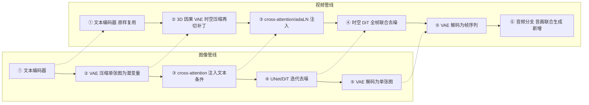
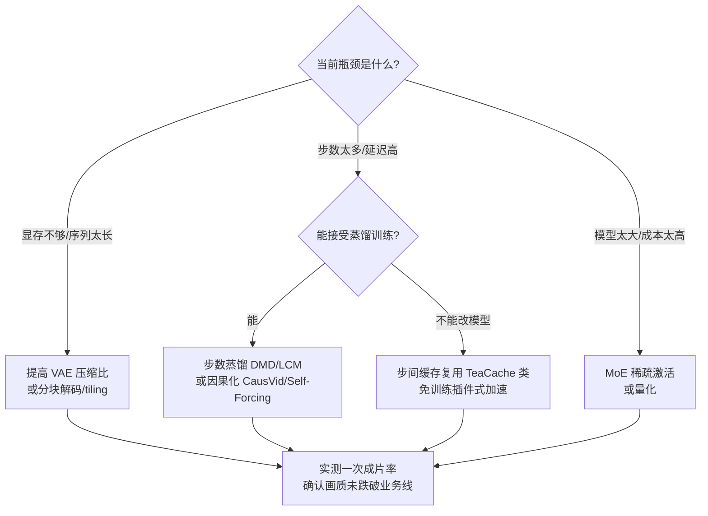
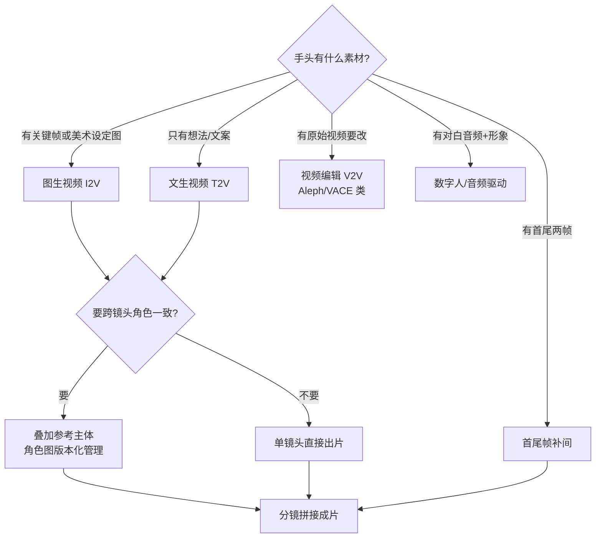
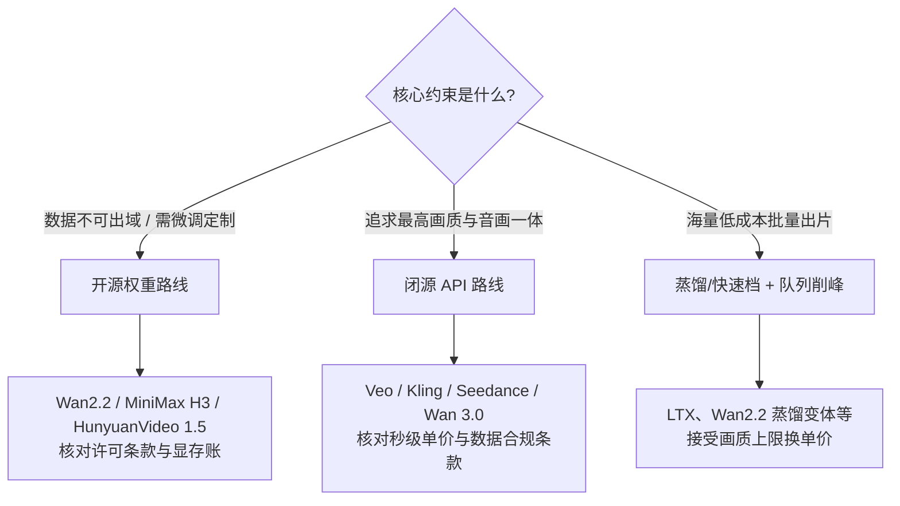

# 视频生成：时空建模的技术线

> 视频生成 = 图像生成 + 时间维度。这个"+时间"带来了数量级的计算增长，也让"一致性"（时序连贯、物理合理、镜头语言）成为核心难题。这篇面向需要评估或落地视频生成能力的工程师与方案架构师：读完你会清楚视频生成难在哪、主流架构为什么收敛到"时空 DiT"、3D 因果 VAE 与时空补丁到底怎么把一段视频压成 token、控制能力如何分级、开源闭源怎么选，以及秒级计费背后的 GPU 分钟账怎么算。全文沿一条主线展开——**从图像扩散出发，经"时空 DiT + 3D 因果 VAE"的收敛，走到"原生音画 + 长时序 + 少步加速"的当下形态**，中途会拆到机制层（每步输入是什么、中间做什么、输出给谁），也会落到工程层（数据管线、评估、推理成本、选型决策）。

## 为什么视频生成这么难

把图像生成做到可用只花了几年，视频生成却让整个行业又啃了多年，根源是三座大山：算力、时序一致性、物理合理性。三者不是并列的，而是层层递进——算力决定了"能不能做"，一致性决定了"能不能看"，物理决定了"能不能信"。

### 算力爆炸：token 数 = 帧 × 分辨率

视频成本的第一性原理只有一句话：**token 数 ≈ 帧数 × 单帧分辨率**，而注意力与去噪的计算量又随 token 数快速增长。把这笔账拆开算：

- 一段 **720p、24fps、5 秒** 的视频有约 **120 帧**，像素总量约 `1280 × 720 × 120 ≈ 1.1 亿`；同分辨率单张图约 `1280 × 720 ≈ 92 万` 像素——**像素量差约两个数量级**。
- 经过 3D 因果 VAE 的时空压缩（比如时间 4×、空间 8×8）再切成时空补丁后，序列长度落到 **数万 token** 量级；而单张图像通常只有几千个 token——**潜空间 token 差约一个数量级**。
- 一个可直接引用的公开锚点：Google Gemini API 对 720p 视频的计费口径是 **每秒约 5,792 个 token**（[Gemini API 视频文档](https://ai.google.dev/gemini-api/docs/video)），5 秒就是近 3 万 token，与上面的估算吻合。

关键在于：**注意力计算随序列长度增长，扩散模型还要迭代去噪几十步，两者相乘**。于是单条视频的推理算力比单张图高 1-2 个数量级——这就是所有成本结构的根源（后文"成本结构"一节把这笔账落到秒级计费上）。也正因为 token 数是成本的第一乘数，几乎所有降本手段都在动"怎么把 token 变少"（提高 VAE 压缩比）或"怎么把步数变少"（蒸馏），这条主线后面反复出现。

### 时序一致性：局部抖动与全局漂移是两类病

图像生成只管"这一帧对不对"，视频生成要管"每一帧与前后帧的关系对不对"：人物五官不能漂移、服装纹理不能闪烁、光照与机位要连贯。失败模式分两类，**病因不同、药方也不同**：

- **帧间抖动（局部）**：闪烁、纹理爬动、边缘形变。属于局部时序建模不足，靠更强的时空注意力（让相邻帧充分互相"看到"）缓解。
- **跨镜头换脸（全局）**：同一角色在不同镜头里长相变了。属于全局一致性缺失，靠架构本身很难根治，只能靠**参考机制从输入端约束**（把角色参考图作为条件钉进生成过程）。

我的经验边界：**短片段（5-10 秒）靠时空注意力已基本可靠**，一次成片率能到可用水平；**长时序至今仍靠分镜拼接与自回归延展**，跨镜头的角色一致性必须靠参考图兜底，不要指望纯文生视频能自己记住一个角色长什么样。

### 物理合理性：从"能生成"到"能相信"

物体运动要符合牛顿力学，交互要符合因果：杯子倒了水要洒、人走过水面要有涟漪。Sora 技术报告自己就把视频模型定位成"世界模拟器"，同时坦承物理是未解决问题（典型失败案例：玻璃碎裂不符合物理、咬过的饼干没有咬痕）。到 2026 年，各旗舰模型在简单物理（重力、碰撞、刚体运动）上显著进步，Runway Gen-4.5 甚至把"物理准确的运动"当作头号卖点；但**复杂多体交互（流体、软体、多物体连锁反应）仍是检验模型成色的试金石**，也是世界模型方向要继续啃的硬骨头。

## 技术演进


时间线上有几个关键节点，串起来就是这条技术线的骨架：

- **2022-2023**：在图像扩散主干（UNet）上插入时序注意力层，即"伪 3D"路线——空间与时间分开处理，代表如 AnimateDiff、Video LDM。工程上省算力，但一致性上限低。
- **2023 末**：Google 的 VideoPoet 走了另一条路——把视频离散成 token，用 LLM 式自回归解码器生成，验证了"视频也能当语言建模"。
- **2024 初**：Sora 技术报告确立 **"时空补丁 + 扩散 Transformer（DiT）+ 大规模数据"** 范式，一举成为行业坐标系。
- **2024-2025**：开源快速跟进（CogVideoX、Mochi、HunyuanVideo、Wan2.1/2.2），把"5B 单卡可跑"变成现实；同时 Veo 3 → Sora 2 引爆**音画同步**竞赛。
- **2025-2026**：竞争焦点转向**参考生视频、多主体一致、原生 4K、多镜头叙事**；推理侧则卷**少步/实时生成**（CausVid、Self-Forcing、LTX 实时路线）。

## 架构主线

### 时空补丁：把视频统一成 token

Sora 技术报告的核心洞察是模仿 LLM 的 token 化：先用一个视频压缩网络把原始视频压进低维潜空间（时间与空间同时压缩），再把潜表示切成**时空补丁（spacetime patches）**，让 DiT 像处理文本 token 一样做扩散去噪。

这个表示一举解决了三件事：

1. **任意时长/分辨率/宽高比可以混训**——图像就是单帧视频，短视频和长视频只是补丁数量不同，同一个模型都能吃。
2. **推理时按目标尺寸排布随机补丁即可控制输出规格**——想要多大、多长、什么比例，就摆多大的补丁网格，然后从纯噪声开始去噪。
3. **与 Transformer 的缩放规律（scaling law）直接对接**——报告展示了样本质量随训练算力可预期地提升，这是"大力出奇迹"能成立的表示层前提。


*图源：OpenAI Sora 技术报告《Video generation models as world simulators》时空补丁示意（[链接](https://openai.com/index/video-generation-models-as-world-simulators/)）*

### Sora 技术路线解读：官方报告到底说了什么

需要先厘清一个常见误解：**OpenAI 从未发表过 Sora 的完整论文**，公开的只有一篇技术报告性质的网页《Video generation models as world simulators》。它给的是"范式声明"而非"实现细节"——没有参数量、没有完整架构超参、没有训练数据规模的确切数字。所以业界对 Sora 的很多"架构解读"其实是基于报告披露的表示方式 + DiT 原始论文 + 后续开源复现（Open-Sora、Open-Sora Plan、Latte 等）反推出来的，读的时候要分清"报告明说的"和"社区推断的"。

报告真正明确披露的、也是最有价值的三点：

1. **统一的补丁表示**：视频先经压缩网络进潜空间，再切时空补丁，让不同时长/分辨率/宽高比统一成"补丁序列"。这是"图像即单帧视频"能成立、大小混训能成立的表示层根基。
2. **缩放规律**：报告给出一组"训练算力↑→样本质量可预期提升"的对比图，核心主张是**视频生成也服从 scaling law**——这是"大力出奇迹"路线的信心来源，也是后来各家拼命堆数据堆算力的理论依据。
3. **世界模拟器定位**：报告把视频模型拔高到"模拟物理世界"的高度，并展示了几项涌现能力（3D 空间一致性、物体恒存性 object permanence、对物理交互的初步建模）。

同样重要的是报告**坦承的局限**，这些至今仍是行业试金石：复杂物理不符合真实规律（玻璃碎裂、咬痕缺失）、因果混淆（左右颠倒、方向搞反）、长时序里物体凭空出现或消失、精确的时间与空间描述（如"沿指定路线"）难以遵循。把这些局限和后文"物理合理性""时序一致性"两节对照看，会发现两年过去，行业进步的正是这些点，但没一个被彻底解决。

我的判断：**Sora 的历史意义是"定坐标"而非"给答案"**。它确立了"时空补丁 + DiT + 大数据 + scaling"这条主干，之后所有的开源闭源模型都是在这条主干上做工程化落地与局部创新（更狠的 VAE 压缩、MoE 容量分配、音画联合、少步蒸馏）。理解 Sora 报告说了什么、没说什么，就能理解为什么后面的开源模型能在架构上和它殊途同归——因为范式是公开的，差距在数据、算力与工程水位。

### 端到端：一句话怎么变成一段视频

理解了时空补丁，完整管线就不再神秘。拿图像生成管线（文本编码器、去噪主干、VAE 的"三件套"，见[图像生成](/ai/models/image-gen)）逐步对照，视频管线是一一映射的，视频特化集中在三处：②的压缩对象、④的建模范围、⑥多出的一条音频分支。



逐步拆开看：

**① 文本编码器：唯一可以完全照搬的一步。** 与图像生成相同，把提示词编码成语义向量序列。不同模型的文本编码器选型有讲究：Wan 用 umT5（多语言、对中文友好），HunyuanVideo、LTX-Video 用 T5 系，Mochi 甚至直接用一个 8B 的 LLM（Tülu 3）当文本编码器以增强长提示理解。没有视频特化，但编码器容量会影响长提示与多语言的贴合度。

**② 3D 因果 VAE：视频特化最大的一步。** 图像侧 VAE 压缩单张图；3D 因果 VAE 把时间与空间一起压缩，将整段片段压成潜空间的时空表示，再切出上一节的时空补丁。这里有个容易被忽略的不对称：**推理时纯文生视频在这一步并不"编码"任何东西**——它直接按时空补丁网格的形状构造纯噪声潜变量，只有当存在视觉条件（图生视频、参考主体）时，VAE 编码器才上场。记住这一点，后面讲条件注入要用。压缩比是成本的直接乘数，后文"VAE 的视频化"一节展开。

**③ 条件注入：与图像 DiT 同款机制。** 文本向量经 cross-attention 或 adaLN（自适应层归一化：把条件信息写进每层归一化参数，而不是拼进输入）注入。区别只在视频模型的条件流更密——除文本外还可能有图像/视频潜变量与音频提示，注入机制本身没变。

**④ 时空 DiT 去噪：算力与一致性都花在这一步。** 迭代去噪几十步，所有帧同时参与，时序上下文双向。这种"全局去噪"为什么对时序一致性是结构性优势，下一节"两条路线"展开；这里先记住，**成本的所有乘数都发生在这一步**。

**⑤ VAE 解码：从潜空间回到像素。** 把去噪完成的时空潜变量解码成帧序列，与图像生成一样首尾呼应。注意解码本身也吃显存——Mochi 全精度解码 163 帧需要约 70GB 显存，工程上常用分块解码（tiling）来换显存。

**⑥ 音画一体模型再加一条音频分支。** Sora 2、Veo 3 一类旗舰在同一条管线内联合生成（或联合去噪）画面与音频，而非事后配音——后文"格局要点"里"2025 分水岭"的音画同步竞赛，技术正面就是这一步。

**量级落到管线上就清楚了。** 一段 5 秒 720p 的片段，经 ② 的时空压缩后潜空间仍有数万级 token——比单张图的几千个高约一个数量级，按像素总量算则是约两个数量级的差距；④ 又要在每一步去噪里把这几万个 token 完整过一遍模型，重复几十步。两者相乘，单条视频的推理算力比单张图高 1-2 个数量级——这正是开篇"算力爆炸"那笔账，此处只是把它归因到具体步骤。

采样侧的经验可以直接从图像迁移：**CFG（Classifier-Free Guidance，无分类器引导：推理时同时跑条件与无条件两路，用引导强度放大两者差异）** 在视频扩散上同样是标配，HunyuanVideo 的论文直言 CFG 显著提升样本质量与运动稳定性；但引导强度同样是质量/动态的权衡旋钮——调高提升文本贴合度，过猛则伤运动稳定与画质，Wan 的官方文档同样提示更高引导通常以画质为代价。

**可控性的阶梯，本质是条件注入点的阶梯。** 与后文"可控性演进"表对照：文生视频只有文本条件（③）；图生视频、首尾帧把图像经 VAE 编码后，作为起始潜变量与噪声潜变量拼接（Wan 的 I2V 即沿通道维拼接），让第一帧从起点就被钉死；参考主体把参考图特征编码后作为参考条件注入，约束跨镜头一致性。所以**评估一个模型的可控能力，先问条件注入在管线的哪一步——注入点越靠里，约束越强，工程上的改造成本也越高**。

**最后回答"为什么一条视频要占用几分钟 GPU"。** 乘法发生在 ④：序列长度（数万 token）× 去噪步数（几十步）× 模型规模（参数量与激活量）。序列长度由 ② 的压缩比决定，步数由采样策略决定——于是所有降本手段都能钉在这条管线上：**VAE 压缩比、蒸馏减步数、步间缓存复用，各对应一个乘数**。这正是后文"成本结构"与"推理加速"两节的由来，也是选推理优化方案时先看它动了哪个乘数的原因。

#### 去噪循环与 CFG：把 ④ 的核心计算压成几行

④ 这一步的迭代去噪，本质是一个固定结构的循环。用伪代码把它写出来，成本乘数就一目了然（以 Flow Matching / 整流流为例，扩散写法等价）：

```python
# ② 之后：纯文生视频不编码任何东西，直接按补丁网格构造噪声
z = randn(B, C, T_lat, H_lat, W_lat)      # 形状 = 目标补丁网格，T_lat/H_lat/W_lat 由 VAE 压缩比决定
cond = text_encoder(prompt)               # ① 文本条件
for t in reversed(timesteps):             # ④ 迭代去噪，几十步
    v_cond   = dit(z, t, cond)            #   有条件速度场
    v_uncond = dit(z, t, null_cond)       #   无条件速度场（CFG 多跑的一路）
    v = v_uncond + w * (v_cond - v_uncond)  # CFG 混合，w 为引导强度
    z = z + dt * v                        #   沿速度场步进（欧拉法）
frames = vae.decode(z)                    # ⑤ 解码回像素
```

从这段能读出三件事：**其一**，`z` 的形状（`T_lat × H_lat × W_lat`）就是 token 数的来源，它由 ② 的 VAE 压缩比与目标分辨率共同决定——这就是"token 数 = 帧 × 分辨率"在潜空间的精确形态：

```text
token 数 ≈ (帧数 / 时间压缩比) × (高 / 空间压缩比 / patch) × (宽 / 空间压缩比 / patch)
例：120 帧、720p、VAE 4×8×8、patch 2×2
   ≈ (120/4) × (720/8/2) × (1280/8/2) = 30 × 45 × 80 = 108,000 token
```

**其二**，CFG 让每步要跑**两路** DiT 前向（有条件 + 无条件），算力直接翻倍——这也是为什么有些实时方案会砍掉 CFG 或用引导蒸馏把它折进单路。**其三**，循环次数（步数）是纯乘数，蒸馏把它从几十步压到几步，收益立竿见影。CFG 的引导强度 `w` 就是前文说的质量/动态权衡旋钮：

```text
v = v_uncond + w × (v_cond − v_uncond)
w 越大 → 越贴文本，但过大伤运动稳定与画质；Wan/HunyuanVideo 官方文档均如此提示
```

### 两条路线：扩散主升，自回归未绝

- **扩散路线（绝对主流）**：DiT 在潜空间迭代去噪生成整个片段，所有帧同时参与全局建模，时序上下文是双向的。画质与可控性上限高，所有头部商用模型（Sora、Veo、Kling、Seedance、Wan）都在此路线上。演进重点从"时序注意力插层"走向"原生时空联合注意力 + 更大容量"。
- **自回归路线（少数派但未消失）**：把视频离散成视觉 token，用 LLM 式解码器逐 token 生成（代表如 Google 的 VideoPoet）。优势是与 LLM 技术栈统一、天然支持流式延展与交互式生成，劣势是因果方向生成导致误差累积、画质上限受限。这条路线没有消失，而是在世界模型、实时交互生成方向继续押注。

扩散路线胜出的原因值得记住：**全局去噪等价于双向时序建模**，对一致性这种全局约束天然友好；而自回归的逐步累积误差在长序列上会被放大。但反过来说，世界模型需要的恰恰是"边走边生成"的因果式生成——所以路线之争没有终局，只有场景适配。

有意思的是，2025 年出现了一条**把两者缝起来**的工程路线：用扩散教师模型蒸馏出一个"因果的、可流式的"少步学生（CausVid、Self-Forcing，见后文"推理加速"），既保留扩散的画质，又拿到自回归的流式与低延迟——这是实时视频生成能落地的关键一步。

### 时空 DiT 的三种主流结构

同样是"时空 DiT"，各家在"文本与视频怎么融合""注意力覆盖多大范围"上分出了几种典型结构，理解它们的差异，就能读懂开源对比表里的架构栏：

**CogVideoX——Expert Transformer + 3D 全注意力。** 智谱与清华的 CogVideoX 把文本 token 与视频 token **拼成一条序列**，用"专家 Transformer"处理：文本专家与视频专家各有独立的 FFN/归一化参数（Expert Adaptive LayerNorm），但在注意力层充分交互，实现比 cross-attention 更深的文本-视频融合；注意力是覆盖整个时空立方体的 **3D 全注意力**，而非空间/时间分离。配合自研 3D 因果 VAE，5B 档能生成约 6 秒、480×720 的片段，2B 档采用 Apache 2.0 许可，是开源视频生态（微调、ComfyUI 集成）的第一块地基。


*图源：CogVideoX 论文 Figure（Expert Transformer 结构，[arXiv:2408.06072](https://arxiv.org/abs/2408.06072)）*

**HunyuanVideo——双流到单流的混合 Transformer。** 腾讯混元的 13B 模型（发布时最大的开源视频模型）走的是 Flux/SD3 式的 MMDiT 家族：先用**双流**结构让文本与视频各自通过独立权重的 Transformer 块（联合注意力、分开投影），学各自的表示；再用**单流**结构把两个模态拼起来统一处理。全文用全注意力，训练采用 Flow Matching（整流流）范式。这条"先分后合"的设计，是为了在保持模态独立性的同时拿到深度融合。


*图源：HunyuanVideo 论文 Figure（整体框架，[arXiv:2412.03603](https://arxiv.org/abs/2412.03603)）*

**Wan——DiT + Flow Matching + umT5。** 通义万相的 Wan 系列用标准的 DiT 主干，文本经 umT5 编码后以 cross-attention 注入，训练用 Flow Matching。它的结构本身不追求"新奇"，而是把工程重心压在 VAE 压缩比与 MoE 容量分配上（见下两节），这也是它能做到"5B 单消费级卡可跑"的原因。


*图源：Wan 技术报告 Figure（DiT 架构，[arXiv:2503.20314](https://arxiv.org/abs/2503.20314)）*

三种结构的工程含义可以压成一句：**融合越深（全注意力/拼序列）一致性越好但越吃算力，模态越分离越省算力但融合上限低**——选型时看架构栏，本质是在看这个权衡点落在哪。

#### 时空注意力：全 3D vs 分离，算力差在哪

DiT 从图像扩到视频，最核心的改动就一处：**注意力要在时间维上也连起来**。这里有两条做法，算力差异巨大：

- **分离式（factorized）注意力**：空间注意力（每帧内部）+ 时间注意力（跨帧同位置）分开做。计算量约为 `O(N_空间² × T) + O(T² × N_空间)`，比全 3D 省得多，早期"时序层注入"路线（AnimateDiff 类）用的就是它。缺点是时空交互是"打折"的——一帧里的某个位置只能直接看到其他帧的同一位置，斜向的时空关联要靠多层堆叠间接建立，一致性上限低。
- **全 3D 注意力（full spatiotemporal）**：把所有帧的所有补丁拉平成一条序列做全注意力，任意两个时空补丁都能直接交互。计算量约 `O((N_空间 × T)²)`，是分离式的数倍到十几倍，但一致性上限最高。CogVideoX、HunyuanVideo、Wan、Sora 类旗舰都走这条路——这也是它们吃算力的根本原因。

一句话记住这个权衡：**全 3D 注意力用算力换一致性**。这也解释了为什么 VAE 压缩比对全 3D 路线尤其关键——序列长度进的是平方项，token 数砍一半，注意力算力砍到约四分之一。LTX-Video 敢做 1:192 的极致压缩，正是为了让"全 3D 注意力 + 实时"能同时成立。

#### 位置编码：让模型知道"哪个补丁在哪一帧的哪个位置"

全 3D 注意力把时空补丁拉平成一条序列后，模型需要知道每个补丁的三维坐标（第几帧、第几行、第几列），否则时空关系无从建立。主流做法是**时空旋转位置编码（ST-RoPE / 3D RoPE）**——把 RoPE（旋转位置编码，LLM 里常用的相对位置方案）从一维扩到三维，时间、高、宽各自编码再组合。LTX-Video 明确用 2D + 3D RoPE 的组合，Wan 等也用 3D RoPE 变体。好处是天然支持外推到训练时没见过的分辨率/时长（相对位置的特性），这与"任意规格混训"的目标一致。

条件注入侧，除了前面说的 cross-attention，DiT 家族大量用 **adaLN / adaLN-Zero（自适应层归一化）**：把时间步 t 和文本条件编码成缩放与偏移参数，写进每个 Transformer 块的归一化层，而不是拼进输入序列。adaLN-Zero 的"Zero"指初始化时让每个块近似恒等映射，训练更稳——这是 DiT 原始论文的关键设计，视频 DiT 直接继承。

### MoE：把容量做大而推理成本不变

Wan2.2 把 LLM 已验证的 MoE 思路搬进视频扩散：A14B 系列用双专家按去噪阶段分工——**高噪声专家**负责早期（布局与构图），**低噪声专家**负责后期（细节与纹理），按信噪比阈值切换。总参数 27B、每步激活 14B，容量翻倍而推理算力与显存基本不变，验证损失曲线也显著优于单模型基线。这是"把模型做大"与"把成本控住"之间目前最实用的平衡点。


*图源：Wan2.2 开源仓库 README 架构示意（[github.com/Wan-Video/Wan2.2](https://github.com/Wan-Video/Wan2.2)）*

这里要点出 MoE 在视频扩散里和在 LLM 里的**关键差异**：LLM 的 MoE 按 token 路由（每个 token 选专家），视频扩散的 MoE 按**去噪时间步/信噪比**路由（每个阶段选专家）。前者是空间上的稀疏，后者是时间轴上的分工——因为扩散早期与晚期要学的东西本就不同（先定构图后填细节），按阶段切专家比按 token 切更自然。

### VAE 的视频化：压缩比是成本阀门

时空压缩编码器（VAE）决定了潜空间序列长度，直接乘进注意力和去噪的每一步开销，是训练与推理成本的**第一阀门**。各家在压缩比上的选择，几乎直接对应它们的成本定位：

| 模型 | VAE 类型 | 时空压缩比（T×H×W） | 潜通道 | 工程含义 |
| --- | --- | --- | --- | --- |
| HunyuanVideo | 因果 3D VAE（CausalConv3D） | 4×8×8 | 16 | 画质优先，压缩适中，13B 大模型托底 |
| CogVideoX | 3D 因果 VAE | 4×8×8 | 16 | 与 Hunyuan 同档，靠 Expert Transformer 提质 |
| Wan2.1（Wan-VAE） | 3D 因果 VAE | 4×8×8 | 16 | 支持无限长 1080p 编解码、并行解码省显存 |
| Wan2.2（Wan2.2-VAE） | 高压缩 3D VAE | 4×16×16（叠 patch 达 4×32×32） | 16 | 压缩比翻倍，5B 单消费级卡约 9 分钟出 5 秒 720P |
| Mochi 1（AsymmVAE） | 非对称编解码 VAE | 6×8×8（标称约 128×） | 12 | 编码器小、解码器大，时间压缩更激进 |
| LTX-Video | 高压缩 Video-VAE | 约 1:192（32×32×8） | 128 | 极致压缩换实时，5 秒 768×512 在 H100 约 2 秒生成 |


*图源：CogVideoX 论文 Figure（3D Causal VAE 结构，[arXiv:2408.06072](https://arxiv.org/abs/2408.06072)）*

从这张表能读出一条清晰的产品策略线：**压缩比越激进，token 越少、越省算力、越能实时，但重建细节的上限越低**。LTX-Video 把压缩做到 1:192，就是为了在单卡上跑到"比实时还快"；代价是画质上限不如低压缩的旗舰。反过来，HunyuanVideo 停在 4×8×8，是用更大的 DiT（13B）和更强的解码器来补画质。**没有免费的压缩比**——它本质是"算力预算"与"画质上限"之间的兑换率。

Wan2.2-VAE 从 4×8×8 提到 4×16×16，叠加 patch 化后总压缩比达 4×32×32，配合蒸馏后训练，让一个 5B 模型在单张消费级显卡上约 9 分钟生成 5 秒 720P@24fps 视频，成为最快的一档开源 720P 模型。压缩比的每一次提升，都直接换算成显存账单和推理单价的下降。


*图源：Wan2.2 开源仓库 README 架构示意（[github.com/Wan-Video/Wan2.2](https://github.com/Wan-Video/Wan2.2)）*

补一句"因果"二字的工程含义：**因果 3D VAE 的时间卷积只看过去帧、不看未来帧**，这让同一套 VAE 既能整段编解码，也能流式地逐段处理（长视频、实时生成靠的就是这个性质），还能让"单帧图像"作为时间维退化的特例被同一模型处理——图像与视频统一训练的技术前提之一就在这里。

#### 3D 因果 VAE 内部机制拆解

把"因果 3D VAE"这个词拆开，逐个部件看它在解决什么工程问题：

**① 因果 3D 卷积（CausalConv3d）。** 普通 3D 卷积的时间维 kernel 会同时看 `[t-1, t, t+1]`（含未来帧），因果版把时间维的 padding 全部放到过去侧，让 `t` 时刻的输出只依赖 `≤ t` 的输入。伪代码上就是一个非对称 padding：

```python
# 时间维 kernel=3 的因果卷积：左 padding 2、右 padding 0
x = F.pad(x, (0,0, 0,0, 2,0))   # (W,H,T) 各维 padding，T 维只补过去
out = conv3d(x)                  # 输出 t 只看到 t-2,t-1,t，看不到 t+1
```

这一改动是"流式编解码"和"图像即单帧视频"两个能力的共同前提：因为没有未来依赖，第一段视频编码完就能立刻解码，不必等整段到齐。

**② 时空下采样的分解。** 直接用一个 stride=(4,8,8) 的 3D 卷积一步压到位很难训好，实际做法是**分级下采样**：空间维用若干 stride-2 卷积逐级压（8=2×2×2），时间维单独用 stride-2 的时间卷积压（4=2×2），且时间压缩通常比空间"晚启动"——因为相邻帧冗余极高（时间好压），而空间细节更宝贵（空间难压）。这就是为什么各家压缩比常写成"时间 4× / 空间 8×8"这种时间小于空间的非对称形态。

**③ 并行解码与显存。** 解码器要把紧凑潜变量还原成高分辨率帧序列，激活值的显存占用随分辨率平方增长，是显存瓶颈所在（Mochi 全精度解码 163 帧要 70GB 就是这么来的）。两个工程解法：**分块解码（tiling）**——把潜变量切成空间/时间小块逐块解码再拼接，用计算换显存；**并行解码**——Wan-VAE 报告的做法，利用因果性把长视频切成有重叠的段并行处理，既省峰值显存又提速。做私有化部署时，解码侧的显存往往比 DiT 主干更容易成为瓶颈，这点容易被只看"模型参数量"的选型忽略。

**④ 训练损失。** 视频 VAE 通常不只用重建损失，还叠加感知损失（LPIPS 类）、对抗损失（GAN 判别器保细节）、KL 正则（约束潜空间分布）。Wan-VAE 报告用的是重建 + 交叉熵 + KL 的多项损失组合。GAN 项对"解码后细节是否锐利"影响很大，也是高压缩比 VAE（如 LTX 的 1:192）能保住可用画质的关键——压得越狠，越依赖判别器把丢失的细节"合理脑补"回来。

一句话收束：**VAE 是视频生成里最被低估的部件**。它不直接决定"画得像不像"，但决定了 token 数（成本）、流式能力（延迟）、解码显存（部署门槛）三件大事。评估一个开源模型能不能私有化落地，除了看 DiT，一定要把 VAE 的压缩比、因果性、解码显存这三项单独过一遍。

### 可控性演进：从一句话到一套镜头语言

| 控制层级 | 输入 | 解决的问题 | 代表能力 | 工程含义 |
| --- | --- | --- | --- | --- |
| 文生视频 | 文本提示词 | 从 0 到 1 | 所有模型的基线能力 | 门票，但一致性全靠运气 |
| 图生视频 | 首帧图 + 提示词 | 构图与美术可控 | I2V 已成标配 | 首帧经 VAE 编码钉死起点，可控性上一个台阶 |
| 首尾帧 | 首帧 + 尾帧 | 起止确定、转场衔接 | Veo、Wan 等支持 | 两点约束，适合做镜头间的平滑过渡 |
| 参考主体 | 1-N 张主体参考图/视频 | 跨镜头角色一致 | Vidu 多参考、海螺 S2V、可灵 All-in-One、Veo Ingredients | 内容生产的分水岭，参考图需版本化管理 |
| 镜头控制 | 运镜指令/分镜脚本 | 电影化叙事 | 海螺 Director 模式、可灵 Director Mode（15 秒） | 从"生成片段"到"生成镜头语言" |
| 音画一体 | 文本/音频驱动 | 对白、音效、口型原生生成 | Sora 2、Veo 3 起成为旗舰标配 | 免去事后配音，但对口型/音画对齐要求高 |

选型时我的经验：文生/图生是门票，**参考主体与镜头控制才是内容生产的分水岭**——它们决定了能不能做出"有角色、有叙事"的成片而不是一堆孤立镜头。做营销片、短剧、IP 内容的团队，评估模型时应该把"参考主体能力"和"镜头控制能力"的权重放到"纯文生视频画质"之上。

### 音画一体：把配音环节折进扩散管线

2025 年旗舰模型的标配能力——原生音画同步，技术上就是管线 ⑥ 那条音频分支。它要解决的核心问题是：**画面和声音必须在同一条生成过程里对齐，而不是先生成画面再事后配音**。事后配音（video-to-audio）能做音效，但做不好口型对齐与音画因果（脚步落地声要精确对上脚触地那一帧）。

主流做法（Veo 3 技术报告的口径）是**联合潜空间扩散**：

- 视频经 3D 因果 VAE 压成时空潜变量；音频经 mel 频谱 + 音频 VAE 压成时间潜变量（音频只需一维时间压缩，比视频简单）。
- 两种潜变量在同一个 DiT 里**联合去噪**——注意力让音频 token 能看到视频 token，反之亦然，于是口型、音效、环境声与画面在生成过程中就对齐了。
- 文本条件同时约束两路，所以一句"一个男人边敲鼓边说话"能同时生成对应的画面与音频。

工程含义有几条：**其一**，音画一体模型的显存与算力比纯视频更高（多了音频分支与联合注意力）；**其二**，对白音频通常只在文生视频模式下完整可用，图生视频等模式可能只出音效不出对白（Veo 官方文档即如此提示）；**其三**，这条路线与[语音生成](/ai/models/speech-gen)的 TTS 是两种哲学——TTS 是"文本→音频"的独立管线，音画一体是"文本→音视频"的联合管线，前者口型靠驱动、后者口型靠联合去噪，后者上限更高但更吃算力。

### 长视频生成：分镜、延展与自回归滚动

单次扩散生成受显存与一致性限制，通常只能出 5-15 秒。要做分钟级成片，业界有三条路，各有取舍：

| 方式 | 原理 | 优点 | 缺点 |
| --- | --- | --- | --- |
| 分镜拼接 | 每个镜头独立生成，剪辑软件拼接 | 每段质量可控、可并行 | 跨镜头一致性靠参考图兜底、衔接需人工 |
| 尾帧延展（extend） | 取上一段尾帧作下一段首帧，续生成 | 镜头内平滑延长 | 误差累积、越往后画质越漂、运动趋静 |
| 自回归滚动（streaming） | 因果模型逐段/逐帧滚动生成，带 KV 缓存 | 可流式、可交互、理论无长度上限 | 训练-推理不一致（exposure bias）需 Self-Forcing 类方法处理 |

当前成熟内容管线以**分镜拼接为主**（脚本→分镜→逐镜头生成→筛选→剪辑），因为它每段可控、可并行、可重跑；尾帧延展用于镜头内的平滑加长；自回归滚动是实时/交互方向（世界模型、游戏式生成）的技术底座，2025 年的 Self-Forcing/Rolling Forcing 把它从"能跑"推到"分钟级可用"，但离大规模内容生产还有距离。

我的经验边界：**别指望一个模型一口气生成一分钟连贯成片**。截至 2026-09，标称"30 秒原生"的旗舰（如 Wan 3.0）也是特定模式下的能力，通用长片仍要按分镜来做。把"长视频"理解成"多个可控短镜头 + 一致性约束 + 剪辑"，比理解成"单次长生成"更贴近工程现实。

## 开源生态架构对比（截至 2026-09）

把主流开源模型的关键参数拉平对比，是私有化选型的第一步。**参数量决定显存下限，时长/分辨率决定能力边界，许可决定能不能商用**——这三栏是必看的：

| 模型 | 机构 | 参数量 | 架构 | 典型时长/分辨率 | 许可 | 单卡可跑性 |
| --- | --- | --- | --- | --- | --- | --- |
| CogVideoX-2B/5B | 智谱+清华 | 2B / 5B | Expert Transformer + 3D 全注意力 | 6 秒 / 480×720 | 2B Apache 2.0；5B 自定义 | 5B 单桌面卡可跑 |
| HunyuanVideo | 腾讯混元 | 13B | 双流→单流 MMDiT + Flow Matching | 约 5 秒 / 720p·129 帧 | 混元社区许可（有条件商用） | 需多卡或量化 |
| HunyuanVideo 1.5 | 腾讯混元 | 8.3B | 轻量 DiT，压缩 16×空间/4×时间 | 消费级卡友好 | 社区许可 | 单高端消费卡 |
| Mochi 1 | Genmo | 10B | AsymmDiT + AsymmVAE | 5.4 秒 / 848×480·30fps·163 帧 | Apache 2.0 | 全精度约 70GB 显存 |
| Wan2.1-1.3B/14B | 通义万相 | 1.3B / 14B | DiT + Flow Matching + Wan-VAE | 5 秒 / 480P·720P | Apache 2.0 | 1.3B 约 8GB 显存 |
| Wan2.2-A14B | 通义万相 | 27B（激活 14B） | MoE 双专家 + Wan2.2-VAE | 5 秒 / 720P | Apache 2.0 | 5B 蒸馏档单卡约 9 分钟 |
| LTX-Video | Lightricks | 约 2B | DiT + 1:192 高压缩 VAE + ST-RoPE | 5 秒 / 768×512（实时） | 开源权重（自定义许可） | 单 H100 约 2 秒实时 |

几条读表经验：

- **许可是硬约束，先看这一栏**。Apache 2.0（CogVideoX-2B、Mochi、Wan 全系）商用最省心；混元/自定义许可要逐条读商用条款与营收门槛。我遇到的情况是，很多团队选型时只看画质，等到法务环节才发现许可不允许某类商用，白白重来。
- **"参数量"不等于"显存"**。Mochi 10B 全精度解码要 70GB，是因为高分辨率长序列的解码器激活吃显存；Wan 1.3B 约 8GB 就能跑，是因为模型小且压缩比友好。私有化测显存要按"目标分辨率 × 时长"实测，不能只看参数量。
- **LTX 是"实时档"的代表**，约 2B 参数 + 1:192 压缩换来单卡实时，适合海量低成本出片或对延迟敏感的场景，但画质上限不如 13B/14B 档。

### 私有化部署工程要点

选定开源模型只是开始，真正落地要过几道工程关。我按踩坑频率排序：

- **显存账要按"分辨率 × 时长 × 精度"实测，不能只看参数量**。同一个 Wan2.2-A14B，跑 480P·5 秒和跑 720P·5 秒的显存差好几倍，因为 DiT 激活与 VAE 解码都随序列长度涨。经验做法：先用目标规格跑一遍拿到峰值显存，再留 20-30% 余量给批处理与碎片。
- **VAE 解码常是显存瓶颈，而非 DiT 主干**。很多团队发现 DiT 能跑但一解码就 OOM，解法是开分块解码（tiling）——Diffusers/ComfyUI 里通常是一个开关。这是私有化部署最容易忽略的一环。
- **量化与蒸馏变体能显著降门槛，但要重测画质**。社区在 Wan/HunyuanVideo 生态上有 FP8、GGUF 量化与步数蒸馏变体，能把显存砍半、速度翻倍，但每一项都可能伤一次成片率。上线前必须用业务提示词盲测对比。
- **ComfyUI 是开源视频的事实标准编排层**。绝大多数开源模型的节点、LoRA、ControlNet 类控制、加速插件都先在 ComfyUI 生态落地，做原型验证走 ComfyUI 最快；做生产服务则通常用 Diffusers 直接封 API，便于批处理与监控。
- **微调走 LoRA 而非全参**。视频模型全参微调的算力门槛极高（数据 + 显存 + 时间），风格/角色定制绝大多数场景用 LoRA 就够，训练数据几十到几百条高质量片段即可见效。数据管线（切分-打标-过滤）在微调场景同样适用，只是规模小得多。
- **吞吐与调度**：视频生成是长任务（单条几十秒到几分钟 GPU 时间），服务化要用任务队列 + 异步回调，别用同步 HTTP 硬等；批量任务错峰到低峰时段跑，能显著摊薄卡时成本。这与[推理部署](/ai/infra/inference/llm-inference)里长任务的调度思路一致，只是单任务时长更长。

## 训练数据管线：视频生成的"脏活"

模型架构再漂亮，喂进去的数据质量决定上限。视频数据管线比图像复杂得多，因为多了"时间维"要处理——**一条原始长视频，要切成镜头、打上标、过滤掉不能用的，才能进训练集**。这条管线的收敛形态（各家大同小异）大致是四步：


*图源：Wan 技术报告 Figure（数据处理分级流程，[arXiv:2503.20314](https://arxiv.org/abs/2503.20314)）*

拆开讲每一步在干什么、坑在哪：

1. **镜头切分（shot/scene boundary detection）**：一条几分钟的原始视频往往包含多个镜头，模型学的是"单镜头内的连续运动"，所以必须先用边界检测模型（业界标配是 TransNetV2 一类）把长视频切成单镜头片段。切分不准会导致"一个训练样本里混了两个镜头"，模型学到错误的"跳变即正常运动"，直接伤害时序一致性。
2. **粗过滤**：去掉带字幕/水印（OCR 检测）、黑边、纯静态（运动量过低，学不到动态）、美学分过低的片段。这一步是"去脏"，量大但规则相对简单。HunyuanVideo 报告提到他们对约 7000 万条视频做了跨模态打标与多级过滤。
3. **稠密打标（dense captioning）**：用多模态大模型（如 Qwen2.5-VL 一类）为每个片段生成详细描述——不只是"一只猫"，而是"一只橘猫从左侧跳上桌子，镜头缓慢右移"。描述越稠密、越包含**运动与镜头语言**，模型的文本贴合度与运动可控性越好。这是近两年数据管线投入最大的一环，因为打标模型的能力直接决定了提示词能控到多细。
4. **精过滤（训练适配度打分）**：综合美学、运动、清晰度、文本-视频对齐度给每个样本打一个"适不适合训练"的分（如 Koala-36M 提出的 VTSS 分数），按分数分层，不同训练阶段喂不同质量的子集。

工程上几个反复被验证的经验：**数据规模不是越大越好，"高质量子集 + 课程式分阶段训练"往往胜过"全量硬灌"**；图像与视频要统一进同一个管线（图像当单帧视频），既扩充数据量又稳住空间质量；打标要显式包含运动与镜头描述，否则模型"会画不会动"。这套管线本身就是重投入的基建，也是开源模型与闭源旗舰差距的隐形来源之一——闭源厂商的数据清洗水位通常更高。

## 评估：VBench 与它的局限

视频生成评估比图像难，因为"好"是多维的：既要单帧清晰，又要帧间连贯，还要贴合文本、运动合理。**VBench 是目前最常被引用的综合评估套件**，它的核心思路是"把笼统的视频质量拆成可分别度量的维度"：


*图源：VBench 论文 Figure（评估维度总览，[arXiv:2311.17982](https://arxiv.org/abs/2311.17982)）*

VBench 把质量拆成约 16 个维度，归到两大类：

- **视频质量**：主体一致性、背景一致性、时序闪烁、运动平滑度、动态程度、美学质量、成像质量等。
- **视频-条件对齐**：物体类别、多物体、空间关系、颜色、外观风格、时序风格、整体一致性等。

后续还有 **VBench++**（加了图生视频评估）与 **VBench-2.0**（引入 VLM/LLM 做更细的语义评估，扩到 18 个能力维度）。除 VBench 外，**FVD（Fréchet Video Distance）** 是另一个常用指标——把生成视频与真实视频在某特征空间的分布距离量化，越低越好，但它衡量的是"分布像不像"而非"单条好不好"。

主流评估手段各自的定位与盲区，可以拉平对比：

| 评估手段 | 衡量什么 | 优点 | 盲区 |
| --- | --- | --- | --- |
| FVD | 生成集与真实集的分布距离 | 单一数值、可自动批量 | 只看分布不看单条、对模式坍缩不敏感 |
| VBench 类 | 16+ 维度分项打分 | 能画能力剖面图、定位短板 | 与人类偏好不完全一致、可被针对性刷分 |
| CLIP/文本对齐分 | 视频-提示词语义贴合 | 自动、快 | 测不出运动质量与时序一致性 |
| 人工盲评（竞技场 Elo） | 人类主观偏好 | 最接近真实体验 | 贵、慢、样本分布未必是你业务的 |
| 一次成片率（业务自测） | 合格条数/生成条数 | 直接决定真实成本 | 需自己搭盲测流程 |

我对评估的实用态度：**VBench 适合做"能力剖面图"（哪一维强、哪一维弱），不适合做"采购决策"**。原因有三：

1. 自动指标与人类偏好并不总一致，尤其美学、运动自然度这类主观维度。
2. 榜单容易被"针对维度调优"刷高，未必反映真实业务表现。
3. 你的业务提示词分布与 VBench 的 prompt suite 未必重合。

所以我的流程是：**先用 VBench/FVD 过滤掉明显不行的候选，再用自己业务的 20-30 条真实提示词做盲测，统计"一次成片率"**（合格条数/生成条数）——这个数才真正决定成本（见"常见坑"）。人工盲评（如 Artificial Analysis 视频竞技场）可以作为候选池过滤器，但同样不能当采购依据。

## 推理成本与加速：动哪个乘数

回到成本的第一性原理：**单条视频算力 ≈ 序列长度 × 去噪步数 × 模型规模**。所有加速手段都在动这三个乘数之一，看懂它们各自动哪个，就能判断一个加速方案值不值：

| 加速手段 | 动的乘数 | 原理 | 代价 |
| --- | --- | --- | --- |
| 高压缩 VAE | 序列长度 | 提高时空压缩比，token 变少 | 重建细节上限下降 |
| 步数蒸馏（DMD/LCM 系） | 去噪步数 | 学生模型学教师的多步轨迹，几步出图 | 需要蒸馏训练，画质轻微损失 |
| 因果化 + 流式（CausVid/Self-Forcing） | 去噪步数 + 延迟 | 把双向教师蒸成因果少步学生，支持逐帧流式 | 长序列误差累积需额外处理 |
| 步间缓存复用（TeaCache 类） | 去噪步数（等效） | 相邻步特征变化小，复用缓存跳过部分计算 | 缓存策略不当会引入伪影 |
| MoE 稀疏激活 | 模型规模 | 总参数大但每步只激活一部分 | 显存占用仍按总参数算 |
| 量化 | 模型规模（显存） | 权重/激活降精度 | 精度损失需校准 |

其中**少步生成（few-step generation）** 是 2024-2026 最活跃的方向，脉络值得记一下：**DMD（Distribution Matching Distillation）** 在图像上把扩散压到一步；**CausVid** 把它扩展到视频，并蒸出一个"因果的、可流式的"少步学生（50 步→4 步量级）；**Self-Forcing** 进一步解决 CausVid 的"训练时用真实历史帧、推理时用自己生成的帧"这个训练-推理不一致（exposure bias），做法是训练时就用模型自己滚动生成的帧当历史，配 KV 缓存；**Self-Forcing++/Rolling Forcing** 再把时长推到分钟级流式。这条线的终点是"实时、可交互的视频生成"，也是世界模型的技术前奏。

**LTX-Video 的实时路线**是另一种思路——不靠蒸馏，而靠极致压缩：1:192 的 VAE 把 token 压到极少，DiT 直接在紧凑潜空间全注意力，5 秒 768×512@24fps 在单张 H100 上约 2 秒生成，比实时还快。


*图源：LTX-Video 论文 Figure（Transformer 架构，[arXiv:2501.00103](https://arxiv.org/abs/2501.00103)）*

选加速方案的决策逻辑：



经验边界：**免训练的缓存/量化能省的成本有限（几十个百分点级），真正数量级的降本要靠蒸馏或换高压缩模型**，但后者都要付出画质或训练成本的代价。任何加速方案上线前，都必须用业务提示词重测一次成片率——我见过缓存策略调太激进导致运动细节糊掉、一次成片率反而下降的案例，省下的算力被重跑吃回去了。

## 应用形态：五种生成模式的工程差异

同一个视频模型，接进产品时通常是五种形态之一，它们在"输入约束强度"和"典型场景"上差异很大：

| 形态 | 输入 | 约束强度 | 典型场景 | 工程要点 |
| --- | --- | --- | --- | --- |
| 文生视频（T2V） | 提示词 | 弱 | 创意探索、概念片 | 一次成片率低，靠提示词工程 + 重跑 |
| 图生视频（I2V） | 首帧图 + 提示词 | 中 | 让静态素材动起来、分镜底图 | 首帧质量决定成片质量，依赖图像生成能力 |
| 首尾帧 | 首帧 + 尾帧 | 较强 | 转场、镜头衔接、补间 | 两点约束，适合拼接长片 |
| 视频编辑（V2V） | 原视频 + 指令 | 强 | 换风格、换背景、局部重绘 | Runway Aleph、Wan VACE 一类，保结构改内容 |
| 数字人/音频驱动 | 音频 + 形象 | 强 | 口播、虚拟主播、配音成片 | 口型对齐是核心指标，见语音生成 |

选形态的决策可以压成一张图——先问"有没有视觉素材"，再问"要不要跨镜头一致"：



选哪种形态，本质是选"给模型多少约束"。约束越强，可控性越高、一次成片率越高、重跑越少，但灵活性越低。**批量内容生产的成熟管线，往往是 I2V + 首尾帧 + 参考主体的组合**，而不是纯 T2V——先用图像生成把关键帧/角色图做成受控素材（这一步依赖[图像生成](/ai/models/image-gen)的可控能力），再用 I2V 让它动起来，用参考主体保证跨镜头一致。

数字人/音频驱动这一支与[语音生成](/ai/models/speech-gen)是天然耦合的：语音合成出对白音频，音频再驱动口型与表情生成视频画面，两者的时序对齐（音画同步、口型匹配）是这条管线的核心质量指标。而旗舰模型（Sora 2、Veo 3）走的"原生音画一体"路线，是想把这两步合成一步——在同一条扩散管线里联合去噪画面与音频，省掉对齐环节。

### 视频提示词工程：和图像提示词不是一回事

很多团队把图像提示词的习惯直接搬到视频，结果"画面动不起来"或"运动混乱"。根因是**视频提示词要多描述两个图像没有的维度：运动与镜头**。我总结的可用结构是"主体 + 运动 + 场景 + 镜头 + 风格"五要素：

| 要素 | 图像提示词 | 视频提示词要补什么 | 反例 → 正例 |
| --- | --- | --- | --- |
| 主体 | 外观描述 | 同图像 | 一只猫 → 一只橘猫 |
| 运动 | 无 | **必须显式写动作与方向** | 一只猫 → 一只橘猫从左侧跳上桌子 |
| 场景 | 环境 | 环境 + 光照变化 | 在客厅 → 在洒满晨光的客厅 |
| 镜头 | 构图 | **运镜指令**（推拉摇移跟） | 特写 → 镜头缓慢右移的特写 |
| 风格 | 画风 | 同图像 + 节奏 | 电影感 → 电影感、慢动作 |

几条实战经验（有边界，多数场景适用）：

- **运动要写"从哪到哪、怎么动"**，光写"一只猫在跑"不如"一只猫从画面左侧冲向右侧、镜头跟随平移"。模型对显式的起点/终点/方向响应最好。
- **镜头语言是提质关键**。"缓慢推进（slow push-in）""环绕（orbit）""手持跟拍（handheld tracking）"这类词能显著提升电影感；不写运镜，模型默认给一个近乎静止的机位。
- **别堆太多主体和动作**。一段 5 秒片段塞三个角色各做一件事，模型大概率顾此失彼。复杂叙事拆成分镜，一镜一事。
- **负向提示（negative prompt）** 在开源模型（Wan、HunyuanVideo）上有效，常用来压制"模糊、抖动、畸形手指、多余肢体、文字水印"；闭源 API 多数不支持或弱化了这个入口。
- **提示词扩写**：HunyuanVideo、Wan 等都内置了"提示词重写模型"（把用户短句扩成稠密长描述），因为训练时打标就是稠密的，短提示反而喂不饱模型。私有化时若发现短提示效果差，先检查是否绕过了官方的 prompt rewrite。

这套东西的价值在于：**在换更贵的模型之前，先把提示词工程做扎实，往往能把一次成片率从三分之一提到一半以上**——这是成本优化里最便宜的一档。

## 开源与闭源格局（截至 2026-09）

### 主力模型速览（更新于 2026-09）

| 模型 | 机构 | 时间 | 能力上限与要点 | 开源 |
| --- | --- | --- | --- | --- |
| Sora 2 / Pro | OpenAI | 2025-09 | 音画同步、Cameo 人物植入；部分消费端 2026-03 起关停（App 4 月下线、API 9 月停服） | 否 |
| Veo 3.1 / Fast / Lite | Google | 2025-10 | 原生音频先行者；参考图生视频、首尾帧、对象插入、4K；Flow 创作平台 | 否 |
| Runway Gen-4.5 | Runway | 2025-12 | 物理准确运动见长，Artificial Analysis 文生视频曾登顶；720p、无原生音频 | 否 |
| Wan2.1/2.2 → 3.0 | 通义 | 2025 全年 | 2.1/2.2 开源标杆（MoE 视频扩散）；2.5 起音画一体转闭源；3.0 原生 30 秒、四模态全能参考 | 部分 |
| Seedance 2.0 / 2.5 | 字节 Seed | 2026-02/07 | 原生多模态输入（文/图/视频/音频，最多 12 参考资产）、电影级物理真实 | 否 |
| Kling 3.0 系 | 快手 | 2026-01 起 | All-in-One 多模态；**原生 4K 直出（业内首个，2026-04）**；Director Mode 15 秒多镜头 | 否 |
| Vidu Q2 | 生数+清华 | 2025-09 | 参考生视频首创（7 参考图多主体一致）、U-ViT 架构自成一派 | 否 |
| 海螺 02 / H3 | MiniMax | 2025-06 / 2026-08 | 02 主打物理真实与 Director 运镜；H3 开源（15 秒音画、2K 直出） | 部分 |
| HunyuanVideo 1.5 | 腾讯混元 | 2025-11 | 8.3B 轻量开源、消费级卡友好 | 是 |
| CogVideoX 系 | 智谱+清华 | 2024-2025 | Expert Transformer + 3D VAE，5B 单卡可跑，微调生态成熟 | 是 |

**盲测榜单佐证**：Artificial Analysis 视频竞技场（用户盲评打分，2026-09-03 快照）——文生视频无音频组前列为 Wan 3.0（Elo 1333）、Gemini Omni Flash（1324）、MiniMax H3（1301）；有音频组 Wan 3.0 与 Gemini Omni Flash 并列（1238）；开源权重第一是 MiniMax H3（无音频 1301 / 有音频 1227）。Runway Gen-4.5 在 2025-12 发布时曾以约 1247 Elo 登顶文生视频榜。头部差距在几十分以内，排名按月洗牌，**榜单只适合当候选池过滤器，不适合当采购依据**。

**格局要点**：
- **2025 分水岭是音画同步**：Veo 3 → Sora 2 → Wan2.5/Seedance 把原生音频变成标配。技术正面就是管线里多出的那条音频分支（⑥），以及音视频潜变量的联合去噪。
- **2026 关键词是参考/一致性/多镜头/4K**：参考生视频、多主体一致、原生 4K 成为旗舰竞争点。
- **物理真实性成新战场**：Runway Gen-4.5、海螺 02、Seedance 都把"物理准确的运动"当卖点，这是从"画面像"到"运动信"的进阶。
- **Sora 停服的行业含义**：视频生成的 C 端独立入口难成立，竞争转向 API 与创作平台集成（Flow、Runway Dev、Adobe Firefly 内嵌）。
- **开源侧**：Wan2.1/2.2 是最完整的开源复现，2.5 之后前沿转闭源；MiniMax H3（2026-08 开源）与 HunyuanVideo 1.5（2025-11 开源）接棒成为开源权重第一梯队——但私有化方案的工程验证仍应以 Wan2.2 时代的部署方法论为基准。

### 选型三角：能力、成本、数据边界



- **能力**：闭源旗舰仍领先开源权重约一代，尤其在音画同步、物理真实、多镜头叙事上。对成片质量有硬性商业要求（广告、影视预览）时，先用闭源 API 验证上限。
- **成本**：闭源按秒/按次计费，量大后账单线性增长；开源权重自建是固定成本（卡 + 运维），利用率高于五成时单价通常反超。月产量稳定且持续的场景，自建或托管开源值得做一轮测算。
- **数据边界**：涉及未公开素材、品牌资产、内部数据时，开源私有化或托管开源权重（素材不出 VPC 的 API）是唯一解。此外注意各闭源平台对生成内容的权利归属与训练使用条款，商用前需过一遍。

三者不可兼得，顺序是**先定边界，再比能力，最后算成本**——边界是硬约束，能力可以用提示词工程和重跑弥补一部分，成本则是纯算术问题。

## 成本结构：秒级计费背后的 GPU 分钟账

视频 API 普遍按"秒数 × 分辨率档 × 模型档位"计费。Artificial Analysis 的第三方采价（2026-09-03 快照，单位：美元/分钟成片）可以直观看出梯度：

| 档位 | 代表（每分钟成片价格） | 折合每秒 |
| --- | --- | --- |
| 旗舰音画档 | Sora 2 Pro（$30）、可灵 3.0 Pro（$13.4） | $0.2-0.5 |
| 主力商用档 | 可灵 3.0 标准（$10.1）、Seedance 1.5 Pro（$5.9）、MiniMax H3（$4.8） | $0.08-0.17 |
| 经济档 | 海螺 2.3（$2.8）、LTX-2 Fast（$2.4） | $0.04-0.05 |
| 开源托管档 | Wan2.2 A14B 托管（$1.1-4.8，蒸馏版最低约 $1.1） | $0.02-0.08 |

背后的账其实简单：**生成 1 秒成片，大约要占用 1 张数据中心级 GPU 几分钟**（参考量级：Wan2.2 的 5B 档在消费级显卡上约 1.8 GPU-分钟/秒成片，旗舰模型更高）。所以秒级单价 ≈ GPU 分钟数 × 卡时成本 × 毛利系数；蒸馏、量化、缓存加速（社区在 Wan 生态上已有多种实现）每省一步推理步数，就直接折算成单价下降。这也解释了为什么同一模型在不同聚合平台的报价能差 3-4 倍——差的是推理优化水位，不是模型本身。

**测算示例**（量级估算，非报价）：一条营销短视频管线，月产 100 条 6 秒成片，按主力商用档约 $0.1/秒计，一次成片即约 $60；但计入约三分之一的一次成片率（筛选、重跑），实际月账单要按 $180-200 估。若改用经济档或开源托管档（$0.02-0.05/秒），同样预算能支撑 2-5 倍产量——**选档位比砍需求有效**。自建路线则是另一本账：固定 GPU 成本摊到利用率上，持续高负载场景单价可再降一个台阶，代价是运维与迭代跟进。

把这笔账与"推理加速"一节连起来看：**秒级单价的每一个乘数（序列长度、步数、模型规模）都对应一组降本手段**，所以谈成本不能只谈"选哪个档"，还要谈"这个档背后用了什么加速"——同样标 720p 的两个托管服务，一个用了蒸馏一个没用，单价能差一倍。

## 常见坑

| 坑 | 现象 | 根因与对策 |
| --- | --- | --- |
| 只看单条演示就选型 | 演示视频是百里挑一的幸存者 | 演示是精挑样本，不代表分布；用自己的业务提示词盲测 20-30 条，统计一次成片率 |
| 用文生视频死磕角色一致 | 跨镜头角色漂移、反复重跑 | 纯 T2V 无全局角色记忆；改用图生/参考主体能力，把角色图做成受控素材 |
| 忽略分辨率档的单价差 | 账单超预算 2-3 倍 | 高档单价成倍增长；草稿用低分辨率档迭代，定稿才上高档 |
| 提示词沿用图像习惯 | 画面动不起来或运动混乱 | 视频提示词缺运动描述；显式写运动主体、运动方向与镜头运动 |
| 素材直传闭源公网 API | 未公开素材外流风险 | 公网 API 数据出域；涉密素材走私有化或素材不出 VPC 的托管方案 |
| 一次成片率不入成本模型 | 报价核算与实际账单背离 | 只算标称单价；按"标称单价 ÷ 一次成片率"做真实单价 |
| 加速方案不重测成片率 | 省了算力却多了重跑 | 缓存/量化过猛伤运动细节；任何加速上线前用业务提示词重测一次成片率 |
| 数据管线镜头切分不准 | 模型把"跳变"当正常运动 | 一个样本混了多镜头；用 TransNetV2 类边界检测确保单样本单镜头 |
| 只看参数量估显存 | 部署时显存爆了 | 高分辨率长序列解码激活吃显存；按"目标分辨率×时长"实测显存 |

## 工程视角（SA 笔记）

- **成本测算**：视频推理的 GPU 时长按"秒数 × 分辨率档 × 模型档位"估，批量任务用低峰时段与队列削峰；一次成片率（合格条数/生成条数）必须计入成本，实际单价往往是标价的 2-3 倍。
- **管线设计**：脚本 → 分镜 → 逐镜头生成 → 筛选重跑 → 剪辑合成——人工筛选环节目前不可省；参考素材（角色图、场景图）的版本化管理能显著降低跨镜头不一致。分镜底图依赖图像生成能力，音画一体或数字人管线依赖语音生成能力，三者的衔接是内容生产管线的设计重点。
- **存储与分发**：素材与成片是对象存储 + CDN 的典型场景，生成集群与存储集群分离部署；原始素材涉密时，选择素材不出 VPC 的托管开源方案而非闭源公网 API。训练数据管线本身也是重存储/重计算的批处理作业（镜头切分、打标、过滤），适合放在对象存储 + 批处理集群上。
- **合规**：商用素材注意平台的使用条款与内容标识要求；数字人/真人参考类能力（如 Sora 的 Cameo、可灵的主体参考）务必拿到本人授权。开源模型先看许可栏，Apache 2.0 与自定义许可的商用边界差很多。
- **自建 vs 托管的判断线**：月产量稳定、利用率高（>五成）、数据敏感，三者满足其二就值得测自建/托管开源；产量波动大、追求最高画质、不想养 GPU 团队，就用闭源 API。

## 与站内其他页面的分工

- **图像生成**（[文生图与可控生成](/ai/models/image-gen)）：讲扩散模型的图像侧原理与 ControlNet 类控制；本页不重复图像基础，视频生成的分镜底图、参考图制作依赖那一页的能力。
- **语音生成**（[语音生成](/ai/models/speech-gen)）：讲 TTS 的自回归 + 声码器链路；本页数字人/音画一体形态与那一页耦合——语音出对白、视频出口型画面，时序对齐是共同的质量指标。
- **多模态应用**（[多模态应用](/ai/application/multimodal)）：讲多模态在应用层的编排与集成；本页聚焦视频模型本身的架构与选型，应用层如何把视频生成串进工作流看那一页。
- **GPU 选型**（[GPU 选型与推理成本测算](/ai/infra/inference/gpu-sizing)）：本页的 GPU 分钟账只到量级，自建部署时的卡型选择与显存测算在那一页展开。

## 世界模型：下一条曲线

视频模型的下一步不是"生成更像的视频"，而是"理解物理世界如何运转"——可交互的世界模型（游戏引擎式生成、具身智能训练场）是当前前沿押注方向。扩散路线解决的是"画面像不像"，自回归路线保留的"逐帧生成、可交互"特性，恰好是世界模型需要的形态——2025 年的 CausVid/Self-Forcing 把扩散画质与自回归流式缝到一起，正是这两条曲线会合的技术信号。当视频模型能实时、可交互、物理自洽地"生成一个世界"，它就不再是内容生产工具，而是具身智能的训练场与模拟器。这是这条技术线最值得押注的远方。

从"视频生成"走到"世界模型"，中间隔着两道必须跨过的坎，正好对应本文反复出现的两条主线：

- **实时因果生成**：世界模型要"边接收动作输入、边生成下一帧"，这要求因果、流式、低延迟——正是自回归路线与少步蒸馏（CausVid/Self-Forcing）在解决的问题。一个每帧要等几秒的扩散模型当不了交互引擎。
- **物理与因果自洽**：世界模型要能被智能体"信任"地探索，物理规律必须一致（同一动作总导致同一后果），这对应本文开篇"物理合理性"那座大山，也是当前模型最不达标的一项。

业界已有几路探索：游戏引擎式生成（用神经网络直接"渲染"可玩场景）、具身智能的仿真训练场（用视频模型生成机器人训练数据）、可交互的通用世界模拟器（NVIDIA Cosmos 一类"世界基础模型"平台）。这些方向的共同点是——**评价标准从"看着像不像"变成"能不能被交互、物理对不对"**，这与内容生产是两套完全不同的验收口径。

我的判断（有边界）：世界模型是明确的远方，但截至 2026-09 离规模化落地还早，短期内视频生成的现金流仍在内容生产（营销、短剧、影视预览、数字人）。做技术规划时，可以把"实时因果生成"当作值得提前布局的能力（它同时服务实时内容与未来世界模型），把"物理自洽"当作长期观察项，别被 demo 带节奏提前 all-in。这条技术线的主干——时空 DiT + 3D 因果 VAE + 大数据 + scaling——无论最终走向内容还是世界模型，短期内都不会变，这也是本文把机制讲透的原因：**范式稳定，工程水位才是竞争的分水岭**。

## 参考资料

<Refs>

**原始论文**

- [Video generation models as world simulators（OpenAI Sora 技术报告）](https://openai.com/index/video-generation-models-as-world-simulators/) — 时空补丁 + DiT + 缩放规律的范式确立（访问日期 2026-09-05，原文经 Wayback Machine 存档页读取）
- [HunyuanVideo: A Systematic Framework For Large Video Generative Models（arXiv:2412.03603）](https://arxiv.org/abs/2412.03603) — 13B 双流→单流 MMDiT、因果 3D VAE、CFG 对视频质量与运动稳定性的作用（访问日期 2026-09-05）
- [HunyuanVideo 1.5 Technical Report（arXiv:2511.18870）](https://arxiv.org/abs/2511.18870) — 8.3B 轻量开源、千万小时级数据管线（访问日期 2026-09-05）
- [CogVideoX: Text-to-Video Diffusion Models with An Expert Transformer（arXiv:2408.06072）](https://arxiv.org/abs/2408.06072) — Expert Transformer、3D 全注意力、3D 因果 VAE（访问日期 2026-09-05）
- [Wan: Open and Advanced Large-Scale Video Generative Models（arXiv:2503.20314）](https://arxiv.org/abs/2503.20314) — Wan-VAE 4×8×8、DiT + Flow Matching + umT5、数据分级管线（访问日期 2026-09-05）
- [LTX-Video: Realtime Video Latent Diffusion（arXiv:2501.00103）](https://arxiv.org/abs/2501.00103) — 1:192 高压缩 VAE、单 H100 实时生成（访问日期 2026-09-05）
- [VideoPoet: A Large Language Model for Zero-Shot Video Generation（arXiv:2312.14125）](https://arxiv.org/abs/2312.14125) — 自回归路线代表（访问日期 2026-09-05）
- [VBench: Comprehensive Benchmark Suite for Video Generative Models（arXiv:2311.17982）](https://arxiv.org/abs/2311.17982) — 16 维视频生成评估套件（访问日期 2026-09-05）
- [One-step Diffusion with Distribution Matching Distillation（DMD，arXiv:2311.18828）](https://arxiv.org/abs/2311.18828) — 少步生成蒸馏的基础方法（访问日期 2026-09-05）
- [From Slow Bidirectional to Fast Autoregressive Video Diffusion Models（CausVid，arXiv:2412.07772）](https://arxiv.org/abs/2412.07772) — 把 DMD 扩展到视频、蒸出因果少步学生（访问日期 2026-09-05）
- [Self Forcing: Bridging the Train-Test Gap in Autoregressive Video Diffusion（arXiv:2506.08009）](https://arxiv.org/abs/2506.08009) — 解决自回归视频蒸馏的训练-推理不一致（访问日期 2026-09-05）

**官方博客与文档**

- [Sora 2 is here（OpenAI 官方）](https://openai.com/index/sora-2/) — Sora 2 音画同步与 Cameo（访问日期 2026-09-05，经 WebSearch 核实）
- [Sora 2 System Card（OpenAI 官方）](https://openai.com/index/sora-2-system-card/) — Sora 2 能力与安全评估（访问日期 2026-09-05，经 WebSearch 核实）
- [Veo 3 Technical Report（Google DeepMind PDF）](https://storage.googleapis.com/deepmind-media/veo/Veo-3-Tech-Report.pdf) — 音视频潜变量联合扩散的官方技术报告（访问日期 2026-09-05）
- [Introducing Veo 3.1 and advanced capabilities in Flow（Google 官方博客）](https://blog.google/innovation-and-ai/products/veo-updates-flow/) — Veo 3.1 参考图、首尾帧、对象插入、4K（访问日期 2026-09-03）
- [Video generation in the Gemini API（Google AI 文档）](https://ai.google.dev/gemini-api/docs/video) — 720p 视频每秒约 5,792 token 的计费口径（访问日期 2026-09-05）
- [Introducing Runway Gen-4.5（Runway Research）](https://runway.com/research/introducing-runway-gen-4.5) — 物理准确运动、文生视频榜登顶（访问日期 2026-09-05）
- [Wan-Video/Wan2.2 开源仓库 README](https://github.com/Wan-Video/Wan2.2) — MoE 双专家与 Wan2.2-VAE 架构示意（访问日期 2026-09-03）
- [genmoai/mochi 开源仓库（Mochi 1）](https://github.com/genmoai/mochi) — AsymmDiT/AsymmVAE、Apache 2.0、480p·163 帧（访问日期 2026-09-05）
- [Tencent-Hunyuan/HunyuanVideo 开源仓库](https://github.com/Tencent-Hunyuan/HunyuanVideo) — HunyuanVideo 代码与模型（访问日期 2026-09-05）
- [zai-org/CogVideo 开源仓库](https://github.com/zai-org/CogVideo) — CogVideoX 代码与模型（访问日期 2026-09-03）
- [Lightricks/LTX-Video 开源仓库](https://github.com/Lightricks/LTX-Video) — LTX-Video 代码与实时生成（访问日期 2026-09-05）
- [Wan 3.0 视频生成·电影级音画一体（阿里云百炼模型发布页）](https://bailian.console.aliyun.com/model-releases/wan3.0-video) — Wan 3.0 能力（访问日期 2026-09-03）
- [通义万相官网（万相系列模型入口）](https://tongyi.aliyun.com/wanxiang/) — 万相系列入口（访问日期 2026-09-03）
- [可灵 AI 更新公告（Kling 3.0 发布记录）](https://www.klingai.com/release-note/release-history) — 可灵版本记录（访问日期 2026-09-03）
- [MiniMax H3: An Open Model Breaking the Boundaries（官方博客）](https://www.minimax.io/blog/minimax-h3) — H3 开源、15 秒音画、2K 直出（访问日期 2026-09-03）
- [Wan Pipeline（Hugging Face Diffusers 官方文档）](https://huggingface.co/docs/diffusers/en/api/pipelines/wan) — guidance_scale 的质量/贴合度权衡（访问日期 2026-09-04）
- [Build awesome datasets for video generation（Hugging Face 官方博客）](https://huggingface.co/blog/vid_ds_scripts) — 视频数据管线（切分/打标/过滤）实践（访问日期 2026-09-05）

**行业报告与第三方评估**

- [Artificial Analysis Text to Video Leaderboard](https://artificialanalysis.ai/video/leaderboard/text-to-video) — 用户盲评 Elo 榜（访问日期 2026-09-03）
- [Artificial Analysis Video Model Comparisons（含每分钟成片采价）](https://artificialanalysis.ai/video/models) — 第三方采价（访问日期 2026-09-03）
- [Koala-36M: A Large-scale Video Dataset（arXiv:2410.08260）](https://arxiv.org/abs/2410.08260) — 视频训练适配度打分 VTSS 与数据切分（访问日期 2026-09-05）

**图片来源**

- `sora-spacetime-patches.webp` — [OpenAI Sora 技术报告](https://openai.com/index/video-generation-models-as-world-simulators/) 时空补丁示意
- `wan22-moe-architecture.png`、`wan22-vae.png` — [Wan2.2 仓库](https://github.com/Wan-Video/Wan2.2) README 架构示意
- `cogvideox-expert-transformer.png`、`cogvideox-3dvae.jpg` — [CogVideoX 论文（arXiv:2408.06072）](https://arxiv.org/abs/2408.06072) Expert Transformer 与 3D VAE 图
- `hunyuanvideo-architecture.png` — [HunyuanVideo 论文（arXiv:2412.03603）](https://arxiv.org/abs/2412.03603) 整体框架图
- `wan-dit-architecture.png`、`wan-data-pipeline.png` — [Wan 技术报告（arXiv:2503.20314）](https://arxiv.org/abs/2503.20314) DiT 架构与数据处理流程图
- `ltx-video-architecture.png` — [LTX-Video 论文（arXiv:2501.00103）](https://arxiv.org/abs/2501.00103) Transformer 架构图
- `vbench-dimensions.png` — [VBench 论文（arXiv:2311.17982）](https://arxiv.org/abs/2311.17982) 评估维度总览图

站内相关：[图像生成](/ai/models/image-gen) · [语音生成](/ai/models/speech-gen) · [多模态应用](/ai/application/multimodal) · [GPU 选型与推理成本测算](/ai/infra/inference/gpu-sizing)

</Refs>
