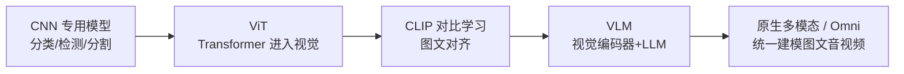

# 视觉理解：从 CLIP 到原生多模态

> 让模型"看懂"世界经历了三个时代：**专用视觉模型**（分类/检测/分割各自为战）、**对齐时代**（CLIP 把图像与文本映射到同一空间）、**原生多模态时代**（一个模型同时理解图文甚至生成）。这条线的终局是"视觉成为大模型的感官"。

## 演进主线

## CLIP：对齐一切的对比学习

- **机制**：海量图文对，双塔编码器（图像塔 + 文本塔）+ 对比损失——把"像不像"变成空间中的距离
- **为什么重要**：
  1. 零样本能力：不用为每个分类任务重训，文本即标签
  2. 成为后续所有生成模型的"眼睛"（Stable Diffusion 用 CLIP 文本编码器）
  3. 证明了"对齐"可以替代"标注"
- **后继**：SigLIP（Sigmoid 损失，批内效率更高）、中文多语言变体（Chinese-CLIP 等）

## VLM：视觉编码器 + LLM 的组合范式

- **标准结构**：视觉编码器（ViT 系）→ 投影层（MLP/Resampler）→ LLM
- **关键设计取舍**：
  - 分辨率策略：动态分辨率切片（AnyRes）vs 固定缩放——直接决定"能不能看清小字/细节"
  - 视觉 token 数：越多越清晰，但上下文成本线性增长
  - 投影层形态：简单 MLP（保细节）vs Q-Former/Resampler（压缩）
- **能力谱系**：通用图文问答 → 文档/图表理解（OCR-free）→ 视觉定位（grounding，输出坐标）→ 视频理解（抽帧/时序建模）
- **评测现实**：文档理解、图表推理、细粒度识别仍是各家模型的差异区——选型必须用业务数据实测

## SAM 与视觉分割的基础模型化

- **SAM（Segment Anything）**：把"分割"变成可提示的通用能力（点/框/文本提示）
- **意义**：视觉基础任务也走上了"预训练 + 提示"的范式；SAM 2 扩展到视频
- **应用形态**：数据标注自动化、图像编辑管线、机器人感知

## 原生多模态与 Omni 模型

- **路线分野**：
  - **组合式**：视觉编码器 + LLM 拼接（工程灵活，模态间有"翻译损耗"）
  - **原生式**：统一 tokenizer / 联合预训练，图文（乃至语音）在同一表征空间——跨模态推理更自然，训练成本更高
- **Omni 方向**：输入输出同时覆盖文、图、音、视频，实时交互（语音+视觉同时对话）成为产品化竞争点
- **架构趋势**：视觉理解与视觉生成的边界模糊——理解模型长出"像素输出头"即成生成模型，两者正在融合

## 2026 格局：主力模型速览（更新于 2026-09）

| 谱系 | 代表 | 时间 | 要点 |
| --- | --- | --- | --- |
| 分割基座 | SAM 3 / SAM 3D（Meta） | 2025-11 | "Segment Anything with Concepts"：文本提示的检测+分割+跟踪统一 |
| 开源 VLM | Qwen3-VL（4B–235B） | 2025-09 起 | 深度视觉推理、长视频理解、视觉 Agent |
| 开源 VLM | InternVL3.5 | 2025-08 | 级联 RL + 动态视觉路由，1B–241B 全尺寸 |
| 闭源原生 | GPT-4o → GPT-5 | 2024-05 / 2025-08 | GPT-4o 首次单塔原生多模态，终结拼接管线 |
| 闭源原生 | Gemini 3 Pro / Flash | 2025-11/12 | 推理+多模态 SOTA、1M 上下文 |
| Omni | Qwen3-Omni | 2025-09 | Thinker-Talker 双模块，119 语言文本/20 语言语音，实时流式 |

**格局要点**：
- **三段式拼接 → 原生单塔**：GPT-4o 之后，旗舰普遍原生统一图文音；开源侧（Qwen3.5 系）也已原生多模态
- **RL 进入视觉理解**：InternVL3.5 级联 RL、Qwen3-VL 视觉推理 RL——视觉能力开始吃强化学习的红利
- **Agent 化是新主线**：GUI 操作、计算机使用、视频级任务执行成为旗舰标配卖点——与 [Agentic 支柱](/agentic/)合流

## 实践观点

- **选 VLM 看三件事**：分辨率策略（决定看清细节的能力）、视觉 token 成本（决定调用账单）、grounding 能力（决定能否做自动化操作）
- **OCR 没有被取代**：复杂版式（表格/印章/手写）仍需专用 OCR 打底，VLM 做理解层——组合管线优于单模型硬扛
- **评测别只看榜单**：通用榜单（MMMU 类）与业务场景（你的单据、你的图表）表现可以差很远

## 参考资料

- [Learning Transferable Visual Models From Natural Language Supervision (CLIP)](https://arxiv.org/abs/2103.00020) — 图文对齐奠基（2021）
- [Segment Anything](https://arxiv.org/abs/2304.02643) — 分割基础模型（2023）
- 站内相关：[图像生成](/ai/models/image-gen) · [大语言模型架构解析](/ai/models/llm) · [多模态应用](/ai/application/multimodal)
