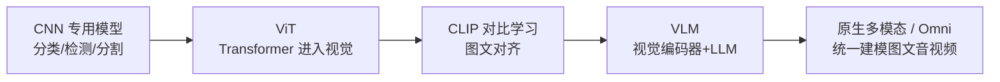
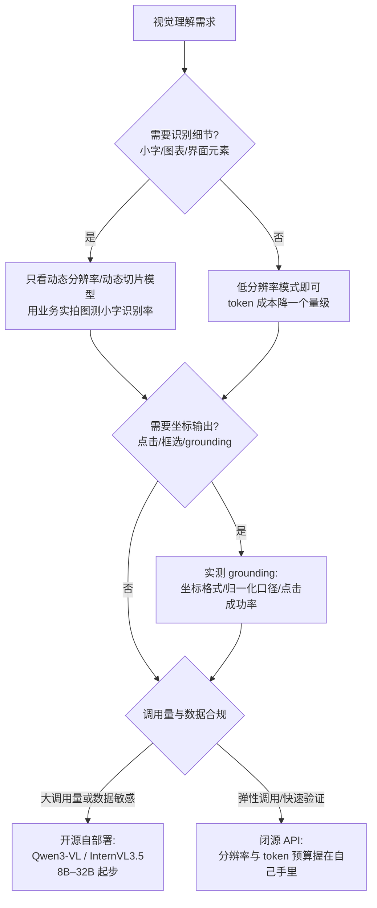

# 视觉理解：从 CLIP 到原生多模态

> 让模型"看懂"世界经历了三个时代：**专用视觉模型**（分类/检测/分割各自为战）、**对齐时代**（CLIP 把图像与文本映射到同一空间）、**原生多模态时代**（一个模型同时理解图文甚至生成）。这条线的终局是"视觉成为大模型的感官"。本文面向需要选型视觉理解模型、设计多模态系统的工程师：读完你会有视觉理解十年演进的技术坐标，并能对分辨率策略、视觉 token 成本、grounding 能力这些实际决策点下判断。

## 演进主线

主线上有三个转折点，每一步都在解决上一个时代的主要矛盾：

1. **CNN 统一了骨干网络**：分类、检测、分割共用同一个 backbone，"骨干 + 任务头"范式确立——但每个任务仍要各自的标注数据。
2. **ViT 统一了架构**：视觉骨干变成 Transformer，与 NLP 共享 scaling law 和工程栈——这是后来"视觉编码器即插即用"的前提。
3. **CLIP 统一了空间**：图像与文本投影到同一向量空间，"理解"变成距离计算，"标签"变成自然语言——零样本成为可能，也为 VLM 铺好了接口。

VLM 与 Omni 则是水到渠成：既然视觉已经是与文本同空间的向量，把它喂给 LLM 就好了。

## 专用视觉时代：CNN 如何统一分类、检测、分割

2012 年 AlexNet 在 ImageNet 上点燃深度学习，2015 年 ResNet 解决深层网络训练问题，成为此后十年的默认骨干。这个时代最大的贡献不是某个任务，而是**把任务统一到骨干网络上**：

- **分类**：backbone + 分类头，输出类别概率
- **检测**：backbone + 候选框/分类回归头（Faster R-CNN 类），输出框
- **分割**：backbone + 逐像素头（FCN、U-Net、Mask R-CNN），输出掩码

我在这个时代的实际体感是：**精度从来不是瓶颈，标注才是**。每接一个新场景（缺陷检测、证件识别、车牌……），第一件事都是攒几千上万张标注图；模型只认识训练时见过的闭集类别，需求一变就要重训。视觉模型迟迟没能像今天的 API 一样随处可用，根因是每个场景的边际成本都压不下来。

这个时代留下的遗产是两样：骨干网络规模化训练的方法论，以及开源预训练权重的工程习惯——后来 ViT 和 CLIP 都直接受益。

## ViT：Transformer 为什么能取代 CNN

2020 年 Google 的 ViT 论文（ICLR 2021）做法非常激进：**把图像切成 16×16 的 patch（图像块），每个 patch 当一个"词"，直接塞进标准 Transformer encoder**，一个卷积层都不用。当时这个路线并不被看好——在 ImageNet 这种"小数据"上，ViT 打不过 ResNet，因为 Transformer 缺少 CNN 与生俱来的归纳偏置（局部性、平移不变性等"天生会看图"的先验），一切得从数据里学。

转折在**规模**：当预训练数据扩到 JFT-300M（约 3 亿张带标签图），ViT 在 ImageNet 上超过了所有 CNN，且训练更省算力，最好成绩 88.55%。论文的核心结论——**只要数据和算力够大，可以绕开 CNN 的专用设计**——在此后几年被反复验证。

对一线工程师来说，ViT 赢的不只是精度，还有三件更实际的事：

1. **架构统一**：视觉和 NLP 变成同一类模型，一套训练/推理框架通吃
2. **Scaling law 共享**：参数与数据规模的收益曲线从 NLP 直接平移过来
3. **生态复用**：注意力加速、混合精度、并行策略全部继承

这就是为什么后来的 CLIP、SAM、几乎所有 VLM，视觉编码器默认都是 ViT 系。

## CLIP：对齐一切的对比学习

2021 年 OpenAI 的 CLIP 换了监督信号：**不用人工标签，用互联网上天然存在的图文配对**。收集 4 亿图文对，双塔编码器（图像塔 + 文本塔）+ 对比损失——一个批次里有 N 对图文，把配对的拉近、不配对的推远，训练目标就一句话：**预测哪句描述对应这张图**。

*图源：CLIP 论文原图（[arXiv:2103.00020](https://arxiv.org/abs/2103.00020)，经 [ar5iv](https://ar5iv.labs.arxiv.org/html/2103.00020) 渲染）*

对比训练目标直接推出零样本能力：论文有个很妙的视角——**预训练的每一步都等价于在一个随机的"32,768 类分类任务"上训练**（批大小 32,768，每个类别由一句自然语言描述定义）。推理时把候选标签过一遍文本塔、取与图像最近的类别即可。结果：

- ImageNet 零样本准确率 **76.2%**，与原始 ResNet-50 持平——而后者的 128 万张标注图，CLIP 一张没用
- 27 个数据集的评测套件里，零样本 CLIP 在其中 16 个上优于有监督的 ResNet-50 线性探针

**为什么重要**：

1. **文本即标签**：新类别不用重训，写一句描述就行——这是零样本能力的来源
2. **"对齐"替代"标注"**：互联网免费的图文对，打赢了百万级昂贵的人工标注
3. **成为通用接口**：生成侧（Stable Diffusion 用 CLIP 文本编码器）和理解侧（后续 VLM 的视觉编码器多是 CLIP 的 ViT）都建在它上面

后继沿两条线演进：**SigLIP** 把 softmax 对比损失换成 Sigmoid 损失，摆脱对全局负样本的依赖，批内效率和扩展性更好；**Chinese-CLIP** 等多语言变体补齐中文场景的对齐质量。

也说明边界：CLIP 式对齐在**计数、空间关系、细粒度属性**上偏弱（"左数第二个人""图里的文字"基本不行）——论文自己承认这一点，这正是后来 VLM 要补的位。

## VLM：视觉编码器 + 投影层 + LLM 的组合范式

"把视觉接进 LLM"的范式在 2023 年定型，两个里程碑：

- **BLIP-2**（Salesforce，2023-01）：冻结图像编码器与 LLM，中间训一个轻量 **Q-Former**（带可学习 query 的小 Transformer），把图像特征压缩成几十个向量 token——用极少的可训练参数接通两个冻结大模型，但压缩必然损失细节
- **LLaVA**（2023-04）：反其道行之，结构极简——CLIP ViT + 一层投影 + 开源 LLM，关键贡献是**视觉指令微调**：用 GPT-4 围绕图像描述生成大量问答数据来训练。LLaVA-1.5 进一步证明：简单的 MLP 投影 + 高质量指令数据，就能打赢复杂的桥接结构

今天的主流 VLM 基本都是"视觉编码器 → 投影层 → LLM"三段式的变体。以开源旗舰 Qwen3-VL 的官方架构图为例：

*图源：QwenLM/Qwen3-VL 官方仓库 README（[github.com/QwenLM/Qwen3-VL](https://github.com/QwenLM/Qwen3-VL)）*

图上除了三段式骨架，工程增量都在解决同一件事——**看得更清、花得更少**。关键设计取舍：

- **分辨率策略**：固定缩放必然丢细节；动态分辨率切片（AnyRes：把原图切成多个子图分别编码再汇总）与更彻底的原生动态分辨率（按原图宽高比分配视觉 token，Qwen2-VL 起采用）直接决定"能不能看清小字"——文档场景选型，这是我试的第一件事
- **视觉 token 数**：越多越清晰，但上下文成本线性增长——分辨率与成本是同一个旋钮的两端
- **投影层形态**：简单 MLP（保细节、token 多）vs Q-Former/Resampler（压缩、省 token），取决于下游对上下文预算的承受度

**能力谱系**：通用图文问答 → 文档/图表理解（OCR-free）→ 视觉定位（grounding，输出框/点坐标）→ 视频理解（抽帧/时间戳对齐）。

**评测现实**：文档理解、图表推理、细粒度识别仍是各家模型的差异区——选型必须用业务数据实测，公开榜单只能用来缩小候选圈。

## SAM 与视觉分割的基础模型化

分割任务同样走上了"基础模型化"，Meta 的 SAM 系列把这条路走完：

- **SAM 1**（2023）：用数据引擎攒出 SA-1B（1100 万张图、超 10 亿个掩码），训出**可提示**的分割模型——点一下/框一下给出掩码，零样本迁移到新领域
- **SAM 2**（2024）：扩展到视频——流式记忆（streaming memory）架构支持实时视频分割；图像分割比 SAM 快 6 倍，视频分割所需人工交互次数降到先前方法的三分之一

*图源：facebookresearch/sam2 官方仓库 README（[github.com/facebookresearch/sam2](https://github.com/facebookresearch/sam2)）*

- **SAM 3**（2025-11）："Segment Anything with Concepts"——提示升级为**名词短语或示例图**，把"检测 + 分割 + 跟踪图像/视频中所有匹配实例"统一进一个模型（官方口径：用文本或示例，对任意物体类别 detect, segment and track every example）

**意义**：视觉基础任务也走上了"预训练 + 提示"范式，"分割"不再是需要逐场景训练的能力，而是随取随用的基础设施。我在项目里见过的落地形态：数据标注自动化（给 VLM 训练数据批量产掩码）、图像编辑管线（先分割再替换）、机器人感知（场景中一切皆可分割）。作为独立研究方向的"分割任务"，基本被基础能力收编了。

## 原生多模态与 Omni 模型

VLM 成熟之后，路线开始分野：

- **组合式**：视觉编码器 + 投影层 + LLM 拼接，模块可独立升级替换，工程灵活是最大优势；代价是模态之间隔了一层"翻译"
- **原生式**：统一 tokenizer / 联合预训练，图文（乃至语音）在早期就进同一表征空间（early fusion，早期融合）——跨模态推理更自然，训练成本和数据门槛也更高

闭源旗舰选了原生：GPT-4o（2024-05）单网络端到端处理图文音，终结了"语音识别 + LLM + 语音合成"的拼接管线。开源侧同样在试：Meta 的 **Chameleon** 是混合模态早期融合预训练的代表，InternVL3 把 Native Multimodal Pre-Training 引入开源体系，Qwen3-Omni 用 Thinker-Talker 双模块做到文本/图像/音频/视频的输入输出全覆盖，实时流式交互已经产品化。

架构趋势上，视觉理解与视觉生成的边界正在模糊——理解模型长出"像素输出头"即成生成模型，理解与生成统一是各家旗舰的共同方向。我的判断：**组合式在相当长时间内仍是工程落地主流**——模块可替换、成本可控、方便私有化微调；原生式的优势在体验上限，选型时别为"架构先进"买单，要为业务指标买单。

## 2026 格局：主力模型速览（更新于 2026-09）

| 谱系 | 代表 | 时间 | 要点 |
| --- | --- | --- | --- |
| 分割基座 | SAM 3 / SAM 3D（Meta） | 2025-11 | "Segment Anything with Concepts"：文本提示的检测+分割+跟踪统一 |
| 开源 VLM | Qwen3-VL（4B–235B） | 2025-09 起 | 深度视觉推理、长视频理解、视觉 Agent |
| 开源 VLM | InternVL3.5 | 2025-08 | 级联 RL + 动态视觉路由，1B–241B 全尺寸 |
| 闭源原生 | GPT-4o → GPT-5 | 2024-05 / 2025-08 | GPT-4o 首次单塔原生多模态，终结拼接管线 |
| 闭源原生 | Gemini 3 Pro / Flash | 2025-11/12 | 推理+多模态 SOTA、1M 上下文 |
| Omni | Qwen3-Omni | 2025-09 | Thinker-Talker 双模块，119 语言文本/20 语言语音，实时流式 |

**格局要点**：

- **三段式拼接 → 原生单塔**：GPT-4o 之后，旗舰普遍原生统一图文音；开源侧（Qwen3.5 系）也已原生多模态
- **RL 进入视觉理解**：InternVL3.5 级联 RL、Qwen3-VL 视觉推理 RL——视觉能力开始吃强化学习的红利
- **Agent 化是新主线**：GUI 操作、计算机使用、视频级任务执行成为旗舰标配卖点——与 [Agentic 支柱](/agentic/)合流

## 选型决策：一张图确定评测路径

## 工程视角：视觉理解的成本结构与典型应用

### 图像 token 数决定账单

VLM 调用按 token 计费，图像输入按各家"切片"规则折算，差异很大：

| 厂商规则 | 折算方式 | 典型量级 |
| --- | --- | --- |
| OpenAI 系（detail=low） | 固定计费 | 85 token/图 |
| OpenAI 系（detail=high） | 缩放后按 512×512 切片 | 85 + 170 × 切片数 |
| Gemini 系 | ≤384×384 固定；更大按 768×768 切片 | 258 token/图或/片 |
| Qwen 系（开源/百炼） | 原生动态分辨率，token 数与图像面积成正比 | 用 min_pixels/max_pixels 参数封顶 |

三条实践结论：

1. **分辨率是成本参数，不只是效果参数**。一张高分辨率截图折算几千 token 很常见，比整段提示词都贵
2. **视频 = 抽帧密度 × 每帧 token × 时长**，小时级视频的账单要先采样测算，不要直接整条丢进去
3. 自部署开源 VLM 时，成本大头是视觉 token 的 prefill——处理大图优先选支持视觉侧缓存的推理框架

### 三类典型应用

- **文档理解 / OCR 替代**：VLM 直接读扫描件、图表、图文混排，省掉传统 OCR 的版面解析管线；但复杂版式（多线表格、印章、手写）用专用 OCR 打底、VLM 做理解层，仍是最稳的组合
- **视频理解**：抽帧 + 长上下文 VLM 是主流路线。开源旗舰已支持原生 256K 上下文并可扩至 1M，小时级视频全召回、秒级时间戳索引；工程上要权衡抽帧密度与成本
- **GUI Agent 的眼睛**：计算机使用/手机操作 Agent 本质是"截图 → VLM 识别元素并给出坐标 → 执行点击"的循环，既要小字可见（动态分辨率），又要 grounding 准（坐标可信）。这是"视觉 Agent 能力"成为 2025 年起旗舰卖点的直接原因

## 实践观点

- **选 VLM 看三件事**：分辨率策略（决定看清细节的能力）、视觉 token 成本（决定调用账单）、grounding 能力（决定能否做自动化操作）
- **OCR 没有被取代**：复杂版式（表格/印章/手写）仍需专用 OCR 打底，VLM 做理解层——组合管线优于单模型硬扛
- **评测别只看榜单**：通用榜单（MMMU 类）与业务场景（你的单据、你的图表、你的界面截图）表现可以差很远——拿 100 张业务实拍图做小规模评测，比读十篇横评有用

## 常见坑

| 坑 | 现象 | 对策 |
| --- | --- | --- |
| 不设分辨率预算 | 4K 大图按高分辨率计费，账单与延迟双爆 | 按业务下限设上限：API 用 detail/尺寸参数，自部署控像素上限 |
| 固定缩放一刀切 | 小字被缩糊，模型"看不见" | 文档场景必须用业务实拍图测小字与表格 |
| 细节幻觉 | 表格读出并不存在的行列 | 关键字段用 OCR 交叉校验，或要求模型引用原文区域 |
| grounding 口径没对齐 | 点击位置系统性偏移 | 先确认坐标格式（归一化 0–1 还是绝对像素），跑标定样例 |
| 视频直接整条输入 | 上下文溢出或超时 | 先抽帧再输入，抽帧间隔按任务信息密度定 |
| 只测公开榜单 | 榜单分高、业务拉胯 | 自建业务小评测集，榜单只用于缩小候选圈 |

## 参考资料

<Refs>

> 更新于 2026-09-03，访问日期均为 2026-09-03。

**文字来源**

- [An Image is Worth 16x16 Words: Transformers for Image Recognition at Scale（ViT，arXiv:2010.11929）](https://arxiv.org/abs/2010.11929) — patch 机制与"大规模预训练下 Transformer 可取代 CNN"的结论
- [Learning Transferable Visual Models From Natural Language Supervision（CLIP，arXiv:2103.00020）](https://arxiv.org/abs/2103.00020) — 4 亿图文对对比预训练与零样本评测（76.2% ImageNet、27 数据集套件）
- [CLIP: Connecting Text and Images（OpenAI 官方博客）](https://openai.com/research/clip-connecting-text-and-images) — CLIP 动机与零样本结果的官方介绍（页面有反爬墙，标题与内容经搜索结果交叉确认）
- [BLIP-2: Bootstrapping Language-Image Pre-training with Frozen Image Encoders and Large Language Models（arXiv:2301.12597）](https://arxiv.org/abs/2301.12597) — Q-Former 桥接结构的出处
- [Visual Instruction Tuning（LLaVA，arXiv:2304.08485）](https://arxiv.org/abs/2304.08485) · [Improved Baselines with Visual Instruction Tuning（LLaVA-1.5，arXiv:2310.03744）](https://arxiv.org/abs/2310.03744) — 简单投影层 + 视觉指令微调确立 VLM 范式
- [Sigmoid Loss for Language Image Pre-Training（SigLIP，arXiv:2303.15343）](https://arxiv.org/abs/2303.15343) — CLIP 对比损失的改进
- [Chinese CLIP: Contrastive Vision-Language Pretraining in Chinese（arXiv:2211.01335）](https://arxiv.org/abs/2211.01335) — 中文图文对齐变体
- [Segment Anything（SAM，arXiv:2304.02643）](https://arxiv.org/abs/2304.02643) · [SAM 2（arXiv:2408.00714）](https://arxiv.org/abs/2408.00714) · [SAM 3: Segment Anything with Concepts（arXiv:2511.16719）](https://arxiv.org/abs/2511.16719) — 分割基础模型三部曲：提示分割、视频流式记忆、概念提示统一检测分割跟踪
- [SAM 3 — Meta AI 官方页](https://ai.meta.com/research/sam3/) · [SAM 3.1 发布博客](https://ai.meta.com/blog/segment-anything-model-3/) — 概念提示能力的官方描述
- [QwenLM/Qwen3-VL（GitHub 官方仓库）](https://github.com/QwenLM/Qwen3-VL) · [Qwen3-VL Technical Report（arXiv:2511.21631）](https://arxiv.org/abs/2511.21631) — 架构增量（Interleaved-MRoPE/DeepStack/时间戳对齐）、视觉 Agent、256K→1M 上下文
- [OpenGVLab/InternVL（GitHub 官方仓库）](https://github.com/OpenGVLab/InternVL) · [InternVL3.5 Report（arXiv:2508.18265）](https://huggingface.co/papers/2508.18265) — 1B–241B 全尺寸、原生多模态预训练与级联 RL 设计
- [Chameleon: Mixed-Modal Early-Fusion Foundation Models（arXiv:2405.09818）](https://arxiv.org/abs/2405.09818) — 原生早期融合路线代表
- [Understand and count tokens — Gemini API 官方文档](https://ai.google.dev/gemini-api/docs/tokens) — 图像 258 token 与 768×768 切片计费规则
- [Images and vision — OpenAI API 官方指南](https://developers.openai.com/api/docs/guides/images-vision) — detail 参数与图像 token 计算（85 + 170/片）
- [What does it cost to process an image with a vision model? — Roboflow Blog](https://blog.roboflow.com/image-token-cost-vlm/) — 各家图像 token 成本对比（第三方实测）

**图片来源**

- `clip-contrastive.png` ← [CLIP 论文图（ar5iv 渲染）](https://ar5iv.labs.arxiv.org/html/2103.00020)（原始出处 arXiv:2103.00020）
- `qwen3vl-architecture.jpg` ← [QwenLM/Qwen3-VL 官方仓库 README 架构图](https://github.com/QwenLM/Qwen3-VL)（已缩宽至 2000px）
- `sam2-architecture.png` ← [facebookresearch/sam2 官方仓库架构图](https://github.com/facebookresearch/sam2)

站内相关：[图像生成](/ai/models/image-gen) · [视频生成](/ai/models/video-gen) · [多模态应用](/ai/application/multimodal) · [大语言模型架构解析](/ai/models/llm)

</Refs>
