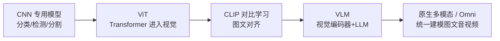
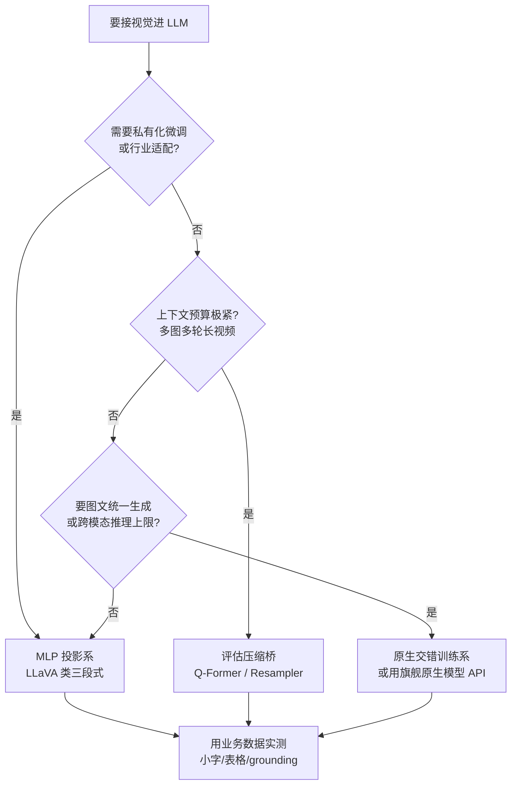
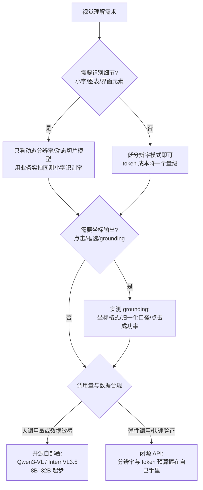

# 视觉理解：从 CLIP 到原生多模态

> 面向需要选型视觉理解模型、设计多模态系统、或把"看图"能力接进产品的工程师与方案架构师。让模型"看懂"世界经历了三个时代：**专用视觉模型**（分类/检测/分割各自为战）、**对齐时代**（CLIP 把图像与文本映射到同一空间）、**原生多模态时代**（一个模型同时理解图文甚至生成）。这篇不按论文综述的方式写，而是把主线上的每个机制逐步拆开：**图像怎样被切成 patch 变成 token、CLIP 的对比损失为什么能推出零样本分类、视觉接进 LLM 的三种接入方式各自的工程取舍、分辨率与视觉 token 成本这笔账怎么算、grounding/OCR/视频这些专题在落地时的坑在哪**。读完你会有一条视觉理解十年演进的技术坐标，能对分辨率策略、token 预算、grounding 口径这些实际决策点下判断，并知道 2026 年（截至 2026-09）原生多模态与视觉 Agent 进展到了哪一步。全文主线一句话：**视觉理解的演进史，就是"视觉表示"不断向"文本表示"靠拢、最终被大模型收编的历史**。

## 演进主线



主线上有三个转折点，每一步都在解决上一个时代的主要矛盾：

1. **CNN 统一了骨干网络**：分类、检测、分割共用同一个 backbone，"骨干 + 任务头"范式确立——但每个任务仍要各自的标注数据。
2. **ViT 统一了架构**：视觉骨干变成 Transformer，与 NLP 共享 scaling law 和工程栈——这是后来"视觉编码器即插即用"的前提。
3. **CLIP 统一了空间**：图像与文本投影到同一向量空间，"理解"变成距离计算，"标签"变成自然语言——零样本成为可能，也为 VLM 铺好了接口。

VLM 与 Omni 则是水到渠成：既然视觉已经是与文本同空间的向量，把它喂给 LLM 就好了。而 2025 年之后的新变化是：这条"拼接"路线开始被"原生"路线挑战——视觉不再经过一个外挂编码器翻译，而是从预训练第一天就和文本在同一词表里联合建模。本文按"机制 → 范式 → 专题 → 成本与选型"的顺序展开。

## 专用视觉时代：CNN 如何统一分类、检测、分割

2012 年 AlexNet 在 ImageNet 上点燃深度学习，2015 年 ResNet 解决深层网络训练问题，成为此后十年的默认骨干。这个时代最大的贡献不是某个任务，而是**把任务统一到骨干网络上**：

- **分类**：backbone + 分类头，输出类别概率
- **检测**：backbone + 候选框/分类回归头（Faster R-CNN 类），输出框
- **分割**：backbone + 逐像素头（FCN、U-Net、Mask R-CNN），输出掩码

我在这个时代的实际体感是：**精度从来不是瓶颈，标注才是**。每接一个新场景（缺陷检测、证件识别、车牌……），第一件事都是攒几千上万张标注图；模型只认识训练时见过的闭集类别，需求一变就要重训。视觉模型迟迟没能像今天的 API 一样随处可用，根因是每个场景的边际成本都压不下来。

这个时代留下的遗产是两样：骨干网络规模化训练的方法论，以及开源预训练权重的工程习惯——后来 ViT 和 CLIP 都直接受益。

## ViT：图像怎样变成 token

2020 年 Google 的 ViT 论文（ICLR 2021）做法非常激进：**把图像切成 16×16 的 patch（图像块），每个 patch 当一个"词"，直接塞进标准 Transformer encoder**，一个卷积层都不用。今天几乎所有 VLM 的视觉编码器都站在这一步上，所以值得把"图像变 token"的过程逐步拆开。

### Patch 化机制：从像素到序列的六步

以标准 ViT-B/16、输入 224×224 为例，一张图变成 LLM 能吃的序列要经过六步：

1. **尺寸归一**：训练时把输入 resize/crop 到固定 H×W（如 224×224）；推理时 ViT 可以接受其他尺寸，但位置编码需要做插值，所以多数实现仍约束输入为 patch 尺寸的整数倍。
2. **网格切块**：按 P×P（16 或 14）切出不重叠的 patch，数量 N = H/P × W/P。224÷16=14，即 14×14=196 个 patch。**这一步是 ViT 全部"视觉先验"的来源**：它假设局部像素块是语义的基本单元，除此之外不给模型任何归纳偏置。
3. **展平 + 线性投影**：每个 patch 展平为 P×P×3 维向量（16×16×3=768），过一个线性层（patch embedding，等价于 kernel=16、stride=16 的一次卷积）投影到模型维度 D。
4. **加位置编码与 [class] token**：序列头部拼一个可学习的 [class] token，每个位置加可学习的一维位置编码——注意是**一维**的，行列结构在切块之后就被"忘记"了，空间关系全靠注意力自己学。
5. **Transformer encoder**：L 层标准 encoder（多头自注意力 + MLP，残差 + LayerNorm），所有 patch token 全局互看。
6. **取输出**：分类任务取 [class] 位置输出过 MLP head；**在 VLM 时代取的不是 [class]，而是全部 patch token 序列**——每个 patch token 就是后面要进 LLM 的"视觉词"。

各档位的结构参数（论文公开值）：

| 型号 | patch | 层数 | 维度 | 注意力头 | 参数量 | 224 输入 token 数 |
| --- | --- | --- | --- | --- | --- | --- |
| ViT-B/16 | 16 | 12 | 768 | 12 | 86M | 196 + 1 |
| ViT-L/16 | 16 | 24 | 1024 | 16 | 307M | 196 + 1 |
| ViT-H/14 | 14 | 32 | 1280 | 16 | 632M | 256 + 1 |

两个直接影响工程预算的推论：

- **token 数与面积成正比、与 patch 平方成反比**：448×448 在 /16 下是 784 个 token，是 224 的 4 倍；而自注意力计算量随序列长度平方增长，视觉侧的算力账在这里先爆炸一次，进 LLM 之后还要再算一次上下文账（后文"分辨率与 token 成本"一节展开）。
- **patch 越小越贵也越细**：/14 比 /16 在同尺寸下多约 30% token，换来更细的纹理与小字可见性——CLIP 的最强档 ViT-L/14 与 Qwen 系沿用 14 都是这个权衡。


*图源：ViT 论文图 1（[arXiv:2010.11929](https://arxiv.org/abs/2010.11929)，经 [ar5iv](https://ar5iv.labs.arxiv.org/html/2010.11929) 渲染）*

### 一次完整前向的数字样例

把上面六步串成一条带形状的流水线（ViT-B/16、输入 224×224、批大小 1），便于排查"视觉侧到底算了什么"：

```text
输入图像 x:            [1, 3, 224, 224]
  ① 网格切块 P=16   →  [1, 196, 768]        # 196 个 patch，每个 16*16*3
  ② patch embedding →  [1, 196, 768]        # Linear 768→768 (ViT-B D=768)
  ③ 拼 [class]      →  [1, 197, 768]
  ④ + 位置编码       →  [1, 197, 768]        # 可学习 1D position embedding
  ⑤ 12 层 encoder   →  [1, 197, 768]        # 每层: MSA(12 头) + MLP(3072)
  ⑥a 分类: 取 [:,0]  →  [768] → MLP head → 类别 logits
  ⑥b VLM: 取 [:,1:]  →  [196, 768]          # 这 196 个向量就是"视觉词"
```

两个常被忽略的实现细节：

- **位置编码插值**：推理分辨率与训练不一致时，1D 位置编码要按二维网格重排后做双线性插值——插值质量直接影响高分辨率下的定位精度，这是"把 224 的模型直接喂 4K 图"效果差的隐性原因之一。
- **patch token 而非 [class]**：接 LLM 时用的是 ⑥b 的 patch 序列；[class] token 是为分类头设计的摘要向量，信息量不足以支撑"看图回答任意问题"。

### 为什么 Transformer 能取代 CNN

ViT 刚出来时路线并不被看好——在 ImageNet 这种"小数据"上，ViT 打不过 ResNet，因为 Transformer 缺少 CNN 与生俱来的归纳偏置（局部性、平移不变性等"天生会看图"的先验），一切得从数据里学。

转折在**规模**：当预训练数据扩到 JFT-300M（约 3 亿张带标签图），ViT 在 ImageNet 上超过了所有 CNN，且训练更省算力，最好成绩 88.55%。论文的核心结论——**只要数据和算力够大，可以绕开 CNN 的专用设计**——在此后几年被反复验证。

对一线工程师来说，ViT 赢的不只是精度，还有三件更实际的事：

1. **架构统一**：视觉和 NLP 变成同一类模型，一套训练/推理框架通吃
2. **Scaling law 共享**：参数与数据规模的收益曲线从 NLP 直接平移过来
3. **生态复用**：注意力加速、混合精度、并行策略全部继承

这就是为什么后来的 CLIP、SAM、几乎所有 VLM，视觉编码器默认都是 ViT 系。我的经验判断：2023 年之后新项目里"自研 CNN 骨干"基本只出现在极端端侧或特殊传感器场景，云端视觉 backbone 选型默认从 ViT 系权重开始。

把两代骨干的工程特征摆在一起，便于回答"老管线要不要换"：

| 维度 | CNN 骨干（ResNet 类） | ViT 骨干 | 工程含义 |
| --- | --- | --- | --- |
| 归纳偏置 | 局部性、平移不变性内置 | 几乎为零，靠数据学 | 小数据场景 CNN 仍可能更稳 |
| 感受野 | 逐层扩大 | 第一层即全局 | ViT 更擅长全局布局/关系类任务 |
| 输出形态 | 特征图（保留二维结构） | token 序列 | ViT 输出天然适配 Transformer 下游 |
|  scaling 行为 | 收益曲线较早平台期 | 跟随数据/算力持续增长 | 有大数据时 ViT 上限更高 |
| 生态 | 成熟但停止演进 | 与 LLM 生态共用工具链 | 新项目维护成本 ViT 更低 |

## CLIP：对比学习机制与零样本分类

2021 年 OpenAI 的 CLIP 换了监督信号：**不用人工标签，用互联网上天然存在的图文配对**。收集 4 亿图文对（WIT 数据集），双塔编码器（图像塔 + 文本塔）+ 对比损失——一个批次里有 N 对图文，把配对的拉近、不配对的推远，训练目标就一句话：**预测哪句描述对应这张图**。

### 训练目标：一个批次就是一个 32768 类分类任务

机制逐步拆开：

1. **双塔编码**：图像塔是 ViT（或 ResNet），文本塔是一个 12 层、512 维的 Transformer，各自把输入编码成一个向量，再各过一个线性投影头映到同一 d 维共享空间，做 L2 归一化。
2. **相似度矩阵**：批内 N 张图与 N 句文本两两算余弦相似度，除以可学习温度参数 t，得到 N×N 的 logits 矩阵。CLIP 的批大小取 32,768——即每一步都有一个 32768×32768 的相似度矩阵。
3. **对称对比损失**：对矩阵的行（图找文）和列（文找图）分别做交叉熵，目标是对角线，两项取平均。写成伪公式即 L = -1/2N × Σ_i [ log exp(sim_ii/t) / Σ_j exp(sim_ij/t) + log exp(sim_ii/t) / Σ_j exp(sim_ji/t) ]。
4. **规模**：4 亿图文对训练 32 个 epoch，论文报告用 256 块 V100 训练约 18 天——这是"对齐"能力的全部代价，相比人工标注便宜一个数量级。


*图源：CLIP 论文图 1（[arXiv:2103.00020](https://arxiv.org/abs/2103.00020)，经 [ar5iv](https://ar5iv.labs.arxiv.org/html/2103.00020) 渲染）*

### 一步训练的伪代码

```python
# 一个 batch: N = 32768 对图文
images, texts = next(batch)
I = normalize(proj_i(image_tower(images)))   # [N, d] 图像表示
T = normalize(proj_t(text_tower(texts)))     # [N, d] 文本表示
logits = I @ T.T / t                         # [N, N], t 为可学习温度
labels = arange(N)                           # 对角线即配对
loss = 0.5 * (CE(logits, labels, dim=0)      # 列为分布: 文找图
            + CE(logits, labels, dim=1))     # 行为分布: 图找文
```

三个工程上值得记住的点：

- **负样本来自批内**：不需要显式构造负样本，批越大负样本越多、任务越难，这也是批大小开到 32768 的原因；代价是对比损失天然依赖大批量（SigLIP 正是针对这一点改进）
- **温度 t 可学习**：控制相似度分布的锐度，初始化约 0.07，训练中被学大或学小都会直接影响零样本校准
- **文本塔容量很小**：12 层、512 维、上下文 76 个 token——对齐的"智力"主要在图像塔与数据规模，文本塔只需把句子压成一个方向

常用档位（论文公开）：ViT-B/32 训练最快、检索/粗排够用；ViT-B/16 精度与成本均衡；ViT-L/14 与 ViT-L/14@336（336 分辨率微调）是零样本精度最高的两档，也是后来被 VLM 拿去做视觉编码器最多的权重。

### CLIP 表示的第一个工程用途：检索器

在 VLM 普及之前，CLIP 在工业界最常见的角色不是分类器而是**检索器与过滤器**：图像与文本同空间意味着"以文搜图""以图搜图"就是一次余弦相似度 top-k；数据管线里用它做图文相关性打分、近重复聚类、NSFW/品牌 logo 粗筛。我经历的项目里，给训练集做"图文配对质量清洗"用的就是这个打分——比人工抽检便宜两个数量级。这个用途今天仍然有效：VLM 太贵，不适合对百万级图库做全量扫描，CLIP/SigLIP 级别的轻量对齐模型仍是第一道筛子。

### 零样本分类为什么成立

对比训练目标直接推出零样本能力：论文有个很妙的视角——**预训练的每一步都等价于在一个随机的"32,768 类分类任务"上训练**（批大小 32,768，每个类别由一句自然语言描述定义）。模型从第一天起学的就不是"第 k 类"，而是"图像表示与描述它的句子的表示对齐"。推理时：

1. 把候选标签套进提示模板拼成句子（ImageNet 用 "a photo of a {label}" 等 **80 个模板做 prompt ensemble**，取文本表示均值，比单模板稳几个点）；
2. 句子过文本塔得到类别表示；
3. 图像表示与各类别表示比相似度，取最近者——**分类器是现算的，不需要任何训练样本**。

结果：

- ImageNet 零样本准确率 **76.2%**，与原始 ResNet-50 持平——而后者的 128 万张标注图，CLIP 一张没用
- 27 个数据集的评测套件里，零样本 CLIP 在其中 16 个上优于有监督的 ResNet-50 线性探针

**为什么重要**：

1. **文本即标签**：新类别不用重训，写一句描述就行——这是零样本能力的来源
2. **"对齐"替代"标注"**：互联网免费的图文对，打赢了百万级昂贵的人工标注
3. **成为通用接口**：生成侧（Stable Diffusion 用 CLIP 文本编码器）和理解侧（后续 VLM 的视觉编码器多是 CLIP 的 ViT）都建在它上面

### 后继与边界

后继沿两条线演进：**SigLIP** 把 softmax 对比损失换成 Sigmoid 损失——每个图文对独立做二分类（配对为正、不配对为负），不再需要全批归一化，因此摆脱对超大 batch 的依赖，小 batch 也能高效训练、扩展性更好；**Chinese-CLIP** 等多语言变体用中文图文对补齐中文场景的对齐质量，中文检索与零样本分类明显优于直接用英文 CLIP 翻标签。

也要说清边界：CLIP 式对齐在**计数、空间关系、细粒度属性**上偏弱（"左数第二个人""图里的文字"基本不行）——论文自己承认这一点，这正是后来 VLM 要补的位。我在项目里见过的典型误用：拿 CLIP 相似度做"图里有没有三根导线"这类计数校验，准确率远不如直接上 VLM 问一句。

## VLM：把视觉接进 LLM 的三种接入方式

"把视觉接进 LLM"的范式在 2022–2023 年定型。所有方案本质上都在回答三个问题：**视觉 token 从哪来、进 LLM 的哪个位置、占不占上下文**。按答案分成三种接入方式，我按"视觉信息注入 LLM 的位置"来分：

先看三段式的通用数据流，三种方式的差异都发生在这条流水线的中段：

```text
原图/视频帧
   │  ① 视觉编码器 (ViT 系): 像素 → patch token 序列
   ▼
patch tokens [N, D_v]           # N 由分辨率策略决定: 几十到上万
   │  ② 桥接层: 三选一的差异点
   │     a. 压缩+侧路交叉注意力 (Flamingo 类)
   │     b. MLP 投影后拼进上下文 (LLaVA 类)
   │     c. 无桥接: 图像离散 token 与文本同词表 (原生类)
   ▼
LLM 上下文: [视觉 token][指令文本 token]
   │  ③ 自回归生成回答 / 坐标 / 结构化结果
   ▼
输出文本
```

### 方式一：cross-attention 注入（Flamingo 类）

DeepMind 的 Flamingo（2022-04）是这条路线的原点：视觉编码器与语言模型**都冻结**，新增两类可训练模块把视觉"侧向"注入 LLM：

1. **Perceiver Resampler**：把视觉编码器输出的几百上千个 patch 特征，用一组可学习 query 交叉注意力压缩成固定 64 个视觉 latent（每张图/每帧视频一份）；
2. **gated cross-attention dense 层**：插在冻结 LM 的若干层之间，让文本 hidden states 以交叉注意力去"看"这 64 个视觉 latent；门控用 tanh 初始化成 0，保证训练起步时模型行为与原始 LM 完全一致，不破坏语言能力。

关键性质：**视觉 token 不进入 LLM 的上下文序列**——它们待在侧路，文本 token 逐层侧目而视。上下文窗口不被图像占用，多图/多帧的上下文成本增长很缓；代价是新增模块多、训练数据要图文交错（interleaved）语料，且这套结构在开源生态里没有成为默认件。Flamingo 的卖点还包括 few-shot in-context learning：示例图直接塞进提示里，不微调就能学新任务。


*图源：Flamingo 论文图 3（[arXiv:2204.14198](https://arxiv.org/abs/2204.14198)，经 [ar5iv](https://ar5iv.labs.arxiv.org/html/2204.14198) 渲染）*


*图源：Flamingo 论文图 4（[arXiv:2204.14198](https://arxiv.org/abs/2204.14198)，经 [ar5iv](https://ar5iv.labs.arxiv.org/html/2204.14198) 渲染）*

压缩桥的极端形态是 **BLIP-2**（Salesforce，2023-01）：冻结图像编码器与 LLM，中间训一个轻量 **Q-Former**（带 32 个可学习 query 的小 Transformer，约 188M 可训练参数），query 先自注意力、再与图像特征交叉注意力，最终把整张图压成 32 个向量 token 喂给 LLM——用极少的可训练参数接通两个冻结大模型。与 Flamingo 的区别在于：这 32 个 token 是**进入上下文序列**的，只是压缩率极高。压缩必然损失细节：通用图文问答够用，文档小字、密集表格这类"细节即答案"的场景会吃亏——这是我后来做文档理解时放弃纯 Q-Former 方案的直接原因。


*图源：BLIP-2 论文图 2（[arXiv:2301.12597](https://arxiv.org/abs/2301.12597)，经 [ar5iv](https://ar5iv.labs.arxiv.org/html/2301.12597) 渲染）*

### 方式二：MLP 投影进上下文（LLaVA 类）

LLaVA（2023-04）反其道行之，结构极简——CLIP ViT + 一层投影 + 开源 LLM，视觉 patch token **不压缩、直接拼进 LLM 上下文**。关键贡献是**视觉指令微调**：用 GPT-4 围绕图像描述生成约 158K 条问答/对话/推理指令数据来训练，两阶段：

1. **预训练对齐**：冻结视觉编码器与 LLM，只训投影层，用 595K 图文对学"视觉词到语言空间"的映射；
2. **指令微调**：解冻 LLM 与投影层，用视觉指令数据教模型"按人话回答看图问题"。


*图源：LLaVA 论文图 1（[arXiv:2304.08485](https://arxiv.org/abs/2304.08485)，经 [ar5iv](https://ar5iv.labs.arxiv.org/html/2304.08485) 渲染）*

LLaVA-1.5（2023-10）进一步证明：简单的 MLP 投影 + 高质量指令数据，就能打赢复杂的桥接结构——把一层 Linear 换成两层 MLP、分辨率 224 提到 336、指令数据扩到 665K 学术任务 VQA，即登顶当时的开源榜单。这条"简单投影 + 数据质量"的路线成为后来几乎所有开源 VLM 的默认件。

两阶段训练的数据与冻结策略，是理解后续所有开源 VLM 配方的模板：

| 阶段 | 数据 | 冻结 | 解冻 | 学什么 |
| --- | --- | --- | --- | --- |
| 预训练对齐 | 595K 图文对（CC 子集清洗caption） | 视觉编码器 + LLM | 仅投影层 | 视觉词 ↔ 语言空间的对齐 |
| 指令微调 | 约 158K GPT-4 生成指令（对话/推理/描述三类） | 无（LLM 与投影层均训） | LLM + 投影层 | 按人话回答看图问题 |
| LLaVA-1.5 增量 | 指令数据扩至 665K（学术任务 VQA） | 同上 | 同上 | 补 OCR/图表/科学问答等短板 |

工程含义：**阶段一只需要便宜数据且可大规模复用，阶段二的数据质量决定上限**——这也是为什么各家开源 VLM 的差异化越来越集中在数据配方与 RL 阶段，而不是结构。

分辨率上来之后，token 预算成为新矛盾，LLaVA-1.5-HD / AnyRes 系给出**切图策略**：把原图按网格切成若干子图分别独立编码、再拼一个全局缩略图汇总，细节与全局兼顾，token 数按子图数线性增长。这张图就是后面"切图策略"一节的起点。


*图源：LLaVA-1.5 论文图 2（[arXiv:2310.03744](https://arxiv.org/abs/2310.03744)，经 [ar5iv](https://ar5iv.labs.arxiv.org/html/2310.03744) 渲染）*

### 方式三：原生交错训练（Chameleon / Gemini 类）

第三种不在 LLM 外面接编码器，而是**把图像离散化成 token、放进与文本同一个词表**，从预训练第一天就用交错图文数据联合训练一个 Transformer：理解与生成是同一个自回归目标。Meta 的 Chameleon（2024-05）是开源侧代表：图像经 VQ 量化成离散 token，与文本 token 交错成一条序列端到端训练（约 10T 混合 token）。Gemini 系则是闭源侧"生而原生"的代表。


*图源：Chameleon 论文图 1（[arXiv:2405.09818](https://arxiv.org/abs/2405.09818)，经 [ar5iv](https://ar5iv.labs.arxiv.org/html/2405.09818) 渲染）*

这条路线的工程难点在**训练稳定性**：混合模态早期融合下损失容易尖峰，Chameleon 报告的关键改动是 query-key normalization（QK-norm）与 LayerNorm 位置调整——没有这些，大规模训练直接发散。代价之外是上限：跨模态推理（看着图改图、图文 interleaved 生成）天然顺畅，不存在"翻译层"信息瓶颈。

### 三种接入方式对比

| 维度 | cross-attention（Flamingo 类） | MLP 投影（LLaVA 类） | 原生交错训练（Chameleon/Gemini 类） |
| --- | --- | --- | --- |
| 视觉表示 | 连续特征，经 resampler 压缩成少量 latent | 连续 patch token，基本不压缩 | 离散图像 token，与文本同词表 |
| 注入位置 | 冻结 LM 层间的交叉注意力侧路 | 直接拼进 LLM 上下文序列 | 没有"注入"，一开始就是同一序列 |
| LLM 是否冻结 | 冻结 | 预训练冻、指令微调解冻 | 不存在独立 LLM，联合训练 |
| 上下文占用 | 低（视觉不占序列长度） | 高（token 数 = 上下文成本） | 高（图像 token 与文本同账） |
| 细节保真 | 中（64 latent 有损） | 高（patch 级保真） | 取决于视觉 tokenizer 码本与分辨率 |
| 训练成本 | 中（新模块 + 交错语料） | 低（投影层 + 指令数据） | 极高（10T 级混合 token、稳定性工程） |
| 代表 | Flamingo、BLIP-2 的 Q-Former 变体 | LLaVA 系、Qwen-VL 系、InternVL 系 | Chameleon、Gemini 系、GPT-4o 系 |
| 工程含义 / 怎么选 | 上下文预算极紧、多图多轮场景 | 开源微调与私有化默认件，生态最全 | 追求体验上限与图文统一生成，自研门槛最高 |

选型上我的经验判断：**要做私有化微调或行业适配，选 MLP 投影系**——结构简单意味着每一层都能改、数据配方公开、社区权重多；**上下文极其金贵（长视频、多轮多图）时才认真评估压缩桥**；原生路线目前是旗舰厂商的战场，业务方更多是"用"而不是"建"。



### Qwen-VL 系：把三段式做成工业标准

开源侧把"视觉编码器 → 投影层 → LLM"三段式打磨得最工业化的谱系是 Qwen-VL：Qwen-VL（2023-08）→ Qwen2-VL（2024-08）→ Qwen2.5-VL（2025-01）→ Qwen3-VL（2025-09），每一代增量都在解决同一件事——**看得更清、花得更少、定位更准**：

- **原生动态分辨率（Naive Dynamic Resolution，Qwen2-VL 起）**：不再固定缩放或固定网格，而是按原图宽高比直接分配视觉 token 数——每个视觉 token 对应约 28×28 像素（patch 14 + 2×2 合并），用 min_pixels / max_pixels 两个参数给 token 数设上下限。文档场景选型，这是我试的第一件事：小字能不能看清，取决于给它的 token 够不够。
- **M-RoPE 位置编码**：把旋转位置编码分解为时间、高、宽三个分量，图像、视频、文本在同一套位置体系里对齐——视频第 t 帧的 patch 在"时间维"上递增，空间维按行列排，长视频的位置外推因此稳得多。
- **DeepStack 与 Interleaved-MRoPE（Qwen3-VL）**：把 ViT 多层特征逐级注入 LLM 浅层（DeepStack），不增加上下文长度就喂进更多细节层级；位置编码进一步交错排布以适配图文混排与视频时间戳。
- **视频时间戳对齐**：视频段前插入文本时间戳 token，让模型把"第几分几秒"变成可读可答的语言对象，长视频定位不再靠猜帧号。

**一笔 token 账的样例**（按"1 token ≈ 28×28 像素"口径估算，帮助建立量级感）：

| 输入 | 像素 | 理论 token 数 | 说明 |
| --- | --- | --- | --- |
| 手机截图 1170×2532 | 约 296 万 | 约 3770 | 不封顶时的自然账 |
| 1080p 照片 1920×1080 | 约 207 万 | 约 2645 | 常见实拍图量级 |
| 4K 截图 3840×2160 | 约 829 万 | 约 10580 | 必须由 max_pixels 封顶 |
| 设 max_pixels 对应 1280 token | 任意 | 1280 | 长边信息被等比压缩，小字风险出现 |

经验边界：以上是"面积/784"的粗估，实际还受宽高比对齐到 28 的倍数、min_pixels 下界等规则修正；但**量级判断足够用来做预算**——4K 原图直喂与封顶 1280 token 之间差近一个数量级的钱与延迟，而"小字能不能读"往往就决定于这个选择。


*图源：Qwen2-VL 论文图 3（[arXiv:2409.12191](https://arxiv.org/abs/2409.12191)，经 [ar5iv](https://ar5iv.labs.arxiv.org/html/2409.12191) 渲染）*

今天的主流 VLM 基本都是三段式的变体。以开源旗舰 Qwen3-VL 的官方架构图为例：


*图源：QwenLM/Qwen3-VL 官方仓库 README（[github.com/QwenLM/Qwen3-VL](https://github.com/QwenLM/Qwen3-VL)）*

**能力谱系**：通用图文问答 → 文档/图表理解（OCR-free）→ 视觉定位（grounding，输出框/点坐标）→ 视频理解（抽帧/时间戳对齐）→ 视觉 Agent（看界面、出坐标、执行操作）。

**评测现实**：文档理解、图表推理、细粒度识别仍是各家模型的差异区——选型必须用业务数据实测，公开榜单只能用来缩小候选圈。

### 闭源旗舰线：GPT-4V/4o、Gemini、Claude

闭源侧不公开架构细节，但公开计费规则与能力边界——对工程方而言，那就是它们的"架构接口"：

- **GPT-4V → GPT-4o → GPT-5**：GPT-4V（2023）把视觉接进 GPT-4 一举抬高行业基线；GPT-4o（2024-05）单网络端到端处理图文音，终结"语音识别 + LLM + 语音合成"拼接管线；GPT-5（2025-08）起文本与图像在统一模型内原生处理，视觉输入直接参与原生工具调用。
- **Gemini 系**：从 Gemini 1.0（2023-12）起就是"生而多模态"的联合训练路线，1.5 系把长上下文推到百万 token 级使整段视频进上下文成为可能；Gemini 3 Pro（2025-11）以稀疏 MoE + 1M 上下文主打多模态 agentic 工作负载（文档、界面、长视频）。
- **Claude 系**：Claude 3（2024-03）起支持图像输入；Claude 3.5 Sonnet（2024-10）的 computer use 首次让模型直接操作 GUI，把"视觉 grounding"从评测指标变成生产力接口；后续 4 系持续强化图表、长文档与界面理解。官方文档给出的图像 token 估算约为 宽×高/750，并建议先把长边缩到 1568px——这是把"分辨率即成本"写进接口契约的典型例子。

把四家"接口契约"摆在一起，选型时要测的就是这四列：

| 厂商 | 分辨率策略 | 图像 token 口径 | 上下文上限（量级） | grounding 口径 |
| --- | --- | --- | --- | --- |
| OpenAI 系 | detail 档位 + 512 瓦片 | 85 / 85+170×瓦片 | 128K–1M 档 | 归一化坐标，需标定 |
| Gemini 系 | 384 固定 / 768 瓦片 | 258/图或/片 | 1M | 归一化坐标，需标定 |
| Claude 系 | 长边建议 1568px | 约宽×高/750 | 200K–1M 档 | 像素坐标为主，需标定 |
| Qwen 系（开源自部署） | 原生动态分辨率 | 面积/784 量级，min/max 封顶 | 256K→1M | 0–999 归一化（系内统一） |

对使用者的含义：闭源旗舰之间比的不是架构图，而是**分辨率策略、token 计费、grounding 口径、上下文上限**这四件可测的事——本文"专题深潜"与"成本结构"两节就是按这四件事组织的。

## 视觉编码器选型：冻结的 CLIP，还是自训的 ViT

三段式里最容易被忽视、但微调时最先出问题的部件是视觉编码器。可选件与取舍（截至 2026-09 的开源生态）：

| 编码器 | 来源 | 特点 | 适用 |
| --- | --- | --- | --- |
| CLIP ViT-L/14 | OpenAI CLIP | 生态最全、与 LLaVA 系数据配方兼容 | 快速起步、复现基线 |
| SigLIP-SO400M | Google SigLIP | 对齐质量优于同规模 CLIP，patch 14 原生支持可变分辨率 | PaliGemma 系配方、文档场景 |
| InternViT-6B | InternVL 系 | 6B 参数的重编码器，细节上限高 | 追求精度上限、算力充足 |
| 与 LLM 联合训练的自研 ViT | Qwen3-VL、InternVL3.5 等 | 编码器不再冻结，端到端为下游目标优化 | 旗舰配方，自研门槛最高 |

两个实践结论：

- **冻结 vs 解冻是第一个旋钮**：冻结编码器微调便宜、不毁视觉先验，但视觉侧的短板（小字、特殊波段）永远补不上；解冻或联合训练能补短板，代价是显存与数据量上一个台阶，且容易在初期毁掉对齐质量（常见做法：先冻结训投影层，再低学习率解冻编码器）。
- **编码器分辨率上限 = 系统分辨率上限**：投影层与 LLM 再强，也救不回编码器没看到的像素。文档/界面场景先确认编码器原生支持的分辨率与 patch 尺寸，再谈其他。

## 原生多模态与 Omni：统一建模走到哪了

VLM 成熟之后，路线开始分野：

- **组合式**：视觉编码器 + 投影层 + LLM 拼接，模块可独立升级替换，工程灵活是最大优势；代价是模态之间隔了一层"翻译"
- **原生式**：统一 tokenizer / 联合预训练，图文（乃至语音）在早期就进同一表征空间（early fusion，早期融合）——跨模态推理更自然，训练成本和数据门槛也更高

闭源旗舰选了原生：GPT-4o（2024-05）单网络端到端处理图文音。开源侧同样在试：Meta 的 **Chameleon** 是混合模态早期融合预训练的代表（稳定性工程见上节）；InternVL3 把 Native Multimodal Pre-Training 引入开源体系；Qwen3-Omni（2025-09）用 Thinker-Talker 双模块做到文本/图像/音频/视频的输入输出全覆盖，实时流式交互已经产品化。

2025 底到 2026 年的新进展（截至 2026-09）让"原生"从口号变成可核对的工程事实：

- **Qwen3.5 系（2026-02 起）**：从 Qwen3-VL 的"merger 拼接"转向早期融合的原生多模态训练，同规模下超过 Qwen3-VL；其 Omni 版本（Qwen3.5-Omni，2026-03）覆盖文本/图像/音频/音视频输入与实时交互，开源侧第一次把"原生 + 全模态"做到旗舰可用。
- **统一 tokenizer 的学术确认**：2026 年发表于 Nature 的工作用统一视觉 tokenizer 把图像/视频片段量化为离散码本 token，纯 next-token prediction 训练大型多模态模型——"视觉就是另一种语言"在顶刊层面被验证。
- **输出侧分化**：原生多模态在输入侧已成旗舰默认，但在输出侧分化为"原生输入 + 文本输出"与"全模态生成"两支——多数业务只需要前者，选型时不必为后者付钱。

### 为什么早期融合难训：三个工程坑

把图像 token 与文本 token 放进同一条序列联合训练，听起来只是"数据混一下"，实际要过三道坎（Chameleon 论文与后续开源复现报告的共性问题）：

1. **损失尖峰与训练发散**：混合模态序列的 logits 尺度波动远大于纯文本，标准 Transformer 在数十亿 token 后出现 loss spike；QK-norm（对注意力 query/key 做 LayerNorm）与调整 LayerNorm 位置是 Chameleon 给出的稳定化处方，后来被多家原生模型沿用。
2. **模态配比即产品决策**：图文交错数据里图像 token 占比越高，视觉能力越强、纯文本能力越容易退化——配比曲线是原生模型最贵的调参项之一。
3. **视觉 tokenizer 的天花板**：离散码本一旦定下（码本大小、每图 token 数），细节上限就锁死了；理解任务嫌码本粗、生成任务嫌码本慢，"一个 tokenizer 两用"至今是权衡而非最优解。

这三道坎解释了为什么原生路线的玩家几乎都是有能力烧 10T 级 token 的厂商——也解释了为什么组合式路线在工程侧依然活得很好。

架构趋势上，视觉理解与视觉生成的边界正在模糊——理解模型长出"像素输出头"即成生成模型，理解与生成统一是各家旗舰的共同方向。我的判断：**组合式在相当长时间内仍是工程落地主流**——模块可替换、成本可控、方便私有化微调；原生式的优势在体验上限，选型时别为"架构先进"买单，要为业务指标买单。

## SAM 与视觉分割的基础模型化

分割任务同样走上了"基础模型化"，Meta 的 SAM 系列把这条路走完：

- **SAM 1**（2023）：用数据引擎攒出 SA-1B（1100 万张图、超 10 亿个掩码），训出**可提示**的分割模型——点一下/框一下给出掩码，零样本迁移到新领域
- **SAM 2**（2024）：扩展到视频——流式记忆（streaming memory）架构支持实时视频分割；图像分割比 SAM 快 6 倍，视频分割所需人工交互次数降到先前方法的三分之一


*图源：facebookresearch/sam2 官方仓库 README（[github.com/facebookresearch/sam2](https://github.com/facebookresearch/sam2)）*

- **SAM 3**（2025-11）："Segment Anything with Concepts"——提示升级为**名词短语或示例图**，把"检测 + 分割 + 跟踪图像/视频中所有匹配实例"统一进一个模型（官方口径：用文本或示例，对任意物体类别 detect, segment and track every example）

**意义**：视觉基础任务也走上了"预训练 + 提示"范式，"分割"不再是需要逐场景训练的能力，而是随取随用的基础设施。我在项目里见过的落地形态：数据标注自动化（给 VLM 训练数据批量产掩码）、图像编辑管线（先分割再替换）、机器人感知（场景中一切皆可分割）。作为独立研究方向的"分割任务"，基本被基础能力收编了。

SAM 系与 VLM grounding 的分工边界，我的经验是：**要"像素级掩码"用 SAM，要"语义级区域"用 VLM grounding**。"把图里所有螺丝分割出来"是 SAM 3 的概念提示强项；"找出导致报错的那个按钮"需要先理解语义再定位，是 VLM 的强项。两者串联（VLM 出框 → SAM 出掩码）是标注自动化管线里最常见的组合。

## 专题深潜

### OCR 与文档理解：VLM 吃掉管线了吗

传统文档智能是一条四段管线：文本检测 → 文本识别 → 版面/表格结构还原 → 语义理解，每段一个模型、每段一个错误源。VLM 的卖点是 **OCR-free 端到端**：整页扫描件套进去，直接出结构化理解结果，对图文混排、图表、公式、多语言混排这类传统管线的重灾区尤其有效。

但一线落地后我的结论是：**VLM 吃掉了理解层，没有吃掉识别层**。复杂版式的四个老大难仍在：

1. **密集多线表格**：行列对齐错误会以"读出并不存在的单元格"的形式出现，且模型语气笃定；
2. **印章、手写、竖排**：中文场景特有的叠加遮挡与字形变体，通用 VLM 错误率显著高于印刷体；
3. **小字号与低 DPI 扫描件**：本质是分辨率/token 预算问题（见下文成本一节），不是模型"智力"问题；
4. **长文档页间引用**：跨页表格续表、脚注归属，单页模型看不到全局。

因此最稳的组合仍是：**专用 OCR 打底出"可信文本层"，VLM 做理解与抽取层**；关键字段（金额、证件号、日期）用 OCR 结果与 VLM 结果交叉校验，不一致即转人工。这个组合在我经历的项目里比"单模型硬扛"的返工率低一个量级。

组合管线的典型数据流：

```text
扫描件/照片
   │
   ├─→ 专用 OCR：文本检测+识别 → 文本层（带坐标，置信度逐字可查）
   │        │
   │        ├─→ 版面/表格结构还原 → 结构化底稿
   │        │
   ├─→ VLM（动态分辨率高档）：整页理解、字段语义抽取、图表解读
   │        │
   ▼        ▼
 交叉校验：关键字段 OCR 文本 vs VLM 抽取值
   │  一致 → 入库
   │  不一致/低置信 → 人工复核队列
```

什么时候可以放弃 OCR 打底？我的经验边界：**版式简单（发票类固定模板、纯印刷体横排）且允许 1% 量级字段错误率回流人工**时，纯 VLM 管线的总成本更低；一旦涉及多线表格、盖章遮挡或法律/财务级准确率要求，双管线交叉校验的钱不能省。

### 目标定位：让模型输出坐标（grounding）

grounding 指模型把语言指称映射到图像区域，输出形式通常是 bbox（框）或 point（点）。工程上先对齐三件事：

| 事项 | 常见取值 | 坑 |
| --- | --- | --- |
| 坐标格式 | 绝对像素 / 归一化 0–1 / 归一化 0–999（Qwen 系）/ 中心点+宽高 | 混用口径会导致点击系统性偏移 |
| 坐标原点与顺序 | 左上原点、x1y1x2y2 或 yx 序 | 不同模型默认不同，必须跑标定样例 |
| 评估指标 | 点击命中率 / IoU / 框内召回 | 只看 IoU 会漏掉"点错了但框沾边"的失败 |

同一条"提交按钮"在不同口径下的输出长这样，混用即事故：

```text
绝对像素:   <box>[1204, 862, 1388, 918]</box>        # 依赖原始分辨率
归一化0-1:  [0.627, 0.539, 0.723, 0.574]            # 依赖渲染尺寸
归一化0-999: [627, 539, 723, 574]                    # Qwen 系默认，与分辨率解耦
中心点:     <point>[675, 556]</point>                # GUI 点击场景更稳的形态
```

我的默认做法：接口层统一收敛到"归一化 0–999 + 中心点"一种口径，模型原生输出在适配层转换；上线前用 20–50 张带人工标注的自家截图跑标定，统计系统性偏移（整体平移/缩放错误一眼就能看出来）。

GUI Agent 是 grounding 的最大应用场景：本质循环是"截图 → VLM 识别元素并给坐标 → 执行点击 → 再截图"。这条线的公开进度可以用 OSWorld（真实计算机环境的多模态 Agent 基准，人类成功率约 72%+）来刻度：UI-TARS-1.5（2025）在 100 步预算下约 42.5%，UI-TARS-2（2025-09，多轮强化学习）约 47.5%——**离人类还有 25 个点以上的差距**，所以生产系统里视觉 Agent 仍要配回退与人工接管。我的经验：grounding 能力必须用自己的界面截图实测，公开 benchmark 分数与你的 UI 风格（自绘控件、深色主题、中英混排）相关性很弱。

### 视频理解：抽帧密度是成本旋钮

主流路线是**抽帧 + 长上下文 VLM**：开源旗舰已支持原生 256K 上下文并可扩至 1M，小时级视频全召回、秒级时间戳索引（Qwen3-VL 的文本时间戳对齐即为此设计）。工程上的三个决策点：

1. **抽帧密度按信息密度定**：监控类视频 0.2–1 fps 往往够，教程/操作录屏要 1–2 fps 才不丢步骤；密度翻倍，token 账单翻倍。
2. **两级策略省一个量级**：先低分辨率粗扫定位事件区间，再对区间抽高密度帧精读——比全程高密度便宜 5–10 倍，是我在长视频项目里的默认配方。
3. **时间定位要显式对齐**：让模型回答"几点几分"时，用文本时间戳或帧号映射表把帧与时间绑定，别指望模型从画面内容反推时间。

一笔量级账（帮助理解为什么"整条丢进去"是事故）：1 小时视频按 1 fps 抽帧是 3600 帧；若每帧按 720p 动态分辨率折约 1300 token，总量约 470 万 token——超出任何模型的上下文两个数量级。即便降到 0.1 fps + 每帧 300 token 的低配档，也有 10.8 万 token，刚刚够 256K 上下文的模型一次吞下但已占近半预算。**所以长视频的正确姿势天然是两级或分段**：粗扫定位 → 区间精读，或按章节切片并行摘要再汇总。

### 图像分辨率与 token 成本：切图策略三种

"看清细节"与"控制成本"是同一个旋钮的两端，业界现有三种切图策略：

| 策略 | 做法 | token 行为 | 代表 |
| --- | --- | --- | --- |
| 固定缩放 | 整图缩到固定尺寸 | 恒定，细节随原图分辨率劣化 | 早期 LLaVA、多数低配模式 |
| 固定网格切图 | 缩放后按固定瓦片切分，逐块编码 + 全局缩略图 | 85 + 170×瓦片数（OpenAI high detail 口径） | OpenAI 系、LLaVA-NeXT/AnyRes 系 |
| 原生动态分辨率 | 按原图宽高比直接分配 token，设像素上下限 | 与图像面积近似成正比，min/max_pixels 封顶 | Qwen2-VL 及以后 |


*图源：Qwen2-VL 论文图 4（[arXiv:2409.12191](https://arxiv.org/abs/2409.12191)，经 [ar5iv](https://ar5iv.labs.arxiv.org/html/2409.12191) 渲染）*

各家 API 的计费口径（公开文档，截至 2026-09）：

| 厂商规则 | 折算方式 | 典型量级 |
| --- | --- | --- |
| OpenAI 系（detail=low） | 固定计费 | 85 token/图 |
| OpenAI 系（detail=high） | 缩放后按 512×512 切片 | 85 + 170 × 切片数 |
| Gemini 系 | ≤384×384 固定；更大按 768×768 切片 | 258 token/图或/片 |
| Claude 系 | 按像素面积估算，建议长边 ≤1568px | 约 宽×高/750 token/图 |
| Qwen 系（开源/百炼） | 原生动态分辨率，token 数与图像面积成正比 | 用 min_pixels/max_pixels 参数封顶 |

同一张 4K 截图（3840×2160）在各家口径下的 token 账（按公开规则推算的量级）：

| 口径 | 计算 | token 量级 |
| --- | --- | --- |
| OpenAI high | 缩放至 2048 内 → 最短边 768 → 约 4×2=8 个 512 瓦片 | 85 + 170×8 ≈ 1445 |
| Gemini | 按 768×768 瓦片切（约 5×3=15 片） | 258×15 ≈ 3870 |
| Claude | 3840×2160/750（未缩放时） | ≈ 11059；按建议缩到长边 1568 后 ≈ 1843 |
| Qwen 动态 | 面积/784，max_pixels 封顶 | 封顶值（如 1280–4096 档） |

同一张图差 2–8 倍——**跨厂商比价时必须先统一"每张图折多少 token"，再比单价**，否则比的是切片规则而不是价格。

三条实践结论：

1. **分辨率是成本参数，不只是效果参数**。一张高分辨率截图折算几千 token 很常见，比整段提示词都贵
2. **视频 = 抽帧密度 × 每帧 token × 时长**，小时级视频的账单要先采样测算，不要直接整条丢进去
3. 自部署开源 VLM 时，成本大头是视觉 token 的 prefill——处理大图优先选支持视觉侧缓存的推理框架；同一批请求里重复出现的图（如固定模板单据）做视觉 embedding 缓存收益最大

## 2026 格局：主力模型速览（更新于 2026-09）

| 谱系 | 代表 | 时间 | 要点 |
| --- | --- | --- | --- |
| 分割基座 | SAM 3 / SAM 3D（Meta） | 2025-11 | "Segment Anything with Concepts"：文本提示的检测+分割+跟踪统一 |
| 开源 VLM | Qwen3-VL（4B–235B） | 2025-09 起 | 深度视觉推理、长视频理解、视觉 Agent |
| 开源 VLM | InternVL3.5 | 2025-08 | 级联 RL + 动态视觉路由，1B–241B 全尺寸 |
| 开源原生 | Qwen3.5 / Qwen3.5-Omni | 2026-02 / 2026-03 | 早期融合原生多模态；Omni 覆盖文本/图像/音频/音视频与实时交互 |
| GUI Agent | UI-TARS-2（字节 Seed） | 2025-09 | 多轮强化学习，OSWorld 约 47.5%（人类约 72%+） |
| 闭源原生 | GPT-4o → GPT-5 | 2024-05 / 2025-08 | GPT-4o 首次单塔原生多模态，终结拼接管线 |
| 闭源原生 | Gemini 3 Pro / Flash | 2025-11/12 | 推理+多模态 SOTA、1M 上下文，主打多模态 agentic 负载 |
| 闭源原生 | Claude 4 系（含 Opus 4.5） | 2025 | 视觉+computer use，图表/长文档理解持续强化 |
| Omni | Qwen3-Omni | 2025-09 | Thinker-Talker 双模块，119 语言文本/20 语言语音，实时流式 |

**格局要点**：

- **三段式拼接 → 原生单塔**：GPT-4o 之后，旗舰普遍原生统一图文音；开源侧（Qwen3.5 系）也已原生多模态
- **RL 进入视觉理解**：InternVL3.5 级联 RL、Qwen3-VL 视觉推理 RL、UI-TARS-2 多轮 RL——视觉能力开始吃强化学习的红利
- **Agent 化是新主线**：GUI 操作、计算机使用、视频级任务执行成为旗舰标配卖点——与 [Agent 子域](/ai/agent/)合流

## 选型决策：一张图确定评测路径



## 工程视角：视觉理解的成本结构与典型应用

### 图像 token 数决定账单

VLM 调用按 token 计费，图像输入按各家"切片"规则折算，差异很大（规则表见"切图策略"一节）。在此基础上补两条自部署视角的观察：

- **视觉 prefill 是自部署的第一成本项**：一张 4K 图在动态分辨率下可达数千视觉 token，prefill 计算与 KV cache 占用都随其线性/平方增长；批内混入大图会拖慢整个 batch 的首 token 延迟
- **分辨率档位要按任务分层**：粗分类/审核类用低档（token 降一个量级），文档抽取/grounding 用高档——同一个模型两档配置，比两个模型便宜

### 视觉 embedding 的缓存与复用

视觉 token 贵的另一面是它**可缓存**：同一张图的视觉编码结果与问题无关，可以算一次、用多次。三种复用形态我在项目里都落地过：

1. **请求内复用**：多轮对话里重复引用同一张图时，保留视觉 token 的 KV cache，第二轮起只 prefill 新增文本——主流推理框架（vLLM 类）的多模态 prefix caching 即为此设计，命中时首 token 延迟可降一个量级；
2. **跨请求复用**：固定模板单据、商品主图这类高频重复图，把视觉 embedding 落盘建索引，请求时直接取用——等于把视觉侧成本摊到接近零；
3. **离线复用**：CLIP/SigLIP 级表示做全量图库索引（前文"检索器"一节），在线只用轻量对齐模型粗筛、VLM 精读 top-k——把贵模型调用量压到候选集大小。

注意边界：缓存只对"图不变"成立；任何裁剪、旋转、重新压缩都会使缓存失效，工程上要按图像内容哈希而非 URL 做键。

### 三类典型应用

- **文档理解 / OCR 替代**：VLM 直接读扫描件、图表、图文混排，省掉传统 OCR 的版面解析管线；但复杂版式（多线表格、印章、手写）用专用 OCR 打底、VLM 做理解层，仍是最稳的组合
- **视频理解**：抽帧 + 长上下文 VLM 是主流路线。开源旗舰已支持原生 256K 上下文并可扩至 1M，小时级视频全召回、秒级时间戳索引；工程上要权衡抽帧密度与成本
- **GUI Agent 的眼睛**：计算机使用/手机操作 Agent 本质是"截图 → VLM 识别元素并给出坐标 → 执行点击"的循环，既要小字可见（动态分辨率），又要 grounding 准（坐标可信）。这是"视觉 Agent 能力"成为 2025 年起旗舰卖点的直接原因

## 实践观点

- **选 VLM 看三件事**：分辨率策略（决定看清细节的能力）、视觉 token 成本（决定调用账单）、grounding 能力（决定能否做自动化操作）
- **OCR 没有被取代**：复杂版式（表格/印章/手写）仍需专用 OCR 打底，VLM 做理解层——组合管线优于单模型硬扛
- **评测别只看榜单**：通用榜单（MMMU 类）与业务场景（你的单据、你的图表、你的界面截图）表现可以差很远——拿 100 张业务实拍图做小规模评测，比读十篇横评有用
- **把分辨率写成配置而不是默认值**：上线第一天就为每类任务固定 min/max 像素或 detail 档位，账单与效果才可复现、可回归
- **视觉能力要版本化回归**：模型或分辨率配置每次变更，跑一遍业务小评测集与 grounding 标定集——视觉侧的回归比文本侧更隐蔽（"突然看不清小字"往往几周后才被业务发现）

## 常见坑

| 坑 | 现象 | 根因与对策 |
| --- | --- | --- |
| 不设分辨率预算 | 4K 大图按高分辨率计费，账单与延迟双爆 | 按业务下限设上限：API 用 detail/尺寸参数，自部署控像素上限 |
| 固定缩放一刀切 | 小字被缩糊，模型"看不见" | 文档场景必须用业务实拍图测小字与表格 |
| 细节幻觉 | 表格读出并不存在的行列 | 关键字段用 OCR 交叉校验，或要求模型引用原文区域 |
| grounding 口径没对齐 | 点击位置系统性偏移 | 先确认坐标格式（归一化 0–1 还是绝对像素），跑标定样例 |
| 视频直接整条输入 | 上下文溢出或超时 | 先抽帧再输入，抽帧间隔按任务信息密度定 |
| 多图混在一次请求 | 张冠李戴：把 A 图的数字答成 B 图的 | 上下文里多图表征互相干扰；逐图提问或显式编号并在提示中引用编号 |
| 中文复杂版式当通用 OCR 用 | 竖排/印章/手写错误率高 | 中文场景单独评测，必要时专用 OCR 打底 |
| 只测公开榜单 | 榜单分高、业务拉胯 | 自建业务小评测集，榜单只用于缩小候选圈 |

## 参考资料

<Refs>

> 更新于 2026-09-05，以下访问日期均为 2026-09-05。

**原始论文**

- [An Image is Worth 16x16 Words: Transformers for Image Recognition at Scale（ViT，arXiv:2010.11929）](https://arxiv.org/abs/2010.11929) — patch 机制、各档位结构参数与"大规模预训练下 Transformer 可取代 CNN"的结论
- [Learning Transferable Visual Models From Natural Language Supervision（CLIP，arXiv:2103.00020）](https://arxiv.org/abs/2103.00020) — 4 亿图文对对比预训练、32768 批大小与零样本评测（76.2% ImageNet、27 数据集套件）
- [Sigmoid Loss for Language Image Pre-Training（SigLIP，arXiv:2303.15343）](https://arxiv.org/abs/2303.15343) — 用 Sigmoid 成对损失替代 softmax 对比损失的改进路线
- [Chinese CLIP: Contrastive Vision-Language Pretraining in Chinese（arXiv:2211.01335）](https://arxiv.org/abs/2211.01335) — 中文图文对齐变体
- [BLIP-2: Bootstrapping Language-Image Pre-training with Frozen Image Encoders and Large Language Models（arXiv:2301.12597）](https://arxiv.org/abs/2301.12597) — Q-Former 压缩桥接结构的出处（32 query、188M 可训练参数）
- [Visual Instruction Tuning（LLaVA，arXiv:2304.08485）](https://arxiv.org/abs/2304.08485) — 视觉指令微调与两段式训练确立 VLM 范式
- [Improved Baselines with Visual Instruction Tuning（LLaVA-1.5，arXiv:2310.03744）](https://arxiv.org/abs/2310.03744) — MLP 投影 + 665K 指令数据 + 高分辨率切图的基线结论
- [Flamingo: a Visual Language Model for Few-Shot Learning（arXiv:2204.14198）](https://arxiv.org/abs/2204.14198) — Perceiver Resampler + gated cross-attention 的跨注意力接入路线
- [Segment Anything（SAM，arXiv:2304.02643）](https://arxiv.org/abs/2304.02643) · [SAM 2（arXiv:2408.00714）](https://arxiv.org/abs/2408.00714) · [SAM 3: Segment Anything with Concepts（arXiv:2511.16719）](https://arxiv.org/abs/2511.16719) — 分割基础模型三部曲：提示分割、视频流式记忆、概念提示统一检测分割跟踪
- [Qwen2-VL: Enhancing Vision-Language Model's Perception of the World at Any Resolution（arXiv:2409.12191）](https://arxiv.org/abs/2409.12191) — 原生动态分辨率、M-RoPE、min/max_pixels 口径
- [Qwen3-VL Technical Report（arXiv:2511.21631）](https://arxiv.org/abs/2511.21631) — Interleaved-MRoPE/DeepStack/时间戳对齐、视觉 Agent、256K→1M 上下文
- [InternVL3.5: Advancing Open-Source Multimodal Models in Versatility, Reasoning, and Efficiency（arXiv:2508.18265）](https://arxiv.org/abs/2508.18265) — 1B–241B 全尺寸、原生多模态预训练与级联 RL 设计
- [Chameleon: Mixed-Modal Early-Fusion Foundation Models（arXiv:2405.09818）](https://arxiv.org/abs/2405.09818) — 原生早期融合路线代表与 QK-norm 稳定性工程
- [UI-TARS-2 Technical Report: Advancing GUI Agent with Multi-Turn Reinforcement Learning（arXiv:2509.02544）](https://arxiv.org/abs/2509.02544) — 多轮 RL 训练 GUI Agent，OSWorld 约 47.5%
- [OSWorld: Benchmarking Multimodal Agents for Open-Ended Tasks in Real Computer Environments（arXiv:2404.07972）](https://arxiv.org/abs/2404.07972) — 真实计算机环境 Agent 基准与人类基线
- [Qwen3.5-Omni Technical Report（arXiv:2604.15804）](https://arxiv.org/abs/2604.15804) — Qwen3.5 系原生早期融合与全模态实时交互
- [Multimodal learning with next-token prediction for large multimodal models（Nature）](https://www.nature.com/articles/s41586-025-10041-x) — 统一视觉 tokenizer + 纯 next-token prediction 的顶刊验证

**官方博客与文档**

- [CLIP: Connecting text and images（OpenAI 官方博客）](https://openai.com/index/clip/) — CLIP 动机与零样本结果的官方介绍
- [Understand and count tokens — Gemini API 官方文档](https://ai.google.dev/gemini-api/docs/tokens) — 图像 258 token 与 768×768 切片计费规则
- [Images and vision — OpenAI API 官方指南](https://developers.openai.com/api/docs/guides/images-vision) — detail 参数与图像 token 计算（low 固定 85、high 按 512×512 瓦片 170/片）
- [Vision — Claude Platform Docs](https://platform.claude.com/docs/en/build-with-claude/vision) — 图像 token 估算（约宽×高/750）与 1568px 长边建议
- [Gemini 3 发布公告（Google 官方博客）](https://blog.google/products-and-platforms/products/gemini/gemini-3/) — Gemini 3 Pro 的 1M 上下文与多模态 agentic 定位
- [SAM 3 — Meta AI 官方页](https://ai.meta.com/research/sam3/) · [SAM 3.1 发布博客](https://ai.meta.com/blog/segment-anything-model-3/) — 概念提示能力的官方描述
- [QwenLM/Qwen3-VL（GitHub 官方仓库）](https://github.com/QwenLM/Qwen3-VL) · [OpenGVLab/InternVL（GitHub 官方仓库）](https://github.com/OpenGVLab/InternVL) · [facebookresearch/sam2（GitHub 官方仓库）](https://github.com/facebookresearch/sam2) — 架构README 与权重入口
- [What does it cost to process an image with a vision model? — Roboflow Blog](https://blog.roboflow.com/image-token-cost-vlm/) — 各家图像 token 成本对比（第三方实测）

**图片来源**

- `vit-architecture.png` ← [ViT 论文图 1（ar5iv 渲染）](https://ar5iv.labs.arxiv.org/html/2010.11929)（原始出处 arXiv:2010.11929）
- `clip-contrastive.png` ← [CLIP 论文图 1（ar5iv 渲染）](https://ar5iv.labs.arxiv.org/html/2103.00020)（原始出处 arXiv:2103.00020）
- `flamingo-architecture.svg` ← [Flamingo 论文图 3（ar5iv 渲染）](https://ar5iv.labs.arxiv.org/html/2204.14198)（原始出处 arXiv:2204.14198）
- `flamingo-cross-attention.svg` ← [Flamingo 论文图 4（ar5iv 渲染）](https://ar5iv.labs.arxiv.org/html/2204.14198)（原始出处 arXiv:2204.14198）
- `blip2-qformer.png` ← [BLIP-2 论文图 2（ar5iv 渲染）](https://ar5iv.labs.arxiv.org/html/2301.12597)（原始出处 arXiv:2301.12597）
- `llava-architecture.svg` ← [LLaVA 论文图 1（ar5iv 渲染）](https://ar5iv.labs.arxiv.org/html/2304.08485)（原始出处 arXiv:2304.08485）
- `llava15-anyres-grid.png` ← [LLaVA-1.5 论文图 2（ar5iv 渲染）](https://ar5iv.labs.arxiv.org/html/2310.03744)（原始出处 arXiv:2310.03744）
- `chameleon-early-fusion.svg` ← [Chameleon 论文图 1（ar5iv 渲染）](https://ar5iv.labs.arxiv.org/html/2405.09818)（原始出处 arXiv:2405.09818）
- `qwen2vl-mrope.png` ← [Qwen2-VL 论文图 3（ar5iv 渲染）](https://ar5iv.labs.arxiv.org/html/2409.12191)（原始出处 arXiv:2409.12191）
- `qwen2vl-minpixels.png` ← [Qwen2-VL 论文图 4（ar5iv 渲染）](https://ar5iv.labs.arxiv.org/html/2409.12191)（原始出处 arXiv:2409.12191）
- `qwen3vl-architecture.jpg` ← [QwenLM/Qwen3-VL 官方仓库 README 架构图](https://github.com/QwenLM/Qwen3-VL)（已缩宽至 2000px）
- `sam2-architecture.png` ← [facebookresearch/sam2 官方仓库架构图](https://github.com/facebookresearch/sam2)

站内相关：[图像生成](/ai/models/image-gen) · [视频生成](/ai/models/video-gen) · [多模态应用](/ai/application/multimodal) · [大语言模型架构解析](/ai/models/llm) · [Agent 全景](/ai/agent/) · [Token 经济学](/ai/infra/inference/token-economics)

</Refs>

