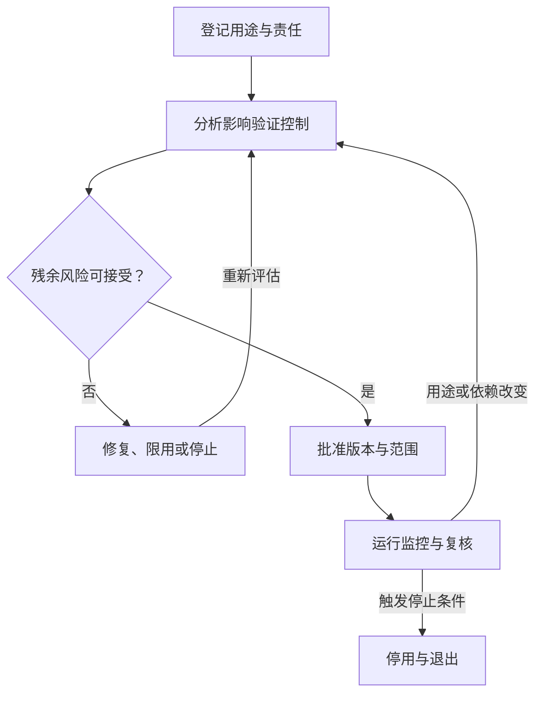

# 企业 AI 治理：责任、风险与准入

> 面向企业技术负责人、AI 平台团队、业务负责人及风险管理人员。读完能为 AI 系统建立用途、责任、准入和复核机制，并将这些决策连接到实际的版本、评测与运行记录。

## 治理对象包括应用及其使用情境

**企业 AI 治理**是组织决定怎样开发、采购、使用、监控和退出 AI 系统的规则与责任安排。治理对象包含自研模型、外部 API、集成了 AI 的软件、RAG 和 Agent，也包括它们服务的业务流程。

同一个模型，用于生成可人工修改的摘要，和用于自动拒绝一项重要业务申请，后果与控制要求不同。模型榜单或供应商介绍无法独立决定后者是否适合上线。

工程上建议以“应用 + 用途 + 用户 + 数据 + 可执行动作”建立治理单元。原本只提供草稿的助手新增发送或审批能力时，即使模型不变，也应重新评估其用途与授权范围。

## 将权威框架用于组织问题

[NIST AI RMF 1.0 核心](https://airc.nist.gov/airmf-resources/airmf/5-sec-core/)包含 Govern、Map、Measure、Manage 四类功能。官方说明它们不是固定顺序的检查清单，治理贯穿其他功能；该框架用于自愿风险管理。官网在本次访问时提示 1.0 正在修订，本文按 2023 年版本解释。

[ISO/IEC 42001:2023 公开概览](https://www.iso.org/standard/42001)说明其关注组织建立、实施、维护和持续改进 AI 管理体系。本次仅核验公开概览，未读取付费标准全文；本文的表格不构成该标准条款映射或认证结论。

| 参考框架中的问题方向 | 本文建议形成的工作成果 |
| --- | --- |
| Govern：组织怎样承担责任 | 方针、资产清单、责任、例外与复核规则 |
| Map：系统用在什么情境 | 用途、受影响人群、数据流、失效后果 |
| Measure：怎样取得判断证据 | 任务评测、风险测试、运行观察及已知缺口 |
| Manage：怎样处理风险 | 限制用途、修复、接管、停止和退出决定 |

这张表是对框架的工程化组织建议。完成文档仍需核对实际控制是否生效，例如批准中限定只读，工具身份就不应拥有写权限。

## 先建立可维护的 AI 资产清单

建议按应用记录下列信息，并将记录链接到发布和运行系统，而非手工重复维护每个底层配置。

| 信息组 | 最小内容 | 何时更新 |
| --- | --- | --- |
| 用途与范围 | 解决的问题、用户、禁止用途、输出去向 | 新增业务或用户范围 |
| 数据与知识 | 来源、敏感程度、使用依据、保留与删除 | 新数据源或处理目的 |
| 模型与依赖 | 自研或采购、提供方、版本、外部连接 | 模型、供应商或接口变化 |
| 行动能力 | 可调用工具、写操作、额度、人工控制 | 新增执行权限 |
| 责任与状态 | 业务责任人、技术责任人、风险决策人、运行状态 | 组织或服务状态变化 |
| 证据与限制 | 当前发布、评测、风险接受记录、复核期限 | 发布、事故或例外到期 |

资产清单不宜只盘点 GPU 和模型端点。员工使用的外部 AI 软件、嵌入业务系统的功能，也可能处理组织数据或影响业务决定，需要按实际用途纳入。

## 责任要落实到决定与动作

以下是可按组织规模调整的职责建议。同一人可以兼任角色，但高后果决策应按组织要求保留适当的独立复核。

| 角色 | 负责的决定或动作 | 应留下的依据 |
| --- | --- | --- |
| 业务负责人 | 确定用途、验收与人工接管 | 任务定义、业务指标、失败处理 |
| 数据或知识负责人 | 确认来源、质量与使用条件 | 数据版本、许可或授权依据、质量报告 |
| 技术负责人 | 实施架构、验证与发布恢复 | 发布清单、测试报告、运行记录 |
| 安全、隐私与法务相关角色 | 复核各自专业范围内的要求 | 风险意见、适用要求和未解决事项 |
| 风险决策人 | 按授权接受残余风险或要求停止 | 决定、范围、期限与补偿控制 |
| 运维与支持 | 观察、告警、接管与事件响应 | 值守责任、处置记录和恢复证据 |

“所有人共同负责”容易导致无人能决定暂停服务。应明确谁有权限制用途、撤销工具权限、关闭入口，以及谁负责恢复前的确认。

## 准入绑定用途和确定的发布版本

建议在设计、试点和扩大使用范围时保留决策记录。记录应包含必要证据、仍存在的不确定性，以及什么变化会触发重新评估。

图示是本文提出的应用准入流程，不是把 NIST 四类功能改成官方强制阶段。可以用现有变更管理系统承载，关键是证据和线上行为能对应。

准入记录可包括：允许用户与任务、数据范围、模型及工具清单、评测覆盖、已知失败、接管方式、监控责任、停止条件、批准范围和复核时间。发生模型替换、敏感数据接入、工具写权限增加或重要事故时，应判断原批准是否仍成立。

## 风险控制强度随情境调整

| 情境 | 建议优先控制 |
| --- | --- |
| 低后果、结果容易核对的辅助工作 | 来源提示、用户复核、反馈与撤销操作 |
| 涉及敏感数据或外部发送 | 最小权限、数据边界、发送确认与审计 |
| 影响重要权益或产生难以逆转动作 | 领域验证、明确决策权限、独立复核、接管与申诉路径 |

这是工程控制强度示例，不能视为法律风险分类。具体法域和行业的适用要求另行核验，见[风险评估与供应商治理](/ai/operations/risk-supplier)。

人工复核也需要工作条件：复核人能看到依据和不确定性、有足够时间、有权拒绝或修改，并且能够接管。只在界面上增加一个“确认”按钮，不能证明复核有效。

## 治理与工程系统怎样衔接

可以为每个应用使用一个稳定资产 ID，连接数据目录、[联合发布清单](/ai/operations/version-release)、评测报告、风险记录和监控面板。发布系统检查批准范围，工具层执行授权，运行系统记录任务结果。

例外应有责任人、理由、补偿措施和到期条件。例如某个低风险试点暂时人工整理质量报告，可以记录这一限制；不能因此默许高敏感数据访问不受控。到期后应重新决定继续、整改或停用。

复核节奏根据用途、变化频率和后果确定，并结合事件触发。没有通用的“每季度一次就足够”；频繁改变模型或知识的应用，可能需要随发布检查关键证据。

## 实践验收与常见坑

虚构方案：从正在运行的 AI 应用中选一个，随机选择一次真实类型的任务，沿资产记录查到当时发布版本、数据与工具范围、评测依据和责任人。再模拟增加外部发送能力，验证它是否触发重新评估与权限变更。该方案未实际执行。

常见失败包括只登记模型不登记用途、委员会审批与实际版本脱节、采购合同代替应用验证、例外长期不关闭，以及系统停用后仍保留可调用身份和外部连接。退出应覆盖访问撤销、任务处理、数据处置与必要证据保留。

## 参考资料

<Refs>

- [NIST：AI RMF 1.0 Core](https://airc.nist.gov/airmf-resources/airmf/5-sec-core/)（访问日期 2026-10-04；机构公共文档）— 四类功能、非线性关系与修订提示
- [NIST：AI RMF Resources](https://www.nist.gov/itl/ai-risk-management-framework/ai-risk-management-framework-resources)（访问日期 2026-10-04；机构公共文档）— 1.0 与生成式 AI Profile 的版本入口
- [ISO：ISO/IEC 42001:2023](https://www.iso.org/standard/42001)（访问日期 2026-10-04；机构公开概览）— AI 管理体系范围，未核验付费标准全文
- 站内相关：[AI 风险与供应商](/ai/operations/risk-supplier) · [云安全与身份治理](/cloud/architecture/security-governance) · [Agent 安全](/ai/agent/security) · [AI 持续交付](/ai/operations/mlops-llmops)

</Refs>
