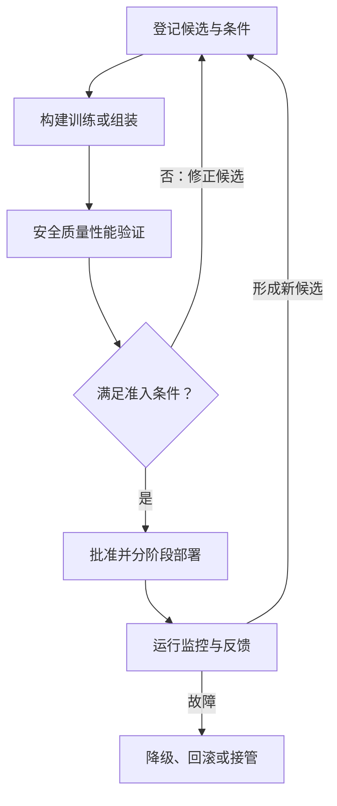

# MLOps / LLMOps：AI 持续交付

> 面向算法、AI 应用、平台与运维团队。读完能确定 AI 项目需要交付哪些资产，组织从实验到生产的流程，并区分自动训练、批准发布和真实上线。

## 从一次实验扩展到持续运行

**MLOps**把机器学习开发与运行所需的数据、实验、验证、交付和监控组织起来。**LLMOps**通常用于描述大语言模型应用的运营工程；**GenAIOps**覆盖更广的生成式 AI。不同机构对术语边界有不同表述，实施时应先确定工作流和责任。

[Google Cloud MLOps 架构文档](https://docs.cloud.google.com/architecture/mlops-continuous-delivery-and-automation-pipelines-in-machine-learning)主要面向预测型 AI，讨论持续集成、持续交付与持续训练。[Microsoft GenAIOps 指南](https://learn.microsoft.com/en-us/azure/well-architected/ai/mlops-genaiops)补充了预训练模型选择、提示词、知识增强及相关资产编排。

这些方法共同处理一个现实问题：业务行为会受到代码、数据、模型和配置的共同影响。即使代码没有变，外部模型升级、知识更新或输入人群变化，也可能改变结果。

## 根据工作负载确定交付对象

| 工作负载 | 主要交付资产 | 特别要验证的变化 |
| --- | --- | --- |
| 预测模型 | 特征处理、训练数据、权重、推理环境 | 特征可用时间、训练服务一致性、标签延迟 |
| 模型 API 应用 | 应用代码、模型配置、提示词、输出契约 | 外部模型变化、结构化输出、限额与失败处理 |
| RAG 应用 | 解析规则、嵌入、索引、检索配置与生成链路 | 知识更新、权限、索引与嵌入兼容 |
| 微调应用 | 基座、适配器或权重、训练配置、数据 | 基座兼容、能力退化、数据使用条件 |
| Agent | 编排状态、工具契约、身份与策略、恢复机制 | 副作用、重复执行、权限扩大与人工接管 |

表中的分类允许组合。一个系统同时有 RAG 和 Agent 时，应按实际依赖管理资产，而不是为每个名词独立建立一套平台。

## CI、CD 与 CT 的控制范围

**持续集成（CI）**验证变更能否组成可用候选，包括代码测试、数据契约、流水线组件、模型或应用评测。**持续交付（CD）**使候选具备进入目标环境的条件；是否自动部署由发布政策决定。**持续训练（CT）**根据约定触发重新训练，产物仍需评估与准入。

只调用外部模型 API 的应用也需要持续交付，但不一定需要训练系统。触发一次训练的理由可以是数据更新、特征修正或性能问题；漂移告警应先调查原因，不能默认通过重训解决全部问题。

图中的批准可以由预先授权的规则或人工执行，具体取决于风险。批准对象应是确定的候选清单与证据，而非一个会继续变化的工作目录。

## 实验、注册、流水线与服务平台的分工

**实验追踪**记录一次运行的条件与结果。MLflow 的[Tracking 文档](https://mlflow.org/docs/latest/ml/tracking/)描述了参数、代码版本、指标及输出制品的记录，以及用 experiment 组织多次 run 的方式。

工程上还应保证评测集、评测器和数据处理版本可以追溯。两个模型分数相同，但评测数据或判分规则不同，不能直接认为能力相当；只登记成功实验，也会丢失关键的失败边界。

| 能力 | 主要责任 | 不应由它单独证明的事情 |
| --- | --- | --- |
| 实验追踪 | 保存条件、结果与制品关联 | 某个结果代表真实业务表现 |
| 模型或提示词注册 | 为候选命名、提供版本与状态 | 候选已经在生产生效 |
| 流水线编排 | 执行依赖步骤、记录状态与失败 | 每个步骤的业务判断都正确 |
| 发布控制 | 绑定候选、证据、环境与流量 | 下游副作用可以自动撤销 |
| 服务平台 | 运行实例、调度资源、提供入口 | 模型质量达到业务目标 |

AWS SageMaker AI 的[模型批准文档](https://docs.aws.amazon.com/sagemaker/latest/dg/model-registry-approve.html)区分模型批准状态更新和配置相应部署步骤。某些项目模板会把批准连接到部署流程，实际效果取决于集成，不能只看状态字段就宣布上线成功。

## 交接要说明输入、输出和失败责任

建议围绕每条交付链明确以下交接条件：

- 数据方交付发布版本、使用条件、质量报告和迟到数据处理方式。
- 算法或应用方交付候选清单、评测结果、已知限制及所需运行条件。
- 平台方提供受控运行环境、身份、可观测和发布恢复能力。
- 业务负责人确认任务范围、验收口径、人工接管与残余风险接受方式。

一个人可以承担多个角色，职责仍应逐项可查。模型提供方的 SLA 也不能替代应用的任务完成率、知识正确性与工具执行验收。

## 按工程问题逐步自动化

以下为建设顺序建议，不是统一成熟度评分：

| 当前主要问题 | 首先建立 | 下一步自动化条件 |
| --- | --- | --- |
| 实验无法重现 | 固定输入、代码、环境与评测口径 | 人工执行已形成明确步骤 |
| 候选经常漏测 | 自动生成验证报告与失败记录 | 准入条件可被稳定判定 |
| 线上版本说不清 | 发布清单与实际运行身份 | 能核对目标配置和线上状态 |
| 故障后恢复慢 | 降级、回滚和人工接管演练 | 恢复边界与停止条件清楚 |
| 多团队重复建设 | 共享注册、流水线模板与服务接口 | 标准路径有明确消费者与维护责任 |

先把已有 CI/CD、制品库、身份与观测系统接入 AI 资产，可以降低额外交接成本。是否引入独立特征库、模型注册服务或编排平台，应由资产规模与追踪问题决定。

## 一个贯穿交付链的验证方案

虚构场景：知识问答应用准备更换模型并调整提示词。先保持知识与评测集不变，对新模型、新提示词及组合分别比较；随后登记最终组合，通过质量与权限验证，再进行有限流量发布。发现长文档引用错误时，应能定位该组合、恢复旧组合并记录受影响请求。

这项方案至少要验证：候选的输入可追溯、失败会阻断推广、运行中的版本可辨认、恢复不会复活失效知识、反馈不会未经复核进入训练或评测基线。本文没有执行该生产实验。

## 常见坑

- 将 notebook 中的一次成功运行当作可交付流水线，遗漏依赖、身份与输入变化。
- 持续训练后直接替换生产模型，绕过业务切片与安全验证。
- 同时修改多个依赖却不保留对照，发生退化后无法归因。
- 只维护模型权重版本，忽略提示词、检索、工具和权限策略。
- 自动化失败仍继续发布，或平台重试导致外部动作重复发生。

## 参考资料

<Refs>

- [Google Cloud：MLOps continuous delivery and automation pipelines](https://docs.cloud.google.com/architecture/mlops-continuous-delivery-and-automation-pipelines-in-machine-learning)（访问日期 2026-10-04；全球文档）— 预测型 AI 的 CI/CD/CT
- [Microsoft：MLOps and GenAIOps](https://learn.microsoft.com/en-us/azure/well-architected/ai/mlops-genaiops)（访问日期 2026-10-04；Azure 全球文档）— 生成式应用生命周期
- [MLflow：Tracking](https://mlflow.org/docs/latest/ml/tracking/)（访问日期 2026-10-04；项目公共文档）— 实验运行与制品记录
- [AWS：Update the Approval Status of a Model](https://docs.aws.amazon.com/sagemaker/latest/dg/model-registry-approve.html)（访问日期 2026-10-04；全球文档）— 批准状态与部署集成
- 站内相关：[训练工程](/ai/infra/training) · [联合版本与发布](/ai/operations/version-release) · [监控与反馈](/ai/operations/monitoring-feedback) · [构建与 CI](/software/delivery/build-ci)

</Refs>
