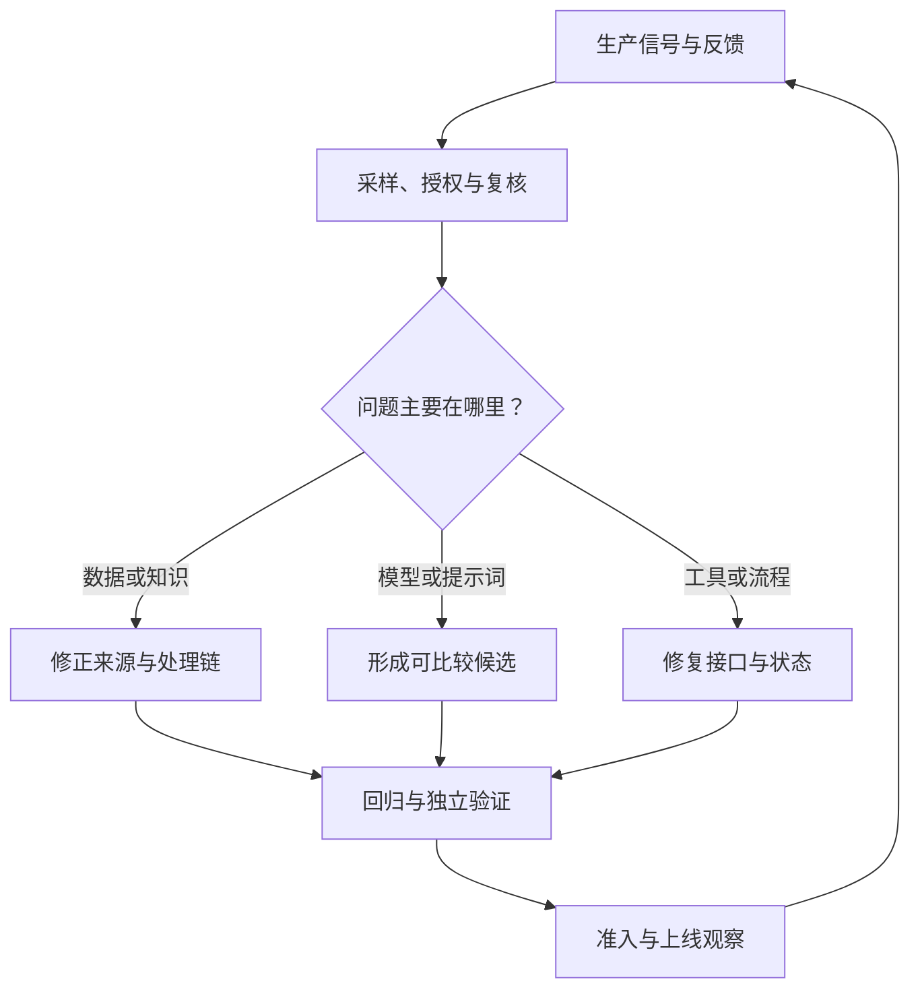

# AI 生产监控与反馈闭环

> 面向 AI 应用开发者、SRE 与业务运营人员。读完能把服务健康、任务质量和数据变化放到同一条诊断链中，并将生产反馈转化为经过复核的新候选。

## 服务正常响应之后还要检查任务结果

HTTP 成功、模型完成生成和用户任务完成是三个不同事件。一个回答可能按时返回，却引用了过期制度；Agent 可能成功调用工具，却没有完成用户要求的业务状态变化。

[Microsoft 生成式 AI 可观测文档](https://learn.microsoft.com/en-us/azure/foundry/concepts/observability)将模型选择、上线前评估和生产监控连接起来。工程上建议为每次任务记录稳定的业务任务标识，再将其关联到应用请求、模型调用、检索和工具执行。

## 指标按服务、质量、边界与成本分层

以下为指标设计建议。每个指标均需定义对象、分母、时间窗口、分组、缺失样本和责任人。

| 层面 | 可采用的信号 | 解释边界 |
| --- | --- | --- |
| 服务健康 | 可用性、端到端延迟、排队、超时、限额错误 | 模型调用成功不代表任务成功 |
| 任务质量 | 通过验收的任务比例、引用正确性、人工返工 | 自动评分需要校准，抽样范围需要说明 |
| 执行边界 | 越权尝试、被阻断动作、重复副作用、预算耗尽 | 拦截量上升可能来自攻击增加或策略变更 |
| 数据与知识 | 来源更新延迟、未知类别、检索空结果、过期引用 | 输入分布变化不一定造成质量下降 |
| 成本 | 每次调用用量、每个完成任务成本、人工处理成本 | 重试、多模型调用和失败请求也要计入 |

一个可用的任务成功率定义是“满足约定验收条件的任务数 / 纳入统计的任务数”。不能仅从已返回结果的请求中选择分母，否则超时、取消和失败任务会被隐藏。对于人工接管，要根据产品目标明确其是成功交付路径还是自动完成失败。

## 区分偏差、漂移与性能退化

Google Cloud [Model Monitoring 文档](https://docs.cloud.google.com/gemini-enterprise-agent-platform/machine-learning/model-monitoring/overview)在 v1 机制中区分训练与生产特征分布的偏差，以及生产分布随时间发生的漂移。这是特定监控能力的定义，不能扩展成模型质量的完整证明。

| 变化 | 需要比较什么 | 后续调查 |
| --- | --- | --- |
| 训练服务偏差 | 训练与服务的处理逻辑及数据分布 | 单位、缺失处理、特征可用时间、用户构成 |
| 输入漂移 | 当前输入与约定历史基线 | 新业务、季节变化、异常流量或采集故障 |
| 概念变化 | 输入与目标关系是否改变 | 需要真实结果或适当验证，不能只看输入 |
| 任务质量退化 | 同一验收口径下的任务表现 | 模型、知识、提示词、工具或工作流变化 |
| 依赖变化 | 发布记录与外部服务实际状态 | 托管模型修订、端点策略、限额或接口调整 |

漂移告警应进入调查。节假日请求结构变化可能合理；没有明显输入漂移，也可能因知识过期或标签关系变化而失效。把告警直接连接到自动重训和上线，会跳过原因判断与准入验证。

## 追踪保留定位信息，同时控制内容采集

建议每条任务链关联发布 ID、模型修订、检索和索引版本、工具契约、策略版本、耗时、用量及失败类别。高基数的任务 ID 更适合日志或追踪，避免无节制地成为指标标签。

OpenTelemetry 的[敏感数据处理指南](https://opentelemetry.io/docs/security/handling-sensitive-data/)强调按观测目的最小化采集，并指出可预测标识的哈希不一定构成充分匿名化。模型输入、输出和工具结果可能包含敏感内容；默认保存全文会扩大访问与保留责任。

可以先记录结构化元数据，把确有诊断需要的内容放入受限存储，并采用脱敏、采样、访问审计和到期删除。还要核查第三方插桩库实际发出了哪些字段，不能只检查应用自己写的日志。

截至本次核验，OpenTelemetry 的[GenAI 旧入口](https://opentelemetry.io/docs/specs/semconv/gen-ai/)已指向[官方独立仓库](https://github.com/open-telemetry/semantic-conventions-genai)。采用相关约定时固定规范与插桩版本，并对照项目中具体字段的稳定性说明；本文不把未逐项核验的属性当作稳定接口。

## 反馈进入数据集前要经过复核

用户点赞可能反映表达偏好，投诉可能来自界面体验，自动裁判可能偏好某种措辞。它们都可以作为线索，但需要结合来源与任务定义判断。

建议区分回归集和保留测试集：已经用于修复的问题适合加入回归集；若又用同一批问题证明泛化提升，需要说明它们参与过开发。生产反馈还可能受到自愿反馈偏差影响，应主动覆盖无反馈、超时、转人工和关键业务切片。

对于标签迟到的预测任务，使用事件 ID 把预测和后续真实结果关联，记录标签何时成熟。今天没有投诉，不能立刻把今天的所有预测都标为正确。

## 告警要连接可执行的处置

推荐让告警包含：受影响任务与版本、观察窗口、相对基线、样本范围、当前影响、责任人和下一步检查。

| 观察到的信号 | 优先核查 | 可能采取的动作 |
| --- | --- | --- |
| 超时与排队同时增加 | 并发、限额、下游故障和重试 | 限流、降级、调整容量或隔离故障 |
| 引用错误增加但延迟正常 | 知识版本、权限、检索与重排 | 停止使用问题来源或恢复兼容组合 |
| 任务成功率降低但模型分数正常 | 工具执行、业务状态与交互 | 修复工作流，必要时转人工 |
| 某类用户表现退化 | 该切片覆盖、输入变化与数据质量 | 补充调查并限制不适用范围 |
| 单任务成本增加 | 重试、上下文长度、工具循环 | 限定预算、修复循环并评估质量影响 |

阈值应由业务影响与正常波动确定。高后果事件可能需要单事件处置，质量波动则可能需要更长观察窗口；不能给所有指标统一套用一个百分比。

## 实践验收与常见坑

虚构验证方案：让一个测试租户遇到检索空结果、模型超时和工具失败，检查三种故障是否能关联同一任务，显示不同失败原因，并进入约定的降级路径。再注入一条已复核的错误引用，验证其经过数据治理、候选修正和回归准入后才进入发布。

常见问题包括只监控 GPU 利用率、把自动裁判分数当真实正确率、遗漏取消请求、默认保留全文，以及让反馈直接修改线上提示词。上述方案未在生产执行，实际验收应保留运行条件和证据。

## 参考资料

<Refs>

- [Google Cloud：Introduction to Model Monitoring](https://docs.cloud.google.com/gemini-enterprise-agent-platform/machine-learning/model-monitoring/overview)（访问日期 2026-10-04；全球文档）— v1 偏差与漂移定义
- [Microsoft：Observability in generative AI](https://learn.microsoft.com/en-us/azure/foundry/concepts/observability)（访问日期 2026-10-04；Azure 全球文档）— 生命周期评估与生产观测
- [OpenTelemetry：Handling sensitive data](https://opentelemetry.io/docs/security/handling-sensitive-data/)（访问日期 2026-10-04；项目公共文档）— 数据最小化与哈希限制
- [OpenTelemetry：GenAI 规范迁移入口](https://opentelemetry.io/docs/specs/semconv/gen-ai/) · [官方规范仓库](https://github.com/open-telemetry/semantic-conventions-genai)（访问日期 2026-10-04；项目公共文档）— 当前维护入口
- 站内相关：[大模型评测](/ai/application/evaluation) · [云可观测体系](/cloud/native/observability) · [数据集质量](/ai/data/dataset-quality) · [AI 发布与回滚](/ai/operations/version-release) · [Token 经济学](/ai/infra/inference/token-economics)

</Refs>
