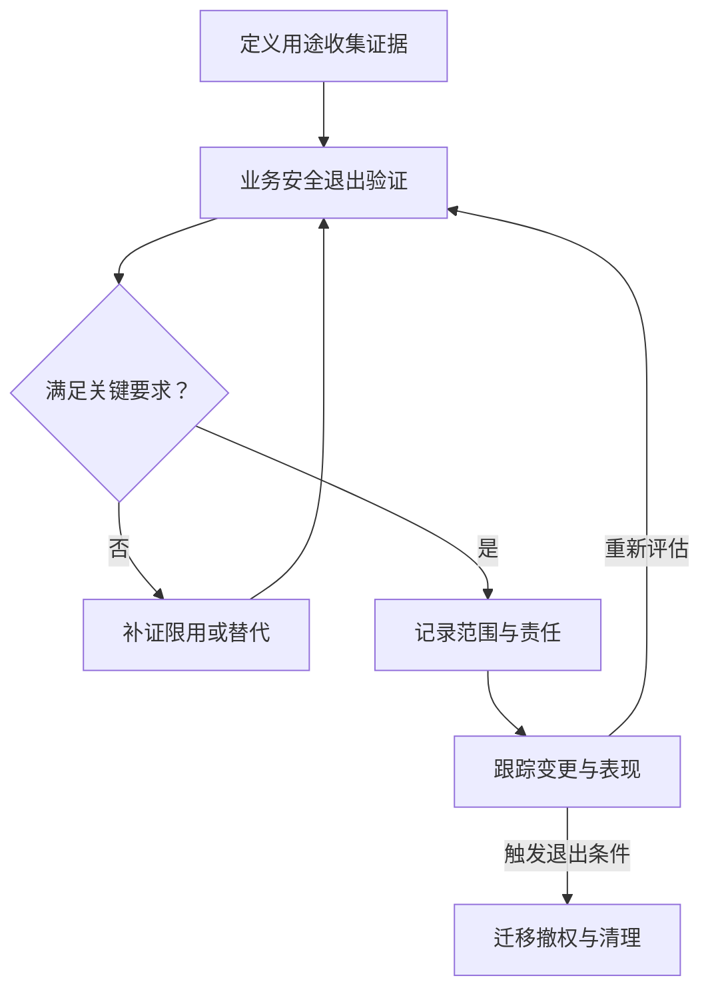

# AI 风险评估与供应商治理

> 面向 AI 方案架构师、采购评审、技术和风险负责人。读完能把风险描述转化为测试与决策依据，并核查外部模型、数据、软件和服务在接入、变更及退出时的责任。

## 风险评估从具体失效情境开始

“存在幻觉风险”不足以支持架构决定。更有用的描述是：某助手从过期制度生成了错误答复，用户据此执行操作，系统没有显示来源日期或提供人工确认渠道。

建议为每个重要风险记录：触发条件、受影响对象、失效过程、后果、现有控制、验证方法、剩余不确定性、责任人和处置期限。可能性缺乏可靠统计时应标为未知，不要为了填表虚构精确概率。

严重性、发生可能性、暴露范围和可恢复性可以辅助排序，但把几个主观分数相乘不会自动产生准确风险值。对重要权益、敏感信息或不可逆动作，应直接检查控制与证据是否足够。

## 把风险映射到可执行的验证

以下为虚构场景下的工程示例，不是法律风险等级，也不是完整风险清单。

| 失效情境 | 建议控制 | 验证证据 |
| --- | --- | --- |
| 回答引用失效制度 | 生效时间、替代关系与来源展示 | 旧版、新版及历史时点的回答记录 |
| 检索结果含其他租户内容 | 可信身份、服务端授权、缓存隔离 | 跨租户、撤销权限和缓存命中测试 |
| 外部文本诱导 Agent 扩大动作 | 指令来源隔离、工具最小权限、动作确认 | 恶意文档进入后的实际工具轨迹 |
| 某类用户持续得到较差结果 | 有代表性的业务切片、领域复核 | 分组表现、样本量和覆盖缺口 |
| 工具重试重复提交业务 | 幂等标识、状态查询与对账 | 超时后重试和重复请求的结果 |
| 供应商停止旧模型服务 | 版本通知、替代方案、退出演练 | 替代模型在目标任务上的回归报告 |

模型测试要覆盖允许与拒绝路径，系统测试还需包含数据、权限、工作流和人工接管。一次红队测试未发现问题，只能描述已覆盖条件下的结果，不能证明全部风险已经消除。

## 模型卡和风险框架提供证据入口

原始论文 [Model Cards for Model Reporting](https://research.google/pubs/model-cards-for-model-reporting/)提出用模型卡说明用途、评测条件及不同相关群体或情境下的表现。模型卡可以帮助发现适用限制，但其内容需要与具体版本、服务形态和业务验证对应。

[NIST AI 600-1 生成式 AI Profile](https://nvlpubs.nist.gov/nistpubs/ai/NIST.AI.600-1.pdf)是 AI RMF 的配套资料，包含第三方依赖、供应商评估、事件响应、替代方案和停用等建议。本文据此组织采购与退出问题，具体的字段和流程是工程建议。

供应商提供的认证、评测与安全材料应检查覆盖范围：是组织管理体系、某项服务、某个模型版本，还是某种测试条件。组织证书不能直接证明当前应用的回答正确率或工具授权有效。

## 供应链覆盖模型、数据与运行代码

[OWASP LLM03:2025](https://genai.owasp.org/llmrisk/llm032025-supply-chain/)将供应链风险延伸到第三方模型、数据和部署相关依赖，而不只关注传统软件包。

建议维护依赖清单：模型与适配器、分词器、数据集、解析器、推理框架、工具连接器、容器镜像和外部服务。为关键依赖记录来源、版本、许可、完整性校验和维护状态。

对需要执行自定义代码的模型加载方式，先审查代码和运行权限，在隔离环境验证；制品摘要只能说明内容与记录一致，不能说明内容本身可信。模型权重可下载，也不自动意味着训练数据许可、商用条件或安全保证已经满足。

## 按证据审查供应商

下表可用于技术与采购共同评审。供应商未提供的信息记录为缺口，不能用营销表述推断。

| 评审面 | 要取得的资料 | 应做的验证或决定 |
| --- | --- | --- |
| 数据处理 | 使用目的、保留、训练使用、删除、处理地点及相关第三方说明 | 核对合同、控制台配置和应用实际数据流 |
| 版本与变更 | 模型修订方式、弃用通知、兼容与替代政策 | 验证通知是否可接收，保留业务回归基线 |
| 质量与限制 | 模型卡、已知局限、评测条件、适用任务 | 使用自己的代表性任务核验 |
| 安全与隔离 | 身份、访问控制、租户隔离、日志与事件流程 | 验证拒绝路径、权限撤销和事件联络 |
| 服务能力 | 可用性范围、配额、峰值处理、超时和重试语义 | 在批准的环境中验证容量与故障处理 |
| 权利与责任 | 模型、软件、数据与输出相关条款 | 由对应专业角色评估当前用途 |
| 可迁出性 | 数据、配置、提示词、评测与记录导出能力 | 演练迁出、替代服务和访问撤销 |

这些证据按具体合同、部署地域、产品形态与版本核查。通用官网文档只能证明其明确描述的范围；私有化部署也仍需考虑模型来源、更新渠道和软件依赖。

## 中国场景先判断规则适用范围

本节仅提供两项已核验原文的适用入口，不构成全部法规清单或个案法律意见；上线时应由负责人员结合具体业务、法域和最新有效规则复核。

- [《生成式人工智能服务管理暂行办法》](https://www.cac.gov.cn/2023-07/13/c_1690898327029107.htm)第二条以向中国境内公众提供生成式 AI 服务为适用范围，并说明未向境内公众提供此类服务的相关研发、应用活动不适用该办法。不能由此推出企业内部应用免于其他数据、个人信息或行业要求。
- [《人工智能生成合成内容标识办法》](https://www.cac.gov.cn/2025-03/14/c_1743654684782215.htm)于 2025 年 9 月 1 日施行，规定自身适用情形并区分显式与隐式标识。具体内容形态、服务与传播角色，应对照原文确定标识要求，不能只凭“用了 AI”统一判断。

工程上可为适用要求建立记录：具体规则与版本、判断依据、责任角色、所需控制和复核触发条件。NIST、ISO 和 OWASP 分别提供框架、管理体系或风险资料，不能代替适用法律判断。

## 采购决定需要保留退出路径

退出方案应说明未完成任务如何处理、关键配置怎样导出、替代模型如何回归、旧凭据何时撤销，以及哪些记录按要求继续保留。供应商退出不等于必须马上切换到另一个模型；对于尚未验证的替代方案，人工处理或暂停部分能力可能更符合既定目标。

虚构验收场景：供应商通知一个旧模型即将停止服务。团队应能从资产清单定位受影响应用，比较替代模型的业务表现，验证提示词、工具与输出兼容，并安排分阶段切换。该方案未实际执行，不预设替代模型一定通过验收。

## 常见坑

- 只检查模型名与榜单分数，忽略服务条款、实际版本和依赖。
- 将供应商承诺原样写入应用验收，未核查责任范围。
- 风险表长期不更新，新增工具与数据源没有触发复评。
- 认为下载权重后不再存在供应链风险。
- 退出只删除 API Key，遗留数据、会话、任务和外部连接。

## 参考资料

<Refs>

- [NIST：AI 600-1 Generative AI Profile](https://nvlpubs.nist.gov/nistpubs/ai/NIST.AI.600-1.pdf)（访问日期 2026-10-04；机构公共文档；2024 版）— 重点核查 GOVERN 1.7、6.1、6.2 的停用与第三方管理建议
- [Google Research：Model Cards for Model Reporting](https://research.google/pubs/model-cards-for-model-reporting/)（访问日期 2026-10-04；原始论文官方页面；2019）— 模型用途与评测条件说明
- [OWASP：LLM03:2025 Supply Chain](https://genai.owasp.org/llmrisk/llm032025-supply-chain/)（访问日期 2026-10-04；项目公共文档）— 模型、数据与软件供应链风险
- [国家网信办：生成式人工智能服务管理暂行办法](https://www.cac.gov.cn/2023-07/13/c_1690898327029107.htm)（访问日期 2026-10-04；中国官方原文）— 第二条适用范围
- [国家网信办：人工智能生成合成内容标识办法](https://www.cac.gov.cn/2025-03/14/c_1743654684782215.htm)（访问日期 2026-10-04；中国官方原文）— 适用范围、标识类型与施行时间
- 站内相关：[企业 AI 治理](/ai/operations/enterprise-governance) · [Agent 安全](/ai/agent/security) · [软件供应链](/software/security/supply-chain) · [知识治理](/ai/data/knowledge-governance)

</Refs>
