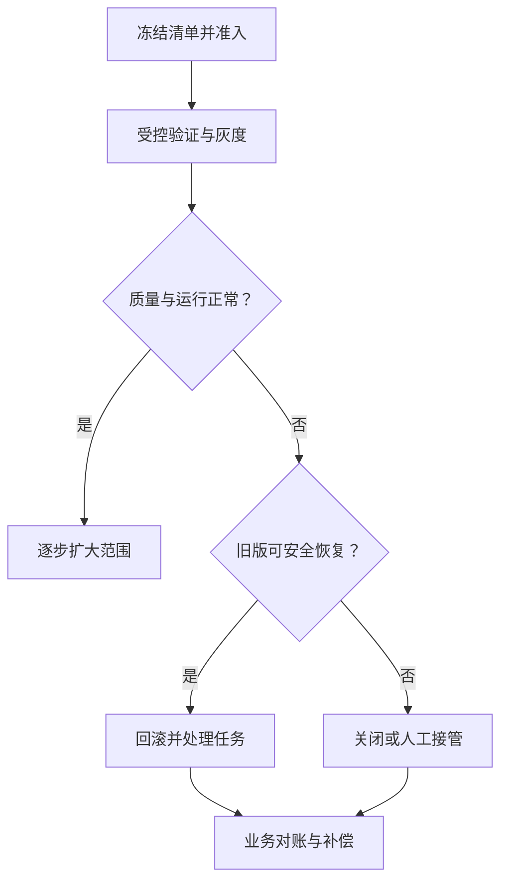

# AI 联合版本、发布与回滚

> 面向负责 AI 应用上线与维护的工程师。读完能定义一次发布包含的完整配置，绑定评测证据，并判断发生问题时哪些状态可以恢复、哪些业务结果需要另外补偿。

## 一次发布对应一组相互兼容的资产

模型版本相同，提示词、检索索引或工具定义变化仍可能改变行为。本文将**联合版本**定义为一次 AI 应用发布中，代码、模型、数据引用、配置与策略的确定组合；这是工程组织方式，不是某个行业标准字段。

建议为这组资产建立发布清单，并生成可验证的内容摘要。清单既用于上线前评测，也用于识别线上实际运行的组合。

| 资产 | 建议固定的信息 | 兼容性问题 |
| --- | --- | --- |
| 应用 | 代码提交、镜像摘要、依赖与配置摘要 | 新旧输出结构和调用链是否兼容？ |
| 模型 | 提供方、端点、模型修订或权重摘要、生成参数 | 旧模型是否仍可调用，参数含义是否改变？ |
| 提示词 | 模板版本、变量结构、实际模型配置 | 变量缺失、输出要求与模型能力是否匹配？ |
| 检索 | 来源清单、解析规则、嵌入、索引与重排配置 | 查询向量和索引向量是否属于同一表示空间？ |
| 工具与状态 | 工具契约、编排与状态结构版本 | 旧执行状态能否由新代码继续处理？ |
| 策略 | 授权、预算、路由与降级策略版本 | 恢复旧版本是否放宽了当前权限？ |
| 验证 | 评测集、评测器、运行记录与批准引用 | 准入证据是否对应这份清单？ |

密钥不写入清单，可记录受控秘密的引用和必要版本信息。外部服务无法冻结的部分应明确标为依赖条件，不能用一个内部版本号代替供应方的保证。

## 固定版本仍需要核对可变配置

[MLflow 模型注册文档](https://mlflow.org/docs/latest/ml/model-registry/workflow/)中的别名是指向模型版本的命名引用，可以重新分配。[提示词注册文档](https://mlflow.org/docs/latest/genai/prompt-registry/index.html)则区分不可修改的提示词模板版本与可修改的关联模型配置；提示词别名同样可变。

因此，发布时应解析别名，记录实际版本，并把本次采用的模型参数等可变配置保存为独立快照。仅登记 `production` 或提示词版本号，仍可能无法解释线上行为变化。还要核对客户端缓存刷新方式，避免不同实例在一段时间内读取到不同别名目标。

以下是发布清单的字段示意，不是可直接部署的配置：

```yaml
release_id: knowledge-assistant-r17
application_revision: app-revision-042
model_revision: provider-revision-record-008
generation_config: generation-config-006
prompt_version: answer-template-012
knowledge_snapshot: knowledge-snapshot-031
embedding_revision: embedding-revision-004
index_revision: index-031
tool_contract: tools-005
policy_revision: policy-009
evaluation_run: evaluation-086
approval_record: approval-021
rollback_release: knowledge-assistant-r16
```

实际系统应使用真实提交、摘要或不可歧义的资产标识。固定清单有助于追踪与重放，但模型随机性、硬件差异和外部 API 漂移仍可能影响输出一致性。

## 发布准入同时看改进与退化

推荐在比较前确定基线、关键切片、停止条件和观察方法。不要等结果出来后才选择有利指标。

| 准入维度 | 需要的证据 | 可以阻断发布的问题 |
| --- | --- | --- |
| 契约 | 输入输出、工具参数、状态迁移检查 | 旧客户端无法解析，工具参数改变业务含义 |
| 任务质量 | 与基线在同一评测条件下的比较 | 关键业务切片明显退化或覆盖不足 |
| 数据与权限 | 引用、租户、撤销和拒绝路径 | 无权限内容进入模型或输出 |
| 执行安全 | 超时、重试、幂等和人工接管 | 重复执行外部动作或超出授权范围 |
| 运行条件 | 延迟、容量、配额、成本与降级 | 高峰条件下失控或不能恢复 |

这里的停止条件是业务约定。不能把一次评测中“零次失败”写成不会失败的证明；样本量、覆盖和不确定性见[大模型评测](/ai/application/evaluation)。

批准记录应绑定发布清单摘要、证据版本、环境、有效期和批准范围。清单内任何会影响行为的内容变化，都应重新判断需要哪些验证。

## 灰度、影子运行与在线实验的用途

[Microsoft GenAIOps 指南](https://learn.microsoft.com/en-us/azure/well-architected/ai/mlops-genaiops)讨论逐步暴露、金丝雀与蓝绿部署。应用时需要根据状态和副作用选择策略。

**灰度发布**让部分真实请求使用新组合，用于限制变化影响范围；**影子运行**把请求副本交给候选而不使用其业务结果；**在线对照实验**用于比较不同方案对目标指标的影响，其分组和统计设计需要单独定义。

Agent 影子运行必须隔离写操作，可以使用只读工具、模拟器或记录拟执行动作。把同一请求同时交给两套能真实提交订单的 Agent，会执行两次业务操作。多轮会话宜采用一致的版本分配策略，防止一次任务中途切换工具或状态协议。



## 回滚同时检查兼容性与当前安全状态

回滚的前提是旧组合及其依赖仍然可用。外部模型下线、旧索引被清理、状态结构已迁移，都可能使回滚路径失效。应事先规定保留窗口、替代端点和恢复目标，并在依赖变化后重新验证。

恢复时需要区分三类状态：

- **可替换资产**：代码、模型、提示词、检索配置等，按清单恢复一致组合。
- **在途执行**：会话、队列、Agent 检查点等，决定继续使用原版本、迁移、取消或转人工。
- **已发生业务结果**：订单、通知、付款等，依据业务账本核对并补偿；替换程序版本不会撤销这些动作。

当前权限撤销和知识删除记录应继续有效。恢复旧索引时重新应用现行限制，不能把“恢复历史配置”理解为“恢复历史访问权”。

## 实践：一份发布记录如何帮助定位故障

虚构场景：更换嵌入模型后，服务没有报错，但答案引用质量下降。检查发布清单发现查询侧已采用新嵌入，索引仍由旧嵌入生成。即使维度相同，两者也未必处于可比较的向量空间。

验证方案是建立候选索引，用相同业务样本评估检索与回答，确认查询和索引使用匹配配置后再切换；恢复则需要一起恢复索引与查询配置。该案例用于解释兼容性判断，未表示本站执行过该实验。

## 常见坑

- 把动态别名当作冻结版本，审批后资产仍继续改变。
- 只回滚模型而保留新提示词、索引或工具协议。
- 灰度期间按请求随机切换，破坏多轮任务状态。
- 影子 Agent 能执行真实写操作，产生重复副作用。
- 恢复旧快照后忘记重放权限撤销和知识删除。

## 参考资料

<Refs>

- [MLflow：Model Registry Workflows](https://mlflow.org/docs/latest/ml/model-registry/workflow/)（访问日期 2026-10-04；项目公共文档）— 模型版本与可变别名
- [MLflow：Prompt Registry](https://mlflow.org/docs/latest/genai/prompt-registry/index.html)（访问日期 2026-10-04；项目公共文档）— 模板版本、关联模型配置与缓存
- [Microsoft：MLOps and GenAIOps](https://learn.microsoft.com/en-us/azure/well-architected/ai/mlops-genaiops)（访问日期 2026-10-04；Azure 全球文档）— 逐步部署与恢复
- 站内相关：[MLOps / LLMOps](/ai/operations/mlops-llmops) · [知识治理](/ai/data/knowledge-governance) · [Agent 安全与恢复](/ai/agent/security) · [软件发布与回滚](/software/delivery/release-rollback)

</Refs>
