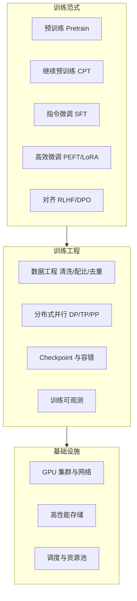

# 模型训练

> 训练是 AI 三层结构的起点：把数据和算力变成模型权重。对解决方案架构师而言，理解训练不是为了亲自训模型，而是为了**判断客户的模型从哪来、成本结构长什么样、私有化微调是否值得**——这些问题决定了后续推理与应用层的所有方案。

## 这个子域回答什么问题

- 预训练、继续预训练、SFT、LoRA、RLHF/DPO 各自解决什么问题、成本差多少？
- 训练集群的工程难点：并行策略、checkpoint、故障容错为什么这么贵？
- 什么时候用云训练平台（PAI 类），什么时候自建？
- 私有化微调的决策框架：数据、效果、成本的三角验证

## 知识框架

## 要点提纲

### 训练范式光谱：成本与效果的阶梯

| 范式 | 改变什么 | 相对成本 | 典型用途 |
| --- | --- | --- | --- |
| 预训练 | 从零学语言与世界知识 | 极高（千卡月级） | 基座模型厂商 |
| 继续预训练 | 注入领域语料 | 高 | 行业基座（金融/医疗） |
| SFT | 学会指令格式与任务 | 中 | 让基座"听话" |
| LoRA/PEFT | 少量参数适配 | 低 | 风格/轻量领域适配 |
| RLHF/DPO | 对齐人类偏好 | 中高 | 安全性与偏好塑造 |

实践口径：企业落地 90% 的需求落在 **SFT + LoRA** 区间；"要不要预训练"的答案几乎总是"不要"。

### 训练工程的三个贵

- **并行策略**：数据并行扩吞吐、张量/流水线并行破单卡显存墙——组合选择决定集群拓扑
- **Checkpoint 风暴**：千卡集群上保存一次状态的 IO 开销巨大，频率是容错与效率的权衡
- **故障是常态**：千卡训练的日均故障率不可忽视，自动恢复与断点续训是集群工程的及格线

### 微调决策框架（SA 视角）

1. **先评测后微调**：基座 + RAG/Prompt 能达到 80 分，就不要为最后 10 分付微调的成本
2. **数据质量 > 数据数量**：千条高质量标注样本的 SFT 常胜过十万条噪音
3. **算清总账**：微调成本 = 训练算力 + 数据标注 + 模型维护（每次基座升级都要重来）——最后一项最容易被漏算

## 计划补充

- [ ] 分布式并行策略详解（DP/TP/PP/ZeRO 与集群拓扑）
- [ ] 云训练平台与自建集群的成本对比模型
- [ ] 一次私有化微调项目的完整复盘（脱敏）

## 参考与衔接

- 训练完成后的下一站：[大模型推理部署实战](/ai/inference/llm-inference)
- 算力侧的测算方法：[GPU 选型与推理成本测算](/ai/inference/gpu-sizing)
