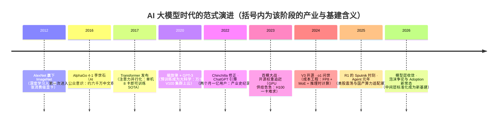
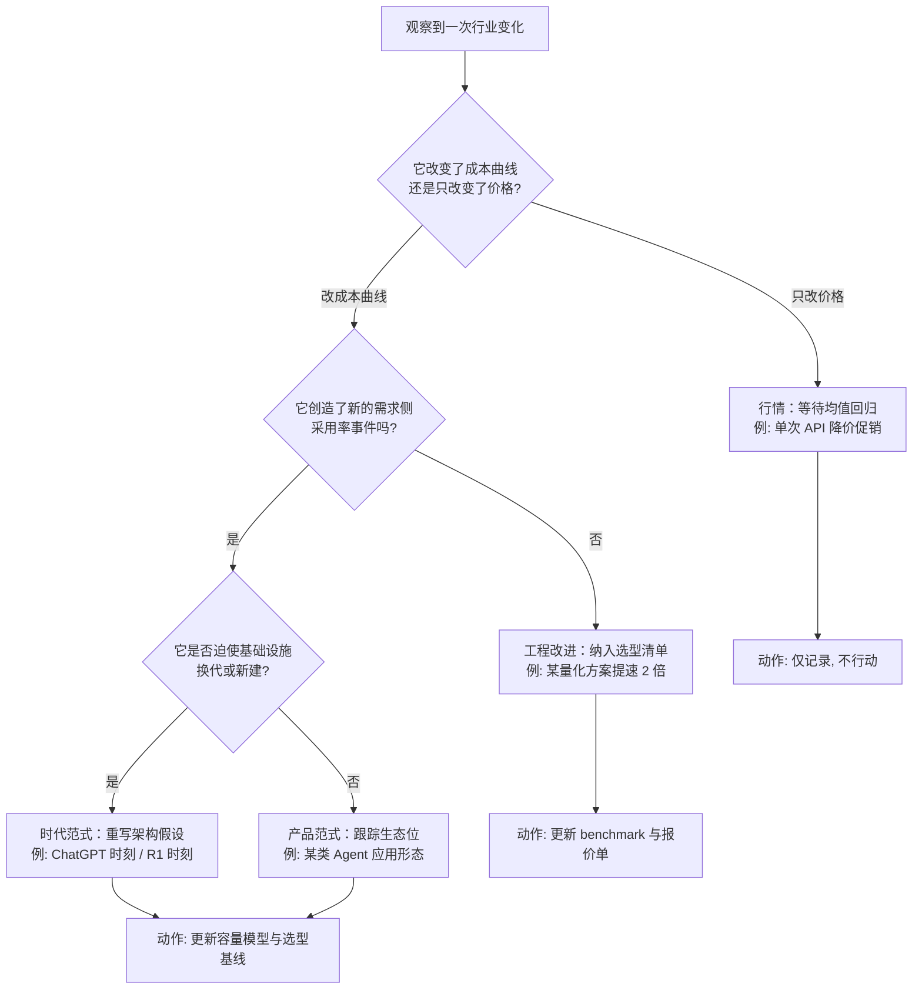

# AI 大模型时代（2012–今）

> 面向所有想搞清楚"这波 AI 到底从哪来、会把基础设施与产业带向哪去"的同行。这篇编年史不做热点复盘，也不重复技术机制（机制在本站 [模型架构](/ai/models/ml-dl)、[大语言模型架构解析](/ai/models/llm)、[智能体编年](/ai/agent/history) 三处另有专文）——它只讲一件事：**一项实验室技术如何在十四年里变成产业、资本与社会现象**。读完你会带走四样东西：一条从 2012 年铺到 2026 年、可自行延展的时代时间轴；一份"论文—产品—基建"三线并进的编年档案；一个判断"哪些变化是范式、哪些只是行情"的框架；以及一份云架构师视角的需求变迁记录。

## 时代坐标

这是[技术编年史](/chronicle/)的第六浪，也是唯一一浪"正在进行时"——写结语为时尚早，但划坐标正当其时。

大模型时代的命题，我在提纲页里写过一句话：**预训练 + 涌现能力让"智能"第一次以 API 形式普惠**。应用栈被重塑：算力成为新石油，推理成本成为新带宽，而架构师的新命题是——如何把概率性的模型输出，装进确定性的工程系统。

**与站内机制篇的分工**：本篇只回答"发生了什么、为什么是这时、留下了什么遗产"三个编年史问题；凡涉及机制拆解一律指路专文——卷积/循环/注意力等经典架构见[机器学习与深度学习经典架构](/ai/models/ml-dl)，GQA/MoE/RoPE 等大模型内部构造见[大语言模型架构解析](/ai/models/llm)，Agent 的技术谱系与框架演化见[智能体编年史](/ai/agent/history)。反过来，那三篇里的"产业背景"一句话，在本篇都是一节。**编年史与机制史互为索引，是本站知识网络的设计意图**。

但"2023–今"只是引爆区间。这条引线在 2012 年点燃，2016 年出圈，2017 年成型，2020 年量化，2022 年引爆，2025 年改写成本结构。先把时间轴钉牢。

**史料口径说明**：本篇数字锚点优先取一手来源（论文、财报、官方公告）与权威行业报告（Stanford AI Index、Epoch AI）；无法取得一手链接的事件（如国内备案批次、价格战细节）一律标注"公开报道口径"，不写精确到个位的数字；2025–2026 年事件以 2026-09 可核对的公开信息为界。编年史的可信度不在于叙事流畅，而在于每个数字都能被读者复核。

对照总纲里"每一浪的起点都是基础设施跟不上业务"的规律：这一浪的供需缺口不在带宽、不在存储，而在**算力**——先是训练的算力，后是推理的算力。卖铲子的先赚钱这条铁律，在 NVIDIA 的财报与市值曲线里体现得最直白（下文有数）。

### 十四年编年速览（三线一表）

| 年份 | 论文/技术线 | 产品/产业线 | 基建线 | 资本与社会线 |
| --- | --- | --- | --- | --- |
| 2012 | AlexNet（ImageNet 断代差） | 学术界震动，产业无感 | 2 张 GTX 580 | 深度学习重新入场 |
| 2016 | AlphaGo / AlphaGo Zero | 围棋人机大战出圈 | TPU v1 曝光 | 各国 AI 战略启动前夜 |
| 2017 | Transformer | 无消费产品 | 单机 8 卡 P100 | 学界范式确立 |
| 2018–2019 | BERT / GPT-2 | 预训练-微调工作流普及 | 千卡级开始常见 | 开放权重争论开始 |
| 2020 | 缩放律 / GPT-3 | API 商业化试水 | 万卡 V100 @ Azure | 预训练成为大科学 |
| 2022 | Chinchilla | ChatGPT 两个月 1 亿用户 | 推理需求井喷 | 最快普及消费应用纪录 |
| 2023 | Llama 2 / Mistral | 百模大战、备案制、Prompt 工程 | H100 全球断货 | 治理线登场（国内办法/欧盟法案酝酿） |
| 2024 | o1 / DeepSeek-V3 | RAG 标配、价格战、HF 百万模型 | FP8 + MoE 成本工程 | 开源权重成为竞争武器 |
| 2025 | R1 / 推理时计算 | Agent 元年、MCP 标准化、国产适配潮 | 超节点形态出现 | R1 震荡美股；NVIDIA 4 万亿 |
| 2026 | 模型层收敛、jagged frontier 被量化 | 中间层标准化、端侧默认、广告模式 | 推理优先、异构调度 | NVIDIA 5 万亿；泡沫争论进央行视野 |

这张表的读法：**左两列看范式，右两列看行情**；当某一行的四列同时突变（2012、2022、2025），就是时代转折点；只有一两列动的年份（2018、2024），是积累与出清。

## 第一阶段（2012–2016）：桌面级革命与社会的"出圈礼"

### 2012 · AlexNet：一场便宜得被忽略的革命

先补一句背景：2012 年之前，主流视觉学界并不相信深度网络——特征工程（SIFT、HOG 加 SVM）才是"正统"。ImageNet 竞赛（LSVRC）2010–2012 年的冠军错误率停在 26%–28% 区间反复磨蹭，正是传统方法天花板的外在表现；AlexNet 一步把它打到 15.3%，等于当众宣布了一条新路线的存在。AlexNet 的胜利因此带有强烈的"范式政变"色彩：赢的不是更好的特征，而是**更大的模型 + 更多的数据 + 更合适的硬件**这个组合本身。

Krizhevsky、Sutskever 与 Hinton 用 8 层卷积网络在 ImageNet（LSVRC-2012）上把 top-5 错误率打到 15.3%，亚军是 26.2%——超过 10 个百分点的断代差距。今天回看论文，最震撼的不是精度而是账本：整个模型用**两张 3GB 显存的 GeForce GTX 580 消费级显卡**训了五六天。今天一次千卡月的预训练，当时一台游戏机就能开始——范式突破的最初形态总是便宜得让人忽略。

*图源：Wikimedia Commons（[File:EVGAGeforceGTX580.jpg](https://commons.wikimedia.org/wiki/File:EVGAGeforceGTX580.jpg)，CC BY-SA 4.0，摄影 TheStriker）*

*图源：Wikimedia Commons（[File:AlexNet architecture.png](https://commons.wikimedia.org/wiki/File:AlexNet_architecture.png)，论文双 GPU 分列架构的重绘示意图）*

这张架构图里藏着一个常被忽略的细节：卷积层被拆成上下两列，只在少数层交叉通信——因为**单张 3GB 显存装不下整个模型**。"模型并行"这个 2020 年代的大工程命题，2012 年就以最原始的形式出现过一次。

为什么偏偏是 2012 年？三个条件在这一年第一次同时满足：**数据**——ImageNet 用五年时间攒下约 1200 万张人工标注图片，是当时唯一"够大"的公开视觉数据集；**硬件**——CUDA 自 2007 年起把 GPU 变成可编程设备，到 2012 年恰好成熟到"研究生也能用"；**算法**——深度卷积网络 + ReLU + Dropout 的组合把训练稳定性问题解决。**范式革命从来不是单点突破，而是三条曲线在同一年的交点**——这是我判断后续每一次"某某元年"时反复使用的尺子。站在编年史角度，2012 年留下的遗产不是网络结构，而是三个事实：GPU 是深度学习的正确硬件、公开大数据集是公共基础设施、以及"精度断代差"足以让整个视觉社区在两年内改换门庭。

### 2016 · AlphaGo：AI 第一次走进公众意识

2016 年 3 月，DeepMind 的 AlphaGo 在首尔以 4-1 击败九段李世石。第二局的第 37 手被职业棋手称为"人类不会下的一手"；第四局李世石以白棋第 78 手"神之一挖"扳回一城——那是人类对 AlphaGo 的唯一一胜，也是围棋史上被复盘最多的一局。

*图源：Wikimedia Commons（[File:Lee Sedol (B) vs AlphaGo (W) - Game 4.jpg](https://commons.wikimedia.org/wiki/File:Lee_Sedol_(B)_vs_AlphaGo_(W)_-_Game_4.jpg)，第四局带手数棋谱图）*

为什么是这时？技术上是深度学习（策略网络 + 价值网络）与蒙特卡洛树搜索的第一次成功合体，是 2012 年以来四年算力与数据积累的自然结果；但让它"出圈"的是另一件事：**围棋在东亚的文化重量**。公开报道口径下，第一局的中文网络解说（腾讯、乐视）触达约 6000 万观众，英语解说峰值约 10 万人在线，全球数以百万计的人围观了这场人机对局——对比之下，ImageNet 夺冠只有学术圈知道。

这一阶段留下的遗产是产业化的第一桶金：资本、人才与政策在 2016–2017 年集中涌入（多国国家级 AI 战略即始于此后一年），"AI"第一次成为董事会词汇。对基础设施而言还有一条暗线遗产：DeepMind 为 AlphaGo 自研的张量处理单元（TPU）同年曝光——**"为 AI 定制芯片"这件事，从 2016 年就开始了**。

这场人机对局的尾声同样重要：2016 年底至 2017 年初，化名 Master 的升级版本在野狐等平台对中日韩顶尖棋手取得 60 连胜；2017 年 10 月 AlphaGo Zero 发表——**不学一张人类棋谱，纯自我对弈超越所有旧版本**。今天回看，Zero 才是这一阶段最深的一条伏笔："强化学习 + 自我博弈"这条不依赖人工标注的路线，八年后以 R1 的形态重回主线（见第五阶段）。编年史的有趣之处正在于此：2016 年的围观群众看的是胜负，产业记住的却是方法。

## 第二阶段（2017–2020）：从架构到缩放律的"静默积累期"

**2017 · Transformer——把序列计算变成矩阵乘法。** Google 的八位作者发表 [Attention Is All You Need](https://arxiv.org/abs/1706.03762)，用自注意力彻底抛弃循环结构。论文里的效率数据在当时就足够惊人：大模型在 WMT 2014 英德翻译上拿下 28.4 BLEU 刷新纪录，训练用了**一台机器、8 张 P100、3.5 天**；12 小时训出的基础版已经超过此前所有已发表模型及其集成。它成为今天所有大模型共同骨架的原因，站基础设施角度只有一条：**注意力机制让算力利用率第一次可以拉满**——矩阵乘法是 GPU 的主场，RNN 的时序依赖不是。

*图源：arXiv（[Attention Is All You Need](https://arxiv.org/abs/1706.03762) 论文 Figure 1，Vaswani et al., 2017）*

**2020 · 缩放律与 GPT-3——把"大力出奇迹"变成预算公式。** Kaplan 等人的[缩放律论文](https://arxiv.org/abs/2001.08361)给出损失随参数量/数据量/算力幂律下降的经验公式；紧接着 5 月底，OpenAI 发布 [GPT-3](https://arxiv.org/abs/2005.14165)：**1750 亿参数，比此前最大的非稀疏模型大一个数量级**，并且展示了少样本情境学习（in-context learning）——不改权重、给几个例子就会干活。基建层面这一年是分水岭：GPT-3 训练在微软 Azure 专供的集群上完成，**超过一万张 V100**、285,000+ CPU 核心、400 Gb/s 级互联。预训练从"实验室项目"升格为"基础设施工程"，从此"科学问题"与"工程预算"挂钩。

GPT-3 还埋下了一个商业模式的地基：**API 即智能**。不改权重、只改提示就能适配任务，意味着"一个模型服务所有客户"在商业上第一次成立——此前每一代 AI 都是"一个场景训一个模型"的项目制生意。2020 年夏天拿到 GPT-3 API beta 的开发者社区，在几个月内长出了文案、代码补全、问答等第一批应用形态；今天回看，那就是"模型即平台"经济的第一季。

我的判断：2017–2020 是这一浪真正的"积累期"，但它积累的不是论文，而是**工程能力**——混合精度、并行策略、集群调度，这些不性感的东西决定了 2020 年之后谁有能力上牌桌。缩放律的意义也不在公式本身，而在于它第一次让"智能"可以被写进财务模型：算力投入与能力产出之间有了可外推的经验关系。

这四年里还有两块"中间里程碑"值得记档。**2018 · BERT**：Google 用双向预训练 + 下游微调拿下 11 项 NLP 榜首，"预训练—微调"成为学界标准工作流——它证明了 Transformer 在语言上的通用性，也把 NLP 社区整体迁进了深度学习阵营。**2019 · GPT-2**：OpenAI 以"太危险"为由分期发布模型权重，引发业内第一次关于开放权重的公开争论——今天"开源 vs 闭源"的阵营划分，种子在这一年就埋下了。两条线在 2020 年汇合：BERT 系证明了范式，GPT 系证明了规模，缩放律给出了预算公式。

2021–2022 年还有一次安静的转向值得记入编年史：**从"模型中心"到"数据中心"**。Chinchilla 之前，学界已观察到"喂更多更好的数据"比"堆更多参数"更划算；同期"涌现能力"（emergent abilities：规模跨过阈值后突然出现的能力，如少样本学习与思维链）被系统记录与命名。**这两件事合起来的产业含义是：数据管线与数据质量从"脏活"升格为核心资产**——2023 年之后各家闭源实验室竞争的重点之一，正是谁的数据清洗与合成管线更强。这条线没有发布会，但决定了后面每一代模型的上限。

## 第三阶段（2022–2023）：ChatGPT 时刻与百模大战

**2022 · Chinchilla 修正 + ChatGPT 引爆。** DeepMind 的 [Chinchilla 论文](https://arxiv.org/abs/2203.15556)证明同等算力下"加大数据、缩小参数"更优——参数军备竞赛转向数据军备竞赛。同年 11 月 30 日，OpenAI 把 GPT-3.5 的对话微调版本以**免费研究预览**名义上线，叫 [ChatGPT](https://openai.com/index/chatgpt/)。五天 100 万用户、两个月 1 亿月活——UBS 基于 Similarweb 流量的估算（[Reuters 报道](https://www.reuters.com/technology/chatgpt-sets-record-fastest-growing-user-base-analyst-note-2023-02-01/)）让它成为有记录以来普及最快的消费级应用之一。技术圈准备了十年的东西，用一个聊天框完成了出圈。

*图源：Stanford HAI《2026 AI Index Report》第 4 章配图（底层数据 The Project on Workforce at Harvard, 2025；[报告页](https://hai.stanford.edu/ai-index/2026-ai-index-report)）*

斯坦福 AI Index 把这条曲线的历史位置量化了：生成式 AI 在面世三年内达到约 53% 的人口采用率，同周期的个人电脑与互联网都远慢于此。**ChatGPT 时刻的产业史含义就在这里：它不是一次产品发布，而是一次采用率事件**——需求侧在一夜之间被创造出来，而供给侧（算力、模型、工程人才）完全没有准备。2023 年 H100 全球断货、云厂商 GPU 配额制，都是这个缺口的直接后果。

### 为什么是 2022 年 11 月 30 日

编年史要回答"为什么是这时"。我的拆解是三条线在当天交汇：**技术线**——InstructGPT 的 RLHF（基于人类反馈的强化学习：用人类偏好训练奖励模型再对齐模型）在 2022 年初已证明"对话对齐"能把能力转化为可用性，Chinchilla 又在 3 月给出了更省算力的训练配方；**产品线**——OpenAI 选择以"免费研究预览"名义上线，把发布本身做成了增长实验，而非商业发售；**社会线**——疫情后期的远程办公让"写作与编码助手"有了现成的使用场景。**能力早已存在，缺的只是一个足够低的门槛**——这与我观察到的每一次出圈事件同构：2016 年的门槛是一盘围棋，2022 年的门槛是一个聊天框。

**2023 · 百模大战：开源追赶闭源，Prompt 工程兴起。** 年初 LLaMA（2 月，研究协议）撕开权重公开的口子，[Llama 2](https://arxiv.org/abs/2307.09288)（7 月，可商用许可）与 Mistral 7B（9 月，Apache 2.0）把开源从"能玩"推向"能上线"；国内则是大模型备案与"百模大战"并行——公开报道口径下，2023 年国内发布的大模型以百计：百度文心一言 3 月首发、科大讯飞星火 5 月跟进、阿里通义千问 9 月开放公测，加上各家创业公司，发布会密度之高被业内戏称"一周三个发布会"。2024 年起监管备案名单分批公布，赛道迅速从"发布竞赛"切换为"存活竞赛"。应用层的第一个显学是 Prompt 工程——当时很多 POC 的交付物真的是一个精心维护的提示词文档。

### 治理线同期登场

产业爆发的另一面是规则同期成型，这条线常被技术编年史忽略，但它决定了后面三年的市场边界：2023 年 8 月，国内[《生成式人工智能服务管理暂行办法》](https://www.cac.gov.cn/2023-07/13/c_1690898327029107.htm)施行，"备案 + 安全评估"成为面向公众服务的准入门槛；2024 年 8 月，欧盟[《人工智能法案》](https://eur-lex.europa.eu/eli/reg/2024/1689/oj)正式生效，按风险分级监管，成为全球第一部综合性 AI 法律。我的观察是：**治理没有挡住这一浪，但给每一家厂商的产品节奏装了节拍器**——模型发布日与合规生效日之间的赛跑，是 2023–2024 年产品团队真实的日历。

这一阶段留下的遗产是**供给结构的多元化**：闭源旗舰、开源权重、自托管三条路线并存，企业第一次有了"选边"的自由——也有了选边的成本。对架构师而言，2023 年是"模型选型"成为正式工种的年份。

也要记下这一年的另一面：**POC 繁荣与幻灭谷底同期出现**。2023 年企业侧的大模型 POC 数量爆发，但年底复盘时多数停在演示阶段——幻觉、成本、数据边界三座大山没有一座被提示词移走；Gartner 在 2023–2024 年把生成式 AI 置于期望膨胀峰值、随后多个 AI 子类滑向幻灭谷的曲线（公开报告口径），与我在客户现场看到的节奏一致。**编年史里"泡沫破裂"与"产业落地"常常是同一年发生的两件事**——破裂的是叙事，落地的是工程。

## 第四阶段（2024）：成本工程与推理时计算的登场

**基建账本先行。** 把硬件账本单独摊开，每一段都对应基础设施命题的一次换代：

| 年份 | 训练机器规模 | 代表硬件 | 基建关键词 |
| --- | --- | --- | --- |
| 2012 | 2 张消费卡，单机 | GTX 580（3GB） | 桌面实验，无基建可言 |
| 2016 | 数十卡级 + 自研 ASIC | TPU v1（AlphaGo 后台） | 为 AI 定制芯片的起点 |
| 2017 | 单机 8 卡 | P100（NVLink） | 节点内并行 |
| 2020 | 万卡级集群 | V100 @ Azure | 云首次成为"训练的场地" |
| 2022–2023 | 十万卡级建设竞赛 | H100/H800 | 推理服务化；H100 全球断货 |
| 2024–2025 | FP8 训练 + MoE 稀疏激活 | H800、昇腾等国产加速卡 | 成本工程、国产算力上量 |
| 2026 | 推理优先、异构调度 | 代际混布、超节点 | 单位 token 经济性 |

**2024 上半年：RAG 成为企业落地标配，小模型路线出现。** [Hugging Face 模型托管量突破 100 万](https://arstechnica.com/information-technology/2024/09/ai-hosting-platform-surpasses-1-million-models-for-the-first-time/)（9 月）——生态临界点。企业客户不再问"能不能聊"，改问"怎么接我们的知识库"，RAG（检索增强生成：先检索再让模型基于资料作答）从论文名词变成需求文档标配。同年中，国内大模型 API 价格战开打：公开报道口径下，2024 年 5 月起字节、阿里、百度先后将主力模型单价下调一到两个数量级，长上下文模型降价幅度尤甚；"按百万 token 计价"从此成为采购语言，也第一次让 CIO 们意识到：**大模型的边际成本结构更像云服务，而不像软件授权**。价格战的终局锚点出现在年底——DeepSeek-V3 上线时公布的 API 定价（每百万输入 token 约 0.27 美元级别，命中缓存更低），把"前沿能力的价格地板"直接写在了官网上，此后各家定价页都多了一个 不言自明的参照系。

**2024 下半年：两条新曲线同时出现。** 9 月，OpenAI 发布 [o1](https://openai.com/index/learning-to-reason-with-llms/)：性能随**推理时计算**平滑提升——"多想一会儿"成为可以定价的能力。12 月 26 日，[DeepSeek-V3 上线并同步开源](https://api-docs.deepseek.com/zh-cn/news/news1226/)（MIT 协议）：671B 总参、37B 激活的 MoE 架构，[技术报告](https://arxiv.org/abs/2412.19437)里那串"完整训练仅需 278.8 万 H800 GPU 小时"按厂商自述的 $2/卡时折算约 550 多万美元，把"前沿能力 = 天文数字预算"的共识撕开了一道口子。

*图源：arXiv（[DeepSeek-V3 Technical Report](https://arxiv.org/abs/2412.19437) 架构概览配图，2024）*

两个数字给这条线定标。其一，**钱都流向哪里**：NVIDIA 数据中心业务收入从 FY2024 的约 475 亿美元涨到 FY2025 的约 1152 亿美元（公开财报口径），一年 2.4 倍——编年史总纲说"早期红利在基础设施层"，这是最贵的一次背书。其二，**推理成本曲线**：斯坦福 [AI Index 2025](https://hai.stanford.edu/ai-index/2025-ai-index-report)测算，达到 GPT-3.5 水平（MMLU 64.8%）的推理成本，从 2022 年 11 月的每百万 token 约 $20 降到 2024 年 10 月的约 $0.07，**两年下降超过 280 倍**；[Epoch AI 的底层数据](https://epoch.ai/data-insights/llm-inference-price-trends)进一步显示，不同能力里程碑的价格年降幅在 9 倍到 900 倍之间（GPT-4 级科学问答能力的价格约每年降 40 倍）。同等能力水平的价格每年掉一个数量级——这是整个应用生态敢于重注的底气，也是我最常给保守客户看的一张牌。

我的判断：**2024 年的转折点不是某个模型，而是"成本工程进入架构"**。MoE 稀疏激活、FP8 训练、低秩注意力、蒸馏——这些设计的共同目标是让"同等能力"的账单变小。从这一年起，模型发布会的关键词从"参数"换成了"每 token 成本"。

### 成本工程的三条路线（2024 年定型）

| 路线 | 代表技术/事件 | 降的是什么成本 | 工程含义（选型时问什么） |
| --- | --- | --- | --- |
| 稀疏化 | DeepSeek-V3 的 MoE（671B 总参/37B 激活） | 训练与推理的算力 | 激活比多少？专家负载均衡怎么做？ |
| 低精度 | FP8 训练、INT8/INT4 推理量化 | 显存与带宽 | 目标任务精度损失实测几个点？ |
| 知识转移 | R1 蒸馏小模型、小模型 + 路由组合 | 单位请求账单 | 蒸馏底座与教师模型的任务分布是否一致？ |

三条路线可以叠加，但叠加后的**精度对齐验证成本**会上升——这是我给客户的提醒：省下的每一美元推理费，都要拿一部分回来做回归测试。

## 第五阶段（2025）：R1 的"Sputnik 时刻"与 Agent 元年

**2025-01-20：[DeepSeek-R1](https://api-docs.deepseek.com/news/news250120) 发布。** 开源推理模型，数学/代码能力对标 o1，附赠 6 个蒸馏小模型——从 Qwen 到 Llama 底座的"小口径思考模型"一周内长满各家集群。论文里那张 R1-Zero 训练曲线（纯强化学习、无人工标注，AIME 准确率随训练步数单调爬升并追平 o1-0912）成了这一年被引用最多的图之一：

*图源：arXiv（[DeepSeek-R1: Incentivizing Reasoning Capability in LLMs via Reinforcement Learning](https://arxiv.org/abs/2501.12948) 论文 Figure 1）*

**2025-01-27：美股震荡。** 一周后的周一，市场开始为"前沿能力未必需要天文预算"重新定价：NVIDIA 单日市值蒸发约 6000 亿美元，为美股历史上最大的单日市值损失（公开报道与百科口径）；同日 DeepSeek 助手登顶美国 App Store 免费榜。西方媒体把这一刻称为 AI 界的"Sputnik 时刻"——不是技术被超越，而是**成本假设被打破**。对产业而言它留下两条长期遗产：推理时计算（test-time compute）成为与预训练并列的第二条缩放曲线；国产算力与开源权重的组合第一次被全球严肃对待（详见下文中国视角线与[信创暗流](/chronicle/xinchuang)）。

R1 还带来一个被低估的生态效应：**蒸馏民主化**。随 R1 发布的 6 个蒸馏小模型（1.5B 到 70B），让没有训练集群的高校与创业团队第一次能"站在推理模型的肩膀上"——一周内，以 Qwen、Llama 为底座的蒸馏与复现项目铺满 Hugging Face；教学场景里，"跑一个会思考的 7B"取代"跑一个会聊天的 7B"成为新的入门实验。**开源的价值不只在于权重，而在于把前沿能力的研究门槛降到一张消费级显卡**——这条逻辑在 2012 年成立于训练侧，2025 年再次成立于推理侧。

### "DeepSeek 时刻"的溢出：主权 AI 与开源再分配

R1 的影响溢出了商业竞争，进入国家策略层。AI Index 2026 把"AI 主权"列为定义性特征：各国国家级 AI 战略与主权超算投资同步扩张，"本国模型 + 本国算力 + 本国数据"成为多国政策语言；与此同时，开源开发正在重新分配参与权——GitHub 上来自美欧之外地区的贡献增速已超过欧洲、逼近美国，多语种模型与基准随之涌现。**我的读法是：R1 用一次成本披露，把"前沿 AI"从少数实验室的特权变成了可规划的国家基础设施议题**——这与核能、航天在二十世纪中叶的经历同构，只是这一次开源权重让后发者的起步线前移了十年。对交付一线的影响也很实际：2025 年之后我参与评估的海外项目里，"主权合规 + 开源底座"组合的出现频率明显上升。

**2025 全年：Agent 元年。** 工作负载的重心从"问答"转向"干活"：模型调用工具、多步执行、长任务托管。协议层的关键事件是 MCP（Model Context Protocol，模型上下文协议：把"模型连接外部数据与工具"标准化的开放协议）——Anthropic 于 2024 年 11 月[开源该协议](https://www.anthropic.com/news/model-context-protocol)，2025 年 3 月 OpenAI 宣布在自家 Agent 产品中采纳，随后 Google 等跟进；"连接企业系统"第一次有了跨厂商的标准件，其意义可类比云原生早期的 OCI 镜像格式。产品层，编码 Agent（Claude Code、Codex 类）与浏览器/操作系统 Agent（Operator 类）在 2025 年集中上线，"把任务托管给模型一小时"从演示变成付费功能。能力侧的证据来自斯坦福 AI Index 2026 的测评口径：在 OSWorld（真实操作系统任务）上，智能体的任务成功率一年内从约 12% 提升到约 66%——仍然每三次失败一次，但曲线斜率说明"干活"已从演示走向可用。基建侧，2025-07-10 NVIDIA 成为全球首家收盘市值破 4 万亿美元的公司（当天市值超过英国全部上市公司总和），资本用最直白的方式为 Agent 时代的算力需求投票。

产业数据也在这一年第一次"像传统产业"：OpenAI 于 2025 年 7 月披露年化收入约 120 亿美元（2024 年为 37 亿美元），ChatGPT 付费订阅者 2025 年 4 月达 2000 万；Anthropic 2025 年 9 月完成 130 亿美元 F 轮融资、投后估值 1830 亿美元。AI 第一次有了可被财报语言讨论的收入结构——这既是成熟的标志，也是下文泡沫争论的起点。

旗舰竞赛在 2025 年完成了从"发布事件"到"产品线节奏"的转变：上半年推理模型对齐（o3/R1 系），下半年多模态与 Agent 能力接管叙事（GPT-5 系 8 月、Gemini 3 系 11 月、Claude Opus 4.x 系年内多次迭代，公开报道口径）。对使用者而言，这一年的真实变化是**模型开始"干活时长"计价**：编码 Agent 一次会话消耗的思考 token 可以达到普通问答的数十倍——成本结构的变化先于定价模式的变化到来，这也是[Token 经济学](/ai/infra/inference/token-economics)在 2025 年被我反复翻出的原因。

## 第六阶段（2026，截至 2026-09）：收敛、泡沫与新常态

如果用一句话概括 2026 年：**能力在加速、格局在收敛、账单在变厚、争论在升级**——四件事同时为真，互不抵消。斯坦福 AI Index 2026 的十条要点里，技术线（能力未 plateau）、地缘线（中美差距闭合）、经济线（投资与采用）、治理线（事故上升）各占其位，正好对应这四个短语。下面按"模型—资本—争论—需求"四组展开。

**模型层收敛。** 斯坦福 AI Index 2026 的口径：2025 年业界（而非学界）贡献了 90% 以上的 notable 前沿模型；SWE-bench Verified（真实代码仓库任务）得分一年内从约 60% 升到接近 100%；组织级采用率达 88%。旗舰阵容也完成了洗牌：2025 年下半年到 2026 年，公众熟悉的产品线收敛为少数几条（OpenAI 的 GPT-5 系、Google 的 Gemini 3 系、Anthropic 的 Claude Opus/Sonnet 4.x 系，国内的 DeepSeek V4、Qwen3.x、Kimi K 系等），发布节奏明显慢于百模大战年份——**层在收敛，价值在向中间层与应用层迁移**（网关、评测、可观测长出标准产品形态），这正是我在 2023 年提纲里预言的方向。一个有代表性的细节：AI Index 2026 收录的 Arena 榜单上，2026 年初的美国头部模型是 claude-opus-4-6，中国头部是 dola-seed-2.0-preview——"头部"已经是一条不断易主的产品线，而不是一家公司的名字。

**收入与资本格局（公开口径，截至 2026-09）。** 把可核对的数字集中存档：

| 主体 | 指标 | 数值与时间 | 口径 |
| --- | --- | --- | --- |
| OpenAI | 年化收入 | 约 120 亿美元（2025-07）；2024 年为 37 亿 | 公司披露，媒体转引 |
| OpenAI | 广告业务年化收入 | 约 10 亿美元（2026-08，上线约 200 天） | 公司披露 |
| OpenAI | 估值 | 8520 亿美元（2026-04 交割，融资 1220 亿） | 公开报道 |
| Anthropic | F 轮融资/估值 | 130 亿美元 / 1830 亿美元（2025-09） | 公开报道 |
| NVIDIA | 市值 | 4 万亿（2025-07-10）→ 5 万亿美元（2025-10-29） | 交易所公开数据 |
| NVIDIA | 数据中心收入 | FY2024 约 475 亿 → FY2025 约 1152 亿美元 | 财报 |
| DeepSeek | 融资 | 无外部融资公开记录，以自营量化收益支撑研发 | 公开报道口径 |

这张表里有两组对照值得玩味：OpenAI 的收入两年涨三倍 vs. 其资本承诺八年 1.4 万亿美元；DeepSeek 的"零外部融资" vs. 全行业史上最大私募。**这一浪的资本结构没有统一答案，这正是它和互联网泡沫年代最不像的地方，也是最像的地方**——取决于你问的是收入曲线还是承诺曲线。债务维度还有一条暗线：摩根士丹利 2025 年估算，用于数据中心的债务融资规模已达可观量级且仍在扩张（公开报道口径）——**当 AI 基建开始靠债而非股权驱动时，它的周期属性就更像传统基础设施：回报慢、利率敏感、出清残酷**。这也是我把"电力与交付周期"列为泡沫证伪点的原因。

**资本与市值的新刻度。** 2025-10-29，NVIDIA 成为全球首家市值破 5 万亿美元的公司；2026 年 3–4 月，OpenAI 完成史上最大私募融资（承诺资本 1220 亿美元、投后估值 8520 亿美元，Amazon、SoftBank、NVIDIA 参投）；2026 年 8 月，OpenAI 披露广告业务年化收入约 10 亿美元（上线约 200 天）。用户侧，ChatGPT 于 2026 年 2 月达到 9 亿周活跃用户，2026 年 9 月位列全球访问量第五的网站。开源侧同样在加速：DeepSeek 于 2026 年 4 月预览、7 月底正式发布 V4 系列（V4-Pro 1.6 万亿参数、100 万 token 上下文、MIT 协议），华为、寒武纪等芯片厂商同步适配。

**泡沫争论成为宏观议题。** 这一年的新现象是：AI 投资周期第一次被央行与 IMF 级别机构公开讨论。把双方论据摊开：

| 视角 | 核心论据（公开口径） | 我的读法 |
| --- | --- | --- |
| 泡沫论 | 循环融资（NVIDIA 对 OpenAI 千亿级投资意向、Oracle 与 OpenAI 的 3000 亿美元级合约）；2025 年末美股前五家公司撑起 S&P 500 约 30%、MSCI 全球指数约 20%，集中度为半个世纪之最；英格兰银行与 IMF 先后以 2001 年互联网泡沫类比警示；媒体估算 OpenAI 八年 1.4 万亿美元数据中心承诺远超其当期收入 | 集中度与循环融资是真风险，但与前两次泡沫不同，头部公司当期收入与现金流是真实且高增长的 |
| 基本面论 | OpenAI 年化收入两年从 37 亿到 120 亿美元级、广告线再开 10 亿美元；组织采用率 88%；AI Index 测算生成式 AI 对美国消费者的年价值已达约 1720 亿美元（2026 年初）；推理价格年降一个数量级持续扩大可服务市场 | 需求侧证据比 2000 年坚实得多；真正的约束不在需求而在电力、芯片供给与交付周期 |
| 折中论 | "能力 jagged frontier"：模型能拿 IMO 金牌却只有约半数概率读对模拟时钟；362 起记录在案的 AI incident（2024 年为 233 起）提示治理成本在上升 | 我倾向这一派：波动会很大，但方向不可逆——架构师该做的是把波动隔离在系统边界外 |

**需求侧的新常态。** AI Index 2026 给出的采用率对比值得记住：生成式 AI 三年 53% 人口采用，快于 PC 与互联网；但国别差异巨大（新加坡 61%、阿联酋 64%，美国仅 28.3% 列第 24 位）——**普及速度本身成了新的数字鸿沟指标**。端侧 AI 是另一条正在起量的线：2024 年 6 月苹果以 [Apple Intelligence](https://www.apple.com/newsroom/2024/06/introducing-apple-intelligence-for-iphone-ipad-and-mac/) 把约 30 亿参数级模型塞进手机 NPU，Google 同期在 Android 推送端侧 Gemini Nano；到 2026 年，旗舰手机与 AI PC 普遍以"本地推理 + 云端兜底"为默认架构，端侧 NPU 算力（TOPS）成为终端发布会的固定指标。我接触的政企客户里，"端侧处理敏感数据、云端处理长尾任务"的混合形态在 2026 年已从方案书走进招标附件——**端侧 AI 的产业史含义，是把一部分推理需求从数据中心搬回了终端，这在编年史尺度上是第一次**。

**2026 的应用栈分层。** 站在交付视角，2026 年的 AI 应用栈已经稳定为三层，每层的玩家与工程命题不同：

| 层 | 2026 年的形态 | 代表玩家（公开口径） | 架构师的工程命题 |
| --- | --- | --- | --- |
| 模型层 | 收敛为少数产品线，开源/闭源双轨 | OpenAI、Anthropic、Google；DeepSeek、Qwen、Kimi | 多模型路由与降级策略 |
| 中间层 | 网关、评测、可观测、语义缓存标准化中 | 云厂商产品线 + 开源项目 | 统一 token 计量与成本归因 |
| 应用层 | Agent 工作流百花齐放，行业化深入 | 编码 Agent、企业知识库、行业 Copilot | 任务级 SLO 与审计留痕 |

分层的意义在于**故障与成本的归因边界变清晰了**：2023 年一次"回答不好"的投诉可能指向模型、提示或检索中的任何一个；2026 年的标准做法是在中间层埋点，把问题定位到层再谈优化。这套方法论与云原生时代"用可观测性划清微服务边界"完全同构——历史不重复，但押韵。

**治理与安全的 2026 读数。** AI Index 2026 记了一条不容忽视的曲线：记录在案的 AI 事故从 2024 年的 233 起升到 362 起，而头部厂商在"负责任 AI"基准上的披露仍然稀疏——**能力曲线与治理曲线的剪刀差，是这一浪尚未闭合的最大缺口**。对交付而言它的落地形态很具体：客户开始要求模型输出留痕、敏感操作二次确认、以及"可解释到决策依据"的审计报告——合规需求第一次反向定义了 Agent 的产品形态。

### 中国视角线：从跟跑到开源引领

这条线值得单独画一张图。AI Index 2026 收录的 Arena Elo 曲线显示：2023 年 5 月中国头部模型（chatglm-6b）与美国头部（gpt-4）差距超过 300 分；2024 年 qwen-14b、glm-4 快速爬坡；2025 年 1–2 月 deepseek-r1 首次追平美国头部；到 2026 年初，中美头部模型差距收窄到约 40 分（2.7%）——报告的原话是"差距已实质性闭合"。

*图源：Stanford HAI《2026 AI Index Report》第 2 章配图（底层数据 Arena, 2026；[报告页](https://hai.stanford.edu/ai-index/2026-ai-index-report)）*

中国路线的独特性在于**用开源换全球生态位**：Qwen 系列在 Hugging Face 上的衍生模型超过 20 万个（全球最多的开源模型家族），单个小尺寸模型（Qwen3-VL-2B-Instruct）下载量超 1800 万；2026 年 8 月发布的 Qwen3.8（2.4 万亿参数）位列全球开源权重模型第二。DeepSeek 则用"成本透明"改变了全球对前沿训练预算的预期，V3/R1 的技术报告被各国团队当作工程蓝本复现。我的判断：**开源权重是中国 AI 全球化的主通道**——它绕开了市场准入与信任壁垒，用可复现性换影响力；代价是商业化路径更窄，这条账国内厂商至今仍在算。基础设施侧的配套也值得记一笔：由于 Hugging Face 自 2022 年起在国内访问受限，阿里等发起的 ModelScope（魔搭）社区承担了国内模型托管与分发的角色，形成"全球 HF + 国内魔搭"的双 hub 格局——**开源生态的地缘分片，是这一浪特有的现象**。

出口管制是这条线的另一面：2022 年 10 月起美国先进计算芯片管制层层加码，2025 年又出现 H20 停供、RTX Pro 6000D 被中方叫停采购等反复（公开报道口径）。"用国产芯片训练千亿模型"从实验室话题变成产业日程：公开报道里字节跳动曾评估用昇腾 910B 训练大模型（2024-09，路透），2025 年初 R1 开源后一周内十余家国产芯片厂商完成适配，到 2026 年新一代模型发布当天即有多款国产芯片 Day-0 适配。我特意把这浪和站内[信创暗流](/chronicle/xinchuang)对齐：**信创第一次拥有了"性能可以被讨论"的硬件底座**——尽管工程适配（算子覆盖、精度对齐、稳定性）的账，比参数表复杂得多。

## 时代的三本账

编年史要有数字锚点。我把这一浪的公开数据归成三本账，每本账只记"能改变判断"的条目（口径均注明，截至 2026-09）：

**算力账。** NVIDIA 数据中心收入 FY2024→FY2025 一年 2.4 倍（475 亿→1152 亿美元）；黄仁勋在 GTC 2025 预测 AI 基础设施将推动其数据中心收入在 2028 年达到 1 万亿美元量级。供给结构上，AI Index 2026 记了两条集中度事实：美国以 5427 座数据中心超过其他任何国家十倍以上；而几乎全部领先 AI 芯片由台积电一家代工——**这一浪的供应链单点，不在模型而在晶圆厂**。

**资本账。** 2025 年美国私人 AI 投资 2859 亿美元，是中国口径（124 亿美元）的 23 倍以上（AI Index 注明该口径低估了中国政府引导基金部分）；同年美国新获融资的 AI 公司 1953 家，超过第二名的十倍。中国线的资本叙事则更多体现在算力基建的公共投入：智算中心与"东数西算"枢纽的智算规模在 2026 年已达 240 万 PFLOPS 量级（国家数据局公开口径，详见[信创篇](/chronicle/xinchuang)）。资本账里还有一条反向曲线常被忽略：流入美国的 AI 研究者与开发者数量自 2017 年以来下降 89%（AI Index 2026 口径）——**资本在东移与人才回流同时发生，这是下一段地缘技术史的伏笔**。

**采用账。** 组织采用率 88%；五分之四的大学生使用生成式 AI；生成式 AI 对美国消费者的年化价值估算约 1720 亿美元（2026 年初）。另一面是认知差：73% 的 AI 专家预期其对就业影响为正，公众中这一比例仅 23%——**50 个百分点的认知差，是未来政策周期的燃料**。

三本账合起来读，我的结论是：这一浪的"实"在采用账与算力账，"虚"在资本账的承诺部分；而架构师能做的对冲，是把系统的成本结构与其中任何一本账的波动解耦——这也是[Token 经济学](/ai/infra/inference/token-economics)那篇存在的理由。

## 史学回声：与前五浪的对照

把第六浪放回[十年六浪](/chronicle/)的序列里对照，能看出哪些是周期规律、哪些是这一次的新东西：

| 维度 | 移动互联网浪（2009–） | 直播/短视频浪（2016–） | AI 大模型浪（2012–） |
| --- | --- | --- | --- |
| 引爆事件 | iPhone 入华 + 3G 牌照 | 千播大战 / 抖音上线 | ChatGPT 发布 |
| 核心稀缺资源 | 带宽与智能手机渗透 | 带宽 + 内容供给 | 算力 + 数据 + 电力 |
| 采用率速度 | 智能手机普及约 7 年过半 | 短视频约 4 年过半 | 生成式 AI 约 3 年 53% |
| 成本主项 | 带宽 / CDN | 带宽 + 主播分成 | 训练摊销 + 推理 token |
| 治理滞后 | 约 5 年（实名制/版号渐次落地） | 约 2 年 | 约 1 年（办法与法案同期跟进） |
| 卖铲子者 | 运营商 / CDN / 应用商店 | CDN / 云 / 声网类 RTC | GPU / 云 / 电力 |
| 退潮形态 | 叠加而非消失（成为底座） | 头部化 + 出海 | 进行中：模型层收敛、中间层接棒 |

两条规律在六浪里反复出现：**其一，采用率曲线一浪比一浪陡**——基础设施越成熟、新范式的普及越快，留给供给侧的准备窗口越短；**其二，治理滞后一浪比一浪短**——监管的学习曲线也在变陡，AI 浪的规则几乎与产业同期成型。而这一浪的新东西是：**稀缺资源第一次同时包含"自然要素"（电力）与"地缘要素"（先进制程）**——前五浪的瓶颈都可以靠投资在数年内扩容，这一浪的瓶颈部分掌握在晶圆厂与电网手里。这是我把[信创暗流](/chronicle/xinchuang)与本浪并列记录的根本原因。

还有一层"工程回声"值得玩味：这一浪的许多标准件，能在前五浪找到前身——多模型路由之于多 CDN 调度、推理网关之于 API 网关、语义缓存之于 CDN 缓存、token 计量之于流量计费、Agent 审计之于操作审计日志。**经历过[移动互联网](/chronicle/mobile-internet)与[直播](/chronicle/livestream)两浪的架构师，在这一浪的真正优势不是懂模型，而是这些"旧肌肉记忆"**：把不确定性隔离在边界外、把成本归因到最小单元、把容量规划做成滚动假设——方法论是跨浪可复用的资产。

## 范式变化的技术根源

为什么是这条技术路线赢了？站在系统视角，我认为有三个"耦合"决定了范式：

1. **架构与硬件的耦合**：Transformer 把语言建模转化为稠密矩阵乘法，恰好踩在 GPU 的设计舒适区上；RNN 时代算力利用率常年个位数，"等比缩放"根本无从谈起。范式胜利的第一因是**可并行**。
2. **目标与数据的耦合**："预测下一个 token"的自监督目标意味着数据无上限、损失函数无需人工标注——规模第一次可以像做财务预算一样做加法（缩放律的作用就是把这种加法写成公式）。能力在跨过规模阈值后以**涌现**的形态出现：少样本学习、思维链、指令跟随不是设计出来的，是"买算力买出来的"。
3. **能力与场景的解耦**：预训练把通用能力压进权重，微调/提示/RAG 负责贴场景——"训练一个模型"与"做一个产品"从此是两件事、两拨人、两份预算。智能成为 API 的结构性原因就在这里。

推理模型（o1/R1）是这个骨架上长出的第二条缩放曲线：**训练时算不动了，就把计算挪到推理时**。"思考 token"从免费变成计费项，传统的输入/输出单价模型被改写——效果、延迟、成本三角第一次出现"以延迟换效果"这个正交旋钮。架构细节（GQA、MoE、RoPE 长度外推等）本站另有一篇，见[大语言模型架构解析](/ai/models/llm)，此处不重复。

## 对云与 AI 基建的影响（本站视角）

这一节是我最想写给自己的部分：这浪真正改变的是云厂商和架构师的生意结构。

**训练侧：集群工程取代单机调参。** 万卡规模下，故障不是异常而是日常——断点续训、梯度同步的网络带宽、并行策略（DP/TP/PP/EP）与硬件拓扑的匹配，决定了"有效算力"和"纸面算力"可能差出成倍。2025 年之后的新形态是"超节点"：单机柜级互联把数百到数千张卡做成"一台计算机"（国产阵营的 Atlas 900/950 超节点即此路线，见[信创篇](/chronicle/xinchuang)）。对应站内两篇：[GPU 集群与高速网络](/ai/infra/cluster)、[训练工程](/ai/infra/training)。

**电力侧：新的硬约束。** 2024 年起，微软签约重启三里岛核电机组（计划 2028 年复役）为其数据中心供电，国内枢纽节点则要求新建数据中心绿电占比超过 80%（五部门 2023 年实施意见口径）——**这一浪第一次让"电"成为与"卡"并列的规划变量**。我做容量规划时已把 PUE、绿电比例与变电站排队周期写进假设表，这在 2020 年之前是不可想象的。

**推理侧：这是真正的长尾战场。** ChatGPT 引爆后的供需倒挂说明一切：当智能变成 API，QPS 就是新的流量，token 就是新的账单。KV Cache 显存、批处理调度（连续批处理能把 GPU 利用率抬升数倍——经验值，视负载形态而定）、量化与投机解码——这些[推理部署](/ai/infra/inference/llm-inference)里的关键词，2024 年之后开始出现在客户招标的技术附件里。而[GPU 选型与成本测算](/ai/infra/inference/gpu-sizing)成了我 2025 年最高频的交付物。2025–2026 年推理基建又换代一次：**prefill 与 decode 分离部署、KV Cache 分层（显存-内存-SSD）、投机解码规模化**从论文走进主流推理框架的默认配置——推理服务的架构复杂度，已经追上并局部超过了传统数据库中间件。

**需求侧：客户的问题完成了一次换代。** 2015–2020 年客户的原话是"要不要上云"；2023 年起变成"要不要上 AI"；到 2026 年，问题收敛为四选一：**调 API、私有化部署、云上托管模型服务、还是混合**。决策依据也换代了——不再问"支持多少卡"，而是问"单 token 成本、时延分位、数据边界"。AI 计算中心的规划和国产算力适配评估从政企标书的加分项变成必答题。

**中间层：新的标准件正在长出来。** 模型网关、评测基准、LLM 可观测（日志、trace、成本归因）、语义缓存……这些"云原生时代 API 网关/Mesh/监控"的对应物，正是我在提纲里预言、如今逐步兑现的方向：模型层收敛之后，价值向中间层与应用层迁移。2026 年的观察是：中间层产品的同质化速度比当年云原生快得多——因为开源模型与开源框架把底层拉平了。

## 一线回望：需求曲线的变化

把镜头拉回交付一线。以下场景全部来自我亲历或同事复盘的脱敏记录（客户一律泛化），保留提纲页的三个原始场景，并补两条 2025 年之后的新场景——新旧对照，恰好是需求曲线换代的切片：

- **从 POC 到生产的第一道坎：不是效果，是成本与延迟。** 2023 年的典型项目剧本是：演示惊艳 → 全量测算账单爆炸 → 缩容降级。效果在演示环节从来不是问题，问题在把 P99 延迟与月度账单同时压进预算。
- **知识库问答（RAG）的落地真相：检索质量决定上限。** 客户以为买的是模型，实际拼的是文档解析、切分策略与召回质量——见[企业级 RAG 架构设计](/ai/application/rag-architecture)。模型给下限，检索给上限。
- **GPU 账单的震撼。** 第一份认真测算的 GPU 推理账单，让多数技术负责人第一次追问"能不能不用最大的模型"。2024 年之后，"小模型 + 路由 + 缓存"的性价比组合拳成为标准答案——降本需求反向加速了开源小模型生态。
- **Agent 长任务托管：SLO 从"响应时间"变成"任务完成率"。** 2025 年之后我接到的需求里，"一次调用"变成"一次委托"：客户要的不是 200ms 首包，而是"两小时内把这份标书初稿跑出来、失败能续跑"。监控指标随之换代——任务成功率、单任务 token 总量、重试成本占比进了 SLO 表格；这是[智能体编年](/ai/agent/history)里"从对话到委托"转折在交付一线的回声。
- **国产算力适配评估：从加分项到必答题。** 2025 年起，政企标书普遍要求给出国产加速卡的适配与迁移路径。我们沉淀出的评估清单只有四行：算子覆盖率、精度对齐误差、同任务吞吐比、故障恢复时长——但每一行背后都是数周的实测。经验是：**参数表只能用来初筛，实测才能定价**（详见[信创篇](/chronicle/xinchuang)的适配讨论）。

还观察到一个反直觉现象：**单价的崩塌没有让总账单变小，反而让调用量爆炸**——推理成本降 280 倍的那两年，恰恰是全行业 AI 支出涨得最猛的两年。能力平价 + 价格普惠 = 需求井喷，这是 Jevons 悖论在 token 经济里的复现。而 2025 年之后 Agent 化工作负载（一次任务几十上百次调用）把这条曲线又往上拧了一格：我 2026 年做的容量规划，调用量假设比 2024 年高出两个数量级。

与上一浪对照，成本结构的变化一目了然：

| 维度 | 直播时代 | AI 大模型时代 |
| --- | --- | --- |
| 核心成本 | 带宽 | 算力 / token |
| 质量三角 | 画质-延迟-成本 | 效果-延迟-成本 |
| 基础设施 | CDN | GPU 集群与推理服务 |
| 护城河 | 内容生态 | 数据 + 场景 + 工程能力 |

## 判断框架：范式还是行情

编年史最容易犯的错，是把行情当范式、把范式当噪音。我用下面这棵决策树给每一次"行业大新闻"归档（也是我给自己定的复盘流程）。使用方法：新闻出来后 48 小时内走完三个判断节点，把结论写进当周笔记；三个月后回看归类是否仍然成立——**这棵树的价值不在分类本身，而在于强迫自己区分"成本曲线""采用率""基础设施"三种证据**，而不是被声量牵着走：

用这棵树回看十四年：2012 与 2017 是"改成本曲线 + 迫使基建换代"（范式）；2022-11 是"采用率事件 + 基建换代"（范式中的范式）；2024 年的价格战是"只改价格"（行情，但加速了 adoption）；2025-01 的 R1 是"改成本曲线 + adoption 事件"（范式）。接下来十二个月我盯三个信号：

| 信号 | 观测指标（公开可得） | 截至 2026-09 的读数 |
| --- | --- | --- |
| 成本结构换代 | 推理时计算（思考 token）在头部 API 账单中的占比；推理/训练算力资本开支之比 | 思考类模型定价已普遍单列，占比上升中；尚无权威统计，需自行抽样 |
| 中间层事实标准 | 网关/评测/可观测是否出现"默认选项"（类比 K8s 时刻）；协议层 MCP 生态采纳数 | MCP 已成工具连接的事实标准；评测与网关仍多强并立，未到 CNCF 时刻 |
| 泡沫证伪点 | 头部公司收入增速 vs. 资本开支增速；电力与芯片交付周期是否约束收入确认 | 收入真实高增但承诺更大；电力约束已现（核电重启合约、绿电占比要求），等待 2027 财年数据 |

## 未完成的章节

正在发生的历史不下结论，只留下开放问题。2023 年写下第一版提纲时的三个疑问，如今各有了半个答案：

- **推理成本的下降曲线会把哪些"不可能"变成"标配"？**——端侧推理、Agent 长任务已经给出两个例子；下一个可能是"全员默认 AI"（组织采用率 88% 说明企业内部已过半程）。
- **Agent 大规模落地的信任与安全问题如何解？**——OSWorld 上仍有约三分之一的失败率、记录在案的 AI 事故一年增五成，评测、护栏、审计正在重走"从安全左移到合规原生"的老路，尚无标准答案。
- **模型层收敛后，中间层会不会长出新的标准产品？**——已经有雏形，但"云原生时代的 CNCF 时刻"还没到；2026 年的中间层更像 2015 年的容器编排：玩家众多、标准未定。
- **新增一问：5 万亿美元市值与 1.4 万亿美元资本承诺，最终由谁的收入买单？**——这是这一浪第一次把宏观金融风险写进技术编年史；答案不在论文里，在未来三年的财报里。

四个问题里，前两个是工程问题（有解，只是贵），后两个是结构问题（无解，只能对冲）。**编年史作者的任务不是预言答案，而是保证下一代读者能看清我们这一代人在信息不完备时做了什么选择**——这也是本篇保留全部"公开报道口径"标注的原因。

## 术语速查（本篇首次出现处均有一句话解释，此处集中存档）

| 术语 | 一句话解释 | 本篇出处 |
| --- | --- | --- |
| RLHF | 基于人类反馈的强化学习：用人类偏好训练奖励模型再对齐语言模型 | 第三阶段 |
| 推理时计算 | 让模型在回答前"多思考"更多 token，以算力换效果的第二条缩放曲线 | 第四、五阶段 |
| MoE | 混合专家：每 token 只激活部分参数子集，用稀疏化降成本 | 第四阶段 |
| MCP | 模型上下文协议：模型连接外部工具与数据的开放标准 | 第五阶段 |
| Arena Elo | 基于人类盲评对战胜率计算的模型排行分（类似棋类等级分） | 中国视角线 |
| 超节点 | 机柜级高速互联把数百至数千张加速卡做成"一台计算机"的形态 | 基建影响 |
| Jevons 悖论 | 单位成本下降反而推高总消耗量的经济学现象 | 一线回望 |
| jagged frontier | 模型能力锯齿状前沿：难题能解、简单知觉任务反而不稳定 | 第六阶段 |

> 正在发生的历史不做定论，保持记录与更新。本篇将随第六浪的推进持续修订（最近更新：2026-09）。

### 修订记录

- 2023：首版提纲（时间轴 + 三个开放问题）。
- 2024-09：补百模大战与成本工程章节。
- 2026-09：全面重写为编年史体——补 2012–2016 出圈阶段、R1 时刻、2026 现状与泡沫争论、中国开源线、三本账与六浪对照；配图扩至 8 张。

## 站内相关

- 编年史总纲：[十年六浪](/chronicle/) · 上一浪：[元宇宙时代](/chronicle/metaverse)（GPU 算力的前传）· 暗流：[信创与国产化](/chronicle/xinchuang)
- 模型演进详解：[大语言模型架构解析](/ai/models/llm) · [机器学习与深度学习经典架构](/ai/models/ml-dl)（2012–2017 的技术伏笔）
- 基建实战：[GPU 集群与高速网络](/ai/infra/cluster) · [训练工程](/ai/infra/training) · [大模型推理部署实战](/ai/infra/inference/llm-inference) · [GPU 选型与推理成本测算](/ai/infra/inference/gpu-sizing) · [Token 经济学：定价与成本的数学](/ai/infra/inference/token-economics)
- 应用落地：[企业级 RAG 架构设计](/ai/application/rag-architecture) · [智能体技术全景](/ai/agent/) · [智能体编年史](/ai/agent/history)

## 参考资料

<Refs>

以下为本文史料来源，均于 2026-09-05 访问核对（个别站点存在反爬或地域限制，以交叉核对为准）。

**论文（一手史料）**

1. Krizhevsky, Sutskever, Hinton. [ImageNet Classification with Deep Convolutional Neural Networks](https://papers.nips.cc/paper/4824-imagenet-classification-with-deep-convolutional-neural-networks)（NIPS 2012）
2. Vaswani et al. [Attention Is All You Need](https://arxiv.org/abs/1706.03762)（arXiv 1706.03762，2017）
3. Kaplan et al. [Scaling Laws for Neural Language Models](https://arxiv.org/abs/2001.08361)（arXiv 2001.08361，2020）
4. Brown et al. [Language Models are Few-Shot Learners](https://arxiv.org/abs/2005.14165)（GPT-3，arXiv 2005.14165，2020）
5. Hoffmann et al. [Training Compute-Optimal Large Language Models](https://arxiv.org/abs/2203.15556)（Chinchilla，arXiv 2203.15556，2022）
6. Touvron et al. [Llama 2: Open Foundation and Fine-Tuned Chat Models](https://arxiv.org/abs/2307.09288)（arXiv 2307.09288，2023）
7. DeepSeek-AI. [DeepSeek-V3 Technical Report](https://arxiv.org/abs/2412.19437)（arXiv 2412.19437，2024）
8. DeepSeek-AI. [DeepSeek-R1: Incentivizing Reasoning Capability in LLMs via Reinforcement Learning](https://arxiv.org/abs/2501.12948)（arXiv 2501.12948，2025；Figure 1 为本文配图）

**官方公告**

9. OpenAI. [ChatGPT: Optimizing Language Models for Dialogue](https://openai.com/index/chatgpt/)（2022-11-30）
10. OpenAI. [Learning to reason with LLMs](https://openai.com/index/learning-to-reason-with-llms/)（o1，2024-09-12）
11. DeepSeek 官方文档. [DeepSeek-V3 正式发布](https://api-docs.deepseek.com/zh-cn/news/news1226/)（2024-12-26）
12. DeepSeek 官方文档. [DeepSeek-R1 Release](https://api-docs.deepseek.com/news/news250120)（2025-01-20）
13. Mistral AI. [Announcing Mistral 7B](https://mistral.ai/news/announcing-mistral-7b/)（2023-09）

**行业报告与数据**

14. Stanford HAI. [The 2026 AI Index Report](https://hai.stanford.edu/ai-index/2026-ai-index-report)（中美模型差距闭合、SWE-bench 60%→约 100%、组织采用率 88%、生成式 AI 三年 53% 采用率、美国私人 AI 投资 2859 亿美元等；本文两张配图来源）
15. Stanford HAI. [The 2025 AI Index Report](https://hai.stanford.edu/ai-index/2025-ai-index-report)（推理成本 280 倍下降、硬件成本年降约 30%）
16. Epoch AI. [LLM inference prices have fallen rapidly but unequally across tasks](https://epoch.ai/data-insights/llm-inference-price-trends)（不同能力里程碑价格年降 9–900 倍；AI Index 推理价格底层数据）
17. Reuters. [ChatGPT sets record for fastest-growing user base](https://www.reuters.com/technology/chatgpt-sets-record-fastest-growing-user-base-analyst-note-2023-02-01/)（UBS 估算两个月 1 亿月活，2023-02-01；站点反爬，内容经百科交叉核对）
18. Hugging Face Blog. [2023, year of open LLMs](https://huggingface.co/blog/2023-in-llms)
19. Ars Technica. [AI hosting platform surpasses 1 million models](https://arstechnica.com/information-technology/2024/09/ai-hosting-platform-surpasses-1-million-models-for-the-first-time/)（2024-09）
20. NVIDIA Newsroom. [Financial Results for Fourth Quarter and Fiscal 2025](https://nvidianews.nvidia.com/news/nvidia-announces-financial-results-for-fourth-quarter-and-fiscal-2025)（数据中心业务收入口径）
21. Microsoft Source. [OpenAI and Azure supercomputer](https://news.microsoft.com/source/features/ai/openai-azure-supercomputer/)（万卡 V100 集群）；[NVIDIA Developer Blog: OpenAI Presents GPT-3](https://developer.nvidia.com/blog/openai-presents-gpt-3-a-175-billion-parameters-language-model/)（V100 训练佐证）
22. Reuters. [ByteDance plans new AI model trained with Huawei chips](https://www.reuters.com/technology/artificial-intelligence/bytedance-plans-new-ai-model-trained-with-huawei-chips-sources-say-2024-09-30/)（2024-09-30，国产算力公开报道）

**百科交叉核对（时间锚点与 2025–2026 事件）**

23. Wikipedia. [Nvidia](https://en.wikipedia.org/wiki/Nvidia)（2025-01 单日市值损失约 6000 亿美元、2025-07-10 首家 4 万亿、2025-10-29 首家 5 万亿美元市值、H20 事件）
24. Wikipedia. [ChatGPT](https://en.wikipedia.org/wiki/ChatGPT)（五天百万用户、2026-02 周活 9 亿）
25. Wikipedia. [AlphaGo versus Lee Sedol](https://en.wikipedia.org/wiki/AlphaGo_versus_Lee_Sedol)（4-1、第 37 手、中文解说约 6000 万观众）
26. Wikipedia. [DeepSeek-R1](https://en.wikipedia.org/wiki/DeepSeek-R1)（V4 系列 2026-04 预览、2026-07-31 正式发布，华为/寒武纪适配）
27. Wikipedia. [Qwen](https://en.wikipedia.org/wiki/Qwen)（Hugging Face 衍生模型超 20 万、Qwen3-VL-2B 下载超 1800 万、Qwen3.8 于 2026-08）
28. Wikipedia. [OpenAI](https://en.wikipedia.org/wiki/OpenAI)（2025-07 年化收入 120 亿美元、2026 年 1220 亿美元融资与 8520 亿美元估值、广告业务年化 10 亿美元）
29. Wikipedia. [Artificial intelligence bubble](https://en.wikipedia.org/wiki/Artificial_intelligence_bubble)（循环融资、英格兰银行与 IMF 警示、市场集中度数据）
30. Wikipedia. [AlexNet](https://en.wikipedia.org/wiki/AlexNet)（时间锚点交叉核对）

**图片来源（正文 8 张，均自由版权或论文/报告公开配图，访问日期 2026-09-05）**

| 文件 | 来源 |
| --- | --- |
| gtx580.jpg | Wikimedia Commons：[File:EVGAGeforceGTX580.jpg](https://commons.wikimedia.org/wiki/File:EVGAGeforceGTX580.jpg)（CC BY-SA 4.0） |
| alexnet-architecture.png | Wikimedia Commons：[File:AlexNet architecture.png](https://commons.wikimedia.org/wiki/File:AlexNet_architecture.png) |
| alphago-lee-sedol-game4.jpg | Wikimedia Commons：[File:Lee Sedol (B) vs AlphaGo (W) - Game 4.jpg](https://commons.wikimedia.org/wiki/File:Lee_Sedol_(B)_vs_AlphaGo_(W)_-_Game_4.jpg) |
| transformer-paper-fig1.png | arXiv：[Attention Is All You Need](https://arxiv.org/abs/1706.03762) HTML 版论文 Figure 1 |
| ai-index-genai-adoption.jpg | Stanford HAI《2026 AI Index Report》第 4 章配图（[报告页](https://hai.stanford.edu/ai-index/2026-ai-index-report)） |
| deepseek-v3-arch.png | arXiv：[DeepSeek-V3 Technical Report](https://arxiv.org/abs/2412.19437) HTML 版架构概览配图 |
| deepseek-r1-aime-benchmark.png | arXiv：[DeepSeek-R1](https://arxiv.org/abs/2501.12948) HTML 版论文 Figure 1 |
| ai-index-us-china-gap.jpg | Stanford HAI《2026 AI Index Report》第 2 章配图（[报告页](https://hai.stanford.edu/ai-index/2026-ai-index-report)） |

**站内相关**

- 站内相关：[十年六浪](/chronicle/) · [信创与国产化](/chronicle/xinchuang) · [大语言模型架构解析](/ai/models/llm) · [机器学习与深度学习经典架构](/ai/models/ml-dl) · [智能体编年史](/ai/agent/history) · [GPU 集群与高速网络](/ai/infra/cluster) · [Token 经济学](/ai/infra/inference/token-economics)

</Refs>
