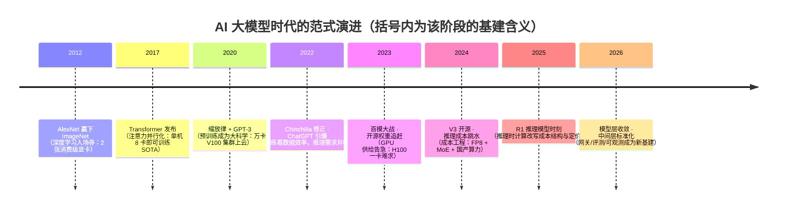

# AI 大模型时代（2023–今）

> 面向所有想搞清楚"这波 AI 到底从哪来、会把基础设施带向哪去"的同行。这篇编年史不做热点复盘，而是把 2023 年以来我们一线的所见所交付，放回一条从 2012 年就开始铺的技术主线上：论文、产品、基建三线并进。读完你会带走三样东西：一条可以自行延展的大模型时间轴、一个判断"哪些变化是范式、哪些只是行情"的框架，以及一份云架构师视角的需求变迁记录。

## 时代坐标

这是[技术编年史](/chronicle/)的第六浪，也是唯一一浪"正在进行时"——写结语为时尚早，但划坐标正当其时。

大模型时代的命题，我在提纲页里写过一句话：**预训练 + 涌现能力让"智能"第一次以 API 形式普惠**。应用栈被重塑：算力成为新石油，推理成本成为新带宽，而架构师的新命题是——如何把概率性的模型输出，装进确定性的工程系统。

但"2023–今"只是引爆区间。这条引线在 2012 年点燃，2017 年成型，2020 年量化。先把时间轴钉牢：

对照总纲里"每一浪的起点都是基础设施跟不上业务"的规律：这一浪的供需缺口不在带宽、不在存储，而在**算力**——先是训练的算力，后是推理的算力。卖铲子的先赚钱这条铁律，在 NVIDIA 的财报里体现得最直白（下文有数）。

## 关键节点编年：论文、产品、基建三线

### 论文线：四块里程碑

**2012 · AlexNet——一场桌面级的革命。** Krizhevsky、Sutskever 与 Hinton 用 8 层卷积网络在 ImageNet（LSVRC-2012）上把 top-5 错误率打到 15.3%，亚军是 26.2%——超过 10 个百分点的断代差距。今天回看论文，最震撼的不是精度而是账本：整个模型用**两张 3GB 显存的 GeForce GTX 580 消费级显卡**训了五六天。今天一次千卡月的预训练，当时一台游戏机就能开始——范式突破的最初形态总是便宜得让人忽略。

*图源：Wikimedia Commons（[File:EVGAGeforceGTX580.jpg](https://commons.wikimedia.org/wiki/File:EVGAGeforceGTX580.jpg)，CC BY-SA 4.0，摄影 TheStriker）*

**2017 · Transformer——把序列计算变成矩阵乘法。** Google 的八位作者发表 [Attention Is All You Need](https://arxiv.org/abs/1706.03762)，用自注意力彻底抛弃循环结构。论文里的效率数据在当时就足够惊人：大模型在 WMT 2014 英德翻译上拿下 28.4 BLEU 刷新纪录，训练用了**一台机器、8 张 P100、3.5 天**；12 小时训出的基础版已经超过此前所有已发表模型及其集成。它成为今天所有大模型共同骨架的原因，站基础设施角度只有一条：**注意力机制让算力利用率第一次可以拉满**——矩阵乘法是 GPU 的主场，RNN 的时序依赖不是。

**2020 · 缩放律与 GPT-3——把"大力出奇迹"变成预算公式。** Kaplan 等人的[缩放律论文](https://arxiv.org/abs/2001.08361)给出损失随参数量/数据量/算力幂律下降的经验公式；紧接着 5 月底，OpenAI 发布 [GPT-3](https://arxiv.org/abs/2005.14165)：**1750 亿参数，比此前最大的非稀疏模型大一个数量级**，并且展示了少样本情境学习（in-context learning）——不改权重、给几个例子就会干活。基建层面这一年是分水岭：GPT-3 训练在微软 Azure 专供的集群上完成，**超过一万张 V100**、285,000+ CPU 核心、400 Gb/s 级互联。预训练从"实验室项目"升格为"基础设施工程"，从此"科学问题"与"工程预算"挂钩。

**2022 · Chinchilla 修正 + ChatGPT 引爆。** DeepMind 的 [Chinchilla 论文](https://arxiv.org/abs/2203.15556)证明同等算力下"加大数据、缩小参数"更优——参数军备竞赛转向数据军备竞赛。同年 11 月 30 日，OpenAI 把 GPT-3.5 的对话微调版本以**免费研究预览**名义上线，叫 [ChatGPT](https://openai.com/index/chatgpt/)。两个月后 UBS 基于 Similarweb 流量估算其月活已破 1 亿（[Reuters 报道](https://www.reuters.com/technology/chatgpt-sets-record-fastest-growing-user-base-analyst-note-2023-02-01/)），比 TikTok 达到同一规模快了数倍——"最快普及的消费级应用"。技术圈准备了十年的东西，用一个聊天框完成了出圈。

### 产品线：从现象级到产业级（2023–2026 速记）

延续提纲页的年度速记，逐年展开：

- **2023：百模大战，开源追赶闭源，Prompt 工程兴起。** 年初 LLaMA（2 月，研究协议）撕开权重公开的口子，[Llama 2](https://arxiv.org/abs/2307.09288)（7 月，可商用许可）与 Mistral 7B（9 月，Apache 2.0）把开源从"能玩"推向"能上线"；国内则是大模型备案与"百模大战"并行。应用层的第一个显学是 Prompt 工程——当时很多 POC 的交付物真的是一个精心维护的提示词文档。
- **2024：RAG 成为企业落地标配，推理成本快速下降，小模型路线出现。** [Hugging Face 模型托管量突破 100 万](https://arstechnica.com/information-technology/2024/09/ai-hosting-platform-surpasses-1-million-models-for-the-first-time/)（9 月）——生态临界点。企业客户不再问"能不能聊"，改问"怎么接我们的知识库"，RAG（检索增强生成：先检索再让模型基于资料作答）从论文名词变成需求文档标配。9 月，OpenAI 发布 [o1](https://openai.com/index/learning-to-reason-with-llms/)：性能随**推理时计算**平滑提升——"多想一会儿"成为可以定价的能力。12 月 26 日，[DeepSeek-V3 上线并同步开源](https://api-docs.deepseek.com/zh-cn/news/news1226/)（MIT 协议）：671B 总参、37B 激活的 MoE 架构，[技术报告](https://arxiv.org/abs/2412.19437)里那串"完整训练仅需 278.8 万 H800 GPU 小时"按厂商自述的 $2/卡时折算约 550 多万美元，把"前沿能力 = 天文数字预算"的共识撕开了一道口子。
- **2025：Agent 与工具生态（MCP）爆发，推理时计算改变成本结构。** 1 月 20 日 [DeepSeek-R1](https://api-docs.deepseek.com/news/news250120) 发布：开源推理模型，数学/代码能力对标 o1，附赠 6 个蒸馏小模型——从 Qwen 到 Llama 底座的"小口径思考模型"一周内长满各家集群。这一年工作负载的重心从"问答"转向"干活"：模型调用工具、多步执行、长任务托管，MCP 之类的协议把"连接企业系统"标准化。
- **2026：应用分层清晰化。** 模型层收敛（旗舰数量远少于百模大战年份）、中间层标准化（评测、网关、可观测长出标准产品）、应用层百花齐放。这一层与本站 [Agent 子域的编年记录](/ai/agent/history)直接衔接，旗舰模型的近况见[大语言模型架构解析](/ai/models/llm)。

### 基建线：单位是"浪"，不是"卡"

把硬件账本单独摊开，每一段都对应基础设施命题的一次换代：

| 年份 | 训练机器规模 | 代表硬件 | 基建关键词 |
| --- | --- | --- | --- |
| 2012 | 2 张消费卡，单机 | GTX 580（3GB） | 桌面实验，无基建可言 |
| 2017 | 单机 8 卡 | P100（NVLink） | 节点内并行 |
| 2020 | 万卡级集群 | V100 @ Azure | 云首次成为"训练的场地" |
| 2022–2023 | 十万卡级建设竞赛 | H100/H800 | 推理服务化；H100 全球断货 |
| 2024–2025 | FP8 训练 + MoE 稀疏激活 | H800、昇腾等国产加速卡 | 成本工程、国产算力上量 |
| 2026 | 推理优先、异构调度 | 代际混布、超节点 | 单位 token 经济性 |

*图源：arXiv（[DeepSeek-V3 Technical Report](https://arxiv.org/abs/2412.19437) 架构概览配图，2024）*

两个数字给这条线定标。其一，**钱都流向哪里**：NVIDIA 数据中心业务收入从 FY2024 的约 475 亿美元涨到 FY2025 的约 1152 亿美元（公开财报口径），一年 2.4 倍——编年史总纲说"早期红利在基础设施层"，这是最贵的一次背书。其二，**推理成本曲线**：斯坦福 [AI Index 2025](https://hai.stanford.edu/ai-index/2025-ai-index-report)测算，达到 GPT-3.5 水平（MMLU 64.8%）的推理成本，从 2022 年 11 月的每百万 token 约 $20 降到 2024 年 10 月的约 $0.07，**两年下降超过 280 倍**（[底层数据来自 Epoch AI](https://epoch.ai/data-insights/llm-inference-price-trends)）。同等能力水平的价格每年掉一个数量级——这是整个应用生态敢于重注的底气，也是我最常给保守客户看的一张牌。

还有一条不能略过的支线：**国产算力**。出口管制收紧后（2022 年 10 月起），"用国产芯片训练千亿模型"从实验室话题变成产业日程：公开报道里，字节跳动被[路透证实](https://www.reuters.com/technology/artificial-intelligence/bytedance-plans-new-ai-model-trained-with-huawei-chips-sources-say-2024-09-30/)评估用昇腾 910B 训练大模型（2024-09）；讯飞公开讲述在万卡级国产集群上的训练历程；各地智算中心陆续落成投运；行业分析口径下中国 AI 芯片国产化率从 2023 年约 15% 升至 2024 年约 29%（券商与媒体估算，注意口径）。我特意把这浪和站内[信创暗流](/chronicle/xinchuang)对齐：**信创第一次拥有了"性能可以被讨论"的硬件底座**——尽管工程适配（算子覆盖、精度对齐、稳定性）的账，比参数表复杂得多。

## 范式变化的技术根源

为什么是这条技术路线赢了？站在系统视角，我认为有三个"耦合"决定了范式：

1. **架构与硬件的耦合**：Transformer 把语言建模转化为稠密矩阵乘法，恰好踩在 GPU 的设计舒适区上；RNN 时代算力利用率常年个位数，"等比缩放"根本无从谈起。范式胜利的第一因是**可并行**。
2. **目标与数据的耦合**："预测下一个 token"的自监督目标意味着数据无上限、损失函数无需人工标注——规模第一次可以像做财务预算一样做加法（缩放律的作用就是把这种加法写成公式）。能力在跨过规模阈值后以**涌现**的形态出现：少样本学习、思维链、指令跟随不是设计出来的，是"买算力买出来的"。
3. **能力与场景的解耦**：预训练把通用能力压进权重，微调/提示/RAG 负责贴场景——"训练一个模型"与"做一个产品"从此是两件事、两拨人、两份预算。智能成为 API 的结构性原因就在这里。

*图源：arXiv（[Attention Is All You Need](https://arxiv.org/abs/1706.03762) 论文 Figure 1，Vaswani et al., 2017）*

推理模型（o1/R1）是这个骨架上长出的第二条缩放曲线：**训练时算不动了，就把计算挪到推理时**。"思考 token"从免费变成计费项，传统的输入/输出单价模型被改写——效果、延迟、成本三角第一次出现"以延迟换效果"这个正交旋钮。架构细节（GQA、MoE、RoPE 长度外推等）本站另有一篇，见[大语言模型架构解析](/ai/models/llm)，此处不重复。

## 对云与 AI 基建的影响（本站视角）

这一节是我最想写给自己的部分：这浪真正改变的是云厂商和架构师的生意结构。

**训练侧：集群工程取代单机调参。** 万卡规模下，故障不是异常而是日常——断点续训、梯度同步的网络带宽、并行策略（DP/TP/PP/EP）与硬件拓扑的匹配，决定了"有效算力"和"纸面算力"可能差出成倍。对应站内两篇：[GPU 集群与高速网络](/ai/infra/cluster)、[训练工程](/ai/infra/training)。

**推理侧：这是真正的长尾战场。** ChatGPT 引爆后的供需倒挂说明一切：当智能变成 API，QPS 就是新的流量，token 就是新的账单。KV Cache 显存、批处理调度（连续批处理能把 GPU 利用率抬升数倍——经验值，视负载形态而定）、量化与投机解码——这些[推理部署](/ai/infra/inference/llm-inference)里的关键词，2024 年之后开始出现在客户招标的技术附件里。而[GPU 选型与成本测算](/ai/infra/inference/gpu-sizing)成了我 2025 年最高频的交付物。

**需求侧：客户的问题完成了一次换代。** 2015–2020 年客户的原话是"要不要上云"；2023 年起变成"要不要上 AI"；到 2026 年，问题收敛为四选一：**调 API、私有化部署、云上托管模型服务、还是混合**。决策依据也换代了——不再问"支持多少卡"，而是问"单 token 成本、时延分位、数据边界"。AI 计算中心的规划和国产算力适配评估从政企标书的加分项变成必答题。

**中间层：新的标准件正在长出来。** 模型网关、评测基准、LLM 可观测（日志、trace、成本归因）、语义缓存……这些"云原生时代 API 网关/Mesh/监控"的对应物，正是我在提纲里预言、如今逐步兑现的方向：模型层收敛之后，价值向中间层与应用层迁移。

## 一线回望：需求曲线的变化

把镜头拉回交付一线，保留提纲页的三个亲历场景：

- **从 POC 到生产的第一道坎：不是效果，是成本与延迟。** 2023 年的典型项目剧本是：演示惊艳 → 全量测算账单爆炸 → 缩容降级。效果在演示环节从来不是问题，问题在把 P99 延迟与月度账单同时压进预算。
- **知识库问答（RAG）的落地真相：检索质量决定上限。** 客户以为买的是模型，实际拼的是文档解析、切分策略与召回质量——见[企业级 RAG 架构设计](/ai/application/rag-architecture)。模型给下限，检索给上限。
- **GPU 账单的震撼。** 第一份认真测算的 GPU 推理账单，让多数技术负责人第一次追问"能不能不用最大的模型"。2024 年之后，"小模型 + 路由 + 缓存"的性价比组合拳成为标准答案——降本需求反向加速了开源小模型生态。

还观察到一个反直觉现象：**单价的崩塌没有让总账单变小，反而让调用量爆炸**——推理成本降 280 倍的那两年，恰恰是全行业 AI 支出涨得最猛的两年。能力平价 + 价格普惠 = 需求井喷，这是 Jevons 悖论在 token 经济里的复现。而 2025 年之后 Agent 化工作负载（一次任务几十上百次调用）把这条曲线又往上拧了一格：我 2026 年做的容量规划，调用量假设比 2024 年高出两个数量级。

与上一浪对照，成本结构的变化一目了然：

| 维度 | 直播时代 | AI 大模型时代 |
| --- | --- | --- |
| 核心成本 | 带宽 | 算力 / token |
| 质量三角 | 画质-延迟-成本 | 效果-延迟-成本 |
| 基础设施 | CDN | GPU 集群与推理服务 |
| 护城河 | 内容生态 | 数据 + 场景 + 工程能力 |

## 未完成的章节

正在发生的历史不下结论，只留下三个开放问题（2023 年写下第一版提纲时的疑问，如今各有了半个答案）：

- **推理成本的下降曲线会把哪些"不可能"变成"标配"？**——端侧推理、Agent 长任务已经给出两个例子；下一个可能是"全员默认 AI"。
- **Agent 大规模落地的信任与安全问题如何解？**——评测、护栏、审计正在重走"从安全左移到合规原生"的老路，尚无标准答案。
- **模型层收敛后，中间层（评测、网关、可观测）会不会长出新的标准产品？**——已经有雏形，但"云原生时代的 CNCF 时刻"还没到。

> 正在发生的历史不做定论，保持记录与更新。本篇将随第六浪的推进持续修订。

## 站内相关

- 编年史总纲：[十年六浪](/chronicle/) · 上一浪：[元宇宙时代](/chronicle/metaverse)（GPU 算力的前传）· 暗流：[信创与国产化](/chronicle/xinchuang)
- 模型演进详解：[大语言模型架构解析](/ai/models/llm) · [机器学习与深度学习经典架构](/ai/models/ml-dl)（2012–2017 的技术伏笔）
- 基建实战：[GPU 集群与高速网络](/ai/infra/cluster) · [训练工程](/ai/infra/training) · [大模型推理部署实战](/ai/infra/inference/llm-inference) · [GPU 选型与推理成本测算](/ai/infra/inference/gpu-sizing)
- 应用落地：[企业级 RAG 架构设计](/ai/application/rag-architecture) · [智能体技术全景](/ai/agent/)

## 参考资料

<Refs>

以下为本文史料来源，均于 2026-09-02 访问核对。

**论文（一手史料）**

1. Krizhevsky, Sutskever, Hinton. [ImageNet Classification with Deep Convolutional Neural Networks](https://papers.nips.cc/paper/4824-imagenet-classification-with-deep-convolutional-neural-networks)（NIPS 2012）
2. Vaswani et al. [Attention Is All You Need](https://arxiv.org/abs/1706.03762)（arXiv 1706.03762，2017）
3. Kaplan et al. [Scaling Laws for Neural Language Models](https://arxiv.org/abs/2001.08361)（arXiv 2001.08361，2020）
4. Brown et al. [Language Models are Few-Shot Learners](https://arxiv.org/abs/2005.14165)（GPT-3，arXiv 2005.14165，2020）
5. Hoffmann et al. [Training Compute-Optimal Large Language Models](https://arxiv.org/abs/2203.15556)（Chinchilla，arXiv 2203.15556，2022）
6. Touvron et al. [Llama 2: Open Foundation and Fine-Tuned Chat Models](https://arxiv.org/abs/2307.09288)（arXiv 2307.09288，2023）
7. DeepSeek-AI. [DeepSeek-V3 Technical Report](https://arxiv.org/abs/2412.19437)（arXiv 2412.19437，2024）

**官方公告**

8. OpenAI. [ChatGPT: Optimizing Language Models for Dialogue](https://openai.com/index/chatgpt/)（2022-11-30）
9. OpenAI. [Learning to reason with LLMs](https://openai.com/index/learning-to-reason-with-llms/)（o1，2024-09-12）
10. DeepSeek 官方文档. [DeepSeek-V3 正式发布](https://api-docs.deepseek.com/zh-cn/news/news1226/)（2024-12-26）
11. DeepSeek 官方文档. [DeepSeek-R1 Release](https://api-docs.deepseek.com/news/news250120)（2025-01-20）
12. Mistral AI. [Announcing Mistral 7B](https://mistral.ai/news/announcing-mistral-7b/)（2023-09）

**数据与报道**

13. Stanford HAI. [The 2025 AI Index Report](https://hai.stanford.edu/ai-index/2025-ai-index-report)（推理成本 280 倍下降、硬件成本年降约 30%）
14. Epoch AI. [LLM inference prices have fallen rapidly but unequally](https://epoch.ai/data-insights/llm-inference-price-trends)（AI Index 推理价格底层数据）
15. Reuters. [ChatGPT sets record for fastest-growing user base](https://www.reuters.com/technology/chatgpt-sets-record-fastest-growing-user-base-analyst-note-2023-02-01/)（UBS 估算，2023-02-01）
16. Hugging Face Blog. [2023, year of open LLMs](https://huggingface.co/blog/2023-in-llms)
17. Ars Technica. [AI hosting platform surpasses 1 million models](https://arstechnica.com/information-technology/2024/09/ai-hosting-platform-surpasses-1-million-models-for-the-first-time/)（2024-09）
18. NVIDIA Newsroom. [Financial Results for Fourth Quarter and Fiscal 2025](https://nvidianews.nvidia.com/news/nvidia-announces-financial-results-for-fourth-quarter-and-fiscal-2025)（数据中心业务收入口径）
19. Microsoft Source. [OpenAI and Azure supercomputer](https://news.microsoft.com/source/features/ai/openai-azure-supercomputer/)（万卡 V100 集群）；[NVIDIA Developer Blog: OpenAI Presents GPT-3](https://developer.nvidia.com/blog/openai-presents-gpt-3-a-175-billion-parameters-language-model/)（V100 训练佐证）
20. Reuters. [ByteDance plans new AI model trained with Huawei chips](https://www.reuters.com/technology/artificial-intelligence/bytedance-plans-new-ai-model-trained-with-huawei-chips-sources-say-2024-09-30/)（2024-09-30，国产算力公开报道）
21. Wikipedia. [AlexNet](https://en.wikipedia.org/wiki/AlexNet) · [ChatGPT](https://en.wikipedia.org/wiki/ChatGPT)（时间锚点交叉核对）

**图片来源（正文 3 张，均自由版权或论文公开配图，访问日期 2026-09-02）**

| 文件 | 来源 |
| --- | --- |
| gtx580.jpg | Wikimedia Commons：[File:EVGAGeforceGTX580.jpg](https://commons.wikimedia.org/wiki/File:EVGAGeforceGTX580.jpg)（CC BY-SA 4.0） |
| transformer-paper-fig1.png | arXiv：[Attention Is All You Need](https://arxiv.org/abs/1706.03762) HTML 版论文 Figure 1 |
| deepseek-v3-arch.png | arXiv：[DeepSeek-V3 Technical Report](https://arxiv.org/abs/2412.19437) HTML 版架构概览配图 |

</Refs>