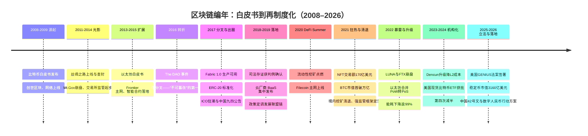
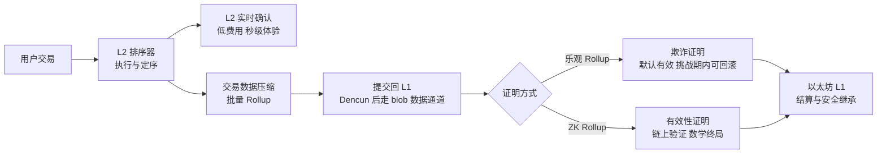
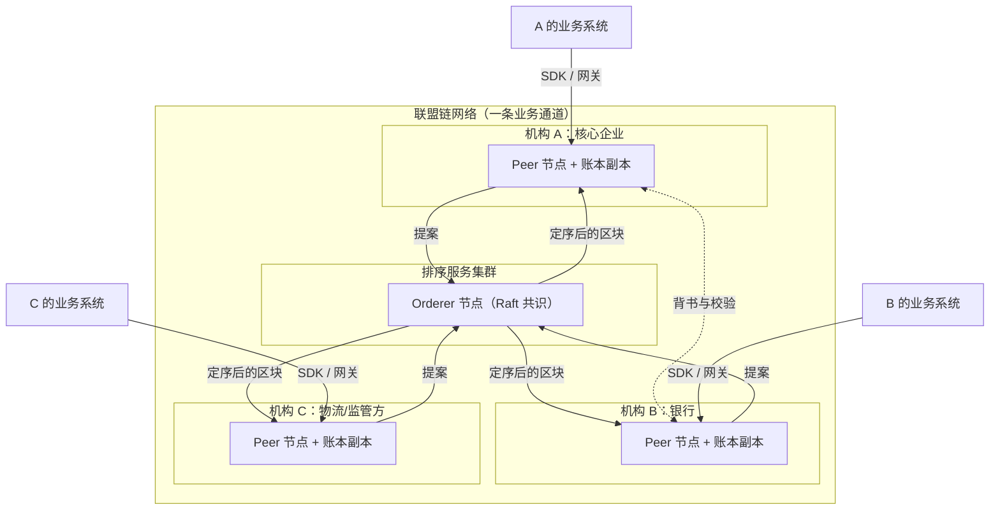
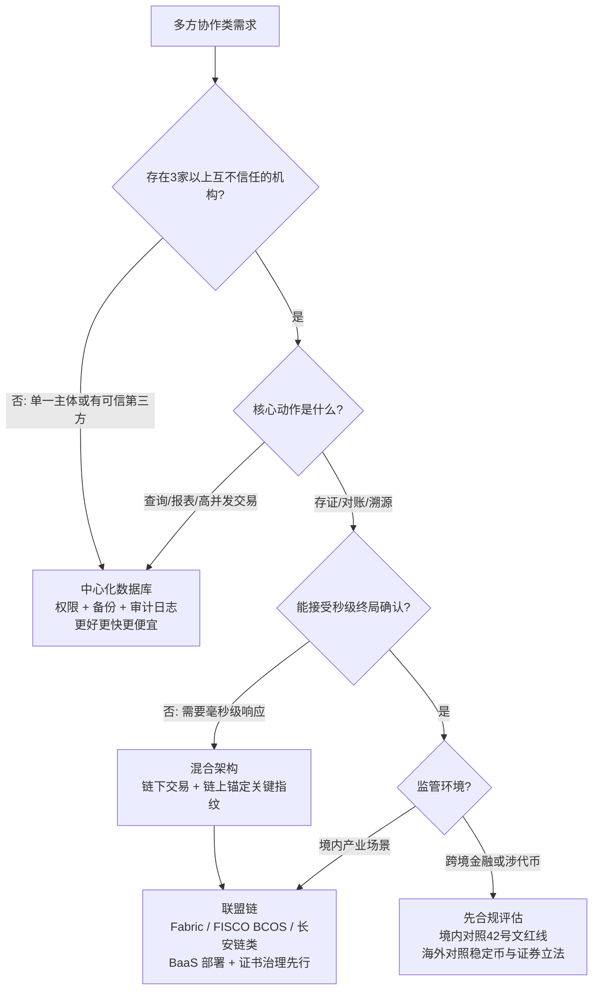

# 区块链时代（中国主窗口约 2017–2019，全球编年 2008–2026）

> 这是[技术编年史](/chronicle/)的第三浪，也是我个人认为**最有教育意义**的一浪。适合所有正在为"要不要用某项新技术"做决策的人阅读：架构师、技术管理者、以及任何被"趋势"追着跑的工程同学。读完你会带走四样东西：一条从 2008 白皮书到 2026 稳定币立法的完整全球编年，和一条 2017–2019 中国联盟链主窗口的产业编年；一套"账本 / 共识 / 智能合约 / 扩容"的一次讲透原理；一份 DeFi、NFT、FTX、比特币 ETF、GENIUS 法案、数字人民币的关键数据表；以及一个可以复用到今天的判断框架——**看一项技术是不是刚需，先问"不用它会怎样"**。本篇保持技术中立，只谈工程与架构，不涉任何投资判断；文中出现的价格与市值数字仅作为编年锚点。

## 时代的命题

分布式系统的一次"再探索"：当多方互不信任时，如何用技术替代中介。

上一浪（[直播](/chronicle/livestream)与[短视频](/chronicle/short-video)）解决的是"一对多分发"的效率问题，云厂商和工程师都越做越顺。区块链抛出的是一个不同性质的问题：**多对多、且彼此不信任**的协作——银行看不见企业的真实订单，核心企业自证清白成本高昂，版权方拿不出法庭认可的时间戳。"用密码学和网络协议来替代中介背书"这个叙事，恰好击中了 B 端最痛的那根神经。

技术本身在进步，但多数项目死于"用错了锤子"——不是区块链不好，而是太多场景里本不存在"互不信任的多方"，一个中心化数据库加审计日志就够了。这段兴衰是整部编年史里最完整的一次技术周期解剖样本：它在海外走完了一整圈"狂热 → 暴雷 → 机构化 → 立法"的金融周期，在国内则沉淀为"无币区块链"的产业工程——**同一种技术，两种命运，这本身就是最值得复盘的部分**。

## 时代坐标

先交代一个时间口径：全球技术谱系从 2008 年就开始了，但**中国云从业者真正被卷入这波浪潮是 2017–2019**——BaaS 产品集中上线、联盟链 POC 密集交付、监管政策相继落地，所以本编年史以这三年为主窗口，向前追述源流（丝绸之路、Mt.Gox），向后记录退潮与再制度化（余震持续到 2021 年，而全球线一直写到 2026 年的稳定币立法与数字人民币新框架）。

| 层面 | 核心叙事 | 代表事物 |
| --- | --- | --- |
| 公共链（海外热） | 无许可、抗审查的密码经济学实验 | 比特币、以太坊、ERC-20 |
| 技术底座 | 分布式账本 + 共识算法 + 智能合约虚拟机 | PoW、PoS、PBFT、Raft、EVM、Rollup |
| 产业落地（国内热） | 多方协作的"信任工程"：存证、溯源、对账 | Hyperledger Fabric、长安链、FISCO BCOS、联盟链、BaaS |
| 金融化与立法（2024–2026 海外） | 从投机标的到受监管的金融基础设施 | 现货比特币 ETF、GENIUS 法案、合规稳定币、RWA 代币化讨论 |
| 法定数字货币（国内） | 央行主导的支付基础设施，与"炒币"严格切割 | 数字人民币 e-CNY、mBridge 跨境实验 |

## 关键节点编年

### 2008–2009：一份白皮书与创世区块

*比特币符号。图源：Wikimedia Commons（[来源页](https://commons.wikimedia.org/wiki/File:Bitcoin.svg)，Public domain）*

2008 年 10 月 31 日，化名中本聪的作者向密码学邮件组发布了《比特币：一种点对点的电子现金系统》（bitcoin.org 白皮书 PDF，全文约 2700 词）。今天回看，它的技术贡献可以压缩成三件事：**哈希链式账本**（把"改一条记录"变成"重算所有后续记录"）、**PoW 最长链共识**（用算力和电费给投票加权，作恶成本与收益挂钩）、**经济激励**（区块奖励驱动节点诚实地维护网络）。2009 年 1 月 3 日创世区块诞生，中本聪把当天《泰晤士报》的头条"财政大臣站在第二轮银行救助的边缘"写进了区块的 coinbase 字段——这一手既是**时间戳证明**（区块不可能早于报纸日期存在），也是这份技术文献少有的态度表达。

工程视角的要点：比特币解决的不是"数据库"问题，而是**在没有任何中心可以仲裁"哪条记录是真的"时，让全网收敛到同一份历史**。

*图源：Wikimedia Commons（[来源页](https://commons.wikimedia.org/wiki/File:Bust_of_Satoshi_Nakamoto_in_Budapest.jpg)，CC BY-SA 4.0）*

### 2011–2014：丝绸之路与 Mt.Gox——早期采用的光与影

比特币最初的"杀手级应用"不在金融，在暗网。**丝绸之路（Silk Road）**2011 年上线，是第一个现代暗网市场：运行在 Tor 网络的隐藏服务上，所有交易以比特币计价结算（Wikipedia"Silk Road"词条）。2011 年 2 月至 2013 年 7 月，该平台经手的比特币多达 951.9 万枚。2013 年 10 月，FBI 查封网站并逮捕创始人 Ross Ulbricht（化名"恐怖海盗罗伯茨"）；一个月后 Silk Road 2.0 上线，又被再度打击。这段历史给行业留下了两个洗不掉的注脚：**比特币的早期流动性有相当部分来自非法交易**；以及**"匿名"只是假名——链上分析从第一天起就是执法工具**。

*图源：Wikimedia Commons（[来源页](https://commons.wikimedia.org/wiki/File:Silk_Road_Seized.jpg)，公有领域，美国联邦调查局查封页面）*

另一半教训来自交易所。**Mt.Gox** 前身是 2010 年上线的卡牌交易平台，转型后一度处理全球约 70% 的比特币交易量（2013 年口径）。2014 年 2 月，它突然暂停交易、关闭网站并申请破产保护；泄露的内部文件显示丢失了 744,408 枚比特币，后在旧钱包中找回约 20 万枚，净损失仍约 65 万枚。2015 年安全公司 WizSec 的证据显示，**大部分币是从 2011 年末开始被持续从热钱包中盗走的**——即托管方连自己的账都对不上。事发期间（2014 年 2–3 月）比特币价格下跌 36%，CEO Karpeles 后被逮捕并以挪用等罪名定罪；这场崩盘直接推动日本率先建立了正式的加密资产交易所监管制度（以上均据 Wikipedia"Mt. Gox"词条）。

*图源：Wikimedia Commons（[来源页](https://commons.wikimedia.org/wiki/File:Logo_of_Mt._Gox.svg)，公有领域）*

对工程师的遗产是一句行业黑话："Not your keys, not your coins"（私钥不在你手里，币就不是你的）。但十年后回看，这句话的反面成了主流：**普通用户根本管不好私钥，所以托管、合规与保险机制反而成了 2024 年之后机构化行情的地基**——这个反转在"华尔街进场"一节还会再出现。

### 2013–2015：以太坊与智能合约

*以太坊标志。图源：Wikimedia Commons（[来源页](https://commons.wikimedia.org/wiki/File:Ethereum_Logo.png)，Public domain）*

2013 年底，Vitalik Buterin 发表以太坊白皮书，把比特币的"专用脚本"改造成**通用状态机**：链不再只记账，还能执行图灵完备的程序——智能合约。2014 年以太坊用约 31,000 枚比特币的众筹完成冷启动（Wikipedia"Initial coin offering"词条），2015 年 7 月 30 日 Frontier 主网上线，"可编程的分布式信任"第一次成为可用的基础设施。这一年我刚开始把"智能合约"当作独立技术方向持续跟踪：它的魅力在于**规则的自动执行不依赖任何一方的善意**——这正是后来所有 B 端"信任叙事"的技术原点。

*图源：Wikimedia Commons（[来源页](https://commons.wikimedia.org/wiki/File:Vitalik_Buterin_TechCrunch_London_2015_(cropped).jpg)，CC BY 2.0，拍摄者 TechCrunch）*

### 2016：The DAO 事件——"不可篡改"的第一课

2016 年 4 月，一个运行在以太坊上的链上基金 The DAO 上线；6 月，攻击者利用智能合约中**重入漏洞**（合约在完成余额更新前被递归再次调用——本质是经典 TOCTOU 并发问题在链上的重现）持续转出约 360 万枚 ETH。7 月 20 日，社区以硬分叉回滚了这笔交易，拒绝分叉的那条链延续为以太坊经典。**这是教科书级别的一刻**：账本在技术上不可篡改，但治理是人做的——"Code is Law"与"人类可以干预"第一次正面相撞。对工程师的启示是：部署上链的代码没有热修复窗口，合约审计从此成为独立工程学科。一年后（2017 年 7 月），美国 SEC 发布 The DAO 调查报告，认定部分数字代币依现行联邦证券法可构成证券——**监管第一次用既有法律工具给链上资产定性**，这也为 2025–2026 年的立法埋下伏笔。

### 2017：分岔路的一年

这一年出现了四条并行的线，决定了后面几年两个市场的分野：

- **扩容与分叉**：比特币社区在"区块该多大"上分裂，年中 SegWit 激活、8 月出现比特币现金分叉。公共链的第一性矛盾暴露：**吞吐、去中心化、安全三者不可兼得**，任何改动都需要全网博弈。
- **企业联盟链就绪**：7 月 11 日，Linux 基金会宣布 Hyperledger Fabric 1.0 生产可用。与公共链的关键差异：成员准入（许可制）、共识可插拔、通道隔离商业隐私。联盟链路线正式从论文走进产品。
- **ERC-20 与第一次应用拥塞**：10 月，可互换通证标准 ERC-20（EIP-20）进入标准轨道；11 月，养猫游戏 CryptoKitties 上线，12 月一个去中心化应用就能把整条以太坊堵到瘫痪。工程出圈了，**性能天花板也出圈了**——这直接催生了此后所有 Layer 2 扩容路线（见"扩容成为主线"一节）。
- **ICO 狂潮与急刹车**：ERC-20 让"发币"变成几十行代码的事，2017 年 ICO 在全球募集了数十亿美元，多数投向没有运营历史的早期项目，散户大量入场（Wikipedia"Initial coin offering"词条）。同年 9 月 4 日，中国人民银行等七部委发布《关于防范代币发行融资风险的公告》，**定性代币发行融资为未经批准的非法公开融资**，要求停止发行并清退——境内狂热被按下停止键，行业重心从此转向产业应用。这条官方定性至今仍是理解中国区块链政策的第一把钥匙。

### 2018–2019：存证判例与 BaaS 军备竞赛

- **2018 年 6 月 28 日**，杭州互联网法院在一起侵害作品信息网络传播权纠纷案中，**首次确认区块链电子存证的法律效力**——法院给出了一整套审查框架（存证平台资质、取证方式、上链前数据真实性、技术可靠性）。"哈希上证"从概念变成被司法系统接受的证据形式，这是国内区块链真正跑通的第一个场景。
- **2017 年 11 月腾讯云 TBaaS 发布、2018 年阿里云区块链服务正式发布**；2019 年 4 月 30 日 AWS Managed Blockchain GA、5 月 2 日 Azure Blockchain Service 发布。**BaaS 一度是云厂商产品目录的标配**。
- **2019 年 10 月 24 日**，中央政治局第十八次集体学习以区块链技术发展现状和趋势为主题，定调"把区块链作为核心技术自主创新的重要突破口"，并点名供应链管理等应用方向。联盟链获得政策面背书，各地产业园、BSN（区块链服务网络，2020 年上线的跨联盟链基础设施）等布局随后展开。

### 2020：DeFi Summer——可组合的"货币乐高"

监管收紧后的公共链生态并没有沉寂，而是在 2020 年夏天找到了新的引爆点：**DeFi（去中心化金融）**——用智能合约复刻借贷、交易、稳定币等金融原语，不经任何持牌中介。导火索是流动性挖矿：2020 年 6 月，借贷协议 Compound 开始向存借双方发放治理代币 COMP 奖励，"把钱存进去、白拿代币、代币再质押"的循环收益模型瞬间点燃了整个板块（Wikipedia"Decentralized finance"词条）。到 2021 年，MakerDAO、Compound、Aave、Uniswap 等协议把链上锁定总价值（TVL）推过了 1800 亿美元。

工程视角上，DeFi 的真正创新是**可组合性**：协议之间像乐高一样互相调用——一个稳定币协议可以成为借贷协议的抵押品，借贷头寸又能进入衍生协议，全部无需商务谈判和接口审批。代价是**攻击面同样可组合**：闪电贷操纵预言机、跨协议连环清算，2020–2022 年的重大安全事件几乎都是"多个各自正确的合约组合出系统性错误"。这给所有做平台化架构的人留了一条通用教训：**开放可组合系统的安全性不等于组件安全性之和**。

同年的存储链实验也交了卷：**2020 年 10 月 15 日** Filecoin 主网上线——把"分布式存储激励"从融资叙事变成运行中的网络；**2021 年 3 月**，Chia 以"空间与时间证明"上线。这些存储链后来多数没能跑通商业闭环，但留下了大规模存储网络调度与可验证性工程的实验数据（见下文"技术栈记忆"）。

### 2021：NFT 狂热与中国的挖矿清退

上半年是 NFT（非同质化通证，链上的唯一所有权凭证）的出圈之年，数据曲线堪称垂直（Wikipedia"Non-fungible token"词条）：

- 技术起点在 2017：ERC-721 标准与 CryptoKitties；OpenSea 等交易市场同年出现，2021 年市值达 14 亿美元（Wikipedia 口径）；NBA Top Shot（2019 年 7 月，NBA 与 Dapper Labs 合作）证明了体育 IP 的收藏品类可行。
- 2021 年 3 月，Beeple 的拼贴作品《Everydays: the First 5000 Days》在佳士得拍出 6930 万美元；同年 12 月 Pak 的《The Merge》以 9180 万美元刷新纪录。传统拍卖行背书 + 天价成交，让 NFT 成为当年最热的大众科技话题。
- 交易额从 2020 年的约 8200 万美元跳到 2021 年的约 170 亿美元；随后 2022 年市场崩塌，5 月的估计是销售量较上年跌去九成以上；2023 年 9 月的一份报告称超过 95% 的藏品集合已无货币价值。

NFT 热浪与[元宇宙时代](/chronicle/metaverse)的叙事在 2021 年合流——"虚拟世界需要虚拟产权"是两边共用的故事，也是区块链叙事最后一次大规模出圈，以及它让位给下一个主角的交接仪式。

下半年的中国线则是监管收网，节奏逐日可查：

- **2021 年 5 月 21 日**，国务院金融委会议明确"打击比特币挖矿和交易行为"，多省份随即清退挖矿项目；
- **9 月 24 日**一天之内两份文件落地——发改委等 11 部门《关于整治虚拟货币"挖矿"活动的通知》把挖矿列为淘汰类产业，人民银行等十部门《关于进一步防范和处置虚拟货币交易炒作风险的通知》将虚拟货币相关业务活动整体定性为非法金融活动。**到年底，境内挖矿算力从全球第一到清零**（对照：2025 年 10 月全球比特币算力分布为美国 38%、俄罗斯 16%、中国 14%——境内交易与挖矿虽被禁止，Wikipedia"Bitcoin"词条转述的测算仍给中国留了份额，说明清退的是"产业"，压不住的是"地下化尾部"，这也是监管常态化的原因之一）。
- **2021 年 9 月 10 日**，微软宣布关停 Azure Blockchain Service——海外第一家托管联盟链服务退场；AWS 的同名产品也转向公共链接入 API。**云厂商的区块链中间件竞赛，先于应用层结束了。**

### 2022：暴雷之年——LUNA、FTX 与合并的对位

2022 年是公共链金融化实验的总清算，两场崩盘一前一后：

- **5 月，Terra/LUNA 死亡螺旋**：算法稳定币 UST 依靠与 LUNA 的铸造/销毁套利维持锚定，挤兑一旦启动，增发 LUNA 接盘反而加速贬值，一周内蒸发约 450 亿美元市值，链一度被迫暂停（Wikipedia"Terra"词条）。开发公司 Terraform Labs 于 2024 年 1 月 21 日申请破产。**工程结论：用"反射性套利"代替真实储备的稳定机制，在流动性冲击下是正反馈炸弹。**
- **11 月，FTX 崩盘**：11 月 2 日 CoinDesk 报道揭示 FTX 关联做市商 Alameda 的资产负债表主要由 FTX 平台币 FTT 构成；6 日币安 CEO 赵长鹏宣布清仓 FTT，引发挤兑；8 日币安签署收购意向书、次日尽调后放弃；11 日 FTX 及 100 余家关联公司申请破产，据《纽约时报》援引消息，客户资金缺口高达约 80 亿美元；当晚链上又出现逾 4.7 亿美元资产异常转出。创始人 Sam Bankman-Fried 12 月 12 日在巴哈马被捕，2023 年 11 月 2 日陪审团裁定七项欺诈与洗钱罪名全部成立，2024 年 3 月 28 日被判 25 年监禁并没收 110 亿美元资产（Wikipedia"FTX"、"Sam Bankman-Fried"词条）。接盘收拾残局的新 CEO John J. Ray III 正是当年主持安然清算的重组专家，他的公开评价被广泛引用："我职业生涯中从未见过如此彻底的公司控制失败，以及如此完全缺失的可信财务信息。"（Wikipedia"FTX"词条；下图即他在美国众议院金融服务委员会作证现场。）

*图源：Wikimedia Commons（[来源页](https://commons.wikimedia.org/wiki/File:John_Ray_House_Testimony.jpg)，公有领域，美国国会影像）*

暴雷的同一年，技术侧完成了它最重要的一次升级作为对位：**2022 年 9 月 15 日，以太坊"合并"（The Merge）把共识机制从 PoW 切换到 PoS，全网能耗下降逾 99%**（Wikipedia"Ethereum"词条、ethereum.org 官方合并路线图）。一条承载数千亿美元资产的在役网络，在不停机的情况下更换了发动机——这是分布式系统工程史上罕见的大手术，也是"区块链 = 高能耗挖矿"这一刻板印象的技术性终结。**2022 年因此是完整的一年两面：金融叙事信用破产，工程叙事反而登顶。**

### 2022–2026：扩容成为主线——Rollup、账户抽象

CryptoKitties 时代暴露的性能天花板，最终以"以 Rollup 为中心"的路线图收束：**Layer 2（二层网络）**在链下执行交易、把压缩后的数据与证明提交回以太坊（Layer 1）结算，继承主网安全性（Wikipedia"Ethereum"词条：L2 分乐观 Rollup 与 ZK Rollup 两类，视技术细节可达每秒数千笔）。

关键节点三个：

- **2024 年 3 月 13 日，Dencun 升级**落地 EIP-4844（Proto-Danksharding），引入临时存储的 blob 数据通道——L2 向 L1 回贴数据的成本大幅下降，主流 L2 的转账费用从美元级降到美分级（Wikipedia"Ethereum"词条）。
- **2025 年 5 月 7 日，Pectra 升级**继续优化验证者与账户体验。
- **账户抽象（Account Abstraction）**把"账户 = 一把私钥"改造成"账户 = 一段可编程合约"：社交恢复（多人授权找回账户）、代付 Gas、会话密钥、消费限额都在协议层成为可能（ethereum.org 官方路线图）。它的产业意义直指 Mt.Gox 与 FTX 的教训反面——**当托管与密钥管理可以被工程化兜底，"自托管 vs 中心化交易所"的二选一才有第三条路**。

我的判断（经验边界：以以太坊生态为主）：扩容战争到 2026 年已分出阶段性胜负——Rollup 路线赢了"单体链扩容"路线，L2 承接了绝大多数日常交易，L1 退居结算与担保层；但碎片化（几十条 L2 之间跨链桥接的体验与安全问题）成了新的主要矛盾。**这又是一次"解决一个问题、暴露下一个问题"的标准工程演进。**

### 2024：华尔街进场——现货比特币 ETF

2024 年 1 月，美国 SEC 批准首批 11 只现货比特币 ETF 上市交易，普通投资者第一次可以像买股票一样直接持有比特币敞口（Wikipedia"Bitcoin"词条）；此前 2021 年 10 月 ProShares 的期货 ETF（BITO）已经试水。同年 4 月，比特币完成第四次减半，出块奖励从 6.25 枚降至 3.125 枚；12 月，比特币价格首次突破 10 万美元——背景是美国当选总统特朗普公开承诺把美国建成"加密之都"并建立比特币储备（Wikipedia"Bitcoin"词条）；全球最大资管机构贝莱德甚至建议投资者在组合中配置至多 2% 的比特币。

从编年史角度给这个节点定性：**ETF 获批是这条技术线"机构化"的分水岭**——托管、审计、合规通道被传统金融基础设施接管，公共链的金融属性从"法外实验"转入"受监管资产类别"。它对工程侧几乎没有改变任何事实（TPS 还是那个 TPS，Gas 还是那个 Gas），改变的是资金进出的闸门。**技术成熟度曲线与资本合法化曲线，本来就是两条可以独立移动的线**——这是区块链浪教给编年史的最重要一课。

### 2025–2026：稳定币立法与支付落地

2025 年是加密金融"入法"的一年，主角是稳定币（锚定法币价值、以储备资产支撑的链上货币）：

- **美国 GENIUS 法案**（《引导与建立美国稳定币国家创新法案》）：2025 年 5 月 21 日由参议员 Hagerty 提出，6 月 17 日参议院以 68:30 跨党派通过，7 月 17 日众议院通过，7 月 18 日特朗普签署成法。核心条款：支付稳定币须以美元或低风险资产 1:1 储备，联邦与州双轨发牌。分析（牛津商业法博客、布鲁金斯）指出它把合规稳定币从 SEC/CFTC 的"证券/商品"定义中豁免出来，形成一个独立的监管辖区；批评同样公开——消费者组织认为保护不足、纽约州总检察长指出缺少被盗资金返还义务、经济学家 Rogoff 等把这套宽松框架类比 1837–1862 年的美国"自由银行时代"（Wikipedia"GENIUS Act"词条）。配套的 CLARITY 法案（市场结构立法）已过众议院、待参议院表决。
- **市场用脚投票**：发行 USDC 的 Circle 于 2025 年 6 月 4 日登陆纽交所，上市次日股价较发行价涨 247%、市值约 286 亿美元；6 月 17 日参议院通过 GENIUS 法案后再度大涨，较发行价累计涨幅一度达 675%（Wikipedia"Circle Internet Group"词条）。稳定币总市值按 FATF 口径在 2025 年 10 月达到约 3160 亿美元、日交易量约 1560 亿美元；BIS 2025 年 7 月报告指出其中 90% 集中在 Tether 与 USDC 两家，法币支撑型稳定币中约 97% 锚定美元（Wikipedia"Stablecoin"词条）。2024 年稳定币跨境流动约 1.4 万亿美元——量级仍远小于传统跨境支付，但增速与"7×24 小时即时结算"的工程特性让各国央行坐不住了：欧洲央行 2026 年 3 月的研究公开讨论美元稳定币对欧洲货币主权的侵蚀，中国与新西兰学者则把 GENIUS 法案解读为巩固美元霸权的战略动作（Wikipedia"Stablecoin"词条）。
- **中国语境**：监管定性一以贯之且仍在收紧——2026 年 2 月 6 日，人民银行等八部门发布银发〔2026〕42 号文并废止 237 号文，将虚拟货币及**资产代币化（RWA）相关活动**纳入更完整的规制。**"强监管"不是一次事件，而是常态。**官方路线始终是三条腿：打击炒作、发展无币联盟链、研发法定数字货币——2025–2026 年全球 RWA 代币化与合规稳定币的讨论再热，境内展业的合规边界都以上述官方表述为准，本篇不做任何引申。

*图源：Wikimedia Commons（[来源页](https://commons.wikimedia.org/wiki/File:Digital_RMB_sign_Hangzhou.jpg)，CC BY-SA 4.0）*

**数字人民币（e-CNY）**的编年值得单独排一遍，它是"区块链相关技术 + 央行信用"的中国答案（以下均来自人民银行公开口径及 Wikipedia"数字人民币"词条）：

- **2014** 央行成立数字货币研究团队；**2017** 国务院批准研发，确立"双层运营、M0（流通中现金）替代、可控匿名"三原则；
- **2019 年底起**深圳、苏州、雄安、成都及冬奥场景启动试点；**2020 年 10 月**深圳首批公网红包试点；
- **2021 年 6 月末**：试点场景超 132 万个，个人钱包 2087 万余个、对公钱包 351 万余个，累计交易约 345 亿元；
- **2022 年 8 月末**：15 省（市）累计交易 3.6 亿笔、金额 1000.4 亿元，支持商户门店超 560 万个；
- **2023**：常熟对公务员与企事业单位人员工资全额以 e-CNY 发放；SIM 卡硬钱包（NFC 离线支付）上线；中石油完成首单跨境原油结算；
- **2024 年 6 月末**：试点扩至 17 个省（区、市），**累计交易金额达 7 万亿元**；同年 5 月香港启动跨境零售试点，11 月可视硬钱包发布；跨境侧参与由国际清算银行香港创新中心牵头的 mBridge 项目（与泰国央行、阿联酋央行、香港金管局）；
- **2026 年 1 月 1 日**：《关于进一步加强数字人民币管理服务体系和相关金融基础设施建设的行动方案》实施，**实名钱包余额开始按活期存款计息**（工、农、中、建、交、邮储六大行同步公告）——从"数字现金"向"数字存款货币"迈了一步；**2026 年 4 月 2 日**央行宣布新增中信、光大、华夏、民生、广发等 12 家数字人民币业务运营机构。

把两条线并排看，2025–2026 年"链上货币"的制度竞赛已经清晰：**美国选择给私人美元稳定币立法收编，中国选择让央行数字货币自我升级**——技术底座有重叠（分布式账本、可编程性），制度内核截然相反（私人发行 + 储备监管 vs 央行负债 + 双层运营）。对从业者，这是理解未来跨境支付格局的坐标系；对架构师，两边都会持续产生合规基础设施的真实需求。

**境内联盟链生态**同期完成了从"政策热词"到"行业工具"的沉淀：金融场景的 FISCO BCOS（金链盟——深圳市金融区块链发展促进会 2016 年 5 月由微众银行、腾讯、深证通等二十余家机构发起成立，2017 年其开源工作组协同打造金融级区块链底层平台，成员已覆盖银行、证券、基金、保险等六大类 100 余家单位，2026 年 8 月仍在发布 v3.17.0 版本）；政务与产业场景的长安链 ChainMaker（官网在运营的国产联盟链底层平台）；以及跨链基础设施 BSN。它们不再出现在热搜上，但司法存证、供应链金融、政务数据共享的存量系统每天都在跑——**这恰好是编年史总纲那条检验尺的又一次验证：热度归零后还有人付钱用的，才是资产**。

## 关键数据速览（2011–2026）

编年史的"数据轮"集中放在这张表里，全部为公开来源口径（Refs 中均有对应条目），只作时间锚点、不作投资参考：

| 年份 | 事件 | 关键数字 | 来源口径 |
| --- | --- | --- | --- |
| 2011–2013 | 丝绸之路经手的比特币 | 9,519,664 枚 | Wikipedia"Silk Road"词条 |
| 2013 | Mt.Gox 处理的全球比特币交易份额 | 约 70% | Wikipedia"Mt. Gox"词条 |
| 2014 | Mt.Gox 丢失的比特币 | 744,408 枚（找回约 20 万枚） | Wikipedia"Mt. Gox"词条 |
| 2014 | 以太坊众筹 | 约 31,000 枚 BTC | Wikipedia"ICO"词条 |
| 2016 | The DAO 被转出 ETH | 约 360 万枚 | Wikipedia"The DAO"词条 |
| 2017 | ICO 全球募集 | 数十亿美元级 | Wikipedia"ICO"词条 |
| 2020–2021 | NFT 交易额 | 约 0.82 亿 → 170 亿美元 | Wikipedia"NFT"词条 |
| 2021 | DeFi TVL 峰值 | 超 1800 亿美元 | Wikipedia"DeFi"词条 |
| 2021 | 比特币市值 | 首破 1 万亿美元（2 月） | Wikipedia"Bitcoin"词条 |
| 2022 | LUNA/UST 崩盘 | 一周蒸发约 450 亿美元 | Wikipedia"Terra"词条 |
| 2022 | FTX 客户资金缺口 | 约 80 亿美元 | NYT 经 Wikipedia"FTX"词条转述 |
| 2022 | 以太坊合并后能耗 | 下降逾 99% | Wikipedia"Ethereum"词条 |
| 2024 | SBF 判决 | 25 年监禁 + 没收 110 亿美元 | Wikipedia"SBF"词条 |
| 2024 | 现货比特币 ETF | 首批 11 只获批上市；同年减半后出块奖励 3.125 枚 | Wikipedia"Bitcoin"词条 |
| 2024 | 比特币价格 | 12 月首破 10 万美元 | Wikipedia"Bitcoin"词条 |
| 2025 | Circle 上市 | 次日 +247%，市值约 286 亿美元 | Wikipedia"Circle"词条 |
| 2025 | 稳定币市值 / 日交易量 | 约 3160 亿 / 1560 亿美元（10 月，FATF 口径） | Wikipedia"Stablecoin"词条 |
| 2024 | 数字人民币累计交易 | 7 万亿元（6 月末，17 省试点） | 人民银行公开口径，经维基百科"数字人民币"词条 |
| 2025-10 | 全球比特币算力分布 | 美国 38%、俄罗斯 16%、中国 14% | Wikipedia"Bitcoin"词条 |

一行读法：**上半张表（2011–2022）数字的主语是"损失与蒸发"，下半张表（2024–2026）数字的主语变成了"市值、立法与交易金额"**——同一个技术，从风险叙事切换到金融基础设施叙事，切换点就是 ETF 与 GENIUS 法案。

## 技术原理：账本、共识、智能合约各用一句话讲透

做交付这些年，我发现把区块链讲明白只需要三句话，但每句话背后是一个真实的工程权衡。

**第一句：区块链 = 用哈希链把"篡改历史"的成本变成"重算未来"。**

*比特币区块的数据字段示意：Prev_Hash 把区块串成链，Tx_root 指向交易列表的 Merkle 树根。图源：Wikimedia Commons（[来源页](https://commons.wikimedia.org/wiki/File:Bitcoin_Block_Data.svg)，CC BY-SA 3.0）*

每个区块装着一批交易、一个时间戳、上一区块的哈希（Prev_Hash）和交易树的根哈希（Merkle root）。改任何一条历史记录，其所在区块哈希变化 → 后续所有区块的 Prev_Hash 全部对不上 → 攻击者必须独自重算整条后续链并追上全网。"不可篡改"不是绝对承诺，而是**成本承诺**：篡改所需资源必须大于其收益。这正是存证场景（哈希一上链即等于向全网宣告了某数据在某时刻之前存在）的技术依据。

**第二句：共识 = 节点之间在没有裁判时达成同一份历史的规则；选哪种共识，取决于成员是谁。**

| | PoW（比特币） | PoS（以太坊 2022 合并后） | PBFT（联盟链经典方案，1999） | Raft/Kafka（Fabric 排序服务） |
| --- | --- | --- | --- | --- |
| 成员假设 | 任何人可加入，身份不可信 | 任何人可质押加入，作恶罚没 | 已知成员，少数节点可作恶（拜占庭） | 已知成员，只容忍宕机（CFT） |
| 机制 | 算力解数学题，最长链获胜 | 验证者按质押权重出块与证明 | 预准备/准备/提交三阶段投票 | 领导者选举 + 日志复制 |
| 容错 | 恶意算力 <50% 即可安全 | 恶意质押 <1/3 即可安全，作恶被罚没 | 3f+1 台诚实节点容忍 f 台作恶 | 多数存活 |
| 性能 | TPS 低、出块慢（防分叉靠概率） | 出块稳定、有终局确认，吞吐仍靠 L2 扩 | 高吞吐、终局确认快 | 接近普通分布式系统 |
| 真实开销 | 电费与硬件，能源密集 | 资本锁定与罚没风险，能耗较 PoW 降逾 99% | 消息复杂度 O(n²)，成员数受限 | 依赖多数信任 |

一个常见的传播误区要澄清：**联盟链不"挖矿"**。Hyperledger Fabric 1.0 用 Kafka（崩溃容错），1.4.1 起改用 Raft，后续版本才引入 BFT 系排序服务——共识强度是**按部署的信任假设选的**，不是越强越好。这对应到工程上就是 Fabric 文档反复强调的一点：让共识机制匹配组织间真实存在的信任关系。PoW→PoS 的合并同理：以太坊选 PoS 不是为了"更快"，而是为了甩掉能源包袱、给质押罚没（slashing）提供确定性的惩罚手段——**PoW 只能让作恶无利可图，PoS 可以直接没收作恶者的保证金**。

**第三句：智能合约 = 存在链上、由所有节点共同执行并共同记账的程序。**

传统软件"部署后规则归运维管"，合约部署后**规则对所有参与方平等生效、无人可单独回滚**。DAO 事件证明了它的代价：一个漏洞没有热修复的机会。所以"合约即法律"在实践中必须配一个工程推论：**上链之前把安全评审当作发布门禁**——这与今天 AI 时代的模型上线前评测如出一辙。DeFi Summer 又补了一条推论：开放可组合系统里，审计的对象不能只是单个合约，还要包括**组合路径**（你的合约调用了谁、谁的合约能调用你）。

**联盟链长什么样？** 一张典型拓扑：

*Wikimedia Commons 上 Hyperledger 项目条目使用的对等网络示意图：每个机构运行自己的节点，节点之间点对点组网。图源：Wikimedia Commons（[来源页](https://commons.wikimedia.org/wiki/File:Hyperledger_diagram.svg)，CC BY-SA 4.0）*

图里的决策含义：**每个机构自己运行节点、自己持有账本副本**，排序服务只负责"给交易定序"，背书阶段把商业保密留在交易对手之间。所以联盟链的性能瓶颈从来不在"共识算力"，而在**跨机构背书、执行与存储复制的放大倍数**——链上有 N 家机构，同一笔业务就要被执行和存储 N 次，这是"上链成本"的真正来源。

## 落地与退潮的复盘

### 活下来的场景：存证与对账，而不是支付

当年跑通并延续至今的，恰好是最"无聊"的两类：

- **司法存证与版权登记**（2018 年判例开路）：把作品的哈希值上链固定"存在性与时间性"，维权时法院认。这是"哈希上证"的真实需求——数据本身不上链，只上指纹。
- **供应链金融与溯源**：核心企业的应收账款凭证上链，多级供应商凭链上凭证融资——多方对账场景天然符合联盟链模型。我参与过的典型评估里结论也基本如此：**存证 > 支付，多方记账比对 > 交易清结算**。

### 死掉的场景："为链而链"的 POC

数量远超想象。很多需求——单一主体主导的数据共享、可信赖第三方本来存在（政务中心、行业监管方）、性能要求高于每秒千笔——中心化数据库完全够用，却硬被套上链。复盘时我把识别方法压缩成一个问题：**不用区块链技术会怎样？** 如果答案是"也没怎样，最多换个审计日志"，这个项目就注定在 POC 之后没有生产化。把这个识别方法画成决策图：

### 海外金融化场景的完整周期：一部压缩版教科书

把 2017–2026 的全球线连起来看，它走完了一个罕见的完整周期，每一段都有精确的日期锚点：**ICO 狂潮**（2017，数十亿美元）→ **第一次急刹车**（2017-09-04 中国公告、SEC DAO 报告）→ **DeFi/NFT 再狂热**（2020–2021，TVL 1800 亿美元、NFT 交易额 170 亿美元、BTC 市值破万亿）→ **总清算**（2022，LUNA 450 亿美元、FTX 80 亿美元缺口，SBF 获刑 25 年）→ **机构化**（2024-01 现货 ETF 获批、贝莱德建议配置 2%）→ **立法收编**（2025 GENIUS 法案、稳定币市值 3160 亿美元、Circle 上市暴涨）。

这个周期给技术人的三条提炼：其一，**每次崩盘都消灭一批玩家，但都被下一轮制度吸收**——Mt.Gox 催生日本交易所牌照制，FTX 催生美国立法议程；其二，**价格叙事与工程叙事是两条独立曲线**（2022 年金融信用破产与合并成功同岁）；其三，**"去中介"的终点很可能是"新中介受监管"**——ETF 托管行、持牌稳定币发行商、合规交易所，恰是当年白皮书想消灭的角色。我不认为这是背叛，我认为这是所有基础设施技术的宿命：先野蛮生长证明存在必要，再被制度收编获得大规模采用。

### 技术栈记忆：存储链是"用经济激励组织分布式资源"的大规模实验场

当年的持续跟踪方向还包括存储链：IPFS/Filecoin 用通证激励组织全球闲置存储、Swarm 背靠以太坊生态、Chia 用"空间证明"替代算力竞赛。多数项目没有跑通商业模型，但回看价值不该用成败衡量：它们把**分布式存储的激励设计、复制验证（"你真的替我存了数据吗"——可证明存储）、资源调度与容错**这些工程问题，在真实世界、真金白银的对抗环境里大规模演练了一遍——其工程经验与今天的算力网络、模型分发遥相呼应。

### 兴衰逻辑（三段式）

- **为什么兴起**：比特币的公开市场热度让技术出圈，"用技术替代中介建立信任"的叙事精准契合 B 端痛点；恰逢云计算把"信任基础设施"做成了产品能力，两者一拍即合。
- **留下了什么**：分布式一致性工程的全面普及（见下节）；可验证性与存证类产品的真实市场——这两个词后来成了 AI 时代审计需求的先声；以及一整套"泡沫识别"的训练数据。
- **为什么让位**：金融属性场景迎来强监管（2017 与 2021 两轮文件奠定框架，2026 年仍在收紧），投机资金退潮；B 端客户从"要故事"转向"要可验证的 ROI"——需求侧成熟比监管更能终结一场技术热。2024 年之后的"再热"（ETF、稳定币）已经换了主体：付钱的是机构与立法者，不再是散户与产业园。

## 对云架构的影响：BaaS 与澄清误用

### BaaS：一次中间件托管的预演

BaaS（区块链即服务）在 2017–2019 年成为云厂商标配：一键部署联盟网络、托管节点、证书治理、监控运维。**剥开概念，BaaS 的技术内核是云厂商最熟悉的三件套**：容器/虚机编排（Peer 与 Orderer 节点）+ VPC 组网 + PKI 证书体系（MSP/CA）。真正难的从来不是区块链协议，而是**多机构信任根下的证书轮转与生命周期管理**——联盟成员进出一次，证书链治理就复杂十倍。这也是海外托管服务（Azure 2021 年关停、AWS 转向）率先退场的原因之一：多机构网络的运维责任太重，SaaS 化交付不划算；而国内政务/产业联盟链由强约束方牵头，BaaS 作为 PaaS 活了下来。

2024 年之后，海外云上的区块链相关负载换了面孔（以下为我的一线观察泛化）：交易所与做市商的云化基础设施、稳定币发行方的储备审计与链上监控、代币化平台的合规管线——**客户从"联盟链 POC"变成了"持牌机构的工程部门"，客单价与稳定性都上了一个台阶**。这与元宇宙浪"付费的人换了一批，架构没换"是同一种代谢。

### 三个必须澄清的"误用"

这波热潮给云行业留下了一些至今仍在传播的混淆，值得逐条澄清：

1. **区块链 ≠ 需要 GPU。** 当时的"算力"是 PoW 挖矿用的 ASIC 专用机，不跑在通用云上、更不是图形加速负载。云厂商当年为区块链客户开的单子，主力是普通虚机 + 网络 + PaaS。GPU 作为云的主角要等到[元宇宙](/chronicle/metaverse)与[AI 大模型](/chronicle/ai-era)两浪（方法参见 [GPU 选型与推理成本测算](/ai/infra/inference/gpu-sizing)——真正的 GPU 大客户在后来）。顺带一提，以太坊 2022 年合并转 PoS 后，"显卡挖矿"这条灰色需求线也被技术性关闭了——曾经一卡难求的 GPU 市场里，区块链从此只是历史注脚。
2. **链上存不下大文件。** 区块空间极其昂贵（共识放大 + 永久复制），所以行业从第一天起就走"链上存证 + 链下存储"的混合架构：原始文件进对象存储，哈希与元数据上链。这是这波技术留给云存储产品最实在的架构模式。反面教材是比特币链上的任意数据嵌入——2018 年研究者发现链上已被塞入 1600 余个文件，其中个别涉及违法内容，导致"仅持有全量账本即可能违法"的极端讨论（Wikipedia"History of bitcoin"词条）：**不可篡改是资产，也是 liability——上链前的内容治理必须前置。**
3. **区块链不是数据库。** 多方对账 + 无单一可信方时它不可替代；其余八成场景，一个带权限、备份和审计日志的中心化数据库更好、更快、更便宜。数字人民币就是最有力的注脚：e-CNY 的核心是"央行负债 + 双层运营 + 可控匿名"的支付制度设计，技术底座用不用链、用多少链是工程选择而非意识形态——**连央行都不为链而链**。

### 判断"要不要用链"的检查表

| 检查项 | 倾向用链 | 倾向传统架构 |
| --- | --- | --- |
| 参与方 | ≥3 家互不信任的机构 | 单一主体或存在可信第三方 |
| 数据可见性 | 需要多方共账、防篡改审计 | 内部读写为主 |
| 核心动作 | 存证、对账、溯源 | 查询、报表、事务 |
| 性能预期 | 接受秒级终局确认 | 毫秒级响应、高并发 |
| 长期约束 | 需要"事后无法抵赖"的证据链 | 日志可覆盖 |
| 监管环境（2026 补充项） | 境内联盟链合规路径清晰 | 涉及代币发行/交易——境内红线，直接放弃 |

### 留给云工程师的真正遗产

这浪退潮后，云基础设施吸收的技术资产比表面看起来多得多：**共识算法从论文走进工程词汇表**（Raft/Paxos 从此是中间件面试与评审标配，etcd 一类的强一致组件被广泛理解）；**证书/互信治理**（多租户 PKI）能力沉淀进云安全产品；"可验证的共享账本"理念则直接预演了今天 AI 时代对**数据溯源与审计**的需求——模型训练数据从哪来、能不能被验证，问的和当年是同一个问题。再加两条 2022 年之后才看清的：**Rollup 的"执行外移、结算内收"分层思想**与云原生"控制面/数据面分离"完全同构；**账户抽象的"可编程账户"**则是 IAM（身份与访问管理）在去中心化世界的镜像——两者都在向传统架构反向输出设计词汇。

## 一线回望

以云架构师的身份回看，我的判断是：**区块链的技术命题是真问题，工程答卷有一半是真答案，商业叙事的大部分是泡沫**——而有趣的是，三者各自独立演化。真问题（多方互不信任如何协作）至今仍在，所以联盟链活着；真答案（共识工程、混合存证架构、Rollup 分层、账户抽象）被云与金融基础设施吸收，所以这浪"没白交学费"；泡沫的部分则由 Mt.Gox、LUNA、FTX 的受害者买了单。

如果只让我留三条经验给正在经历 AI 热浪的同行：把 2017–2019 年当作"技术泡沫识别框架"的训练数据——

1. **问"不用它会怎样"**：答不出代价的场景，热度归零后不会有生产化。
2. **区分资产与叙事**：泡沫的是商业模式，沉淀的是技术资产；看热度归零后基础设施还有没有人付钱（这条总纲在[编年史总览](/chronicle/)里反复出现，因为它是六浪共用的检验尺）。
3. **警惕"性能换概念"**：当一项技术的核心卖点恰好是它的短板来源（共识放大 vs 去中心化信任），落地方案一定是混合架构，而不是"等技术变快"。

2026 年的最新一课来自两条平行线的对照：美国用 GENIUS 法案把私人稳定币收编进美元体系，中国用行动方案把数字人民币升级为计息的基础设施——**当年"用代码替代监管"的口号，最终演化成了"监管为代码定框架"**。潮水退去后，留下的都进了基础设施，连反叛本身也被制度化了。而下一个付钱用基础设施的故事，见[AI 大模型时代](/chronicle/ai-era)。

## 附：本文术语速查

| 术语 | 一句话解释 |
| --- | --- |
| PoW（工作量证明） | 用算力竞赛决定记账权，最长链获胜；安全但耗能，比特币沿用至今 |
| PoS（权益证明） | 用质押资产加权决定记账权，作恶被罚没；以太坊 2022 年合并后采用 |
| 智能合约 | 部署在链上、由所有节点共同执行并共同记账的程序，无热修复窗口 |
| EVM | 以太坊虚拟机，智能合约的运行时环境，事实上的行业字节码标准 |
| 联盟链 | 成员准入制（许可制）的多机构共享账本，共识按信任假设可插拔 |
| BaaS | 区块链即服务：云厂商托管联盟链节点、证书与运维的产品形态 |
| Layer 2 / Rollup | 链下执行、把压缩数据回贴 L1 结算的扩容层；分乐观（欺诈证明）与 ZK（有效性证明）两类 |
| Blob（EIP-4844） | 以太坊为 L2 回贴数据开辟的临时廉价数据通道，2024 年 Dencun 升级引入 |
| 账户抽象 | 把"账户 = 一把私钥"升级为"账户 = 可编程合约"：社交恢复、代付 Gas、限额策略 |
| DeFi | 用智能合约复刻借贷、交易、稳定币等金融原语的去中心化金融 |
| TVL | 链上锁定总价值，衡量 DeFi 协议规模的通用指标 |
| 稳定币 | 以法币或低风险资产 1:1 储备支撑的链上货币（USDT、USDC 等） |
| NFT | 非同质化通证：链上的唯一所有权凭证（ERC-721 标准） |
| RWA 代币化 | 把真实世界资产（债券、基金份额、不动产收益权）映射为链上通证；2026 年中国 42 号文将其纳入监管表述 |
| CBDC / e-CNY | 央行数字货币；数字人民币采用"双层运营、M0 替代、可控匿名"设计 |
| 减半 | 比特币出块奖励约每四年减半的发行机制，2024 年 4 月完成第四次（3.125 枚） |

## 站内相关

- [十年六浪：技术编年史总纲](/chronicle/) —— 本篇在六浪周期中的位置与跨浪规律
- [移动互联网时代](/chronicle/mobile-internet)（第一浪）—— 平台经济与支付基础设施的前置铺垫
- [短视频时代](/chronicle/short-video)（第二浪并行侧翼）与 [元宇宙时代](/chronicle/metaverse)（第四浪，2021 年与 NFT 叙事合流）
- [AI 大模型时代](/chronicle/ai-era) —— 可验证性、审计需求被重新激活的地方
- 技术纵深：[GPU 选型与推理成本测算](/ai/infra/inference/gpu-sizing) · [云原生 Kubernetes](/cloud/native/kubernetes)（Raft/etcd 的工程化归宿）

## 参考资料

<Refs>

### 文字来源（访问日期：2026-09-05）

**白皮书与官方文档**

1. Satoshi Nakamoto. *比特币：一种点对点的电子现金系统*. bitcoin.org（2008-10-31 白皮书原文 PDF，原链本机不可达，存档链接）. <https://web.archive.org/web/2023/https://bitcoin.org/bitcoin.pdf>；条目参见 [Bitcoin white paper — Wikipedia](https://en.wikipedia.org/wiki/Bitcoin_white_paper)
2. Ethereum.org. *Ethereum Whitepaper* / *Fork History* / *The Merge* / *Account Abstraction*. <https://ethereum.org/en/whitepaper/> ; <https://ethereum.org/en/ethereum-forks/> ; <https://ethereum.org/en/roadmap/merge/> ; <https://ethereum.org/en/roadmap/account-abstraction/>
3. Linux Foundation. *Hyperledger Announces Production-Ready Hyperledger Fabric 1.0*（2017-07-11）. <https://www.linuxfoundation.org/press/press-release/hyperledger-announces-production-ready-hyperledger-fabric-1-0>
4. Hyperledger Fabric 文档. *What is Fabric?* / *The Ordering Service*. <https://hyperledger-fabric.readthedocs.io/en/release-2.5/whatis.html> ; <https://hyperledger-fabric.readthedocs.io/en/latest/orderer/ordering_service.html>
5. ethereum/EIPs. *EIP-20: ERC-20 Token Standard*（2017）. <https://eips.ethereum.org/EIPS/eip-20>
6. Amazon. *AWS Announces General Availability of Amazon Managed Blockchain*（2019-04-30）. <https://press.aboutamazon.com/2019/4/aws-announces-general-availability-of-amazon-managed-blockchain>
7. Microsoft Azure Blog. *Digitizing trust: Azure Blockchain Service simplifies blockchain development*（2019-05-02）；Azure 官方退役公告. *Azure Blockchain Service to retire on September 10, 2021*. <https://azure.microsoft.com/en-us/blog/digitizing-trust-azure-blockchain-service-simplifies-blockchain-development/> ; <https://azure.microsoft.com/en-us/updates/azure-blockchain-service-to-retire-on-september-10-2021/>
8. Protocol Labs / Filecoin. *Filecoin Mainnet is Live*（2020-10-15）；Chia Network 官方文档（2021-03 主网，空间与时间证明）. <https://filecoin.io/blog/filecoin-mainnet-is-live> ; <https://docs.chia.net/chia-blockchain/introduction/>
9. FISCO 金链盟官网（深圳市金融区块链发展促进会：2016-05 成立、2017 年开源工作组打造 FISCO BCOS、成员 100 余家、2026-08 发布 v3.17.0）；FISCO BCOS 开源仓库. <https://www.fisco.com.cn/> ; <https://github.com/FISCO-BCOS/FISCO-BCOS>
10. 长安链 ChainMaker 官网（国产联盟链底层平台）. <https://chainmaker.org.cn/>；区块链服务网络 BSN 官网. <https://www.bsnbase.com/>

**监管与政策文件**

11. 中国人民银行等七部门. 《关于防范代币发行融资风险的公告》（2017-09-04，全文见维基文库转载）. <https://zh.wikisource.org/wiki/%E5%85%B3%E4%BA%8E%E9%98%B2%E8%8C%83%E4%BB%A3%E5%B8%81%E5%8F%91%E8%A1%8C%E8%9E%8D%E8%B5%84%E9%A3%8E%E9%99%A9%E7%9A%84%E5%85%AC%E5%91%8A>
12. 最高人民法院官网. 《杭州互联网法院首次确认区块链电子存证法律效力》（2018-06-28）. <https://www.court.gov.cn/zixun/xiangqing/104552.html>
13. 共产党员网（央视快评）. 《把区块链作为核心技术自主创新重要突破口》（2019-10-24 政治局第十八次集体学习）. <https://www.12371.cn/2019-10-28/ARTI1572228073793649.shtml>
14. 国家发展改革委. 《关于整治虚拟货币"挖矿"活动的通知》（发改运行〔2021〕1283 号，2021-09-24 公布）. <https://www.ndrc.gov.cn/xxgk/zcfb/tz/202109/t20210924_1297474.html>
15. 中新网. 《虚拟货币整治升级：清退挖矿与禁止相关业务双管齐下》（含十部门银发〔2021〕237 号要点，2021-09-26）. <https://www.chinanews.com/cj/2021/09-26/9573863.shtml>
16. 中国人民银行等八部门. 《关于进一步防范和处置虚拟货币等相关风险的通知》（银发〔2026〕42 号，2026-02-06 发布，同时废止 237 号文）. <https://www.pbc.gov.cn/tiaofasi/144941/3581332/2026020619591971323/index.html>
17. GENIUS Act — Wikipedia（2025-05-21 提出、2025-06-17 参议院 68:30、2025-07-17 众议院通过、2025-07-18 签署；1:1 储备要求；辖区豁免分析与各方批评）. <https://en.wikipedia.org/wiki/GENIUS_Act>

**编年事实来源（Wikipedia 条目，访问日期 2026-09-05）**

18. [History of bitcoin](https://en.wikipedia.org/wiki/History_of_bitcoin) — 交易所被盗编年（Mt.Gox 70% 份额、Bitfinex、NiceHash 等）、链上任意数据嵌入研究（2018）、FTX 破产（2022-11-11，约 80 亿美元缺口）。
19. [Bitcoin](https://en.wikipedia.org/wiki/Bitcoin) — 2021-02 市值破万亿、2021-09 萨尔瓦多法币、2021-10 BITO 期货 ETF、2021-11 Taproot、2023-01 ordinals、2024-01 首批 11 只现货 ETF 上市、2024-04 第四次减半（6.25→3.125）、2024-12 首破 10 万美元、2025-10 算力分布（美 38%/俄 16%/中 14%）、贝莱德 2% 配置建议。
20. [Silk Road (marketplace)](https://en.wikipedia.org/wiki/Silk_Road_(marketplace)) — 2011 年上线、2011-02 至 2013-07 成交 9,519,664 枚比特币、2013-10 FBI 查封与 Ulbricht 被捕。
21. [Mt. Gox](https://en.wikipedia.org/wiki/Mt._Gox) — 2013 年处理全球约 70% 比特币交易、2014-02 停业破产、744,408 枚丢失与约 20 万枚找回、WizSec 热钱包证据、事发期间币价下跌 36%、日本随后建立交易所监管框架。
22. [Ethereum](https://en.wikipedia.org/wiki/Ethereum) — 2013 年底白皮书、Frontier 2015-07-30、2017 CryptoKitties 拥塞、2022-09-15 合并（能耗降逾 99%）、2024-03-13 Dencun（EIP-4844 blob 与 L2 成本）、2025-05-07 Pectra、乐观/ZK Rollup 分类。
23. [The DAO (organization)](https://en.wikipedia.org/wiki/The_DAO_(organization)) — 2016 年重入攻击约 360 万枚 ETH、7 月 20 日硬分叉与以太坊经典。
24. [Initial coin offering](https://en.wikipedia.org/wiki/Initial_coin_offering) — 以太坊 2014 年众筹约 31,000 枚 BTC、2017 年全球募集数十亿美元、SEC 2017-07 DAO 调查报告、中国 2017 年禁令（非法公开融资定性）。
25. [Decentralized finance](https://en.wikipedia.org/wiki/Decentralized_finance) — 2020-06 Compound 流动性挖矿、2021 年 TVL 超 1800 亿美元、2024 年 MakerDAO 更名 Sky / DAI 更名 USDS、2025-03 口径约 90 亿美元。
26. [Non-fungible token](https://en.wikipedia.org/wiki/Non-fungible_token) — 2017 ERC-721/CryptoKitties/OpenSea、2019-07 NBA Top Shot、2020 年 8200 万 → 2021 年 170 亿美元交易额、Beeple 6930 万美元与 Pak 9180 万美元、2022 年销售量跌超九成、2023-09 报告 95%+ 藏品无货币价值。
27. [Terra (blockchain)](https://en.wikipedia.org/wiki/Terra_(blockchain)) — 2022-05 UST/LUNA 崩盘一周蒸发约 450 亿美元市值、链暂停、Terraform Labs 2024-01-21 申请破产。
28. [FTX](https://en.wikipedia.org/wiki/FTX) — 2022-11-02 CoinDesk 报道、CZ 清仓 FTT 引发挤兑、11-08 收购意向书次日作废、11-11 Chapter 11 破产（缺口约 80 亿美元、当晚 4.73 亿美元异常转出）、John J. Ray III 接任；[Sam Bankman-Fried](https://en.wikipedia.org/wiki/Sam_Bankman-Fried) — 2022-12-12 被捕、2023-11-02 七项罪名成立、2024-03-28 判 25 年并没收 110 亿美元。
29. [Stablecoin](https://en.wikipedia.org/wiki/Stablecoin) — FATF 口径 2025-10 市值约 3160 亿美元、日交易量约 1560 亿美元；BIS 2025-07 报告 90% 集中于 Tether/USDC；法币支撑型约 97% 锚定美元；2024 年跨境流动约 1.4 万亿美元；ECB 2026-03 货币主权研究。
30. [Circle Internet Group](https://en.wikipedia.org/wiki/Circle_Internet_Group) — USDC 2025-05 市值约 600 亿美元、2025-06-04 纽交所上市次日 +247%（市值约 286 亿美元）、GENIUS 过参议院后较发行价累计 +675%、2024 年营收 16.8 亿美元、代币化货币市场基金 USYC。
31. [Digital yuan — Wikipedia](https://en.wikipedia.org/wiki/Digital_yuan)；[数字人民币 — 维基百科](https://zh.wikipedia.org/wiki/%E6%95%B0%E5%AD%97%E4%BA%BA%E6%B0%91%E5%B8%81) — 2014 年央行立项、2017 年国务院批准（双层运营/M0 替代/可控匿名）、2021-06 末 132 万场景与 345 亿元、2022-08 末 1000.4 亿元与 560 万商户、2023 SIM 硬钱包与跨境原油结算、2024-06 末 17 省试点累计 7 万亿元、mBridge 项目、2026-01-01《行动方案》实施（实名钱包计息）、2026-04-02 新增 12 家运营机构。
32. Consensys. *A Short History of Ethereum*. <https://consensys.io/blog/a-short-history-of-ethereum>
33. Castro & Liskov. *Practical Byzantine Fault Tolerance*（1999）. 概览见 <https://en.wikipedia.org/wiki/Practical_Byzantine_fault_tolerance>
34. 中国新闻网. 《腾讯云区块链 TBaaS 白皮书发布》（2018-04，产品 2017-11 发布）；阿里云文档. 《区块链服务 BaaS 介绍》. <https://www.chinanews.com.cn/m/business/2018/04-11/8488214.shtml> ; <https://help.aliyun.com/zh/document_detail/85263.html>

### 图片来源（访问日期：2026-09-05）

1. 比特币符号 — *File:Bitcoin.svg*（Public domain）. <https://commons.wikimedia.org/wiki/File:Bitcoin.svg>
2. 中本聪胸像（布达佩斯） — *File:Bust of Satoshi Nakamoto in Budapest.jpg*（CC BY-SA 4.0）. <https://commons.wikimedia.org/wiki/File:Bust_of_Satoshi_Nakamoto_in_Budapest.jpg>
3. FBI 查封丝绸之路公告页 — *File:Silk Road Seized.jpg*（Public domain）. <https://commons.wikimedia.org/wiki/File:Silk_Road_Seized.jpg>
4. Mt.Gox 标志 — *File:Logo of Mt. Gox.svg*（Public domain）. <https://commons.wikimedia.org/wiki/File:Logo_of_Mt._Gox.svg>
5. 以太坊标志 — *File:Ethereum Logo.png*（Public domain）. <https://commons.wikimedia.org/wiki/File:Ethereum_Logo.png>
6. Vitalik Buterin（2015 TechCrunch London） — *File:Vitalik Buterin TechCrunch London 2015 (cropped).jpg*（CC BY 2.0）. <https://commons.wikimedia.org/wiki/File:Vitalik_Buterin_TechCrunch_London_2015_(cropped).jpg>
7. 比特币区块数据字段示意 — *File:Bitcoin Block Data.svg*（CC BY-SA 3.0）. <https://commons.wikimedia.org/wiki/File:Bitcoin_Block_Data.svg>
8. Hyperledger 对等网络示意 — *File:Hyperledger diagram.svg*（CC BY-SA 4.0）. <https://commons.wikimedia.org/wiki/File:Hyperledger_diagram.svg>
9. John J. Ray III 国会听证 — *File:John Ray House Testimony.jpg*（Public domain，美国政府作品）. <https://commons.wikimedia.org/wiki/File:John_Ray_House_Testimony.jpg>
10. 数字人民币受理标识（杭州） — *File:Digital RMB sign Hangzhou.jpg*（CC BY-SA 4.0）. <https://commons.wikimedia.org/wiki/File:Digital_RMB_sign_Hangzhou.jpg>

- 站内相关：[元宇宙时代](/chronicle/metaverse) · [AI 大模型时代](/chronicle/ai-era) · [十年六浪](/chronicle/) · [GPU 选型与推理成本测算](/ai/infra/inference/gpu-sizing)

> 注：本篇不构成任何投资建议；文中价格、市值、交易量等数字均为公开来源的编年锚点（来源见上），监管定性一律采用官方公开文件表述；"我的一线观察"段落为个人交付经验泛化，不涉及任何具体客户与未公开数据。

</Refs>
