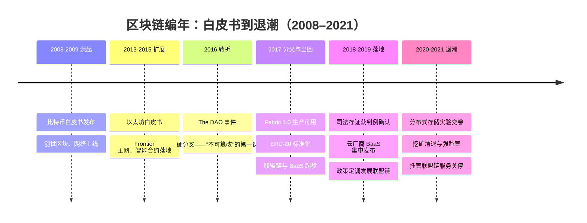
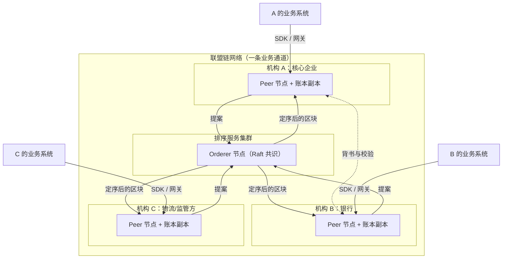

# 区块链时代（约 2017–2019）

> 这是[技术编年史](/chronicle/)的第三浪，也是我个人认为**最有教育意义**的一浪。适合所有正在为"要不要用某项新技术"做决策的人阅读：架构师、技术管理者、以及任何被"趋势"追着跑的工程同学。读完你会带走三样东西：一条从 2008 白皮书到 2021 监管降温的清晰技术时间线；一套"账本 / 共识 / 智能合约"的一次讲透原理；以及一个可以复用到今天的判断框架——**看一项技术是不是刚需，先问"不用它会怎样"**。本篇保持技术中立，只谈工程与架构，不涉任何投资判断。

## 时代的命题

分布式系统的一次"再探索"：当多方互不信任时，如何用技术替代中介。

上一浪（[直播](/chronicle/livestream)与[短视频](/chronicle/short-video)）解决的是"一对多分发"的效率问题，云厂商和工程师都越做越顺。区块链抛出的是一个不同性质的问题：**多对多、且彼此不信任**的协作——银行看不见企业的真实订单，核心企业自证清白成本高昂，版权方拿不出法庭认可的时间戳。"用密码学和网络协议来替代中介背书"这个叙事，恰好击中了 B 端最痛的那根神经。

技术本身在进步，但多数项目死于"用错了锤子"——不是区块链不好，而是太多场景里本不存在"互不信任的多方"，一个中心化数据库加审计日志就够了。这段兴衰是整部编年史里最完整的一次技术周期解剖样本。

## 时代坐标

先交代一个时间口径：全球技术谱系从 2008 年就开始了，但**中国云从业者真正被卷入这波浪潮是 2017–2019**——BaaS 产品集中上线、联盟链 POC 密集交付、监管政策相继落地，所以本编年史以这三年为主窗口，向前追述源流，向后记录退潮（余震一直持续到 2021 年）。

| 层面 | 核心叙事 | 代表事物 |
| --- | --- | --- |
| 公共链（海外热） | 无许可、抗审查的密码经济学实验 | 比特币、以太坊、ERC-20 |
| 技术底座 | 分布式账本 + 共识算法 + 智能合约虚拟机 | PoW、PBFT、Raft、EVM |
| 产业落地（国内热） | 多方协作的"信任工程"：存证、溯源、对账 | Hyperledger Fabric、联盟链、BaaS |

## 关键节点编年

### 2008–2009：一份白皮书与创世区块

*比特币符号。图源：Wikimedia Commons（[来源页](https://commons.wikimedia.org/wiki/File:Bitcoin.svg)，Public domain）*

2008 年 10 月 31 日，化名中本聪的作者向密码学邮件组发布了《比特币：一种点对点的电子现金系统》（bitcoin.org 白皮书 PDF，全文约 2700 词）。今天回看，它的技术贡献可以压缩成三件事：**哈希链式账本**（把"改一条记录"变成"重算所有后续记录"）、**PoW 最长链共识**（用算力和电费给投票加权，作恶成本与收益挂钩）、**经济激励**（区块奖励驱动节点诚实地维护网络）。2009 年 1 月 3 日创世区块诞生，中本聪把当天《泰晤士报》的头条"财政大臣站在第二轮银行救助的边缘"写进了区块的 coinbase 字段——这一手既是**时间戳证明**（区块不可能早于报纸日期存在），也是这份技术文献少有的态度表达。

工程视角的要点：比特币解决的不是"数据库"问题，而是**在没有任何中心可以仲裁"哪条记录是真的"时，让全网收敛到同一份历史**。

### 2013–2015：以太坊与智能合约

*以太坊标志。图源：Wikimedia Commons（[来源页](https://commons.wikimedia.org/wiki/File:Ethereum_Logo.png)，Public domain）*

2013 年底，Vitalik Buterin 发表以太坊白皮书，把比特币的"专用脚本"改造成**通用状态机**：链不再只记账，还能执行图灵完备的程序——智能合约。2015 年 7 月 30 日，以太坊 Frontier 主网上线，"可编程的分布式信任"第一次成为可用的基础设施。这一年我刚开始把"智能合约"当作独立技术方向持续跟踪：它的魅力在于**规则的自动执行不依赖任何一方的善意**——这正是后来所有 B 端"信任叙事"的技术原点。

### 2016：The DAO 事件——"不可篡改"的第一课

2016 年 4 月，一个运行在以太坊上的链上基金 The DAO 上线；6 月，攻击者利用智能合约中**重入漏洞**（合约在完成余额更新前被递归再次调用——本质是经典 TOCTOU 并发问题在链上的重现）持续转出约 360 万枚 ETH。7 月 20 日，社区以硬分叉回滚了这笔交易，拒绝分叉的那条链延续为以太坊经典。**这是教科书级别的一刻**：账本在技术上不可篡改，但治理是人做的——"Code is Law"与"人类可以干预"第一次正面相撞。对工程师的启示是：部署上链的代码没有热修复窗口，合约审计从此成为独立工程学科。

### 2017：分岔路的一年

这一年出现了三条并行的线，决定了后面几年两个市场的分野：

- **扩容与分叉**：比特币社区在"区块该多大"上分裂，年中 SegWit 激活、8 月出现比特币现金分叉。公共链的第一性矛盾暴露：**吞吐、去中心化、安全三者不可兼得**，任何改动都需要全网博弈。
- **企业联盟链就绪**：7 月 11 日，Linux 基金会宣布 Hyperledger Fabric 1.0 生产可用。与公共链的关键差异：成员准入（许可制）、共识可插拔、通道隔离商业隐私。联盟链路线正式从论文走进产品。
- **ERC-20 与第一次应用拥塞**：10 月，可互换通证标准 ERC-20（EIP-20）进入标准轨道；11 月，养猫游戏 CryptoKitties 上线，12 月一个去中心化应用就能把整条以太坊堵到瘫痪。工程出圈了，**性能天花板也出圈了**——这直接催生了此后所有 Layer 2 扩容路线。

同年 9 月 4 日，中国人民银行等七部委发布《关于防范代币发行融资风险的公告》，定性代币发行融资为未经批准的非法公开融资，境内狂热被按下停止键，行业重心从此转向产业应用。

### 2018–2019：存证判例与 BaaS 军备竞赛

- **2018 年 6 月 28 日**，杭州互联网法院在一起侵害作品信息网络传播权纠纷案中，**首次确认区块链电子存证的法律效力**——法院给出了一整套审查框架（存证平台资质、取证方式、上链前数据真实性、技术可靠性）。"哈希上证"从概念变成被司法系统接受的证据形式，这是国内区块链真正跑通的第一个场景。
- **2017 年 11 月腾讯云 TBaaS 发布、2018 年阿里云区块链服务正式发布**；2019 年 4 月 30 日 AWS Managed Blockchain GA、5 月 2 日 Azure Blockchain Service 发布。**BaaS 一度是云厂商产品目录的标配**。
- **2019 年 10 月 24 日**，中央政治局第十八次集体学习以区块链技术发展现状和趋势为主题，定调"把区块链作为核心技术自主创新的重要突破口"，并点名供应链管理等应用方向。联盟链获得政策面背书，各地产业园、BSN 等布局随后展开。

### 2020–2021：实验交卷与退潮

- **2020 年 10 月 15 日**，Filecoin 主网上线——把"分布式存储激励"从融资叙事变成运行中的网络；**2021 年 3 月**，Chia 以"空间与时间证明"上线。这些存储链后来多数没能跑通商业闭环，但留下了大规模存储网络调度与可验证性工程的实验数据（见下文"技术栈记忆"）。
- **2021 年 5 月 21 日**，国务院金融委会议明确"打击比特币挖矿和交易行为"，多省份随即清退挖矿项目；**9 月 24 日**一天之内两份文件落地——发改委等 11 部门《关于整治虚拟货币"挖矿"活动的通知》把挖矿列为淘汰类产业，人民银行等十部门《关于进一步防范和处置虚拟货币交易炒作风险的通知》将虚拟货币相关业务活动整体定性为非法金融活动。**到年底，境内挖矿算力从全球第一到清零。**
- 同样在 **2021 年 9 月 10 日**，微软宣布关停 Azure Blockchain Service——海外第一家托管联盟链服务退场；AWS 的同名产品也转向公共链接入 API。**云厂商的区块链中间件竞赛，先于应用层结束了。**
- 2021 年的 NFT/元宇宙热浪（详见[元宇宙时代](/chronicle/metaverse)）是区块链叙事的最后一次大出圈，也是它让位给下一个主角的交接仪式。
- 时点注脚：截至本篇更新，监管框架仍在演进——2026 年 2 月 6 日，人民银行等八部门发布银发〔2026〕42 号文并废止 237 号文，将虚拟货币及资产代币化相关活动纳入更完整的规制。**"强监管"不是一次事件，而是常态。**

## 技术原理：账本、共识、智能合约各用一句话讲透

做交付这些年，我发现把区块链讲明白只需要三句话，但每句话背后是一个真实的工程权衡。

**第一句：区块链 = 用哈希链把"篡改历史"的成本变成"重算未来"。**

*比特币区块的数据字段示意：Prev_Hash 把区块串成链，Tx_root 指向交易列表的 Merkle 树根。图源：Wikimedia Commons（[来源页](https://commons.wikimedia.org/wiki/File:Bitcoin_Block_Data.svg)，CC BY-SA 3.0）*

每个区块装着一批交易、一个时间戳、上一区块的哈希（Prev_Hash）和交易树的根哈希（Merkle root）。改任何一条历史记录，其所在区块哈希变化 → 后续所有区块的 Prev_Hash 全部对不上 → 攻击者必须独自重算整条后续链并追上全网。"不可篡改"不是绝对承诺，而是**成本承诺**：篡改所需资源必须大于其收益。这正是存证场景（哈希一上链即等于向全网宣告了某数据在某时刻之前存在）的技术依据。

**第二句：共识 = 节点之间在没有裁判时达成同一份历史的规则；选哪种共识，取决于成员是谁。**

| | PoW（公共链） | PBFT（联盟链经典方案，1999） | Raft/Kafka（Fabric 排序服务） |
| --- | --- | --- | --- |
| 成员假设 | 任何人可加入，身份不可信 | 已知成员，少数节点可作恶（拜占庭） | 已知成员，只容忍宕机（CFT） |
| 机制 | 算力解数学题，最长链获胜 | 预准备/准备/提交三阶段投票 | 领导者选举 + 日志复制 |
| 容错 | 算力 <50% 即可安全 | 3f+1 台诚实节点容忍 f 台作恶 | 多数存活 |
| 性能 | TPS 低、出块慢（防分叉靠概率） | 高吞吐、终局确认快 | 接近普通分布式系统 |
| 真实开销 | 电费与硬件 | 消息复杂度 O(n²)，成员数受限 | 依赖多数信任 |

一个常见的传播误区要澄清：**联盟链不"挖矿"**。Hyperledger Fabric 1.0 用 Kafka（崩溃容错），1.4.1 起改用 Raft，后续版本才引入 BFT 系排序服务——共识强度是**按部署的信任假设选的**，不是越强越好。这对应到工程上就是 Fabric 文档反复强调的一点：让共识机制匹配组织间真实存在的信任关系。

**第三句：智能合约 = 存在链上、由所有节点共同执行并共同记账的程序。**

传统软件"部署后规则归运维管"，合约部署后**规则对所有参与方平等生效、无人可单独回滚**。DAO 事件证明了它的代价：一个漏洞没有热修复的机会。所以"合约即法律"在实践中必须配一个工程推论：**上链之前把安全评审当作发布门禁**——这与今天 AI 时代的模型上线前评测如出一辙。

**联盟链长什么样？** 一张典型拓扑：

*Wikimedia Commons 上 Hyperledger 项目条目使用的对等网络示意图：每个机构运行自己的节点，节点之间点对点组网。图源：Wikimedia Commons（[来源页](https://commons.wikimedia.org/wiki/File:Hyperledger_diagram.svg)，CC BY-SA 4.0）*

图里的决策含义：**每个机构自己运行节点、自己持有账本副本**，排序服务只负责"给交易定序"，背书阶段把商业保密留在交易对手之间。所以联盟链的性能瓶颈从来不在"共识算力"，而在**跨机构背书、执行与存储复制的放大倍数**——链上有 N 家机构，同一笔业务就要被执行和存储 N 次，这是"上链成本"的真正来源。

## 落地与退潮的复盘

### 活下来的场景：存证与对账，而不是支付

当年跑通并延续至今的，恰好是最"无聊"的两类：

- **司法存证与版权登记**（2018 年判例开路）：把作品的哈希值上链固定"存在性与时间性"，维权时法院认。这是"哈希上证"的真实需求——数据本身不上链，只上指纹。
- **供应链金融与溯源**：核心企业的应收账款凭证上链，多级供应商凭链上凭证融资——多方对账场景天然符合联盟链模型。我参与过的典型评估里结论也基本如此：**存证 > 支付**，多方记账比对 > 交易清结算。

### 死掉的场景："为链而链"的 POC

数量远超想象。很多需求——单一主体主导的数据共享、可信赖第三方本来存在（政务中心、行业监管方）、性能要求高于每秒千笔——中心化数据库完全够用，却硬被套上链。复盘时我把识别方法压缩成一个问题：**不用区块链技术会怎样？** 如果答案是"也没怎样，最多换个审计日志"，这个项目就注定在 POC 之后没有生产化。

### 技术栈记忆：存储链是"用经济激励组织分布式资源"的大规模实验场

当年的持续跟踪方向还包括存储链：IPFS/Filecoin 用通证激励组织全球闲置存储、Swarm 背靠以太坊生态、Chia 用"空间证明"替代算力竞赛。多数项目没有跑通商业模型，但回看价值不该用成败衡量：它们把**分布式存储的激励设计、复制验证（"你真的替我存了数据吗"——可证明存储）、资源调度与容错**这些工程问题，在真实世界、真金白银的对抗环境里大规模演练了一遍——其工程经验与今天的算力网络、模型分发遥相呼应。

### 兴衰逻辑（三段式）

- **为什么兴起**：比特币的公开市场热度让技术出圈，"用技术替代中介建立信任"的叙事精准契合 B 端痛点；恰逢云计算把"信任基础设施"做成了产品能力，两者一拍即合。
- **留下了什么**：分布式一致性工程的全面普及（见下节）；可验证性与存证类产品的真实市场——这两个词后来成了 AI 时代审计需求的先声。
- **为什么让位**：金融属性场景迎来强监管（2017 与 2021 两轮文件奠定框架，2026 年仍在收紧），投机资金退潮；B 端客户从"要故事"转向"要可验证的 ROI"——需求侧成熟比监管更能终结一场技术热。

## 对云架构的影响：BaaS 与澄清误用

### BaaS：一次中间件托管的预演

BaaS（区块链即服务）在 2017–2019 年成为云厂商标配：一键部署联盟网络、托管节点、证书治理、监控运维。**剥开概念，BaaS 的技术内核是云厂商最熟悉的三件套**：容器/虚机编排（Peer 与 Orderer 节点）+ VPC 组网 + PKI 证书体系（MSP/CA）。真正难的从来不是区块链协议，而是**多机构信任根下的证书轮转与生命周期管理**——联盟成员进出一次，证书链治理就复杂十倍。这也是海外托管服务（Azure 2021 年关停、AWS 转向）率先退场的原因之一：多机构网络的运维责任太重，SaaS 化交付不划算；而国内政务/产业联盟链由强约束方牵头，BaaS 作为 PaaS 活了下来。

### 三个必须澄清的"误用"

这波热潮给云行业留下了一些至今仍在传播的混淆，值得逐条澄清：

1. **区块链 ≠ 需要 GPU。** 当时的"算力"是 PoW 挖矿用的 ASIC 专用机，不跑在通用云上、更不是图形加速负载。云厂商当年为区块链客户开的单子，主力是普通虚机 + 网络 + PaaS。GPU 作为云的主角要等到[元宇宙](/chronicle/metaverse)与[AI 大模型](/chronicle/ai-era)两浪（方法参见 [GPU 选型与推理成本测算](/ai/infra/inference/gpu-sizing)——真正的 GPU 大客户在后来）。
2. **链上存不下大文件。** 区块空间极其昂贵（共识放大 + 永久复制），所以行业从第一天起就走"链上存证 + 链下存储"的混合架构：原始文件进对象存储，哈希与元数据上链。这是这波技术留给云存储产品最实在的架构模式。
3. **区块链不是数据库。** 多方对账 + 无单一可信方时它不可替代；其余八成场景，一个带权限、备份和审计日志的中心化数据库更好、更快、更便宜。

### 判断"要不要用链"的检查表

| 检查项 | 倾向用链 | 倾向传统架构 |
| --- | --- | --- |
| 参与方 | ≥3 家互不信任的机构 | 单一主体或存在可信第三方 |
| 数据可见性 | 需要多方共账、防篡改审计 | 内部读写为主 |
| 核心动作 | 存证、对账、溯源 | 查询、报表、事务 |
| 性能预期 | 接受秒级终局确认 | 毫秒级响应、高并发 |
| 长期约束 | 需要"事后无法抵赖"的证据链 | 日志可覆盖 |

### 留给云工程师的真正遗产

这浪退潮后，云基础设施吸收的技术资产比表面看起来多得多：**共识算法从论文走进工程词汇表**（Raft/Paxos 从此是中间件面试与评审标配，etcd 一类的强一致组件被广泛理解）；**证书/互信治理**（多租户 PKI）能力沉淀进云安全产品；"可验证的共享账本"理念则直接预演了今天 AI 时代对**数据溯源与审计**的需求——模型训练数据从哪来、能不能被验证，问的和当年是同一个问题。

## 一线回望

以云架构师的身份回看这三年，我的判断是：**区块链的技术命题是真问题，工程答卷有一半是真答案，商业叙事的大部分是泡沫**——而有趣的是，三者各自独立演化。真问题（多方互不信任如何协作）至今仍在，所以联盟链活着；真答案（共识工程、混合存证架构）被云吸收，所以这浪"没白交学费"。

如果只让我留一条经验给正在经历 AI 热浪的同行：把 2017–2019 年当作"技术泡沫识别框架"的训练数据——

1. **问"不用它会怎样"**：答不出代价的场景，热度归零后不会有生产化。
2. **区分资产与叙事**：泡沫的是商业模式，沉淀的是技术资产；看热度归零后基础设施还有没有人付钱（这条总纲在[编年史总览](/chronicle/)里反复出现，因为它是六浪共用的检验尺）。
3. **警惕"性能换概念"**：当一项技术的核心卖点恰好是它的短板来源（共识放大 vs 去中心化信任），落地方案一定是混合架构，而不是"等技术变快"。

潮水退去后，留下的都进了基础设施。而下一个付钱用基础设施的故事，见[AI 大模型时代](/chronicle/ai-era)。

## 站内相关

- [十年六浪：技术编年史总纲](/chronicle/) —— 本篇在六浪周期中的位置与跨浪规律
- [短视频时代](/chronicle/short-video)（第二浪并行侧翼）与 [元宇宙时代](/chronicle/metaverse)（第四浪，2021 年与 NFT 叙事合流）
- [AI 大模型时代](/chronicle/ai-era) —— 可验证性、审计需求被重新激活的地方
- [上云迁移方法论](/methodology/cloud-migration) —— "为链而链"的 POC 们，很多本该先用 6R 方法把中心化的版本做好

## 参考资料

<Refs>

### 文字来源（访问日期：2026-09-02）

1. Satoshi Nakamoto. *比特币：一种点对点的电子现金系统*. bitcoin.org（2008-10-31 白皮书原文 PDF）. <https://bitcoin.org/bitcoin.pdf>
2. Wikipedia. *History of Bitcoin*. <https://en.wikipedia.org/wiki/History_of_Bitcoin>
3. Ethereum.org. *Ethereum Whitepaper* / *Fork History*. <https://ethereum.org/whitepaper/> ; <https://ethereum.org/ethereum-forks/>
4. Wikipedia. *Ethereum*（2013 年底白皮书、Frontier 2015-07-30、2017 CryptoKitties 拥塞、2022 The Merge）. <https://en.wikipedia.org/wiki/Ethereum>
5. Wikipedia. *The DAO*. <https://en.wikipedia.org/wiki/The_DAO_(decentralized_autonomous_organization)>
6. Consensys. *A Short History of Ethereum*. <https://consensys.io/blog/a-short-history-of-ethereum>
7. Linux Foundation. *Hyperledger Announces Production-Ready Hyperledger Fabric 1.0*（2017-07-11）. <https://www.linuxfoundation.org/press/press-release/hyperledger-announces-production-ready-hyperledger-fabric-1-0>
8. Hyperledger Fabric 文档. *What is Fabric?* / *The Ordering Service*. <https://hyperledger-fabric.readthedocs.io/en/release-2.5/whatis.html> ; <https://hyperledger-fabric.readthedocs.io/en/latest/orderer/ordering_service.html>
9. Castro & Liskov. *Practical Byzantine Fault Tolerance*（1999）. 概览见 <https://en.wikipedia.org/wiki/Practical_Byzantine_fault_tolerance>
10. ethereum/EIPs. *EIP-20: ERC-20 Token Standard*（2017）. <https://eips.ethereum.org/EIPS/eip-20>
11. 中国人民银行等七部门. 《关于防范代币发行融资风险的公告》（2017-09-04，全文见维基文库转载）. <https://zh.wikisource.org/wiki/%E5%85%B3%E4%BA%8E%E9%98%B2%E8%8C%83%E4%BB%A3%E5%B8%81%E5%8F%91%E8%A1%8C%E8%9E%8D%E8%B5%84%E9%A3%8E%E9%99%A9%E7%9A%84%E5%85%AC%E5%91%8A>
12. 最高人民法院官网. 《杭州互联网法院首次确认区块链电子存证法律效力》（2018-06-28）. <https://www.court.gov.cn/zixun/xiangqing/104552.html>
13. 共产党员网（央视快评）. 《把区块链作为核心技术自主创新重要突破口》（2019-10-24 政治局第十八次集体学习）. <https://www.12371.cn/2019-10-28/ARTI1572228073793649.shtml>
14. 国家发展改革委. 《关于整治虚拟货币"挖矿"活动的通知》（发改运行〔2021〕1283 号，2021-09-24 公布）. <https://www.ndrc.gov.cn/xxgk/zcfb/tz/202109/t20210924_1297474.html>
15. 中新网. 《虚拟货币整治升级：清退挖矿与禁止相关业务双管齐下》（含十部门银发〔2021〕237 号要点，2021-09-26）. <https://www.chinanews.com/cj/2021/09-26/9573863.shtml>
16. Amazon. *AWS Announces General Availability of Amazon Managed Blockchain*（2019-04-30）. <https://press.aboutamazon.com/2019/4/aws-announces-general-availability-of-amazon-managed-blockchain>
17. Microsoft Azure Blog. *Digitizing trust: Azure Blockchain Service simplifies blockchain development*（2019-05-02）；Data Center Dynamics. *Microsoft to shut down Azure Blockchain Service*. <https://azure.microsoft.com/en-us/blog/digitizing-trust-azure-blockchain-service-simplifies-blockchain-development/> ; <https://www.datacenterdynamics.com/en/news/microsoft-to-shut-down-azure-blockchain-service/>
18. 中国新闻网. 《腾讯云区块链 TBaaS 白皮书发布》（2018-04，产品 2017-11 发布）；阿里云文档. 《区块链服务 BaaS 介绍》. <https://www.chinanews.com.cn/m/business/2018/04-11/8488214.shtml> ; <https://help.aliyun.com/zh/document_detail/85263.html>
19. Protocol Labs / Filecoin. *Filecoin Mainnet is Live*（2020-10-15）；Chia Network 官方文档（2021-03 主网，空间与时间证明）. <https://filecoin.io/blog/filecoin-mainnet-is-live> ; <https://docs.chia.net/chia-blockchain/introduction/>
20. 中国人民银行等八部门. 《关于进一步防范和处置虚拟货币等相关风险的通知》（银发〔2026〕42 号，2026-02-06 发布，同时废止 237 号文）. <https://www.pbc.gov.cn/tiaofasi/144941/3581332/2026020619591971323/index.html>

### 图片来源（访问日期：2026-09-02，均为 Wikimedia Commons 自由版权）

1. 比特币符号 — *File:Bitcoin.svg*（Public domain）. <https://commons.wikimedia.org/wiki/File:Bitcoin.svg>
2. 以太坊标志 — *File:Ethereum Logo.png*（Public domain）. <https://commons.wikimedia.org/wiki/File:Ethereum_Logo.png>
3. 比特币区块数据字段示意 — *File:Bitcoin Block Data.svg*（CC BY-SA 3.0）. <https://commons.wikimedia.org/wiki/File:Bitcoin_Block_Data.svg>
4. Hyperledger 对等网络示意 — *File:Hyperledger diagram.svg*（CC BY-SA 4.0）. <https://commons.wikimedia.org/wiki/File:Hyperledger_diagram.svg>

</Refs>