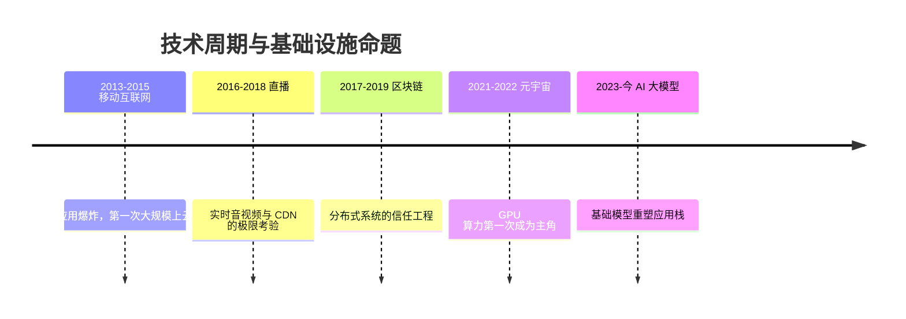

# 十年五浪：从移动互联网到 AI 大模型

> 入行十余年，我恰好完整地站在了五浪技术周期的浪头上：移动互联网、直播、区块链、元宇宙、AI 大模型。作为解决方案架构师，我的视角不是媒体式的"风口叙事"，而是一线交付视角：**每一浪里，客户真正在解什么题，技术栈如何响应，以及潮水退去后留下了什么**。这是本编年史的总纲。

## 五浪总览

| 周期 | 核心命题 | 基础设施关键词 | 成本主项 |
| --- | --- | --- | --- |
| 移动互联网 | 业务增速超过机房扩容速度 | ECS、弹性伸缩 | 计算 |
| 直播 | 实时 + 海量 + 便宜 | CDN、转码、带宽调度 | 带宽 |
| 区块链 | 多方互不信任如何协作 | 联盟链、BaaS、存证 | 共识开销 |
| 元宇宙 | 实时 3D 渲染如何普惠 | GPU 云、云渲染、边缘 | 显卡 |
| AI 大模型 | 智能如何工程化 | GPU 集群、推理服务 | 算力 / token |

## 三个跨越周期的规律

### 规律一：每一浪的起点，都是基础设施跟不上业务

移动互联网是机房扩容跟不上 App 增速；直播是带宽供给跟不上房间数；大模型是算力供给跟不上调用量。**技术周期不是从技术突破开始的，而是从"供需缺口"开始的**。这解释了为什么每一浪的早期红利都在基础设施层——卖铲子的先赚钱，这个规律从未失效。

### 规律二：成本主项的迁移，决定了架构师的技能树

每一浪都有一个"成本吞噬者"：计算 → 带宽 → 显卡 → token。架构师的核心工作也随之迁移：

- 移动互联网时代练的是**容量规划**（大促压测、弹性伸缩）
- 直播时代练的是**成本工程**（带宽采购、转码档位、调度复用）
- 大模型时代练的是**性价比工程**（量化、路由、缓存、模型分级）

技能在变，方法没变：**把最贵的资源用出最高的单位价值**。这也是为什么跨周期的老兵比追新的新手更有优势——底层方法论是可迁移的。

### 规律三：泡沫退潮后，留下的都是基础设施

区块链热退去，留下了分布式一致性工程与"存证"这类真实产品；元宇宙热退去，留下了 GPU 供给链、云渲染与三维内容管线——**而这些恰恰是 AI 大模型时代的物资基础**。没有元宇宙攒下的 GPU 调度经验，大模型训练集群的扩张会更艰难。

识别泡沫与识别价值是两回事：泡沫的是"商业模式"，沉淀的是"技术资产"。看一浪技术会不会留下东西，只问一个问题：**当叙事热度归零，它造出的基础设施还有没有人付钱用？**

## 一个亲历者的观察：周期在加速

五浪的间隔肉眼可见地缩短：移动互联网领跑了近十年，直播与区块链各领风骚三四年，元宇宙只有约两年，而大模型从爆发到重塑应用栈只用了不到三年。

加速的原因不神秘：**每一浪都站在上一浪的基础设施上**。直播复用移动互联网的云；区块链复用云与分布式工程；元宇宙复用 CDN 与 GPU 云；大模型复用前面所有——算力、网络、数据平台、DevOps 全部现成。创新的基础设施越完备，下一浪的起浪速度越快。

对从业者的启示：**不要赌某一浪永远不退潮，要赌"基础设施沉淀"这个不变量**。

## 各时代详解

- [移动互联网时代](/chronicle/mobile-internet)（约 2013–2015）：上云从选择题变成必答题
- [直播时代](/chronicle/livestream)（约 2016–2018）：带宽即成本，实时即体验
- [区块链时代](/chronicle/blockchain)（约 2017–2019）：最有教育意义的一浪
- [元宇宙时代](/chronicle/metaverse)（约 2021–2022）：AI 时代的前传
- [AI 大模型时代](/chronicle/ai-era)（2023–今）：正在发生的历史

## 写在最后

常有人问：下一浪是什么？我的回答是：**下一浪的形态猜不准，但它出现的方式永远有迹可循**——某个资源的供需缺口被拉大，基础设施层开始聚集工程师和资本，应用层在两年后爆发。

比起预测，我更愿意持续记录。这个编年史系列会随着每一浪的演进继续更新——毕竟，第五浪还远没有到写结语的时候。
