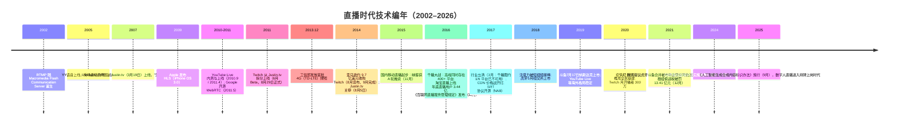
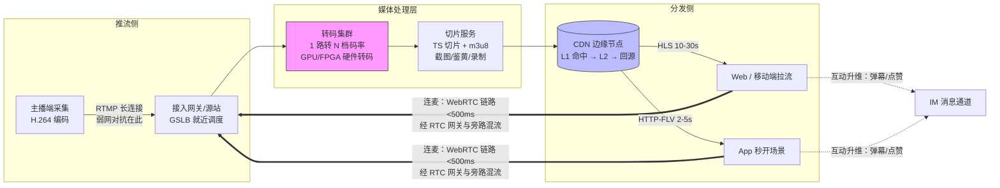
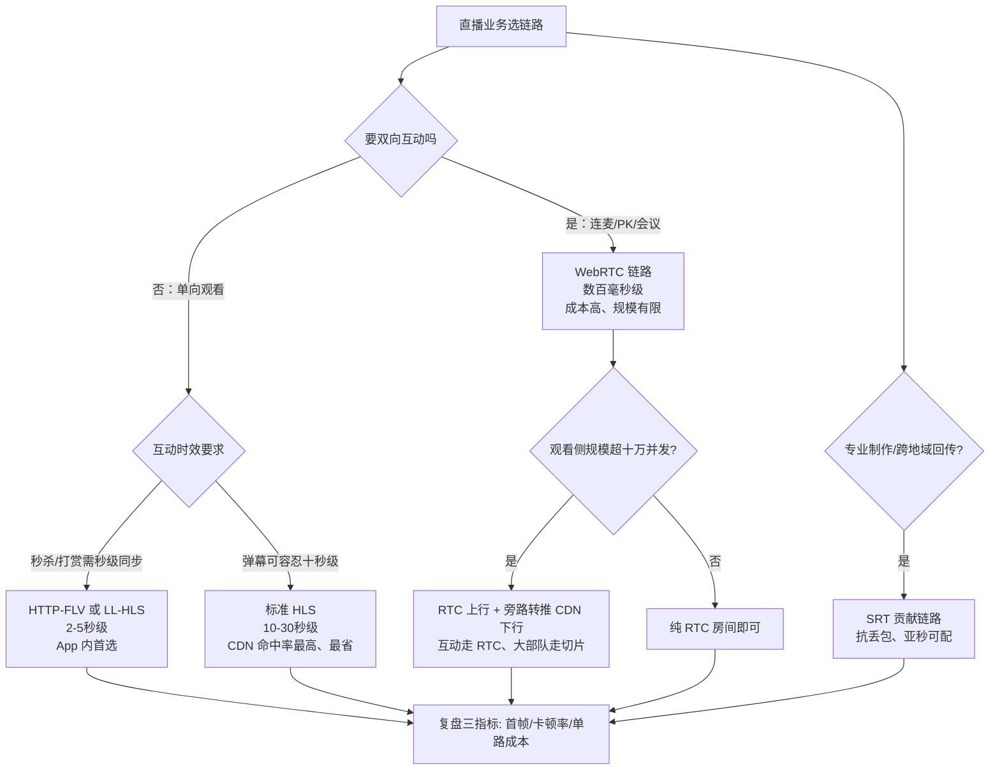

# 直播时代（约 2016–2018）

> 这是[技术编年史](/chronicle/)的第二浪。写给两类人：经历过那几年、想把它放回技术史坐标系里的同行；以及今天正在为大模型算推理成本、想理解"成本结构决定商业模式"这句话从哪来的后来者。读完你会得到一条清晰的主线——**直播不是内容行业的胜利，而是音视频技术栈与云基础设施的一次极限压力测试**，它把 CDN、转码、实时传输这些原本藏在幕后的工程细节，推成了整个行业竞争的核心变量。这一篇还补全了这条浪的"下半场"：直播电商与监管三部曲如何把"千播大战"的遗产变成万亿规模的渠道生意，以及 RTC 技术栈如何在 2020 年之后二次工业化。叙事加数据双轮，全部数字可溯源。

## 时代的命题

"千播大战"把实时音视频推上主舞台。移动互联网那一浪教会行业"扛住流量"，直播则把命题升级为"**扛住流量，且要实时、要便宜**"——这三者构成一个不可能三角，而拆三角的工具，恰好只有云能给。于是技术栈的重心从计算挪到了网络与媒体处理：**CDN、转码、弱网对抗成为核心竞争力**。

作为一名当时在给直播平台做架构咨询的云架构师，我最深的体感是：那是十年里第一次，客户的架构图上"带宽"比"服务器"贵。

## 时代坐标

把镜头拉远，直播的爆发是三件事在 2013–2016 年完成对齐的结果：

- **网络**：2013 年 12 月 4 日，工信部向三大运营商发放首批 TD-LTE 4G 牌照（[纽约时报中文网](https://cn.nytimes.com/technology/20131204/tc04mobile/)、[人民网·民生周刊](https://paper.people.com.cn/mszk/html/2013-12/09/content_1361585.htm)），随后流量资费逐年下探——"用手机看直播"从概念变成账单可负担的日常。这一浪的母体是[移动互联网时代](/chronicle/mobile-internet)：没有 4G 用户一年净增到 3.86 亿的基本盘，直播平台连冷启动的观众都凑不齐
- **技术栈**：推流协议、切片分发、自适应码率在 2009–2014 年间成熟成标准件（下节展开），创业公司第一次可以"组装"一个直播平台
- **示范效应**：2014 年 8 月，亚马逊宣布以约 **9.7 亿美元现金**收购 Twitch（亚马逊官方口径约 $970 million，中文报道中流传的"9.75 亿"即此量级；见 [Amazon 官方新闻稿](https://press.aboutamazon.com/2014/8/amazon-com-to-acquire-twitch)、[BBC](https://www.bbc.com/news/technology-28930781)）——这是当时亚马逊历史上最大的收购，资本市场第一次给"直播"标出天价

三股力汇合的刻度，是 CNNIC 第 39 次《中国互联网络发展状况统计报告》里那组数字：**截至 2016 年 12 月，中国网络直播用户规模 3.44 亿，占网民整体的 47.1%**（[报告专题页](https://www.cac.gov.cn/cnnic39/index.htm)、[第一财经](https://www.yicai.com/news/5211622.html)）——将近一半的中国网民看过直播。

这条曲线后来走了多远？CNNIC 第 55 次报告给出的最新序列（访问日期 2026-09-05）：

| 数据截至 | 网络直播用户规模 | 占网民整体 | 备注 |
| --- | --- | --- | --- |
| 2016-12 | 3.44 亿 | 47.1% | 第 39 次报告，千播大战当年 |
| 2020-12 | 6.17 亿 | 62.4% | 疫情年，直播电商与视频会议双击 |
| 2021-12 | 7.03 亿 | 68.2% | 增速最快的一年 |
| 2022-12 | 7.51 亿 | 70.3% | 监管三部曲落地期 |
| 2023-12 | 8.16 亿 | 74.7% | 直播电商常态化 |
| 2024-12 | 8.33 亿 | 75.2% | 第 55 次报告，同比 +1737 万、增速放缓至 2.1% |

**这张表就是"浪潮退去、能力常驻"的定量表达**：用户还在缓慢爬升，但增速从两位数掉到 2%——直播作为"独立风口"结束了，作为"基础设施级能力"（电商标配、政务标配、教育标配）永久留下了。

## 前传：秀场直播的中国源流

千播大战不是中国直播的起点，而是第二幕。第一幕早在 2005 年就开演了：欢聚时代推出 YY 语音，从网游公会语音聊天起家，长出了"秀场"形态——主播表演、观众打赏、公会抽成的三方结构，把"情绪价值变现"第一次做成了规模化生意（中文维基百科"YY直播"词条：YY 语音 2005 年上线，后拆分出 YY 直播与虎牙直播；欢聚时代以 NASDAQ:YY 为代码上市，2020 年 11 月百度宣布收购 YY 直播业务）。

这一脉留给行业的三样东西，比平台本身长寿：

- **打赏经济模型**：虚拟礼物 → 主播分成 → 公会经纪，这套资金流后来被游戏直播、电商直播（坑位费 + 佣金）逐一继承改造
- **高并发长连接的工程积累**：秀场的"万人房间 + 实时礼物特效"是国内最早被亿级消息洪峰检验的场景之一，弹幕/礼物系统的扩散模型（合并写、分级广播）沿用至今
- **主播职业化**：从YY时代的公会到后来的 MCN，"主播是一门有供应链的职业"这个认知，为 2016 年之后的电商直播备好了人才池

我的判断：美国线（Justin.tv → Twitch）证明的是"直播有观众"，中国线（YY → 9158 → 映客 → 千播）证明的是"直播能挣钱"。两条线在 2016 年合流成完整的商业叙事，资本才敢把 400 家平台同时推上牌桌。

## 关键节点编年

*Justin.tv：把摄像头 24 小时对着自己生活的"人生直播"，是所有平台化直播的原点。图源：Wikimedia Commons（[来源页](https://commons.wikimedia.org/wiki/File:Justin.tv_-_Justin_Kan_and_Irina_Slutsky.jpg)），CC BY 2.0*

编年表（口径均见参考资料，访问日期 2026-09-05）：

| 时间 | 节点 | 公开数据口径 | 行业含义 |
| --- | --- | --- | --- |
| 2002 | RTMP 协议诞生 | 随 Flash Communication Server 发布（Wikipedia） | 推流侧事实标准的起点 |
| 2005 | YY 语音上线 | 欢聚时代出品，后拆出 YY 直播与虎牙（中文维基"YY直播"词条） | 中国秀场直播的前史 |
| 2007-03 | Ustream、Justin.tv 上线 | SoftBank 新闻稿 / Wikipedia | "人人可直播"的第一次证明 |
| 2009 | Apple 发布 HLS | iPhone OS 3.0（Apple 文档） | 拉流侧"像下载"的胜利 |
| 2011-05 | Google 开源 WebRTC | W3C 邮件列表存档 | 连麦互动的技术种子 |
| 2011-06/08 | Twitch 从 Justin.tv 拆分 | Wikipedia: Twitch | 垂直品类 + 弹幕社区的原型 |
| 2014-08/09 | 亚马逊 9.7 亿美元收购 Twitch | Amazon 官方新闻稿 | 资本第一次给直播标天价 |
| 2014-11 | 虎牙从 YY 更名并独立运营 | 中文维基"虎牙直播"词条 | 游戏直播在中国专业化 |
| 2016 | 淘宝直播上线；千播大战；《互联网直播服务管理规定》发布 | 薇娅 2016 年成为淘宝直播主播（中文维基"薇娅"词条）；网信办规定全文 | 电商直播与监管同时开场 |
| 2018-05 | 虎牙纽交所上市（HUYA） | 中文维基"虎牙直播"词条 | 中国游戏直播第一股 |
| 2019-07-17 | 斗鱼纳斯达克上市（DOYU） | 中文维基"斗鱼TV"词条 | 游戏直播双雄格局定型 |
| 2020-04 | 腾讯成为虎牙最大股东（投票权 50.1%） | 中文维基"虎牙直播"词条 | 平台整合序幕 |
| 2021-07 | 市场监管总局依法禁止虎牙斗鱼合并 | 中文维基"虎牙直播""斗鱼TV"词条 | 平台经济反垄断标志性案例 |
| 2021-12 | 薇娅偷逃税被追缴并处罚款共 13.41 亿元 | 杭州市税务局稽查局通报，中文维基"薇娅"词条 | 直播电商税务合规分水岭 |
| 2024-07-01 | 《消费者权益保护法实施条例》施行 | 国务院令第 778 号（中国政府网） | 直播带货必须"亮身份"、平台负协助维权责任 |
| 2025-09-01 | 《人工智能生成合成内容标识办法》施行 | 国信办通字〔2025〕2 号（中国政府网） | 数字人直播/AI 内容的强制标识时代 |

几个容易被忽略、但对理解全篇很关键的节点：

- **2007 年 3 月**：Ustream 与 Justin.tv 几乎同时上线（[SoftBank 新闻稿](https://group.softbank/news/press/20100202)记载 Ustream 于 2007 年 3月开始事业，[Wikipedia: Justin.tv](https://en.wikipedia.org/wiki/Justin.tv)记载 Justin.tv 上线于 2007 年 3 月 19 日）。这一代平台的架构还是"Flash 推拉一体的玩具"，但证明了普通人对着摄像头这件事有观众
- **2011 年 6–8 月**：Justin.tv 把游戏频道拆分为独立品牌 **Twitch**（6 月 Beta，8 月 29 日正式上线，[Wikipedia: Twitch](https://en.wikipedia.org/wiki/Twitch_(service))）——垂直品类跑通了"高频开播 + 弹幕社区"的模式，这是后来所有直播平台产品形态的原型
- **2014 年**：Twitch 被收购的同一月，Justin.tv 本体于 2014 年 8 月关停（[Wikipedia: Justin.tv](https://en.wikipedia.org/wiki/Justin.tv)，[Wikipedia: Twitch](https://en.wikipedia.org/wiki/Twitch_(service)) 亦记载 "Justin.tv was getting shut down in August 2014"）；Ustream 则在前一年 1 月被 IBM 收编、后并入 IBM Cloud Video（[日经中文网报道](https://www.nikkei.com/article/DGXLASDZ05HGL_V00C17A4TI1000/)）——第一代先驱全部退场，技术管线被行业继承
- **2016 年 11 月 4 日**：国家网信办发布《互联网直播服务管理规定》（12 月 1 日施行，[官网全文](https://www.cac.gov.cn/2016-11/04/c_1119847629.htm)），叠加此前文化部门的整治（2016 年 7 月曾公示查处 26 家平台，[光明文摘报](https://epaper.gmw.cn/wzb/html/2016-07/19/nw.D110000wzb_20160719_6-02.htm)），野蛮生长的窗口开始关闭
- **2017 年 3 月**：那张著名的"千播大战"平台全景图里，已有近 1/6 的 App 无法登录、无更新或下架（[每日经济新闻](https://www.nbd.com.cn/articles/2017-03-08/1082818.html)）——出清比大多数人预期的来得快

*Twitch：被亚马逊以约 9.7 亿美元收购时，它是直播商业模式最有力的公开背书。图源：Wikimedia Commons（[来源页](https://commons.wikimedia.org/wiki/File:Twitch_logo_2019.svg)），公有领域*

## 游戏直播样本：Twitch 的荣光、成本与退场

要看清"带宽即成本"这条铁律，Twitch 是最好的公开样本（数据均见英文维基百科 Twitch 词条，访问日期 2026-09-05）：

- **规模曲线**：2013 年 10 月单月独立观众 4500 万；**2014 年 2 月，Twitch 已是全美第四大互联网峰值流量来源**（前三名是 Netflix、Google、Amazon）——一家直播公司的带宽消耗排进了国家级前四，这个事实本身就是"直播是带宽生意"的最强注脚
- **收购逻辑**：2014 年 5 月 Google/YouTube 一度接近以约 10 亿美元收购，因反垄断顾虑退出；8 月 25 日亚马逊以 9.7 亿美元全现金接手，9 月 25 日交割。Twitch CEO 公开承认亚马逊云（AWS）是交易的吸引力之一——**直播平台的尽头是基础设施公司**，这笔收购提前十年验证了这个判断
- **巅峰刻度**：2015 年月观众破 1 亿；2020 年 2 月月开播者 300 万、日活 1500 万、平均同时在线 140 万；2025 年 1 月仍是全球第 30 大网站
- **退场样本**：2023 年底，Twitch 宣布因韩国网络费用政策（运营商向内容平台收取高额网络接入费）成本不可承受，将于 2024 年退出韩国市场——**连全球最大游戏直播平台都会被带宽账单逼退一个市场**，这是给所有做实时分发业务的团队上的成本课

*图源：Wikimedia Commons（[来源页](https://commons.wikimedia.org/wiki/File:TwitchCon_2016.jpg)，CC BY-SA 2.0，摄影 porcupiny）*

中国的对应叙事是虎牙与斗鱼：2018-05 虎牙纽交所上市（中国游戏直播第一股）、2019-07 斗鱼纳斯达克上市；2020 年腾讯先后增持虎牙至投票权 50.1% 并提议虎牙斗鱼换股合并；**2021 年 7 月，市场监管总局依据《反垄断法》与《经营者集中审查暂行规定》禁止该合并**（中文维基百科"虎牙直播""斗鱼TV"词条）——这是平台经济反垄断的标志性案例之一。我的判断：如果合并成行，游戏直播会提前进入"效率整合"阶段；监管叫停客观上保住了双雄竞争的供给多样性，也把"平台合并 = 终局"的想象打了个问号——这个问题在今天的短视频与电商竞争里仍在回响。

## 技术驱动：编码、协议与分发

### 推拉流协议：一条从"私有长连接"到"HTTP 切片"再到"RTC"的主线

今天回看，直播的协议史就是延迟与规模互相让步的历史：

| 协议 | 诞生/标准化 | 链路角色 | 典型延迟（工程经验量级） | 关键性质 |
| --- | --- | --- | --- | --- |
| RTMP | 2002 年随 Macromedia Flash Communication Server 出现，2005 年归 Adobe，2012 年才公开规范 | 长期是**推流**事实标准 | 1–3 秒（拉流） | TCP 长连接，绑定 Flash 生态 |
| HLS | 2009 年随 iPhone OS 3.0 发布（2009 年 5 月即有 IETF 草案），2017 年 8 月标准化为 RFC 8216 | **拉流**主流（移动端） | 默认档位约 10–30 秒，LL-HLS 可压到 2–3 秒 | 纯 HTTP 切片，CDN 天然友好，自适应码率 |
| HTTP-FLV | 国内业界 2014 年前后普及（流式 FLV over HTTP） | 拉流（Web 播放器 + App） | 2–5 秒 | 比 HLS 更省切片开销，延迟更低 |
| SRT | 2012 年前后由 Haivision 开发，2013 年 IBC 首展，**2017 年 NAB 开源**（Mozilla 公共许可），SRT 联盟由 Haivision 与 Wowza 发起 | **专业回传/贡献链路** | 亚秒级可配 | UDP 上的可靠传输，抗丢包，广电级远距离回传首选（[Wikipedia: SRT](https://en.wikipedia.org/wiki/Secure_Reliable_Transport)） |
| WebRTC | 2011 年 5 月 Google 开源，2021 年 1 月 26 日成为 W3C 推荐标准 | **连麦/互动** | 亚秒级（数百毫秒） | UDP/SRTP，为通信而非分发设计，1 对 1 强、1 对 N 弱 |

关键时间锚点的出处：RTMP 史见 [Wikipedia: RTMP](https://en.wikipedia.org/wiki/Real-Time_Messaging_Protocol) 与 [Castr 的协议史](https://castr.com/blog/history-of-rtmp-protocol/)；HLS 见 [Wikipedia: HTTP Live Streaming](https://en.wikipedia.org/wiki/HTTP_Live_Streaming)、[Apple 官方文档](https://developer.apple.com/documentation/http-live-streaming) 与 [RFC 8216](https://www.rfc-editor.org/info/rfc8216/)；WebRTC 见 [W3C 推荐标准新闻稿（中文）](https://www.w3.org/2021/01/pressrelease-webrtc-rec.html.zh)。

一个反直觉但重要的判断：**HLS 赢了协议战争，靠的不是它更快，而是它"最像下载"**。把视频切成小 TS 文件再用普通 HTTP 分发，等于把直播流量伪装成网页流量——任何 CDN、任何缓存、任何运营商中间设备都能伺候它。Flash 于 2020 年底退役后 RTMP 作为播放协议消亡、作为推流协议又活了十年（[Servers.com：协议演进阶梯](https://www.servers.com/blog/from-rtmp-to-mrv2-the-history-of-streaming-protocols)、[Wink：Why HLS Won](https://www.wink.co/documentation/The-Streaming-Protocol-Wars-Why-HLS-Won)），本质都是这个逻辑：**分发端向 HTTP 妥协，采集端保留低开销长连接**。

*WebRTC：2011 年由 Google 开源、2021 年成为 W3C 推荐标准；它的产业级大规模工程化，是被直播连麦与 2020 年的视频会议逼出来的。图源：Wikimedia Commons（[来源页](https://commons.wikimedia.org/wiki/File:WebRTC_Logo.svg)），BSD 许可，WebRTC project authors*

### 一条链路看懂直播架构

注意决策含义：**同一个直播间往往同时存在三档延迟**。普通观众走 HLS 拿"稳"，粉丝 App 内走 FLV 拿"快"，连麦嘉宾走 WebRTC 拿"实时"——架构师的工作就是在观众面前把这三条链路缝合起来（旁路转推、音视频同步），而不是幻想一条链路通吃。

把"什么场景用什么链路"压成一张选型决策图（延迟与成本量级为行业经验值，随厂商与线路浮动）：

### 编码与转码

直播时代 H.264 一家独大（硬件解码普及是前提）。真正的成本杠杆在**转码档位**：一路 1080p 推流要转成 1080p/720p/480p/360p 多档供自适应切换，头部平台的转码集群规模按"路"计。正是在这一浪，**GPU/FPGA 硬件转码第一次被认真算账**——软编 x264 便宜但费 CPU、硬件转码贵但单位路数成本低，这个账算得好坏直接决定毛利。这套方法论今天被原样搬进了视频云和直播电商，再往后，它的精神继承者就是今天推理集群的量化与批处理（见 [LLM 推理](/ai/infra/inference/llm-inference)）。

*2010 年代初一场活动直播的推流与编码器现场——今天这些机柜的职能大多被云上的媒体处理服务取代了。图源：Wikimedia Commons（[来源页](https://commons.wikimedia.org/wiki/File:Eddie_Codel_runs_the_Ustream_feed_and_encoders_at_Leweb.jpg)），CC BY 2.0*

### 弹幕与礼物消息：互动层的分布式小课题

"看"与"玩"的分水岭是弹幕。这条产品线的源流是日本 Niconico 动画的评论弹幕，经 AcFun、bilibili 引入国内社区，再被直播平台改造成"万人房间实时互动"。别小看弹幕，它是很多团队第一次遇到的**大规模消息扩散问题**：

- 房间消息量与在线人数平方级相关（人人都可能发、人人都要收），头部房间峰值消息量轻松过万条/秒
- 工程解法是分级广播：普通弹幕做合并下发（打包 + 抽样丢弃，观众感知不到少了几条）、礼物与系统消息走强一致通道、进场特效按用户等级限频
- 这套"允许有损的扩散"思路，后来在点赞风暴（短视频）、红包雨（IM）、协同编辑（文档）里反复出现

我的经验边界：弹幕系统的难点从来不是吞吐，而是**产品对"有损"的容忍度设计**——丢什么、丢多少、对谁丢，是产品经理和架构师要一起签字的决策。这也是互动类基础设施的通用规律：技术方案的上限由产品语义决定，不由集群规模决定。

### 弱网对抗：这一浪最"脏活累活"的技术

移动直播与演播室直播的本质区别，是采集端永远处在劣质网络里——电梯、地铁、农村基站边缘。千播大战真正拉开体验差距的不是画质，而是"卡不卡"。行业沉淀出的端侧三板斧（工程经验量级，各厂商实现有别）：

- **动态码率（ABR 上行版）**：编码器实时探测可用带宽，秒级下调码率保流畅，网络回好再爬坡——牺牲画质保连续，因为观众对"卡死"的忍耐远低于对"糊"的忍耐
- **FEC + ARQ 混合纠错**：前向纠错冗余包扛随机丢包，自动重传扛突发丢包；两者的配比是延迟与带宽的博弈（FEC 加得多，带宽膨胀 10%–30%）
- **分级降级策略**：带宽恶化到极限时按"帧率 → 分辨率 → 音频优先"的顺序丢——音频是直播的底线体验，画面可以糊，声音不能断（这条原则后来被实时语音 Agent 原样继承）

云侧配套是 GSLB 智能调度（把主播推到质量最好的接入点）与多线 BGP 回源。这套"端云协同的弱网对抗"是纯买方市场里长出来的中国工程优势——海外平台当年普遍默认网络质量好于中国移动网的真实分布，这块能力差距后来直接体现在出海产品的口碑上。

### 5G 与超高清：一次"供给侧先行"的补课

2019 年 5G 商用后，行业一度期待"5G + 8K 直播"成为 C 端新形态。到 2026-09 回看，结论清晰：**5G 基站建到了 455 万个（2025-06，CNNIC 第 56 次报告）、8K 转播在大型赛事中常态化演示，但 C 端直播的主流档位仍停在 1080p**。原因不是网络不够，而是三重成本没对齐：8K 转码算力约为 1080p 的一个数量级以上、端侧 8K 硬解渗透率不足、以及最关键的——竖屏手机上看直播，分辨率边际收益趋近于零。这与[移动互联网时代](/chronicle/mobile-internet)里"5G 对 C 端是没有新浪的浪"的判断互为印证：供给侧升级若无消费侧形态创新接应，就只能沉淀为行业能力（多机位回传、云上制作），等下一个形态（XR、全息）来提货。

## 直播对云架构的影响（本站视角）

这一浪真正重塑云的地方，我把账归到五类：

### 1. 带宽成本模型：第一次"带宽即成本"

直播之前，大部分互联网业务的带宽与收入近似线性且不主导毛利；直播之后，"百万并发"级别的头部平台按当时行业报道口径，带宽与 CDN 月度支出达到数千万元量级（[流媒体网：直播的 CDN 成本有多高](https://lmtw.com/mzw/content/detail/id/136867)；[财新：博鳌论坛上"直播盈利是难点"的讨论](https://economy.caixin.com/m/2017-03-28/101071579.html)）。由此沉淀出一整套今天仍在用的成本工程：

- **计费口径博弈**：月 95 峰值 vs 按月均 vs 按流量，大客户用峰谷差换价格；架构师必须懂合同里的计费模型，因为它反向决定你的调度策略
- **闲置复用**：直播高峰在晚间、电商大促在白天、点播在全天均匀——把不同业务的带宽曲线拼在同一张采购盘子里摊薄成本，是当年最"性感"的方案
- **P2P/边缘卸载**：热点流用 P2P 分发能砍掉三到四成回源与骨干成本（[阿里云开发者社区：大直播时代 P2P](https://developer.aliyun.com/article/683202)），代价是可观测性变差
- **码率即钱**：转码档位每降 20% 码率，全站带宽成本近似降 20%——画质委员会与 CFO 的谈判从此成为常设议题

我遇到的情况是：那几年客户最认真的问题不再是"服务器多少台"，而是"一路流每小时多少钱、怎么把它再砍三成"。Twitch 2024 年因网络费用退出韩国（见上文），说明这笔账到今天依然是生死账。

### 2. 转码集群：媒体处理成为云的标配产品线

"一路进、多路出"的转码是典型的可水平扩展、可分层售卖的负载，直接催生了视频云的成型——直播接入、媒体处理、分发加速、播放器 SDK 打包成 PaaS 卖给所有创业者，直播平台因此能把"开播到上线"的周期从月压到周。媒体处理第一次作为独立产品线出现在主流云的目录里，这是直播留给云的永久编制。

### 3. 连麦与秒级延迟：CDN 的 RTC 化

千播大战打到 2017 年前后，竞争焦点从"看"转向"玩"：PK、连麦、弹幕互动。纯 CDN 分发撑不住百毫秒级的双向链路，于是出现了今天的标准范式：**分发走 CDN（HTTP 切片），互动走 RTC 链路（UDP），中间用网关做旁路混流**。WebRTC 2011 年就已开源（[W3C 邮件列表存档](https://lists.w3.org/Archives/Public/public-webrtc/2011May/0022.html)），但真正被产业界大规模工程化是直播连麦逼出来的；而它"成为正式标准"（2021 年）反而是后知后觉的盖章。

### 4. 突发流量的弹性：主播开播 = 区域性洪峰

一场头部主播的"事件性开播"能在几分钟内制造某个区域的流量洪峰，且完全不可预测——这是弹性调度最好的练兵场：提前预热 CDN 边缘、按房间热度动态调度源站、用 GSLB 在开播瞬间把压力摊开。今天你在电商大促与大模型流量突增上看到的预案思路，方法论源头就在这几年。

### 5. RTC 的二次工业化：2020 年的视频会议

直播时代攒下的 RTC 家底（弱网对抗、回声消除、SFU 级联、端侧编解码优化），在 2020 年被视频会议与在线教育直接复用——腾讯会议、钉钉、Zoom 们的千万级并发课堂，跑的就是这条被直播养熟的技术栈。我的判断：**这是技术编年史里"泡沫的是商业模式、沉淀的是技术资产"最干净的样本**——千播大战 2018 年就死掉大半平台，但它压出来的 RTC 工程能力在两年后支撑了全民远程协作（这条线延伸到今天的实时语音 Agent，见 [语音识别与理解](/ai/models/audio) 与 [语音生成](/ai/models/speech-gen)：大模型对话产品的"打断、低延迟、流式"体验，底座仍是 RTC 那一套）。

RTC 栈的复用清单，一行一个产业（均为公开可见的产品形态）：

| 复用场景 | 爆发时点 | 从直播继承的关键能力 | 新增的工程课题 |
| --- | --- | --- | --- |
| 视频会议/在线教育 | 2020 | 弱网对抗、回声消除、多人混流 | 屏幕共享、会议级安全与录制合规 |
| 云游戏/云渲染 | 2019–2022 | 低延迟编码传输、端侧硬解 | 输入回传时延（<50ms 级）、GPU 虚拟化成本 |
| 直播电商连麦 | 2020– | 旁路转推、RTC 与 CDN 缝合 | 交易链路实时性、话术合规审核 |
| 实时语音 Agent | 2024– | 流式音频管线、打断处理、分级降级 | 与大模型推理的延迟预算拼接（见 [LLM 推理](/ai/infra/inference/llm-inference)） |

这张表的读法：**每一行都是"直播时代技术资产 + 一个新约束"**。理解了这个模式，你就能预判下一行会是什么——我的押注是"具身智能的远程操控"，它对低延迟视频回传的需求，与 2016 年的连麦在物理上同构。

## 直播电商：这一浪的下半场

如果说 2016–2018 的上半场主角是秀场与游戏，2016 年同时埋下的另一颗种子——电商直播——才是这一浪真正改变中国经济叙事的部分。

- **2016**：淘宝直播上线（薇娅 2016 年成为淘宝直播主播后迅速走红，见中文维基百科"薇娅"词条），把"直播间"变成货架的前置入口；同年《互联网直播服务管理规定》发布，监管与业态同步起跑
- **2017–2021 头部主播时代**：李佳琦与薇娅并称淘宝两大当家主播，薇娅入选 2021 年"时代百大人物"（中文维基"薇娅"词条）；抖音 2020 年 3 月上线团购、快手依托"老铁"信任电商跟进，直播电商成为短视频平台的第二变现曲线（见[短视频时代](/chronicle/short-video)）
- **2021-12 税务分水岭**：杭州市税务局稽查局查明薇娅 2019–2020 年间隐匿收入、虚构业务转换收入性质，偷逃税 6.43 亿元、少缴 0.6 亿元，依法追缴税款、滞纳金并处罚款共计 **13.41 亿元**，全平台账号封禁（中文维基"薇娅"词条，援引税务通报）；随后北京、上海、浙江、广东、江苏五地税务局联合通告要求明星艺人、网络主播自查纠错——**直播电商从"税收洼地的暴利行业"被拉回"常规税负的零售渠道"**
- **2024-07-01 消费者保护入法**：《消费者权益保护法实施条例》（国务院令第 778 号）施行，明确网络直播营销必须显著标明"谁在带货、带谁的货"，争议发生时平台须向消费者提供直播间运营者与营销活动记录（[中国政府网](https://www.gov.cn/zhengce/zhengceku/202403/content_6940159.htm)、[政策解读](https://www.gov.cn/zhengce/202404/content_6944342.htm)、另见中文维基"直播带货"词条）
- **2025-09-01 AI 标识时代**：四部门《人工智能生成合成内容标识办法》施行（[中国政府网](https://www.gov.cn/zhengce/zhengceku/202503/content_7014286.htm)），AI 生成内容须携带显式/隐式标识——**数字人主播从此"持证上岗"**，直播间挂"AI 生成"标识成为合规动作。截至 2026-09，数字人直播已在电商长尾时段（深夜档、店播）规模化使用，头部真人主播与 AI 店播形成"黄金档真人 + 长尾 AI"的分工结构（行业公开报道口径的一般性描述）

从架构视角看，直播电商把成本结构整个换了重心：**上半场拼带宽单价，下半场拼供应链与合规**——转码与 CDN 成本被价格战打到地板后，平台的边际投入转向了交易系统（秒杀、库存、履约）、审核系统（商品资质、话术合规、AI 标识）与数据系统（选品、投流 ROI）。带宽没有消失，只是从"第一成本项"退居"可预算项"；合规与审核算力成了新的增长最快科目。这个结构变化，与今天 AI 应用"推理成本降下去、数据与合规成本升上来"的走向如出一辙。

行业惯用"人货场"拆解直播电商，我把它翻译成技术系统的对应物（泛化框架，适用于评估任何内容电商业务）：

| 要素 | 业务含义 | 对应的技术系统 | 这一浪留下的基建 |
| --- | --- | --- | --- |
| 人 | 主播、MCN、数字人 | 开播工具、美颜 SDK、主播画像、AI 生成与标识链路 | 端侧 CV 与推流 SDK 的工业化（2025 年后叠加 AIGC 合规） |
| 货 | 选品、供应链、库存 | 商品中台、库存防超卖、履约跟踪 | 电商洪峰工程（秒杀、异步下单）从大促场景泛化到日播 |
| 场 | 直播间、流量、转化 | RTC/CDN 分发、推荐投流、交易转化漏斗 | 三档延迟链路 + 实时数据回流，"边看边买"的毫秒级闭环 |

三者的耦合点是**实时性**：主播喊"上链接"到用户完成支付，中间每个环节的延迟都在吃掉转化率——这是直播电商与传统货架电商在架构上的根本差异，也是它把 RTC、推荐、交易三套系统焊在一起的原因。

## 常见坑与误判：直播基建的学费清单

| 坑/误判 | 典型现象 | 根因与对策 |
| --- | --- | --- |
| 一条链路通吃 | 用 HLS 做连麦，延迟 15 秒被主播当场吐槽；或用 RTC 扛十万观众，账单爆炸 | 三档延迟分工（见选型决策图）：互动 RTC、秒级 FLV、大盘 HLS；旁路转推缝合 |
| 只优化单一指标 | 首帧做到 500ms，卡顿率却翻倍；或画质拉满，退出率上升 | 首帧/卡顿率/码率联合优化，用退出率与观看时长做合成北极星 |
| 转码档位拍脑袋 | 全量视频无脑转 5 档，冷门档位烧掉三成转码算力 | 档位按端侧渗透率裁剪；长尾内容首播触发式转码 |
| 忽略计费模型 | 技术侧只报"带宽峰值"，财务按 95 计费口径一算多付四成 | 架构评审必须带上商务计费口径；峰谷调度直接进设计方案 |
| 弱网对抗全押云端 | 主播在电梯里开播，云端重传救不回采集侧丢帧 | 弱网对抗的第一现场在端侧编码（动态码率、FEC、丢帧策略），云端只做兜底 |
| 数字人直播裸奔 | AI 主播未挂标识，被平台限流或监管通报 | 2025-09 起 AI 标识是法定义务；生成链路与标识元数据在系统设计期打通 |

## 一线回望

从一线交付视角，那些年我记住四件事：

**卡顿率是北极星，而且是"体验三角"的角斗场。** 首屏秒开、卡顿率、码率自适应三者的最优解永远互相打架：切片越小延迟越低但 HTTP 请求开销与 CDN 成本越高；ABR 保守则画质差，激进则卡顿。我当时给客户做体验指标体系，最终都收敛到同一句话——**别单独优化任何一个指标，要联合优化，因为用户用"退出率"给三者合成分打分**。

**成本战争比增长战争更残酷。** 2016–2017 年的 CDN 价格战把带宽单价打下来一大截（云厂商与专业 CDN 贴身肉搏），受益的是后入场者，受伤的是靠"囤低价带宽"当壁垒的中腰部。这提醒了所有后来者：**基础设施红利窗口只有 12–18 个月**，价格战打完，竞争重新回到内容、运营与效率。

**技术栈的溢出比叙事更持久。** 千播大战的平台 2018 年就死掉大半，但它养熟的工程师、跑通的 RTC 链路、打好的价格基础，2020 年被视频会议与直播电商直接复用——没有直播时代攒下的 RTC 与 CDN 家底，2020 年的全民远程会议是不可想象的。这正应了[编年史总纲](/chronicle/)里的规律三：泡沫的是商业模式，沉淀的是技术资产。

**合规成本的爬升比带宽成本的下降更快。**2021 年之后我在直播电商项目里的方案评审，合规章节的页数超过了性能章节：税务口径、广告话术审核、商品资质链路、未成年人保护、直到 2025 年的 AI 标识。经验边界：这不是直播行业独有的曲线，所有内容型业务在成熟期都会走一遍"技术成本下降、合规成本上升"的剪刀差——做 AI 内容产品的团队可以把直播电商当预习材料。

**带宽合同是技术文档，也是商务文档。**那几年我陪客户谈过太多 CDN 框架合同：95 计费口径怎么取点、跨运营商怎么折算、保底与超量单价的剪刀差、重大活动的临时扩容条款。最深的体会是：**直播行业培养了一代"懂商务的架构师"**——你能把调度策略翻译成计费曲线，才能在谈判桌上把单价再压一成。这个能力在大模型时代换了个名字，叫"把推理负载翻译成 token 账单"（见 [Token 经济学](/ai/infra/inference/token-economics)）。

## 兴衰逻辑

- **为什么兴起**：4G 资费下降 + 移动流量爆发 + 内容形态升级，三个前置条件在 2015–2016 年同时就位；秀场打赏又恰好是第一批跑通直播变现的场景，资本随即蜂拥（映客 2015 年 11 月获 7000 万元 A 轮，[36 氪](https://m.36kr.com/p/1722736934913)）。更底层的供给条件是：YY 时代攒下的主播职业化人才池与消息扩散工程，让"开播"这件事的边际成本足够低
- **留下了什么**：完整的实时音视频技术栈（滋养了后来的视频会议、云游戏与实时语音 Agent）；被价格战打出来的普惠 CDN 分发能力；视频云 PaaS 这个永久产品形态；一套"带宽—转码—合规"的成本工程方法论；以及"端云协同弱网对抗"这个中国移动网络的工程名片
- **为什么让位**：行业出清（到 2017 年末从业公司较高峰期减少近百家，[新京报](https://m.bjnews.com.cn/detail/156557664414685.html)）叠加监管趋严（2016.11 规定施行后牌照与内容成本陡增）；而 [短视频](/chronicle/short-video)用"先审后看、可暂停、可碎片消费"的更轻形态接棒注意力——直播用户数自 2017 年 6 月起出现回落（CNNIC 第 40 次报告口径，3.43 亿，[36 氪快讯](https://m.36kr.com/newsflashes/3277994541057)），浪潮转入下半场：与电商、内容平台融合为"常驻能力"而非"独立风口"。到 2024 年 12 月，网络直播用户 8.33 亿、占网民 75.2%，年增速已放缓至 2.1%（CNNIC 第 55 次报告）——常驻能力的形态彻底定型。
  把这条让位曲线与母体对照更清楚：移动互联网 2015 年见顶的是"新增网民"，直播 2017 年见顶的是"秀场模式"，短视频 2024 年见顶的是"用户规模"——**三浪的退潮点依次后移，退掉的都不是技术，而是旧的增长函数**。这也是本站把六浪写成一条连续曲线的原因：每一浪的"让位"都是下一浪的"前置条件出清"。

## 转折点与下一个转折信号

**这波浪潮的转折点是什么？**我的答案是 2016 年，而且是双线转折：**内容线**上千播大战把用户规模一年推到 3.44 亿（占网民 47.1%），完成市场教育；**商业线**上淘宝直播上线，把直播从"打赏经济"升级为"渠道经济"。前者决定了这一浪的高度，后者决定了它退潮后的河床走向——今天直播作为电商基础设施存续，靠的全是 2016 年埋下的那颗种子。至于监管，2016 年 11 月的《互联网直播服务管理规定》与 2021 年的税务风暴构成两个合规转折点，把行业从野蛮生长拧进规范化轨道。

**下一个转折信号看什么？**三个可观测指标（截至 2026-09）：

1. **数字人直播的时段占比**：当 AI 主播承接的开播时长过半（长尾时段先行），直播间的人力成本结构将被重画，"真人黄金档 + AI 全天候"成为标准配置——同时 AI 标识合规会成为审核系统的第一负载
2. **实时互动与 AI Agent 合流**：RTC 栈 + 大模型的实时语音 Agent（能打断、能看画面、能下单）若跑通商用，"直播间"会进化为"可对话的销售现场"——技术底座正是这一浪留下的 WebRTC 与低延迟分发（参见 [AI 大模型时代](/chronicle/ai-era)）
3. **沉浸式直播的成本曲线**：8K/VR/多视角直播喊了多年没起量，卡点从来不是拍摄而是分发成本（多路流 × 高码率）；若编码与边缘算力再降一个量级，体育与演出市场会先破局

## 对今天的启示

1. **成本结构决定商业模式**：直播教会整个行业"带宽即成本"，今天大模型行业正在重新学同一课——"token 即成本"。当年用降码率换带宽成本的思路，与今天用量化、缓存、模型分级换推理成本，是同一本账（方法见 [GPU 选型与推理成本测算](/ai/infra/inference/gpu-sizing)）
2. **实时体验的优化永远在"质量—延迟—成本"三角里做取舍**：不要找银弹，要找当前业务约束下的帕累托前沿；LLM 应用的流式输出、投机采样、端侧小模型，本质上就是这条三角曲线的新坐标
3. **接口与形态之争，赢的一方往往是"最不特别"的那个**：HLS 靠"像下载"赢了 RTMP 的"像打电话"；今天看，API 兼容与生态适配往往也比单点技术优越更能决定胜负
4. **合规是成熟期行业的第一成本科目**：从 2016 年管理规定到 2025 年 AI 标识办法，直播行业的合规成本走了十年上升曲线。今天做 AI 应用的团队可以直接抄作业：把"可审计、可标识、可追溯"在架构期做进去，比事后整改便宜一个数量级
5. **给"没有新浪的浪"留好接口**：5G 之于直播、8K 之于消费端，供给侧升级若无消费侧形态接应，会沉淀为等待期资产。做基建的正确姿势不是赌下一个形态何时出现，而是把接口标准化（当年是 HLS/RTC，今天是模型 API 与实时音频协议），让形态出现的那天，你的栈能被直接提货

## 站内相关

- [技术编年史总纲：十年六浪](/chronicle/)
- 母体：[移动互联网时代](/chronicle/mobile-internet)——4G 与智能机盘子从何而来｜姊妹篇：[短视频时代](/chronicle/short-video)——接棒注意力并共享"带宽即成本"公式
- 同期暗流：[暗流：信创与国产化](/chronicle/xinchuang)
- 下一浪：[AI 大模型时代](/chronicle/ai-era)——RTC 栈与实时语音 Agent 的合流
- 成本方法传承：[LLM 推理](/ai/infra/inference/llm-inference) · [GPU 选型与推理成本测算](/ai/infra/inference/gpu-sizing) · [Token 经济学](/ai/infra/inference/token-economics)
- 技术底座：[云网络](/cloud/infra/network)（CDN 与调度）· [对象存储](/cloud/infra/storage)（录制与媒体资产）· [语音生成](/ai/models/speech-gen)（实时语音交互的当代形态）

## 参考资料

<Refs>

> 以下资料均为公开来源，访问日期统一标注 2026-09-05。

**权威统计与报告**

- [CNNIC 第 39 次《中国互联网络发展状况统计报告》专题](https://www.cac.gov.cn/cnnic39/index.htm) · [第一财经解读](https://www.yicai.com/news/5211622.html) — 截至 2016 年 12 月直播用户 3.44 亿、占网民 47.1%
- [第55次《中国互联网络发展状况统计报告》发布页（CNNIC，2025-01-17）](http://www3.cnnic.cn/n4/2025/0117/c88-11229.html) — 网络直播用户序列：2020-12 为 6.17 亿（62.4%）、2021-12 为 7.03 亿（68.2%）、2022-12 为 7.51 亿（70.3%）、2023-12 为 8.16 亿（74.7%）、2024-12 为 8.33 亿（75.2%，同比 +1737 万）
- [第56次《中国互联网络发展状况统计报告》发布页（CNNIC，2025-07-21）](http://www2.cnnic.cn/n4/2025/0721/c88-11328.html) — 截至 2025-06 网民 11.23 亿；短视频与直播平台线上线下消费闭环的行业背景

**法规与监管**

- [国家网信办：《互联网直播服务管理规定》全文（2016-11-04 发布）](https://www.cac.gov.cn/2016-11/04/c_1119847629.htm) · [光明日报文摘报：文化部查处 26 家平台（2016-07）](https://epaper.gmw.cn/wzb/html/2016-07/19/nw.D110000wzb_20160719_6-02.htm)
- [中华人民共和国消费者权益保护法实施条例（中国政府网，国务院令第 778 号，2024-03-19 公布、2024-07-01 施行）](https://www.gov.cn/zhengce/zhengceku/202403/content_6940159.htm) · [政策解读：对预付式消费、直播带货等领域作出专门规定](https://www.gov.cn/zhengce/202404/content_6944342.htm)
- [人工智能生成合成内容标识办法（中国政府网，国信办通字〔2025〕2 号，2025-09-01 施行）](https://www.gov.cn/zhengce/zhengceku/202503/content_7014286.htm) — 国家网信办、工信部、公安部、广电总局四部门联合发布，数字人直播与 AI 内容的标识义务来源

**事件与平台编年**

- [Wikipedia: Justin.tv](https://en.wikipedia.org/wiki/Justin.tv) · [Wikipedia: Twitch (service)](https://en.wikipedia.org/wiki/Twitch_(service)) — Justin.tv 上线（2007-03-19）、Twitch 拆分（2011 年 6 月 Beta / 8 月 29 日正式）、2014 年关停；Twitch 2013-10 月独立观众 4500 万、2014-02 全美第四大峰值流量来源、Google 拟购因反垄断退出、亚马逊 9.7 亿美元收购（2014-08-25 宣布/09-25 交割）、2015 年月观众破 1 亿、2020-02 月开播者 300 万/日活 1500 万/平均并发 140 万、2023 年底宣布因韩国网络费用政策于 2024 年退出韩国
- [Amazon 官方新闻稿：Amazon.com to Acquire Twitch（2014-08-25）](https://press.aboutamazon.com/2014/8/amazon-com-to-acquire-twitch) · [BBC：Amazon buys Twitch](https://www.bbc.com/news/technology-28930781) — 约 9.7 亿美元现金，当时亚马逊最大收购
- [纽约时报中文网：中国工信部发放首批 4G 牌照（2013-12-04）](https://cn.nytimes.com/technology/20131204/tc04mobile/) · [人民网·民生周刊：4G 发牌平衡术](https://paper.people.com.cn/mszk/html/2013-12/09/content_1361585.htm) — 三大运营商各获一张 TD-LTE 牌照
- [虎牙直播（中文维基百科）](https://zh.wikipedia.org/wiki/%E8%99%8E%E7%89%99%E7%9B%B4%E6%92%AD) — 2005 年 YY 语音、2011 年 YY 直播、2014-11-24 更名虎牙独立运营、2018-05 纽交所上市（中国第一家上市的游戏直播公司）、2020-04 腾讯收购至投票权 50.1%、2020-08/10 合并提议、2021-07 市场监管总局依法禁止虎牙斗鱼合并
- [斗鱼TV（中文维基百科）](https://zh.wikipedia.org/wiki/%E6%96%97%E9%B1%BC%E7%94%B5%E8%A6%96) — 2019-07-17 纳斯达克挂牌、2017–2019 年营收与亏损公开数据、合并案时间线
- [YY直播（中文维基百科）](https://zh.wikipedia.org/wiki/YY%E7%9B%B4%E6%92%AD) — 欢聚时代（NASDAQ:YY）2005 年推出 YY 语音、后拆分 YY 直播与虎牙、2020-11 百度宣布收购 YY 直播
- [薇娅（中文维基百科）](https://zh.wikipedia.org/wiki/%E8%96%87%E5%A8%85) — 2016 年成为淘宝直播主播、2021 年"时代百大人物"；2021-12 杭州市税务局稽查局通报偷逃税 6.43 亿元、少缴 0.6 亿元，追缴税款滞纳金并罚款共 13.41 亿元，账号全平台封禁；五省市税务局通告主播自查
- [直播带货（中文维基百科）](https://zh.wikipedia.org/wiki/%E7%9B%B4%E6%92%AD%E5%B8%A6%E8%B4%A7) — 《消费者权益保护法实施条例》2024-07-01 施行后直播营销"亮身份"与平台协助维权义务
- [界面新闻：2017 年关键判断（400+ 平台高峰口径）](https://www.jiemian.com/article/1097401.html) · [界面新闻：2016-05 直播 250 家/用户 2.4 亿](https://m.jiemian.com/article/704707.html) · [每日经济新闻：千播大战图 1/6 平台失效（2017-03）](https://www.nbd.com.cn/articles/2017-03-08/1082818.html) · [新京报：直播行业出清](https://m.bjnews.com.cn/detail/156557664414685.html) — 千播大战与出清的时间锚点
- [36 氪快讯：CNNIC 第 40 次报告直播用户 3.43 亿](https://m.36kr.com/newsflashes/3277994541057) — 2017-06 起直播用户回落的公开刻度

**技术与协议**

- [Wikipedia: HTTP Live Streaming](https://en.wikipedia.org/wiki/HTTP_Live_Streaming) · [Apple 开发者文档：HTTP Live Streaming](https://developer.apple.com/documentation/http-live-streaming) · [RFC 8216（2017-08）](https://www.rfc-editor.org/info/rfc8216/) · [Wink: Why HLS Won the Streaming Protocol Wars](https://www.wink.co/documentation/The-Streaming-Protocol-Wars-Why-HLS-Won)
- [Wikipedia: Real-Time Messaging Protocol](https://en.wikipedia.org/wiki/Real-Time_Messaging_Protocol) · [Castr: A Complete History of RTMP](https://castr.com/blog/history-of-rtmp-protocol/) · [Servers.com: From RTMP to MRV2——协议演进阶梯](https://www.servers.com/blog/from-rtmp-to-mrv2-the-history-of-streaming-protocols) — RTMP 2002 年诞生、2012 年公开规范、Flash 退役后仅存于推流侧
- [Wikipedia: Secure Reliable Transport](https://en.wikipedia.org/wiki/Secure_Reliable_Transport) — SRT 由 Haivision 开发（约 2012 年起）、2013 年 IBC 首展、2017 年 NAB 以 Mozilla 公共许可开源、SRT 联盟创始成员 Haivision 与 Wowza
- [W3C：WebRTC 成为推荐标准（2021-01-26，中文新闻稿）](https://www.w3.org/2021/01/pressrelease-webrtc-rec.html.zh) · [W3C 邮件列表：Google 2011-05-31 宣布 WebRTC 开源](https://lists.w3.org/Archives/Public/public-webrtc/2011May/0022.html)
- [TechCrunch：YouTube Debuts Live Streaming Platform（2010-09）](https://techcrunch.com/2010/09/12/youtube-live-streaming/) · [CNET Japan：YouTube Live 面向部分用户提供（2011-04-08）](https://japan.cnet.com/article/35001523/)
- [SoftBank 新闻稿（记载 Ustream 2007 年 3 月开业）](https://group.softbank/news/press/20100202) · [日经中文网：Ustream 开始 10 年消失](https://www.nikkei.com/article/DGXLASDZ05HGL_V00C17A4TI1000/) · Justin.tv 2014 年 8 月关停见 [Wikipedia: Justin.tv](https://en.wikipedia.org/wiki/Justin.tv)（原引 ITmedia 报道链接已失效，本次核查后改引维基记载）
- [流媒体网：直播的 CDN 成本很高，到底有多高？](https://lmtw.com/mzw/content/detail/id/136867) · [财新：博鳌论坛·直播消解广电门槛，盈利是难点（2017-03）](https://economy.caixin.com/m/2017-03-28/101071579.html) · [阿里云开发者社区：大直播时代，P2P 才是降低成本的必杀技](https://developer.aliyun.com/article/683202) · [36 氪：映客 A 轮（2015-11）](https://m.36kr.com/p/1722736934913)

**图片来源**

- [File:Justin.tv - Justin Kan and Irina Slutsky.jpg](https://commons.wikimedia.org/wiki/File:Justin.tv_-_Justin_Kan_and_Irina_Slutsky.jpg)（Wikimedia Commons，CC BY 2.0）
- [File:Twitch logo 2019.svg](https://commons.wikimedia.org/wiki/File:Twitch_logo_2019.svg)（Wikimedia Commons，公有领域）
- [File:Eddie Codel runs the Ustream feed and encoders at Leweb.jpg](https://commons.wikimedia.org/wiki/File:Eddie_Codel_runs_the_Ustream_feed_and_encoders_at_Leweb.jpg)（Wikimedia Commons，CC BY 2.0）
- [File:TwitchCon 2016.jpg](https://commons.wikimedia.org/wiki/File:TwitchCon_2016.jpg)（Wikimedia Commons，CC BY-SA 2.0，摄影 porcupiny）
- [File:WebRTC Logo.svg](https://commons.wikimedia.org/wiki/File:WebRTC_Logo.svg)（Wikimedia Commons，BSD 许可，WebRTC project authors）

> 数据口径说明：直播用户规模为 CNNIC 历次《中国互联网络发展状况统计报告》公开口径（第 39/40/55 次）；Twitch 运营数据为其公开披露（经英文维基百科词条汇总）；虎牙、斗鱼、薇娅等事件为中文维基百科词条援引的官方通报与公开报道；法规文本以中国政府网发布版本为准。CDN 支出等历史成本数据为当年行业媒体公开报道口径。本文不涉及任何在职厂商未公开数据，案例均按站点合规要求泛化处理。

</Refs>
