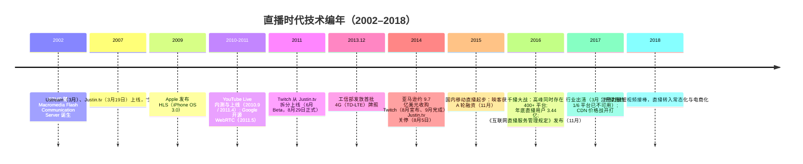
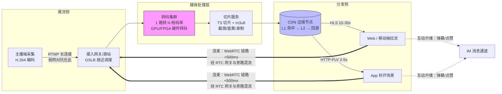

# 直播时代（约 2016–2018）

> 这是[技术编年史](/chronicle/)的第二浪。写给两类人：经历过那几年、想把它放回技术史坐标系里的同行；以及今天正在为大模型算推理成本、想理解"成本结构决定商业模式"这句话从哪来的后来者。读完你会得到一条清晰的主线——**直播不是内容行业的胜利，而是音视频技术栈与云基础设施的一次极限压力测试**，它把 CDN、转码、实时传输这些原本藏在幕后的工程细节，推成了整个行业竞争的核心变量。

## 时代的命题

"千播大战"把实时音视频推上主舞台。移动互联网那一浪教会行业"扛住流量"，直播则把命题升级为"**扛住流量，且要实时、要便宜**"——这三者构成一个不可能三角，而拆三角的工具，恰好只有云能给。于是技术栈的重心从计算挪到了网络与媒体处理：**CDN、转码、弱网对抗成为核心竞争力**。

作为一名当时在给直播平台做架构咨询的云架构师，我最深的体感是：那是十年里第一次，客户的架构图上"带宽"比"服务器"贵。

## 时代坐标

把镜头拉远，直播的爆发是三件事在 2013–2016 年完成对齐的结果：

- **网络**：2013 年 12 月 4 日，工信部向三大运营商发放首批 TD-LTE 4G 牌照（[纽约时报中文网](https://cn.nytimes.com/technology/20131204/tc04mobile/)、[人民网·民生周刊](https://paper.people.com.cn/mszk/html/2013-12/09/content_1361585.htm)），随后流量资费逐年下探——"用手机看直播"从概念变成账单可负担的日常
- **技术栈**：推流协议、切片分发、自适应码率在 2009–2014 年间成熟成标准件（下节展开），创业公司第一次可以"组装"一个直播平台
- **示范效应**：2014 年 8 月，亚马逊宣布以约 **9.7 亿美元现金**收购 Twitch（亚马逊官方口径约 $970 million，中文报道中流传的"9.75 亿"即此量级；见 [Amazon 官方新闻稿](https://press.aboutamazon.com/2014/8/amazon-com-to-acquire-twitch)、[BBC](https://www.bbc.com/news/technology-28930781)）——这是当时亚马逊历史上最大的收购，资本市场第一次给"直播"标出天价

三股力汇合的刻度，是 CNNIC 第 39 次《中国互联网络发展状况统计报告》里那组数字：**截至 2016 年 12 月，中国网络直播用户规模 3.44 亿，占网民整体的 47.1%**（[报告专题页](https://www.cac.gov.cn/cnnic39/index.htm)、[第一财经](https://www.yicai.com/news/5211622.html)）——将近一半的中国网民看过直播。

## 关键节点编年

*Justin.tv：把摄像头 24 小时对着自己生活的"人生直播"，是所有平台化直播的原点。图源：Wikimedia Commons（[来源页](https://commons.wikimedia.org/wiki/File:Justin.tv_-_Justin_Kan_and_Irina_Slutsky.jpg)），CC BY 2.0*

几个容易被忽略、但对理解全篇很关键的节点：

- **2007 年 3 月**：Ustream 与 Justin.tv 几乎同时上线（[SoftBank 新闻稿](https://group.softbank/news/press/20100202)记载 Ustream 于 2007 年 3月开始事业，[Wikipedia: Justin.tv](https://en.wikipedia.org/wiki/Justin.tv)记载 Justin.tv 上线于 2007 年 3 月 19 日）。这一代平台的架构还是"Flash 推拉一体的玩具"，但证明了普通人对着摄像头这件事有观众
- **2011 年 6–8 月**：Justin.tv 把游戏频道拆分为独立品牌 **Twitch**（6 月 Beta，8 月 29 日正式上线，[Wikipedia: Twitch](https://en.wikipedia.org/wiki/Twitch_(service))）——垂直品类跑通了"高频开播 + 弹幕社区"的模式，这是后来所有直播平台产品形态的原型
- **2014 年**：Twitch 被收购的同一月，Justin.tv 本体关停（[ITmedia](https://www.itmedia.co.jp/news/article/1408-06/1140806051/)）；Ustream 则在前一年 1 月被 IBM 收编、后并入 IBM Cloud Video（[日经中文网报道](https://www.nikkei.com/article/DGXLASDZ05HGL_V00C17A4TI1000/)）——第一代先驱全部退场，技术管线被行业继承
- **2016 年 11 月 4 日**：国家网信办发布《互联网直播服务管理规定》（12 月 1 日施行，[官网全文](https://www.cac.gov.cn/2016-11/04/c_1119847629.htm)），叠加此前文化部门的整治（2016 年 7 月曾公示查处 26 家平台，[光明文摘报](https://epaper.gmw.cn/wzb/html/2016-07/19/nw.D110000wzb_20160719_6-02.htm)），野蛮生长的窗口开始关闭
- **2017 年 3 月**：那张著名的"千播大战"平台全景图里，已有近 1/6 的 App 无法登录、无更新或下架（[每日经济新闻](https://www.nbd.com.cn/articles/2017-03-08/1082818.html)）——出清比大多数人预期的来得快

*Twitch：被亚马逊以约 9.7 亿美元收购时，它是直播商业模式最有力的公开背书。图源：Wikimedia Commons（[来源页](https://commons.wikimedia.org/wiki/File:Twitch_logo_2019.svg)），公有领域*

## 技术驱动：编码、协议与分发

### 推拉流协议：一条从"私有长连接"到"HTTP 切片"再到"RTC"的主线

今天回看，直播的协议史就是延迟与规模互相让步的历史：

| 协议 | 诞生/标准化 | 链路角色 | 典型延迟（工程经验量级） | 关键性质 |
| --- | --- | --- | --- | --- |
| RTMP | 2002 年随 Macromedia Flash Communication Server 出现，2005 年归 Adobe，2012 年才公开规范 | 长期是**推流**事实标准 | 1–3 秒（拉流） | TCP 长连接，绑定 Flash 生态 |
| HLS | 2009 年随 iPhone OS 3.0 发布（2009 年 5 月即有 IETF 草案），2017 年 8 月标准化为 RFC 8216 | **拉流**主流（移动端） | 默认档位约 10–30 秒，LL-HLS 可压到 2–3 秒 | 纯 HTTP 切片，CDN 天然友好，自适应码率 |
| HTTP-FLV | 国内业界 2014 年前后普及（流式 FLV over HTTP） | 拉流（Web 播放器 + App） | 2–5 秒 | 比 HLS 更省切片开销，延迟更低 |
| WebRTC | 2011 年 5 月 Google 开源，2021 年 1 月 26 日成为 W3C 推荐标准 | **连麦/互动** | 亚秒级（数百毫秒） | UDP/SRTP，为通信而非分发设计，1 对 1 强、1 对 N 弱 |

关键时间锚点的出处：RTMP 史见 [Wikipedia: RTMP](https://en.wikipedia.org/wiki/Real-Time_Messaging_Protocol) 与 [Castr 的协议史](https://castr.com/blog/history-of-rtmp-protocol/)；HLS 见 [Wikipedia: HTTP Live Streaming](https://en.wikipedia.org/wiki/HTTP_Live_Streaming)、[Apple 官方文档](https://developer.apple.com/documentation/http-live-streaming) 与 [RFC 8216](https://www.rfc-editor.org/info/rfc8216/)；WebRTC 见 [W3C 推荐标准新闻稿（中文）](https://www.w3.org/2021/01/pressrelease-webrtc-rec.html.zh)。

一个反直觉但重要的判断：**HLS 赢了协议战争，靠的不是它更快，而是它"最像下载"**。把视频切成小 TS 文件再用普通 HTTP 分发，等于把直播流量伪装成网页流量——任何 CDN、任何缓存、任何运营商中间设备都能伺候它。Flash 于 2020 年底退役后 RTMP 作为播放协议消亡、作为推流协议又活了十年（[Servers.com：协议演进阶梯](https://www.servers.com/blog/from-rtmp-to-mrv2-the-history-of-streaming-protocols)、[Wink：Why HLS Won](https://www.wink.co/documentation/The-Streaming-Protocol-Wars-Why-HLS-Won)），本质都是这个逻辑：**分发端向 HTTP 妥协，采集端保留低开销长连接**。

### 一条链路看懂直播架构

注意决策含义：**同一个直播间往往同时存在三档延迟**。普通观众走 HLS 拿"稳"，粉丝 App 内走 FLV 拿"快"，连麦嘉宾走 WebRTC 拿"实时"——架构师的工作就是在观众面前把这三条链路缝合起来（旁路转推、音视频同步），而不是幻想一条链路通吃。

### 编码与转码

直播时代 H.264 一家独大（硬件解码普及是前提）。真正的成本杠杆在**转码档位**：一路 1080p 推流要转成 1080p/720p/480p/360p 多档供自适应切换，头部平台的转码集群规模按"路"计。正是在这一浪，**GPU/FPGA 硬件转码第一次被认真算账**——软编 x264 便宜但费 CPU、硬件转码贵但单位路数成本低，这个账算得好坏直接决定毛利。这套方法论今天被原样搬进了视频云和直播电商，再往后，它的精神继承者就是今天推理集群的量化与批处理（见 [LLM 推理](/ai/infra/inference/llm-inference)）。

*2010 年代初一场活动直播的推流与编码器现场——今天这些机柜的职能大多被云上的媒体处理服务取代了。图源：Wikimedia Commons（[来源页](https://commons.wikimedia.org/wiki/File:Eddie_Codel_runs_the_Ustream_feed_and_encoders_at_Leweb.jpg)），CC BY 2.0*

## 直播对云架构的影响（本站视角）

这一浪真正重塑云的地方，我把账归到四类：

### 1. 带宽成本模型：第一次"带宽即成本"

直播之前，大部分互联网业务的带宽与收入近似线性且不主导毛利；直播之后，"百万并发"级别的头部平台按当时行业报道口径，带宽与 CDN 月度支出达到数千万元量级（[流媒体网：直播的 CDN 成本有多高](https://lmtw.com/mzw/content/detail/id/136867)；[财新：博鳌论坛上"直播盈利是难点"的讨论](https://economy.caixin.com/m/2017-03-28/101071579.html)）。由此沉淀出一整套今天仍在用的成本工程：

- **计费口径博弈**：月 95 峰值 vs 按月均 vs 按流量，大客户用峰谷差换价格；架构师必须懂合同里的计费模型，因为它反向决定你的调度策略
- **闲置复用**：直播高峰在晚间、电商大促在白天、点播在全天均匀——把不同业务的带宽曲线拼在同一张采购盘子里摊薄成本，是当年最"性感"的方案
- **P2P/边缘卸载**：热点流用 P2P 分发能砍掉三到四成回源与骨干成本（[阿里云开发者社区：大直播时代 P2P](https://developer.aliyun.com/article/683202)），代价是可观测性变差
- **码率即钱**：转码档位每降 20% 码率，全站带宽成本近似降 20%——画质委员会与 CFO 的谈判从此成为常设议题

我遇到的情况是：那几年客户最认真的问题不再是"服务器多少台"，而是"一路流每小时多少钱、怎么把它再砍三成"。

### 2. 转码集群：媒体处理成为云的标配产品线

"一路进、多路出"的转码是典型的可水平扩展、可分层售卖的负载，直接催生了视频云的成型——直播接入、媒体处理、分发加速、播放器 SDK 打包成 PaaS 卖给所有创业者，直播平台因此能把"开播到上线"的周期从月压到周。媒体处理第一次作为独立产品线出现在主流云的目录里，这是直播留给云的永久编制。

### 3. 连麦与秒级延迟：CDN 的 RTC 化

千播大战打到 2017 年前后，竞争焦点从"看"转向"玩"：PK、连麦、弹幕互动。纯 CDN 分发撑不住百毫秒级的双向链路，于是出现了今天的标准范式：**分发走 CDN（HTTP 切片），互动走 RTC 链路（UDP），中间用网关做旁路混流**。WebRTC 2011 年就已开源（[W3C 邮件列表存档](https://lists.w3.org/Archives/Public/public-webrtc/2011May/0022.html)），但真正被产业界大规模工程化是直播连麦逼出来的；而它"成为正式标准"（2021 年）反而是后知后觉的盖章。

### 4. 突发流量的弹性：主播开播 = 区域性洪峰

一场头部主播的"事件性开播"能在几分钟内制造某个区域的流量洪峰，且完全不可预测——这是弹性调度最好的练兵场：提前预热 CDN 边缘、按房间热度动态调度源站、用 GSLB 在开播瞬间把压力摊开。今天你在电商大促与大模型流量突增上看到的预案思路，方法论源头就在这几年。

## 一线回望

从一线交付视角，那三年我记住三件事：

**卡顿率是北极星，而且是"体验三角"的角斗场。** 首屏秒开、卡顿率、码率自适应三者的最优解永远互相打架：切片越小延迟越低但 HTTP 请求开销与 CDN 成本越高；ABR 保守则画质差，激进则卡顿。我当时给客户做体验指标体系，最终都收敛到同一句话——**别单独优化任何一个指标，要联合优化，因为用户用"退出率"给三者合成分打分**。

**成本战争比增长战争更残酷。** 2016–2017 年的 CDN 价格战把带宽单价打下来一大截（云厂商与专业 CDN 贴身肉搏），受益的是后入场者，受伤的是靠"囤低价带宽"当壁垒的中腰部。这提醒了所有后来者：**基础设施红利窗口只有 12–18 个月**，价格战打完，竞争重新回到内容、运营与效率。

**技术栈的溢出比叙事更持久。** 千播大战的平台 2018 年就死掉大半，但它养熟的工程师、跑通的 RTC 链路、打好的价格基础，2020 年被视频会议与直播电商直接复用——没有直播时代攒下的 RTC 与 CDN 家底，2020 年的全民远程会议是不可想象的。这正应了[编年史总纲](/chronicle/)里的规律三：泡沫的是商业模式，沉淀的是技术资产。

## 兴衰逻辑

- **为什么兴起**：4G 资费下降 + 移动流量爆发 + 内容形态升级，三个前置条件在 2015–2016 年同时就位；秀场打赏又恰好是第一批跑通直播变现的场景，资本随即蜂拥（映客 2015 年 11 月获 7000 万元 A 轮，[36 氪](https://m.36kr.com/p/1722736934913)）
- **留下了什么**：完整的实时音视频技术栈（滋养了后来的视频会议与云游戏）；被价格战打出来的普惠 CDN 分发能力；视频云 PaaS 这个永久产品形态
- **为什么让位**：行业出清（到 2017 年末从业公司较高峰期减少近百家，[新京报](https://m.bjnews.com.cn/detail/156557664414685.html)）叠加监管趋严（2016.11 规定施行后牌照与内容成本陡增）；而 [短视频](/chronicle/short-video)用"先审后看、可暂停、可碎片消费"的更轻形态接棒注意力——直播用户数自 2017 年 6 月起出现回落（CNNIC 第 40 次报告口径，3.43 亿，[36 氪快讯](https://m.36kr.com/newsflashes/3277994541057)），浪潮转入下半场：与电商、内容平台融合为"常驻能力"而非"独立风口"

## 对今天的启示

1. **成本结构决定商业模式**：直播教会整个行业"带宽即成本"，今天大模型行业正在重新学同一课——"token 即成本"。当年用降码率换带宽成本的思路，与今天用量化、缓存、模型分级换推理成本，是同一本账（方法见 [GPU 选型与推理成本测算](/ai/infra/inference/gpu-sizing)）
2. **实时体验的优化永远在"质量—延迟—成本"三角里做取舍**：不要找银弹，要找当前业务约束下的帕累托前沿；LLM 应用的流式输出、投机采样、端侧小模型，本质上就是这条三角曲线的新坐标
3. **接口与形态之争，赢的一方往往是"最不特别"的那个**：HLS 靠"像下载"赢了 RTMP 的"像打电话"；今天看，API 兼容与生态适配往往也比单点技术优越更能决定胜负

## 站内相关

- [技术编年史总纲：十年六浪](/chronicle/)
- 上一浪：[移动互联网时代](/chronicle/mobile-internet)｜下一浪：[短视频时代](/chronicle/short-video)
- 同期暗流：[暗流：信创与国产化](/chronicle/xinchuang)
- 成本方法传承：[AI 大模型时代](/chronicle/ai-era) · [LLM 推理](/ai/infra/inference/llm-inference) · [GPU 选型与推理成本测算](/ai/infra/inference/gpu-sizing)
- 方法论：[上云迁移方法论](/methodology/cloud-migration) · [架构设计](/methodology/architecture-design)

## 参考资料

> 以下资料均为公开来源，访问日期统一标注 2026-09-02。

**文字来源**

- [Wikipedia: Justin.tv](https://en.wikipedia.org/wiki/Justin.tv) · [Wikipedia: Twitch (service)](https://en.wikipedia.org/wiki/Twitch_(service)) — Justin.tv 上线（2007-03-19）、Twitch 拆分（2011 年 6 月 Beta / 8 月 29 日正式）、2014 年关停
- [Amazon 官方新闻稿：Amazon.com to Acquire Twitch（2014-08-25）](https://press.aboutamazon.com/2014/8/amazon-com-to-acquire-twitch) · [BBC：Amazon buys Twitch](https://www.bbc.com/news/technology-28930781) — 约 9.7 亿美元现金，当时亚马逊最大收购
- [纽约时报中文网：中国工信部发放首批 4G 牌照（2013-12-04）](https://cn.nytimes.com/technology/20131204/tc04mobile/) · [人民网·民生周刊：4G 发牌平衡术](https://paper.people.com.cn/mszk/html/2013-12/09/content_1361585.htm) — 三大运营商各获一张 TD-LTE 牌照
- [CNNIC 第 39 次《中国互联网络发展状况统计报告》专题](https://www.cac.gov.cn/cnnic39/index.htm) · [第一财经解读](https://www.yicai.com/news/5211622.html) — 截至 2016 年 12 月直播用户 3.44 亿、占网民 47.1%
- [界面新闻：2017 年关键判断（400+ 平台高峰口径）](https://www.jiemian.com/article/1097401.html) · [界面新闻：2016-05 直播 250 家/用户 2.4 亿](https://m.jiemian.com/article/704707.html) · [每日经济新闻：千播大战图 1/6 平台失效（2017-03）](https://www.nbd.com.cn/articles/2017-03-08/1082818.html) · [新京报：直播行业出清](https://m.bjnews.com.cn/detail/156557664414685.html) — 千播大战与出清的时间锚点
- [国家网信办：《互联网直播服务管理规定》全文（2016-11-04 发布）](https://www.cac.gov.cn/2016-11/04/c_1119847629.htm) · [光明日报文摘报：文化部查处 26 家平台（2016-07）](https://epaper.gmw.cn/wzb/html/2016-07/19/nw.D110000wzb_20160719_6-02.htm)
- [Wikipedia: HTTP Live Streaming](https://en.wikipedia.org/wiki/HTTP_Live_Streaming) · [Apple 开发者文档：HTTP Live Streaming](https://developer.apple.com/documentation/http-live-streaming) · [RFC 8216（2017-08）](https://www.rfc-editor.org/info/rfc8216/) · [Wink: Why HLS Won the Streaming Protocol Wars](https://www.wink.co/documentation/The-Streaming-Protocol-Wars-Why-HLS-Won)
- [Wikipedia: Real-Time Messaging Protocol](https://en.wikipedia.org/wiki/Real-Time_Messaging_Protocol) · [Castr: A Complete History of RTMP](https://castr.com/blog/history-of-rtmp-protocol/) · [Servers.com: From RTMP to MRV2——协议演进阶梯](https://www.servers.com/blog/from-rtmp-to-mrv2-the-history-of-streaming-protocols) — RTMP 2002 年诞生、2012 年公开规范、Flash 退役后仅存于推流侧
- [W3C：WebRTC 成为推荐标准（2021-01-26，中文新闻稿）](https://www.w3.org/2021/01/pressrelease-webrtc-rec.html.zh) · [W3C 邮件列表：Google 2011-05-31 宣布 WebRTC 开源](https://lists.w3.org/Archives/Public/public-webrtc/2011May/0022.html)
- [TechCrunch：YouTube Debuts Live Streaming Platform（2010-09）](https://techcrunch.com/2010-09-12/youtube-live-streaming/) · [CNET Japan：YouTube Live 面向部分用户提供（2011-04-08）](https://japan.cnet.com/article/35001523/)
- [SoftBank 新闻稿（记载 Ustream 2007 年 3 月开业）](https://group.softbank/news/press/20100202) · [日经中文网：Ustream 开始 10 年消失](https://www.nikkei.com/article/DGXLASDZ05HGL_V00C17A4TI1000/) · [ITmedia：Twitch 关闭 Justin.tv（2014-08-06）](https://www.itmedia.co.jp/news/article/1408-06/1140806051/)
- [流媒体网：直播的 CDN 成本很高，到底有多高？](https://lmtw.com/mzw/content/detail/id/136867) · [财新：博鳌论坛·直播消解广电门槛，盈利是难点（2017-03）](https://economy.caixin.com/m/2017-03-28/101071579.html) · [阿里云开发者社区：大直播时代，P2P 才是降低成本的必杀技](https://developer.aliyun.com/article/683202) · [36 氪：映客 A 轮（2015-11）](https://m.36kr.com/p/1722736934913)

**图片来源**

- [File:Justin.tv - Justin Kan and Irina Slutsky.jpg](https://commons.wikimedia.org/wiki/File:Justin.tv_-_Justin_Kan_and_Irina_Slutsky.jpg)（Wikimedia Commons，CC BY 2.0）
- [File:Twitch logo 2019.svg](https://commons.wikimedia.org/wiki/File:Twitch_logo_2019.svg)（Wikimedia Commons，公有领域）
- [File:Eddie Codel runs the Ustream feed and encoders at Leweb.jpg](https://commons.wikimedia.org/wiki/File:Eddie_Codel_runs_the_Ustream_feed_and_encoders_at_Leweb.jpg)（Wikimedia Commons，CC BY 2.0）
