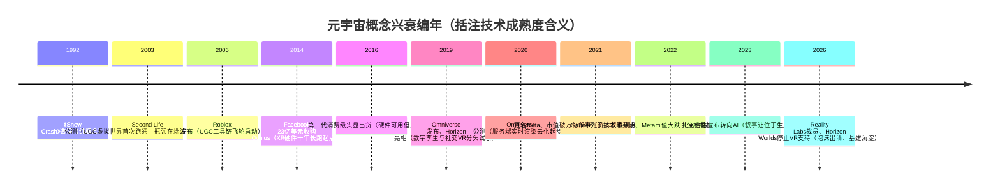

# 元宇宙时代（约 2021–2022）

> 这一浪是我职业生涯里最短、也最"基础设施化"的一浪：概念从热搜到祛魅只用了大约十八个月，但它逼着整个云行业第一次认真回答"GPU 算力如何云化"。这篇复盘写给两类人：经历过那两年、想把它讲清楚的从业者；以及正在 AI 浪潮里做技术选型、需要知道"上一浪留下了什么"的架构师。读完你会带走一份带日期锚点的元宇宙编年史、一张"哪些技术其实没就绪"的盘点表，以及判断概念周期的几条一线标准。

## 时代坐标

如果把 [十年六浪](/chronicle/) 摊开看，元宇宙是标准的"夹缝浪潮"：前有 [区块链时代](/chronicle/blockchain) 退潮留下的资本外溢，后有 AI 大模型时代（[编年史第五浪](/chronicle/ai-era)）接走全部叙事。它自己的窗口期，窄到大约就是 2021 年 10 月到 2023 年初。

但它的"时代的命题"很清晰：**3D 实时渲染、数字孪生、云游戏——GPU 算力第一次从"辅助角色"变成"主角"**。在此之前，云上的 GPU 主要用于机器学习训练和图形工作站远程化，属于偏门 SKU；元宇宙把"每个用户配一块渲染卡、像素流化到端"写进了主流商业计划书。

先给一组公开口径的坐标数字，感受一下当时的热度与落差：

| 时点 | 事件 | 公开数据 |
| --- | --- | --- |
| 2021-06 | Facebook 市值首次突破 1 万亿美元 | CNBC 报道，成为第六家万亿美元级美股公司 |
| 2021-10-28 | Facebook 更名为 Meta，宣布"All in 元宇宙" | 官方新闻稿（about.fb.com） |
| 2022-02 | 元宇宙登上 Gartner 技术成熟度曲线 | 定位于"技术萌芽期"，距生产力成熟约 10 年 |
| 2022-10 | Meta 市值跌至约 2680 亿美元 | 较 2021 年峰值蒸发约 7000 亿美元（公开行情数据） |
| 2026-07 | Meta Reality Labs 自 2020 年以来累计经营亏损 | 超过 800 亿美元（CNBC 基于分部数据报道） |

万亿与 2680 亿之间只隔了十六个月。这条曲线本身就是一句完整的复盘结论。

## 关键节点编年

### 前史：这个概念等了两代人

元宇宙不是 2021 年发明的。这个词出自 Neal Stephenson 的科幻小说《Snow Crash》（雪崩），1992 年——"meta"与"universe"的拼合词（Wikipedia"Metaverse"词条）。

真正的第一次工程实践是 **Second Life**：Linden Lab 于 2003 年 6 月 23 日公测的多人在线虚拟世界。它已经具备了后来元宇宙叙事的全部要素——用户生成内容（UGC）、虚拟经济、土地产权，甚至有可兑换真实货币的 Linden Dollar，2006 年 9 月其虚拟经济年 GDP 被报道为 6400 万美元。2008 年它拿到技术与工程艾美奖，同年创始人 Philip Rosedale 卸任 CEO——**热度顶点与创始人离场发生在同一年**，这个细节值得玩味。2009 年之后增长停滞，Linden Lab 在 2010 年裁员 30%；2013 年约百万活跃用户后一路阴跌（以上均据 Wikipedia"Second Life"词条）。它的继任者、更"元宇宙"的 VR 平台 Sansar 于 2017 年公测，2020 年被母公司放弃。

*图源：Wikimedia Commons（[来源页](https://commons.wikimedia.org/wiki/File:Second_Life_Landscape_01.jpg)，CC0）*

第二条前史线是 **Roblox**：David Baszucki 与 Erik Cassel 2004 年开始开发，2006 年 9 月 1 日公开发布，从一开始就把"只提供创作工具与服务器托管、内容全交给用户"定为一号工程原则（Roblox Studio + Luau 脚本语言）。这条 UGC 飞轮是后来所有元宇宙叙事里唯一被验证跑通的——2021 年 3 月 Roblox 直接上市，估值 450 亿美元，当年平均日活 4550 万（Wikipedia"Roblox"词条），恰好是 Facebook 更名前三个月。**巨头们讲的元宇宙故事，底层道具其实早就被这家做儿童沙盒的公司卖了一遍。**

第三条前史线是硬件：Facebook 在 2014 年以 23 亿美元收购 Oculus VR，第一代消费级头显 2016 年出货（Wikipedia"Meta Platforms"词条）；2019 年 Facebook 公布社交 VR 产品 Horizon（后更名 Horizon Worlds），NVIDIA 在 SIGGRAPH 2019 发布 Omniverse 平台。到 2021 年 10 月更名之前，"元宇宙的技术零件"已经在货架上攒了五年——**但零件齐了不等于机器能转**，这是下一节要拆的题。

*图源：Wikimedia Commons（[来源页](https://commons.wikimedia.org/wiki/File:VR_Headset_Facebook_Oculus_Gamescom_2019_(48605656416).jpg)，CC BY 2.0，拍摄者 snizhnie via Flickr）*

### 起浪与退潮：被压缩成 18 个月的周期

2021 年 10 月 28 日，Connect 2021 大会上，扎克伯格把公司更名为 Meta，官方新闻稿的原话是："Meta 的重点将是把元宇宙带到现实（bring the metaverse to life）"。同一场发布会发布了面向创作者的工具 Presence Platform 与 1.5 亿美元的沉浸式学习投资基金。有两个工程细节后来被证明意味深长：**从 2021 年第四季度财报起，Meta 将 Reality Labs 作为独立业务分部披露**；新股票代码 MVRS 于 12 月 1 日启用。独立分部披露等于把烧钱速度公开挂在了每个季度——退潮时它也就成了最诚实的记分牌。

退潮的节奏几乎逐季可查（以下时间线数据来自 Wikipedia"Meta Platforms"词条，行情为公开口径）：

- **2022 年 2 月初**：2021 Q4 财报暴露用户增长见顶，股价单日下跌 27%，市值蒸发约 2300 亿美元——彭博称之为"华尔街从未见过的规模性抛售"。同年 4 月，Reality Labs 2021 年超百亿美元的经营亏损已经见了公（2021 全年亏损超 100 亿美元，扎克伯格当时预告 2022 年亏损将"显著扩大"）。
- **2022 年 7 月**：Meta 上市以来首次季度营收同比下滑。
- **2022 年 8 月**：Gartner 把"元宇宙"列入 2022 年新兴技术成熟度曲线——**但没有放在期望膨胀期峰值，而是放在技术触发期的最左端**，媒体转述其含义：距离生产力成熟期约十年。分析机构的坐标系里，这场所谓"元年"其实才刚起跑；热搜与曲线的错位，正是泡沫的标准形态。
- **2022 年 10 月 27 日**：Meta 市值跌至 2680 亿美元，跌出美股前 20，较 2021 年峰值蒸发约 7000 亿美元。
- **2023 年 2 月**：扎克伯格公开宣布公司重心从元宇宙转向 AI（Wikipedia"Metaverse"词条）。同年 Gartner 把生成式 AI 放上 2023 年曲线峰值——**叙事交棒，一代人有一代人的炒作周期**。

尾声值得记两笔。其一，Meta 的市值在 2024 年 1 月重新逼近万亿美元（Wikipedia 口径；《华尔街日报》当期标题直接写"Meta 再次成为万亿美元公司"），但拉升它的是降本、广告回暖与 AI 叙事——**同一个万亿，换了一个理由**。其二，据 CNBC 基于分部数据的持续报道，Reality Labs 自 2020 年以来累计经营亏损至 2026 年年中已超 800 亿美元（仅 2025 财年就拖累经营利润约 192 亿美元）；2026 年初 Meta 对该部门裁员上千人、关闭多家 VR 工作室，并停止 Horizon Worlds 的 VR 端内容更新（Wikipedia"Metaverse"词条）。一个时代落幕的方式，往往就是财务报表上的几行备注。

*图源：Wikimedia Commons（[来源页](https://commons.wikimedia.org/wiki/File:Meta_Platforms_logo.svg)，公有领域）*

## 技术栈盘点：哪些其实没就绪

当时一线交付的共同体感是：**方案 PPT 里的能力，没有一项能按承诺的形态交付**。逐个盘点（公开证据 + 我的交付经验混合，标注如下）：

| 技术栈环节 | 叙事承诺 | 2021–2022 年的真实状态 | 证据锚点 |
| --- | --- | --- | --- |
| XR 头显终端 | 人人一副眼镜进入持久世界 | Quest 2 仍是"客厅玩具"：重量、续航、光学、眩晕，消费渗透率极低 | Wikipedia：Meta 自己承认"多数宣传中的 VR 技术仍有待开发" |
| 实时渲染算力 | 亿级用户同时在线的高质量 3D | 单机渲染可行，规模不经济；Intel 高管 Raja Koduri 公开测算：**持久、沉浸、亿级实时访问需要算力效率提升 1000 倍** | Koduri 发言，2021 年 12 月，Wikipedia 转述 |
| 内容生产管线 | 用户共建的无限世界 | UGC 工具远未成熟，3D 创作门槛仍接近专业 DCC 软件；只有 Roblox 一个飞轮跑通 | Roblox 直到 2024 年 3 月才在 Studio 引入生成式 AI 辅助创作（Wikipedia） |
| 资产互操作 | 跨平台互通的持久身份与资产 | 无通用标准；USD（皮克斯开源）2021 年才被 NVIDIA 采纳进 Omniverse，OpenXR 刚起步 | Wikipedia"Metaverse"词条标准化章节 |
| 实时同步与仿真 | 同场景万人共在 | 单实例并发受服务端物理与广播开销硬限制，Second Life 时代的区域分片问题依然存在 | Second Life 工程史（Wikipedia）；一线方案普遍按"百人级房间"设计 |
| 网络与流化 | 像素流化到端，体验无损 | Pixel Streaming 对边缘节点与带宽成本要求苛刻，云游戏端到端延迟预算被压到 100ms 量级才勉强可用 | 我的一线体感（见下文云游戏试水） |

这张表的每一行，放在 2026 年看仍然"未完全就绪"——但关键区别是：**2021 年的资本已为 202X 年的技术付了一次预付款**。

*图源：Wikimedia Commons（[来源页](https://commons.wikimedia.org/wiki/File:Oculus_Quest_2_-_2.jpg)，CC BY-SA 4.0，拍摄者 KKPCW）*

## 退潮复盘与正面遗产

### 复盘：三句话

1. **技术就绪 ≠ 生态就绪。** 渲染、头显、同步、内容管线四个环节当时都只到"demo 可用"，没有任何一个到"消费级普及"，而缺一环则全局不成立。这是与移动互联网（智能机+3G+App Store 三件套恰好齐了）最本质的差别。
2. **内容飞轮无法用资本催熟。** 虚拟世界最大的对手不是别的世界，是现实生活的注意力——2021–2022 年它输给了短视频和刚上线的 ChatGPT。Roblox 证明了飞轮存在，但飞轮转速依赖工具成熟度，而工具的临门一脚最后竟然是生成式 AI 补上的（2024 年 Roblox Studio 的 AI 建素材/换贴图功能）。
3. **叙事先行，报表兜底。** Meta 独立披露 Reality Labs 分部的决定，客观上给全市场提供了一个逐季更新的证伪机制——泡沫退得这么快，一半要归功于它自己把账本摊开了。

### 正面遗产：这一浪真正沉淀下来的四件事

- **GPU 供给链与调度能力。** 这一浪逼着云厂商第一次成体系地研究 GPU 云主机：显卡型号图谱、vGPU 虚拟化、分时复用、竞价实例化的渲染农场弹性扩容。没有这两年攒下的供给与调度经验，2023 年之后大模型训练/推理集群的扩张会明显更磕绊。这是我坚持"元宇宙是 AI 时代前传"的核心论据。
- **实时渲染云的产品化。** 像素流化、云渲染 API、渲染农场即服务在这一浪从定制方案变成标准 SKU；端侧瘦客户端 + 云端重渲染的架构模式被完整跑通，今天它在自动驾驶仿真、影视预渲染、工业设计云化里继续产生收入——**付费的人换了一批，架构没换**。
- **3D 资产管线标准化。** USD/OpenUSD 与 OpenXR 在元宇宙叙事下获得工业界押注，3D 资产第一次有了接近"PDF 时刻"的交换格式共识。NVIDIA Omniverse 是最好的样本：2021 年 4 月发布企业版并与宝马宣布虚拟工厂合作（NVIDIA 官方新闻稿，2021-04-12；宝马新闻稿，2021-04-13），2023 年 3 月宝马宣布将 Omniverse 虚拟工厂规划推向全球生产网络（NVIDIA 博客），此后进一步为 30 余座工厂建立数字孪生（宝马新闻稿）；2024 年 11 月富士康官宣用 Omniverse 建设 AI 工厂数字孪生（富士康新闻稿）。到 2026 年去看 NVIDIA 官方 Omniverse 页面，标题已经不提 metaverse，写的是 **"Develop Physical AI Applications"**——同一个平台，从元宇宙叙事平移到了物理 AI / 工业数字孪生的采购预算里。
- **数字孪生的真实市场。** 疫情催生的云展厅、虚拟发布，最终沉淀为工业数字孪生这条长期赛道：GIS+BIM+IoT 数据融合、城市级三维场景、工厂仿真。它不再蹭"元宇宙"三个字，反而开始按项目正常付费——这恰好印证了编年史总纲的判断：**叙事热度归零后还有人付钱用的，才是资产。**

## 对云架构的影响：这一浪改变了什么

从架构师的技能树看，元宇宙浪的"课时"浓缩为四条，今天仍然有效：

1. **GPU 成为容量规划的一等公民。** 显存、算力、编解码单元、卡间互联第一次进入需求评审的常规清单；"什么业务值得包年买卡、什么业务用按量渲染"成了新的成本决策题。答案后来被大模型时代全盘继承。
2. **弹性从"扩 Web 服务器"变成"扩渲染实例"。** 我亲历的典型场景：虚拟发布会瞬时上万并发观看，实际算力的瓶颈是"同时在线的 3D 会话数"——渲染农场临时扩容涉及镜像预热、GPU 实例库存（热门卡常无货）、流化会话状态无法热迁移。这类调度难题的解法（池化、预热、分级画质降级）后来原样迁移到了 AI 推理弹性上。
3. **边缘节点从 PPT 概念变成成本模型。** 像素流化的体验底线逼着团队认真计算"渲染点离用户的 RTT × 带宽成本"的交换关系；云游戏是极限案例——端到端 100ms 的延迟预算里，网络与渲染必须联合优化，单侧优化没有出路。
4. **数据接入的工程量被普遍低估一个数量级。** 工业数字孪生项目里，客户以为买的是"三维渲染"，实际缺的是 GIS+BIM 底座的坐标与语义对齐、PLC/传感器实时数据链路、以及组织层面的数据确权——**数据接入比渲染难十倍**。教训泛化到今天的 AI 项目：RAG 的检索质量决定上限，与"孪生场景的数据管线决定上限"是同一条物理定律。

## 一线回望

站在 2026 年回望，我参与了那一浪里几乎所有类型的交付：给品牌客户做云展厅与虚拟发布会、给制造企业做数字孪生 POC、给游戏客户试水云游戏串流。当时的体感是"方向对、时机错"，现在可以给出更冷的判断：**它是一次基础设施的预演，由一个过热的商业模式来买单**。

最有意思的画面出现在 2023 年：几乎同一批客户，砍掉了元宇宙项目的二期预算，把同一支团队、同一批 GPU、同一片云资源池，改成了大模型知识库问答和模型服务。物理资产 100% 复用，需求文档一字不留。当时觉得讽刺，现在明白这就是技术周期的正常代谢——[区块链](/chronicle/blockchain)留下的分布式工程经验被 AI 时代复用，元宇宙留下的 GPU 供给与实时渲染基建被 AI 时代复用，AI 时代的 agent 与数据管线将来也会被下一浪复用。

如果要给今天正在 All in AI 应用的同行留一句这一浪的格言，我会用编年史总纲里的那个检验问题：**当你把叙事热度调成零，你正在采购的基础设施还有人付钱用吗？** 元宇宙的答案是"有，但付费人换成了工业客户与 AI 训练师"。这个问题，同样值得每个正在为 Agent 浪潮囤资源的人，现在就写进自己的复盘草稿里。

## 站内相关

- 上一浪：[区块链时代](/chronicle/blockchain)——同一批资本、同一种证伪节奏
- 下一浪：[AI 大模型时代](/chronicle/ai-era)——元宇宙攒下的 GPU 供给与调度经验的继承者
- 总纲：[十年六浪](/chronicle/)——泡沫与基础设施的判别框架

## 参考资料

<Refs>

> 文字来源（访问日期均为 2026-09-02）：

1. [Turning the page: The Facebook Company Is Now Meta](https://about.fb.com/news/2021/10/facebook-company-is-now-meta/) — Meta 官方新闻稿（2021-10-28），更名公告、Reality Labs 分部披露、Presence Platform。
2. [Metaverse — Wikipedia](https://en.wikipedia.org/wiki/Metaverse) — 术语起源（《Snow Crash》，1992）、Horizon Worlds、2021 年 Reality Labs 亏损、2023-02 转向 AI、2026 年裁员与 Horizon Worlds 停更、Koduri"算力效率需提升 1000 倍"发言、USD/OpenXR 标准化。
3. [Second Life — Wikipedia](https://en.wikipedia.org/wiki/Second_Life) — 2003-06-23 公测、2006 年虚拟经济 6400 万美元、2008 年艾美奖与创始人卸任、2010 年裁员 30%、Sansar 项目始末、2021 年迁移 AWS。
4. [Roblox — Wikipedia](https://en.wikipedia.org/wiki/Roblox) — 2004 年立项、2006-09-01 发布、Roblox Studio/Luau、2021-03 上市估值 450 亿美元、2021 年日均 4550 万 DAU、2024-03 生成式 AI 创作工具。
5. [Meta Platforms — Wikipedia](https://en.wikipedia.org/wiki/Meta_Platforms) — 2014 年 23 亿美元收购 Oculus、2022-02 单日市值蒸发约 2300 亿美元、2022-07 首次营收下滑、2022-10-27 市值 2680 亿美元、2024-01 重返万亿门。
6. [Gartner Predicts 25% of People Will Spend At Least One Hour Per Day in the Metaverse by 2026](https://www.businesswire.com/news/home/20220207005085/en/Gartner-Predicts-25-of-People-Will-Spend-At-Least-One-Hour-Per-Day-in-the-Metaverse-by-2026) — Gartner 新闻稿（Business Wire，2022-02-07）。
7. [Data Observability, Metaverse Land on Gartner's Hype Cycle for Emerging Tech](https://www.hpcwire.com/bigdatawire/2022-08-10/data-observability-metaverse-land-on-gartners-hype-cycle-for-emerging-tech/) — BigDataWire 报道（2022-08-10）。
8. [Gartner's latest hype cycle rates metaverse as 10 year+](https://www.ledgerinsights.com/gartners-hype-cycle-metaverse-10-year/) — Ledger Insights 解读：元宇宙位于萌芽期而非峰值。
9. [Gartner Places Generative AI on the Peak of Inflated Expectations on the 2023 Hype Cycle](https://www.webwire.com/ViewPressRel.asp?aId=312342) — Gartner 2023 年曲线新闻稿镜像，叙事交棒的第三方记录。
10. [NVIDIA Launches Omniverse, Design Collaboration and Simulation Platform for Enterprises](https://nvidianews.nvidia.com/news/nvidia-launches-omniverse-design-collaboration-and-simulation-platform-for-enterprises) — NVIDIA 官方新闻稿（2021-04-12）。
11. [NVIDIA Omniverse 官方页](https://www.nvidia.com/en-us/omniverse/) — 2026 年定位"Develop Physical AI Applications"：工业数字孪生/仿真/AI 工厂，元宇宙一词已不在页面主张中。
12. [BMW Group and NVIDIA take virtual factory planning to the next level](https://www.press.bmwgroup.com/global/article/detail/T0329569EN/) — 宝马官方新闻稿（2021-04-13）。
13. [BMW Group Starts Global Rollout of NVIDIA Omniverse](https://blogs.nvidia.com/blog/bmw-group-nvidia-omniverse/) — NVIDIA 官方博客（2023-03）；[BMW Group Scales Virtual Factory](https://www.press.bmwgroup.com/global/article/detail/T0450699EN/bmw-group-scales-virtual-factory?language=en) — 宝马新闻稿，30+ 工厂数字孪生。
14. [Foxconn to Build AI Factories with NVIDIA Omniverse Platform](https://www.foxconn.com/en-us/press-center/press-releases/latest-news/1484) — 富士康官方新闻稿（2024-11-19）。
15. [Facebook hits $1 trillion market cap for first time](https://www.cnbc.com/2021-06-28/facebook-hits-trillion-dollar-market-cap-for-first-time.html) — CNBC（2021-06-28）。
16. [Meta's Reality Labs posts $5 billion loss in fourth quarter](https://www.cnbc.com/2025-01-29/metas-reality-labs-posts-5-billion-loss-in-fourth-quarter.html) — CNBC（2025-01-29），累计亏损超 600 亿美元口径。
17. [Meta's Reality Labs lost over $4.6 billion in second quarter](https://www.cnbc.com/2026-07-29/metas-reality-labs-lost-over-4point6-billion-in-second-quarter.html) — CNBC（2026-07-29），累计亏损超 800 亿美元口径。
18. [Meta Platforms Is a $1 Trillion Company Again](https://www.wsj.com/livecoverage/stock-market-today-dow-jones-earnings-01-24-2024/card/meta-platforms-is-a-1-trillion-company-again-KLPbjvcn5tmf3Qgi3qJ6) — 《华尔街日报》（2024-01-24）。

> 图片来源（Wikimedia Commons，访问日期 2026-09-02）：
>
> - [File:Meta Platforms logo.svg](https://commons.wikimedia.org/wiki/File:Meta_Platforms_logo.svg) — 公有领域
> - [File:Second Life Landscape 01.jpg](https://commons.wikimedia.org/wiki/File:Second_Life_Landscape_01.jpg) — CC0
> - [File:VR Headset Facebook Oculus Gamescom 2019 (48605656416).jpg](https://commons.wikimedia.org/wiki/File:VR_Headset_Facebook_Oculus_Gamescom_2019_(48605656416).jpg) — CC BY 2.0（拍摄者：snizhnie）
> - [File:Oculus Quest 2 - 2.jpg](https://commons.wikimedia.org/wiki/File:Oculus_Quest_2_-_2.jpg) — CC BY-SA 4.0（拍摄者：KKPCW）

> 注：文中公司财务与行情数字均为公开报道口径（来源见上），"我的一线体感"段落为个人交付经验泛化，不涉及任何具体客户与未公开数据。

</Refs>