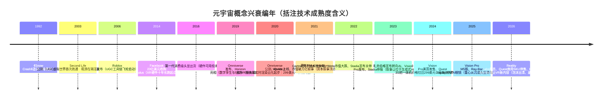
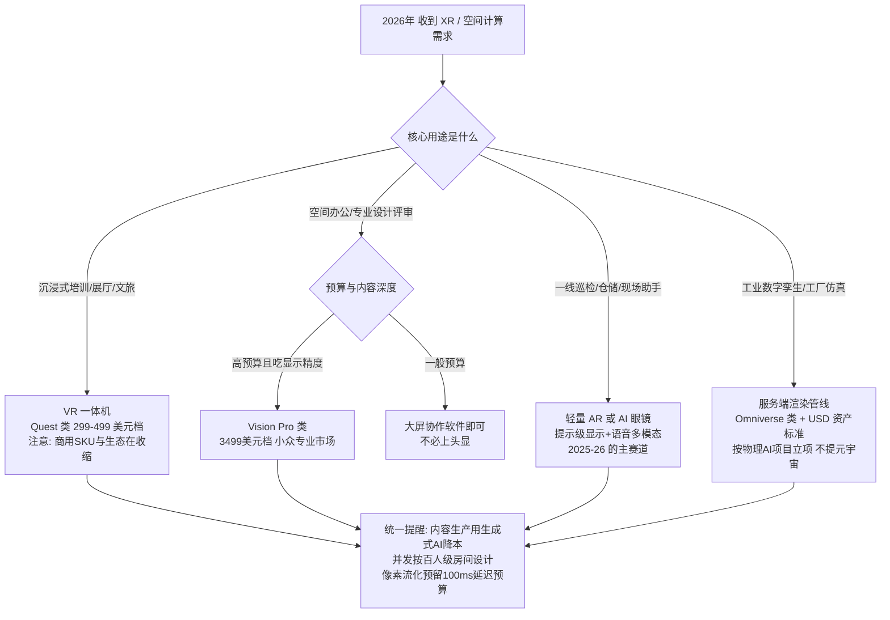
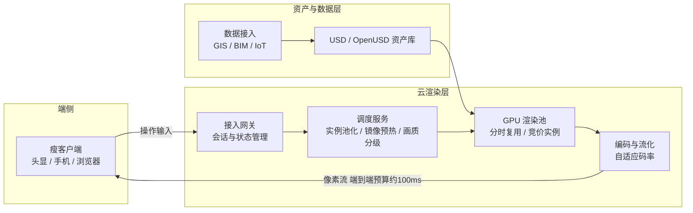

# 元宇宙时代（约 2021–2022）

> 这一浪是我职业生涯里最短、也最"基础设施化"的一浪：概念从热搜到祛魅只用了大约十八个月，但它逼着整个云行业第一次认真回答"GPU 算力如何云化"。这篇复盘写给两类人：经历过那两年、想把它讲清楚的从业者；以及正在 AI 浪潮里做技术选型、需要知道"上一浪留下了什么"的架构师。全文按"概念史 → 起浪与退潮 → 空间计算与 AI 眼镜的接棒 → 技术底座盘点 → 遗产清单"的主线展开，读完你会带走一份带日期锚点的元宇宙编年史、一张"哪些技术其实没就绪"的盘点表、一条 XR 硬件成本曲线的完整轨迹，以及判断概念周期的几条一线标准。

## 时代坐标

如果把 [十年六浪](/chronicle/) 摊开看，元宇宙是标准的"夹缝浪潮"：前有 [区块链时代](/chronicle/blockchain) 退潮留下的资本外溢，后有 AI 大模型时代（[编年史第五浪](/chronicle/ai-era)）接走全部叙事。它自己的窗口期，窄到大约就是 2021 年 10 月到 2023 年初。

但它的"时代的命题"很清晰：**3D 实时渲染、数字孪生、云游戏——GPU 算力第一次从"辅助角色"变成"主角"**。在此之前，云上的 GPU 主要用于机器学习训练和图形工作站远程化，属于偏门 SKU；元宇宙把"每个用户配一块渲染卡、像素流化到端"写进了主流商业计划书。

先给一组公开口径的坐标数字，感受一下当时的热度与落差：

| 时点 | 事件 | 公开数据 |
| --- | --- | --- |
| 2021-06-28 | Facebook 市值首次突破 1 万亿美元 | 维基百科"上市公司市值列表"词条：首次破万亿的确切日期，成为第六家万亿美元级美股公司 |
| 2021-10-28 | Facebook 更名为 Meta，宣布"All in 元宇宙" | 官方新闻稿（about.fb.com） |
| 2022-08 | 元宇宙登上 Gartner 新兴技术成熟度曲线 | 定位于"技术触发期"最左端，媒体转述其含义：距生产力成熟约 10 年 |
| 2022-10-27 | Meta 市值跌至约 2680 亿美元 | 单日再跌 24%，较 2021 年峰值蒸发约 7000 亿美元，跌出美股前 20（维基百科"Meta Platforms"词条） |
| 2024-02-02 | Apple Vision Pro 美国首发，定价 3499 美元 | 首批出货估计仅 6–8 万台；"空间计算"接过元宇宙的硬件叙事（维基百科"Apple Vision Pro"词条） |
| 2025-08-15 | Meta 市值峰值达约 2.18 万亿美元 | 拉升理由已完全换成 AI 与广告（维基百科"上市公司市值列表"词条） |
| 2026-01 | Reality Labs 自 2020 年末以来累计经营亏损达 800 亿美元 | 同月部门裁员 10%，并宣布 2 月 20 日起停售 Quest 头显商用 SKU（维基百科"Reality Labs"词条） |

万亿与 2680 亿之间只隔了十六个月；2680 亿与 2.18 万亿之间又只隔了两年十个月——但后一段的发动机已经与元宇宙无关。这条曲线本身就是一句完整的复盘结论。

### 为什么偏偏是 2021：三个触发器

编年史的纪律是回答"为什么是这时"。一个 1992 年就造出来的词，为什么在 2021 年 10 月引爆？我复盘下来是三个触发器恰好对齐：

1. **疫情把"在线共在"从可选项变成刚需。** 2020–2021 年远程办公与线上发布会的密度，让"3D 虚拟空间"第一次有了真实的采购理由——虚拟展厅、云发布会、线上演唱会那两年是实打实有预算科目的。这是需求侧的窗口。
2. **流动性溢出需要新叙事。** 2021 年全球资本在寻找移动互联网之后的下一个平台级故事，[区块链](/chronicle/blockchain)退潮后外溢的投机资金、NFT 的天价成交（Beeple 6930 万美元，2021 年 3 月佳士得）与元宇宙叙事互为燃料。这是资本侧的窗口。
3. **技术零件恰好攒齐了一代。** Quest 2 把一体机价格打到 299 美元（2020）、5G 商用铺开、游戏引擎与实时渲染成熟、Omniverse 类平台公测——每个零件都"刚好可用"，拼起来却"整体不可用"，这是泡沫侧的错觉来源。

三个窗口同时打开，叙事在十八个月内走完了别的概念十年的路；三个窗口先后关闭（疫情常态回归、加息、硬件渗透率不及预期），退潮也就同样干脆。**判断一个概念周期，先数它有几个独立触发器、每个触发器的半衰期多长**——这是我后来在 AI 浪潮里反复用的方法。

## 关键节点编年

### 前史：这个概念等了两代人

先给一张概念史谱系表，后文按线展开：

| 年份 | 节点 | 贡献的"零件" | 当时缺什么 |
| --- | --- | --- | --- |
| 1992 | 《Snow Crash》出版 | 术语与完整世界观：头显接入的持久虚拟世界 | 一切工程实现 |
| 2003 | Second Life 公测 | UGC、虚拟经济、虚拟货币兑换 | 端侧渲染性能、单区并发、带宽 |
| 2006 | Roblox 发布 | UGC 工具链与创作者分成飞轮 | 成年用户与高保真画面 |
| 2014 | Facebook 收购 Oculus | 消费级 VR 硬件的资本长跑起点 | 内容生态与轻量光学 |
| 2017 | 微软收购 AltspaceVR | 企业社交 VR 的第一次尝试（2023 年关停） | 真实使用场景与留存 |
| 2019 | Horizon 亮相、Omniverse 发布 | 社交 VR 平台与工业数字孪生分头试水 | 用户规模与格式标准 |
| 2020 | Quest 2 发售、Omniverse 公测 | 299 美元一体机、服务端渲染云化 | 杀手级内容与普及拐点 |

元宇宙不是 2021 年发明的。这个词出自 Neal Stephenson 的科幻小说《Snow Crash》（雪崩），1992 年——"meta"与"universe"的拼合词（Wikipedia"Metaverse"词条）。小说里的设定今天读来依然精准：一个由 VR/AR 头显接入的、单一且持久的虚拟世界——**概念在 1992 年就写完了，工程界用了三十年还在补作业**。

真正的第一次工程实践是 **Second Life**：Linden Lab 于 2003 年 6 月 23 日公测的多人在线虚拟世界。它已经具备了后来元宇宙叙事的全部要素——用户生成内容（UGC）、虚拟经济、土地产权，甚至有可兑换真实货币的 Linden Dollar，2006 年 9 月其虚拟经济年 GDP 被报道为 6400 万美元。2008 年它拿到技术与工程艾美奖，同年创始人 Philip Rosedale 卸任 CEO——**热度顶点与创始人离场发生在同一年**，这个细节值得玩味。2009 年之后增长停滞，Linden Lab 在 2010 年裁员 30%；2013 年约百万活跃用户后一路阴跌（以上均据 Wikipedia"Second Life"词条）。它的继任者、更"元宇宙"的 VR 平台 Sansar 于 2017 年公测，2020 年被母公司放弃。

*图源：Wikimedia Commons（[来源页](https://commons.wikimedia.org/wiki/File:Second_Life_Landscape_01.jpg)，CC0）*

第二条前史线是 **Roblox**：David Baszucki 与 Erik Cassel 2004 年开始开发，2006 年 9 月 1 日公开发布，从一开始就把"只提供创作工具与服务器托管、内容全交给用户"定为一号工程原则（Roblox Studio + Luau 脚本语言）。这条 UGC 飞轮是后来所有元宇宙叙事里唯一被验证跑通的——2021 年 3 月 Roblox 直接上市，估值 450 亿美元，当年平均日活 4550 万（Wikipedia"Roblox"词条），恰好是 Facebook 更名前三个月。**巨头们讲的元宇宙故事，底层道具其实早就被这家做儿童沙盒的公司卖了一遍。**

飞轮后来也没有停：截至 2025 年 2 月，Roblox 平均日活已达 8530 万，据公司口径其月活玩家覆盖了一半美国 16 岁以下儿童（Wikipedia"Roblox"词条）。但成长的代价同步到来——2025 年起多国因未成年人安全问题发出警告或临时禁令，2025 年 12 月起分批、2026 年 1 月全球强制推行年龄验证才能使用社交功能，2025 年 2 月还被报道正接受美国 SEC 调查。**"元宇宙第一股"的 2025–2026 年议程，已经从增长换成了合规**——这本身就是 UGC 平台走向成熟行业的标志动作。

第三条前史线是硬件：Facebook 在 2014 年以 23 亿美元收购 Oculus VR，第一代消费级头显 2016 年出货（Wikipedia"Meta Platforms"词条）；2019 年 Facebook 公布社交 VR 产品 Horizon（后更名 Horizon Worlds），NVIDIA 在 SIGGRAPH 2019 发布 Omniverse 平台。同期还有一条被遗忘的支线：微软 2017 年收购社交 VR 平台 AltspaceVR，把虚拟化身与 VR 会议做进 Microsoft Teams，最终于 2023 年 3 月关停（Wikipedia"Metaverse"词条）——**企业社交 VR 的第一次成建制尝试，死在了元宇宙叙事最响的时候**。到 2021 年 10 月更名之前，"元宇宙的技术零件"已经在货架上攒了五年——**但零件齐了不等于机器能转**，这是下一节要拆的题。

*图源：Wikimedia Commons（[来源页](https://commons.wikimedia.org/wiki/File:VR_Headset_Facebook_Oculus_Gamescom_2019_(48605656416).jpg)，CC BY 2.0，拍摄者 snizhnie via Flickr）*

### 起浪与退潮：被压缩成 18 个月的周期

2021 年 10 月 28 日，Connect 2021 大会上，扎克伯格把公司更名为 Meta，官方新闻稿的原话是："Meta 的重点将是把元宇宙带到现实（bring the metaverse to life）"。同一场发布会发布了面向创作者的工具 Presence Platform 与 1.5 亿美元的沉浸式学习投资基金。有两个工程细节后来被证明意味深长：**从 2021 年第四季度财报起，Meta 将 Reality Labs 作为独立业务分部披露**；新股票代码 MVRS 于 12 月 1 日启用。独立分部披露等于把烧钱速度公开挂在了每个季度——退潮时它也就成了最诚实的记分牌。

退潮的节奏几乎逐季可查（以下时间线数据来自 Wikipedia"Meta Platforms"词条，行情为公开口径）：

- **2022 年 2 月初**：2021 Q4 财报暴露用户增长见顶，股价单日下跌 27%，市值蒸发约 2300 亿美元——彭博称之为"史诗级抛售，其规模在华尔街与硅谷前所未见"。同年 4 月，Reality Labs 2021 年超百亿美元的经营亏损已经见了公（2021 全年亏损超 100 亿美元，扎克伯格当时预告 2022 年亏损将"显著扩大"）。
- **2022 年 7 月**：Meta 上市以来首次季度营收同比下滑。
- **2022 年 8 月**：Gartner 把"元宇宙"列入 2022 年新兴技术成熟度曲线——**但没有放在期望膨胀期峰值，而是放在技术触发期的最左端**，媒体转述其含义：距离生产力成熟期约十年。分析机构的坐标系里，这场所谓"元年"其实才刚起跑；热搜与曲线的错位，正是泡沫的标准形态。
- **2022 年 9–10 月**：云游戏侧的坏消息先行到来——Google 在 9 月宣布关停 Stadia（用户量与收入远未达到目标），服务在 2023 年 1 月 18 日永久下线（Wikipedia"Google Stadia"词条）。像素流化最激进的公共实验场，比元宇宙本身退潮还早。
- **2022 年 10 月 27 日**：Meta 市值跌至 2680 亿美元，跌出美股前 20，较 2021 年峰值蒸发约 7000 亿美元。
- **2023 年 2 月**：扎克伯格公开宣布公司重心从元宇宙转向 AI（Wikipedia"Metaverse"词条）。同年 Gartner 把生成式 AI 放上 2023 年曲线峰值——**叙事交棒，一代人有一代人的炒作周期**。

尾声值得记三笔。其一，Meta 的股价在 2023 年全年上涨 150%，2024 年 1 月创下历史新高、距万亿美元市值仅差 2%（Wikipedia"Meta Platforms"词条），到 2025 年 8 月 15 日市值峰值已达约 2.18 万亿美元（Wikipedia"上市公司市值列表"词条）——但拉升它的是降本、广告回暖与 AI 叙事。**同一个万亿，换了一个理由；而 2021 年那个"元宇宙版万亿"，至今没有回来过。**其二，据 Wikipedia"Reality Labs"词条，该分部自 2020 年末以来的累计经营亏损至 2026 年 1 月已达 800 亿美元；同月部门裁员 10%，Meta 并宣布自 2026 年 2 月 20 日起停止 Quest 头显商用 SKU 的销售，理由是"精简投入、让业务更可持续"。其三，Horizon Worlds 在 2026 年 2 月被宣布与 Quest VR 平台解耦、转向以移动版为主；3 月进一步宣布 VR 版将于 6 月停运，次日又部分收回——改为"现有游戏继续维护、不再新增"（Wikipedia"Horizon Worlds"词条）；而这款 2021 年 12 月 9 日上线的旗舰社交 VR 产品，2022 年 10 月《华尔街日报》报道的月活就已不足 20 万。一个时代落幕的方式，往往就是财务报表和产品公告里的几行备注。

*图源：Wikimedia Commons（[来源页](https://commons.wikimedia.org/wiki/File:Meta_Platforms_logo.svg)，公有领域）*

### 案例解剖：Horizon Worlds 的五年病程

把旗舰产品单独拿出来解剖一遍，因为它几乎复刻了整场泡沫的病理切片（以下时间线均来自 Wikipedia"Horizon Worlds"词条）：

- **2019-09**：以 Facebook Horizon 之名在 Oculus Connect 6 亮相，定位社交 VR 世界；2020-08 起邀请制内测。Reality Labs 负责人 Bosworth 在 2021 年 1 月的访谈里就承认"体验还没准备好面向公众"。
- **2021-12-09**：更名 Horizon Worlds 后在美国、加拿大正式上线（18 岁以上）。
- **2022-02**：官方口径约 30 万用户；同月因骚扰事件舆情，紧急上线"个人边界"功能（默认阻止化身进入他人 4 英尺范围）。安全治理从此成为这类平台的常设成本项——Wikipedia"Metaverse"词条记录了针对平台性骚扰的持续批评。
- **2022-04**：开始测试变现（应用内购买、创作者月度奖金计划）；2022 年内陆续扩展到英国与西欧。
- **2022-10**：《华尔街日报》报道月活已不足 20 万——距上线不到一年，官方叙事与市场现实的裂口公开化。
- **2023-09**：发布网页版与移动版（2022 年 2 月就承诺过、原计划当年上线，实际推迟一年半）。
- **2024-10**：推出 Meta Credits 虚拟货币（对标 Roblox 的 Robux），AI 生成自定义服装上线移动版。
- **2025-02 → 2025-09**：发布桌面编辑器（Windows、TypeScript 脚本、3D 资产导入），宣布弃用头显内编辑器；9 月更名 Horizon Studio。**创作工具五年才补齐到 Roblox 2006 年的起跑线。**
- **2026-02 → 2026-03**：与 Quest VR 解耦、全面转向移动端；宣布 VR 版 6 月停运，次日部分收回改为"只维护、不新增"。

五年病程的诊断书很短：**用 VR 头显的渗透率做社交平台分母，用五年时间补 UGC 工具链的作业，最后发现自己最像的不是元宇宙，而是一个迟到的 Roblox 追随者——于是干脆变成手机版。**社交平台冷启动的"鸡生蛋"难题（没人→没内容→没人）在 VR 的低基数上被放大了一个数量级；而它真正验证过的东西只有两件：安全治理必须内建，创作工具决定平台天花板。

### 与区块链浪的交点：NFT 给元宇宙递了一把虚火

两浪在 2021 年合流：元宇宙叙事需要"虚拟资产确权"的故事，[区块链](/chronicle/blockchain)退潮后急需新的出圈场景，NFT 恰好是接口（Wikipedia"Metaverse"词条：元宇宙实现的资产常以 NFT 形式交易并借助区块链记录所有权）。数据层面的热度与崩塌同样陡峭（Wikipedia"Non-fungible token"词条）：

- NFT 交易额从 2020 年的约 8200 万美元暴涨到 2021 年的约 170 亿美元；
- 2021 年 3 月，数字艺术家 Beeple 的拼贴作品《Everydays: the First 5000 Days》在佳士得拍出 6930 万美元，传统拍卖行首次为 NFT 背书；
- 2022 年市场崩塌，5 月的估计是销售量较 2021 年跌去九成以上；2023 年 9 月的一份报告甚至称超过 95% 的 NFT 藏品集合已无货币价值；
- Decentraland、The Sandbox 一类"链上虚拟世界"的地块价格在叙事顶峰被爆炒，随后与整个板块一同归零式回落。

站在元宇宙篇的立场给这个交点下个结论：**NFT 解决的是"虚拟资产归谁"，但元宇宙真正卡住的是"虚拟世界里有什么可干"**——确权再清晰，空世界里也没有值得确权的资产。先有内容与留存，产权制度才有意义；顺序颠倒的金融化，只是给泡沫加了杠杆。这段合流的完整技术编年，见[区块链时代](/chronicle/blockchain)的 NFT 章节。

### 空间计算接棒：Apple Vision Pro 的发布与遇冷

元宇宙叙事熄火后，硬件这条线并没有断，而是被苹果用另一个词接了过去：**空间计算（Spatial Computing）**——把虚拟内容锚定进物理空间、以眼动/手势/语音为主交互的计算形态。

2023 年 6 月 5 日，苹果在 WWDC 上发布 Apple Vision Pro，2024 年 2 月 2 日在美国首发，起价 3499 美元；此后一年内在全球多个市场陆续开售（Wikipedia"Apple Vision Pro"词条）。市场反应是教科书级的"高开低走"：首发批次出货估计仅 6–8 万台，预售首批 18 分钟售罄、两周预售期最多卖出约 20 万台——**对一个 3499 美元的品类这不算差，但对苹果级别的"新品类定义"远远不够**。评测界"混合偏正面"：The Verge 肯定其工艺与显示，批评集中在重量、续航、缺少杀手级应用与内容生态单薄；苹果为该设备申请的技术专利超过 5000 件，工程含金量无人否认。

后续的节奏也印证了"遇冷"：产品线转入小步迭代——2025 年 10 月 15 日发布搭载 M5 芯片的更新版（渲染性能、续航与最高 120Hz 刷新率提升），2025 年 11 月底扩展至韩国与中国台湾市场，2026 年 6 月 25 日起售价还上调至 3699 美元（均据 Wikipedia"Apple Vision Pro"词条）。没有二代大众化机型，没有降价冲量，苹果用"维持高价、慢迭代"管理一个小众专业市场——**这与 iPhone 2007 年的剧本完全相反，倒很像 1990 年代的 Apple Newton：技术方向没错，市场时间没到。**

我的一线判断：Vision Pro 对行业的真实贡献不是销量，而是**把"眼动追踪 + 手部追踪 + 视频透视（Passthrough）"确立为下一代头显的参考设计**，并证明了 Micro-OLED 显示与端侧 3D 交互的工程上限。这些部件的成本曲线会继续下探，但"人人戴头显"的叙事已经让位给了下一个更务实的形态——眼镜。

*图源：Wikimedia Commons（[来源页](https://commons.wikimedia.org/wiki/File:Apple_Vision_Pro_with_Solo_Knit_Band.jpg)，CC BY 4.0）*

### 眼镜找到路：从 Ray-Ban Meta 到带屏 AI 眼镜

如果说头显是元宇宙的"正餐"，那 2023–2026 年真正跑出来的硬件是"零食"——不带沉浸式显示、以拍摄与 AI 助手为核心的智能眼镜。这条线值得每个做 XR/边缘计算选型的人认真读一遍（以下均据 Wikipedia"Ray-Ban Meta"词条）：

- **2023-09-27**：Meta 与 EssilorLuxottica（雷朋母公司）发布第二代 Ray-Ban Meta 智能眼镜——无显示屏，主打 1200 万像素拍摄、开放式音频与 Meta AI 语音助手。外观就是一副正常的眼镜，这是它成功的核心：**把"社交可接受度"放在了参数表第一位**。
- **2024-04**：Meta AI 上线多模态视觉输入——眼镜看到什么就能问什么。智能眼镜第一次与多模态大模型合流，这也是"元宇宙遗产 × AI 浪潮"最实的一次握手。
- **2024-09（Connect 2024）**：Meta 展示首款 AR 眼镜原型 Orion。原计划面向消费者销售，但**制造工艺过于复杂、成本过高**，最终转为小批量内部开发套件——一线硬件团队都看得懂这句公告的分量：AR 光波导的良率与成本还没过消费级门槛。
- **2025-06 起**：与 Oakley 合作的运动线（HSTN，2025-08-26 发售；Vanguard，2025-09-18 发布）把品类扩展到运动场景。
- **2025-09（Connect 2025）**：发布 Meta Ray-Ban Display——公司首款带显示屏的 AI 眼镜，配套肌电神经腕带做输入。**显示与交互从"沉浸"降级为"提示"，重量与价格随之降到消费区间**，这条路线与 Vision Pro 恰好构成光谱两端。

*图源：Wikimedia Commons（[来源页](https://commons.wikimedia.org/wiki/File:Ray-Ban_Meta_Gen_1_smart_glasses_with_charging_case.jpg)，CC BY 4.0）*

与之对照，VR 一体机这条"元宇宙正统"路线在 2025–2026 年明显收缩：Quest 3 于 2023 年 10 月 10 日发售、主打彩色透视 MR；2024 年 10 月 15 日 Quest 3S 把入门价格拉回 299.99 美元；2025 年 6 月还推出了 399 美元的 Xbox 联名版（Wikipedia"Meta Quest 3/3S"词条）。但到 2026 年 1 月，Reality Labs 裁员 10%、2 月 20 日起停售 Quest 商用 SKU（Wikipedia"Reality Labs"词条）——**硬件产品线从"每年冲量"转入"维持存在"**。生态现状一句话概括：一体机仍是 VR 内容消费的默认终端，但增长故事已经移交给了 AI 眼镜。

把 2016–2026 的 XR 硬件成本曲线放在一起看，决策含义非常清楚：

| 形态代际 | 代表产品（发布年） | 首发价位（美元） | 定位与结局 |
| --- | --- | --- | --- |
| PC 分体 VR | Oculus Rift CV1 / HTC Vive（2016） | 头显约 600–800，另需约 1000+ 的高性能 PC | 发烧友市场，从未破圈 |
| Standalone 一体机 | Quest 2（2020） | 299 | 第一款"够便宜"的 VR（官方未公布销量），但仍是客厅玩具 |
| MR 头显（彩色透视） | Quest 3（2023）/ Quest 3S（2024） | 499 / 299 | 混合现实成为标配，市场总量增长乏力 |
| 高端空间计算机 | Apple Vision Pro（2024） | 3499 | 工程标杆、小众专业市场，2026 年提价至 3699 |
| AI 眼镜（无显示） | Ray-Ban Meta（2023） | 约 300 量级 | 拍摄+语音 AI，唯一进入大众消费曲线的形态 |
| AI 眼镜（带显示） | Meta Ray-Ban Display（2025） | 数百至千元量级 | 提示级显示 + 神经腕带，2026 年的主战场 |

**成本曲线的启示：每一代把价格降一个数量级、把重量降一半，品类才前进一格；而当"沉浸式"与"轻量化"二选一时，2025–2026 年的市场用钱包投票选了后者。**这对做边缘渲染、多模态推理服务的架构师是直接的信号：未来的"元宇宙流量"大概率从眼镜和手机端进来，而不是从 3499 美元的头显进来。

### 中文语境侧写：从虚拟展厅到数字藏品

国内的元宇宙浪有自己的节奏，我按一线观察做个速写（以下均为个人从业观察的泛化表述，不指向任何具体项目）：

- **2021 下半年：政策与产业园先行。** 多个省市把元宇宙写进数字经济规划，虚拟产业园区、文旅元宇宙项目密集立项；高校与协会批量成立元宇宙研究中心。特征是**叙事供给远大于需求供给**——立项书里的"元宇宙"约等于"3D 网页 + 数字人 + 大屏"。
- **2021–2022：数字藏品成为最出圈的分支。** 互联网大厂与文博机构纷纷上线数字藏品平台（NFT 的境内合规变体：实名、人民币计价、弱二级市场）。与海外 NFT 的金融化玩法不同，境内平台普遍关闭转赠炒作空间——**这条"去金融化"的产品设计线，后来被证明是国内数字内容合规化的通用模板**。2022 年后多数平台关停或转型，存活者并入会员权益与 IP 运营体系。
- **2022：云展厅与虚拟发布成为唯一稳定的付费品类。** 疫情期间的品牌云展厅、线上车展、虚拟发布会是实际有预算的市场；退潮后并入常规会展数字化采购，不再冠以元宇宙之名。
- **2023 之后：工业数字孪生接棒。** 制造与城市治理侧的孪生项目按信息化预算继续走，与全球市场同步进入"物理 AI / 仿真"话语体系。

中文侧的教训与全球一致，还多一条：**当概念的合规边界不清晰时（数字藏品与 NFT 的一线之隔），产品设计要主动往保守一侧站**——弱流通、实名制、内容审核前置。这不是技术判断，是行业生存判断。

## 技术栈盘点：哪些其实没就绪

当时一线交付的共同体感是：**方案 PPT 里的能力，没有一项能按承诺的形态交付**。逐个盘点（公开证据 + 我的交付经验混合，标注如下）：

| 技术栈环节 | 叙事承诺 | 2021–2022 年的真实状态 | 证据锚点 |
| --- | --- | --- | --- |
| XR 头显终端 | 人人一副眼镜进入持久世界 | Quest 2 仍是"客厅玩具"：重量、续航、光学、眩晕，消费渗透率极低；消费级头显价格带 300–3500 美元（2022 年口径） | Wikipedia：Meta 自己承认"多数宣传中的 VR 技术仍有待开发"；"Metaverse"词条硬件章节 |
| 实时渲染算力 | 亿级用户同时在线的高质量 3D | 单机渲染可行，规模不经济；Intel 高管 Raja Koduri 公开测算：**持久、沉浸、亿级实时访问需要算力效率提升 1000 倍** | Koduri 发言，2021 年 12 月，Wikipedia 转述 |
| 内容生产管线 | 用户共建的无限世界 | UGC 工具远未成熟，3D 创作门槛仍接近专业 DCC 软件；只有 Roblox 一个飞轮跑通 | Roblox 直到 2024 年 3 月才在 Studio 引入生成式 AI 辅助创作（Wikipedia） |
| 资产互操作 | 跨平台互通的持久身份与资产 | 无通用标准；USD（皮克斯开源）2021 年才被 NVIDIA 采纳进 Omniverse，OpenXR 刚起步 | Wikipedia"Metaverse"词条标准化章节 |
| 实时同步与仿真 | 同场景万人共在 | 单实例并发受服务端物理与广播开销硬限制，Second Life 时代的区域分片问题依然存在；Horizon Worlds 月活不足 20 万（2022-10） | Second Life 工程史（Wikipedia）；WSJ 经 Wikipedia"Horizon Worlds"词条转述；一线方案普遍按"百人级房间"设计 |
| 网络与流化 | 像素流化到端，体验无损 | Pixel Streaming 对边缘节点与带宽成本要求苛刻，云游戏端到端延迟预算被压到 100ms 量级才勉强可用；Google Stadia 2023 年 1 月停服，用户与收入远未达标 | 我的一线体感（见下文云游戏试水）；Wikipedia"Google Stadia"词条 |
| 平台经济闭环 | 虚拟世界里的就业与消费 | 品牌虚拟旗舰店多为一次性营销；Horizon Worlds 创作者分成生态始终没起量 | Horizon Worlds 用户数与产品走向（Wikipedia 词条） |

这张表的每一行，放在 2026 年看仍然"未完全就绪"——但关键区别是：**2021 年的资本已为 202X 年的技术付了一次预付款**，而且有两行（终端形态、内容生产）已经被 AI 用完全不同的方式部分兑现：终端从沉浸头显滑向 AI 眼镜，内容生产的临门一脚由生成式 AI 补上（2024 年 Roblox Studio 的 AI 建素材/换贴图功能）。

*图源：Wikimedia Commons（[来源页](https://commons.wikimedia.org/wiki/File:Oculus_Quest_2_-_2.jpg)，CC BY-SA 4.0，拍摄者 KKPCW）*

*图源：Wikimedia Commons（[来源页](https://commons.wikimedia.org/wiki/File:Meta_Quest_3_-_3.jpg)，CC BY-SA 4.0）*

### 技术底座线索：实时渲染、云游戏与 RTC 的十年账

元宇宙的技术底座可以拆成三条线，每条线的"未就绪"方式各不相同：

- **实时渲染线**：单机渲染一个高保真场景在 2021 年已是成熟工业能力（游戏引擎 + 高端显卡），未就绪的是**规模经济**——给每个在线用户配一份渲染算力，成本随并发线性上涨，而广告/订阅收入模型撑不起这个斜率。Koduri 的"1000 倍算力效率"测算说的就是这件事。这条线后来的出路是把渲染从"给人看"改成"给机器看"（仿真、合成数据），单位经济立刻成立。
- **云游戏/像素流化线**：端到端体验可用需要把"输入→渲染→编码→传输→解码→显示"整条链压进约 100ms 预算（我的一线体感：超过 150ms 交互类场景即不可接受，纯观看类可放宽到 300ms）。这个预算里编码与网络占大头，逼出了对边缘节点密度、GPU 编解码单元（NVENC 类）与自适应码率的联合优化。Google Stadia 用重金投入验证了"技术上可行、商业上不成立"（2023-01 停服，用户与收入远未达标）；企业侧的像素流化（虚拟展厅、云发布会）因为按项目付费反而活了下来。
- **RTC 实时通信线**：多人共在的语音/状态同步直接复用了视频会议十年的 RTC 积累（回声消除、弱网对抗、SFU 级联），这是三条线里最成熟的——但"百人级房间"以上的一致性状态广播仍是服务端物理限制，Second Life 时代的区域分片问题在 2021 年没有新解法，一线方案普遍按分房间/分实例设计。

三条线在 2026 年的现状：渲染线转成了物理 AI 与仿真管线，流化线转成了企业级云渲染 SKU，RTC 线被实时语音对话类 AI 应用全盘接手——**没有一条线死掉，但也没有一条线还在为"元宇宙"打工**。

把"未就绪"翻译成 2026 年的选型语言，就是下面这张决策图——当你今天再被问"要不要上 XR/空间计算"时，按用途分流远比按概念站队可靠：

图里的决策含义：**"元宇宙"作为一个整体采购项已经死了，但它的四个器官分别活在不同预算科目里**——培训预算、协作软件预算、现场作业预算、工业软件预算。把需求拆到器官级别再选型，就不会再为叙事付溢价。

## 常见坑：那一浪交付现场的复盘表

2021–2022 年我经手与评审过的元宇宙类项目（云展厅、虚拟发布会、数字孪生 POC、云游戏试水），踩过的坑高度雷同。按"坑 | 现象 | 根因与对策"整理如下，全部为个人交付经验泛化，多数在今天的 AI 项目里换了个马甲重现：

| 坑 | 现场现象 | 根因与对策 |
| --- | --- | --- |
| 把"演示效果"当"产品指标" | POC 验收惊艳，上线后并发一多就掉帧、排队 | Demo 按单会话调优，生产按 P95 并发设计。对策：立项时就写清并发目标与降级策略（画质分级、动态分辨率），不接受"先上线再优化" |
| 低估 GPU 库存与预热时间 | 发布会前夜扩容，热门卡型无货；镜像冷启动分钟级 | GPU 实例不是 Web 实例，热门卡长期紧缺。对策：提前锁包年/预留实例，渲染镜像预热进池，重要活动做双可用区兜底 |
| 延迟预算没有端到端拆解 | 各自优化渲染与网络，体验仍然"糊" | 100ms 预算要拆到采集/编码/传输/解码/显示逐段。对策：先做全链路延迟测量再谈优化，单侧优化基本无效 |
| 3D 内容生产成本失控 | 一个虚拟展厅的建模量 ≈ 一个小游戏，客户预算按"网页"报 | UGC 工具当时不成熟，3D 资产按分钟计价。对策：复用资产库 + 模板化场景，今天再加一条：生成式 AI 打底稿 |
| 数据接入被当成"渲染的附属品" | 孪生 POC 演示用假数据很顺，接真数据卡三个月 | GIS/BIM/PLC 的坐标对齐、语义映射、确权流程才是主体工程。对策：数据管线单独立项、单独计价，**数据接入比渲染难十倍** |
| 会话状态无法热迁移 | 单渲染节点故障，整房间用户掉线 | 流化会话有状态，GPU 实例故障即会话终止。对策：按房间粒度做快速重建（快照 + 重连），不奢求无缝迁移 |
| 为叙事采购、为报表负责 | 一期为"元宇宙战略"立项，二期预算被 AI 项目挤掉 | 概念预算的半衰期约 18 个月。对策：把采购拆成"叙事无关也成立"的器官级资产（GPU、管线、数据底座），叙事退潮资产可平移 |

这张表的最后一行是整个元宇宙时代的题眼：**热度会退，资产负债表不会说谎**——这与下文 Meta 用分部披露给自己装上的证伪机制，是同一件事的甲乙方两个视角。

## 退潮复盘与正面遗产

### 复盘：三句话

1. **技术就绪 ≠ 生态就绪。** 渲染、头显、同步、内容管线四个环节当时都只到"demo 可用"，没有任何一个到"消费级普及"，而缺一环则全局不成立。这是与移动互联网（智能机+3G+App Store 三件套恰好齐了，见[移动互联网时代](/chronicle/mobile-internet)）最本质的差别。
2. **内容飞轮无法用资本催熟。** 虚拟世界最大的对手不是别的世界，是现实生活的注意力——2021–2022 年它输给了[短视频](/chronicle/short-video)和刚上线的 ChatGPT。Roblox 证明了飞轮存在，但飞轮转速依赖工具成熟度，而工具的临门一脚最后竟然是生成式 AI 补上的（2024 年 Roblox Studio 的 AI 建素材/换贴图功能）。
3. **叙事先行，报表兜底。** Meta 独立披露 Reality Labs 分部的决定，客观上给全市场提供了一个逐季更新的证伪机制——泡沫退得这么快，一半要归功于它自己把账本摊开了。800 亿美元的累计亏损（2020 年末–2026 年初，Wikipedia"Reality Labs"词条）是这场实验的总账单。

把这三句话压缩成一张可复用的**概念周期检查清单**，我此后每遇热点（包括 AI agent）都会过一遍：

1. 触发器数量与半衰期：这轮热度有几个独立触发器？各自的有效期多长？（元宇宙：三个，最长不到两年）
2. 硬件/入口渗透率是否过了消费拐点？没过拐点前，一切 C 端叙事按"小众市场"折价。
3. 内容飞轮是否存在且能自转？只有资本补贴的留存不算飞轮。
4. 有没有逐季更新的公开证伪机制（分部财报、用户数披露）？有，则泡沫破裂速度加快，但资产出清也更干净。
5. 把叙事热度调成零之后，还剩哪些有人付钱的器官？先列出器官清单，再决定采购什么。

### 正面遗产：这一浪真正沉淀下来的六件事

- **GPU 供给链与调度能力。** 这一浪逼着云厂商第一次成体系地研究 GPU 云主机：显卡型号图谱、vGPU 虚拟化、分时复用、竞价实例化的渲染农场弹性扩容。没有这两年攒下的供给与调度经验，2023 年之后大模型训练/推理集群的扩张会明显更磕绊。这是我坚持"元宇宙是 AI 时代前传"的核心论据。
- **实时渲染云的产品化。** 像素流化、云渲染 API、渲染农场即服务在这一浪从定制方案变成标准 SKU；端侧瘦客户端 + 云端重渲染的架构模式被完整跑通，今天它在自动驾驶仿真、影视预渲染、工业设计云化里继续产生收入——**付费的人换了一批，架构没换**。公共云游戏（Stadia）死了，企业级像素流化活着，这个反差恰好说明：延迟敏感的 C 端订阅生意难做，项目制的 B 端交付能活。
- **3D 资产管线标准化。** USD/OpenUSD 与 OpenXR 在元宇宙叙事下获得工业界押注，3D 资产第一次有了接近"PDF 时刻"的交换格式共识。NVIDIA Omniverse 是最好的样本：2021 年 4 月发布企业版并与宝马宣布虚拟工厂合作（NVIDIA 官方新闻稿，2021-04-12；宝马新闻稿，2021-04-13），2023 年 3 月宝马宣布将 Omniverse 虚拟工厂规划推向全球生产网络（NVIDIA 博客），此后进一步为 30 余座工厂建立数字孪生（宝马新闻稿）；2024 年 11 月富士康官宣用 Omniverse 建设 AI 工厂数字孪生（富士康新闻稿）。到 2026 年去看 NVIDIA 官方 Omniverse 页面，标题已经不提 metaverse，写的是 **"Develop Physical AI Applications"**——同一个平台，从元宇宙叙事平移到了物理 AI / 工业数字孪生的采购预算里。
- **数字孪生的真实市场。** 疫情催生的云展厅、虚拟发布，最终沉淀为工业数字孪生这条长期赛道：GIS+BIM+IoT 数据融合、城市级三维场景、工厂仿真。它不再蹭"元宇宙"三个字，反而开始按项目正常付费——这恰好印证了编年史总纲的判断：**叙事热度归零后还有人付钱用的，才是资产。**
- **数字人与虚拟拍摄。** 元宇宙 PPT 里的"虚拟分身"，退潮后以两个务实形态存活：一是电商与[直播](/chronicle/livestream)场景的虚拟主播/数字人客服——把真人话术、形象授权与 TTS/口型驱动打包成 SaaS，按坐席或按时长计费；二是影视工业的 LED 虚拟拍摄（虚拟制片棚），把游戏引擎实时渲染从"给玩家看"改成"给摄影机看"，省下实景与后期合成成本。这两条线的共同点是：**不再承诺"持久虚拟世界"，只承诺单点降本**——这是我遇到的情况里，概念退潮后技术存活的通用姿势。
- **XR 硬件的成本曲线与交互范式。** 十年头显竞赛把 Micro-OLED、Pancake 光学、眼动/手势追踪、肌电腕带全部推进到量产货架；Vision Pro 确立了空间计算的参考设计，Ray-Ban Meta 验证了"轻量眼镜 + 多模态 AI"的大众路线。2026 年做端侧多模态推理、边缘渲染的团队，用的都是这一浪留下的零件与专利池。

把"端侧瘦客户端 + 云端重渲染"这条活下来的架构画出来，就是下面这张参考图——它今天是云渲染、云游戏企业版、仿真服务共用的骨架：

这张图的三个工程要点，全部来自那一浪交过的学费：**会话状态管理是弹性的瓶颈**（流化会话不可热迁移，故障按房间粒度重建）；**调度服务必须内建降级策略**（画质分级、动态分辨率，保住帧率下限）；**资产与数据层决定项目上限**（渲染只占工程量的一成，数据接入占一半以上）。今天的自动驾驶仿真云、影视虚拟拍摄服务、工业云渲染 SKU，架构图与此几乎逐框对应。

## 对云架构的影响：这一浪改变了什么

从架构师的技能树看，元宇宙浪的"课时"浓缩为五条，今天仍然有效：

1. **GPU 成为容量规划的一等公民。** 显存、算力、编解码单元、卡间互联第一次进入需求评审的常规清单；"什么业务值得包年买卡、什么业务用按量渲染"成了新的成本决策题。答案后来被大模型时代全盘继承（方法见 [GPU 选型与推理成本测算](/ai/infra/inference/gpu-sizing)）。
2. **弹性从"扩 Web 服务器"变成"扩渲染实例"。** 我亲历的典型场景：虚拟发布会瞬时上万并发观看，实际算力的瓶颈是"同时在线的 3D 会话数"——渲染农场临时扩容涉及镜像预热、GPU 实例库存（热门卡常无货）、流化会话状态无法热迁移。这类调度难题的解法（池化、预热、分级画质降级）后来原样迁移到了 AI 推理弹性上（参见[推理部署](/ai/infra/inference/llm-inference)）。
3. **边缘节点从 PPT 概念变成成本模型。** 像素流化的体验底线逼着团队认真计算"渲染点离用户的 RTT × 带宽成本"的交换关系；云游戏是极限案例——端到端 100ms 的延迟预算里，网络与渲染必须联合优化，单侧优化没有出路。
4. **数据接入的工程量被普遍低估一个数量级。** 工业数字孪生项目里，客户以为买的是"三维渲染"，实际缺的是 GIS+BIM 底座的坐标与语义对齐、PLC/传感器实时数据链路、以及组织层面的数据确权——**数据接入比渲染难十倍**。教训泛化到今天的 AI 项目：RAG 的检索质量决定上限（见 [RAG 架构](/ai/application/rag-architecture)），与"孪生场景的数据管线决定上限"是同一条物理定律。
5. **端云协同的交互预算表。** AI 眼镜与空间计算把"哪些推理留在端侧、哪些上云、延迟与隐私怎么切分"变成常规架构题——摄像头/麦克风数据是否出端、多模态请求的首 token 延迟预算、弱网降级策略。这道题在元宇宙时代叫"像素流化 vs 端渲染"，在 AI 时代叫"端侧小模型 vs 云端大模型"，权衡框架完全同构。

## 一线回望

站在 2026 年回望，我参与了那一浪里几乎所有类型的交付：给品牌客户做云展厅与虚拟发布会、给制造企业做数字孪生 POC、给游戏客户试水云游戏串流。当时的体感是"方向对、时机错"，现在可以给出更冷的判断：**它是一次基础设施的预演，由一个过热的商业模式来买单**。

最有意思的画面出现在 2023 年：几乎同一批客户，砍掉了元宇宙项目的二期预算，把同一支团队、同一批 GPU、同一片云资源池，改成了大模型知识库问答和模型服务。物理资产 100% 复用，需求文档一字不留。当时觉得讽刺，现在明白这就是技术周期的正常代谢——[区块链](/chronicle/blockchain)留下的分布式工程经验被 AI 时代复用，元宇宙留下的 GPU 供给与实时渲染基建被 AI 时代复用，AI 时代的 agent 与数据管线将来也会被下一浪复用。

到 2026 年，这场代谢已经完成了最后一环：Meta 一边让 Reality Labs 累计亏损停在 800 亿美元的账单上、停售 Quest 商用 SKU，一边把 Ray-Ban 眼镜接入 Meta AI 做成出货量最健康的硬件线；苹果把 Vision Pro 维持在高价小众市场；Roblox 日活 8530 万却忙着应对年龄验证合规；NVIDIA 的 Omniverse 改叫物理 AI。**"元宇宙"三个字死了，它的器官全部移植成功。**

如果要给今天正在 All in AI 应用的同行留一句这一浪的格言，我会用编年史总纲里的那个检验问题：**当你把叙事热度调成零，你正在采购的基础设施还有人付钱用吗？** 元宇宙的答案是"有，但付费人换成了工业客户与 AI 训练师"。这个问题，同样值得每个正在为 Agent 浪潮囤资源的人，现在就写进自己的复盘草稿里。

## 附：本文术语速查

| 术语 | 一句话解释 |
| --- | --- |
| 元宇宙（Metaverse） | 用户以化身持久共在的 3D 虚拟世界网络，1992 年《Snow Crash》造词 |
| 空间计算（Spatial Computing） | 把虚拟内容锚定进物理空间、以眼动/手势/语音为主交互的计算形态，苹果 2023 年起用于替代元宇宙叙事 |
| XR | VR（全虚拟）/ AR（虚拟叠加现实）/ MR（虚拟与现实双向交互）的统称 |
| Passthrough（视频透视） | 头显摄像头实时拍摄外界并显示，实现 MR 的技术前提 |
| Pancake 光学 | 折叠光路透镜方案，把头显厚度大幅做薄，Quest 3 / Vision Pro 一代的标配 |
| 像素流化（Pixel Streaming） | 云端渲染、把画面编码为视频流推送到瘦客户端的架构 |
| UGC 飞轮 | 用户创作内容 → 内容吸引用户 → 分成激励创作的自增强循环，Roblox 是唯一完整跑通的样本 |
| USD / OpenUSD | 皮克斯开源的 3D 场景交换格式，元宇宙浪留下的"3D 资产 PDF 时刻"候选标准 |
| OpenXR | Khronos 主导的 XR 设备与应用接口标准，解决"一个应用适配所有头显" |
| 数字孪生 | 物理实体（工厂/城市/设备）的实时数据驱动三维镜像，元宇宙浪退潮后存活最好的品类 |
| AI 眼镜 | 带摄像头/音频（可选提示级显示）的轻量眼镜，接入多模态 AI 助手，2025–2026 年 XR 硬件的胜出形态 |

## 站内相关

- 上一浪：[区块链时代](/chronicle/blockchain)——同一批资本、同一种证伪节奏；NFT 是两浪的交点
- 并行侧翼：[短视频时代](/chronicle/short-video)与[直播时代](/chronicle/livestream)——抢走注意力的赢家，也是数字人遗产的接收方
- 更早的对照系：[移动互联网时代](/chronicle/mobile-internet)——"三件套恰好齐了"的正面样本
- 下一浪：[AI 大模型时代](/chronicle/ai-era)——元宇宙攒下的 GPU 供给与调度经验的继承者
- 总纲：[十年六浪](/chronicle/)——泡沫与基础设施的判别框架
- 技术纵深：[GPU 选型与推理成本测算](/ai/infra/inference/gpu-sizing) · [推理部署](/ai/infra/inference/llm-inference) · [RAG 架构](/ai/application/rag-architecture)

## 参考资料

<Refs>

> 文字来源（访问日期均为 2026-09-05）：

1. [Turning the page: The Facebook Company Is Now Meta](https://about.fb.com/news/2021/10/facebook-company-is-now-meta/) — Meta 官方新闻稿（2021-10-28），更名公告、Reality Labs 分部披露、Presence Platform。
2. [Metaverse — Wikipedia](https://en.wikipedia.org/wiki/Metaverse) — 术语起源（《Snow Crash》，1992）、AltspaceVR 关停（2023-03）、2021 年 Reality Labs 亏损、2023-02 转向 AI、2026 年裁员与 Horizon Worlds 停更、Koduri"算力效率需提升 1000 倍"发言、头显价格带（300–3500 美元，2022）、USD/OpenXR 标准化。
3. [Second Life — Wikipedia](https://en.wikipedia.org/wiki/Second_Life) — 2003-06-23 公测、2006 年虚拟经济 6400 万美元、2008 年艾美奖与创始人卸任、2010 年裁员 30%、Sansar 项目始末、2021 年迁移 AWS。
4. [Roblox — Wikipedia](https://en.wikipedia.org/wiki/Roblox) — 2004 年立项、2006-09-01 发布、Roblox Studio/Luau、2021-03 上市估值 450 亿美元、2021 年日均 4550 万 DAU、2025-02 日均 8530 万 DAU、2024-03 生成式 AI 创作工具、2025–2026 年龄验证与 SEC 调查报道。
5. [Meta Platforms — Wikipedia](https://en.wikipedia.org/wiki/Meta_Platforms) — 2014 年 23 亿美元收购 Oculus、2022-02 单日市值蒸发约 2300 亿美元（彭博"史诗级抛售"表述）、2022-07 首次营收下滑、2022-10-27 市值 2680 亿美元、2023 年股价 +150%、2024-01 距万亿仅差 2%。
6. [Reality Labs — Wikipedia](https://en.wikipedia.org/wiki/Reality_Labs) — 2026-01 裁员 10%、2026-02-20 起停售 Quest 商用 SKU、自 2020 年末累计经营亏损 800 亿美元（2026-01 口径）。
7. [Horizon Worlds — Wikipedia](https://en.wikipedia.org/wiki/Horizon_Worlds) — 2021-12-09 上线、2022-02 约 30 万用户与"个人边界"功能、2022-10 WSJ 报道月活不足 20 万、2023-09 网页与移动版、2024-10 Meta Credits、2025 桌面编辑器与 Horizon Studio、2026-02 与 Quest VR 解耦转向移动端、2026-03 VR 版停运公告次日部分收回。
8. [Apple Vision Pro — Wikipedia](https://en.wikipedia.org/wiki/Apple_Vision_Pro) — 2023-06-05 WWDC 发布、2024-02-02 美国发售 3499 美元、首批出货 6–8 万台、预售两周约 20 万台、5000+ 专利、2025-10-15 M5 版、2026-06-25 提价至 3699 美元。
9. [Meta Quest 3 — Wikipedia](https://en.wikipedia.org/wiki/Meta_Quest_3) — 2023-06-01 公布、2023-10-10 发售、彩色透视 MR。
10. [Meta Quest 3S — Wikipedia](https://en.wikipedia.org/wiki/Meta_Quest_3S) — 2024-09-25 公布、2024-10-15 发售 299.99 美元、接替 Quest 2 价位、2025-06 Xbox 联名版 399 美元。
11. [Ray-Ban Meta — Wikipedia](https://en.wikipedia.org/wiki/Ray-Ban_Meta) — 2023-09-27 发布、2024-04 多模态 Meta AI、Connect 2024 Orion 原型（成本过高转内部套件）、2025 Oakley Meta 系列、Connect 2025 Ray-Ban Display（首款带显示 AI 眼镜 + 神经腕带）。
12. [Google Stadia — Wikipedia](https://en.wikipedia.org/wiki/Google_Stadia) — 2022-09 宣布关停、2023-01-18 永久下线、用户量与收入远未达标。
13. [List of public corporations by market capitalization — Wikipedia](https://en.wikipedia.org/wiki/List_of_public_corporations_by_market_capitalization) — Facebook 于 2021-06-28 首次突破 1 万亿美元市值；Meta 峰值 2.18 万亿美元（2025-08-15）。
14. [Gartner Predicts 25% of People Will Spend At Least One Hour Per Day in the Metaverse by 2026](https://web.archive.org/web/2022/https://www.businesswire.com/news/home/20220207005085/en/Gartner-Predicts-25-of-People-Will-Spend-At-Least-One-Hour-Per-Day-in-the-Metaverse-by-2026) — Gartner 新闻稿（Business Wire，2022-02-07，原链失效，此为 Internet Archive 存档）。
15. [Gartner's latest hype cycle rates metaverse as 10 year+](https://www.ledgerinsights.com/gartners-hype-cycle-metaverse-10-year/) — Ledger Insights 解读：元宇宙位于 2022 年曲线技术触发期而非峰值。
16. [Gartner Places Generative AI on the Peak of Inflated Expectations on the 2023 Hype Cycle](https://www.webwire.com/ViewPressRel.asp?aId=312342) — Gartner 2023 年曲线新闻稿镜像，叙事交棒的第三方记录。
17. [NVIDIA Launches Omniverse, Design Collaboration and Simulation Platform for Enterprises](https://nvidianews.nvidia.com/news/nvidia-launches-omniverse-design-collaboration-and-simulation-platform-for-enterprises) — NVIDIA 官方新闻稿（2021-04-12）。
18. [NVIDIA Omniverse 官方页](https://www.nvidia.com/en-us/omniverse/) — 2026 年定位"Develop Physical AI Applications"：工业数字孪生/仿真/AI 工厂，元宇宙一词已不在页面主张中。
19. [BMW Group and NVIDIA take virtual factory planning to the next level](https://www.press.bmwgroup.com/global/article/detail/T0329569EN/) — 宝马官方新闻稿（2021-04-13）。
20. [BMW Group Starts Global Rollout of NVIDIA Omniverse](https://blogs.nvidia.com/blog/bmw-group-nvidia-omniverse/) — NVIDIA 官方博客（2023-03）；[BMW Group Scales Virtual Factory](https://www.press.bmwgroup.com/global/article/detail/T0450699EN/bmw-group-scales-virtual-factory?language=en) — 宝马新闻稿，30+ 工厂数字孪生。
21. [Foxconn to Build AI Factories with NVIDIA Omniverse Platform](https://www.foxconn.com/en-us/press-center/press-releases/latest-news/1484) — 富士康官方新闻稿（2024-11-19）。
22. [Non-fungible token — Wikipedia](https://en.wikipedia.org/wiki/Non-fungible_token) — NFT 交易额 2020 年约 8200 万美元 → 2021 年约 170 亿美元、2021-03 Beeple《Everydays》佳士得 6930 万美元、2022 年销售量跌超九成、2023-09 报告称 95%+ 藏品集合无货币价值。

> 图片来源（Wikimedia Commons，访问日期 2026-09-05）：
>
> - [File:Meta Platforms logo.svg](https://commons.wikimedia.org/wiki/File:Meta_Platforms_logo.svg) — 公有领域
> - [File:Second Life Landscape 01.jpg](https://commons.wikimedia.org/wiki/File:Second_Life_Landscape_01.jpg) — CC0
> - [File:VR Headset Facebook Oculus Gamescom 2019 (48605656416).jpg](https://commons.wikimedia.org/wiki/File:VR_Headset_Facebook_Oculus_Gamescom_2019_(48605656416).jpg) — CC BY 2.0（拍摄者：snizhnie）
> - [File:Oculus Quest 2 - 2.jpg](https://commons.wikimedia.org/wiki/File:Oculus_Quest_2_-_2.jpg) — CC BY-SA 4.0（拍摄者：KKPCW）
> - [File:Apple Vision Pro with Solo Knit Band.jpg](https://commons.wikimedia.org/wiki/File:Apple_Vision_Pro_with_Solo_Knit_Band.jpg) — CC BY 4.0
> - [File:Meta Quest 3 - 3.jpg](https://commons.wikimedia.org/wiki/File:Meta_Quest_3_-_3.jpg) — CC BY-SA 4.0
> - [File:Ray-Ban Meta Gen 1 smart glasses with charging case.jpg](https://commons.wikimedia.org/wiki/File:Ray-Ban_Meta_Gen_1_smart_glasses_with_charging_case.jpg) — CC BY 4.0

> 注：文中公司财务与行情数字均为公开报道口径（来源见上），"我的一线体感"段落为个人交付经验泛化，不涉及任何具体客户与未公开数据。本篇不构成任何投资建议。

</Refs>
