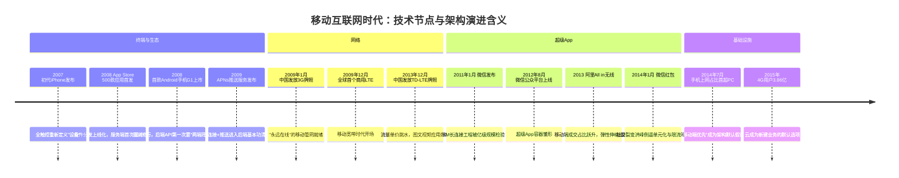
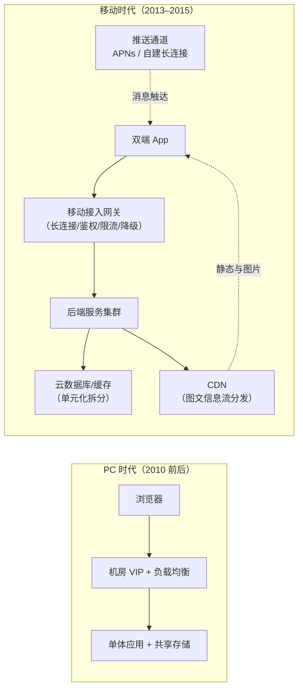

# 移动互联网时代（约 2013–2015）

> 这是 [技术编年史](/chronicle/) 的第一浪。写给两类专业读者：一是入行时架构课已被"弹性、推送、CDN、网关"占满、却没经历过"这些心智从哪来"的年轻后端工程师；二是想复盘"业务增速如何倒逼基础设施"的同行。读完你会得到一张 2007–2015 的关键节点编年表，以及我作为云架构师的一线判断：**移动互联网留给云的第一遗产，不是某项技术，而是"流量不可预测"这个默认假设**。

## 时代坐标：爆发为什么发生在 2013–2015

我入行时赶上的第一个"甲方命题"，是业务增速第一次超过了机房扩容速度。PC 时代也增长，但增长是线性的；移动互联网时代的增长是"上线即峰值"的阶跃式的。把时间窗定在约 2013–2015，是因为三件事在这个窗口同时就位：

- **终端换机完成**：据 Gartner 2014 年 2 月发布的初步统计，2013 年全球智能手机销量约 9.68 亿部、占手机总销量的 53.6%，年度口径下首次超过功能机（Gartner 新闻稿，访问日期 2026-09-02）。智能机第一次成为"大众默认终端"。
- **网络换代到位**：中国 2009 年 1 月发 3G 牌照、2013 年 12 月发 TD-LTE（4G）牌照，2015 年底 4G 用户达 3.86 亿户、占移动电话用户的 29.6%（国家发改委"十二五"回顾引用工信部口径，访问日期 2026-09-02）。流量单价的断崖式下降，让"图片流""视频流"从实验室词汇变成用户日常。
- **超级 App 成型**：微信 2013 年 1 月宣布用户突破 3 亿（据阮一峰整理的公开时间线），2013 年阿里提出"All in 无线"，手机淘宝在当年双十一当天日活跃用户首次突破 1.27 亿（纽约时报中文网报道，访问日期 2026-09-02）。

用户迁移的标志性刻度来自 CNNIC：第 33 次报告（2014 年 1 月发布）给出截至 2013 年底手机网民 5 亿；第 34 次报告（2014 年 7 月发布，数据截至 2014 年 6 月）显示手机网民 5.27 亿、手机上网比例 **83.4% 首次超过传统 PC 整体的 80.9%**。从这一天起，"移动端优先"不再是口号，而是架构设计的前置假设。

**时代的命题**：智能手机普及 + 3G/4G 网络，让"应用"第一次直接触达每个消费者。业务爆发速度第一次超过了自建机房的扩容速度——**"上云"从选择题变成了必答题**。

## 关键节点编年

先看一张编年表（数据口径均在参考资料中可溯源，访问日期 2026-09-02）：

| 时间 | 节点 | 公开数据口径 | 对后端的直接含义 |
| --- | --- | --- | --- |
| 2007-01 | 苹果发布初代 iPhone | "三合一设备"重新定义交互（Apple 新闻稿） | 上网入口开始从 PC 向手掌迁移 |
| 2008-07 | App Store 上线 | 首日 500 款应用（Wikipedia / Apple） | 软件分发上线化：服务端第一次为"亿级设备"供货 |
| 2008-09/10 | 首款安卓机 G1 发布、Android Market 上线 | 2008-09-23 发布、10-22 上市（Wikipedia / Google 官方博客） | 双端原生开发时代开启 |
| 2009-01 | 工信部发放 3 张 3G 牌照 | 移动 TD-SCDMA、联通 WCDMA、电信 CDMA2000 | 中国移动互联网的"管网"就绪 |
| 2009-03 | 苹果发布 APNs 推送服务（iPhone OS 3.0） | iPhone OS 3.0 于 2009-06-17 正式发行（Apple 新闻稿） | "服务器主动找用户"成为标配能力 |
| 2009-12 | TeliaSonera 在斯德哥尔摩/奥斯陆开通全球首个商用 LTE | Wikipedia"4G"条目口径 | 全球 4G 起点 |
| 2011-01 | 微信发布 | 2011-01-21 iOS 版上线（百度百科/人民网） | IM 长连接工程第一次被亿级规模检验 |
| 2012-08 | 微信公众平台上线 | 8 月开放注册并上线（百度百科/36氪） | "App 内 App"的容器化雏形 |
| 2013 | 阿里"All in 无线"；双 11 成交 350.19 亿元 | 手机淘宝当日 DAU 破 1.27 亿（NYT 中文网/中新网） | 弹性伸缩从概念变刚需 |
| 2013-12 | 工信部发放 TD-LTE 牌照（FDD 于 2015-02 发放） | 人民网《4G 发牌平衡术》、百度百科 | 流量成本跳水，图文/视频形态起飞 |
| 2014-01 | 微信红包上线 | 2014-01-27 上线，除夕至初八超 800 万用户参与（百度百科/界面新闻） | 社交裂变式流量洪峰成为新常态 |
| 2014-07 | CNNIC：手机上网比例首超 PC | 83.4% vs 80.9%（第 34 次报告） | 移动端优先成为默认设计假设 |
| 2014-11 | 双 11 成交 571 亿元，无线占比 42.6% | 光明日报；支付宝支付峰值 3.85 万笔/秒（界面新闻转引） | 单元化、弹性、限流降级体系的成人礼 |
| 2015 | 全国 4G 用户达 3.86 亿 | 发改委"十二五"回顾引用工信部口径 | 上云成为新建业务的默认选项 |

三个历史现场，配三张自由版权照片：

*图源：Wikimedia Commons（[来源页](https://commons.wikimedia.org/wiki/File:First_iPhone_Macworld_2007_DSCF1286.agr.jpg)，CC BY-SA 4.0，摄影 ArnoldReinhold）*

*图源：Wikimedia Commons（[来源页](https://commons.wikimedia.org/wiki/File:IPhone_First_Generation.jpg)，CC BY-SA 2.0，摄影 Carl Berkeley）*

*图源：Wikimedia Commons（[来源页](https://commons.wikimedia.org/wiki/File:HTC_Android_T-Mobile_G1.jpg)，CC BY 2.0，摄影 Luis Alberto Arjona Chin）*

## 技术驱动因素：五股力量拧成一股

回头看，这一浪不是"iPhone 一台手机"推动的，而是五股力量在 2013 年前后完成共振（这个判断带我的个人视角，但每股东西都有上面的时间锚点）：

1. **交互革命降低了上网门槛**。多点触控把"会用遥控器就会用手机"变成现实，网民池子从 PC 时代的技术人群扩展到全年龄段。用户数的阶跃直接换算成后端 QPS 的阶跃。
2. **网络代际切换压低了流量单价**。3G 让"手机能上网"成立，4G 让"手机只上网"成立（很多人从此不再连 Wi-Fi）。带宽便宜了，内容形态就重了：图文信息流 → 语音 → 短视频，每一档都把后端存储与 CDN 推向新量级。
3. **应用商店重构了软件分发**。App Store 上线时 500 款应用，十年后突破 200 万款（Apple"App Store 十周年"新闻稿口径）。免费 + 内购的商业模式让开发者第一次能靠"服务"而不是"卖拷贝"活着——服务在后端，于是每个 App 都欠一套 7×24 服务器。
4. **移动支付补上了商业闭环**。2013 年双 11 无线支付 4518 万笔（占比 24%），2014 年移动支付笔数 1.97 亿笔、占比过半，2015 年双 11 支付峰值 8.59 万笔/秒（中新网/界面新闻口径）。能付款的手机才是商业入口，交易洪峰把高并发工程逼到了极限。
5. **资本与创业潮提供了密度**。换机潮 + 移动叙事让热钱涌入，创业公司"没有机房、只有 App"。它们既没有时间自建基础设施，也没有必要——这是公有云最好的获客年代。

## 对云架构的影响：这一浪教会我们的四件事

这是本站视角的重点。今天习以为常的四块心智，都是这一浪打出来的。

### 一、弹性伸缩第一次成为刚需

PC 时代的容量规划是"按季度做预算"；移动时代变成"不知道哪天爆"。我遇到的情况是：推广位一上、应用商店一推荐，流量十分钟内翻十倍是常态。公开的极限样本是双 11——支付峰值从 2009 年的数百笔/秒涨到 2013 年的约 1.3 万笔/秒、2014 年的 3.85 万笔/秒（阿里云开发者社区与界面新闻转引口径，见参考资料）。三年一个数量级，任何自建机房在这个曲线面前都是不经济的。

架构含义：容量从"静态水位"变成"动态能力"。按量付费 + 弹性伸缩组（Auto Scaling）+ 分钟级交付，第一次有了无法拒绝的商业理由。这也是今天 [弹性计算](/cloud/infra/compute) 章节里所有故事的起点。

### 二、长连接与推送改写了后端形态

2009 年苹果发布 APNs 之前，移动端"通知"只有轮询一条路——既费电又费带宽。APNs 确立的"服务端 → 推送通道 → 终端"范式，加上 Android 生态（Google 于 2012 年 3 月推出 Google Cloud Messaging）把推送变成空气一样的基础设施。为了保推送，App 们维持常驻长连接，后端第一次要同时管理亿级连接状态。

架构含义：接入层从"无状态 HTTP 农场"进化为"有状态长连接网关"——连接管理、鉴权、心跳、消息扩散、在线状态，每一项都是新的分布式课题。微信能在 2011–2013 年扛住亿级用户的即时通讯，本质是一场长连接工程胜利（公开技术复盘很多，此处不展开）。对今天做 [微服务治理](/cloud/native/microservice) 的同学，这是"API 网关 + 消息"心智的源头。

### 三、图文信息流带火了 CDN 的第二春

PC 时代的 CDN 主要伺候下载与视频站点；移动时代，"打开 App 就是图片流"（朋友圈、微博、电商详情）让中小图、高频、碎片化请求成为主流。再叠加 2013 年前后 HTTPS 在移动端普及，CDN 节点被迫做起了证书卸载、图片压缩、自适应分辨率这些"内容工程"。带宽成本的曲线，就是这一浪之后从"最贵的成本项"慢慢变成"可优化的成本项"——也为下一浪 [直播时代](/chronicle/livestream) 的"带宽即成本"埋了伏笔。

架构含义：动静分离、回源保护、图片处理管线，成为每个移动后端的标准三件套（详见 [云网络](/cloud/infra/network)）。我当时的经验边界是：多数中小团队做不好 CDN 调度，"上云用托管 CDN"是压倒性的性价比选择。

### 四、数据库上云：一场被迫完成的信任建设

移动业务对数据库的压力是三重的：洪峰并发、快速迭代（表结构周周变）、以及"不能丢单"。双 11 把支付宝的"去 IOE"与 LDC 单元化改造从内部工程推成了行业叙事（环信等公开技术复盘有完整时间线）；而对岸的广大创业公司，路径朴素得多——直接用云 RDS。第一次把核心库搬上云，甲方要的不是性能，是三样东西：自动备份、主备容灾、可审计的访问控制。信任就是这么一分一分挣来的（方法论沉淀见 [上云迁移方法论](/methodology/cloud-migration) 与 [高可用与容灾设计](/methodology/ha-dr)）。

架构含义：这一浪确立了上云的"正确姿势"——先非核心、后核心，先可逆、后不可逆。这条路径在后面的每一浪里被反复复用。

### 技术栈记忆（一页速览）

- 应用：原生 App 双端开发（iOS/Android），后端 LAMP/Java 单体起步，"App 改了接口，服务端不敢停"是日常
- 基础设施：从物理机房托管（IDC）到第一批公有云主机；云主机 = "能按月租的服务器"，是当年最朴素的价值主张
- 标志性能力：弹性伸缩开始被真正需要——运营活动秒级流量洪峰，逼出了"按量付费"的心智

## 一线回望与沉淀

**App 上线即峰值。**印象最深的一类现场：推广带来的不可预测流量逼出"弹性"意识。客户凌晨扩容是常事，"能自动扩"和"要手动改工单"是两代产品的分水岭。那几年我学到的最重要一课：移动时代的不确定性是结构性的，架构的目标不是消灭洪峰，而是让洪峰的成本可控。

**第一次把数据库搬上云。**备份、容灾、安全的信任建立过程，比技术切换本身长得多。我们的做法是把信任拆成可验证清单：能不能任意时间点恢复？主库挂了切换要不要人肉介入？谁能直连生产库？每一条有演示，才算过关。

**压测文化从拍脑袋到数据驱动。**运营活动压测是这一浪养成的习惯：活动前全链路压测、给流量估值、定限流阈值。容量评估第一次有了"数据口径"这个词，而不是"老师傅的手感"。

**兴衰逻辑。**为什么兴起：终端 + 网络 + 资本三要素共振，创业公司没有时间自建；留下了什么：云成为默认选项，DevOps、弹性、按量付费的心智奠基；为什么让位：智能手机渗透率在 2015 年前后逼近天花板，流量红利见顶，竞争焦点从"有没有 App"转向"体验与内容形态"——注意力经济把接力棒交给了 [直播](/chronicle/livestream) 与 [短视频](/chronicle/short-video)。

**对今天的启示。**每一浪的起点都是"基础设施跟不上业务增速"；这一浪如此，AI 大模型浪亦然（算力供需缺口见 [AI 大模型时代](/chronicle/ai-era)）。而上云的正确姿势从未改变：先非核心、后核心，先可逆、后不可逆。移动互联网留下的最大遗产，是让"云"从一个成本话题，变成了工程师的职业默认技能。

## 站内相关

- [技术编年史总纲：十年六浪](/chronicle/) — 本浪在六浪周期中的位置
- [直播时代](/chronicle/livestream) — 直接继承本浪 CDN 与带宽衣钵的下一浪
- [弹性计算](/cloud/infra/compute) — 本浪"弹性心智"的当代展开
- [上云迁移方法论](/methodology/cloud-migration) — "先非核心、后核心"的系统化方法
- [高可用与容灾设计](/methodology/ha-dr) — 数据库上云信任建设的工程化解法
- [云计算基座导读](/cloud/foundation/) — 产业史背景另见《云计算的全球变局与中国故事》

## 参考资料

> 以下为文字与图片来源全集，访问日期均为 2026-09-02。

**终端与生态**

1. [Apple Reinvents the Phone with iPhone（Apple Newsroom，2007-01-09）](https://www.apple.com/newsroom/2007/01/09Apple-Reinvents-the-Phone-with-iPhone/) — 初代 iPhone 官方发布稿
2. [App Store (Apple)（Wikipedia）](https://en.wikipedia.org/wiki/App_Store_(Apple)) — 2008-07-10 上线、首日 500 款应用
3. [The App Store turns 10（Apple Newsroom，2018-07）](https://www.apple.com/newsroom/2018/07/app-store-turns-10/) — App Store 十周年官方回顾
4. [HTC Dream（Wikipedia）](https://en.wikipedia.org/wiki/HTC_Dream) — 首款商用 Android 手机，2008-09-23 发布、10-22 上市
5. [Android Market: Now available for users（Android Developers Blog，2008-10）](https://android-developers.googleblog.com/2008/10/android-market-now-available-for-users.html) — Android Market 上线公告
6. [Apple Previews Developer Beta of iPhone OS 3.0（Apple Newsroom，2009-03-17）](https://www.apple.com/newsroom/2009-03-17Apple-Previews-Developer-Beta-of-iPhone-OS-3-0/) — APNs 推送服务首次官宣
7. [Gartner Says Annual Smartphone Sales Surpassed Sales of Feature Phones for the First Time in 2013（Gartner 新闻稿，2014-02-13，Pressebox 存档）](https://www.pressebox.com/pressrelease/gartner-uk-ltd/gartner-says-annual-smartphone-sales-surpassed-sales-of-feature-phones-for-the-first-time-in-2013/boxid/658123) — 2013 智能手机销量 9.68 亿部/53.6%

**网络代际**

8. [1G到5G，我国移动通信发展里程碑（C114 通信网）](https://m.c114.com.cn/w2935-1094983.html) — 2009-01-07 三张 3G 牌照；另见 [3G商用牌照（百度百科）](https://baike.baidu.com/item/3G%E5%95%86%E7%94%A8%E7%89%8C%E7%85%A7/2281048) 与 [TD式创新（财新周刊，2014-12）](https://weekly.caixin.com/m/2014-12-05/100759605_all.html)
9. [4G（Wikipedia）](https://en.wikipedia.org/wiki/4G) — 2009-12-14 TeliaSonera 全球首个商用 LTE 网络
10. [4G发牌平衡术（人民网《民生周刊》，2013-12-09）](https://paper.people.com.cn/mszk/html/2013-12/09/content_1361585.htm) — 2013-12-04 三张 TD-LTE 牌照；FDD 2015-02 发放另见 [4G牌照（百度百科）](https://baike.baidu.com/item/4G%E7%89%8C%E7%85%A7/4520324)
11. [“十二五”期间宽带运营业发展回顾（国家发展改革委）](https://www.ndrc.gov.cn/xwdt/gdzt/xyqqd/201708/t20170802_1197809_ext.html) — 2015 年 4G 用户 2.89 亿净增、达 3.86 亿户（工信部口径）

**用户规模与超级 App**

12. [第34次《中国互联网络发展状况统计报告》（CNNIC，国家网信办转载，2014-07）](https://www.cac.gov.cn/2014-07/22/c_1111724470.htm) — 手机网民 5.27 亿、手机上网比例 83.4% 首超 PC 80.9%；第 33 次（5 亿）见 [中国教育和科研计算机网报道](https://www.cernet.edu.cn/ke_yan_yu_fa_zhan/kexuetansuo/zui_xin_dong_tai/IT_kuai_xun/201401/t20140121_1066780.shtml)
13. [微信的历史（阮一峰的网络日志，2018-08）](https://www.ruanyifeng.com/blog/2018/08/weixin.html) — 2011-01-21 发布、2012-03 破 1 亿、2013-01-15 破 3 亿
14. [微信10年（人民网《中国经济周刊》，2021-01-30）](https://paper.people.com.cn/zgjjzk/html/2021-01/30/content_3043670.htm) — 公众平台、朋友圈等里程碑
15. [微信红包（百度百科）](https://baike.baidu.com/item/%E5%BE%AE%E4%BF%A1%E7%BA%A2%E5%8C%85/13007189) — 2014-01-27 上线；另见 [当年春节的那场改变之战（界面新闻）](https://www.jiemian.com/article/3908254.html)
16. [“双十一”淘宝总交易额达350.19亿 53.5亿来自手机淘宝（中国新闻网，2013-11-12）](https://www.chinanews.com.cn/fortune/2013/11-12/5491698.shtml) — 2013 双 11 大盘与无线支付 4518 万笔；NYT 中文网 [阿里"双十一"：血拼狂欢背后的变革](https://cn.nytimes.com/technology/20131122/tc22wangshanshan/) — 手机淘宝 DAU 1.27 亿；All in 无线背景另见 [无线淘宝（百度百科）](https://baike.baidu.com/item/%E6%97%A0%E7%BA%BF%E6%B7%98%E5%AE%9D/10254437)
17. [天猫"双十一"总成交额达571亿元（光明日报，2014-11-12）](https://epaper.gmw.cn/gmrb/html/2014-11/12/nw.D110000gmrb_20141112_3-12.htm) — 2014 双 11 无线成交 243 亿、占比 42.6%
18. [蚂蚁搬山（界面新闻）](https://www.jiemian.com/article/449117.html) — 支付峰值序列：2013 约 1.3 万笔/秒 → 2014 3.85 万笔/秒 → 2015 8.59 万笔/秒；另见 [11年天猫双11对支付宝技术有什么意义？（阿里云开发者社区）](https://developer.aliyun.com/article/726904) 与 [支付宝撑起"双十一"总支付笔数达1.88亿（支付宝官微存档，亿邦动力转载）](https://www.ebrun.com/20131112/85514.shtml)
19. [一文看懂支付宝历年双十一背后的技术揭秘（环信，公开转载）](https://www.easemob.com/news/3579) — 去 IOE 与 LDC 单元化改造的公开技术复盘

**配图来源（均为自由版权，已按站内规范缩放）**

20. [File:First iPhone Macworld 2007 DSCF1286.agr.jpg（Wikimedia Commons，CC BY-SA 4.0，ArnoldReinhold）](https://commons.wikimedia.org/wiki/File:First_iPhone_Macworld_2007_DSCF1286.agr.jpg)
21. [File:IPhone First Generation.jpg（Wikimedia Commons，CC BY-SA 2.0，Carl Berkeley）](https://commons.wikimedia.org/wiki/File:IPhone_First_Generation.jpg)
22. [File:HTC Android T-Mobile G1.jpg（Wikimedia Commons，CC BY 2.0，Luis Alberto Arjona Chin）](https://commons.wikimedia.org/wiki/File:HTC_Android_T-Mobile_G1.jpg)

> 数据口径说明：智能手机销量为 Gartner 2014-02 新闻稿；网民与手机网民为 CNNIC 历次《中国互联网络发展状况统计报告》；4G 用户为工信部口径（经国家发改委"十二五"回顾转引）；双 11 交易额与支付峰值为阿里巴巴公开披露（经官方媒体与开发者社区转引）。本文案例均已按站点合规要求泛化处理。
