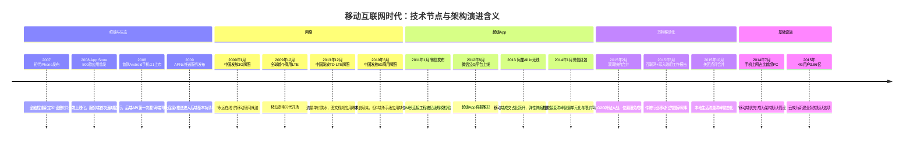
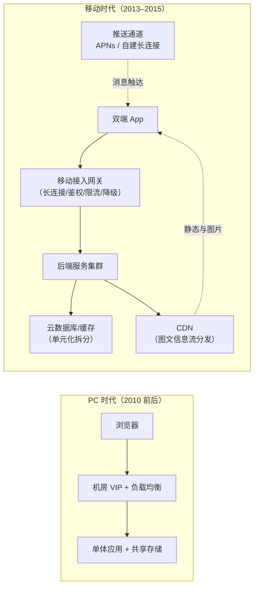
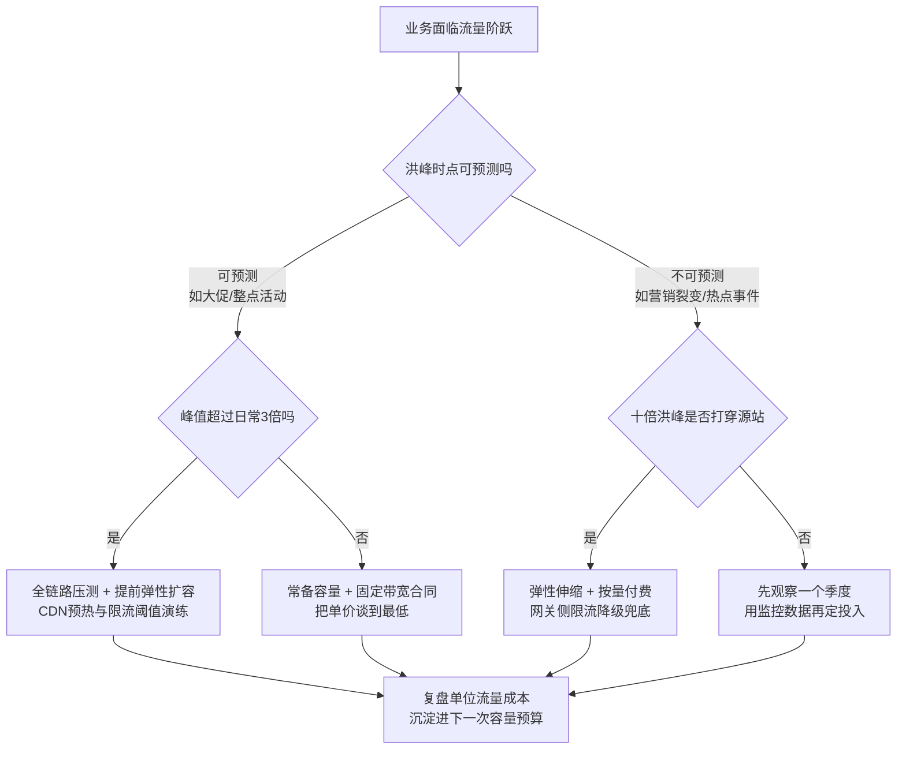

# 移动互联网时代（约 2013–2015）

> 这是 [技术编年史](/chronicle/) 的第一浪。写给两类专业读者：一是入行时架构课已被"弹性、推送、CDN、网关"占满、却没经历过"这些心智从哪来"的年轻后端工程师；二是想复盘"业务增速如何倒逼基础设施"的同行。读完你会得到：一张 2007–2015 的关键节点编年表，一条"终端—网络—超级 App"三阶段因果链，一组从 2006 年 1300 万手机网民到 2025 年 11.23 亿网民的完整数据曲线，以及我作为云架构师的一线判断：**移动互联网留给云的第一遗产，不是某项技术，而是"流量不可预测"这个默认假设**。全文主线只有一条——业务增速第一次跑赢机房扩容速度之后，整个行业的技术选型、成本结构与组织习惯被如何永久改写。

## 时代坐标：爆发为什么发生在 2013–2015

我入行时赶上的第一个"甲方命题"，是业务增速第一次超过了机房扩容速度。PC 时代也增长，但增长是线性的；移动互联网时代的增长是"上线即峰值"的阶跃式的。把时间窗定在约 2013–2015，是因为三件事在这个窗口同时就位：

- **终端换机完成**：据 Gartner 2014 年 2 月发布的初步统计，2013 年全球智能手机销量约 9.68 亿部、占手机总销量的 53.6%，年度口径下首次超过功能机（Gartner 新闻稿，访问日期 2026-09-05）。智能机第一次成为"大众默认终端"。
- **网络换代到位**：中国 2009 年 1 月发 3G 牌照、2013 年 12 月发 TD-LTE（4G）牌照，2015 年底 4G 用户达 3.86 亿户、占移动电话用户的 29.6%（国家发改委"十二五"回顾引用工信部口径，访问日期 2026-09-05）。流量单价的断崖式下降，让"图片流""视频流"从实验室词汇变成用户日常。
- **超级 App 成型**：微信 2013 年 1 月宣布用户突破 3 亿（据阮一峰整理的公开时间线），2013 年阿里提出"All in 无线"，手机淘宝在当年双十一当天日活跃用户首次突破 1.27 亿（纽约时报中文网报道，访问日期 2026-09-05）。

用户迁移的标志性刻度来自 CNNIC：第 33 次报告（2014 年 1 月发布）给出截至 2013 年底手机网民 5 亿；第 34 次报告（2014 年 7 月发布，数据截至 2014 年 6 月）显示手机网民 5.27 亿、手机上网比例 **83.4% 首次超过传统 PC 整体的 80.9%**。从这一天起，"移动端优先"不再是口号，而是架构设计的前置假设。

把镜头再拉远一点，这条曲线的起点其实更早：CNNIC 第 55 次报告在"中国互联网 30 年"回顾章节里记了一笔——**2006 年 6 月，《中国互联网络发展状况统计报告》首次公布中国手机网民数量：1300 万**。从 1300 万到 11.05 亿（2024 年 12 月手机网民规模，第 55 次报告口径），十八年放大近 85 倍。这条 S 曲线最陡的一段，就落在本文的时间窗里。

**时代的命题**：智能手机普及 + 3G/4G 网络，让"应用"第一次直接触达每个消费者。业务爆发速度第一次超过了自建机房的扩容速度——**"上云"从选择题变成了必答题**。

## 三个幕次：一场十年长波的分解

编年史最容易犯的错，是把十年压成一年。移动互联网不是 2013 年凭空出现的，它是一场分三幕演出的长波，每一幕都回答了"发生了什么→为什么是这时→留下了什么遗产"这三个问题：

| 幕次 | 时间窗 | 核心事件 | 为什么是这时 | 留给基础设施的遗产 |
| --- | --- | --- | --- | --- |
| 第一幕：终端与生态 | 2007–2010 | iPhone、App Store、Android G1 | 触控/芯片/电池三曲线交汇，WAP 时代养成的需求在等更好的终端 | 软件服务化分发、推送与长连接基本功 |
| 第二幕：网络与超级 App | 2011–2013 | 微信崛起、3G 连续覆盖、4G 发牌 | 基站覆盖过临界点 + 千元智能机换机潮 | 亿级长连接工程、弹性伸缩、容器化雏形 |
| 第三幕：万物移动化 | 2014–2016 | 红包、O2O 合并潮、"互联网+"、手机占比超 PC | 4G 用户爆发 + 支付闭环 + 资本补贴 | 单元化与全链路压测、降级设计、云成为默认 |

### 第一幕：终端与生态（2007–2010）——"设备"被重新定义

**发生了什么**：2007 年 1 月苹果发布初代 iPhone，用"三合一设备"（iPod + 手机 + 上网终端）重新定义了手机；2008 年 App Store 上线（首日 500 款应用）与首款 Android 手机 G1 上市，确立了此后十五年的双端格局。

**为什么是这时**：多点触控、ARM 芯片性能、锂电池能量密度三条硬件曲线在 2007 年前后交汇；更关键的是，2G/2.5G 网络已经养出了"手机上网"的习惯（中国 2006 年就有 1300 万手机网民，主力是 WAP 阅读和 QQ），需求侧早就在等一个更好的终端。

**留下了什么遗产**：软件分发从"卖拷贝"变成"上架 + 服务"，每个 App 背后第一次欠下一套 7×24 的服务器；"推送"（APNs，2009）把服务器从"被动应答"改造成"主动触达"。这两件事定义了移动后端的基本盘。

*图源：Wikimedia Commons（[来源页](https://commons.wikimedia.org/wiki/File:Steve_Jobs_presents_iPhone_(cropped).jpg)，CC BY 2.0）*

### 第二幕：网络与超级 App（2011–2013）——"永远在线"成为默认

**发生了什么**：中国 2009 年发 3G 牌照后，移动网络第一次"能用"；2011 年微信发布，2012 年公众平台上线，2013 年用户破 3 亿；2013 年阿里"All in 无线"；2013 年 12 月 4G（TD-LTE）牌照发放。

**为什么是这时**：3G 基站覆盖在 2011–2012 年达到"城市连续覆盖"的临界点，流量资费跌到大众可负担；智能机千元化（联发科交钥匙方案 + 国产厂商）让换机人群从极客扩展到全民。终端与网络同时到位，超级 App 才有生长的土壤——微信恰好是把"长连接、推送、二维码、语音"这些移动原生能力打包成一个入口的第一名。

**留下了什么遗产**：IM 长连接工程被亿级规模检验（微信 2011 年底 5000 万用户、2012 年 3 月破 1 亿、2013 年 1 月破 3 亿，据中文维基百科"微信"词条整理的公开时间线）；"App 内 App"的容器化雏形（公众号）出现；弹性伸缩从概念变成刚需（2013 双 11 成交 350.19 亿元）。

### 第三幕：万物移动化（2014–2016）——线上流量重塑线下行业

**发生了什么**：2014 年 1 月微信红包上线，除夕至初八超 800 万用户参与；2014 年 7 月 CNNIC 口径手机上网比例首超 PC；2014 年 11 月双 11 成交 571 亿元、无线占比 42.6%；2015 年 2 月滴滴与快的合并、10 月美团与大众点评合并，O2O 补贴大战把移动支付和位置服务打进出租车、餐馆、影院；2015 年 3 月"互联网+"写入政府工作报告（据中文维基百科"互联网+"词条，2015 年 3 月 5 日十二届全国人大三次会议开幕会）。

**为什么是这时**：4G 用户一年内净增到 3.86 亿，视频与高频服务有了带宽基础；移动支付补上商业闭环后，资本发现"补贴能买来交易习惯"，于是把钱烧向了所有线下场景。这一幕的本质是：移动互联网从"内容与服务上网"升级为"交易与行业上网"。

**留下了什么遗产**：单元化、全链路压测、限流降级成为大厂标配并向全行业溢出；二维码支付成为国民习惯；更重要的是，创业公司"没有机房、只有 App"成为常态——这是公有云在中国市场真正的获客年代。

## 关键节点编年

先看一张编年表（数据口径均在参考资料中可溯源，访问日期 2026-09-05）：

| 时间 | 节点 | 公开数据口径 | 对后端的直接含义 |
| --- | --- | --- | --- |
| 2006-06 | CNNIC 首次公布手机网民数量 | 1300 万（第 55 次报告 30 年回顾章节） | "手机上网"作为统计口径诞生 |
| 2007-01 | 苹果发布初代 iPhone | "三合一设备"重新定义交互（Apple 新闻稿） | 上网入口开始从 PC 向手掌迁移 |
| 2008-07 | App Store 上线 | 首日 500 款应用（Wikipedia / Apple） | 软件分发上线化：服务端第一次为"亿级设备"供货 |
| 2008-09/10 | 首款安卓机 G1 发布、Android Market 上线 | 2008-09-23 发布、10-22 上市（Wikipedia / Google 官方博客） | 双端原生开发时代开启 |
| 2009-01 | 工信部发放 3 张 3G 牌照 | 移动 TD-SCDMA、联通 WCDMA、电信 CDMA2000 | 中国移动互联网的"管网"就绪 |
| 2009-03 | 苹果发布 APNs 推送服务（iPhone OS 3.0） | iPhone OS 3.0 于 2009-06-17 正式发行（Apple 新闻稿） | "服务器主动找用户"成为标配能力 |
| 2009-12 | TeliaSonera 在斯德哥尔摩/奥斯陆开通全球首个商用 LTE | Wikipedia"4G"条目口径 | 全球 4G 起点 |
| 2011-01 | 微信发布 | 2011-01-21 iOS 版上线（百度百科/人民网） | IM 长连接工程第一次被亿级规模检验 |
| 2012-08 | 微信公众平台上线 | 8 月开放注册并上线（百度百科/36氪） | "App 内 App"的容器化雏形 |
| 2013 | 阿里"All in 无线"；双 11 成交 350.19 亿元 | 手机淘宝当日 DAU 破 1.27 亿（NYT 中文网/中新网） | 弹性伸缩从概念变刚需 |
| 2013-09 | 微软宣布 72 亿美元收购诺基亚手机业务 | 54.4 亿欧元，2014-04-25 交割（中文维基百科"诺基亚"词条） | 功能机王朝正式落幕 |
| 2013-12 | 工信部发放 TD-LTE 牌照（FDD 于 2015-02 发放） | 人民网《4G 发牌平衡术》、百度百科 | 流量成本跳水，图文/视频形态起飞 |
| 2014-01 | 微信红包上线 | 2014-01-27 上线，除夕至初八超 800 万用户参与（百度百科/界面新闻） | 社交裂变式流量洪峰成为新常态 |
| 2014-07 | CNNIC：手机上网比例首超 PC | 83.4% vs 80.9%（第 34 次报告） | 移动端优先成为默认设计假设 |
| 2014-11 | 双 11 成交 571 亿元，无线占比 42.6% | 光明日报；支付宝支付峰值 3.85 万笔/秒（界面新闻转引） | 单元化、弹性、限流降级体系的成人礼 |
| 2015-02 | 滴滴打车与快的打车合并 | 2015-02-14 宣布（中文维基百科"滴滴出行"词条） | 出行 O2O 进入平台级洪峰时代 |
| 2015-03 | "互联网+"写入政府工作报告 | 十二届全国人大三次会议（中文维基百科"互联网+"词条） | 传统行业移动化获得国家级叙事 |
| 2015-10 | 美团与大众点评合并 | 2015-10-08 宣布，更名美团点评（中文维基百科"美团"词条） | 本地生活成为移动流量最大消耗方之一 |
| 2015 | 全国 4G 用户达 3.86 亿 | 发改委"十二五"回顾引用工信部口径 | 上云成为新建业务的默认选项 |
| 2019-06 | 工信部发放 5G 商用牌照 | 2019-06-06，四张牌照（中文维基百科"5G"词条） | 本浪的"续集"开场，见下文第五节 |

六个历史现场，配六张自由版权照片：

*图源：Wikimedia Commons（[来源页](https://commons.wikimedia.org/wiki/File:First_iPhone_Macworld_2007_DSCF1286.agr.jpg)，CC BY-SA 4.0，摄影 ArnoldReinhold）*

*图源：Wikimedia Commons（[来源页](https://commons.wikimedia.org/wiki/File:IPhone_First_Generation.jpg)，CC BY-SA 2.0，摄影 Carl Berkeley）*

*图源：Wikimedia Commons（[来源页](https://commons.wikimedia.org/wiki/File:HTC_Android_T-Mobile_G1.jpg)，CC BY 2.0，摄影 Luis Alberto Arjona Chin）*

*图源：Wikimedia Commons（[来源页](https://commons.wikimedia.org/wiki/File:Nokia_3310_grey_front_(tidied_and_enhanced).jpg)，CC BY-SA 4.0，摄影 Multicherry）*

## 另一半故事：功能机王朝的坍塌

编年史不能只写赢家。这一浪的另一半，是诺基亚的十四年霸权如何在六年内归零——理解坍塌的速度，才能理解阶跃式流量对基础设施的冲击力从何而来。

据中文维基百科"诺基亚"词条整理的公开时间线：诺基亚 1997 年击败摩托罗拉登上全球手机销量榜首，此后连续蝉联 14 年；2000 年巅峰期市值近 2500 亿美元。转折发生在 2011 年：第二季度销量被苹果与三星双双超越；同年 2 月放弃 Symbian 与 MeeGo、独注微软 Windows Phone；2013 年 9 月 3 日，微软宣布以 54.4 亿欧元（约 72 亿美元）收购诺基亚手机制造、设备与服务业务；2014 年 4 月交割，10 月品牌更名 Microsoft Lumia——一个时代正式落幕。

陪葬名单不止诺基亚：黑莓的全键盘商务机在触屏化浪潮里失去存在理由，HTC 作为首款 Android 手机的制造商在 2013 年后迅速掉队（此处为行业公认叙事的一般性描述，不展开数据）。王朝更替的速度给基础设施侧留下了一个反直觉的推论：**终端厂商的生死与流量增长的曲线几乎无关**——2011–2013 年正是诺基亚崩塌的三年，也是中国手机网民从 3 亿级冲向 5 亿的三年。流量的确定性增长与终端的剧烈洗牌同时发生，这正是"押注基础设施比押注硬件品牌更安全"的历史依据，也是云厂商在那几年敢于激进扩容的底层信心。

我当年在一线看到的因果链很朴素：功能机时代，"上网"是运营商门户（WAP）的增值业务，流量小、可预测、由运营商计费网关兜底；智能机时代，流量入口变成 App，内容形态从 KB 级文本跳到 MB 级图片、再跳到百 MB 级视频，而用户的付费模式从"按 KB"变成"包月不限量"。**需求曲线垂直拉起、供给曲线（带宽资费）快速下压，中间的剪刀差全部由基础设施承接**——机房承接不了的，就变成了云厂商的收入。

## 技术驱动因素：五股力量拧成一股

回头看，这一浪不是"iPhone 一台手机"推动的，而是五股力量在 2013 年前后完成共振（这个判断带我的个人视角，但每股东西都有上面的时间锚点）：

1. **交互革命降低了上网门槛**。多点触控把"会用遥控器就会用手机"变成现实，网民池子从 PC 时代的技术人群扩展到全年龄段。用户数的阶跃直接换算成后端 QPS 的阶跃。
2. **网络代际切换压低了流量单价**。3G 让"手机能上网"成立，4G 让"手机只上网"成立（很多人从此不再连 Wi-Fi）。带宽便宜了，内容形态就重了：图文信息流 → 语音 → 短视频，每一档都把后端存储与 CDN 推向新量级。
3. **应用商店重构了软件分发**。App Store 上线时 500 款应用，十年后突破 200 万款（Apple"App Store 十周年"新闻稿口径）。免费 + 内购的商业模式让开发者第一次能靠"服务"而不是"卖拷贝"活着——服务在后端，于是每个 App 都欠一套 7×24 服务器。
4. **移动支付补上了商业闭环**。2013 年双 11 无线支付 4518 万笔（占比 24%），2014 年移动支付笔数 1.97 亿笔、占比过半，2015 年双 11 支付峰值 8.59 万笔/秒（中新网/界面新闻口径）。能付款的手机才是商业入口，交易洪峰把高并发工程逼到了极限。
5. **资本与创业潮提供了密度**。换机潮 + 移动叙事让热钱涌入，创业公司"没有机房、只有 App"。它们既没有时间自建基础设施，也没有必要——这是公有云最好的获客年代。

## 网络代际的节奏：3G、4G、5G 各自完成了什么

本站是技术站，这条线索值得单独立一节：**每一代移动通信技术都在中国完成了一次"基建先行、应用后至"的演出**，而应用爆发的时滞，恰好是架构师做技术储备的窗口期。

| 代际 | 中国牌照/商用节点 | 规模刻度（公开口径） | 撑起的内容形态 | 对基础设施的要求 |
| --- | --- | --- | --- | --- |
| 3G | 2009-01 三张牌照（TD-SCDMA/WCDMA/CDMA2000） | 2006 年手机网民仅 1300 万 → 2013 年底 5 亿（CNNIC） | 图文 WAP→App、语音消息、二维码 | 接入网关、推送通道、图片 CDN |
| 4G | 2013-12 TD-LTE 牌照；2015-02 FDD 牌照 | 2015 年底用户 3.86 亿（工信部口径，发改委转引） | 视频信息流、直播、移动支付、O2O | 弹性伸缩、对象存储、视频转码、单元化 |
| 5G | 2019-06-06 商用牌照；2019-10 三大运营商放号；2022-06 中国广电入网 | 2022-07 基站 196.8 万、5G 用户 4.75 亿（工信部，中文维基百科"5G"词条转引）；2025-06 基站 455 万（CNNIC 第 56 次报告） | 未见 C 端"杀手级应用"，被短视频/直播存量吸收；主战场转向行业侧 | 边缘计算、大上行（生产侧）、网络切片（行业侧） |

*图源：Wikimedia Commons（[来源页](https://commons.wikimedia.org/wiki/File:LteMimoAntennen.jpg)，CC BY 3.0，BAZ Spezialantennen）*

三个判断，标明经验边界：

先补一个政策锚点：**流量资费的下探不只是市场行为，2015 年起还有国家意志**——国务院办公厅 2015 年 5 月印发《关于加快高速宽带网络建设推进网络提速降费的指导意见》（国办发〔2015〕41 号），此后"提速降费"连续多年写入专项行动（2018、2019 年工信部与国资委均有专项实施意见，见参考资料）。对架构师的意义是：**带宽成本的下降曲线在 2015 年之后是"政策保底"的**，这直接决定了视频类应用的立项模型——你敢在商业计划里假设"明年流量单价再降三成"，是因为有政策文件兜底。

- **3G 的价值被低估了**。多数人把移动互联网的起点记在 4G，但没有 3G 时代（2009–2013）养成的 5 亿手机网民、跑通的 App 分发与支付闭环，4G 放开的只是"更快的存量"。3G 解决"有没有"，4G 解决"重不重"。
- **5G 对 C 端是"没有新浪的浪"**。发牌六年多、基站 455 万（全球最大 5G 网络，"乡乡通 5G"、行政村通 5G 比例超 90%，CNNIC 第 56 次报告口径），但 C 端始终没有出现 4G 之于短视频那样的独占形态——原因在我看来很简单：4G 的 100Mbps 已经把"个人眼球消费"的带宽需求喂饱了，5G 的增量能力（大连接、低时延、大上行）天然指向行业侧而非消费侧。这一判断的验证窗口在车联网与具身智能，不在手机。
- **流量总量仍在陡峭增长，但增长引擎换了**。工信部口径的移动互联网接入流量从 2020 年的 1656 亿 GB 涨到 2024 年前 11 个月的 3066 亿 GB（CNNIC 第 55 次报告图表数据），2025 年上半年移动用户上网流量连续 6 个月两位数增长（第 56 次报告）。终端红利见顶之后，流量增长靠的是单用户时长与内容形态加重——这正是 [直播](/chronicle/livestream) 与 [短视频](/chronicle/short-video) 两浪接棒的原因。

## 对云架构的影响：这一浪教会我们的五件事

这是本站视角的重点。今天习以为常的五块心智，都是这一浪打出来的。

### 一、弹性伸缩第一次成为刚需

PC 时代的容量规划是"按季度做预算"；移动时代变成"不知道哪天爆"。我遇到的情况是：推广位一上、应用商店一推荐，流量十分钟内翻十倍是常态。公开的极限样本是双 11——支付峰值从 2009 年的数百笔/秒涨到 2013 年的约 1.3 万笔/秒、2014 年的 3.85 万笔/秒（阿里云开发者社区与界面新闻转引口径，见参考资料）。三年一个数量级，任何自建机房在这个曲线面前都是不经济的。

架构含义：容量从"静态水位"变成"动态能力"。按量付费 + 弹性伸缩组（Auto Scaling）+ 分钟级交付，第一次有了无法拒绝的商业理由。这也是今天 [弹性计算](/cloud/infra/compute) 章节里所有故事的起点。

### 二、长连接与推送改写了后端形态

2009 年苹果发布 APNs 之前，移动端"通知"只有轮询一条路——既费电又费带宽。APNs 确立的"服务端 → 推送通道 → 终端"范式，加上 Android 生态（Google 于 2012 年 3 月推出 Google Cloud Messaging）把推送变成空气一样的基础设施。为了保推送，App 们维持常驻长连接，后端第一次要同时管理亿级连接状态。

架构含义：接入层从"无状态 HTTP 农场"进化为"有状态长连接网关"——连接管理、鉴权、心跳、消息扩散、在线状态，每一项都是新的分布式课题。微信能在 2011–2013 年扛住亿级用户的即时通讯，本质是一场长连接工程胜利（公开技术复盘很多，此处不展开）。对今天做 [微服务治理](/cloud/native/microservice) 的同学，这是"API 网关 + 消息"心智的源头。

### 三、图文信息流带火了 CDN 的第二春

PC 时代的 CDN 主要伺候下载与视频站点；移动时代，"打开 App 就是图片流"（朋友圈、微博、电商详情）让中小图、高频、碎片化请求成为主流。再叠加 2013 年前后 HTTPS 在移动端普及，CDN 节点被迫做起了证书卸载、图片压缩、自适应分辨率这些"内容工程"。带宽成本的曲线，就是这一浪之后从"最贵的成本项"慢慢变成"可优化的成本项"——也为下一浪 [直播时代](/chronicle/livestream) 的"带宽即成本"埋了伏笔。

架构含义：动静分离、回源保护、图片处理管线，成为每个移动后端的标准三件套（详见 [云网络](/cloud/infra/network)）。我当时的经验边界是：多数中小团队做不好 CDN 调度，"上云用托管 CDN"是压倒性的性价比选择。

### 四、数据库上云：一场被迫完成的信任建设

移动业务对数据库的压力是三重的：洪峰并发、快速迭代（表结构周周变）、以及"不能丢单"。双 11 把支付宝的"去 IOE"与 LDC 单元化改造从内部工程推成了行业叙事（环信等公开技术复盘有完整时间线）；而对岸的广大创业公司，路径朴素得多——直接用云 RDS。第一次把核心库搬上云，甲方要的不是性能，是三样东西：自动备份、主备容灾、可审计的访问控制。信任就是这么一分一分挣来的。

架构含义：这一浪确立了上云的"正确姿势"——先非核心、后核心，先可逆、后不可逆。这条路径在后面的每一浪里被反复复用。

### 五、O2O 补贴大战：极端场景下的洪峰工程

2015 年前后的出行与外卖大战，把"营销洪峰"推到了新高度：补贴规则一改，订单量当天翻几倍；红包与立减带来的不是平滑增长，而是整点脉冲。滴滴快的合并（2015-02）与美团点评合并（2015-10）之后，头部平台的早晚高峰调度、动态定价、实时结算全部要在移动洪峰下保持在线——这是"离线大数据 + 在线服务"混合负载第一次在消费互联网里成为常态（承接 [大数据体系](/cloud/data/bigdata) 的建设潮）。

架构含义：限流、降级、熔断从"大厂内部黑话"变成全行业的保命件；消息队列削峰、缓存前置、异步化改造成为移动后端的三板斧。我遇到的情况是，那两年最常被问的方案问题不是"怎么扛住峰值"，而是"扛不住的时候先丢什么"——优雅降级的设计优先级第一次超过了扩容本身。

### 一组时代刻度计：双 11 支付峰值曲线

如果只允许留一条曲线来度量这一浪对基础设施的冲击，我会留双 11 的支付峰值。公开口径整理如下（来源见参考资料：阿里云开发者社区《11年天猫双11对支付宝技术有什么意义？》、界面新闻《蚂蚁搬山》、光明日报、中新网）：

| 年份 | 大盘与无线口径 | 支付/处理峰值（公开披露） | 当年被逼出来的关键技术 |
| --- | --- | --- | --- |
| 2009 | 第一届双 11，淘宝商城成交额较平日激增 10 倍 | 数百笔/秒 | 第一代对账系统、SOA 改造 |
| 2012 | 单日交易 1 亿笔 | 支付能力从百万级/日升到亿级/日 | 自研负载均衡 Spanner、多 IDC 拆分 |
| 2013 | 成交 350.19 亿元，其中手机淘宝 53.5 亿 | 约 1.3 万笔/秒 | LDC 单元化落地，"理论上无限伸缩" |
| 2014 | 成交 571 亿元，无线占比 42.6% | 3.85 万笔/秒 | 去 IOE 落地、全链路压测成为大促神器 |
| 2015 | 无线占比过半成为主流 | 8.59 万笔/秒 | 混合云弹性、异地多活 |
| 2017 | — | 25.6 万笔/秒 | 大促技术标准化、精细化 |
| 2019 | 全天成交 2684 亿元 | OceanBase 处理峰值 6100 万次/秒；生物支付占 6 成 | 云原生架构首次成规模亮相大促 |

十年时间，峰值放大了约四个数量级——**这条曲线就是"自建机房不经济"的数学证明**。2009 年数百笔/秒时，任何机房都扛得住；2017 年 25.6 万笔/秒时，只有"单元化 + 弹性 + 全链路压测"的组合拳扛得住，而这套组合拳的每一项，后来都成了云产品的标准货架。

### 常见误判与坑：当年交过的学费

编年史的实用价值在于避坑。这一浪里我亲历或旁观的典型误判，整理成一张表（均为泛化后的典型场景，不涉及具体客户）：

| 误判/坑 | 当时的现象 | 根因与教训 |
| --- | --- | --- |
| "做个手机站就够了" | 把 PC 页面套壳塞进 WebView，加载 10 秒起步 | 移动优先是交互与链路的重构（弱网、碎片时长、推送触达），不是分辨率适配 |
| "流量增长可以线性外推" | 按季度预算买带宽，一次应用商店推荐直接打穿源站 | 移动流量是阶跃式的；容量策略必须区分"可预测洪峰"与"不可预测洪峰"（见上文决策图） |
| "App 接口可以像网页一样随时改" | 服务端发版一次，老版本 App 全部报错 | 客户端发版受应用商店审核与用户升级率约束，API 兼容与灰度成为硬要求 |
| "推送随便发" | 营销推送拉满，卸载率飙升、通道被系统厂商限流 | 推送是稀缺的信任资产；触达频控与分级是产品问题也是架构问题 |
| "自建 CDN 更省钱" | 中小团队自建缓存节点，命中率与调度双输 | 多数场景下托管 CDN 的规模效应碾压自建；自建只在超大带宽且团队专业时成立 |
| "5G 来了会有新风口" | 2019 年后为"5G 应用"立项堆预算，C 端始终没等到独占形态 | 5G 的增量能力指向行业侧（大上行/低时延/大连接）；消费侧被 4G 存量的短视频直播吸收 |

### 六、超级 App 容器化：小程序把"云"变成默认依赖

公众号（2012）开启了"App 内 App"的雏形，真正把容器化做成产业的是小程序：2017 年 1 月 9 日微信小程序正式上线（张小龙在微信公开课 Pro 宣布），2018 年 1 月平台小程序突破 58 万、日活跃用户超 1.7 亿，2021 年日活超 4.5 亿、开发者突破 300 万（均据中文维基百科"微信小程序"词条）。

对基础设施的含义，比产品史更重要：**小程序开发者绝大多数没有自建机房，从第一行代码起就依赖云与"云开发"类产品**（函数计算、托管数据库、对象存储的组合）。移动互联网末期成长起来的一代开发者，天然就是 Serverless 心智的原住民——这也是今天 [云原生](/cloud/native/) 与 [微服务](/cloud/native/microservice) 生态在中国有如此大用户基数的历史原因之一。

### 面对流量阶跃，容量策略怎么选

把这一浪的教训压成一张今天仍可复用的决策图（适用于任何"业务增速不确定"的系统，不限于移动场景）：

决策含义：**可预测的洪峰用钱解决（压测 + 预留），不可预测的洪峰只能用架构解决（弹性 + 降级）**。这一浪最深的教训就是：移动时代不可预测洪峰的占比持续上升，所以架构方案的权重必须持续上调。

### 技术栈记忆（一页速览）

- 应用：原生 App 双端开发（iOS/Android），后端 LAMP/Java 单体起步，"App 改了接口，服务端不敢停"是日常
- 基础设施：从物理机房托管（IDC）到第一批公有云主机；云主机 = "能按月租的服务器"，是当年最朴素的价值主张
- 标志性能力：弹性伸缩开始被真正需要——运营活动秒级流量洪峰，逼出了"按量付费"的心智
- 超级 App 的刻度（微信，公开时间线口径）：2011 年底用户 5000 万 → 2012 年 3 月破 1 亿 → 2012 年 9 月破 2 亿 → 2013 年 1 月破 3 亿；2014 年底公众号 800 万个；2016 年 3 月微信支付全球用户超 3 亿；到 2025 年 11 月，微信及 WeChat 合并月活跃用户 14.14 亿（均据中文维基百科"微信"词条及其引用的公开披露）

## 这一浪去了哪里：2024–2026 的存量时代

编年史要写"退潮"才算完整。移动互联网的退潮不是用户流失，而是**增量逻辑的终结**——截至 2026-09，最新的公开刻度是：

- **总量见顶**：CNNIC 第 55 次报告（数据截至 2024 年 12 月）：网民 11.08 亿、互联网普及率 78.6%，全年净增仅 1608 万；手机网民 11.05 亿，手机上网比例 **99.7%**——"移动端优先"已经演进为"移动端唯一"。第 56 次报告（数据截至 2025 年 6 月）：网民 11.23 亿、普及率 79.7%，半年净增约 1500 万，增速进一步放缓。
- **结构下沉与适老**：农村网民 3.22 亿（普及率 69.2%，半年提升 1.9 个百分点）、60 岁以上银发网民 1.61 亿（第 56 次报告）——增量的最后来源是"以前不上网的人"，产品逻辑从"抢时长"转向"降门槛"。
- **终端形态外溢**：手机之外，个人可穿戴、智能家居、智能网联汽车的上网使用率分别达 23.8%、22.6%、10.7%（第 55 次报告）——"移动"的定义正在从"手机"扩展为"一切随身与在途的计算"。
- **流量仍在涨，人口不再涨**：移动接入流量 2024 年前 11 个月 3066 亿 GB、同比 +12%（第 55 次报告）。单用户时长与内容形态加重取代新增用户，成为流量增长引擎——这也是短视频与直播两浪"看不见退潮"的根本原因。
- **下一浪已在同一份报告里露头**：第 56 次报告首次用整章篇幅讲生成式人工智能——截至 2025 年 3 月，346 款生成式 AI 服务完成备案；2024 年中国 AI 产业规模突破 7000 亿元；DeepSeek 上线不足 20 天全球日活跃用户破 3000 万。移动互联网的存量盘子，正在成为 AI 应用的第一批发放渠道——两浪的交接棒就是这么递的（详见 [AI 大模型时代](/chronicle/ai-era)）。

还有一条容易被忽略的暗线：**移动基础设施本身成了"沉默的公共品"**。截至 2026-09，5G 基站 455 万个、"乡乡通 5G"、行政村通 5G 比例超 90%（第 56 次报告）——当年靠商业竞争催生的管网，如今已具有水电属性。这意味着后来者（短视频、直播、AI 应用）再也不需要为"网络够不够"做架构假设，只需要为"算力和带宽账单"做优化。基础设施从变量变成常量，恰恰是一浪技术彻底成熟的标志。

我的判断（标明经验边界：这是从基础设施账单侧看到的，不是消费侧）：存量时代的竞争焦点从"入口"转向"效率"——谁的单次请求成本更低、谁的推荐转化更高、谁能在同样的 11 亿盘子里榨出更多时长与交易。这个逻辑直接解释了为什么 2023 年之后，全行业的技术投资几乎一边倒转向了 [AI 大模型](/chronicle/ai-era)。

## 转折点与下一个转折信号

**这波浪潮的转折点是什么？**我的答案是 2014 年，而且是三件事叠加的 2014：手机上网比例首超 PC（2014-07，需求侧确认）、微信红包（2014-01，社交裂变确认）、4G 用户爆发式净增（供给侧确认）。三者合力的结果，是"移动优先"从战略选项变成生存条件——2014 年之后还坚持"PC 为主、移动为辅"的产品，基本都退出了牌桌。

**下一个转折信号看什么？**三个可观测指标（截至 2026-09 的判断）：

1. **AI 原生入口的渗透率**：如果对话式/代理式入口开始承接搜索与信息流的份额（信号：超级 App 内 AI 助手的 DAU 占比、独立 AI 应用的时长），移动互联网的"App 网格"范式就会被重写——详见 [AI 大模型时代](/chronicle/ai-era)。
2. **新终端占比越过临界点**：智能网联汽车上网比例已到 10.7%，可穿戴到 23.8%（第 55 次报告）。任何一个形态越过 30% 并出现独占应用，就是"后手机时代"的发令枪。
3. **换机周期是否被 AI 重新拉起**：智能手机渗透率见顶后，行业等了十年没等到下一波换机潮；AI 手机/AI 眼镜若能复制 2010–2013 的换机曲线，基础设施会再来一次阶跃。

多说一句方法论：给技术浪潮定转折点，我从不看发布会密度，只看三条硬曲线的交叉——**用户渗透率曲线（何时过 50%）、单位流量成本曲线（何时断崖下降）、 killer 应用的时长占比曲线（何时过临界）**。2014 年三条线正好交叉，所以我把它定为这一浪的转折点；用同样的三把尺子去量 AI 浪，截至 2026-09，渗透率刚过早期、成本曲线正在断崖、killer 应用尚未出现——这就是我说"AI 浪相当于 2012 年的移动互联网"的依据（展开见 [AI 大模型时代](/chronicle/ai-era)）。

## 一线回望与沉淀

**App 上线即峰值。**印象最深的一类现场：推广带来的不可预测流量逼出"弹性"意识。客户凌晨扩容是常事，"能自动扩"和"要手动改工单"是两代产品的分水岭。那几年我学到的最重要一课：移动时代的不确定性是结构性的，架构的目标不是消灭洪峰，而是让洪峰的成本可控。

**第一次把数据库搬上云。**备份、容灾、安全的信任建立过程，比技术切换本身长得多。我们的做法是把信任拆成可验证清单：能不能任意时间点恢复？主库挂了切换要不要人肉介入？谁能直连生产库？每一条有演示，才算过关。

**压测文化从拍脑袋到数据驱动。**运营活动压测是这一浪养成的习惯：活动前全链路压测、给流量估值、定限流阈值。容量评估第一次有了"数据口径"这个词，而不是"老师傅的手感"。

**O2O 大战教会行业"降级是设计出来的"。**补贴脉冲打过来时，最先被牺牲的永远是"锦上添花"的链路（推荐位、动效、非核心查询），保命的是交易主链路。把"可牺牲清单"提前写进架构文档的团队，故障恢复速度肉眼可见地快一个量级。

**从账单侧读这一浪。**如果让我给 2013–2016 年的客户账单变化排个序，大致是：带宽与 CDN 先涨（图文信息流）、计算其次（弹性扩容）、存储随后（图片与语音沉淀）、数据库最后（核心系统上云的信任周期最长）。这个顺序解释了云厂商当年的产品发布节奏——CDN 与弹性计算最先降价内卷，托管数据库的"金融级"叙事最晚才立住。看懂账单顺序，就看懂了这一浪的技术扩散路径；这个方法论我后来在直播浪、大模型浪里反复使用：**新浪来了，先看谁的账单先变**。

**兴衰逻辑。**为什么兴起：终端 + 网络 + 资本三要素共振，创业公司没有时间自建；留下了什么：云成为默认选项，DevOps、弹性、按量付费的心智奠基；为什么让位：智能手机渗透率在 2015 年前后逼近天花板，流量红利见顶，竞争焦点从"有没有 App"转向"体验与内容形态"——注意力经济把接力棒交给了 [直播](/chronicle/livestream) 与 [短视频](/chronicle/short-video)。

**对今天的启示。**每一浪的起点都是"基础设施跟不上业务增速"；这一浪如此，AI 大模型浪亦然（算力供需缺口见 [AI 大模型时代](/chronicle/ai-era)）。而上云的正确姿势从未改变：先非核心、后核心，先可逆、后不可逆。移动互联网留下的最大遗产，是让"云"从一个成本话题，变成了工程师的职业默认技能。

## 站内相关

- [技术编年史总纲：十年六浪](/chronicle/) — 本浪在六浪周期中的位置
- [直播时代](/chronicle/livestream) — 直接继承本浪 CDN 与带宽衣钵的下一浪
- [短视频时代](/chronicle/short-video) — 本浪流量红利的最大承接者
- [AI 大模型时代](/chronicle/ai-era) — 存量时代之后，下一浪的起点
- [弹性计算](/cloud/infra/compute) — 本浪"弹性心智"的当代展开
- [云网络](/cloud/infra/network) — CDN 与动静分离的技术细节
- [大数据体系](/cloud/data/bigdata) — O2O 混合负载催生的底座
- [云计算基座导读](/cloud/foundation/) — 产业史背景另见《云计算的全球变局与中国故事》

## 参考资料

<Refs>

> 以下为文字与图片来源全集，访问日期均为 2026-09-05。

**权威统计与报告**

1. [第55次《中国互联网络发展状况统计报告》发布页（CNNIC，2025-01-17）](http://www3.cnnic.cn/n4/2025/0117/c88-11229.html) — 截至 2024-12：网民 11.08 亿、普及率 78.6%、手机网民 11.05 亿（99.7%）、农村网民 3.13 亿；2006 年首次公布手机网民 1300 万；移动接入流量 3066 亿 GB（2024 年前 11 月）；5G 基站 419.1 万个（截至 2024-11）；可穿戴/智能家居/智能网联汽车上网比例 23.8%/22.6%/10.7%
2. [第56次《中国互联网络发展状况统计报告》发布页（CNNIC，2025-07-21）](http://www2.cnnic.cn/n4/2025/0721/c88-11328.html) — 截至 2025-06：网民 11.23 亿、普及率 79.7%、银发网民 1.61 亿、农村网民 3.22 亿（普及率 69.2%）；5G 基站 455 万个、行政村通 5G 比例超 90%；移动用户上网流量连续 6 个月两位数增长
3. [第34次《中国互联网络发展状况统计报告》（CNNIC，国家网信办转载，2014-07）](https://www.cac.gov.cn/2014-07/22/c_1111724470.htm) — 手机网民 5.27 亿、手机上网比例 83.4% 首超 PC 80.9%；第 33 次（5 亿）见 [中国教育和科研计算机网报道](https://www.cernet.edu.cn/ke_yan_yu_fa_zhan/kexuetansuo/zui_xin_dong_tai/IT_kuai_xun/201401/t20140121_1066780.shtml)
4. [Gartner Says Annual Smartphone Sales Surpassed Sales of Feature Phones for the First Time in 2013（Gartner 新闻稿，2014-02-13，Pressebox 存档）](https://www.pressebox.com/pressrelease/gartner-uk-ltd/gartner-says-annual-smartphone-sales-surpassed-sales-of-feature-phones-for-the-first-time-in-2013/boxid/658123) — 2013 智能手机销量 9.68 亿部/53.6%
5. [“十二五”期间宽带运营业发展回顾（国家发展改革委）](https://www.ndrc.gov.cn/xwdt/gdzt/xyqqd/201708/t20170802_1197809_ext.html) — 2015 年 4G 用户 2.89 亿净增、达 3.86 亿户（工信部口径）

**终端与生态**

6. [Apple Reinvents the Phone with iPhone（Apple Newsroom，2007-01-09）](https://www.apple.com/newsroom/2007/01/09Apple-Reinvents-the-Phone-with-iPhone/) — 初代 iPhone 官方发布稿
7. [App Store (Apple)（Wikipedia）](https://en.wikipedia.org/wiki/App_Store_(Apple)) — 2008-07-10 上线、首日 500 款应用
8. [The App Store turns 10（Apple Newsroom，2018-07）](https://www.apple.com/newsroom/2018/07/app-store-turns-10/) — App Store 十周年官方回顾
9. [HTC Dream（Wikipedia）](https://en.wikipedia.org/wiki/HTC_Dream) — 首款商用 Android 手机，2008-09-23 发布、10-22 上市
10. [Android Market: Now available for users（Android Developers Blog，2008-10）](https://android-developers.googleblog.com/2008/10/android-market-now-available-for-users.html) — Android Market 上线公告
11. [Apple Previews iPhone OS 3.0（Apple 官方新闻稿存档，2009-03-17）](https://www.apple.com/pr/library/2009/03/17Apple-Previews-iPhone-OS-3-0.html) — APNs 推送服务首次官宣（原 newsroom 旧链已失效，改用官方 pr 存档链，本次核查可访问）
12. [诺基亚（中文维基百科）](https://zh.wikipedia.org/wiki/%E8%AB%BE%E5%9F%BA%E4%BA%9E) — 1997 年起 14 年销量冠军、2000 年市值近 2500 亿美元、2011Q2 被苹果三星超越、2013-09-03 微软以 54.4 亿欧元收购手机业务、2014-04-25 交割、2016-05 功能机业务 3.5 亿美元出售富智康

**网络代际**

13. [1G到5G，我国移动通信发展里程碑（C114 通信网）](https://m.c114.com.cn/w2935-1094983.html) — 2009-01-07 三张 3G 牌照；另见 [3G商用牌照（百度百科）](https://baike.baidu.com/item/3G%E5%95%86%E7%94%A8%E7%89%8C%E7%85%A7/2281048) 与 [TD式创新（财新周刊，2014-12）](https://weekly.caixin.com/m/2014-12-05/100759605_all.html)
14. [4G（Wikipedia）](https://en.wikipedia.org/wiki/4G) — 2009-12-14 TeliaSonera 全球首个商用 LTE 网络
15. [4G发牌平衡术（人民网《民生周刊》，2013-12-09）](https://paper.people.com.cn/mszk/html/2013-12/09/content_1361585.htm) — 2013-12-04 三张 TD-LTE 牌照；FDD 2015-02 发放另见 [4G牌照（百度百科）](https://baike.baidu.com/item/4G%E7%89%8C%E7%85%A7/4520324)
16. [5G（中文维基百科）](https://zh.wikipedia.org/wiki/5G) — 2019-06-06 中国开始发放 5G 商用牌照、2019-10 三大运营商开通服务、2022-06 中国广电入网；2022-07 工信部口径：5G 基站 196.8 万个、5G 移动电话用户 4.75 亿户
17. [国务院办公厅关于加快高速宽带网络建设推进网络提速降费的指导意见（中国政府网，2015-05）](https://www.gov.cn/zhengce/zhengceku/2015-05/20/content_9789.htm) — 国办发〔2015〕41 号，"提速降费"政策起点
18. [工业和信息化部 国资委关于深入推进网络提速降费加快培育经济发展新动能2018专项行动的实施意见（中国政府网，2018-12）](http://www.gov.cn/zhengce/zhengceku/2018-12/31/content_5440176.htm) — 提速降费连续专项行动的公开文件样本；2019 年专项另见 [关于开展深入推进宽带网络提速降费支撑经济高质量发展2019专项行动的通知](http://www.gov.cn/zhengce/zhengceku/2019-10/22/content_5443296.htm)

**用户规模与超级 App**

19. [微信（中文维基百科）](https://zh.wikipedia.org/wiki/%E5%BE%AE%E4%BF%A1) — 2011 年底 5000 万用户、2012-03 破 1 亿、2012-09 破 2 亿、2013-01 破 3 亿、2014 年底公众号 800 万、2016-03 微信支付全球用户超 3 亿、2025-11-13 微信及 WeChat 合并 MAU 14.14 亿
20. [微信的历史（阮一峰的网络日志，2018-08）](https://www.ruanyifeng.com/blog/2018/08/weixin.html) — 2011-01-21 发布、2012-03 破 1 亿、2013-01-15 破 3 亿
21. [微信小程序（中文维基百科）](https://zh.wikipedia.org/wiki/%E5%BE%AE%E4%BF%A1%E5%B0%8F%E7%A8%8B%E5%BA%8F) — 2017-01-09 正式上线；2018-01 小程序突破 58 万、日活超 1.7 亿；2021 年日活超 4.5 亿、开发者突破 300 万
22. [微信10年（人民网《中国经济周刊》，2021-01-30）](https://paper.people.com.cn/zgjjzk/html/2021-01/30/content_3043670.htm) — 公众平台、朋友圈等里程碑
23. [微信红包（百度百科）](https://baike.baidu.com/item/%E5%BE%AE%E4%BF%A1%E7%BA%A2%E5%8C%85/13007189) — 2014-01-27 上线；另见 [当年春节的那场改变之战（界面新闻）](https://www.jiemian.com/article/3908254.html)
24. [滴滴出行（中文维基百科）](https://zh.wikipedia.org/wiki/%E6%BB%B4%E6%BB%B4%E5%87%BA%E8%A1%8C) — 2015-02-14 滴滴打车与快的打车合并、2015-09-09 更名滴滴出行、2016-07 网约车新政
25. [美团（中文维基百科）](https://zh.wikipedia.org/wiki/%E7%BE%8E%E5%9B%A2) — 2015-10-08 美团与大众点评合并为美团点评、2016-01 融资超 33 亿美元估值超 180 亿美元
26. [互联网+（中文维基百科）](https://zh.wikipedia.org/wiki/%E4%BA%92%E8%81%94%E7%BD%91%2B) — 2015-03-05 十二届全国人大三次会议政府工作报告提出"互联网+"行动计划
27. [“双十一”淘宝总交易额达350.19亿 53.5亿来自手机淘宝（中国新闻网，2013-11-12）](https://www.chinanews.com.cn/fortune/2013/11-12/5491698.shtml) — 2013 双 11 大盘与无线支付 4518 万笔；NYT 中文网 [阿里"双十一"：血拼狂欢背后的变革](https://cn.nytimes.com/technology/20131122/tc22wangshanshan/) — 手机淘宝 DAU 1.27 亿；All in 无线背景另见 [无线淘宝（百度百科）](https://baike.baidu.com/item/%E6%97%A0%E7%BA%BF%E6%B7%98%E5%AE%9D/10254437)
28. [天猫"双十一"总成交额达571亿元（光明日报，2014-11-12）](https://epaper.gmw.cn/gmrb/html/2014-11/12/nw.D110000gmrb_20141112_3-12.htm) — 2014 双 11 无线成交 243 亿、占比 42.6%
29. [蚂蚁搬山（界面新闻）](https://www.jiemian.com/article/449117.html) — 支付峰值序列：2013 约 1.3 万笔/秒 → 2014 3.85 万笔/秒 → 2015 8.59 万笔/秒；另见 [11年天猫双11对支付宝技术有什么意义？（阿里云开发者社区）](https://developer.aliyun.com/article/726904) 与 [支付宝撑起"双十一"总支付笔数达1.88亿（支付宝官微存档，亿邦动力转载）](https://www.ebrun.com/20131112/85514.shtml)
30. [一文看懂支付宝历年双十一背后的技术揭秘（环信，公开转载）](https://www.easemob.com/news/3579) — 去 IOE 与 LDC 单元化改造的公开技术复盘

**配图来源（均为自由版权，已按站内规范缩放）**

31. [File:Steve Jobs presents iPhone (cropped).jpg（Wikimedia Commons，CC BY 2.0）](https://commons.wikimedia.org/wiki/File:Steve_Jobs_presents_iPhone_(cropped).jpg) — 乔布斯发布初代 iPhone
32. [File:First iPhone Macworld 2007 DSCF1286.agr.jpg（Wikimedia Commons，CC BY-SA 4.0，ArnoldReinhold）](https://commons.wikimedia.org/wiki/File:First_iPhone_Macworld_2007_DSCF1286.agr.jpg)
33. [File:IPhone First Generation.jpg（Wikimedia Commons，CC BY-SA 2.0，Carl Berkeley）](https://commons.wikimedia.org/wiki/File:IPhone_First_Generation.jpg)
34. [File:HTC Android T-Mobile G1.jpg（Wikimedia Commons，CC BY 2.0，Luis Alberto Arjona Chin）](https://commons.wikimedia.org/wiki/File:HTC_Android_T-Mobile_G1.jpg)
35. [File:Nokia 3310 grey front (tidied and enhanced).jpg（Wikimedia Commons，CC BY-SA 4.0，Multicherry）](https://commons.wikimedia.org/wiki/File:Nokia_3310_grey_front_(tidied_and_enhanced).jpg) — 功能机王朝图腾
36. [File:LteMimoAntennen.jpg（Wikimedia Commons，CC BY 3.0，BAZ Spezialantennen）](https://commons.wikimedia.org/wiki/File:LteMimoAntennen.jpg) — LTE MIMO 天线

> 数据口径说明：智能手机销量为 Gartner 2014-02 新闻稿；网民与手机网民为 CNNIC 历次《中国互联网络发展状况统计报告》（第 33/34/55/56 次）；4G/5G 用户与基站为工信部口径（经国家发改委、中文维基百科及 CNNIC 报告转引）；双 11 交易额与支付峰值为阿里巴巴公开披露（经官方媒体与开发者社区转引）；诺基亚、微信、微信小程序、滴滴、美团等公司节点为中文维基百科词条及其引用的公开报道；提速降费为国务院与部委公开政策文件（中国政府网）。本文案例均已按站点合规要求泛化处理，不涉及任何在职厂商未公开数据。

</Refs>
