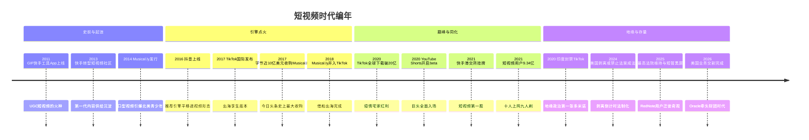
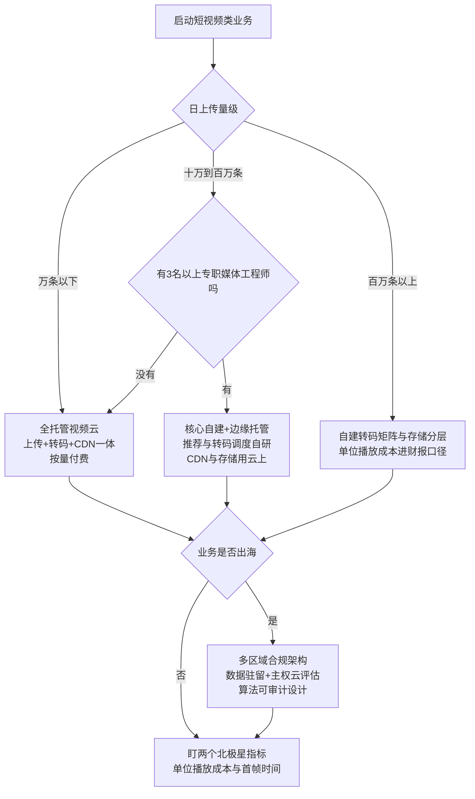

# 短视频时代（约 2018–2021）

> 这是 [技术编年史](/chronicle/) 的第三浪，也是唯一一浪"找不到退潮日"的周期——直到 2024 年，用户规模曲线第一次掉头向下。如果你和我一样在 2018 年前后开始接触短视频平台的云上架构，会发现一个反直觉的事实：短视频没有上演"眼见他起高楼"的戏剧，它只是悄悄把推荐系统、对象存储、转码矩阵变成了整个行业的地板。这篇写给想理解"规模成本工程"从何而来的读者——因为今天大模型时代的很多成本方法论，原型都在这里。全文三条主线：**推荐系统如何从算法变成基础设施、海量媒体的成本工程如何成形、以及 2024 年之后"用户见顶 + 地缘政治 + AI 生成"三个新变量如何改写这场战争**。读完你会拿到一条从 GIF 快手到 TikTok 交割案的完整编年，和一套可以直接套用到今天 AI 内容业务上的成本方法论。

## 时代的坐标

直播教会行业"实时"，短视频教会行业"规模"。当内容消费从"看一场"变成"无限刷"，技术命题就变成了**海量媒体的成本工程 + 推荐系统的规模化**——算法第一次成为基础设施级的存在。

用公开数据给这个坐标钉几颗钉子：

- 2011 年 3 月，快手的前身"GIF 快手"还是一款制作和分享动图的工具 App；2013 年转型短视频社区，是这场长跑最早的起跑枪（[来源：英文维基百科 Kuaishou 词条](https://en.wikipedia.org/wiki/Kuaishou)；中文维基百科"快手（软件）"词条的口径是 2012 年转型、2014 年改名快手，两说并存，本文以英文维基口径为主）
- 2016 年 9 月 20 日，抖音以"A.me"名义上线，"一年内用户过亿、每天视频播放量超 10 亿次"（[英文维基百科 TikTok 词条](https://en.wikipedia.org/wiki/TikTok)对 Douyin 部分的记载）
- 截至 2020 年 12 月，中国短视频用户规模达 8.73 亿，占网民整体的 88.3%——CNNIC 第 47 次《中国互联网络发展状况统计报告》口径（[CNNIC 第 47 次报告](https://www.cac.gov.cn/2021-02/03/c_1613923422728645.htm)）
- 截至 2021 年 12 月，短视频用户规模攀升至 9.34 亿，占网民整体的 90.5%，**历史性突破 9 亿大关**——CNNIC 第 49 次报告（数据截至 2021 年 12 月，2022 年 2 月发布，[中国教育和科研计算机网转载](https://www.cernet.edu.cn/xxh/ji_shu_ju_le_bu/Internet/202203/t20220304_2213218.shtml)）
- 2021 年 9 月底，字节跳动披露 TikTok 全球月活跃用户突破 10 亿（[来源：路透社日文版 2021-09-27](https://jp.reuters.com/markets/global-markets/FJWTMFWOR5ONRIDKM3CWJIXOFA-2021-09-27/)）
- **2024 年 12 月，短视频用户规模 10.40 亿、占网民 93.8%，较 2023 年 12 月的 10.53 亿下降 1.3%——这是 CNNIC 口径下短视频用户首次负增长**（[CNNIC 第 55 次报告](http://www3.cnnic.cn/n4/2025/0117/c88-11229.html)及报告全文应用数据表）；同期网络视频整体用户 10.70 亿（96.6%），其中微短剧用户 6.62 亿（59.7%）

一个在中国做内容生意的平台，用户盘子一年净增 6000 万；一个出海的应用，四年做到 10 亿人每月打开。这两条曲线叠加，就是"规模"二字的分量。而 2024 年那条 -1.3% 的负增长曲线，宣告了"规模"叙事的终章——存量时代的战争换了打法，本文最后一节会给出我的判断。

顺带把母体的坐标钉一下：短视频的用户盘子长在移动互联网的整体盘子里——2024 年 12 月全国网民 11.08 亿、手机上网比例 99.7%（CNNIC 第 55 次报告）。93.8% 的短视频渗透率意味着：**这个品类已经把"上网的人"几乎全部转化成了"刷视频的人"**，天花板不是需求，是人口。理解这一点，才能理解 2024 年之后平台为什么集体转向 AI 生产与电商变现——增量没了，只能卷效率。

短视频用户规模的公开刻度（CNNIC 历次报告口径，缺 2022 年是因为该年数据未在本次核查范围内）：

| 数据截至 | 短视频用户规模 | 占网民整体 | 出处 |
| --- | --- | --- | --- |
| 2020-12 | 8.73 亿 | 88.3% | 第 47 次报告 |
| 2021-12 | 9.34 亿 | 90.5% | 第 49 次报告 |
| 2023-12 | 10.53 亿 | 96.4% | 第 55 次报告应用数据表 |
| 2024-12 | 10.40 亿 | 93.8% | 第 55 次报告应用数据表（同比 -1.3%） |

## 棋盘概览：三家半玩家

这一浪的战场格局，值得先用一张表钉住（数据均为各公司公开披露或权威报道口径，时间边界见备注）：

| 玩家 | 起跑 | 公开规模刻度 | 定位与打法 | 变现主轴 |
| --- | --- | --- | --- | --- |
| 抖音（字节跳动） | 2016-09 上线，原名 A.me | 一年内用户过亿、日播放超 10 亿次（英文维基 TikTok 词条）；2018-10 全球下载超 8 亿（中文维基"抖音"词条转引） | 中心化推荐 + 运营造爆款，"记录美好生活" | 广告 + 直播打赏 + 电商（2020-03 上线团购） |
| 快手 | 2011 年 GIF 工具起家 | 2015-06 总用户破 1 亿；2017-11 日活破 1 亿；2019-05-29 日活破 2 亿（中文维基"快手（软件）"词条） | 去中心化普惠流量，老铁社区、直播强 | 直播打赏 + 电商 + 广告 |
| TikTok（字节跳动出海） | 2017-09 国际发布，2018-08 并入 Musical.ly | 2020-04 全球下载破 20 亿；2020-07 月活约 8 亿；2021-09 月活破 10 亿 | 抖音工程体系的全球化复制 | 广告 + 电商（TikTok Shop） |
| 微信视频号（腾讯） | 2020 年内测起步 | 2024 年一季度总用户使用时长同比增长超 80%（CNNIC 第 55 次报告转引腾讯财报口径） | 社交关系链分发，后发但背靠微信生态 | 广告 + 直播带货 |
| "半家"：B站、小红书 | B站 2009 年起家 | B站 2018-03-28 纳斯达克上市、2021-03-29 港交所二次上市（中文维基"哔哩哔哩"词条） | 中长视频与社区氛围，被迫跟进竖屏短视频（Story 模式） | 广告 + 游戏 + 会员 |

我的判断（标明经验边界：这是从云上客户结构看到的）：**短视频是极少数"双寡头 + 生态位差异"能长期共存的内容赛道**——抖音吃"爆款与商业化效率"，快手吃"社区与信任电商"，视频号吃"社交分发与私域"。三者的推荐系统目标函数不同，导致基础设施形态也不同：抖音重精排与实验吞吐、快手重实时特征与直播联动、视频号重关系链存储与微信生态复用。

多说一句视频号：它是腾讯第三次入局短视频（微视两度起落之后），打法完全不同——不做独立流量池，而是把短视频嵌进微信的社交图谱与小程序交易生态里。CNNIC 第 55 次报告转引腾讯财报口径：2024 年一季度视频号总用户使用时长同比增长超 80%，小程序单季交易额超 2 万亿元。从基建视角看，视频号的启示是**后发者不必重建全套推荐基建，可以复用母体生态的关系链与交易链路**——这是"生态位竞争"对"规模竞争"的一次翻盘样本，也为后来所有超级 App 内嵌短视频（支付、电商、工具类）提供了模板。

*图源：Wikimedia Commons（[File:Douyin wordmark.svg](https://commons.wikimedia.org/wiki/File:Douyin_wordmark.svg)，公有领域）*

## 关键节点编年

| 时间 | 节点 | 意义 |
| --- | --- | --- |
| 2011.03 | GIF 快手上线（工具 App） | 短视频时代的"史前遗迹" |
| 2013 | 快手转型短视频社区 | 第一批 UGC 短视频供给沉淀 |
| 2014.08 | Musical.ly 正式发行 | 口型同步短视频在北美青少年中引爆 |
| 2016.09.20 | 抖音以"A.me"名义上线，同年 12 月更名 | 字节跳动把头条系的推荐引擎装进了短视频 |
| 2017.09 | TikTok 面向国际市场发布 | 抖音的出海孪生版本 |
| 2017.11.09 | 字节跳动以近 10 亿美元收购 Musical.ly | 当时今日头条史上最大收购案（[WSJ 报道](https://www.wsj.com/articles/lip-syncing-app-musical-ly-is-acquired-for-as-much-as-1-billion-1510278123)） |
| 2018.03.28 | B站在纳斯达克挂牌（BILI） | 视频社区第一股，2021-03-29 港交所二次上市 |
| 2018.08.02 | Musical.ly 账号与数据并入 TikTok | 借船出海完成，TikTok 正式登上国际舞台（[路透社](https://www.reuters.com/article/technology/chinas-bytedance-scrubs-musically-brand-in-favor-of-tiktok-idUSKBN1KN0BN/)） |
| 2019.05.29 | 快手宣布日活破 2 亿 | 普惠流量路线跑通的公开刻度 |
| 2020.01 | 微信视频号内测 | 腾讯以社交链打法第三次入局短视频 |
| 2020.04 | TikTok 全球移动下载量突破 20 亿 | 疫情宅家红利叠加推荐飞轮（[英文维基百科 TikTok 词条](https://en.wikipedia.org/wiki/TikTok)） |
| 2020.06 | 印度以国家安全为由封禁 TikTok 等中国应用 | 地缘政治的第一张多米诺，此后未解禁（[英文维基百科 TikTok 词条](https://en.wikipedia.org/wiki/TikTok)） |
| 2020.08 | 特朗普签署行政令要求 45 天内剥离 TikTok 美国业务 | 美国监管拉锯战开场（后经诉讼搁置） |
| 2020.09.15 | YouTube Shorts 在印度开启 beta | 巨头全面入场（[英文维基百科 YouTube Shorts 词条](https://en.wikipedia.org/wiki/YouTube_Shorts)） |
| 2021.02.05 | 快手在港交所挂牌，代号 1024 | "短视频第一股"，开盘大涨约 194%（[快手 IR 公告](https://ir.kuaishou.com/zh-hans/news-releases/news-release-details/kuaishou-technology-announces-details-proposed-listing-main)、[新浪财经](https://finance.sina.com.cn/tech/2021-02-05/doc-ikftssap3938025.shtml)） |
| 2021.07.13 | YouTube Shorts 全球发布 | 短视频完成对全行业的"格式同化" |
| 2022.02 | CNNIC 第 49 次报告：短视频用户 9.34 亿 | 十个人上网，九个刷短视频 |
| 2022.12 | 拜登签署《禁止政府设备使用 TikTok 法》 | 美国联邦设备全面禁用 |
| 2024.04.24 | 美国"剥离或禁止"法案签署成法 | 给字节跳动设定剥离倒计时，TikTok 提起诉讼 |
| 2025.01 | 最高法院一致维持法案；1-18 TikTok 全美短暂"黑屏"；特朗普就职后多次行政令延长期限 | 用户一度涌入小红书（RedNote），成为全球互联网奇观 |
| 2025.09.14 | 中美就 TikTok 美国业务达成"协议框架"（WSJ 报道） | 出售给以 Oracle 的 Larry Ellison 为首的美国财团 |
| 2026.01 | TikTok 美国业务交易完成 | 财团持股超 80%（Oracle、Silver Lake、MGX、Michael Dell 个人投资实体等），字节跳动保留 19.9% |

*图源：Wikimedia Commons（[File:Musical.ly vector logo.svg](https://commons.wikimedia.org/wiki/File:Musical.ly_vector_logo.svg)，公有领域）*

*图源：Wikimedia Commons（[File:Tiktok logo.png](https://commons.wikimedia.org/wiki/File:Tiktok_logo.png)，CC0）*

这条时间线里我最想强调的是 2017–2018 的收购与合并：Musical.ly 提供了北美用户底盘和内容生态，TikTok 提供的是背后的推荐引擎和工程体系。很多人把 TikTok 的成功归因于"会做特效"，但从架构师视角看，真正的杀器是**把今日头条验证过的推荐系统规模化能力，直接平移到了视频形态上**。

*图源：Wikimedia Commons（[File:Tik Tok logo.svg](https://commons.wikimedia.org/wiki/File:Tik_Tok_logo.svg)，CC BY-SA 3.0）*

## TikTok 变局：出海与地缘政治的完整时间线

这一浪的下半场，主角从产品经理换成了律师与监管者。把 2020–2026 的美国线拉直（均据英文维基百科 TikTok 词条及其引用的公开报道，访问日期 2026-09-05）：

- **2020.06**：印度以边境冲突后的国家安全为由封禁 TikTok 等中国应用，此后再未解禁——全球最大增量市场一夜归零，这是"数据主权高于产品逻辑"的第一枪
- **2020.08**：特朗普两度签署行政令（45 天禁止交易、90 天强制剥离），后经司法程序搁置；2021.06 拜登撤销禁令行政令，改为商务部调查路径
- **2022.12**：《禁止政府设备使用 TikTok 法》签署；2023 年欧盟三大机构跟进禁用员工设备
- **2024.04.24**：H.R.7521 修订版随对外援助法案签署成法——不剥离就下架，倒计时开始；TikTok 提起诉讼（TikTok, Inc. v. Garland）
- **2025.01.17**：最高法院一致裁定法案合宪；**01.18**：生效前数小时，TikTok 主动关停全美服务——"黑屏"数小时；**01.19**：特朗普承诺不执法，服务恢复；随后 1 月、4 月、6 月三度行政令延期（75 天、75 天、90 天）
- **2025.01**：黑屏期间，大量美国用户涌入小红书（RedNote），上演全球互联网史上罕见的"平台难民迁徙"
- **2025.09.14**：《华尔街日报》报道中美达成"协议框架"——美国业务出售给以 Oracle 创始人 Larry Ellison 为首的美国财团
- **2026.01**：交易完成。合资实体中美方财团持股超 80%（Oracle、Silver Lake、MGX、Michael Dell 个人投资实体等），字节跳动保留 19.9%；App 保持不变，但算法将"随时间调整以偏向美国本土议题"；TikTok CEO 周受资在内部备忘录中确认美国业务将在"数据保护、内容监督、算法安全"三重承诺下由美方多数持股的合资实体运营

三个架构师视角的观察：

1. **数据本地化从合规选项变成市场准入证**。TikTok 美国方案的核心不是股权比例，而是数据与算法的"可审计托管"——这直接带火了"主权云"（sovereign cloud）产品形态：数据驻留、密钥自持、本地化运营。出海架构从此多了一个一级公民约束，与延迟、成本并列。
2. **算法本身第一次成为被监管的资产**。"算法将调整以偏向美国本土议题"写进交易条款，意味着推荐系统的目标函数进入了法律文本——推荐工程师从今天起要有"合规目标函数"的概念，这不是玩笑，是 2026 年的现实。
3. **全球化架构要做"可拆分"设计**。字节为 TikTok 搭建的多区域架构（新加坡/洛杉矶双总部、区域化数据平面）客观上让"剥离美国业务"在工程上可执行。我遇到的情况是：2024 年之后，出海客户问得最多的一句话从"怎么降延迟"变成了"能不能按国家切开"。

给 2026 年还要出海的团队一份"数据主权三问"清单（我在方案评审里的固定动作）：

- **一问驻留**：用户数据、模型权重、日志三条流分别落在哪些法域？能否按国家出具数据流图？
- **二问可拆**：如果某个市场要求剥离，业务能否在 6 个月内独立运行？（TikTok 案例给出的答案是：可以，但前提是架构从第一天就按区域切分）
- **三问可审**：推荐/审核算法能否向第三方出具可解释的行为报告？标识办法类的法规正在把"算法可审计"从加分项变成准入项

## 技术驱动：四条线的合流

为什么恰好是这个时间窗起浪？我的判断是三要素齐备：移动终端成熟（4G 资费下降、智能手机拍摄能力过剩）、推荐算法跨过可用性门槛（深度学习的视觉与排序模型在 2016 年前后集体成熟）、创作工具平民化（一键拍同款把 UGC 门槛打到地板）。三条线背后对应三组技术栈；2023 年之后，第四条线——AI 内容生产——加入了合流。

### 推荐算法：从锦上添花到基础设施

抖音/TikTok 的推荐范式与 Facebook 一代有本质区别：前者按"社交关系"分发，后者按"内容兴趣"分发——用户不需要关注任何人，算法根据每一次完播、重播、点赞、划走的行为流实时改写推荐（机制描述见[英文维基百科 TikTok 词条](https://en.wikipedia.org/wiki/TikTok)）。这在工程上催生了一整套今天看来平平无奇、在当时却是全新物种的基建：

- **召回 / 粗排 / 精排 / 重排四段式流水线**：从百万级候选到十几条下发，每一段都是不同的模型与不同的延迟预算
- **特征平台 + 实时特征流**：用户行为日志经消息队列（Kafka 类）流入实时计算引擎（Flink 类），分钟级更新特征——这是"实时数仓"概念第一次被业务逼到极限。字节跳动 2022 年公开的 Monolith 论文（arXiv:2209.07663）把这套体系推到了"实时训练"：无冲突嵌入表 + 在线训练，让用户几分钟前的行为就能改变模型参数
- **大规模 A/B 实验平台**：推荐系统的迭代速度取决于实验吞吐量，流量切分、指标体系、自动报告成为平台工程

2025 年出现了范式级的新变化：**生成式推荐**。快手公开的 OneRec（arXiv:2502.18965）用单一生成式模型统一"召回 + 排序"，替代级联流水线，并在真实场景端到端跑通了偏好对齐——这是推荐系统自"四段式"确立以来最大的架构改写。我的判断：级联流水线之于生成式推荐，恰如单体之于微服务再之于大模型原生应用——**当算力成本降到某个临界点，"多模块拼接"会让位于"端到端生成"**。这条曲线与大模型推理成本的下降是同一条（见 [Token 经济学](/ai/infra/inference/token-economics)），值得所有做推荐/搜索的团队在 2026 年之后持续跟踪。

把十五年推荐系统的演进压成一张表（时期为行业普遍节奏，代表工作取公开论文/产品口径）：

| 阶段 | 大致时期 | 代表范式 | 核心工程挑战 | 对基础设施的要求 |
| --- | --- | --- | --- | --- |
| 规则与协同过滤 | 2010–2014 | 标签召回、ItemCF | 冷启动、稀疏性 | 单机特征 + 离线批计算即可 |
| 深度学习排序 | 2016–2019 | DNN 召回/排序（YouTube 深度推荐、Wide&Deep 一代） | 特征工程规模化、模型上线节奏 | GPU 训练集群 + 特征平台 + A/B 实验平台 |
| 实时化 | 2020–2023 | 实时特征流、在线训练（Monolith，arXiv:2209.07663） | 分钟级甚至秒级反馈闭环 | Kafka/Flink 级实时数仓、在线训练管线、参数服务器 |
| 生成式推荐 | 2024– | 端到端生成（OneRec，arXiv:2502.18965） | 推理成本、可控性、偏好对齐 | 大模型级训练/推理集群，推荐与 LLM 基建合流 |

注意最后两行的含义：**推荐系统的基建正在与大模型的基建合流**——十年前推荐团队和 AI 团队是两拨人、两套集群，2026 年之后它们在同一批 GPU 上排队。这也是我把短视频浪称为"大模型时代基础设施预演"的原因。

### 编解码：成本生命线

短视频的账单大头藏在比特里。2013 年正式定版的 H.265/HEVC 标准，在同等画质下比 H.264 提供 25%–50% 的压缩率提升（[英文维基百科 High Efficiency Video Coding 词条](https://en.wikipedia.org/wiki/High_Efficiency_Video_Coding)）——对一个日上传千万条视频的平台，这就是每年省下的真金白银。于是：

- **转码矩阵成为标配**：一条上传视频派生多个分辨率/码率档位，适配不同网络与终端
- **"窄带高清"类智能编码兴起**：感知编码、ROI 增强，在主观画质与码率之间反复博弈——编码参数就是财务报表
- **解码在端、编码在云**：H.265 编码复杂度远高于 H.264，GPU/ASIC 转码集群的利用率优化第一次成为架构课题（承接[直播时代](/chronicle/livestream)的转码成本账，但规模大一个数量级）

往后的曲线也值得预判（截至 2026-09）：AV1 免版税阵营与 H.266/VVC 专利阵营的拉锯仍在继续，端侧硬解普及速度决定新编码的采用节奏；而 AI 超分与"生成即编码"（生成模型直接输出低码率表征）是下一个可能改写成本曲线的变量——如果生成式内容占比持续上升，"转码"这个环节本身可能被"生成参数"取代。

编码标准选型的工程账（专利费口径为公开联盟/组织披露的一般性描述，具体费率随合同差异很大，此处只谈架构含义）：

| 编码标准 | 定版 | 专利模式 | 压缩效率（同画质，相对基线） | 端侧硬解普及 | 短视频平台的现实策略（我的经验边界） |
| --- | --- | --- | --- | --- | --- |
| H.264/AVC | 2003 | 专利池，费率成熟 | 基线 | 几乎 100% | 兜底档位，全终端可达 |
| H.265/HEVC | 2013 | 多专利池，授权复杂 | 省 25%–50% | 2016 年后旗舰机普及 | 主力档位，转码集群的大头 |
| AV1 | 2018 | 免版税（AOMedia 联盟） | 再省约 20%–30%（对比 HEVC 量级） | 2020 年后新机逐步支持 | 增量档位，头部平台先吃螃蟹 |
| H.266/VVC | 2020 | 专利池组建中 | 官方目标再省约 50%（对比 HEVC） | 硬解尚在铺开 | 观望为主，等端侧渗透率 |

这张表的决策含义：**编码选型从来不是"哪个先进选哪个"，而是"端侧硬解渗透率 × 码率节省 × 专利风险"的三元乘积**——和今天大模型选型看"推理成本 × 效果 × 合规风险"是同一个决策模板。

### 拍摄特效：CV 第一次大规模在线服务

人脸关键点、美颜磨皮、AR 贴纸、手势触发——这些计算机视觉能力从实验室走进亿万部手机的前置摄像头。为了保住"秒开"与帧率，模型被压缩、量化、蒸馏后端侧部署，云端负责素材下发与内容审核。今天回看，**这就是"模型即服务"运维范式（多版本模型、灰度、监控、端云协同）的第一次全行业预演**。

### 第四条线：AI 改写内容生产（2023–2026）

这一浪的"生产端成本曲线"正在被 AI 重画，三件事构成了时间锚点：

- **生成模型下场**：2024 年 6 月，快手发布扩散 Transformer 架构的文生视频模型可灵（Kling），宣称可生成 2 分钟、30fps、1080p 的视频，被外界对标 OpenAI Sora（[英文维基百科 Kuaishou 词条](https://en.wikipedia.org/wiki/Kuaishou)）；国内各短视频平台的剪辑工具全面接入文生视频、数字人口播、AI 配音能力（技术脉络见 [视频生成](/ai/models/video-gen) 与 [语音生成](/ai/models/speech-gen)）
- **监管落地**：国家网信办、工信部、公安部、广电总局四部门《人工智能生成合成内容标识办法》（国信办通字〔2025〕2 号）**自 2025 年 9 月 1 日起施行**（[中国政府网全文](https://www.gov.cn/zhengce/zhengceku/202503/content_7014286.htm)）——AI 生成内容必须携带显式/隐式标识，平台的审核链路从"判违规"升级为"判违规 + 判来源"
- **基础设施影响**：供给侧生产成本断崖下降 → 内容量再度爆炸 → 审核、存储、推荐的负载曲线整体上移。我在 2025–2026 年接触的典型场景是：内容平台的审核算力预算增速第一次超过了转码算力预算——**成本重心从"处理比特"转向"理解比特"**

*图源：Wikimedia Commons（[File:YouTube Shorts icon 2024.svg](https://commons.wikimedia.org/wiki/File:YouTube_Shorts_icon_2024.svg)，Public domain）*

### 微短剧：短视频形态的第二增长曲线

2024–2025 年最值得单独立档的形态创新是微短剧：每集 1–3 分钟、竖屏、freemium 解锁付费的专业制作内容（PGC 而非 UGC，制作模式见[中文维基百科"微短剧"词条](https://zh.wikipedia.org/wiki/%E5%BE%AE%E7%9F%AD%E5%89%A7)）。CNNIC 第 55 次报告：截至 2024 年 12 月微短剧用户 6.62 亿、网民使用率 59.7%，行业进入"提质升级"阶段，广电总局推动精品化，短视频平台、长视频平台、电商平台纷纷跨界入局；报告还记录了微短剧与文旅的融合（"跟着微短剧去旅行"）与出海（Stardust TV 等平台 2025 年起进入欧洲市场）。

技术含义三条：竖屏高帧率内容的转码档位体系与短视频同构，边际成本低；"免费前几集 + 付费解锁"的分发模型让 CDN 预热策略第一次有了"章节"概念；出海短剧 App 是 2024–2026 年中国应用出海最活跃的品类之一，把"多区域合规 + 本地支付 + 内容审核"这套出海基建的复用价值又拉高了一档。

微短剧与 UGC 短视频的基建差异，一张表说清（泛化口径，适用于评估内容业务形态的团队）：

| 维度 | UGC 短视频 | 微短剧 | 架构含义 |
| --- | --- | --- | --- |
| 供给 | 海量长尾、脉冲上传 | 少量精品、批量交付 | 转码从"无限流水"变"批次任务"，弹性模型不同 |
| 消费 | 无限流、完播率驱动 | 剧集式、解锁点驱动 | 预热按"集"而非按"条"，付费墙前后缓存策略分层 |
| 变现 | 广告 + 电商 + 打赏 | 付费解锁 + 广告 + 分账 | 交易链路进入播放页，支付洪峰与内容洪峰叠加 |
| 审核 | 机审为主、海量并发 | 前置审核 + 备案（精品化监管） | 审核左移到生产端，平台侧存量审核压力下降 |
| 出海 | 全球单品牌大盘 | 多 App 矩阵、区域化内容 | 一套基建多租户复用，区域合规颗粒度更细 |

## 对云架构的影响：本站视角

把一条短视频从镜头前送到用户拇指下，完整管线大致如下——注意每一段都对应一类云产品的极限压力：

三个最直接的架构冲击，加上 2024 年之后的第四个：

### 海量小对象：存储账单的指数曲线

一线亲历的典型场景：客户的存储账单曲线不是线性增长，是指数爬坡——**内容只进不出**。每条上传派生出原片、多档转码流、封面帧、音轨，对象数量比文件数量再乘一个系数。应对动作从这一浪起成为全行业标配：

- PB 级对象存储（OSS 类）承载媒体底座，见 [对象存储](/cloud/infra/storage)
- 冷热分层 + 生命周期规则：99% 的视频从未被第二次播放，但平台不敢赌自己是那 1%，于是"沉降 + 随时可召回"成为默认策略
- 存储成本与命中率联动核算：低频/归档存储的取回费与请求费进架构评审清单

### 分发成本：从"回源拉取"到"预热推边"

直播时代的分发是"少数热门流、长时间在线"；短视频是"海量长尾、脉冲式热点"——一条视频可能十分钟内从 0 冲到百万 QPS。工程上的反应：

- **CDN 预热**：发布瞬间把热门内容主动推到边缘节点，用调度换命中率
- 预加载与秒开：端侧在用户滑动时提前拉取下 N 条的首片段，把"首帧时间"做成北极星指标——带宽成本从"用户拉"变成"平台赌"
- 编码档位与带宽联动：省 10% 码率约等于省 10% 带宽采购，这是直播时代"带宽即成本"公式的精细化版本

### 离线计算与在线推理：大数据栈被业务拉大了一号

推荐系统是一台吞吐日志的怪兽：行为埋点 → 数据湖（承接移动互联网时代建的底座，见[大数据体系](/cloud/data/bigdata)）→ 离线特征与样本 → 模型训练 → 实验上线。**大数据平台第一次不是"企业 IT 的项目"，而是核心业务的心脏**——这一浪把国内实时数仓、湖仓一体的需求整体提前了。

另一头是在线推理：推荐精排给整个链路的延迟预算只有几十毫秒，倒逼特征服务、模型服务做到极致的工程化（高可用、水平扩展、模型多版本热更新）。这套运维范式，就是今天大模型推理服务（见 [AI 推理服务](/ai/infra/inference/)）的直接前身。

### 出海与合规：多区域架构成为一级约束

2020 年印度封禁、2024 年美国立法之后，出海短视频业务的架构评审多了一整章"地缘风险"：数据按国家/区域物理隔离、加密密钥本地托管、算法与模型权重可审计、内容审核标准分区配置。工程上的落点是**多区域多活从"高可用手段"升级为"合规手段"**——同一个技术动作，动机变了，验收标准也变了（监管要的是可证明的隔离，不是可容忍的故障域）。对多数团队，这意味着优先选择提供主权云/合规区域的头部云厂商，而不是在成本上极致优化（我的经验边界：合规区域的溢价通常在可接受范围内，出事时的市场准入损失才是不可承受的）。

### 自建还是托管：视频云选型决策图

把这一浪的选型经验压成一张决策图（适用于 2026 年仍要上短视频/中视频能力的团队，量级阈值为经验值，按团队与业务校准）：

决策含义：**上传量级决定自建深度，出海与否决定架构约束**。多数团队的正确答案是全托管起步，等"单位播放成本"在账单上肉眼可见地超过托管溢价时，再逐段替换自建——这与移动互联网浪"先非核心、后核心"的上云姿势一脉相承。

*图源：Wikimedia Commons（[File:Kuaishou logo.png](https://commons.wikimedia.org/wiki/File:Kuaishou_logo.png)，Public domain）*

## 常见坑与误判：短视频基建的学费清单

这一浪里行业交过的学费，整理成一张避坑表（均为泛化后的典型场景，不涉及具体客户）：

| 坑/误判 | 典型现象 | 根因与对策 |
| --- | --- | --- |
| 把短视频当"视频网站小号" | 按点播逻辑做容量，被无限下滑的长尾流量打穿 | 推荐驱动系统的流量形状由算法决定；容量模型要按"人均刷新次数 × 预加载系数"建，不是按"内容库大小" |
| 转码档位一次到位 | 上线就铺 6 档分辨率，转码账单爆炸 | 档位跟着端侧渗透率走：先 2–3 档主力，数据驱动加档；冷门档位按需转码（首次播放触发） |
| 存储只进不出 | 两年后对象存储成为第一大云账单 | 生命周期规则在架构评审期就定：热 30 天 → 低频 → 归档；取回费与请求费一起算总账 |
| 预加载无节制 | 首帧时间极漂亮，带宽成本失控 | 预加载深度与命中率联动监控；弱网降档、Wi-Fi 提档；把"每千次播放流量成本"设为护栏指标 |
| 推荐系统没有实验平台 | 模型迭代靠全量上线，坏 case 直接伤大盘 | A/B 基建先行：流量切分、指标体系、自动回滚——实验吞吐就是迭代速度 |
| 审核当成本中心砍预算 | 一次舆情事件损失超过三年审核预算 | 审核是准入资产不是可选项；AIGC 标识办法后更是合规义务，机审算力要进年度预算科目 |
| 出海架构"先上线再合规" | 被下架/被罚后重构，成本十倍 | 数据驻留、可拆分、可审计三问在方案期做完（见上文清单） |

## 一线回望

做 SA 这些年，短视频时代给我留下四个肌肉记忆：

1. **成本报表要下钻到"每次播放"**。我们给客户做过最细的账，是单条视频从上传到退役的全生命周期成本（存储 × 驻留时长 + 转码次数 + 分发流量），这个"单位内容成本"指标，和今天"单位 token 成本"的算法如出一辙。
2. **GPU 集群的利用率是被账单逼出来的**。转码负载有明显的潮汐性，混部、抢占实例、弹性伸缩这些今天大模型训练集群的常规操作，当年先在转码集群里用了一遍。
3. **最大的误判是低估"无限下滑"**。2018 年前后不少传统客户把短视频当"活动页的素材库"，容量规划按营销峰值做；结果用户行为是 7×24 的持续刷新，长尾流量远超想象。**这浪教育行业：推荐驱动的系统，流量形状由算法决定，容量规划必须跟着行为模型走**。
4. **审核链路是隐藏的算力大户**。2025 年 AI 标识办法施行后，"判来源"叠加"判违规"，多模态审核模型的推理开销显著上升——我在方案评审里第一次看到客户把"审核 GPU"与"转码 GPU"分成两个预算科目。经验边界：内容平台之外的一般业务不必照搬，但只要你的系统开始接收 AIGC 内容，这条曲线就会找上门。

## 兴衰逻辑：为什么"看不见它退潮"，以及退潮其实来了

- **为什么兴起**：前文四要素（终端、算法、创作工具，加上 2023 年后的 AI 生产工具）齐备，缺一浪不起。
- **为什么没有退潮**：短视频没有退潮，**它变成了背景板**。2021 年后，电商加短视频、新闻加短视频、连音乐 App 都在做"刷"——当一种技术彻底融入日常，它就从"浪潮"变成了"环境"，这也是它长期缺席各类技术编年史的原因。一个浪潮的终点，是成为别人的默认设置。
- **但存量信号确实出现了**：2024 年短视频用户 -1.3%（CNNIC 第 55 次报告），是这一品类有统计以来的首次负增长。我的解读：这不是形态衰退，是**人口见顶**——93.8% 的网民渗透率意味着增量只能来自"以前不上网的人"，与移动互联网母体同时进入存量期（见 [移动互联网时代](/chronicle/mobile-internet)）。平台竞争从"拉新"转向"抢时长 + 提效率"，这正好解释了为什么全行业同时在卷 AI 生成与电商变现。
- **留下了什么**：推荐基础设施（所有 App 的标配）、海量媒体成本工程（对象存储生命周期、转码档位体系、CDN 预热方法论）、视频云产品线的完整形态、多区域合规架构的方法论，以及被这个年代喂养长大的整整一代端侧 CV 与实时计算工程师。

## 转折点与下一个转折信号

**这波浪潮的转折点是什么？**我的答案是两段式：**起浪转折点在 2016–2018**——抖音上线（2016）验证了"推荐引擎 × 短视频"的化学反应，收购并合并 Musical.ly（2017–2018）拿到了出海的船票，这两步把行业从"社区玩法"切换到"算法工业"；**巅峰转折点在 2020–2021**——疫情宅家把下载量推到 20 亿（2020.04）、快手上市（2021.02）、TikTok 月活破 10 亿（2021.09）、YouTube Shorts 全球发布（2021.07），规模叙事到达顶点，同一年印度封禁与美国行政令也拉开了地缘反噬的序幕。

**下一个转折信号看什么？**四个可观测指标（截至 2026-09）：

1. **AIGC 内容占比**：当信息流里"生成"内容超过"拍摄"内容（平台侧可从标识办法要求的 AI 标签统计），供给侧成本结构将彻底改写，审核与推荐的负载模型同步重写
2. **生成式推荐的渗透**：OneRec 类端到端架构若在头部平台全量替代级联流水线，推荐系统的算力账单会从"在线推理为主"转向"训练推理一体"，GPU 采购逻辑随之改变
3. **TikTok 全球化终局**：2026 年美国交割后的"一国一策"模式若被更多市场复制，全球互联网的内容层将正式进入"分区互联网"时代，出海架构的合规溢价成为永久成本项
4. **微短剧渗透率越过 70%**：2024 年已到 59.7%（CNNIC），越过 70% 意味着"竖屏 serialized 内容"成为与"无限流 UGC"并列的基础形态，分发与变现架构要再加一套

## 对今天的启示

- **成本工程的传承**：当年为转码和带宽做的每一分优化——单位资源产出核算、档位分级、命中率与成本的博弈——方法论正原样复用在推理算力上。token 成本优化的很多套路（量化换吞吐≈降码率换带宽、结果缓存≈CDN 边缘缓存、模型分级路由≈按网络自适应选清晰度），在转码成本优化里都有原型（展开见 [Token 经济学](/ai/infra/inference/token-economics)）。
- **算法基础设施化的第一次预演**：推荐系统教会行业"如何把模型变成 7×24 的在线服务"——特征平台、模型版本管理、A/B 灰度、延迟预算制，这正是[大模型应用](/ai/models/llm)栈的直接前身。看懂短视频的 MLOps，就看懂了大模型推理服务一半的运维日常。
- **警惕"叙事盲区"**：热搜关注度与基础设施重要性可以严重脱节。评估一浪技术的遗产，别看话题榜，看你的账单里哪一项增长最快。
- **地缘是架构约束，不是新闻背景**：2020 年可以把印度封禁当新闻看，2024 年之后必须把它当需求看——数据驻留、可拆分部署、算法可审计，这些能力在方案阶段就要进架构图，事后补的成本是十倍级。

## 站内相关

- 母体：[移动互联网时代](/chronicle/mobile-internet)——本浪的终端、网络与用户盘子从何而来
- 姊妹篇：[直播时代](/chronicle/livestream)——实时音视频与 CDN 的极限考验，与本浪共享"带宽即成本"公式
- [技术编年史总纲：十年六浪](/chronicle/)
- 下一浪：[AI 大模型时代](/chronicle/ai-era)——AIGC 正在改写本浪的生产函数
- 并行暗线：[区块链时代](/chronicle/blockchain)、[元宇宙时代](/chronicle/metaverse)——后者为短视频之后攒下了 GPU 供给
- 技术承接：[大数据体系](/cloud/data/bigdata)（被推荐系统拉大的那一号底座）、[对象存储](/cloud/infra/storage)、[AI 推理服务](/ai/infra/inference/)、[视频生成](/ai/models/video-gen)、[Token 经济学](/ai/infra/inference/token-economics)

## 参考资料

<Refs>

**权威统计与报告（访问日期 2026-09-05）**

1. [CNNIC：第 47 次《中国互联网络发展状况统计报告》](https://www.cac.gov.cn/2021-02/03/c_1613923422728645.htm) — 截至 2020-12 短视频用户 8.73 亿（88.3%）
2. [CNNIC 发布第 49 次《中国互联网络发展状况统计报告》（中国教育和科研计算机网转载）](https://www.cernet.edu.cn/xxh/ji_shu_ju_le_bu/Internet/202203/t20220304_2213218.shtml) — 截至 2021-12 短视频用户 9.34 亿（90.5%）、网民 10.32 亿
3. [第55次《中国互联网络发展状况统计报告》发布页（CNNIC，2025-01-17）](http://www3.cnnic.cn/n4/2025/0117/c88-11229.html) — 截至 2024-12：短视频用户 10.40 亿（93.8%、同比 -1.3%）、网络视频 10.70 亿（96.6%）、微短剧 6.62 亿（59.7%）；视频号 2024 年一季度用户时长同比 +80%（转引腾讯财报）；TikTok Shop 助力跨境电商出海
4. [第56次《中国互联网络发展状况统计报告》发布页（CNNIC，2025-07-21）](http://www2.cnnic.cn/n4/2025/0721/c88-11328.html) — 截至 2025-06 网民 11.23 亿、短视频平台线上线下消费闭环、生成式 AI 备案 346 款

**平台编年与事件（访问日期 2026-09-05）**

5. [TikTok - Wikipedia](https://en.wikipedia.org/wiki/TikTok) — 抖音上线（2016-09-20，原名 A.me，一年内用户过亿/日播放超 10 亿次）、TikTok 国际发布（2017-09）、Musical.ly 收购（2017-11-09）与合并（2018-08-02）、2020-04 下载破 20 亿、2020-07 月活约 8 亿、印度 2020 年封禁、2020-08 特朗普行政令、2024-04-24 剥离或禁止法案、2025-01 最高法院维持与短暂黑屏及三度延期、2025-09-14 协议框架（WSJ）、2026-01 交割完成（财团持股超 80%、字节 19.9%、算法调整条款）
6. [Musical.ly - Wikipedia](https://en.wikipedia.org/wiki/Musical.ly) — 2014-08 正式发行、产品形态
7. [Kuaishou - Wikipedia](https://en.wikipedia.org/wiki/Kuaishou) — 2011-03 GIF 快手创立、2013 转型短视频社区、2021-02 港交所 IPO；2024-06 发布可灵（Kling）文生视频模型（2 分钟/30fps/1080p，对标 Sora）
8. [快手（软件）（中文维基百科）](https://zh.wikipedia.org/wiki/%E5%BF%AB%E6%89%8B_(%E8%BB%9F%E9%AB%94)) — 2011 GIF 快手、2012 转型短视频社区、2014 改名快手；2015-06 总用户破 1 亿、2017-11 日活破 1 亿、2019-05-29 日活破 2 亿、2020-11-05 递交招股书
9. [抖音（中文维基百科）](https://zh.wikipedia.org/wiki/%E6%8A%96%E9%9F%B3) — 2016-09-20 上线、2018-10 全球下载超 8 亿、2020-03-18 上线团购功能
10. [字节跳动（中文维基百科）](https://zh.wikipedia.org/wiki/%E5%AD%97%E8%8A%82%E8%B7%B3%E5%8A%A8) — 2012-08 今日头条上线（2014 年中日活 1300 万+）、2017 年 8 亿美元收购 Musical.ly、2019 年营收 1040–1400 亿元（投资人口径）
11. [哔哩哔哩（中文维基百科）](https://zh.wikipedia.org/wiki/%E5%93%94%E5%93%A9%E5%93%94%E5%93%A9) — 2018-03-28 纳斯达克挂牌（BILI）、2021-03-29 港交所二次上市（9626）
12. [微短剧（中文维基百科）](https://zh.wikipedia.org/wiki/%E5%BE%AE%E7%9F%AD%E5%89%A7) — 竖屏 1–3 分钟/集、专业团队制作、freemium 解锁模式、2025 年起出海欧洲（Stardust TV）
13. [YouTube Shorts - Wikipedia](https://en.wikipedia.org/wiki/YouTube_Shorts) — 2020-09-15 印度 beta、2021-07-13 全球发布
14. [Social-Media App Musical.ly Is Acquired for as Much as $1 Billion - The Wall Street Journal](https://www.wsj.com/articles/lip-syncing-app-musical-ly-is-acquired-for-as-much-as-1-billion-1510278123)（2017-11-09）
15. [China's ByteDance scrubs Musical.ly brand in favor of TikTok - Reuters](https://www.reuters.com/article/technology/chinas-bytedance-scrubs-musically-brand-in-favor-of-tiktok-idUSKBN1KN0BN/)（2018-08）
16. [TikTok、7 月の世界の月間アクティブユーザー数が 10 億人に - ロイター日本語版](https://jp.reuters.com/markets/global-markets/FJWTMFWOR5ONRIDKM3CWJIXOFA-2021-09-27/)（2021-09-27）
17. [快手科技公布于香港联交所主板上市计划详情 - 快手投资者关系](https://ir.kuaishou.com/zh-hans/news-releases/news-release-details/kuaishou-technology-announces-details-proposed-listing-main)
18. [创业十年上市遭热捧，快手如何抢下短视频第一股？ - 新浪财经](https://finance.sina.com.cn/tech/2021-02-05/doc-ikftssap3938025.shtml)（2021-02-05）
19. [YouTube Shorts 于全球隆重推出 - Google 官方博客（中文）](https://blog.google/intl/zh-tw/products/explore-get-answers/2021_07_youtubeshorts/)（2021-07）

**技术与论文（访问日期 2026-09-05）**

20. [Monolith: Real Time Recommendation System With Collisionless Embedding Table（arXiv:2209.07663）](https://arxiv.org/abs/2209.07663) — 字节跳动实时推荐系统（在线训练、无冲突嵌入表）
21. [OneRec: Unifying Retrieve and Rank with Generative Recommender and Iterative Preference Alignment（arXiv:2502.18965）](https://arxiv.org/abs/2502.18965) — 快手端到端生成式推荐，首个在真实场景超越级联架构的生成式推荐系统
22. [High Efficiency Video Coding - Wikipedia](https://en.wikipedia.org/wiki/High_Efficiency_Video_Coding) — H.265/HEVC 2013 年定版、较 H.264 提升 25%–50% 压缩率
23. [人工智能生成合成内容标识办法（中国政府网，国信办通字〔2025〕2号）](https://www.gov.cn/zhengce/zhengceku/202503/content_7014286.htm) — 国家网信办、工信部、公安部、广电总局四部门联合发布，2025-03-07 成文，自 2025-09-01 起施行

**图片来源（Wikimedia Commons，访问日期 2026-09-05）**

24. [File:Tiktok logo.png](https://commons.wikimedia.org/wiki/File:Tiktok_logo.png)（CC0）
25. [File:Tik Tok logo.svg](https://commons.wikimedia.org/wiki/File:Tik_Tok_logo.svg)（CC BY-SA 3.0）
26. [File:Kuaishou logo.png](https://commons.wikimedia.org/wiki/File:Kuaishou_logo.png)（Public domain）
27. [File:YouTube Shorts icon 2024.svg](https://commons.wikimedia.org/wiki/File:YouTube_Shorts_icon_2024.svg)（Public domain）
28. [File:Douyin wordmark.svg](https://commons.wikimedia.org/wiki/File:Douyin_wordmark.svg)（Public domain）
29. [File:Musical.ly vector logo.svg](https://commons.wikimedia.org/wiki/File:Musical.ly_vector_logo.svg)（Public domain）

> 数据口径说明：用户规模均为 CNNIC《中国互联网络发展状况统计报告》公开口径（第 47/49/55/56 次）；平台经营数据为各公司公开披露（招股书、财报、官方公告）或权威媒体与维基百科词条转引的公开报道；2022 年短视频用户规模因本次核查未能溯源到原始报告页，表中留空未载。本文不涉及任何在职厂商未公开数据，出海与监管相关内容全部采用公开报道口径。

</Refs>
