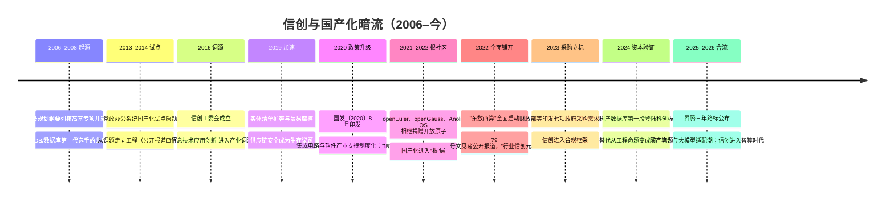
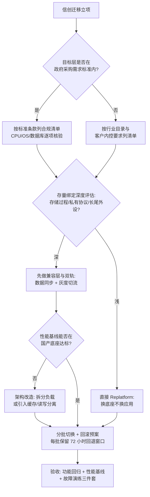

# 暗流：信创与国产化（2006–今）

> 编年史记录的是浪潮，但真正塑造行业地形的是暗流。信创（信息技术应用创新）没有消费级叙事、没有热搜、没有"元年"式的高潮，却持续塑造着中国云计算市场最坚实的一块版图——尤其是政企市场。这篇记录一名云 SA 视角的观察，时间跨度从 2006 年科技规划纲要里的一个专项名字，写到 2026 年国产算力与大模型的合流。读完你能带走四样东西：一条可以对着公开资料核对的政策与技术时间线（2006–2026）；一份芯片、操作系统、数据库、中间件、整机五层的替代现状盘点（替代到哪、卡在哪）；一张"技术源头 + 现状"的生态谱系表；以及四条一线判断——云是信创的载体、迁移方法论可复用、生态有复利、AI 是信创的第二曲线。
>
> **史料口径声明**：本篇合规优先级最高。全部政策表述以官方公开发布原文为准；企业进展只取上市公司公告、年报与官网公开信息；行业格局取权威媒体与公开研究口径；不引用任何未公开的采购信息、内部系统名或内部数据；对未公开政策不做预测。凡二手口径一律标注"公开报道口径"。

**阅读导航**：只想快速对齐时间线的读者，读"概念与政策时间线"一节的 mermaid 与四阶段小节即可；要做选型与评估的读者，直接跳到"技术生态谱系"与"一线观察"（含迁移决策树与踩坑表）；关心政策与争议的读者，读"行业信创"与"反事实与争论"两节；想自行复核全部数字的读者，请先读"文号与口径核对指南"与文末"数字账本"的口径列。

## 为什么是暗流而不是浪

浪潮由市场叙事驱动，暗流由**供应链安全**驱动：

- 2019 年前后，国际贸易摩擦让"关键系统依赖单一外部供给"从风险议题变成生存议题
- 党政、金融、能源、交通等关键行业开始系统性地推进 IT 底座国产化
- 它不追求"颠覆体验"，追求的是**可控、可替代、可持续供给**——这种目标注定低调，也注定持久

**为什么暗流也要用编年史体记录**：浪的编年史靠发布会与融资新闻就能拼出时间轴；暗流没有这些锚点，它的时间轴藏在文号、目录批次、社区捐赠公告与上市公司年报里——**恰恰因为分散，才更需要有人把二十年拼成一张可以核对的图**。本篇的拼法：政策线取官方原文，产业线取公告与年报，格局线取权威媒体与公开研究，三线交叉后才落笔；交叉不上的，宁可不写。

供给侧与需求侧在 2019–2022 年同时收紧。供给侧：美国对华出口管制层层加码——2019 年起实体清单多次扩容，2022 年 10 月的"1007 规则"把先进计算芯片与半导体制造设备纳入管制；"会不会被断供"从风险议题变成排期议题。需求侧：2020 年国务院印发《新时期促进集成电路产业和软件产业高质量发展的若干政策》（国发〔2020〕8 号），把财税、投融资、市场应用等八方面支持制度化。**两端一起用力，替代就不再是风口，而是长期工程**——这正是"暗流"的定义：不靠风，靠自己流。

但暗流的源头比 2019 年早得多：**2006 年《国家中长期科学和技术发展规划纲要》列出的 16 个科技重大专项中，"核心电子器件、高端通用芯片及基础软件产品"（核高基）在列，2008 年专项启动**（公开报道口径）。CPU、操作系统、数据库的第一代国产选手，多数带着核高基课题的出身证明。把起点钉在 2006 年而非 2019 年，是理解这条暗流的第一把钥匙：**它不是应对摩擦的应急工程，而是延续二十年的国家技术议程**——摩擦只是把它的优先级从"重要"提到了"生存"。

## 概念与政策时间线（2006–今）

"信创"是信息技术应用创新的简称，词源可追溯到 2016 年 3 月成立的中国电子工业标准化技术协会信息技术应用创新工作委员会（信创工委会）。更早的行业词汇是"安可"（安全可控，2013–2016 年间试点阶段的常用口径，公开报道口径）——从"安可"到"信创"的换词本身就是一次叙事升级：**从"防守性的安全"转向"建设性的创新"**，政策语汇的变化往往预示着投入周期的拉长。公开政策与公开报道口径下的大事记：

五个节点值得展开：

- **2008 · 核高基启动**：重大专项把"芯"与"魂"（CPU 与基础软件）写进国家议程。今天谱系表里的多数名字（龙芯、麒麟系、达梦等的前身课题）都能追溯到这一时期的立项与人才积累。**遗产**：一代工程师与一批实验室，这是后面所有商业化的种子。
- **2013–2019 · 党政试点**：公开报道口径下，党政办公系统的国产化试点于 2013–2014 年前后启动，按批次推进至 2019 年；这一阶段验证的不是技术而是**方法论**——分批替换、双轨运行、回滚预案，后来行业信创的全部工程套路都在党政试点里预演过。**为什么是这时**：棱镜门事件（2013）让"信息安全"第一次成为全民议题，采购侧的风险偏好随之改变。
- **2022 年的两件事**：2 月，国家发改委等部门同意在京津冀、长三角等 8 地启动建设国家算力枢纽节点，"东数西算"工程全面启动；9 月底，国资委 79 号文见诸公开报道——原文未公开发布，本篇只取公开报道口径：央国企信息化系统要在规定年限内完成信创替代，范围覆盖芯片、操作系统、数据库、中间件等全链条，2022 年因此被业界称为"行业信创元年"
- **2023 年底**：财政部会同工信部正式印发《操作系统政府采购需求标准（2023 年版）》《数据库政府采购需求标准（2023 年版）》等七项标准——CPU、操作系统、数据库被写进政府采购需求标准，替代从"行业自觉"变成"合规框架"
- **2021–2022 的根社区捐赠潮**：openEuler、openGauss、Anolis OS 相继捐赠给开放原子开源基金会。国产化如果只做"商业发行版"，适配成本永远各家重复；有了根社区，多架构适配、驱动验证这些最贵的公共工程被社区摊薄——这是后面"生态复利"判断的底层依据

### 文号与口径核对指南（给想自行复核的读者）

本篇引用的官方文件按可得性分三档，复核路径如下：**一档（官网原文可查）**——国发〔2020〕8 号（中国政府网/部委转载）、七项政府采购需求标准（财政部官网通知页）、"东数西算"批复与答记者问（国家发改委官网）；**二档（官方发布会/官网新闻可查）**——昇腾路标与超节点规格（华为官网全联接大会主题演讲全文）、openEuler 部署量与版本节奏（社区官网与社区峰会公开材料）；**三档（仅公开报道口径）**——国资委 79 号文（原文未公开发布，本篇只引媒体对年限与范围的报道并明确标注）、党政试点起始批次、行业替代完成率类数字（本篇一律不引）。**读信创材料的第一技能是分清这三档**：把三档材料混引，是这个行业里最常见的"合规风险"与"认知风险"同源之处。

### 第一阶段（2006–2013）：从专项名单到第一批流片

**发生了什么**：核高基专项启动后，第一批成果在 2010 年前后陆续流片与发布（公开报道口径：龙芯 3A1000 四核处理器、银河麒麟服务器操作系统等均在 2010 年前后问世）；超算线上，国产处理器先于通用线拿到世界级成绩——神威系列在 2010 年代两度登顶 TOP500（2016 年太湖之光为全国产处理器配置）。**为什么是这时**：2006 年规划纲要把"芯魂"列为国家议程，财政课题经费第一次以"产品化"而非"论文"为验收口径。**留下了什么**：六条 CPU 路线中有四条的种子在这一阶段埋下；更重要的是留下了一条被反复验证的教训——**没有生态的芯片只是样品**，2010 年代初多数成果的产业化程度有限，直接塑造了后来"生态优先"的路线取舍。

回看这一阶段，还有一条"双主线"结构值得点破：**超算线与通用线从一开始就是两条河**。超算线（申威系）用国家任务养自主指令集，先在 TOP500 上证明"性能可以被讨论"，再慢慢向通用外溢；通用线（龙芯、鲲鹏、海光、兆芯系）直接面对市场与生态的残酷定价，走的是"先兼容、后自主"的迂回路。两条线在 2020 年代开始合流——超算系补生态、通用系补自主度——**今天谱系表上六家选手的站位差异，本质上就是当年选择哪条河的后果**。

### 第二阶段（2013–2019）：党政试点与"可用"到"好用"的长征

**发生了什么**：党政办公系统国产化试点分批推进；2016 年信创工委会成立，"信创"成为产业共同词汇；产品侧完成第一次代际更替——桌面 OS 从"能开机"走到"能办公"（麒麟、统信系），数据库从课题版本走到商业版本。**为什么是这时**：棱镜门（2013）与中兴事件（2018）先后把供应链风险从论文议题变成采购议题；试点给了国产软件第一批"真实用户反馈"。**留下了什么**：两条长期资产——其一是工程方法论（分批、双轨、回滚），其二是**目录与测评体系**：信创目录与适配测评成为后续所有行业采购的事实前置条件。这一阶段也留下了最贵的教训：长尾兼容性（外设、行业插件）的工程量远超主线替换，至今仍是终端信创的第一卡点。

这一阶段的产品组合史值得单记一笔：公开报道与行业复盘口径下，"飞腾 CPU + 麒麟 OS"（PK 体系）与"龙芯 + 自主 OS"等组合在试点期形成了最早的事实标准接口——整机厂、集成商、ISV 的适配工作第一次有了"参照组合"可循。**组合先于标准出现**，是信创早期生态的真实秩序：不是先有规范再有产品，而是先有跑得通的组合，再把它沉淀为目录与测评条款。理解这一点，才能理解为什么信创目录里的条目总是"成对"出现。

### 第三阶段（2020–2022）：信创元年与根社区捐赠潮

**发生了什么**：国发〔2020〕8 号把产业支持制度化；实体清单在 2019–2022 年多次扩容、2022 年 10 月"1007 规则"落地；openEuler/openGauss/Anolis OS 相继捐赠开放原子；"东数西算"启动与 79 号文见诸报道，行业信创元年开启。**为什么是这时**：供给端断供风险与需求端政策年限在同一个两年窗口叠加，替代从"可选"变成"排期"。**留下了什么**：根社区把多架构适配的公共成本社会化——这是信创二十年里**第一次出现"产业级公共品"**；同时，79 号文的年限口径让信创第一次有了可倒排的项目计划，产业链各环节的产能规划由此锚定。

这一阶段还有一个容易被遗忘的细节：**2020 年为什么被叫作"信创元年"**。不是因为技术在这一年突破，而是因为三件事同年发生——国发 8 号文给了产业制度化的支持框架、疫情后的新基建投资给了资金窗口、党政试点的批次收官给了第一批可复制的工程模板。**"元年"在信创语境里从来不是技术事件，而是"政策 + 资金 + 方法论"三要素齐备的年份**——这个定义方式，后来也被行业用来讨论"行业信创元年"（2022）与"信创智算元年"（2025，公开报道口径）。

### 第四阶段（2023–2026）：合规框架、资本验证与 AI 合流

**发生了什么**：2023 年底七项政府采购需求标准落地；2024 年达梦登陆科创板、寒武纪成为年度涨幅第一；2025 年昇腾公布三年路标与超节点产品、CANN 编译器开源；2026 年国产算力与大模型 Day-0 适配成为惯例、国家算力网数据公开。**为什么是这时**：前三阶段解决了"有没有"，这一阶段要回答"好不好、贵不贵、能不能持续"——资本市场的定价与 AI 的需求是两份最诚实的答卷。**留下了什么（进行中）**：信创从"政策市场"走向"政策 + 市场双轮"——AI 芯片层的订单第一次主要由真实算力需求驱动；而合规框架（采购标准）则把替代的底线固化成了行业基础设施。

**接下来十二个月我盯三个信号**：其一，Ascend 950 系列能否按 2026 年路标如期规模供货（路标兑现度是国产算力公信力的试金石）；其二，"Day-0 适配"是否从头部模型扩散到中长尾开源模型（生态惯例化的判据）；其三，七项政府采购需求标准是否启动修订（合规框架跟随技术代际更新的节奏）。三个信号分别对应**供给、生态、制度**三条线——与本篇时间线的三个阶段划分同构。

### 数字账本：可核对的公开锚点

| 条目 | 数值 | 时间与口径 |
| --- | --- | --- |
| 海光信息科创板 IPO 募资 | 106 亿元 | 2022-08，上市公司公开信息 |
| 寒武纪年度股价涨幅 | +383%（A 股第一） | 2024 年，交易所公开数据 |
| 寒武纪首次分红 | 首个盈利年度后宣布 | 2026-02，上市公司公告 |
| 龙芯 3A6000 主力芯片出货 | 超百万片 | 2026-05 公开报道 |
| openEuler 系累计部署 | 超 1600 万套 | 2025 年公开报道口径 |
| 本土数据库厂商 Top5 份额 | 约 27% → 约 55% | 2018 → 2022，IDC 市场跟踪 |
| 八大枢纽建成智算规模 | 138.8 万 PFLOPS（占全国八成以上） | 2025 年底，公开报道口径 |
| 全国智算总规模 / 高质量数据集 | 240 万 PFLOPS / 超 12 万个（1565 PB） | 2026-08，国家数据局公开口径 |

这张账本的读法：**左半边（公司）看资本是否愿意为替代定价，右半边（社区与算力网）看公共品是否真的被摊薄**。两条曲线在 2024–2026 年同时向上，是"暗流变成地质运动"最硬的证据。

也要诚实记录**拿不到的数**：整机层的实际出货结构、终端 OS 的真实激活量、各行业替代完成率的官方统计，均无公开权威口径；市面上流传的百分比多出自厂商自述或研究机构的付费报告摘要。**编年史的原则是：宁可留白，不引孤证**——上表只收可回溯到公告、官网或官方发布会的数字，其余一律以"公开报道口径"定性表述。

## 技术生态谱系：五层盘点，替代到哪、卡在哪

谱系表的读法先说清楚：**"技术源头"决定天花板，"生态现状"决定地板**。源头是授权还是自研，决定了极端情境下还能不能迭代（天花板）；生态厚度（编译器、驱动、长尾应用、人才）决定了今天能不能上生产（地板）。信创二十年里多数争论，都是把这两个变量混在一起谈造成的。下文的盘点，每一层都按"源头—现状—卡点"三段展开：

先看总览，再按层展开：

| 层 | 进展 | 难点 |
| --- | --- | --- |
| 芯片 | 多路线并行（六家 CPU + 多家 AI 芯片），算力供给多元化 | 单卡性能、先进制程供给与生态成熟度 |
| 操作系统 | 国产 Linux 发行版成为政企标配，根社区部署量千万套级 | 驱动与长尾软件兼容 |
| 数据库 | 国产分布式数据库在核心系统落地，头部公司上市 | 存量迁移的兼容性验证 |
| 中间件 | 接口标准清晰，党政金融电信规模替代完成度高 | 存在感低导致人才供给薄 |
| 云平台/整机 | 专有云形态承接国产化全栈；整机厂完成多路线适配 | 全栈适配的工程量 |

### CPU：三条指令集路线、六家选手

CPU 层路线最分岔，公开资料可核对的格局是"三大指令集路线、六家主要选手"。下表在原谱系基础上补"2026 年公开状态"一列：

| 厂商 | 指令集/架构 | 技术源头 | 生态位与 2026 年公开状态 |
| --- | --- | --- | --- |
| 华为鲲鹏 | Arm（Armv8 架构授权） | 架构授权 + 自研微架构，鲲鹏 920（2019） | 服务器与云主力；鲲鹏计算产业生态持续迭代 |
| 飞腾 | Arm（ARMv8 兼容） | 架构授权 + 自研内核（FT/S 系列） | 桌面与服务器，与麒麟等组合成生态 |
| 海光 | x86 | 2016 年与 AMD 设合资公司获 Zen 架构授权（合资结构：AMD 持股微电子公司 51%、集成电路公司 30%，公开资料口径），2019-06 列入实体清单后自主迭代 | 服务器；存量 x86 软件生态迁移成本最低；2022-08 科创板 IPO 募资 106 亿元 |
| 兆芯 | x86 | 威盛（VIA/Cyrix 系）x86 技术脉络（2020 年威盛向兆芯出售相关技术，公开报道口径） | 桌面与办公终端 |
| 龙芯 | LoongArch | 完全自主指令集（早期源于 MIPS，2021 年发布 LoongArch，原生指令 2565 条） | 自主程度最高的一线；3A6000 主力芯片出货超百万（2026 年公开报道） |
| 申威 | SW-64 | 完全自主指令集 | 源于超算（神威·太湖之光），向通用拓展 |

*图源：Wikimedia Commons（[File:Loongson-3A3000 1.jpg](https://commons.wikimedia.org/wiki/File:Loongson-3A3000_1.jpg)，芯片实物照片）*

*图源：Wikimedia Commons（[File:Sunway TaihuLight.jpg](https://commons.wikimedia.org/wiki/File:Sunway_TaihuLight.jpg)，CC BY-SA 4.0）。神威·太湖之光 2016 年以全部采用国产申威处理器的配置登顶 TOP500，是自主指令集路线最早的"性能可以被讨论"的时刻*

三条路线的本质是**在"生态兼容、供给可控、自研深度"三个变量之间做不同取舍**：x86 线对存量系统迁移最友好，但授权源头受制于人（海光 2019 年列入实体清单后无法再获新授权，只能消化存量 IP 自主迭代——这恰是"授权路线天花板"的活案例）；Arm 线拿架构授权、自研微架构，如今在服务器与政企市场占主流；LoongArch 与 SW-64 两条自主指令集线可控程度最高，代价是软件生态要从编译器、库、驱动一层层自建——这恰恰是信创最贵的部分。2023 年 11 月龙芯 3A6000 发布是自主线的公开坐标：LoongArch 无需国外授权，官方称性能追平国际主流；但一线要清醒：**CPU 的差距已从单核性能转向软件生态厚度**，指令集自主只是起点，长尾应用适配才是长征。

还有一条"第零路线"值得记档：**RISC-V**。这条开放指令集不在六家选手之列，但在中国的成长速度最快——因为它天然规避了授权断供问题，且与 IoT/边缘场景契合；openEuler 等根社区已把 RISC-V 列为一级支持架构（社区官网架构图可见）。我的判断：RISC-V 短期不会进入政企服务器主战场，但它是**下一条暗流的河道**——若先进制程供给长期受限，开放指令集 + 成熟制程的组合会成为性价比防线。

### AI 芯片：替代的新主战场

通用 CPU 的替代进入深水区时，AI 加速卡成了新的主战场——因为需求增速最快、也因为管制最严。公开资料可核对的三条线：

- **华为昇腾**：2018 年 Ascend 310、2019 年 Ascend 910 发布；2025 年 Ascend 910C 随 Atlas 900 超节点规模部署。2025 年 9 月全联接大会公布三年路标：Ascend 950 系列（950PR/950DT）、960（2027 年四季度）、970（2028 年四季度），"几乎一年一代、算力翻倍"；同期发布 Atlas 950 超节点（8192 卡、FP8 算力 8 EFLOPS）与 Atlas 960 超节点规划（15488 卡）
- **寒武纪**：2020-07 科创板上市；2024 年股价上涨 383% 成为当年 A 股涨幅第一；2024 年底实现首次单季盈利，2026 年 2 月公告首个盈利年度后的首次分红（上市公司公开信息口径）
- **海光 DCU 等**：x86 之外的第二条产品线，走 GPGPU 兼容生态路线（公开资料口径）

*图源：华为官网新闻《以开创的超节点互联技术，引领 AI 基础设施新范式》（徐直军在华为全联接大会 2025 上的主题演讲，2025-09-18；[来源页](https://www.huawei.com/cn/news/2025/9/hc-xu-keynote-speech)）*

我对这一层的判断：**AI 芯片是信创二十年里第一次"需求拉着供给跑"**——此前所有层的替代都是政策与风险驱动，唯独智算需求是市场自发的；这也解释了为什么国产 AI 芯片的迭代节奏（一年一代）快于任何传统信创品类。代价同样清楚：先进制程供给受限，"设计能力"与"制造能力"之间的剪刀差是这一层真正的卡点。

软件生态侧有一个 2025 年的关键动作必须记档：华为在昇腾产业峰会（2025-08-05）宣布**CANN 编译器与虚拟指令集接口开放、其余软件全开源**（全联接大会主题演讲回顾口径）。对一线的含义很直接：国产 AI 芯片的"算子适配债"第一次有了社区分摊机制——此前每家模型团队都要为每张国产卡单独啃算子覆盖，如今接口开放后，适配工作开始从"私有工程"变成"公共工程"。**这是信创"生态复利"逻辑在 AI 层的复刻**，与当年 openEuler 捐赠同源。

### 操作系统：两家商业双雄 + 两个根社区

商业版是"双雄"：麒麟软件的银河麒麟 V10（2020 年发布，次年迭代 V10 SP1）与统信软件的统信 UOS（由 deepin 演进），二者是政企终端与服务器的默认选项。根社区是 openEuler（华为 2021 年 11 月捐赠开放原子开源基金会）与 Anolis OS（阿里云等 2020 年联合发起、随后捐赠开放原子）。桌面与服务器是两个不同的战场：**服务器侧**的胜负手是多架构适配与长期维护（LTS 周期、安全响应），根社区发行版占优；**桌面侧**的胜负手是用户体验与外设兼容，商业双雄的应用商店与驱动中心是真实护城河——我在终端验收里见过最多的投诉不是"系统慢"，而是"某型号高拍仪没有驱动"。

*图源：Wikimedia Commons（[File:UOS-Screenshot-Main.png](https://commons.wikimedia.org/wiki/File:UOS-Screenshot-Main.png)，UOS 20 GNU/Linux 桌面截图）*

*图源：openEuler 社区官网（[来源页](https://www.openeuler.org/zh/)）。openEuler 社区首页的计算架构覆盖图：Arm、x86、RISC-V、SW-64、LoongArch 与 NPU/GPU/DPU 全覆盖，向下适配 100+ 整机、300+ 板卡，向上支撑服务器、云与云原生、边缘、嵌入式四类场景*

这张图解释了根社区在信创里的真实角色：**商业版 OS 不必各自从零做多架构适配，而是从根社区派生发行版，最贵的公共工程被社区摊薄**——上表六家 CPU 的指令集，在 openEuler 一张图里集齐。公开报道口径下，openEuler 系操作系统累计部署量在 2025 年已超过 1600 万套，在中国新增服务器操作系统市场份额连续居首；社区版本节奏也未停（24.03 LTS SP4 等 LTS 维护版持续发布，社区官网口径）。

卡点仍在长尾：外设驱动、小众工业软件、用户日用依赖的"最后 5%"兼容性。这也是我评估信创终端时最先核对的清单。

根社区还带来一个容易被忽略的治理变化：**开源基金会成为中立第三方后，"国产 OS"的边界从公司变成了社区**。openEuler 捐赠开放原子之后，贡献者不再只有华为系厂商；商业发行版之间的差异从"内核魔改"收敛到"工程与服务"。对采购方的实际影响是：评估一个国产 OS，除了看厂商资质，还要看其在根社区的贡献排名与 LTS 维护承诺——**社区健康度第一次进入了政企选型表**，这在 2020 年之前是不可想象的。

LTS（长期支持版）节奏是 OS 层最被低估的竞争力指标：政企系统的生命周期以 5–10 年计，一个只承诺两年安全维护的发行版在选型第一轮就会被淘汰；根社区与商业双雄如今都以" LTS 发布节奏 + 维护年限 + 延保服务"作为产品承诺的主体，版本路线图公开可查（社区官网与厂商官网口径）。**OS 层的竞争从功能表转向了时间承诺表**——这是信创把"长期主义"写进产品合同的又一个例子。

### 数据库：核心系统先破的一层

数据库是替代能见度最高的一层：

- **OceanBase**（蚂蚁）：2019 年 10 月首次参加 TPC-C 即以 6088 万 tpmC 登顶（此前纪录是 Oracle 的 3024 万），2020 年 5 月刷新到 7.07 亿 tpmC，相关成果入选 VLDB 2022——分布式架构登顶权威榜单，本身就是一次工程宣言
- **GaussDB / openGauss**（华为）：商业版 GaussDB 面向政企核心系统；开源根社区 openGauss 2020 年成立、2021 年捐赠开放原子，派生出多家商业发行版
- **达梦**：坚持原始创新路线的集中式代表，2024 年 6 月登陆科创板，被称为"国产数据库第一股"
- **TiDB**（平凯星辰）与 **TDSQL**（腾讯云）：前者在开源社区与海外市场有影响力，后者在金融核心系统稳步渗透

公开市场报告支持这个判断：IDC 中国关系型数据库市场跟踪显示，本土厂商 Top5 份额从 2018 年的约 27% 升至 2022 年的约 55%，国际厂商 Top5 同期从约 57% 降至约 27%；在金融等行业分布式事务型数据库本地部署市场，国产厂商已占主导份额。

卡点不在"能不能换"，而在**换的成本**：存量 SQL、存储过程、运维习惯的兼容验证，迁移窗口与回归测试。"Oracle 迁国产分布式"的工程量常常数倍于"IDC 上云"——这是我在信创项目里工时最重的一层。2024 年之后这一层的工具链明显成熟：主流国产数据库都推出了自家的迁移评估与同步工具（兼容性扫描、全量 + 增量同步、反向回流通道），"反向回流"尤其重要——它让回滚从"重新导数据"变成"切开关"，双轨期的心理成本因此大降。**工具链成熟度，是我判断某一层替代是否进入深水区的先行指标**：数据库层的工具链在 2024 年过关，OS 层的长尾外设工具链至今未过关。2025 年之后数据库层又出现一个新趋势：**集中式与分布式的产品边界在模糊**——国产厂商普遍同时提供集中式（兼容存量）与分布式（承接增量）两种形态，甚至在同一内核上做"单机分布式一体化"；对选型的影响是：别再问"选集中还是分布"，先问"五年内数据量与事务量的增长曲线长什么样"。

### 中间件：安静而稳的一层

中间件的替代逻辑最直接：应用服务器、消息中间件有明确的国际对标（WebSphere/WebLogic），接口标准清晰，东方通 TongWeb、宝兰德、金蝶天燕、中创等国产厂商已在党政、金融、电信完成规模替代，多家已上市。这层存在感低，但恰恰证明一条规律：**接口标准越清晰，替代越顺利**——替得最难的，永远是标准最模糊、绑定最深的地方。新的挑战在云原生一代：微服务治理、服务网格、消息队列（Kafka 系）没有"国际商业对标物"可替，国产中间件厂商转而以开源兼容 + 合规增值为路线——**替代逻辑从"对标替换"变成"生态卡位"**，这是中间件层 2024 年之后最有意思的变化。

### 整机与云：把适配组合封装成可交付整体

整机层（服务器、PC、终端）是谱系里最"无声"的一层：主流整机厂已完成对六条 CPU 路线的多架构产品线覆盖，信创目录内的机型选择早已不是问题。真正值得记录的是**云在这一层扮演的角色**：一座全栈信创专有云，本质上是把成千上万个适配组合（OS×DB×中间件×芯片）的验证结果封装成一个可交付整体——客户拿到的是验收过的整体，不是一堆零件（详见下节一线观察）。

专有云形态本身也在信创压力下完成了一次演化：2010 年代的专有云多是"IaaS 专属区"（硬件隔离、软件同栈），2020 年之后信创专有云普遍要求**全栈同构**——从芯片到云平台组件全部在目录内，且要提供与公有云同代的 API 与运维体验。这逼着云厂商把"适配矩阵"做成了产品能力：同一套云平台代码要在鲲鹏/海光/飞腾等多底座上通过同一组回归。**信创客观上提高了中国专有云工程的成熟度**——这是暗流对浪的反向塑造，少有人写，但一线感受极深。

## 行业信创：从党政到"2+8+N"（公开报道口径）

2020 年之后，信创的推进结构在公开研究口径里常被概括为"2+8+N"："2"指党政两大体系，"8"指金融、电信、电力、石油、交通、航空航天、教育、医疗八大行业，"N"指其余消费与制造行业。需要强调：这是**行业研究的归纳口径而非官方文件表述**，本篇仅借它描述推进次序，不引申任何未公开的指标。

| 行业 | 启动节奏（公开报道口径） | 替代重心 | 一线观察到的典型形态 |
| --- | --- | --- | --- |
| 党政 | 2013–2014 试点起，批次推进 | 终端 OS + 办公 + 政务云 | 双轨运行后整体切换 |
| 金融 | 2020–2022 年起核心系统试点 | 分布式数据库 + 中间件 | 核心下移、外围先行 |
| 电信 | 2021–2022 年起 B/O 域分批 | OS + 数据库 + 大数据平台 | 根社区发行版直采 |
| 能源/交通 | 2022 年 79 号文报道后加速 | 生产控制系统外的管理域先行 | 专有云全栈承接 |

分行业看，三条线的节奏差异值得记录。**金融**是最早也最谨慎的一条：核心账务系统的分布式改造与国产化替换往往合并立项——因为两者都要"停机窗口 + 数据零丢失"，合并做只痛苦一次；公开报道中多家银行的核心系统国产分布式落地案例，其工程叙事与"去 IOE"（2010 年代中期的互联网架构运动）一脉相承，只是约束集换成了目录合规。**电信**的体量最大：运营商的 B/O 域（业务/运营支撑系统）是国产 OS 与数据库最大的单一采购场景之一，根社区发行版在这一层第一次拿到"超大规模生产验证"。**能源与交通**最特殊：生产控制系统（电力 SCADA、轨交信号）涉及安全等级，公开口径下普遍采取"管理域先行、生产域审慎"的双速策略——**信创不是平均用力的运动，而是按安全域分速的工程**。

**为什么是这时**：行业信创在 2022 年提速，是三重叠加——79 号文的年限要求（公开报道口径）、"十四五"规划期内的信息化投资窗口、以及国产数据库/OS 在 2019–2021 年刚好跨过"能跑核心业务"的成熟度门槛。**留下了什么遗产**：其一，采购语言换代——2023 年七项政府采购需求标准把 CPU/OS/数据库的合规要求写成可核验条款；其二，验证资产沉淀——头部行业客户积累的适配与回归用例库，成为后续项目的公共财富；其三，人才结构变化——"信创适配工程师"从兼职变成岗位。

### 采购语言的合规细节：七项标准怎么读

2023 年底的七项政府采购需求标准（CPU、操作系统、数据库、中间件等）在一线的真正影响，是把"国产化"从形容词变成了**可核验条款集**。我的读法分三层：其一，标准规定的是"需求怎么写"（功能、性能、安全、兼容性要求的表述框架），而非指定品牌——把标准读成品牌清单是常见误读；其二，标准把兼容性与迁移成本第一次写进了采购文本（如数据库标准对 SQL 兼容、迁移工具的要求），投标方的应答材料因此多了"迁移方案"一章；其三，标准与信创目录的关系是"目录管资格、标准管验收"——两者叠加才是完整的合规闭环。**对架构师的实操含义**：标书技术附件的评审 checklist 可以直接从标准条款导出，这比任何厂商白皮书都可靠。

### 合规框架的三个常见误读

一线七年，我见过最多的三类误读，值得记进编年史当反面教材：**其一，把目录当品牌白名单**——目录管的是"资格"，同一品类内仍要按性能、服务、成本做技术选型；把目录读成指定名单，既违反采购精神也丢掉议价空间。**其二，把合规当一次性动作**——目录迭代、标准修订、型号下架都会让昨天的结论过期；合规基线必须像依赖库一样做版本管理与定期刷新（前文"把合规当代码管理"即此意）。**其三，把替代率当政绩指标**——替代率只回答"换了没有"，不回答"换得好不好"；真正该盯的是替换后的故障率、批处理窗口与运维工时这三条运营曲线。**信创的成熟度，最终写在运营指标里，而不是写在验收报告里**。

## 反事实与争论：三条公开辩论

编年史不只记共识，也要记争论。信创二十年有三条贯穿性的公开辩论，本篇各记双方最强论据与我的判断：

**其一，"市场换技术"还是"自主研发"（2006–2013 路线之争）。** 一方认为引进授权（x86/Arm）能快速补齐产品代差、让国产芯片先活下来；另一方认为授权路线的天花板在 2019 年已经显形（海光被列入实体清单后无新授权可获），自主指令集才是终局。**我的判断**：两条路线在历史上是互补而非互斥——授权路线为生态争取了十年时间窗，自主路线为极端情境保留了迭代权；真正的错误从来不是选哪条，而是**把路线选择当成信仰而非组合管理**。

**其二，"开源路线"是否等于"放弃自主"（2020–2022 根社区之争）。** 质疑方认为：基于 Linux 内核与开源社区的"国产 OS"，根子在人手里，捐赠社区更是"把资产送出去"；支持方认为：根社区模式把多架构适配的公共成本社会化，且中国贡献者已在多个根社区占据治理席位（openEuler 理事会、openGauss 组委会等，社区公开信息），"根"的定义权正在被参与改写。**我的判断**：自主的最小单位不是代码仓库，而是**持续参与治理的能力**——不参与的封闭比开放更脆弱。

**其三，"信创是成本还是保险"（2023–今经济之争）。** 成本方指出：目录约束缩小了采购的竞争集合，部分品类价格高于国际对标，且适配工程量真实存在；保险方指出：2019 年之后每一次断供事件若发生在核心行业，损失都远超二十年替代投入之和。**我的判断**：这是一道期望值题而非效率题——低概率、极高损失的风险，用确定性成本对冲是理性选择；但**对冲成本必须被诚实记账**，否则保险会变成寻租的遮羞布。这也是本篇坚持"数字账本只收可回溯数据"的原因。

## 人才与教育线：暗流的毛细血管

信创的最后一层基础设施是人。公开可核对的三条线：其一，2020 年国务院学位委员会设置"集成电路科学与工程"一级学科（公开文件口径），芯片人才培养从"微电子方向"升格为独立学科；其二，根社区把认证与课程做进了高校——openEuler 等社区的课程中心与高校合作课程已覆盖数百所院校（社区官网口径）；其三，企业侧的"信创适配工程师"从项目角色固化为岗位角色，头部云厂商与数据库厂商均有对应的认证体系。**为什么这条线重要**：谱系表里每一层的"生态厚度"，最终都折算成这一层有多少人会用它、修它、教它——**人才密度是生态复利的利率**。

## 与 AI 时代的交汇（进行时）

信创在 2024 年后进入新章节：**国产算力 + 大模型**。

- 大模型训练/推理的算力需求，与国产加速卡的供给成长期正面相遇。2025 年 9 月华为全联接大会公布昇腾芯片三年路线图，并发布单节点支持 8192 张加速卡的 Atlas 950 超节点（FP8 算力 8 EFLOPS、互联带宽 16 PB/s，官方口径）；此前的 Atlas 900 超节点（384 卡、300 PFLOPS）已累计部署超 300 套——"超节点 + 集群"成为国产算力的新形态，通用算力的替代链正在向智算力延伸
- 国家算力底座同步成型："东数西算"八大枢纽到 2025 年底已建成智算规模 138.8 万 PFLOPS、占全国八成以上；2026 年 8 月国家数据局公开口径下，全国智算总规模达 240 万 PFLOPS，已建成高质量数据集超 12 万个、总体量超 1565 PB——**信创的"基础设施化"在这一刻完成闭环：从替代单品到运营国家算力网**
- 绿色约束同期写入：按 2023 年五部门实施意见口径，2025 年底国家枢纽节点新建数据中心绿电占比需超 80%——国产算力基建从第一天就背着"双碳"约束建设，这与海外同期靠核电重启补课的路径形成对照（见 [AI 大模型时代](/chronicle/ai-era) 的电力侧讨论）
- 模型生态的国产化成为新一轮适配主战场：2025 年初 DeepSeek-R1 开源后一周内十余家国产芯片厂商完成适配；到 2026 年，新一代模型发布当天即有多款国产芯片 Day-0 适配（DeepSeek V4 系列发布时华为、寒武纪同步适配即为一例）。"国芯 + 国模"从口号变成工程惯例
- 对 SA 的新命题：在"国产化算力 × 大模型应用"的交叉约束下做容量规划与成本测算（方法见 [GPU 选型与推理成本测算](/ai/infra/inference/gpu-sizing)，约束集需更新）

国产算力适配的工程账，我在项目里沉淀为四行清单，此处公开：**算子覆盖率**（模型用到的算子在国产卡后端是否全覆盖，缺失算子的回退路径是什么）、**精度对齐误差**（同种子同数据下与基线底座的损失/指标偏差，经验上 loss 级偏差超过千分之几就要查算子实现）、**同任务吞吐比**（别比峰值 FLOPS，比真实任务的 token/s）、**故障恢复时长**（千卡级训练里断点续训的平均耗时）。四行里前两行决定"能不能用"，后两行决定"划不划算"。**这张清单与二十年前"Oracle 迁国产数据库"的评估清单同构**——信创的方法论资产，在 AI 层完成了第二次复用。

### 国产算力的国际维度（公开报道口径）

暗流也有出海口。公开报道口径下，2024–2026 年国产算力与开源模型的组合开始出现在海外市场：中东、东南亚等地的智算中心与主权 AI 项目中，"开源模型（Qwen/DeepSeek 系）+ 多元算力"的方案与欧美闭源栈形成对照；国产 AI 芯片厂商的海外收入占比虽无权威披露，但展会与伙伴生态的公开动作明显增多。**我的读法**：信创二十年解决的是"内需市场的可替代"，AI 浪第一次给了它"外需市场的可选择"——**替代叙事在全球南方市场可以被重新讲述为"多供应商叙事"**。这条线还在早期，证据以公开报道与展会信息为主，本篇只记方向、不记份额。

## 一线观察：为什么云是信创的载体

先交代观察位置：以下判断来自 2019–2026 年间我参与或复盘的信创与智算项目（客户一律泛化为"某行业客户"），覆盖党政终端、金融核心、电信 B/O 域与智算中心四类场景；凡涉及具体数字处，只引用可公开回溯的口径。

- **选型逻辑的转变**：从"性价比最优"到"合格集内性价比最优"——国产化名录成为前置约束，技术评估在约束内展开。这不是技术倒退，而是**约束条件的变化**，架构师的工作是把约束内的最优解找出来
- **云是信创的载体**：单点替换（换一台数据库）痛苦且低效，"全栈云平台整体承接"成为主流路径——这反而加速了专有云在政企的落地。一座全栈信创专有云，本质上是把成千上万个适配组合（OS×DB×中间件×芯片）的验证结果封装成一个可交付整体；客户拿到的是验收过的整体，不是一堆零件
- **迁移方法论的复用**：信创迁移与上云迁移是同一套方法：6R 策略、分批推进、可逆性优先。区别只在目标环境的约束集不同——上云迁移里的 Replatform 是"换底座不换应用"，信创迁移里是"Oracle 换国产分布式、CentOS 换国产 Linux"，评估清单、分批计划、回滚预案完全同构

| 6R 策略 | 上云迁移中的含义 | 信创迁移中的对应动作 |
| --- | --- | --- |
| Rehost | 虚拟机平移上云 | 整机替换为信创机型，应用不动 |
| Replatform | 换托管底座不换应用 | Oracle → 国产分布式数据库；CentOS → 国产 Linux |
| Refactor | 改造为云原生架构 | 结合替换做容器化/微服务化（一次停机两次收益） |
| Repurchase | 更换为 SaaS/新许可 | 更换为目录内商业发行版与服务订阅 |
| Retain | 暂不迁移 | 长尾外设/工控系统挂起，列入后续批次 |
| Retire | 下线冗余系统 | 借替换窗口清理僵尸系统（信创项目里最容易出政绩的一刀） |

- **生态的复利**：适配工作前期昂贵，但每完成一个组合（OS×DB×中间件），后续项目边际成本递减——先入场者吃到的就是这个复利。根社区把同一条规律放大到了产业级：1600 万套部署意味着每一次驱动适配、每一次版本回归的成本被摊得更薄
- **合规是活资产，不是死文档**：信创目录与测评报告都有版本与有效期，目录迭代、标准修订、型号下架都会让昨天的合规结论过期。我们把"合规基线"做成季度刷新的配置项而非项目交付物——**把合规当代码管理**，是信创项目与一般集成项目在工程管理上最大的差别
- **组织与人才的隐性成本**：信创项目最缺的不是架构师，而是"两头懂"的人——既懂存量系统（Oracle/CentOS 的脾气），又懂国产底座（麒麟/达梦/昇腾的边界）。这类人才在市场上没有标准画像，多数靠项目内部培养；**人才密度，是我评估一个团队信创交付能力的第一指标**

把这套方法论压成一棵可执行的决策树，是我给每个信创迁移项目开的第一个会：

配套一张踩坑表（全部来自脱敏复盘）：

| 坑 | 现象 | 根因与对策 |
| --- | --- | --- |
| 长尾兼容盲区 | 主线业务切换顺利，打印机/读卡器/行业插件失灵 | 外设与插件清单要在评估期实地盘点，别信资产表 |
| 存储过程债务 | 数据库切换后批处理窗口超时 | Oracle PL/SQL 语义差异逐条改写 + 回归；先迁数据后迁逻辑 |
| 性能基线错觉 | 测试环境达标，生产高峰崩 | 基线必须用生产流量回放；国产底座要单独做并发压测 |
| 双轨成本失控 | 双轨期拖过一年，运维双倍 | 双轨设硬性退出条件与日期，写进项目章程 |

三类典型场景的评估要点（客户一律泛化，方法可复用）：

| 典型场景 | 第一评估要点 | 最常见的返工点 |
| --- | --- | --- |
| 党政终端替换 | 外设与插件实地盘点 | 高拍仪/签章 UKey 驱动缺失 |
| 金融核心分布式化 | 批处理窗口与日切时序 | 存储过程语义差异导致对账不平 |
| 智算中心建设 | 国产卡算子覆盖与精度对齐 | 训练 loss 偏差溯源耗时长 |

## 结语

写到这里，本篇与[AI 大模型时代](/chronicle/ai-era)的接口也清楚了：那篇记"浪"，本篇记"地基"；那篇的成本曲线以 token 计，本篇的成本曲线以"适配组合"计；但两篇共用同一个判断框架——**区分范式与行情、区分能力与叙事、区分可回溯的数字与流传的百分比**。

浪潮决定行业的天花板，暗流决定行业的地基。十年之后回看，信创大概率不会有"退潮"的那一天——因为它本来就不是潮，而是地质运动。而 2025 年之后它又多了一层身份：**当国产算力开始承载全球瞩目的开源模型时，这条暗流第一次拥有了自己的浪头**——下一编年史作者要写的，也许是"信创如何从替代叙事变成创新叙事"。

把本篇放回[六浪序列](/chronicle/)里看，暗流与浪的关系也更清楚了：移动互联网浪给了信创"云"这个载体，AI 浪给了信创"算力"这个新需求，而信创反过来给每一浪都加了同一道约束——**供给必须可替代**。这道约束在顺周期里是成本，在逆周期里是保险；二十年的地质运动，买的正是这份保险。

> 暗流不追热点，只记可核对的事实与可复盘的判断。本篇随政策与产业公开信息持续修订（最近更新：2026-09）。

### 修订记录

- 2024：首版（2019–今时间线 + 四层盘点）。
- 2025-02：补国产算力适配潮一节（R1 之后）。
- 2026-09：重写为编年史体——起点前移至 2006 核高基，补四阶段叙事、AI 芯片层、整机与云层、行业信创合规细节、数字账本与迁移决策树；既有两张配图补齐图源图注，新增三张配图。

## 术语速查

| 术语 | 一句话解释 | 本篇出处 |
| --- | --- | --- |
| 核高基 | "核心电子器件、高端通用芯片及基础软件产品"国家科技重大专项（2008 年启动） | 时间线 |
| 信创工委会 | 2016 年成立的标准协会工作委员会，"信创"词源 | 时间线 |
| 2+8+N | 行业研究对信创推进次序的归纳口径（党政 + 八大行业 + 其余行业），非官方文件表述 | 行业信创 |
| 根社区 | 向开源基金会捐赠、由社区共治的操作系统/数据库上游项目（openEuler、openGauss、Anolis） | 生态谱系 |
| 实体清单 | 美国商务部出口管制名单，列入后获取美方技术需许可 | 生态谱系 |
| 超节点 | 机柜级互联把数千张加速卡做成"一台计算机"的算力形态（Atlas 900/950） | AI 交汇 |
| CANN | 华为昇腾的异构计算架构（编译器与算子库层），2025 年宣布开放开源 | AI 芯片 |
| 79 号文 | 国资委关于央国企信创替代年限要求的文件（原文未公开，本篇取公开报道口径） | 时间线 |
| 去 IOE | 2010 年代中期以开源/自研替代 IBM 小型机、Oracle 数据库、EMC 存储的架构运动 | 行业信创 |
| 专有云 | 部署在客户机房、由云厂商全栈交付与运营的云形态，信创全栈承接的主流载体 | 整机与云 |
| LTS | 长期支持版本：承诺固定年限安全维护的发行版节奏，政企选型的时间承诺指标 | 操作系统 |
| Day-0 适配 | 新模型发布当天即完成在某国产芯片上的推理适配并公开验证 | AI 交汇 |

## 站内相关

- [十年六浪：技术编年史总纲](/chronicle/) —— 本篇在六浪周期中的位置与"浪外暗流"的定位
- [AI 大模型时代](/chronicle/ai-era) —— 信创暗流与第六浪合流的地方（R1 时刻、国产算力适配潮）
- [GPU 集群与高速网络](/ai/infra/cluster) —— 超节点与国产智算集群的工程视角
- [数据库选型与架构](/cloud/data/database) —— 国产分布式数据库的技术脉络
- [虚拟化技术](/cloud/foundation/virtualization) —— 政企专有云底座的另一条主线

## 参考资料

<Refs>

### 文字来源（访问日期：2026-09-05）

1. 中国电子工业标准化技术协会信息技术应用创新工作委员会官网（2016 年 3 月成立）；维基百科"信创"条目. <https://www.itaic.org.cn/> ; <https://zh.wikipedia.org/zh-hans/%E4%BF%A1%E5%88%9B>
2. 国务院. 《新时期促进集成电路产业和软件产业高质量发展的若干政策》（国发〔2020〕8 号，2020-08）. <https://www.mee.gov.cn/zcwj/gwywj/202008/t20200806_792957.shtml>
3. 美国商务部 BIS 2022 年 10 月 7 日先进计算与半导体制造出口管制新规（"1007 规则"，公开声明）. <https://china.usembassy-china.org.cn/zh/commerce-implements-new-export-controls-on-advanced-computing-and-semiconductor-manufacturing-items-to-the-peoples-republic-of-china-prc/>
4. 国家发展改革委高技术司. 《就实施"东数西算"工程答记者问》（2022-02，8 枢纽 10 集群全面启动）. <https://www.ndrc.gov.cn/xxgk/jd/jd/202202/t20220217_1315795.html>
5. 公开报道口径：国资委 79 号文（原文未公开发布）见 EET-China《国央企 2027 年前须完成 100% 信息化系统的信创改造》及艾瑞咨询《2024 年中国办公信创场景实践研究报告》. <https://www.eet-china.com/mp/a421111.html>（本网络环境连接失败，疑地域限制；沿用原维护者 2026-09-04 核验结论）
6. 财政部、工业和信息化部. 《关于印发〈操作系统政府采购需求标准（2023 年版）〉的通知》（2023-12-26，七项标准之一）. <https://www.mof.gov.cn/jrttts/202312/t20231226_3924138.htm>
7. 华为官网新闻. 《华为捐赠欧拉共建数字基础设施开源操作系统》（2021-11）. <https://www.huawei.com/cn/news/2021/11/huawei-openeuler-openatom-foundation>
8. openEuler 社区官网（计算架构覆盖图、累计部署超 1600 万套等公开数据、24.03 LTS SP4 版本信息）. <https://www.openeuler.org/zh/>
9. InfoQ. 《阿里龙蜥操作系统捐给开放原子开源基金会》（Anolis OS，2020 年联合发起）. <https://www.infoq.cn/article/fpeiaBAgZN8lcBeVtEA1>
10. EET-China. 《新一代国产 CPU——龙芯 3A6000 发布，无需国外技术授权》（2023-11-28）；国际科技创新中心. 《龙芯 3A6000 主力芯片出货量超百万》（2026-05）. <https://www.eet-china.com/news/202311288253.html> ; <https://www.ncsti.gov.cn/kjdt/scyq/zgckxc/zgcdt/202605/t20260515_246756.html>
11. 维基百科. 龙芯中科条目（LoongArch 2021 年发布、原生指令 2565 条、产品线谱系）. <https://zh.wikipedia.org/wiki/%E9%BE%99%E8%8A%AF%E4%B8%AD%E7%A7%91>
12. 维基百科. 海光信息条目（2016 年 AMD 合资结构、2019-06 实体清单、2022-08 科创板 IPO 募资 106 亿元）. <https://zh.wikipedia.org/wiki/%E6%B5%B7%E5%85%89%E4%BF%A1%E6%81%AF>
13. 观察者网·科工力量. 《中国 x86 处理器发展现状》（海光 AMD Zen 授权脉络，2019-07）. <https://www.guancha.cn/kegongliliang/2019_07_03_507956.shtml>
14. 雷锋网. 《威盛以 2.57 亿美元出售 x86 等技术给兆芯》（2020-10，兆芯 x86 脉络）. <https://m.leiphone.com/category/chips/8vhjTEh4k1SVieEH.html>
15. 每日经济新闻. 《华为基于 ARM 架构发布鲲鹏 920 芯片》（2019-01-07）. <https://www.nbd.com.cn/articles/2019-01-07/1288871.html>
16. 科技部官网. 《申威处理器：中国超算最强芯》（神威·太湖之光，国产处理器登顶 TOP500）. <https://www.most.gov.cn/ztzl/lhzt/lhzt2017/jjkjlhzt2017/201702/t20170228_131434.html>
17. 新华网. 《国产操作系统银河麒麟 V10 SP1 发布》（2021-10）；百度百科"银河麒麟"条目（V10 于 2020 年发布，评为 2020 年度央企十大国之重器）. <https://www.xinhuanet.com/info/20211028/fb1caeb9450848bab20b6b59c15b122f/c.html> ; <https://baike.baidu.com/item/%E9%93%B6%E6%B2%B3%E9%BA%92%E9%BA%9F/2413751>
18. OceanBase 官网新闻；VLDB 2022 论文. *OceanBase: A 707 Million tpmC Distributed Relational Database System*（TPC-C 6088 万/7.07 亿 tpmC）. <https://www.oceanbase.com/news/in-0-707-billion-the-technical-breakthrough-behind-the-tpc-c-was> ; <https://www.vldb.org/pvldb/vol15/p3385-xu.pdf>
19. 证券时报. 《达梦数据：国产数据库第一股登陆科创板》（2024-06-12）. <https://www.stcn.com/article/detail/1228405.html>
20. IDC. 《中国关系型数据库市场跟踪》系列（2022H2 本土 Top5 约 55% vs 国际 Top5 约 27%；2024H2 市场概况）. <https://my.idc.com/getdoc.jsp?containerId=prCHC53610625>
21. 华为官网新闻. 《以开创的超节点互联技术，引领 AI 基础设施新范式》（华为全联接大会 2025：昇腾 950/960/970 路标、Atlas 900/950/960 超节点规格与部署数据）. <https://www.huawei.com/cn/news/2025/9/hc-xu-keynote-speech>
22. 财联社. 《国芯+国模！DeepSeek 适配国产芯片，AI 算力底座迈向多样化》（2025-02 适配潮）. <https://www.cls.cn/detail/2357012>
23. Wikipedia. [Cambricon Technologies](https://en.wikipedia.org/wiki/Cambricon_Technologies)（2020-07 科创板 IPO、2024 年股价 +383%、2024 年底首次单季盈利、2026-02 首次分红）
24. 维基百科. 东数西算条目（2022-02 全面启动；2025 年底枢纽智算 138.8 万 PFLOPS 占全国八成；2026-08 国家数据局口径智算总规模 240 万 PFLOPS、数据集 12 万个/1565 PB）. <https://zh.wikipedia.org/wiki/%E6%9D%B1%E6%95%B8%E8%A5%BF%E7%AE%97>

### 图片来源（访问日期：2026-09-05）

1. loongson-3a3000.jpg — Wikimedia Commons *File:Loongson-3A3000 1.jpg*. <https://commons.wikimedia.org/wiki/File:Loongson-3A3000_1.jpg>
2. sunway-taihulight.jpg — Wikimedia Commons *File:Sunway TaihuLight.jpg*（CC BY-SA 4.0）. <https://commons.wikimedia.org/wiki/File:Sunway_TaihuLight.jpg>
3. huawei-hc2025-keynote.jpg — 华为官网新闻配图（全联接大会 2025 主题演讲现场）. <https://www.huawei.com/cn/news/2025/9/hc-xu-keynote-speech>
4. uos-desktop.png — Wikimedia Commons *File:UOS-Screenshot-Main.png*. <https://commons.wikimedia.org/wiki/File:UOS-Screenshot-Main.png>
5. openeuler-computing-arch.jpg — openEuler 社区官网首页计算架构覆盖图. <https://www.openeuler.org/zh/>

### 站内相关

- 站内相关：[十年六浪](/chronicle/) · [AI 大模型时代](/chronicle/ai-era) · [GPU 集群与高速网络](/ai/infra/cluster) · [数据库选型与架构](/cloud/data/database) · [虚拟化技术](/cloud/foundation/virtualization)

</Refs>
