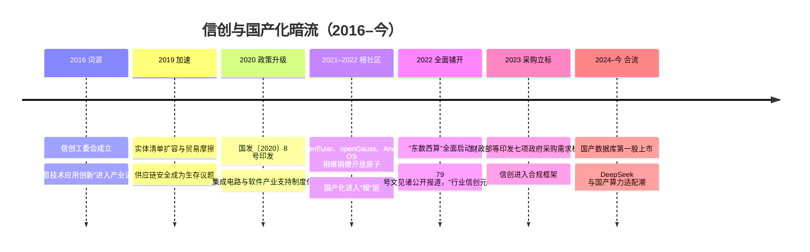

# 暗流：信创与国产化（2019–今）

> 编年史记录的是浪潮，但真正塑造行业地形的是暗流。信创（信息技术应用创新）没有消费级叙事、没有热搜、没有"元年"式的高潮，却持续塑造着中国云计算市场最坚实的一块版图——尤其是政企市场。这篇记录一名云 SA 视角的观察。读完你能带走三样东西：一条可以对着公开资料核对的政策与技术时间线；一份芯片、操作系统、数据库、中间件四层的替代现状盘点（替代到哪、卡在哪）；以及三条一线判断——云是信创的载体、迁移方法论可复用、生态有复利。

## 为什么是暗流而不是浪

浪潮由市场叙事驱动，暗流由**供应链安全**驱动：

- 2019 年前后，国际贸易摩擦让"关键系统依赖单一外部供给"从风险议题变成生存议题
- 党政、金融、能源、交通等关键行业开始系统性地推进 IT 底座国产化
- 它不追求"颠覆体验"，追求的是**可控、可替代、可持续供给**——这种目标注定低调，也注定持久

供给侧与需求侧在 2019–2022 年同时收紧。供给侧：美国对华出口管制层层加码——2019 年起实体清单多次扩容，2022 年 10 月的"1007 规则"把先进计算芯片与半导体制造设备纳入管制；"会不会被断供"从风险议题变成排期议题。需求侧：2020 年国务院印发《新时期促进集成电路产业和软件产业高质量发展的若干政策》（国发〔2020〕8 号），把财税、投融资、市场应用等八方面支持制度化。**两端一起用力，替代就不再是风口，而是长期工程**——这正是"暗流"的定义：不靠风，靠自己流。

## 概念与政策时间线

"信创"是信息技术应用创新的简称，词源可追溯到 2016 年 3 月成立的中国电子工业标准化技术协会信息技术应用创新工作委员会（信创工委会）。公开政策与公开报道口径下的大事记：

三个节点值得展开：

- **2022 年的两件事**：2 月，国家发改委等部门同意在京津冀、长三角等 8 地启动建设国家算力枢纽节点，"东数西算"工程全面启动；9 月底，国资委 79 号文见诸公开报道——原文未公开发布，本篇只取公开报道口径：央国企信息化系统要在规定年限内完成信创替代，范围覆盖芯片、操作系统、数据库、中间件等全链条，2022 年因此被业界称为"行业信创元年"
- **2023 年底**：财政部会同工信部正式印发《操作系统政府采购需求标准（2023 年版）》《数据库政府采购需求标准（2023 年版）》等七项标准——CPU、操作系统、数据库被写进政府采购需求标准，替代从"行业自觉"变成"合规框架"
- **2021–2022 的根社区捐赠潮**：openEuler、openGauss、Anolis OS 相继捐赠给开放原子开源基金会。国产化如果只做"商业发行版"，适配成本永远各家重复；有了根社区，多架构适配、驱动验证这些最贵的公共工程被社区摊薄——这是后面"生态复利"判断的底层依据

## 国产格局分层盘点：替代到哪，卡在哪

先看总览，再按层展开：

| 层 | 进展 | 难点 |
| --- | --- | --- |
| 芯片 | 多路线并行（多架构），算力供给多元化 | 单卡性能与生态成熟度 |
| 操作系统 | 国产 Linux 发行版成为政企标配 | 驱动与长尾软件兼容 |
| 数据库 | 国产分布式数据库在核心系统落地 | 存量迁移的兼容性验证 |
| 云平台 | 专有云形态承接国产化全栈 | 全栈适配的工程量 |

### CPU：三条路线、六家选手

CPU 层路线最分岔，公开资料可核对的格局是"三大指令集路线、六家主要选手"：

| 厂商 | 指令集/架构 | 路线来源 | 生态位 |
| --- | --- | --- | --- |
| 华为鲲鹏 | Arm（Armv8 授权） | 架构授权 + 自研微架构，鲲鹏 920（2019） | 服务器与云主力，鲲鹏计算产业生态 |
| 飞腾 | Arm（ARMv8 兼容） | 架构授权 + 自研内核（FT/S 系列） | 桌面与服务器，与麒麟等组合成生态 |
| 海光 | x86 | 2016 年获 AMD Zen 架构授权，此后自主迭代 | 服务器，存量 x86 软件生态迁移成本最低 |
| 兆芯 | x86 | 威盛（VIA/Cyrix 系）x86 技术脉络 | 桌面与办公终端 |
| 龙芯 | LoongArch | 完全自主指令集（早期源于 MIPS） | 自主程度最高的一线，3A6000 出货已超百万 |
| 申威 | SW-64 | 完全自主指令集 | 源于超算（神威·太湖之光），向通用拓展 |

*神威·太湖之光超级计算机，2016 年以全部采用国产申威处理器的配置登顶 TOP500。图源：Wikimedia Commons（[来源页](https://commons.wikimedia.org/wiki/File:Sunway_TaihuLight.jpg)，CC BY-SA 4.0）*

三条路线的本质是**在"生态兼容、供给可控、自研深度"三个变量之间做不同取舍**：x86 线对存量系统迁移最友好，但授权源头受制于人；Arm 线拿架构授权、自研微架构，如今在服务器与政企市场占主流；LoongArch 与 SW-64 两条自主指令集线可控程度最高，代价是软件生态要从编译器、库、驱动一层层自建——这恰恰是信创最贵的部分。2023 年 11 月龙芯 3A6000 发布是自主线的公开坐标：LoongArch 无需国外授权，官方称性能追平国际主流；但一线要清醒：**CPU 的差距已从单核性能转向软件生态厚度**，指令集自主只是起点，长尾应用适配才是长征。

### 操作系统：两家商业双雄 + 两个根社区

商业版是"双雄"：麒麟软件的银河麒麟 V10（2020 年发布，次年迭代 V10 SP1）与统信软件的统信 UOS（由 deepin 演进），二者是政企终端与服务器的默认选项。根社区是 openEuler（华为 2021 年 11 月捐赠开放原子开源基金会）与 Anolis OS（阿里云等 2020 年联合发起、随后捐赠开放原子）。

*openEuler 社区官网首页的计算架构覆盖图：Arm、x86、RISC-V、SW-64、LoongArch 与 NPU/GPU/DPU 全覆盖，向下适配 100+ 整机、300+ 板卡，向上支撑服务器、云与云原生、边缘、嵌入式四类场景。图源：openEuler 社区官网（[来源页](https://www.openeuler.org/zh/)）*

这张图解释了根社区在信创里的真实角色：**商业版 OS 不必各自从零做多架构适配，而是从根社区派生发行版，最贵的公共工程被社区摊薄**——上表六家 CPU 的指令集，在 openEuler 一张图里集齐。公开报道口径下，openEuler 系操作系统累计部署量在 2025 年已超过 1600 万套，在中国新增服务器操作系统市场份额连续居首。

卡点仍在长尾：外设驱动、小众工业软件、用户日用依赖的"最后 5%"兼容性。这也是我评估信创终端时最先核对的清单。

### 数据库：核心系统先破的一层

数据库是替代能见度最高的一层：

- **OceanBase**（蚂蚁）：2019 年 10 月首次参加 TPC-C 即以 6088 万 tpmC 登顶（此前纪录是 Oracle 的 3024 万），2020 年 5 月刷新到 7.07 亿 tpmC，相关成果入选 VLDB 2022——分布式架构登顶权威榜单，本身就是一次工程宣言
- **GaussDB / openGauss**（华为）：商业版 GaussDB 面向政企核心系统；开源根社区 openGauss 2020 年成立、2021 年捐赠开放原子，派生出多家商业发行版
- **达梦**：坚持原始创新路线的集中式代表，2024 年 6 月登陆科创板，被称为"国产数据库第一股"
- **TiDB**（平凯星辰）与 **TDSQL**（腾讯云）：前者在开源社区与海外市场有影响力，后者在金融核心系统稳步渗透

公开市场报告支持这个判断：IDC 中国关系型数据库市场跟踪显示，本土厂商 Top5 份额从 2018 年的约 27% 升至 2022 年的约 55%，国际厂商 Top5 同期从约 57% 降至约 27%；在金融等行业分布式事务型数据库本地部署市场，国产厂商已占主导份额。

卡点不在"能不能换"，而在**换的成本**：存量 SQL、存储过程、运维习惯的兼容验证，迁移窗口与回归测试。"Oracle 迁国产分布式"的工程量常常数倍于"IDC 上云"——这是我在信创项目里工时最重的一层。

### 中间件：安静而稳的一层

中间件的替代逻辑最直接：应用服务器、消息中间件有明确的国际对标（WebSphere/WebLogic），接口标准清晰，东方通 TongWeb、宝兰德、金蝶天燕、中创等国产厂商已在党政、金融、电信完成规模替代，多家已上市。这层存在感低，但恰恰证明一条规律：**接口标准越清晰，替代越顺利**——替得最难的，永远是标准最模糊、绑定最深的地方。

## 一线观察：为什么云是信创的载体

- **选型逻辑的转变**：从"性价比最优"到"合格集内性价比最优"——国产化名录成为前置约束，技术评估在约束内展开。这不是技术倒退，而是**约束条件的变化**，架构师的工作是把约束内的最优解找出来
- **云是信创的载体**：单点替换（换一台数据库）痛苦且低效，"全栈云平台整体承接"成为主流路径——这反而加速了专有云在政企的落地。一座全栈信创专有云，本质上是把成千上万个适配组合（OS×DB×中间件×芯片）的验证结果封装成一个可交付整体；客户拿到的是验收过的整体，不是一堆零件
- **迁移方法论的复用**：信创迁移与上云迁移是同一套方法：6R 策略、分批推进、可逆性优先。区别只在目标环境的约束集不同——上云迁移里的 Replatform 是"换底座不换应用"，信创迁移里是"Oracle 换国产分布式、CentOS 换国产 Linux"，评估清单、分批计划、回滚预案完全同构
- **生态的复利**：适配工作前期昂贵，但每完成一个组合（OS×DB×中间件），后续项目边际成本递减——先入场者吃到的就是这个复利。根社区把同一条规律放大到了产业级：1600 万套部署意味着每一次驱动适配、每一次版本回归的成本被摊得更薄

## 与 AI 时代的交汇（进行时）

信创在 2024 年后进入新章节：**国产算力 + 大模型**。

- 大模型训练/推理的算力需求，与国产加速卡的供给成长期正面相遇。2025 年 9 月华为全联接大会公布昇腾芯片三年路线图，并发布单节点支持 8192 张加速卡的 Atlas 950 SuperPoD——"超节点 + 集群"成为国产算力的新形态，通用算力的替代链正在向智算力延伸
- 模型生态的国产化成为新一轮适配主战场：2025 年初 DeepSeek-R1 开源后一周内十余家国产芯片厂商完成适配；到 2026 年，新一代模型发布当天即有多款国产芯片 Day-0 适配。"国芯 + 国模"从口号变成工程惯例
- 对 SA 的新命题：在"国产化算力 × 大模型应用"的交叉约束下做容量规划与成本测算（方法见 [GPU 选型与推理成本测算](/ai/infra/inference/gpu-sizing)，约束集需更新）

## 结语

浪潮决定行业的天花板，暗流决定行业的地基。十年之后回看，信创大概率不会有"退潮"的那一天——因为它本来就不是潮，而是地质运动。

## 站内相关

- [十年六浪：技术编年史总纲](/chronicle/) —— 本篇在六浪周期中的位置与"浪外暗流"的定位
- [AI 大模型时代](/chronicle/ai-era) —— 信创暗流与第六浪合流的地方

## 参考资料

<Refs>

### 文字来源（访问日期：2026-09-04）

1. 中国电子工业标准化技术协会信息技术应用创新工作委员会官网（2016 年 3 月成立）；维基百科"信创"条目. <https://www.itaic.org.cn/> ; <https://zh.wikipedia.org/zh-hans/%E4%BF%A1%E5%88%9B>
2. 国务院. 《新时期促进集成电路产业和软件产业高质量发展的若干政策》（国发〔2020〕8 号，2020-08）. <https://www.mee.gov.cn/zcwj/gwywj/202008/t20200806_792957.shtml>
3. 美国商务部 BIS 2022 年 10 月 7 日先进计算与半导体制造出口管制新规（"1007 规则"，公开声明）. <https://china.usembassy-china.org.cn/zh/commerce-implements-new-export-controls-on-advanced-computing-and-semiconductor-manufacturing-items-to-the-peoples-republic-of-china-prc/>
4. 国家发展改革委高技术司. 《就实施"东数西算"工程答记者问》（2022-02，8 枢纽 10 集群全面启动）. <https://www.ndrc.gov.cn/xxgk/jd/jd/202202/t20220217_1315795.html>
5. 公开报道口径：国资委 79 号文（原文未公开发布）见 EET-China《国央企 2027 年前须完成 100% 信息化系统的信创改造》及艾瑞咨询《2024 年中国办公信创场景实践研究报告》. <https://www.eet-china.com/mp/a421111.html>
6. 财政部、工业和信息化部. 《关于印发〈操作系统政府采购需求标准（2023 年版）〉的通知》（2023-12-26，七项标准之一）. <https://www.mof.gov.cn/jrttts/202312/t20231226_3924138.htm>
7. 华为官网新闻. 《华为捐赠欧拉共建数字基础设施开源操作系统》（2021-11）. <https://www.huawei.com/cn/news/2021/11/huawei-openeuler-openatom-foundation>
8. openEuler 社区官网（计算架构覆盖图、累计部署超 1600 万套等公开数据）. <https://www.openeuler.org/zh/>
9. InfoQ. 《阿里龙蜥操作系统捐给开放原子开源基金会》（Anolis OS，2020 年联合发起）. <https://www.infoq.cn/article/fpeiaBAgZN8lcBeVtEA1>
10. EET-China. 《新一代国产 CPU——龙芯 3A6000 发布，无需国外技术授权》（2023-11-28）；国际科技创新中心. 《龙芯 3A6000 主力芯片出货量超百万》（2026-05）. <https://www.eet-china.com/news/202311288253.html> ; <https://www.ncsti.gov.cn/kjdt/scyq/zgckxc/zgcdt/202605/t20260515_246756.html>
11. 观察者网·科工力量. 《中国 x86 处理器发展现状》（海光 AMD Zen 授权脉络，2019-07）. <https://www.guancha.cn/kegongliliang/2019_07_03_507956.shtml>
12. 雷锋网. 《威盛以 2.57 亿美元出售 x86 等技术给兆芯》（2020-10，兆芯 x86 脉络）. <https://m.leiphone.com/category/chips/8vhjTEh4k1SVieEH.html>
13. 每日经济新闻. 《华为基于 ARM 架构发布鲲鹏 920 芯片》（2019-01-07）. <https://www.nbd.com.cn/articles/2019-01-07/1288871.html>
14. 科技部官网. 《申威处理器：中国超算最强芯》（神威·太湖之光，国产处理器登顶 TOP500）. <https://www.most.gov.cn/ztzl/lhzt/lhzt2017/jjkjlhzt2017/201702/t20170228_131434.html>
15. 新华网. 《国产操作系统银河麒麟 V10 SP1 发布》（2021-10）；百度百科"银河麒麟"条目（V10 于 2020 年发布，评为 2020 年度央企十大国之重器）. <https://www.xinhuanet.com/info/20211028/fb1caeb9450848bab20b6b59c15b122f/c.html> ; <https://baike.baidu.com/item/%E9%93%B6%E6%B2%B3%E9%BA%92%E9%BA%9F/2413751>
16. OceanBase 官网新闻；VLDB 2022 论文. *OceanBase: A 707 Million tpmC Distributed Relational Database System*（TPC-C 6088 万/7.07 亿 tpmC）. <https://www.oceanbase.com/news/in-0-707-billion-the-technical-breakthrough-behind-the-tpc-c-was> ; <https://www.vldb.org/pvldb/vol15/p3385-xu.pdf>
17. 证券时报. 《达梦数据：国产数据库第一股登陆科创板》（2024-06-12）. <https://www.stcn.com/article/detail/1228405.html>
18. IDC. 《中国关系型数据库市场跟踪》系列（2022H2 本土 Top5 约 55% vs 国际 Top5 约 27%；2024H2 市场概况）. <https://my.idc.com/getdoc.jsp?containerId=prCHC53610625>
19. 华为官网新闻. 《以开创的超节点互联技术，引领 AI 基础设施新范式》（华为全联接大会 2025，昇腾路线图与 Atlas 950 SuperPoD）. <https://www.huawei.com/cn/news/2025/9/hc-xu-keynote-speech>
20. 财联社. 《国芯+国模！DeepSeek 适配国产芯片，AI 算力底座迈向多样化》（2025-02 适配潮）. <https://www.cls.cn/detail/2357012>

### 图片来源（访问日期：2026-09-04）

1. openEuler 主流计算架构覆盖图 — openEuler 社区官网首页. <https://www.openeuler.org/zh/>
2. 神威·太湖之光超级计算机 — Wikimedia Commons *File:Sunway TaihuLight.jpg*（CC BY-SA 4.0）. <https://commons.wikimedia.org/wiki/File:Sunway_TaihuLight.jpg>

</Refs>
