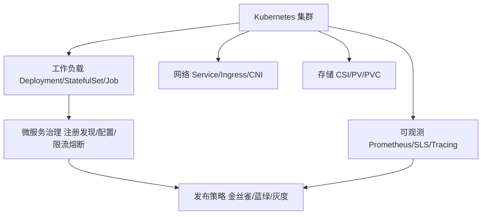

# 04 · 云原生

> 云原生不是"把应用塞进容器"，而是一整套以 Kubernetes 为底座、以声明式 API 为接口、以可观测性为生命线的工程体系。这一域记录从单机应用到大规模生产集群的落地经验。

## 这个域回答什么问题

- Kubernetes 的核心机制（声明式、控制器模式、调度）为什么是这样设计的？
- 企业级落地 K8s 要解决哪些"课本之外"的问题（多租户、网络、存储、发布）？
- 微服务化到什么粒度合适？治理体系怎么搭？
- 可观测（指标/日志/链路）如何从"有"到"好用"？

## 知识框架

## 文章列表

| 文章 | 状态 | 说明 |
| --- | --- | --- |
| [Kubernetes 核心机制与企业级落地](/cloud-native/kubernetes) | ✅ 已发布 | 种子文：声明式/控制器/调度 + 企业落地清单 |
| [微服务治理](/cloud-native/microservice) | 🚧 提纲 | 拆分粒度、注册配置、限流熔断、Mesh |
| [可观测体系](/cloud-native/observability) | 🚧 提纲 | 指标/日志/链路三支柱与告警治理 |

## 一句话入门

K8s 的价值在于**把运维知识代码化**：你声明期望状态，控制器负责收敛现实。理解了这一点，才谈得上"用"好它。
