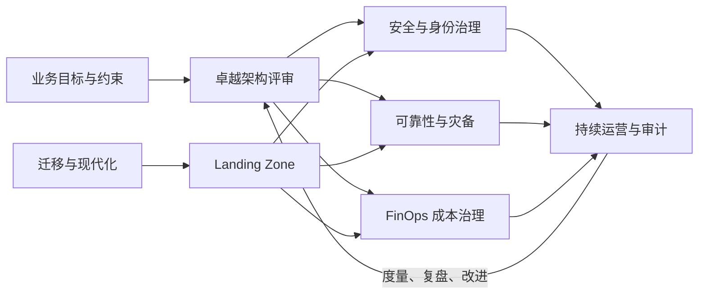

# 架构与治理

*本站生成的高清全文阅读地图；具体版本、参数与结论以正文引用的一手来源为准。*

> 计算、存储、网络和云原生解决“组件怎么工作”，架构与治理解决“怎样把组件长期组织成安全、可靠、可负担、可演进的生产系统”。本域以阿里云卓越架构与 AWS Well-Architected 为双参考系，把跨云通用原则和厂商实现分开表达。

## 这个域回答什么问题

- 怎样做一次不流于清单打勾的架构评审，并把发现转成改进闭环？
- 企业多账号、统一身份、审计与策略护栏怎样搭成 Landing Zone？
- 高可用、备份和容灾有什么区别，RTO/RPO 怎样驱动方案而不是反过来？
- 怎样从“月底看账单”进化到可分摊、可预测、可优化的 FinOps 机制？
- 迁移时怎样盘点依赖、选择 7R、组织波次、验证切换并保留回退路径？

## 知识框架

这不是第五层技术栈，而是覆盖基座、资源、数据与云原生四层的**横切护栏**。架构评审给出共同语言；Landing Zone 把共同语言固化成账号、身份、网络、日志和策略基线；安全、可靠性与成本治理负责持续运营；迁移则是把存量系统带入这套目标状态的工程过程。

## 两套官方框架怎样对齐

阿里云卓越架构明确为安全、稳定、成本、效率、性能五大支柱；AWS Well-Architected 为卓越运营、安全性、可靠性、性能效率、成本优化、可持续性六大支柱。二者不能逐字一一映射，但可形成以下工作视图：

| 通用问题域 | 阿里云卓越架构 | AWS Well-Architected | 本域承载 |
| --- | --- | --- | --- |
| 组织怎样高效变更与运营 | 效率 | 卓越运营 | [卓越架构方法](/cloud/architecture/well-architected) |
| 身份、数据和基础设施怎样受保护 | 安全 | 安全性 | [安全与身份治理](/cloud/architecture/security-governance) |
| 故障后怎样持续服务和恢复 | 稳定 | 可靠性 | [可靠性与灾备](/cloud/architecture/reliability-dr) |
| 资源怎样满足性能目标 | 性能 | 性能效率 | 与计算、存储、网络、数据文章交叉阅读 |
| 支出怎样对应业务价值 | 成本 | 成本优化 | [FinOps 成本治理](/cloud/architecture/finops) |
| 环境影响怎样纳入决策 | 分散在成本与效率实践中 | 可持续性 | 在评审中作为显式约束保留 |

## 文章列表

| 文章 | 状态 | 解决的问题 |
| --- | --- | --- |
| [卓越架构：从原则到持续评审](/cloud/architecture/well-architected) | 已发布 | 跨云支柱映射、评审证据、风险排序与改进闭环 |
| [安全与身份治理](/cloud/architecture/security-governance) | 已发布 | 责任共担、多账号、身份优先、数据保护与检测响应 |
| [可靠性与灾备](/cloud/architecture/reliability-dr) | 已发布 | SLO、故障域、RTO/RPO、四档灾备与演练 |
| [FinOps 成本治理](/cloud/architecture/finops) | 已发布 | 成本分摊、预算预测、单位经济性、资源与费率优化 |
| [云迁移与现代化](/cloud/architecture/migration) | 已发布 | 评估、Landing Zone、7R、迁移波次、切换与回退 |

## 推荐阅读顺序

1. 新建云上体系：卓越架构 → 安全与身份 → 可靠性 → FinOps。
2. 存量系统上云：迁移评估 → Landing Zone → 迁移波次 → 卓越架构复评。
3. 已稳定运行：从事故、审计问题和账单异常中任选一个真实信号，反向进入对应专题，不必按目录顺序通读。

## 一句话入门

治理的目标不是集中审批，而是把组织认可的边界做成**默认正确、可自动验证、允许团队自主交付**的云上铺路系统。

## 参考资料

<Refs>

- [阿里云卓越架构](https://help.aliyun.com/zh/product/2362200.html) — 五大支柱与持续度量、优化路径（访问日期 2026-09-20）
- [AWS Well-Architected Framework：六大支柱](https://docs.aws.amazon.com/wellarchitected/latest/migration-lens/well-architected-framework-pillars.html)（访问日期 2026-09-20）
- [阿里云 Landing Zone 搭建概述](https://help.aliyun.com/zh/cgc/user-guide/build-a-landing-zone-1)（访问日期 2026-09-20）
- [AWS：Organizing Your AWS Environment Using Multiple Accounts](https://docs.aws.amazon.com/whitepapers/latest/organizing-your-aws-environment/organizing-your-aws-environment.html)（访问日期 2026-09-20）

**站内相关**：[云计算全景](/cloud/) · [计算·存储·网络](/cloud/infra/) · [数据库·大数据](/cloud/data/) · [云原生](/cloud/native/)

</Refs>
