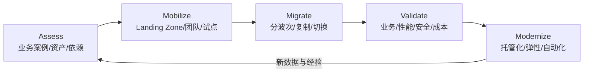
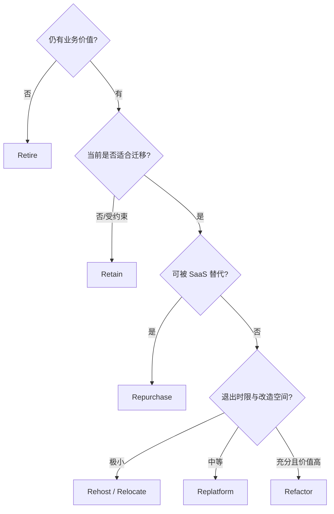
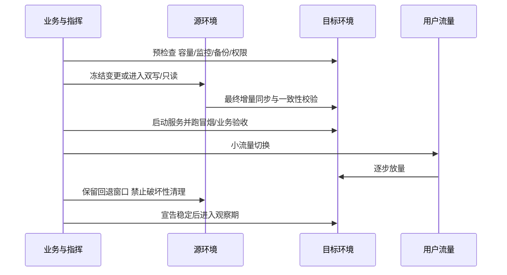

# 云迁移与现代化

*本站生成的高清全文阅读地图；具体版本、参数与结论以正文引用的一手来源为准。*

> 本文面向从 IDC、虚拟化平台或其他云迁移工作负载的项目负责人、架构师和交付团队。重点是把迁移当作“业务与依赖的可验证变更”，而不是服务器复制：先评估，先建 Landing Zone，再按 7R 与依赖组织波次，最后用可回退的切换和业务验收完成迁移。

## 迁移不是搬机器

一台服务器可以被复制，但一个工作负载还包含身份、网络、DNS、证书、数据、消息、定时任务、外部白名单、监控、发布流程和负责人。只迁主机，常见结果是目标端“能启动但不能生产运行”。

AWS 大规模迁移指导将过程概括为 Assess、Mobilize、Migrate and Modernize；阿里云云采用与云迁移中心强调调研、规划、成本与风险评估、Landing Zone、迁移计划和全生命周期管理。两者共同的工程主线是：

“迁移完成”与“现代化完成”应分开定义。大规模项目中，对所有应用一边重构一边搬迁会放大变量；常见稳妥路径是先用低改造策略降低数据中心退出风险，再按业务价值现代化，但对明确无法在目标环境运行或成本失控的系统，应在迁移前完成必要改造。

## Assess：先形成可信资产与业务案例

### 盘点的最小数据集

| 维度 | 必要字段 | 用途 |
| --- | --- | --- |
| 业务 | Owner、关键度、用户、峰谷、停机窗口 | 排优先级与定义验收 |
| 应用 | 组件、版本、启动顺序、发布方式、许可证 | 目标设计与兼容性判断 |
| 基础设施 | CPU/内存/存储/网络、利用率、增长 | 规格映射与 TCO |
| 依赖 | 入向/出向、数据库、消息、文件、DNS、第三方 | 分组与切换顺序 |
| 数据 | 规模、变化率、一致性、保留、敏感等级 | 迁移工具、带宽、RPO |
| 运营 | 监控、备份、补丁、值班、故障历史 | 目标运行模型 |
| 安全合规 | 身份、边界、日志、地域限制 | Landing Zone 与控制基线 |

阿里云 CMH 可通过在线或本地采集方式识别资源、进程、性能和网络互访并辅助生成拓扑与 TCO；AWS 指导同样把渐进式资产发现、依赖分析和持续完善清单作为组合迁移波次的基础。自动发现提供事实起点，业务 Owner 仍需确认“这个进程属于哪个业务、能否停、数据是否可重建”。

### TCO 不只比较实例单价

至少纳入：

- 当前机房/云的计算、存储、网络、软件许可、运维人力与折旧。
- 目标端按量、承诺、出站与跨地域流量、备份、日志、安全和支持费用。
- 一次性迁移工具、专线、并行运行、测试和人员培训成本。
- 现代化后的运维减少、交付速度、弹性与风险变化。

规格映射不能按“原机 16 核就买 16 vCPU”机械照搬；使用实际利用率、峰值、性能基线和增长假设 Right-size，并为首批迁移保留校准空间。

## 7R：为每个工作负载选择路径

| 策略 | 含义 | 适用 | 主要风险 |
| --- | --- | --- | --- |
| Retire | 下线 | 无使用、重复或价值不足 | 隐藏依赖、合规保留 |
| Retain | 暂留 | 受硬件、合同、监管或时机约束 | 永久“暂留”、混合运维成本 |
| Rehost | 原样迁主机/虚机 | 退出时限紧、兼容性高 | 把过量规格和旧运维带上云 |
| Relocate | 虚拟化/平台层整体迁移 | 希望少改应用与操作模型 | 延后云原生收益、平台约束 |
| Repurchase | 换 SaaS/新产品 | 通用能力、现系统差异小 | 数据迁出、流程与许可变化 |
| Replatform | 小改并用托管能力 | 数据库/运行时可平滑托管化 | 兼容与性能验证不足 |
| Refactor/Re-architect | 重构架构 | 高价值且现状限制业务 | 周期长、变量多、迁移与研发耦合 |

选择 7R 时同时记录理由、前置条件、目标状态、预计收益和现代化后续项。不要把 Rehost 默认包装成“第一阶段”却没有第二阶段预算；也不要因追求技术先进把低价值遗留系统强行 Refactor。

## Mobilize：先搭跑道，再让飞机降落

### Landing Zone 基线

迁移前完成[安全与身份治理](/cloud/architecture/security-governance)中的组织与多账号基线，至少包括：

- 账号/成员和环境结构，统一身份、紧急访问与权限护栏。
- VPC、IP 地址、DNS、专线/VPN、中心出口和流量检查路径。
- 控制面与数据访问日志集中投递，配置合规和安全告警。
- 标签、成本中心、预算、配额和资源命名。
- IaC、镜像、补丁、监控、备份和部署基线。

若先迁生产再补治理，后续每个账号和应用都要停下来返工。Landing Zone 不是一次性“大平台项目”，应先做满足首批工作负载的最小基线，再随着波次迭代。

### 试点波次

首批应用应“有代表性但不致命”：覆盖真实网络、身份、数据和运营链路，同时允许团队在失败时回退。过于简单的静态站点不能验证迁移工厂；最核心结算系统又会让团队不敢学习。

试点要产出可复用资产：目标架构模板、迁移 Runbook、自动化脚本、验证清单、问题库、实际吞吐与工期，而不只是“一个应用迁成功”。

## Migrate：依赖决定波次，不是服务器编号

### 波次规划

把强依赖且需要同步切换的组件放入同一迁移组，再综合业务窗口、风险、团队吞吐和目标端容量安排波次。常见顺序：

1. 基础连接、身份、日志、DNS 与共享服务。
2. 低风险无状态应用和开发测试环境。
3. 中等复杂度应用及其数据层。
4. 核心、有状态、高耦合系统。
5. 清理源环境、回收专线和许可。

共享数据库是最常见的波次阻塞点。若多个应用共库且不能同时迁，需先拆访问边界、建立临时连接或选择数据库先行/后行策略；不要在切换夜临时发现。

### 服务器、数据库与对象数据是三条不同链路

| 对象 | 常用方式 | 关键指标 |
| --- | --- | --- |
| 服务器/虚机 | 块级复制、镜像迁移、重新部署 | 初始同步、增量延迟、启动兼容、驱动与许可 |
| 数据库 | 备份恢复、全量 + CDC、逻辑/物理复制 | 一致性、复制延迟、DDL、字符集、回退写入 |
| 文件/对象 | 在线同步、并行复制、离线设备 | 文件数、带宽、变更率、校验和、元数据 |

迁移带宽估算起点：

`最低传输时间 ≈ 数据量 ÷ 有效吞吐`

有效吞吐不是链路标称带宽，还受协议、加密、小文件、源端读性能和限速影响。必须用真实样本测试，再给初次全量、增量追平和重传留缓冲。

## 切换：把每一分钟写进 Runbook

切换计划至少写明：决策人、每步开始/完成条件、数据冻结方式、DNS/路由变化、缓存与连接处理、验证查询、回退阈值、预计耗时、沟通频道和证据保存位置。

### 回退不是“把 DNS 改回去”

一旦目标端接受写入，源端数据就开始落后。回退策略必须明确：

- 在何时之前可无数据回灌直接回退。
- 目标端新增写入怎样同步回源或通过业务补偿处理。
- 消息、定时任务和外部回调怎样避免重复执行。
- 回退后何时重新发起，以及如何清理失败波次资源。

## Validate：四类验收缺一不可

| 验收 | 问题 | 证据 |
| --- | --- | --- |
| 业务 | 关键用户旅程和对账是否正确？ | 端到端脚本、业务抽样、账务对账 |
| 技术 | 性能、容量、依赖和失败行为是否符合目标？ | 压测、监控、故障演练、配额检查 |
| 安全与合规 | 身份、日志、加密、地域和漏洞是否符合基线？ | 策略与配置报告、审计日志 |
| 财务与运营 | 成本归属、预算、值班、备份和 Runbook 是否就绪？ | 标签覆盖、预算、恢复演练、交接记录 |

观察期结束后再删除源环境。删除前保留合同与合规要求的备份，确认 DNS、证书、白名单、监控、CMDB、备份和费用责任均已切换。

## 现代化：把迁移红利兑现

迁移后的优化清单通常包括：

- Right-size 和计费模式重配；删除并行期遗留资源。
- 用托管数据库、对象存储、消息和容器平台减少无差异运维。
- 把手工变更改为 IaC 与流水线，把监控改为 SLO 驱动。
- 建立多可用区、备份恢复和符合业务分级的 DR。
- 拆分最阻碍交付和弹性的耦合点，而不是为“微服务化”全面重写。

现代化优先级来自迁移过程中暴露的事实：最频繁的手工步骤、最长的停机原因、最贵的资源和最脆弱的依赖，是比架构潮流更可靠的路线图。

## 常见坑

| 坑 | 结果 | 对策 |
| --- | --- | --- |
| 资产清单只列服务器 | 漏掉业务与外部依赖 | 以工作负载和调用关系组织清单 |
| 按原规格一比一购买 | 把历史峰值与闲置照搬到云 | 基于利用率、基线和增长 Right-size |
| 迁移前不建 Landing Zone | 账号、网络、日志和权限反复返工 | 首批波次前完成最小治理基线 |
| 所有应用同时重构 | 范围和变量失控 | 每个应用选择 7R，迁移与现代化分阶段 |
| 波次按主机编号排 | 强依赖被拆散，切换互相等待 | 用依赖图和业务窗口分组 |
| 只验证端口连通 | 数据、权限和业务逻辑问题上线后暴露 | 四类验收与关键旅程自动化 |
| 回退计划没有数据路径 | 目标端产生写入后无法安全回源 | 定义写冻结、反向同步或补偿边界 |
| 切完立即删源 | 观察期问题无退路 | 满足稳定退出标准后再退役 |

## 参考资料

<Refs>

**阿里云官方**（访问日期 2026-09-20）

- [阿里云云采用框架：上云工具支持](https://help.aliyun.com/zh/caf/cloud-migration-tools)
- [什么是云迁移中心 CMH](https://help.aliyun.com/zh/cmh/cloud-migration-hub/what-is-cmh)
- [CMH 资源调研](https://help.aliyun.com/zh/cmh/cloud-migration-hub/resource-research-new)
- [什么是服务器迁移中心 SMC](https://help.aliyun.com/zh/smc/product-overview/what-is-smc)
- [工作负载上云](https://help.aliyun.com/zh/user-center/workload-on-cloud)

**AWS 官方**（访问日期 2026-09-20）

- [Mobilize your organization to accelerate large-scale migrations: Overview](https://docs.aws.amazon.com/prescriptive-guidance/latest/strategy-migration/overview.html)
- [Phases of a large migration](https://docs.aws.amazon.com/prescriptive-guidance/latest/large-migration-guide/phases.html)
- [About the 7 migration strategies](https://docs.aws.amazon.com/prescriptive-guidance/latest/large-migration-guide/migration-strategies.html)
- [Application portfolio assessment strategy](https://docs.aws.amazon.com/prescriptive-guidance/latest/strategy-application-portfolio-assessment-migration/introduction.html)
- [Detailed portfolio discovery](https://docs.aws.amazon.com/prescriptive-guidance/latest/strategy-migration/detailed-portfolio-discovery.html)

**站内相关**：[架构与治理导读](/cloud/architecture/) · [安全与身份治理](/cloud/architecture/security-governance) · [可靠性与灾备](/cloud/architecture/reliability-dr) · [FinOps 成本治理](/cloud/architecture/finops)

</Refs>
