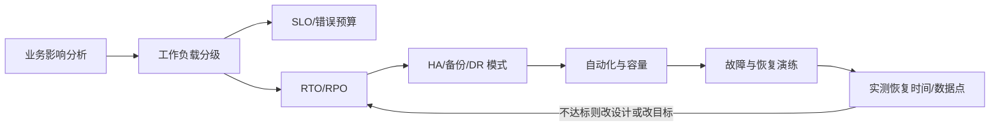
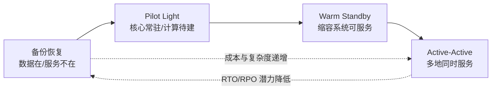

# 可靠性与灾备

*本站生成的高清全文阅读地图；具体版本、参数与结论以正文引用的一手来源为准。*

> 本文面向要为生产系统定义可靠性目标、设计高可用与容灾并组织演练的架构和运维团队。读完应能区分 SLO、HA、备份与 DR，用 RTO/RPO 和故障域选择最低足够复杂度的方案，并识别“有冗余但不可恢复”的假安全。

## 先分清四个问题

| 概念 | 回答的问题 | 典型范围 | 验证方式 |
| --- | --- | --- | --- |
| 可用性目标（SLO） | 正常运营期允许多少不可用或劣化？ | 用户请求、关键旅程 | SLI、错误预算、月/季度看板 |
| 高可用（HA） | 单个组件或可用区故障时如何继续服务？ | 同地域、多个故障域 | 故障注入、自动切换、容量验证 |
| 备份恢复 | 数据损坏或误删后怎样回到已知时间点？ | 数据、配置、制品 | 定期恢复、完整性和权限验证 |
| 灾难恢复（DR） | 整个工作负载或地域不可用时如何重建服务？ | 跨站点/跨地域 | 端到端切换与回切演练 |

多可用区不能防止逻辑误删；跨地域复制不能防止损坏同步；备份不能保证低 RTO；双活也不能自动解决写冲突。四者要组合，而不是互相替代。

## 从业务影响推导 SLO、RTO 与 RPO

### SLI、SLO 与错误预算

- SLI（Service Level Indicator）：实际测到的服务指标，如成功请求比例、P99 延迟、数据新鲜度。
- SLO（Service Level Objective）：一个时间窗口内对 SLI 的目标。
- 错误预算：允许不满足目标的空间。若月度可用性目标为 `99.9%`，理论不可用预算约为当月总分钟数的 `0.1%`；它是变更速度与稳定性之间的管理工具，不是鼓励把预算“用完”。

指标应贴近用户旅程。只监控“主机存活”会漏掉依赖超时、数据陈旧和权限错误；只看全站平均值会掩盖结算、登录等关键路径。

### RTO 与 RPO

- RTO（Recovery Time Objective）：事故后业务允许中断的最长目标时间。
- RPO（Recovery Point Objective）：恢复后允许丢失的最大数据时间窗口。

这两个值来自业务影响分析，不来自产品宣传页。先问“停 30 分钟损失什么”“丢 5 分钟订单能否补偿”，再决定跨可用区、异步复制、日志备份或多地域。目标越接近零，成本和系统复杂度通常越高。

## 故障域：不要把副本放在同一个篮子里

可靠性设计从列举故障开始：进程、实例、机架、可用区、地域、账号、身份系统、DNS、控制面、供应链和人为变更。副本只有跨越目标故障域才有意义。

| 故障域 | 常见失效 | 设计手段 |
| --- | --- | --- |
| 进程/Pod | 崩溃、内存泄漏、死锁 | 健康检查、自动重启、无状态化 |
| 实例/节点 | 硬件或宿主故障 | 多实例、自动替换、反亲和 |
| 可用区 | 电力、制冷、网络隔离 | 多 AZ 部署、区域级负载均衡、跨 AZ 数据副本 |
| 地域 | 大范围灾害或区域服务中断 | 跨地域备份、Pilot Light、Warm Standby、双活 |
| 账号/权限域 | 凭证泄露、策略误配 | 多账号隔离、独立备份/恢复角色、break-glass |
| 软件与变更 | 缺陷、错误配置、依赖升级 | 小批量发布、自动回滚、版本化配置 |
| 数据与业务逻辑 | 误删、污染、重复写、冲突 | PITR、不可变备份、幂等、对账与补偿 |

## 高可用：让局部故障不变成业务事故

### 冗余与独立性

多副本不是简单的数量问题。两套应用若共享同一数据库、身份服务、出口 NAT 或配置中心，它们仍有共同故障点。评审时沿真实请求路径检查入口、计算、状态、异步链路、第三方依赖和运维入口。

### 超时、重试、退避与幂等

分布式系统中“等待”本身会放大故障：下游变慢，上游线程和连接被占满，重试又制造更高流量。安全组合是：

1. 每跳设置有预算的超时，外层超时大于内层总预算。
2. 只重试瞬时、可幂等的错误；使用指数退避与随机抖动。
3. 限制重试次数与全链路重试预算，避免多层各自重试形成乘法放大。
4. 写操作使用幂等键、去重或业务补偿。

### 隔离、限流、降级与弹性

- 隔离：线程池、队列、租户、单元或 Cell 分隔爆炸半径。
- 限流：在过载前保护关键依赖，让系统以可预测方式拒绝而不是整体雪崩。
- 降级：提前定义非核心功能怎样关闭、读缓存怎样过期、写请求怎样排队。
- 弹性：按需求扩容，但同时验证配额、库存、镜像启动时间和数据库容量。

自动扩容不能修复无限重试、热点键或错误 SQL。资源弹性必须和背压、容量模型与配额管理一起设计。

## 备份：目标是可恢复，不是备份任务成功

一套可审计的备份策略至少回答：

- 备什么：数据、配置、密钥材料、基础设施代码、镜像/制品、外部依赖清单。
- 多久备：由 RPO 与变化频率决定全量、增量、日志或持续备份。
- 放哪里：跨账号/权限域，必要时跨地域；关键副本启用不可变或保留锁。
- 谁能删与恢复：备份删除权限和生产管理员分离；恢复使用专用角色。
- 怎样证明：定期恢复到隔离环境，校验完整性、应用一致性和实际耗时。

“3-2-1”可作为起点，但不能替代恢复目标。云原生系统还要备份控制面对象、密钥、对象版本、数据库日志和基础设施声明，而非只做云盘快照。

## 四档灾备模式

AWS 可靠性支柱将跨地域 DR 常见模式概括为备份恢复、Pilot Light、Warm Standby、多站点双活；阿里云稳定性与数据容灾指导同样强调从 RTO/RPO 和成本选择方案。下面保留模式本质，不把任何时间量级当成厂商 SLA。

| 模式 | 灾备侧状态 | 恢复动作 | 相对成本/复杂度 | 适用 |
| --- | --- | --- | --- | --- |
| 备份恢复 | 数据备份存在，服务未运行 | 建基础设施、恢复数据、部署应用、切流 | 最低 / 恢复较慢 | 非核心、可容忍较长中断 |
| Pilot Light | 核心数据和少量关键组件常驻 | 创建其余计算与依赖、扩容、切流 | 较低 / 中等 | RPO 较紧、RTO 可容忍部署时间 |
| Warm Standby | 缩小版完整系统可服务 | 扩容、提升写主、切流 | 较高 / 恢复较快 | 核心系统、分钟级恢复目标 |
| 多站点 Active-Active | 多地同时服务 | 隔离故障域、重路由、处理一致性 | 最高 / 最复杂 | 业务损失足以支撑长期复杂度 |

### 数据层决定容灾上限

- 异步复制：性能和地域距离更友好，但故障时可能有数据缺口。
- 同步复制：RPO 更低，但写延迟、仲裁和跨故障域网络质量成为约束。
- 单写多读：切换逻辑相对清晰，回切前需处理新旧主的数据差异。
- 多地多写：必须定义冲突检测、顺序、唯一 ID、业务合并和分区时写入规则。

任何复制模式都要保留时间点恢复能力。复制解决“副本可用”，备份解决“回到过去”。

## 切换与回切：两个不同的项目

切到灾备侧成功不代表恢复完成。完整 Runbook 至少包含：

1. 宣告事故与冻结高风险变更。
2. 判断故障域，确认是否满足切换条件。
3. 保护数据，决定是否停止主站写入。
4. 提升灾备数据角色，扩容并验证依赖。
5. 分批切流，验证关键用户旅程与对账。
6. 在灾备侧稳定运行并持续备份。
7. 原站修复后重新同步、验证，再安排独立的回切窗口。

DNS TTL、缓存、长连接、消息积压、第三方白名单和证书经常决定实际 RTO。演练若只验证“数据库能切”，得到的不是业务恢复时间。

## 演练体系

| 频率 | 演练类型 | 核心证据 |
| --- | --- | --- |
| 持续/每次发布 | 单元、集成、回滚和配置验证 | 自动测试、回滚时长 |
| 月度/季度 | 单组件、配额、过载、备份恢复 | MTTD/MTTR、恢复完整性 |
| 半年/年度 | 可用区或地域级桌面/实战演练 | 端到端 RTO/RPO、人工依赖、容量 |
| 重大变更后 | 针对新增风险复测 | 与上次基线差异 |

生产故障注入从小爆炸半径开始，设停止条件、监控和责任人。第一次地域级演练不应直接从“全量自动切换”开始；先做隔离环境恢复，再做影子流量、部分业务和计划内切换。

## 常见坑

| 坑 | 结果 | 对策 |
| --- | --- | --- |
| 把 SLA 当成自身 SLO | 忽略应用、依赖和操作导致的不可用 | 用端到端用户旅程定义 SLO |
| 同机房多个副本就叫容灾 | 单一 AZ/地域故障仍全灭 | 让副本跨越目标故障域 |
| 复制代替备份 | 误删和逻辑损坏同步到所有副本 | 保留不可变、可时间点恢复的备份 |
| 备份从未恢复 | 恢复时才发现权限、依赖或数据损坏 | 定期隔离恢复并记录实测 RTO/RPO |
| 所有系统都双活 | 成本和一致性复杂度失控 | 按业务等级选择最低足够模式 |
| 只演切换不演回切 | 灾备侧成为新的单点 | 把同步、验证和回切写入 Runbook |
| 依赖控制面临时创建资源 | 大故障时 API、配额或库存不可用 | 预置关键资源、配额与容量，IaC 重建 |

## 参考资料

<Refs>

**阿里云官方**（访问日期 2026-09-20）

- [保障系统稳定性的核心设计原则](https://help.aliyun.com/zh/well-architected/design-principles-3)
- [数据备份恢复保障业务持续运行](https://help.aliyun.com/zh/document_detail/2573842.html) — RTO/RPO 与数据容灾措施
- [应用多活容灾架构建设管理](https://help.aliyun.com/zh/ahas/user-guide/why-is-msha-required) — 业务影响分析与多活容灾目标
- [用云成本规划的关键考量因素](https://help.aliyun.com/zh/well-architected/cost-demand-analysis-with-cloud) — 可用性、RTO/RPO 与成本权衡

**AWS 官方**（访问日期 2026-09-20）

- [AWS Reliability Pillar](https://docs.aws.amazon.com/wellarchitected/latest/reliability-pillar/welcome.html)
- [Plan for Disaster Recovery](https://docs.aws.amazon.com/wellarchitected/latest/reliability-pillar/plan-for-disaster-recovery-dr.html)
- [Use defined recovery strategies to meet recovery objectives](https://docs.aws.amazon.com/wellarchitected/latest/reliability-pillar/rel_planning_for_recovery_disaster_recovery.html)
- [Deploy the workload to multiple locations](https://docs.aws.amazon.com/wellarchitected/latest/reliability-pillar/rel_fault_isolation_multiaz_region_system.html)
- [Back up data](https://docs.aws.amazon.com/wellarchitected/latest/reliability-pillar/back-up-data.html)

**站内相关**：[卓越架构](/cloud/architecture/well-architected) · [安全与身份治理](/cloud/architecture/security-governance) · [云存储](/cloud/infra/storage) · [可观测体系](/cloud/native/observability)

</Refs>
