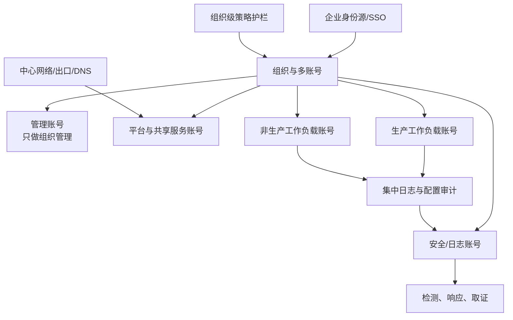
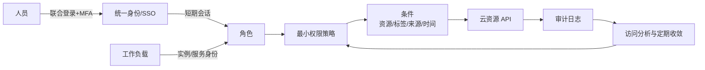
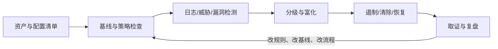

# 安全与身份治理

*本站生成的高清全文阅读地图；具体版本、参数与结论以正文引用的一手来源为准。*

> 本文面向要搭建企业云上安全基线的平台、安全与研发团队。重点不是罗列安全产品，而是建立一条可执行主线：先划清责任，再用多账号和 Landing Zone 建边界，以临时凭证和最小权限控制访问，最后用持续检测、自动修复和演练闭环验证。

## 责任共担：上云不是把安全外包

云厂商负责“云本身的安全”，包括物理设施、硬件、基础网络和云平台；客户负责“在云中怎样安全使用”，包括数据、身份权限、工作负载、网络暴露和配置。使用的托管层级越高，客户管理的底层越少，但**数据分类、访问授权、业务逻辑和合规责任不会消失**。

| 层级 | 云厂商主要负责 | 客户主要负责 |
| --- | --- | --- |
| IaaS 虚拟机 | 机房、硬件、虚拟化与云控制面 | 操作系统补丁、主机配置、应用、身份、数据、网络策略 |
| 托管数据库/容器 | 再向上承担服务运行时或控制面 | 数据权限、账号、参数、网络接入、应用与镜像安全 |
| SaaS | 应用运行和平台安全责任更多 | 用户生命周期、内容与数据、共享配置、终端与业务合规 |

“厂商有合规认证”不能证明工作负载合规；“数据已加密”也不能证明密钥、访问路径和恢复过程安全。责任共担要落实成控制矩阵：每项风险由谁配置、谁监控、谁响应、用什么证据验证。

## Landing Zone：先造护栏，再迁业务

Landing Zone 是企业云环境的组织与技术基线，至少覆盖账号结构、统一身份、网络连接、日志审计、安全合规和账号工厂。阿里云常用资源目录与云治理中心承载；AWS 常用 Organizations、Control Tower 与配套服务承载。

### 多账号不是为了“好看”

账号是云上最强的管理与隔离边界之一。推荐按环境、工作负载和监管边界拆分，而不是把整个组织塞进一个账号再用大量用户组模拟隔离。

| 能力 | 阿里云典型实现 | AWS 典型实现 | 设计要点 |
| --- | --- | --- | --- |
| 组织层级 | 资源目录、资源夹、成员 | Organizations、OU、member account | 管理账号不承载业务资源 |
| 组织护栏 | 管控策略 | SCP/RCP | 护栏限制权限上限，本身不授予权限 |
| 统一身份 | CloudSSO/RAM 角色 | IAM Identity Center/IAM role | 人员使用联合身份与临时凭证 |
| 账号基线 | 云治理中心账号工厂 | Control Tower account factory | 新账号自动落日志、网络、安全基线 |
| 配置审计 | 配置审计、操作审计 | Config、CloudTrail | 日志集中到业务团队不可删除的位置 |
| 资源分类 | 资源组、标签 | Account、Tag、Resource Groups | 标签用于业务语义，不替代强隔离 |

阿里云官方建议使用没有业务资源的账号作为资源目录管理账号；AWS 同样建议管理账号只执行必须由管理账号完成的任务。原因一致：组织级策略通常无法限制管理账号本身，混放业务会扩大爆炸半径，也会模糊费用和审计边界。

## 身份优先：长期密钥是例外

### 人员身份

- 员工从企业身份源联合登录，启用 MFA；避免为每个人创建长期 AccessKey。
- 日常管理员通过角色提升获得限时权限；高风险操作使用双人审批或多方授权。
- 保留独立的 break-glass 紧急账号，凭证离线保管，每次使用自动告警并事后复盘。
- 人员离职、转岗和项目结束应自动触发权限回收，而不是依赖半年一次人工盘点。

### 工作负载身份

- 云主机、容器、函数通过实例角色、服务账号或工作负载身份获取临时凭证。
- 密钥不写入镜像、代码仓库、环境变量模板和日志；需要的秘密进入专用秘密管理服务。
- 跨账号访问用角色信任关系和显式条件，不共享主账号密钥。

### 最小权限不是一次性手工雕刻

先从可工作的受控策略开始，通过真实访问活动生成或收敛策略，定期删除未使用的动作、资源和角色。权限判断至少同时看：身份策略、资源策略、组织护栏、权限边界、会话策略和显式拒绝。组织护栏决定“最多能做什么”，工作负载策略决定“当前允许做什么”。

## 纵深防御：六个控制面

| 控制面 | 预防 | 检测 | 响应 |
| --- | --- | --- | --- |
| 组织与身份 | 多账号、SSO、MFA、最小权限、护栏 | 异常登录、权限变更、外部共享分析 | 禁用会话、回收角色、启用紧急权限 |
| 网络 | 私网优先、分段、最小开放、统一出口 | 流日志、DNS 日志、暴露面扫描 | 隔离安全组、黑洞路由、WAF 规则 |
| 数据 | 分类分级、KMS、秘密管理、不可变备份 | 公开访问、异常下载、密钥使用审计 | 吊销密钥、冻结副本、恢复干净版本 |
| 工作负载 | 基线镜像、补丁、镜像签名、依赖治理 | 漏洞、运行时行为、完整性变化 | 隔离实例/Pod、替换镜像、轮转凭证 |
| 应用 | 安全开发、输入验证、限流、业务鉴权 | 应用审计、欺诈信号、异常调用 | 降级、阻断、修复与补偿 |
| 安全运营 | 资产清单、分级响应流程 | 集中日志、关联分析、威胁检测 | Playbook、取证、通报、复盘 |

### 数据保护要覆盖完整生命周期

1. 发现与分类：先知道有哪些敏感数据、在哪、由谁负责。
2. 传输与静态加密：明确 TLS 终止点、密钥边界与轮转策略。
3. 访问控制：业务身份访问数据，不把网络可达等同于有权读取。
4. 保留与删除：定义保存期限、法律保留和可证明删除。
5. 备份与恢复：备份独立账号/地域、限制删除，并定期恢复验证。

跨地域复制不能代替备份：错误删除、勒索加密和逻辑损坏也可能被同步复制。反过来，只有备份没有恢复演练，也只是“拥有一些无法证明可用的文件”。

## 安全运营闭环

告警必须能回答：发生了什么、影响哪个账号和工作负载、业务负责人是谁、是否仍在继续、第一步动作是什么。没有资产归属和 Runbook 的海量告警，只会制造安全团队的不可用性。

## 落地清单

### 第一个月：把高风险入口关上

- 根/主账号启用强 MFA，不创建或清理长期访问密钥。
- 员工改用 SSO 与临时角色；工作负载改用实例/服务身份。
- 集中收集控制面审计日志、配置变化、网络流日志和关键数据访问日志。
- 盘点公网资产、匿名访问、跨账号共享和高权限策略。

### 第一季度：建立组织级基线

- 建立资源目录/Organizations 与生产、非生产、安全、日志、共享服务账号。
- 用账号工厂/IaC 固化日志、网络、安全、标签和预算基线。
- 将底线控制写成组织护栏与部署前策略检查；例外有到期时间和负责人。
- 完成一次凭证泄露或公网暴露桌面演练，验证发现、遏制、轮转、恢复链路。

### 持续运营

- 每月收敛未使用权限和长期密钥；每季度复核跨账号信任。
- 把漏洞修复期限按资产等级定义，而不是所有漏洞同一 SLA。
- 以平均检测时间、遏制时间、基线合规率、例外逾期率衡量机制，不以告警数量衡量成绩。

## 常见坑

| 坑 | 风险 | 对策 |
| --- | --- | --- |
| 所有资源放一个账号 | 故障、权限、账单和审计边界混在一起 | 按环境和工作负载拆账号，集中治理 |
| 管理账号跑生产业务 | 组织超级权限与业务暴露面耦合 | 管理账号不放工作负载，职责委派出去 |
| 给程序发永久 AccessKey | 泄露后长期有效且难追踪 | 服务角色/工作负载身份 + 临时凭证 |
| 用 `*:*` 再靠“规范”约束 | 规范无法阻止误操作或密钥滥用 | 护栏限定上限，策略限定资源和条件 |
| 只做南北向边界防火墙 | 身份滥用、东西向与数据层风险不可见 | 身份、网络、数据、工作负载纵深防御 |
| 日志存在业务账号里 | 攻击者可连同证据一起删除 | 集中投递到独立安全/日志账号并限制删除 |
| 备份跟生产同权限域 | 凭证泄露可同时删除生产与备份 | 独立权限边界、不可变策略、定期恢复演练 |

## 参考资料

<Refs>

**阿里云官方**（访问日期 2026-09-20）

- [云上安全共同体：安全责任共担模型](https://help.aliyun.com/zh/acsg/cloud-security-community)
- [什么是资源目录](https://help.aliyun.com/zh/resource-management/resource-directory/product-overview/resource-directory-overview)
- [资源目录、资源组与标签的区别和联系](https://help.aliyun.com/zh/resource-management/product-overview/differences-and-relationships-among-the-resource-directory-resource-group-and-tag-services)
- [Landing Zone 搭建概述](https://help.aliyun.com/zh/cgc/user-guide/build-a-landing-zone-1)
- [RAM 用户常见问题](https://help.aliyun.com/zh/ram/support/faq-about-ram-users) — 最小权限与高权限策略风险

**AWS 官方**（访问日期 2026-09-20）

- [AWS IAM security best practices](https://docs.aws.amazon.com/IAM/latest/UserGuide/best-practices.html)
- [Best practices for the AWS Organizations management account](https://docs.aws.amazon.com/organizations/latest/userguide/orgs_best-practices_mgmt-acct.html)
- [Best practices for organizational units](https://docs.aws.amazon.com/organizations/latest/userguide/orgs_manage_ous_best_practices.html)
- [Define permission guardrails for your organization](https://docs.aws.amazon.com/wellarchitected/latest/security-pillar/sec_permissions_define_guardrails.html)
- [AWS shared responsibility model](https://aws.amazon.com/compliance/shared-responsibility-model/)

**站内相关**：[卓越架构](/cloud/architecture/well-architected) · [可靠性与灾备](/cloud/architecture/reliability-dr) · [云网络](/cloud/infra/network) · [可观测体系](/cloud/native/observability)

</Refs>
