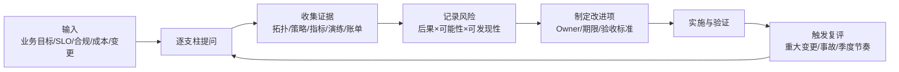

# 卓越架构：从原则到持续评审

*本站生成的高清全文阅读地图；具体版本、参数与结论以正文引用的一手来源为准。*

> 本文写给架构师、平台团队和技术负责人。读完应能把“最佳实践”从一叠检查清单，变成由业务目标驱动、以证据为基础、能持续关闭高风险项的评审机制；同时理解阿里云卓越架构与 AWS Well-Architected 的共性和边界。

## 是什么：一种决策与复盘机制

卓越架构不是固定参考架构，也不是把所有云产品都堆进拓扑图。它是一组跨工作负载通用的**设计问题、权衡原则和复评机制**：先明确业务结果与风险容忍度，再从运营、安全、可靠性、性能、成本等视角审视设计，最后把差距转成有负责人、有期限、有验证方式的改进项。

阿里云把框架组织为安全、稳定、成本、效率、性能五大支柱；AWS 使用卓越运营、安全性、可靠性、性能效率、成本优化、可持续性六大支柱。框架名称不是评分标准，真正有用的是它们共同要求团队做到三件事：

1. 用问题暴露假设，而不是凭经验宣布“架构没问题”。
2. 用业务后果给风险排序，而不是追求每项都达到最高配置。
3. 在重大变更、事故和业务目标变化后复评，而不是一次评审永久有效。

## 双框架对照：相似不等于相同

| 工作视角 | 阿里云 | AWS | 评审时要问 |
| --- | --- | --- | --- |
| 运营与交付 | 效率 | 卓越运营 | 变更能否小批量、可观测、可回退？团队是否知道谁负责？ |
| 安全 | 安全 | 安全性 | 身份是否最小权限？数据和密钥怎样分级保护？能否检测并响应？ |
| 可靠性 | 稳定 | 可靠性 | 关键依赖、故障域、配额和恢复目标是否已验证？ |
| 性能 | 性能 | 性能效率 | 资源形态是否适合访问模式？是否持续用压测和生产数据校正？ |
| 经济性 | 成本 | 成本优化 | 成本能否归属到工作负载与业务产出？供给是否匹配需求？ |
| 环境影响 | 未独立成柱 | 可持续性 | 能否减少闲置、数据移动和不必要的资源消耗？ |

“效率”和“卓越运营”高度相关，但不是严格同义词；AWS 的可持续性是独立支柱，也不意味着阿里云框架完全不考虑资源效率。跨云评审时应保留原框架语义，再建立自己的组织级问题库，避免硬凑一一对应。

## 架构评审的输入、过程与输出

### 输入：先定义“好”的含义

评审前至少准备以下材料。没有这些输入，评审容易退化成产品功能问答：

- 业务目标：用户旅程、峰值与增长假设、数据驻留要求、关键截止时间。
- 服务目标：SLI/SLO、RTO/RPO、支持时段、允许降级的功能。
- 当前证据：逻辑与部署拓扑、账号和网络结构、关键策略、近三个月事故与变更、容量与成本趋势。
- 约束：团队能力、迁移窗口、合同承诺、遗留系统、预算上限。

### 过程：问题必须落到证据

| 无效问法 | 有效问法 | 可接受证据 |
| --- | --- | --- |
| “系统高可用吗？” | “单可用区中断时，入口、计算、状态和依赖分别怎样变化？” | 故障域图、演练记录、切换时间线 |
| “权限做了最小化吗？” | “过去 90 天未使用的高风险权限有哪些？” | 策略分析、访问日志、权限收敛记录 |
| “成本优化了吗？” | “每订单/租户/请求成本趋势怎样，哪一项资源解释了变化？” | 分摊账单、单位成本指标、资源利用率 |
| “有监控吗？” | “哪个告警在用户感知前触发，谁在多长时间内采取什么动作？” | SLO 看板、告警路由、Runbook 与演练 |

### 输出：风险不是建议清单

每个发现至少包含五个字段：

| 字段 | 含义 | 示例 |
| --- | --- | --- |
| 风险陈述 | 在什么条件下会发生什么后果 | 单可用区数据库故障会使结算链路完全不可用 |
| 证据 | 事实来源 | 当前拓扑、最近演练、监控数据 |
| 优先级 | 业务影响与发生可能性 | 高；直接影响核心收入路径 |
| 改进项 | 可执行动作与负责人 | 建立跨可用区主备并完成故障切换演练 |
| 验收标准 | 可复测的完成定义 | 在规定 RTO 内恢复，数据丢失不超过 RPO |

不要把“启用某产品”直接写成风险关闭。产品开通只是控制存在，只有策略正确、日志可见、演练通过，控制才真正有效。

## 六类权衡：不存在全满分架构

### 可靠性与成本

多地域双活通常比备份恢复更快，也更贵、更复杂。决策顺序应是先量化停机和数据丢失的业务损失，再选达到 RTO/RPO 的最低复杂度方案，详见[可靠性与灾备](/cloud/architecture/reliability-dr)。

### 安全与交付速度

集中人工审批能阻止一部分风险，却也会制造绕过流程。更可扩展的方式是把底线做成策略即代码、账号基线和流水线检查，让合规路径成为最快路径。

### 性能与可移植性

深度采用托管数据库、Serverless 和云原生网络可减少运维并提升效率，但会提高迁移成本。可移植性不是默认越高越好，应和退出场景、监管约束及团队能力一起评估。

### 交付速度与长期演进

迁移期先 Rehost 可能更快，长期直接照搬峰值容量和传统运维方式却会放大成本。应明确“迁移完成”和“现代化完成”是两个里程碑，并为第二阶段预留账目与责任人。

### 一致性与可用性

跨地域写入不是勾选“双活”就结束；复制延迟、冲突解决、故障时写入仲裁和回切一致性都要成为显式设计。CAP 不是“三选二”口号，而是网络分区发生时的行为约束。

### 资源效率与可持续性

关停闲置、提升利用率、减少无效数据保留和跨地域传输，往往同时降低成本与环境负担；但若降低冗余破坏恢复目标，就不是可持续优化。优化对象是**每单位业务成果的资源消耗**，不是总资源越少越好。

## 一次可复用的评审工作坊

### 会前

1. 选定一个工作负载边界，避免把整个企业一次评完。
2. 邀请业务负责人、开发、平台、运维、安全、财务代表；明确决策人。
3. 分发输入清单，未准备的证据直接标记未知，不在会上凭印象补全。

### 会中

1. 先用 20 分钟确认业务目标、关键用户路径与不可接受后果。
2. 按支柱逐项讨论，每个问题只记录事实、假设和风险，不当场设计所有细节。
3. 用“影响 × 可能性”做首轮排序，再用实施成本与依赖关系安排路线。

### 会后

1. 高风险项必须进入正式交付计划；低风险项进入技术债池并保留接受理由。
2. 每个改进项绑定验证方式：压测、故障注入、恢复演练、权限分析或账单对比。
3. 重大架构变更、P1/P0 事故或业务目标变化立即触发复评；否则至少保持固定节奏。

## 成熟度模型：看机制，不看产品数量

| 阶段 | 特征 | 下一步 |
| --- | --- | --- |
| 被动 | 事故或审计前才检查；风险依赖个人记忆 | 建立工作负载清单和首次基线评审 |
| 可重复 | 有模板和周期，但证据人工拼接 | 接入配置、指标、演练和账单证据 |
| 可度量 | 风险、整改时长和复发率可追踪 | 把高频控制前移到 IaC/CI/CD |
| 持续改进 | 评审与变更、事故、成本和产品路线联动 | 持续删除低价值控制，校准业务结果 |

## 常见坑

| 坑 | 为什么无效 | 改法 |
| --- | --- | --- |
| 追求所有支柱“满分” | 忽略业务风险与成本边界 | 明确接受风险，优先关闭高影响项 |
| 只让架构师参加 | 运营、财务和业务约束缺席 | 让能提供证据和承担行动的人参加 |
| 把评审做成售前选型 | 产品覆盖不等于控制有效 | 先写控制目标，再映射产品实现 |
| 只评目标架构图 | 图里没有权限、变更、恢复和账单 | 同时审策略、流水线、指标、演练记录 |
| 整改项没有验收标准 | “优化一下”永远无法关闭 | 为每项绑定可观测结果和复测方法 |
| 一次通过后不再复评 | 架构、流量和组织都在变化 | 用事件触发加固定节奏复评 |

## 参考资料

<Refs>

**阿里云官方**（访问日期 2026-09-20）

- [阿里云卓越架构](https://help.aliyun.com/zh/product/2362200.html) — 安全、稳定、成本、效率、性能五大支柱
- [保障系统稳定性的核心设计原则](https://help.aliyun.com/zh/well-architected/design-principles-3) — 面向失败、精细运维与应急快恢
- [用云成本规划的关键考量因素](https://help.aliyun.com/zh/well-architected/cost-demand-analysis-with-cloud) — SLA、RTO、RPO 与成本权衡

**AWS 官方**（访问日期 2026-09-20）

- [The pillars of the AWS Well-Architected Framework](https://docs.aws.amazon.com/wellarchitected/latest/migration-lens/well-architected-framework-pillars.html) — 六大支柱定义
- [AWS Well-Architected Framework](https://docs.aws.amazon.com/wellarchitected/latest/framework/welcome.html) — 框架、设计原则与评审问题
- [AWS Well-Architected Framework 文档修订记录](https://docs.aws.amazon.com/wellarchitected/latest/framework/document-revisions.html) — 用于核对框架更新边界

**站内相关**：[架构与治理导读](/cloud/architecture/) · [安全与身份治理](/cloud/architecture/security-governance) · [可靠性与灾备](/cloud/architecture/reliability-dr) · [FinOps 成本治理](/cloud/architecture/finops)

</Refs>
