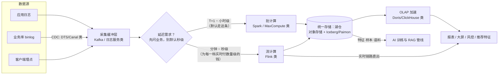

# 大数据体系

> 这篇写给两类人：正在从 0 到 1 搭数据平台的架构师，以及被"要不要上实时""湖仓一体是不是必选项""自建集群还建不建"这类问题缠住的技术负责人。读完你应该能：用"采集 → 存储 → 计算 → 服务"四层框架给任何一个大数据需求定位组件；知道批、流、Lambda、Kappa、湖仓分别解决什么问题、从哪个规模开始划不来；并绕开小文件、数据倾斜、Checkpoint 膨胀、口径不一致这四个我最常见的事故现场。

## 是什么：一套"把数据从产生的地方搬到使用的地方"的工程体系

大数据体系不是一个系统，而是**一组按延迟和成本分工的引擎与存储**。不管名字多花哨，拆开看都是四层：

- **采集**：把数据从业务侧拿出来。日志走日志采集（SLS/Flume 类），业务库变更走 CDC（DTS/Canal 类），用户行为走埋点。
- **缓冲与传输**：几乎所有稍大的架构都有一层消息队列（Kafka 类），把"产生数据的速度"和"处理数据的速度"解耦。
- **存储**：对象存储打底（OSS/S3 类），上面盖一层湖格式（Iceberg/Hudi/Paimon 类）或仓库内表，管住事务、Schema 和元数据。
- **计算**：离线批（MaxCompute/Spark 类）+ 实时流（Flink 类），按延迟需求分道。
- **服务**：OLAP 引擎（Doris/ClickHouse 类）、检索引擎（Elasticsearch）、以及大模型时代新增的消费者——特征/样本/语料管线，直接喂给训练（见站内[AI 训练基座](/ai/infra/training)）。

一个关键心智模型：**这套体系本质是在"延迟—成本—准确性"三角上做交换**。秒级和 T+1 的成本通常差一个数量级（详见"实践与选型"一节），所以第一个该问的问题永远是"业务到底需要多实时"，而不是"用什么引擎"。

## 为什么重要

**它是被业务逼出来的底座。** 推荐和广告把大数据平台从"IT 部门的项目"推成了"核心业务的心脏"——行为埋点进湖、出特征和样本、进模型训练，这条管线跑不动，推荐系统就是空转（这段历史在站内[短视频时代编年史](/chronicle/short-video)里展开过）。风控、大屏、实时经营分析是同样性质的需求。

**它是 AI 时代的地基。** 大模型训练对数据的依赖，让我这个做了十几年大数据的人第一次看到"老管线的新客户"：预训练语料的清洗去重、对齐数据的配比、向量与全文检索的混合召回，用的仍是采集、批计算、湖存储这套家当——只是消费者从 BI 报表换成了训练任务和 RAG（向量检索的选型见站内 [RAG 架构设计](/ai/application/rag-architecture)）。Apache Paimon 这类新一代湖格式甚至直接把"多模态 AI 工作负载"（向量、blob 存储、Python SDK）写进了产品定位。

**它是最容易失控的成本中心。** 计算可以按需买、网络可以重拉，数据只增不减。我见过太多"建的时候没规划、用的时候没人治理"的平台，存储三年翻十倍、一半数据没人读。成本治理不是锦上添花，是数据平台的核心工程能力。

## 架构与原理

### 采集与缓冲：日志队列为什么几乎总是第一站

*图源：Wikimedia Commons（[Apache Kafka logo](https://commons.wikimedia.org/wiki/File:Apache_Kafka_logo.svg)）*

Apache Kafka 官方把自己定义为**事件流平台**：发布订阅、持久存储、流处理三件事一体。它的核心抽象非常朴素——topic 被切成若干 **partition**，事件按 key 追加（append）到某个 partition 上，**同一个 partition 内严格有序，且天然就是并行度的粒度**；生产环境通常 3 副本，跨 broker 甚至跨机房复制。

一线经验：**分区键选错了，后面全架构都在还债**。我遇到过用"订单号"做分区键的埋点流，大客户下单集中在少数几个 ID 上，下游聚合直接热点倾斜；也见过分区数开太少，消费端加机器也没用（一个分区同一时刻只能被一个消费者线程处理）。规则很简单：**分区数决定吞吐上限，分区键决定负载分布**，这两个都要在容量规划时定，事后扩分区只改变未来数据、不改变历史分布。

### 存储：从 HDFS 到"对象存储 + 湖格式"

*图源：Wikimedia Commons（[Hadoop logo](https://commons.wikimedia.org/wiki/File:Hadoop_logo.svg)）*

HDFS 是这一波大数据工业化的起点。它的官方设计目标今天读仍然精确：为**廉价硬件**设计、故障检测与自动恢复是架构目标、面向**高吞吐而非低延迟**（明确放弃 POSIX 的实时性要求）、适合大文件与"一次写入多次读取"的批处理，以及那句著名的"**移动计算比移动数据便宜**"。

但它的设计里写明了代价：NameNode 把**全部文件元数据放在内存**——文件数（不是总容量）受内存上限约束。这正是"小文件问题"的物理根源：一堆 KB 级的文件，数据没多少，元数据先把 NameNode 压垮了。

后来的演化路线也清晰：**对象存储（OSS/S3 类）接管持久化层，湖格式接管"表"的语义**。

- **数据湖**（数据湖概念由 Pentaho 的 James Dixon 于 2011 年前后提出）：一切以原始格式（Parquet/JSON/日志/图片）躺在便宜的对象存储上。问题是早期湖没有事务、没有 Schema 约束、改错一批文件只能人肉回滚——"数据湖"很快有了绰号"数据沼泽"。
- **开放表格式**补上了这一课。Apache Iceberg 官方定义它是"面向海量分析数据集的开放表格式"，核心能力我逐条都有体感：**Schema 演进不留暗坑**（改列不会误删旧数据）、**隐藏分区**（查询者不需要知道分区列长什么样，避免了"忘写分区条件扫全表"这类静默错误）、**时间旅行与回滚**（读一个快照，事故后可回滚到坏数据写入前）、**行级更新删除**（规范 v2 起，更新不再需要重写整个分区；v3 规范已定稿，deletion vectors 等让更新删除的写入效率再上一个台阶）。多个引擎（Spark/Trino/Flink/Hive 类）读写同一张表，这是"湖仓"成立的底层前提。
- **为流而生的湖格式**：Apache Paimon 用 LSM 结构做湖上的**流式更新与 Changelog 生成**，把 CDC 数据（MySQL/Kafka 等）直接写进湖表、下游 Flink 流读——这是"批流一体"从口号变成可落地的关键一块。

### 计算：批和流是两种节奏，不是一个引擎的两种模式

*图源：Wikimedia Commons（[Apache Spark logo](https://commons.wikimedia.org/wiki/File:Apache_Spark_logo.svg)）*

**Spark** 官方定位是"大规模数据分析的统一引擎"——多语言、ETL/SQL/机器学习共用一套执行体系。它的批处理心智是**微批（micro-batch）**：流数据被切成一批一批的小 RDD/DataFrame 依次处理。这带来巨大的工程红利（批流同一套代码、容错沿用 RDD 血缘），但延迟下限就是"一批的间隔"。Spark 3.x 之后我最感激的功能是 **Adaptive Query Execution（AQE）**——运行时按真实数据量合并小分区、**拆分倾斜的 shuffle 分区**、必要时把 sort-merge join 换成 broadcast join。过去靠人肉调 `parallelism` 和 `salting` 的活，现在引擎能干一大半。

*Flink 官方的无界流/有界流示意图：无界流必须持续处理、依赖事件顺序；有界流可先全量再算（即批处理）——一个引擎两种数据观。图源：Apache Flink 官方文档（[What is Apache Flink? — Architecture](https://flink.apache.org/what-is-flink/flink-architecture/)）*

**Flink** 官方定义是"**对无界和有界数据流进行有状态计算的框架与分布式引擎**"——流是第一公民，批只是"有界流"的特例。它统治实时计算的原因，我认为就三条硬功夫：

1. **状态管理**：算子的状态（窗口聚合、Join 缓存、去重集合）常驻内存或 RocksDB 键值存储，官方生产案例是"日处理数万亿事件、维护数 TB 状态"的规模。这在"实时数仓"场景是刚需——双流 Join、维表补全、Session 窗口，本质都是在状态上算。
2. **一致性快照（Checkpoint）**：源自 Chandy-Lamport 分布式快照算法的变体——JobManager 让 source 往流里注入 **barrier**，barrier 随记录流动（不插队），把流切成"属于本次快照的记录"和"属于下次的记录"，各算子异步做本地快照。**检查点间隔就是故障恢复代价和运行时开销之间的交换**：间隔短，恢复快、回放少，但快照开销大。
3. **精确一次语义**：状态侧靠 Checkpoint 保证 exactly-once；配合两阶段提交的事务 Sink（典型如 Kafka 事务），端到端也能做到"不重不漏"。但要看清边界——**官方口径的 exactly-once 指的是状态一致性**；你的输出端（数据库、报表）是否幂等，是你自己的事。

批 vs 流一表看懂：

| 维度 | 批（Spark/MaxCompute 类） | 流（Flink 类） |
| --- | --- | --- |
| 延迟 | 分钟 ~ T+1 | 毫秒 ~ 秒 |
| 数据观 | 有界、完整后再算 | 无界、来了就算、靠 Watermark 判断"迟到" |
| 正确性 | 天然可重跑、易验证 | 依赖事件时间/乱序处理，口径复杂 |
| 成本 | 资源弹性、作业完了就还 | 常驻资源 + Checkpoint 存储 + 运维 |
| 出错恢复 | 删分区重跑 | 从快照恢复（回放 or 修状态），复杂得多 |

### 模式演进：数仓 → Lambda → Kappa → 湖仓

- **数据仓库**的经典定义（维基百科引用 Inmon）：面向主题、集成、反映历史变化（time-variant）、相对非易失的数据集合——先有"清洗建模后再分析"这个共识，才有一切分层方法论。
- **Lambda 架构**（Nathan Marz 2011 年提出）：批层用全量数据算"绝对正确的视图"，速度层补最近几小时的实时视图，服务层把两者合并。它用**两份代码、两套结果、一份口径**换来了"既准又快"。
- **Kappa 架构**（Jay Kreps 提出）：纯流式 + 单一代码库，需要重算时回放历史流。思想优雅，落地苛刻——要求流引擎足够强（状态、回放）、历史数据能便宜地重放。
- **湖仓一体（Lakehouse）**：2020/2021 年 Databricks 研究者论文提出，被各厂商迅速采纳。定义：**用开放表格式（Iceberg/Delta/Hudi）在廉价对象存储上，同时提供仓库的事务/质量管控与湖的开放/低成本**，多引擎读写同一份数据，内部再用 bronze/silver/gold（对应传统 ODS/DWD/DWS 思想）逐层加工。

整个演进的主语只有一个：**尽量让"一份数据"服务"多种计算"**，消灭 Lambda 时代"湖一套、仓一套、口径两套"的撕裂。

把前面所有组件接起来，是我给多数新客户画的第一张图——注意里面的决策点：

### 数仓分层：方法论没有死，它只是换了底座

Kimball 维度建模 + 分层仍然是离线数仓的主流骨架，因为它解决的不是技术问题，是**组织问题**——让口径有唯一的归属层：

我的落地原则：**下三层尽量复用、最上两层允许烟囱**。口径统一发生在 DWD/DWS；ADS 允许为业务快速定制——但如果发现大量逻辑在 ADS 里互相抄，说明 DWS 建薄了，该还的债迟早还。

### 调度与编排：批处理世界的中枢神经

给数据平台画组件对照表时，调度常常不在表里——但它一挂，前面画的管线一条都跑不起来。**批处理世界的中枢神经不是计算引擎，而是调度器**：它决定每个任务几点起、等谁的结果、失败重跑什么、核心报表几点前必须产出。

**调度对象是 DAG，不是单个任务。** 一个离线任务的产出是下一个任务的输入，一组任务按依赖连成 DAG（有向无环图：方向=依赖顺序，无环=不允许循环等待）。DAG 模型回答三件事：依赖（上游成功才起下游）、并行（互不依赖的分支全并发）、补数（口径改了或上游迟到，把指定历史时段整体重跑）。一条一线原则：**任务粒度按"产出表"切，不按"逻辑步骤"切**——每个任务对应一个可校验的产出，重跑才能定位到最小范围；切得太碎，调度器的元数据先垮。

*Apache Airflow 官方文档的 DAG 渲染示例（Graph 视图）：任务是节点、依赖是边，边标签即分支条件。图源：Apache Airflow 官方文档（[Concepts Overview](https://airflow.apache.org/docs/apache-airflow/stable/core-concepts/overview.html)，访问日期 2026-09-04）*

**Airflow** 是开源调度的事实标准，官方定位是"以代码方式编排、调度和监控工作流的平台"。心智模型就三个概念：**DAG**（Python 文件描述的依赖图）、**Operator**（任务模板，一个实例即一个任务）、**Sensor**（不做计算、只等条件的特殊 Operator——等上游分区就绪、等外部文件到达）。3.x 的架构由 Scheduler（触发与提交任务）、DAG Processor（解析 DAG 文件并序列化进元数据库）、API Server（承载 UI）、Metadata Database（PostgreSQL/MySQL）与执行任务的 Worker 组成；3.0 起引入 **Assets** 资产模型与**事件驱动调度**——DAG 不仅能按时间触发，还能被"某张表被外部系统更新"这样的事件触发，这是 Airflow 近年最实质的概念演进。

*Airflow 官方基础架构图：DAG 文件是唯一输入，Scheduler 与 API Server 各自独立成进程，元数据库是状态的心脏。图源：Apache Airflow 官方文档（[Concepts Overview](https://airflow.apache.org/docs/apache-airflow/stable/core-concepts/overview.html)，访问日期 2026-09-04）*

Airflow 强在 **code-first**：DAG 是代码，就能进 Git 评审、动态生成、单测，对工程型团队是天作之合；Provider 生态的覆盖面也几乎没有对手。弱项同样清楚：它骨子里是批调度，别指望它跑秒级管线；状态全在元数据库，规模一大 DB 与 DAG 文件解析吞吐是第一瓶颈；"DAG 即代码"还意味着数据工程师得有一套 Python 工程规范，对分析型团队门槛不低。

**DolphinScheduler** 是国产开源调度的代表：前身是易观内部的 EasyScheduler，2019 年进入 Apache 孵化器、2021 年毕业为顶级项目，是第一个国人主导的 Apache 调度类顶级项目。它和 Airflow 的差异很直观：**可视化 DAG 拖拽**（低代码，分析工程师也能搭管线）、去中心化的分布式架构、内置多租户与权限、中文社区资料充足。官方定位"现代数据编排平台"，强调日均千万级任务的处理能力。我的判断：团队工程化强、生态偏 Python 选 Airflow；要拖拽易用、租户隔离与中文生态，DolphinScheduler 是目前唯一值得认真评估的开源选项。

**托管调度**也得提一句：云厂商普遍提供托管的工作流调度服务，卖点是和云上计算引擎预集成——批、流、湖表任务都是原生任务类型，基线告警、多租户配额、值班体系是标准产品能力而不是自建工程。对走全托管湖仓的团队这是默认项；追求跨云与混合云开放性的，再回到开源调度。

**基线与 SLA 告警是调度的"操作系统"。** 实践与选型里成本治理一节讲的"跑批基线"，落点就在这里：给核心产出表设承诺完成时间，调度系统沿关键路径倒推每个上游任务的最晚起调时间，把告警从"产出已迟到"前移到"预计破线"。开源调度普遍只提供 SLA 违约回调一类能力，真正的基线管理往往靠自研或托管服务补齐——这一项的能力差距，是"开源 vs 托管"选型里的重要评估项。

### 数据治理与质量：让数据"找得到、敢用、可信"

采集、存储、计算三层解决"数据能不能算出来"，治理解决"算出来的数据有没有人敢用"。我把治理拆成四件事——**元数据、权限、质量、口径归属**——没有一件是宏大叙事，件件都是有明确交付物的工程体系。

**元数据与血缘：先让资产"找得到"、血缘"追得动"。** 元数据平台（DataHub 类）干三件事：数据资产目录（表、字段、报表可搜索）、从任务到表到字段的血缘图谱、以及归属与质量标签的载体。DataHub 孵化自 LinkedIn，最新 v1.7.x 延续"发现、治理、可观测"的定位。更底层的一块是 **OpenLineage**：血缘元数据的开放标准，定义 Job、Dataset、Run 三类实体加可自由扩展的 facet 机制，调度器与引擎（Airflow、Spark、Flink、dbt 等）按标准发 lineage 事件，任何符合标准的元数据平台都能消费。标准的意义在于血缘不再锁死在单一厂商私有协议里——和开放表格式一个逻辑：**标准开放，生态自长**。

**权限：谁能读哪张表，细到列和行。** Apache Ranger 仍是 Hadoop 生态的事实标准——官方定位"在 Hadoop 生态上启用、监控和管理全面数据安全的框架"，集中式策略管理加引擎侧插件，覆盖 Hive/Spark/Trino/HDFS 等的列级脱敏、行级过滤与访问审计。进了湖仓时代，权限的落点正从"引擎插件"向"目录层"迁移：开放表格式的 catalog 成为统一入口后，在 catalog 处执行一次权限、所有引擎生效，方向清楚，实现还在收敛。

**质量监控：时效、完整、一致三类断言。** 时效即上一节的基线；完整看行数波动区间、分区是否按时到达、主键唯一性、空值率与枚举漂移；一致看跨层、跨链路对账（常见坑里讲的批流对数，做成质量断言就从人肉抽查变成按时跑的任务）。工程落点的关键是**把质量断言嵌进 DAG**：数据写湖后立刻跑断言任务，断言失败阻断下游并通知责任人——质量是管线的一部分，而不是另一套巡检。

**口径归属治理：不解决"口径两套代码"，解决"口径没人负责"。** 口径不一致的病灶在常见坑里已拆解，治理侧的处方是四个组织机制：口径登记（任何指标有唯一登记条目与定义文本）、owner 制（每张 DWD/DWS 表唯一责任人，变更请求需责任人评审）、评审流程（口径变更像代码一样走评审、留版本）、消费入口统一（BI 与接口引用同一份 DWS 层产出，不允许各写口径）。这四件没有一件难，难的是有人执行——没有 owner 制的数据平台，半年就会回到混沌，我还没见过例外。

### 服务与检索：最后一公里的四种消费者

- **报表/自助分析**：高并发看板把数据装进 OLAP 引擎查（选型见站内 [OLAP 引擎：StarRocks、Doris 与 ClickHouse](/cloud/data/olap)，分析型负载的通用讨论在[数据库选型](/cloud/data/database)）；**交互式即席查询**则交给 Trino 类联邦查询引擎。Trino 官方定位是"面向大数据分析的快速分布式 SQL 查询引擎"：MPP 架构、内存中流水线执行，直接查对象存储上的 Parquet 与 Iceberg 表，经 connector 联邦 MySQL、Kafka、Elasticsearch 等异构源，数据不动、查询秒级到分钟级返回。它的主场是**湖仓的交互式分析入口**——数据科学探索、一次性取数、"多查一张表就少搬一次数据"的联邦场景；代价是没有本地数据缓存，高并发看板下延迟稳定性不如常驻 OLAP。**低并发交互用 Trino、高并发固定看板装进 OLAP**，这条分工线在生产里足够稳。
- **点查/宽表服务**：容易被忽略的一类消费者——在线系统需要按 key 毫秒级取数（用户画像点查、订单历史、风控特征读取），OLAP 和湖表都接不住。HBase 类宽表存储仍是这场景的标准答案：row key 设计决定读性能、稀疏列族可无限扩展、写入吞吐高；若访问模式纯键值、没有列族与扫描诉求，云上 KV 类数据库同样顺手。
- **日志/全文检索**：Elasticsearch 仍是事实标准——日志排障和搜索共享同一套倒排 + 分片机制。
- **向量检索**：大模型时代的新增条目。多数 RAG 场景先用"通用引擎的向量扩展"解决，十亿级高并发才值得上专用引擎——判断框架见站内 [RAG 架构设计](/ai/application/rag-architecture)。

## 实践与选型

### 组件全景对照表

| 环节 | 典型需求 | 开源组件 | 云上托管对应 | 我的选型建议 |
| --- | --- | --- | --- | --- |
| 日志采集 | 服务器日志汇聚检索 | Flume/Filebeat | SLS 类日志服务 | 日志链路全托管，自建 Flume 纯属自虐 |
| 消息缓冲 | 削峰、解耦、回放 | Kafka | 云 Kafka 版 | 中小规模用托管；超大规模看成本可自建 |
| 离线批 | ETL、报表加工 | Spark | MaxCompute / EMR（Serverless Spark） | Spark 是开源默认；MaxCompute 类是"不想养集群"的默认 |
| 实时流 | 秒级指标、风控 | Flink | 实时计算 Flink 版 | 没有秒级需求别上流 |
| 湖存储 | 一份数据多引擎 | Iceberg / Paimon / Hudi | OSS + EMR / MaxCompute OpenLake | 新表一律开放表格式，别再裸写 Hive 目录 |
| 查询服务 | 报表、大屏 | Doris/StarRocks/ClickHouse | EMR Serverless StarRocks / Hologres 类 | 按并发和新鲜度选，不迷信跑分 |
| 调度编排 | 跨任务依赖、补数、基线告警 | Airflow / DolphinScheduler | 云厂商托管工作流调度（DataWorks 类） | 工程化强 Airflow、低代码中文生态 DolphinScheduler；全托管湖仓直接用厂商调度 |
| 数据治理 | 血缘、质量断言、权限 | DataHub + OpenLineage / Ranger | 云平台数据治理模块 | 先血缘、再质量、后权限，别想一次性买齐 |

### "真的需要多实时"：延迟档位的成本阶梯

| 需求档位 | 典型实现 | 相对成本 | 适用判断 |
| --- | --- | --- | --- |
| T+1 | 夜间批 + 早上出报表 | 1x（基线） | 大多数经营分析的真实需求 |
| 小时级 | 定时批 + 分区就绪 | 1.5~2x | 供应链、风控名单刷新，通常够用 |
| 分钟级 | 微批 / 小批 | 3~5x | 大盘监控、活动运营看板 |
| 秒级 | Flink + Kafka 全链路 | 10x+ | 交易风控、推荐实时反馈、大促大屏——**要有明确的收入或损失逻辑支撑** |

经验值：多数团队把档位降一级，业务方其实无感；但成本降一个数量级。我现在的习惯是**从 T+1 起步，让业务用"提需求 + 说清损失"的方式为每一档实时买单**。

### 自建集群 vs 云上托管：一张决策表

| 决策因素 | 偏向自建（物理机/裸 EMR） | 偏向云上托管（MaxCompute/EMR Serverless 类） |
| --- | --- | --- |
| 数据规模 | PB 级且增长可预测（摊薄硬件成本） | 百 TB 以内或波动剧烈（存算分离 + 按量付费） |
| 团队 | 有专职平台团队 ≥ 5 人 | 数据团队 ≤ 3 人——运维会吃掉你 |
| 弹性需求 | 负载平稳 | 跑批高峰明显（配额/弹性资源按作业计费） |
| 技术锁定 | 强开源诉求、多云战略 | 接受表格式开放（Iceberg/Paimon）来对冲引擎锁定 |
| 合规 | 数据不出机房（金融、政务专有云） | 常规合规等级，云厂商资质够用 |
| 升级迭代 | 愿意自己跟社区版本搏斗 | 让平台代管 NameNode/控制面/小版本 |

一句话立场：**2025 年之后新项目在物理机上自建 Hadoop 全家桶，是需要特殊理由的决定，而不是相反**。云上托管的默认含义是：对象存储打底、开放表格式管表、引擎按负载选（Serverless 批 + 全托流）。MaxCompute 这类产品的价值主张就是官方文档写的"Serverless 架构、存算分离、开箱即用、按量计费"——本质是把"养集群"这件事外包；EMR 系则适合要完整开源生态（Hive/Spark/Flink/StarRocks 全都要）又想要云的弹性的团队，形态上从 EMR on ECS 一路到 Serverless Spark/StarRocks 都可以按团队能力挑。

### 成本治理：三件套加一个北极星指标

1. **存储生命周期**：冷热分层 + TTL。我巡检的第一个问题永远是"这张表最后一次被读是什么时候"——读不到的数据就是纯成本。
2. **计算配额与优先级**：给部门/业务线立配额，核心产出表设高优先级；没有配额的资源池，月底账单一定是玄学。
3. **作业巡检**：按"消耗 CU 降序"抓 Top N 作业，八成收益来自两成的作业；无效循环任务（产出没人用）直接下线。
4. **北极星指标：核心链路的跑批完成时间**。离线平台的一切退化（小文件、倾斜、资源争抢）最终都表现为基线破线——把它当 SLA 管，比看一百个监控图有效。
5. **量化单位成本**：把"每 TB 每小时""每个核心报表每天"算成钱，和业务方对话用这个单位——治理从技术行为变成预算行为。

## 常见坑

| 坑 | 现象 | 根因与对策 |
| --- | --- | --- |
| 小文件 | 跑批越跑越慢、NameNode/元数据服务内存告警、对象存储 LIST 变慢 | 上游每条日志一个文件、批任务过碎。**对策**：写入端攒够再落（checkpoint 间隔/fill 调大）、湖表定期 Compaction（Iceberg/Paimon 都自带维护作业）、按分区数而非文件数设巡检基线 |
| 数据倾斜 | 99% 的 task 完成，剩 1% 拖两小时；Flink 某 subtask 反压 | 热点 key（大客户、空值、默认值）。**对策**：批侧开 Spark AQE 倾斜优化、两阶段聚合加盐；流侧注意 LocalKeyBy/部分聚合。先在 Spark UI 上确认 Top key 再动手——八成倾斜的元凶是空值或占位符 |
| Checkpoint 膨胀 | Flink 快照从秒级涨到分钟级、超时失败、恢复越来越慢 | 状态无限增长（没设 TTL）、增量 Checkpoint 没开、状态后端磁盘慢。**对策**：所有 keyed state 必须配 TTL（业务没说的默认 7 天）、开启 RocksDB + 增量 Checkpoint、快照存对象存储要确认并发带宽。**Savepoint 与 Checkpoint 分工别混**：前者是手动版本，用于升级与迁移，后者才是容错 |
| 口径不一致 | 实时大屏比离线报表多一截/少一截，业务方开始怀疑所有数字 | Lambda 双套代码必然的病灶：时区/延迟数据/去重逻辑/维表版本不一致。**对策**：口径在 DWD 层用 SQL 定义唯一一次，批流都引用同一段逻辑；上线"批流对数"巡检（同时间窗两边差值超阈值告警）。追不到的差异，用时间旅行把湖表回滚到正确快照，而不是手改数据 |
| 实时链路越修越长 | "实时"需求一开始只有大屏，一年后下游偷偷挂了 8 个应用 | 链路越长越脆。**对策**：实时链路只承诺到 DWD 层，DWS 往下尽量让批或湖表查询承接；把"这个下游真的需要秒级"当成每周例会固定议题 |
| CDC 当埋点用 | 业务库频繁全量拉取、binlog 位点追不上 | CDC 链路要对源库温柔（独立从库、按时点批量而非循环单查）；schema 变更要通知下游，湖表有 Schema Evolution 不代表上游随便改列没人管 |

## 实践观点

- **架构的主语是"一份数据"。** 从数据仓库到湖仓一体，二十年演进只在做一件事：消灭同一份数据的重复拷贝和重复加工。任何新组件引入前问一句"它让数据少存了一份还是多存了一份"，答案就是它的价值。
- **实时是一种奢侈品，按分钟计价。** 多数团队的实时化收益在第 2 个月就停止增长，而运维复杂度线性增长。先把"小时级 + 好口径"做到极致，再谈秒级。
- **平台能力要开放、集群运维要外包。** "开放表格式 + 托管引擎"是当下最优组合：数据资产不锁在私有格式里，而 NameNode、控制面、版本升级这些苦活交给平台。这和我在 K8s 上的判断一致（见站内[Kubernetes 核心机制](/cloud/native/kubernetes)）：从托管开始，向深度演进。
- **治理不是流程，是账单。** 数据平台每退化的一个月，都精确地反映为下一个季度的计算和存储账单。用单位数据成本做预算，治理才有抓手。

## 参考资料

<Refs>

> 以下除单独标注者外，均于 2026-09-02 访问。

- [Apache Hadoop — HDFS Architecture](https://hadoop.apache.org/docs/stable/hadoop-project-dist/hadoop-hdfs/HdfsDesign.html)（HDFS 设计目标与 NameNode 元数据模型）
- [Apache Kafka — Introduction](https://kafka.apache.org/intro)（事件流平台、topic/partition、副本）
- [Apache Spark — 官网](https://spark.apache.org/)（统一分析引擎定位）
- [Apache Spark SQL — Performance Tuning](https://spark.apache.org/docs/latest/sql-performance-tuning.html)（Adaptive Query Execution 与倾斜 Join 优化）
- [Apache Flink — Architecture](https://flink.apache.org/what-is-flink/flink-architecture/)（无界/有界流、exactly-once 状态一致性）
- [Apache Flink — Stateful Stream Processing](https://nightlies.apache.org/flink/flink-docs-stable/docs/concepts/stateful-stream-processing/)（Checkpoint barrier、State Backend、Savepoint）
- [Apache Flink Blog — End-to-End Exactly-Once Processing（with Kafka）](https://flink.apache.org/2018-02-28/an-overview-of-end-to-end-exactly-once-processing-in-apache-flink-with-apache-kafka-too/)（两阶段提交的端到端语义）
- [Apache Iceberg — Documentation](https://iceberg.apache.org/docs/latest/) 与 [Iceberg Table Spec](https://iceberg.apache.org/spec/)（开放表格式、Schema 演进、隐藏分区、行级删除）
- [Apache Paimon — 文档](https://paimon.apache.org/docs/master/)（流式湖仓、LSM、Changelog、多模态 AI 定位）
- [Apache Airflow — 官网](https://airflow.apache.org/)（访问日期 2026-09-04，定位"以代码方式编排、调度与监控工作流"，最新版本 3.3.1）
- [Apache Airflow — 文档 Concepts Overview](https://airflow.apache.org/docs/apache-airflow/stable/core-concepts/overview.html)（访问日期 2026-09-04，DAG/Operator/Sensor 心智模型、3.x 架构组件与官方架构图）
- [Apache Airflow Blog — Airflow 3 Generally Available](https://airflow.apache.org/blog/airflow-three-point-oh-is-here/)（访问日期 2026-09-04，Assets 资产模型与事件驱动调度、Task SDK）
- [Apache DolphinScheduler — 官网](https://dolphinscheduler.apache.org/)（访问日期 2026-09-04，国产开源调度，"现代数据编排平台"定位）
- [Apache DolphinScheduler — GitHub Releases](https://github.com/apache/dolphinscheduler/releases)（访问日期 2026-09-04，最新版本 3.4.2）
- [DataHub — Documentation](https://docs.datahub.com/docs/introduction)（访问日期 2026-09-04，LinkedIn 孵化的开源元数据平台，discovery/governance/observability 定位）
- [DataHub — Releases](https://docs.datahub.com/docs/releases)（访问日期 2026-09-04，最新版本 v1.7.0.1）
- [OpenLineage — 官方文档](https://openlineage.io/docs/)（访问日期 2026-09-04，血缘元数据开放标准，Job/Dataset/Run 模型，版本 1.53.0）
- [Trino — 官网](https://trino.io/)（访问日期 2026-09-04，分布式 SQL 查询引擎定位，最新版本 483）
- [Apache Ranger — 官网](https://ranger.apache.org/)（访问日期 2026-09-04，Hadoop 生态安全框架，稳定版 2.9.0）
- [Wikipedia — Lakehouse](https://en.wikipedia.org/wiki/Lakehouse)（湖仓定义、Databricks 2021 CIDR 论文、medallion 分层）
- [Wikipedia — Lambda architecture](https://en.wikipedia.org/wiki/Lambda_architecture)（三层模型、Marz 起源与 Kreps 的 Kappa 反思）
- [Wikipedia — Data lake](https://en.wikipedia.org/wiki/Data_lake)（数据湖概念与 James Dixon 起源）
- [Wikipedia — Data warehouse](https://en.wikipedia.org/wiki/Data_warehouse)（数仓"面向主题、集成、时变、非易失"四特征）
- [阿里云 MaxCompute 产品概述](https://www.alibabacloud.com/help/en/maxcompute/product-overview/what-is-maxcompute)（Serverless 云原生数仓、存算分离、OpenLake）
- [阿里云 E-MapReduce 产品简介](https://help.aliyun.com/zh/emr/)（云上开源大数据平台与产品形态）

图片来源：Apache Hadoop/Spark/Kafka 项目 Logo 取自 Wikimedia Commons（[File:Hadoop_logo.svg](https://commons.wikimedia.org/wiki/File:Hadoop_logo.svg) · [File:Apache Spark logo.svg](https://commons.wikimedia.org/wiki/File:Apache_Spark_logo.svg) · [File:Apache Kafka logo.svg](https://commons.wikimedia.org/wiki/File:Apache_Kafka_logo.svg)）；Flink 无界/有界流示意图取自 Apache Flink 官网架构页（[flink.apache.org/what-is-flink/flink-architecture](https://flink.apache.org/what-is-flink/flink-architecture/)）；Airflow DAG Graph 视图渲染示例与基础架构图取自 Apache Airflow 官方文档 Concepts Overview 页（[airflow.apache.org/docs/apache-airflow/stable/core-concepts/overview](https://airflow.apache.org/docs/apache-airflow/stable/core-concepts/overview.html)）。以上素材版权归 Apache Software Foundation。

</Refs>
## 站内相关

- [数据库·大数据导读](/cloud/data/) — 本域全景框架
- [数据库选型](/cloud/data/database) — 在线事务的另一半
- [OLAP 引擎：StarRocks、Doris 与 ClickHouse](/cloud/data/olap) — 交互式查询与实时分析的服务层选型
- [对象存储](/cloud/infra/storage) — 湖仓的底座
- [Kubernetes 核心机制](/cloud/native/kubernetes) — Spark/Flink on K8s 的弹性化方向
- [RAG 架构设计](/ai/application/rag-architecture) — 向量检索与大模型数据消费
- [AI 训练基座](/ai/infra/training) — 大数据管线喂给模型的那一头
- [短视频时代编年史](/chronicle/short-video) — 推荐系统如何把大数据推成业务心脏
