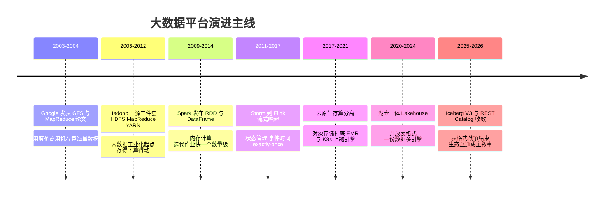
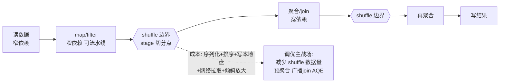
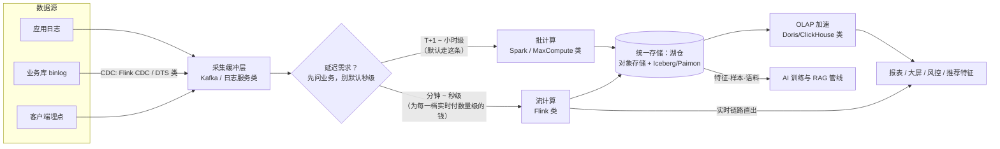
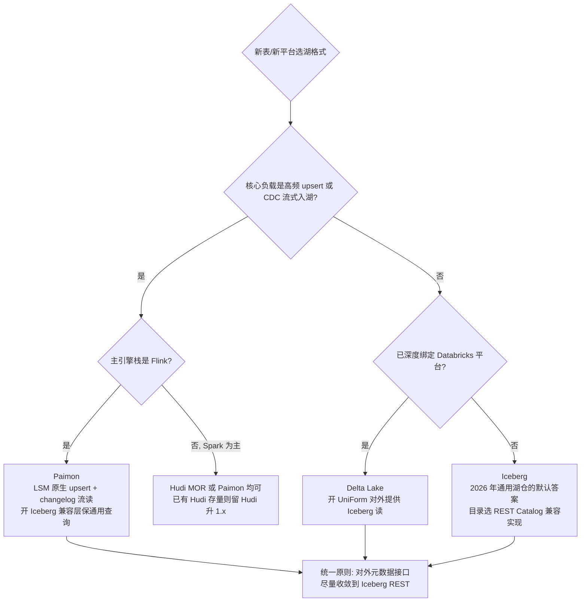

# 大数据体系

> 这篇写给两类人：正在从 0 到 1 搭数据平台的架构师，以及被"要不要上实时""湖仓一体是不是必选项""自建集群还建不建"这类问题缠住的技术负责人。全文沿一条主线展开：**大数据平台二十年的演进史，就是一部"让一份数据服务更多种计算"的历史**——Hadoop 三件套解决"存得下、算得动"，Spark 解决"算得快"，Flink 解决"算得实时且不错"，云原生解决"不用养集群"，湖仓一体（Lakehouse）解决"一份数据一套口径"。读完你应该能：用"采集 → 存储 → 计算 → 服务"四层框架给任何一个大数据需求定位组件；说清每代平台解决了什么、又留下什么遗产；理解 HDFS 元数据模型、Spark shuffle、Flink checkpoint 这几个决定工程成败的核心机制；在 Iceberg/Delta/Hudi/Paimon 之间做出有依据的选择；并绕开小文件、数据倾斜、Checkpoint 膨胀、口径不一致这些我最常见的事故现场。

## 是什么：一套"把数据从产生的地方搬到使用的地方"的工程体系

大数据体系不是一个系统，而是**一组按延迟和成本分工的引擎与存储**。不管名字多花哨，拆开看都是四层：

- **采集**：把数据从业务侧拿出来。日志走日志采集（SLS/Flume 类），业务库变更走 CDC（DTS/Canal 类），用户行为走埋点。
- **缓冲与传输**：几乎所有稍大的架构都有一层消息队列（Kafka 类），把"产生数据的速度"和"处理数据的速度"解耦。
- **存储**：对象存储打底（OSS/S3 类），上面盖一层湖格式（Iceberg/Hudi/Paimon 类）或仓库内表，管住事务、Schema 和元数据。
- **计算**：离线批（MaxCompute/Spark 类）+ 实时流（Flink 类），按延迟需求分道。
- **服务**：OLAP 引擎（Doris/ClickHouse 类）、检索引擎（Elasticsearch）、以及大模型时代新增的消费者——特征/样本/语料管线，直接喂给训练（见站内[AI 训练基座](/ai/infra/training)）。

一个关键心智模型：**这套体系本质是在"延迟—成本—准确性"三角上做交换**。秒级和 T+1 的成本通常差一个数量级（详见"实践与选型"一节），所以第一个该问的问题永远是"业务到底需要多实时"，而不是"用什么引擎"。

## 为什么重要

**它是被业务逼出来的底座。** 推荐和广告把大数据平台从"IT 部门的项目"推成了"核心业务的心脏"——行为埋点进湖、出特征和样本、进模型训练，这条管线跑不动，推荐系统就是空转（这段历史在站内[短视频时代编年史](/chronicle/short-video)里展开过）。风控、大屏、实时经营分析是同样性质的需求。

**它是 AI 时代的地基。** 大模型训练对数据的依赖，让我这个做了十几年大数据的人第一次看到"老管线的新客户"：预训练语料的清洗去重、对齐数据的配比、向量与全文检索的混合召回，用的仍是采集、批计算、湖存储这套家当——只是消费者从 BI 报表换成了训练任务和 RAG（向量检索的选型见站内 [RAG 架构设计](/ai/application/rag-architecture)）。Apache Paimon 这类新一代湖格式甚至直接把"多模态 AI 工作负载"（向量、blob 存储、Python SDK）写进了产品定位。

**它是最容易失控的成本中心。** 计算可以按需买、网络可以重拉，数据只增不减。我见过太多"建的时候没规划、用的时候没人治理"的平台，存储三年翻十倍、一半数据没人读。成本治理不是锦上添花，是数据平台的核心工程能力。

## 演进主线：每一代平台解决什么、留下什么遗产

先给全景，后面各节再逐个拆机制。大数据平台的代际更替不是"新技术淘汰旧技术"，而是**每一代解决上一代最痛的问题，同时把自己的痛点留给下一代**：



| 代际 | 解决的核心问题 | 留下的遗产（今天的默认假设） | 留下的痛点（下一代的机会） |
| --- | --- | --- | --- |
| Hadoop 三件套（2006–） | PB 级数据在廉价机器上"存得下、算得动"，故障自愈 | 数据本地性思想、Schema-on-Read、"移动计算比移动数据便宜" | MapReduce 每步落盘太慢、NameNode 单点内存墙、小文件灾难 |
| Spark（2009–2014 崛起） | 迭代计算与交互式查询慢 MR 一个数量级的问题 | 内存计算、DAG 执行模型、批流一套 API（Structured Streaming）、Catalyst 优化器 | 本质仍是批优先，微批延迟下限秒级；shuffle 依然写磁盘；常驻集群依然要养 |
| 流式时代：Storm → Flink（2011–2017） | 秒级/毫秒级持续计算，且状态不能算错 | 事件时间与水位线、状态后端、checkpoint 容错、端到端 exactly-once 方法论 | 流式运维复杂度高、状态膨胀、口径与批链路难统一 |
| 云原生大数据（2017–2021） | "养集群"这件事本身的成本与弹性问题 | 存算分离（数据在对象存储、计算按需起）、Serverless 形态、K8s 成为资源底座 | 对象存储语义与 HDFS 有差异（rename、一致性），生态适配花了多年 |
| 湖仓一体（2020–2024） | 湖没有事务、仓不够开放，"一份数据两套口径"的撕裂 | 开放表格式（Iceberg/Delta/Hudi/Paimon）、medallion 分层、多引擎读写同一张表 | 表格式混战、catalog 碎片化、小文件与元数据维护作业成为新运维负担 |
| 格式收敛期（2025–2026） | 互操作：不再问"选哪个格式"，而是"怎么都能读" | Iceberg REST Catalog 成事实标准接口、V3 规范、Delta UniForm 与 Paimon Iceberg 兼容层 | 治理与成本精细化才刚开始，AI 工作负载对湖的新需求还在定义中 |

这张表我在给客户讲平台规划时反复用：**判断一个技术要不要引入，先看它处在主线的哪一段、解决的是不是你现在最痛的问题**——2026 年还在纠结"要不要从 Hive 迁 Iceberg"的团队，问题不是选型，是欠了上一代的债。

## 架构与原理

### 采集与缓冲：日志队列为什么几乎总是第一站


*图源：Wikimedia Commons（[Apache Kafka logo](https://commons.wikimedia.org/wiki/File:Apache_Kafka_logo.svg)）*

Apache Kafka 官方把自己定义为**事件流平台**：发布订阅、持久存储、流处理三件事一体。它的核心抽象非常朴素——topic 被切成若干 **partition**，事件按 key 追加（append）到某个 partition 上，**同一个 partition 内严格有序，且天然就是并行度的粒度**；生产环境通常 3 副本，跨 broker 甚至跨机房复制。

一线经验：**分区键选错了，后面全架构都在还债**。我遇到过用"订单号"做分区键的埋点流，大客户下单集中在少数几个 ID 上，下游聚合直接热点倾斜；也见过分区数开太少，消费端加机器也没用（一个分区同一时刻只能被一个消费者线程处理）。规则很简单：**分区数决定吞吐上限，分区键决定负载分布**，这两个都要在容量规划时定，事后扩分区只改变未来数据、不改变历史分布。

### 存储第一代：HDFS 与 GFS 的机制账


*图源：Wikimedia Commons（[Hadoop logo](https://commons.wikimedia.org/wiki/File:Hadoop_logo.svg)）*

HDFS 是这一波大数据工业化的起点，血缘上是 Google GFS 论文（2003）的开源实现——GFS 与 MapReduce 两篇论文定义了此后二十年大数据的基本盘：**用一堆会坏的廉价机器，靠软件层容错，提供高吞吐的批处理存储与计算**。它的官方设计目标今天读仍然精确：为**廉价硬件**设计、故障检测与自动恢复是架构目标、面向**高吞吐而非低延迟**（明确放弃 POSIX 的实时性要求）、适合大文件与"一次写入多次读取"的批处理，以及那句著名的"**移动计算比移动数据便宜**"。


*HDFS 官方架构图：客户端只向 NameNode 要"块在哪"，数据流不过 NameNode——元数据平面与数据平面分离，这是它高吞吐的关键，也是它单点瓶颈的根源。图源：Apache Hadoop 官方文档（[HDFS Architecture](https://hadoop.apache.org/docs/stable/hadoop-project-dist/hadoop-hdfs/HdfsDesign.html)）*

拆开看三个机制，每一个都直接决定运维姿势：

**1. NameNode 元数据：全内存，文件数是硬墙。** NameNode 把**全部文件元数据放在内存**——目录树（inode）加每个块的映射，数据本体只在 DataNode 上。按社区长期经验值，每个文件/目录加块信息约占 150–300 字节内存（取决于块数量），也就是说 **1 亿个文件要吃掉几十 GB NameNode 堆内存**——文件数（不是总容量）受内存上限约束，这是元数据模型的物理事实。持久化靠 fsimage（全量镜像）+ edit log（增量日志），Secondary NameNode（或 HA 架构里的 Standby NameNode）定期合并两者，控制重启时的日志回放时间。HA 方案（QJM + ZKFC）解决的是"单点可用性"，**不解决"单点容量"**——两台 NameNode 还是同一份内存墙。

**2. 块与副本：128MB、三副本、机架感知。** HDFS 把文件切成固定大小的块（默认 128MB），每块默认 3 副本。副本放置是机架感知的：第一副本写在写入方所在节点（或同机架），第二副本写到另一个机架，第三副本写在第二副本同机架的不同节点——兼顾写入带宽（跨机架只写一次）与容灾（挂一个机架不丢数据）。块大小的设计逻辑值得记住：**让寻址时间远小于传输时间**（官方文档的说法是寻址约占传输的 1%），所以块要大；但大到超过 MapReduce 一个 task 的处理粒度就失去并行度，128MB 是这个权衡的产物。

**3. 小文件问题为什么致命。** 三重打击：**元数据侧**，一个 1KB 文件和一个 128MB 文件在 NameNode 里占的内存几乎一样，亿级小文件直接顶穿内存墙；**计算侧**，批处理的 split 通常按文件切，十万个小文件就是十万个 task，调度开销远大于计算本身；**读取侧**，每次打开文件都是 NameNode 一次 RPC，规划（planning）阶段就慢得离谱。到了对象存储时代，小文件问题换了个形态继续存在——LIST 请求变慢、按请求次数计费、湖表查询规划退化。**对策是一整套组合拳**：写入端攒批（控制落盘频率）、存储端合并（Hadoop 时代是 HAR/SequenceFile，湖仓时代是表格式自带的 Compaction 维护作业）、计算端合并读取（CombineInputFormat 类机制把多个小文件喂给一个 task）。我巡检一个平台健康度，第一个看的指标就是"平均文件大小"。

NameNode 内存墙的官方解法是 **HDFS Federation**（Hadoop 2.x 起）：多个 NameNode 各管一段命名空间（按目录/业务划分），共享底层 DataNode 存储池——本质是元数据的水平拆分。但一线实情是：Federation 运维复杂度不低，多数团队还没走到这一步，就先被"存算分离 + 对象存储"接管了持久化层。这也是理解下一节的钥匙：**HDFS 的设计是为"数据本地性"优化的，而云上对象存储宣判了数据本地性的死刑，计算与存储从此彻底分家**。

### 存储第二代：从 HDFS 到"对象存储 + 湖格式"

后来的演化路线也清晰：**对象存储（OSS/S3 类）接管持久化层，湖格式接管"表"的语义**。

- **数据湖**（数据湖概念由 Pentaho 的 James Dixon 于 2011 年前后提出）：一切以原始格式（Parquet/JSON/日志/图片）躺在便宜的对象存储上。问题是早期湖没有事务、没有 Schema 约束、改错一批文件只能人肉回滚——"数据湖"很快有了绰号"数据沼泽"。
- **开放表格式**补上了这一课。Apache Iceberg 官方定义它是"面向海量分析数据集的开放表格式"，核心能力我逐条都有体感：**Schema 演进不留暗坑**（改列不会误删旧数据）、**隐藏分区**（查询者不需要知道分区列长什么样，避免了"忘写分区条件扫全表"这类静默错误）、**时间旅行与回滚**（读一个快照，事故后可回滚到坏数据写入前）、**行级更新删除**（规范 v2 起，更新不再需要重写整个分区；v3 规范已定稿，deletion vectors 等让更新删除的写入效率再上一个台阶）。多个引擎（Spark/Trino/Flink/Hive 类）读写同一张表，这是"湖仓"成立的底层前提。
- **为流而生的湖格式**：Apache Paimon 用 LSM 结构做湖上的**流式更新与 Changelog 生成**，把 CDC 数据（MySQL/Kafka 等）直接写进湖表、下游 Flink 流读——这是"批流一体"从口号变成可落地的关键一块。

表格式的机制细节与四强对比（Iceberg/Delta/Hudi/Paimon 怎么选）单独放在后文"湖格式"一节，那是 2024–2026 年大数据选型里最重要的一张决策表。

存储底座本身的设计权衡——桶规划、生命周期分层、请求计费——见站内[对象存储](/cloud/infra/storage)，这里只强调大数据视角的三条：**持久化交给对象存储、表语义交给开放表格式、本地盘只做缓存和 shuffle 暂存**。

### 三件套的另一件：YARN 把"资源调度"从"计算框架"里拆出来

讲 Hadoop 三件套只讲 HDFS 和 MapReduce 是不完整的——**YARN（Yet Another Resource Negotiator，Hadoop 2.x 引入）才是让 Hadoop 集群从"MapReduce 专用机"变成"通用数据平台"的那一步**。1.x 时代资源调度（JobTracker）和计算框架焊死在一起，集群只能跑 MR；YARN 把两者拆开：ResourceManager 管全局资源（把每台 NodeManager 的内存/CPU 抽象成 Container 按需分配），计算框架自己带一个 ApplicationMaster 来申请资源、管理任务——Spark、Flink、Tez 从此都能跑在同一个 Hadoop 资源池上。

YARN 留下的遗产是思想性的：**"资源管理"与"计算框架"分层解耦，一个资源池服务多种负载**。这正是十年后 K8s 接管大数据资源底座的前传——角色几乎一一对应（ResourceManager ≈ K8s 控制面调度器、Container ≈ Pod、ApplicationMaster ≈ Operator/Driver）。区别在于 K8s 的抽象更通用（不限于大数据负载）、生态更开放（镜像化交付）。理解这条传承线，就能理解为什么"Spark on YARN → Spark on K8s"的迁移在架构上没有新东西，只是把同一分层原则换了一个更强的实现。

### 计算第一代半：Spark 怎样把 MapReduce 甩开一个数量级


*图源：Wikimedia Commons（[Apache Spark logo](https://commons.wikimedia.org/wiki/File:Apache_Spark_logo.svg)）*

**Spark** 官方定位是"大规模数据分析的统一引擎"——多语言、ETL/SQL/机器学习共用一套执行体系。它 2009 年诞生于 Berkeley AMPLab，2012 年 RDD 论文（NSDI'12）给出的卖点在今天看来依然朴素有力：**把迭代计算的中间结果留在内存里，比 MapReduce 的"每步落 HDFS"快 10–100 倍**。


*Spark 官方集群总览图：一个 Cluster Manager、一个 Driver、N 个 Executor——这个运行时结构从 1.x 一直用到 4.x，变的只是 Cluster Manager 从 YARN/Mesos 换成了 Kubernetes。图源：Apache Spark 官方文档（[Cluster Mode Overview](https://spark.apache.org/docs/latest/cluster-overview.html)）*

#### 快的机制：不是"内存"两个字，是三件事的叠加

多数文章把 Spark 快归结为"内存计算"，这只说对了一半。拆开看是三个机制的叠加：

1. **DAG 执行模型消灭中间落盘。** MapReduce 一个作业只有 map→shuffle→reduce 三步，复杂逻辑必须串多个 MR 作业，**每个作业的中间结果都要完整写 HDFS（还带三副本）**，下一步再从 HDFS 读回。Spark 把整个作业编译成 DAG（有向无环图），能流水线（pipeline）执行的算子串在一个 stage 内一次做完，stage 之间才落盘——多步迭代的磁盘 IO 和副本写放大直接消失。
2. **任务粒度从进程级降到线程级。** MR 的每个 task 是独立 JVM，启动、初始化、销毁都是开销；Spark 的 task 是 Executor JVM 里的线程，一个 Executor 常驻、复用内存与广播变量，迭代作业（机器学习、图计算）收益巨大。
3. **容错用血缘（lineage）替代副本。** RDD 不复制数据，只记录"我是怎么算出来的"（转换链），节点挂了按血缘重算丢失分区即可——用重算换掉了三副本的写放大，这是"中间结果可以只放内存"的底气。

拿一个三阶段的 ETL（读取 → join → 两级聚合）对比两种执行模型，差距一目了然：

| 环节 | MapReduce 的做法 | Spark 的做法 |
| --- | --- | --- |
| 作业切分 | 3 个独立 MR 作业串联提交 | 1 个 DAG，按 shuffle 边界切成 3–4 个 stage |
| 阶段间中间结果 | 每步完整写 HDFS（×3 副本），下步再读回 | 只写 Executor 本地盘单副本，窄依赖阶段直接内存流水线 |
| 任务进程 | 每 task 新起 JVM | task 是常驻 Executor 内的线程 |
| 失败恢复 | 重跑对应 task（数据在 HDFS 上安全） | 按血缘重算丢失分区 |
| 端到端耗时构成 | 计算时间 + 大量落盘/读回/副本复制/进程启停 | 计算时间为主 |

"快 10–100 倍"的公开口径（RDD 论文对迭代负载的测量）主要来自后三行的省却——**多阶段与迭代作业的阶段数越多、数据越能驻留内存，差距越大**；单阶段的纯扫描型作业，两者差距会小得多，这是引用该数字时要带的边界。

#### 宽窄依赖与 shuffle：性能万恶之源的解剖

DAG 怎么切 stage？答案藏在依赖关系里：

- **窄依赖（narrow dependency）**：父 RDD 每个分区最多被子 RDD 一个分区使用——map、filter、union 都是。窄依赖可以在同一节点上流水线执行，不产生网络传输。
- **宽依赖（wide dependency）**：父 RDD 一个分区要发给子 RDD 的多个分区——groupBy、join（非广播）、repartition 都是。**宽依赖 = shuffle = stage 边界**。

shuffle 为什么是万恶之源？把一次 shuffle write → read 的成本摊开看：map 端把输出**序列化、按下游分区排序、写本地磁盘**；reduce 端通过网络**拉取、反序列化、可能再排序合并**。这意味着：磁盘 IO 至少两遍（写一遍读一遍，内存放不下还要 spill 再加倍）、全量数据过一遍网络、序列化/反序列化的 CPU 开销，以及最要命的——**数据倾斜在 shuffle 处被放大**：99% 的 reducer 秒完、1% 的 reducer 拖两小时，因为热点 key 全砸在一个分区上。



所以 Spark 调优的第一原则不是加机器，而是**减少 shuffle**：小表 join 用 broadcast（把小表广播到每个 Executor，宽依赖直接消失成窄依赖）；聚合前先过滤、先做 map 端局部预聚合；分区数与数据量匹配（分区太少单 task 撑爆内存，太多则调度与输出小文件遭殃）。**Spark 3.x 之后我最感激的功能是 Adaptive Query Execution（AQE）**——运行时按真实数据量合并小分区、**拆分倾斜的 shuffle 分区**、必要时把 sort-merge join 换成 broadcast join。过去靠人肉调 `parallelism` 和 `salting`（加盐打散热点 key）的活，现在引擎能干一大半。

#### SQL 这一层：Catalyst 与 Tungsten 简述

Spark 从"RDD 库"进化成"数据分析统一引擎"，靠的是 SQL/DataFrame 层的两个引擎：**Catalyst**（基于规则 RBO + 基于成本 CBO 的查询优化器，谓词下推、列裁剪、join 重排都在这里发生）和 **Tungsten**（绕过 JVM 对象模型的内存管理与代码生成，把 DataFrame 操作编译成字节级高效执行）。一线含义很简单：**能用 DataFrame/SQL 就不要写裸 RDD**——优化器只对前者生效，同样的逻辑 SQL 写法比 RDD 写法快是常态而非例外。

#### 微批流处理与 Spark on K8s 现状

**Spark** 的流处理心智是**微批（micro-batch）**：流数据被切成一批一批的小 RDD/DataFrame 依次处理。这带来巨大的工程红利（批流同一套代码、容错沿用血缘），但延迟下限就是"一批的间隔"（通常数百毫秒到秒级）；Structured Streaming 的状态存储自 3.2 起支持 RocksDB 后端，大状态流作业的稳定性明显改善。截至 2026-09，Spark 最新主线是 4.2.x（4.0 于 2025 年中发布，3.5.x 仍有维护版本），4.x 的几个变化值得注意：**ANSI SQL 模式默认开启**（隐式类型转换和溢出行为收紧，从旧版本迁移时 SQL 报错率会上升，要提前跑兼容校验）、新增 **Variant 半结构化类型**（湖仓场景下 JSON 的原生高效表示，与 Iceberg V3 的 Variant 呼应）、**Spark Connect** 走向成熟（客户端与服务端解耦，多语言瘦客户端连远程集群，笔记本场景不再"起一个本地 JVM 假装分布式"）。

资源底座方面，**Kubernetes 已是 Spark 的默认答案**：Spark 2.3 起支持 K8s 提交、3.1 起 K8s 成为与 YARN 平级的一等资源管理器，到 4.x 时代新建集群直接默认 K8s——Mesos 支持已移除，YARN 进入存量维护。工程收益是实的：动态资源分配（executor 按负载起停）、与在离线业务混部同一资源池、镜像化交付消灭"集群环境不一致"。代价也要认：K8s 上的 shuffle 依赖本地盘或远端 shuffle 服务，Pod 被驱逐时本地 shuffle 数据跟着丢，要靠血缘重算或外置 shuffle 兜底；网络与存储层（对象存储 SDK、committer）的适配细节比 YARN 时代多。Spark on K8s 的弹性机制展开见站内[Kubernetes 核心机制](/cloud/native/kubernetes)。

### 计算第二代：Flink 与流式时代的三场硬仗


*Flink 官方的无界流/有界流示意图：无界流必须持续处理、依赖事件顺序；有界流可先全量再算（即批处理）——一个引擎两种数据观。图源：Apache Flink 官方文档（[What is Apache Flink? — Architecture](https://flink.apache.org/what-is-flink/flink-architecture/)）*

**Flink** 官方定义是"**对无界和有界数据流进行有状态计算的框架与分布式引擎**"——流是第一公民，批只是"有界流"的特例。流式这条路并不是一开始就属于 Flink：Storm（2011，Twitter 开源）证明了"逐条处理的实时计算"可行，但它没有状态管理原语、exactly-once 要靠业务自己拧；Flink 从 2015 年前后靠**状态 + 时间 + 一致性**三件硬功夫完成反超，2019 年收购 Data Artisans（Flink 母公司）后阿里系的实时数仓实践又把它推成了国内事实标准。它统治实时计算的原因，我认为就三条硬功夫，值得逐条拆到机制层。

#### 运行时架构：JobManager、TaskManager 与 Slot


*Flink 官方运行时架构图：JobManager 内含 Dispatcher（接收提交）、ResourceManager（分配 slot）、JobMaster（管理单个作业的执行图）；TaskManager 提供 slot 执行子任务并缓存交换数据。图源：Apache Flink 官方文档（[Flink Architecture](https://nightlies.apache.org/flink/flink-docs-stable/docs/concepts/flink-architecture/)）*

心智模型三句话：**作业（JobGraph）经调度变成执行图（ExecutionGraph），执行图按并行度切成 subtask，subtask 装进 TaskManager 的 slot 里跑**。Slot 是资源隔离的粒度（内存隔离、CPU 共享），slot 共享机制让同一作业的多个算子链能挤进同一个 slot——所以一个作业需要的 slot 数约等于最大算子并行度，这是容量规划的基本公式。JobManager 是单点协调者，生产上必须 HA（多 JobManager 选主 + 元数据存 ZooKeeper/K8s ConfigMap）。

#### 硬功夫一：状态管理与状态后端

流计算和批计算的本质区别：**流的结果依赖历史**。窗口聚合、Join 缓存、去重集合、风控累计值——这些都是"状态"，Flink 把它作为一等公民提供 keyed state（按 key 分区）与 operator state 两套原语。官方生产案例是"日处理数万亿事件、维护数 TB 状态"的规模。状态放哪，由**状态后端（state backend）**决定：

| 状态后端 | 状态存放位置 | 容量上限 | 读写性能 | 增量 checkpoint | 适用 |
| --- | --- | --- | --- | --- | --- |
| HashMapStateBackend | JVM 堆内存 | 受堆大小限制（通常几十 GB） | 最快（对象直接访问） | 不支持（全量快照） | 小状态、低延迟敏感作业 |
| EmbeddedRocksDBStateBackend | TaskManager 本地磁盘（RocksDB LSM 树，堆外） | TB 级（受本地盘限制） | 慢于堆内存（序列化 + LSM 读放大） | 支持（只传新 SST 文件） | 大状态生产作业默认选择 |

一线规则：**状态超过几个 GB 就直接上 RocksDB + 增量 checkpoint**，别等堆内存 OOM 再迁。RocksDB 的代价是每次状态读写都要序列化/反序列化（堆外存储），点查密集型作业会感觉变慢——用状态局部性优化（如把频繁共同访问的状态放同一个 key 前缀）缓解。**Flink 2.0（2025 年 3 月发布）的最大架构动作是"存算分离"（disaggregated state，ForSt 后端）**：状态从 TaskManager 本地盘挪到远端分布式存储，本地盘降级为缓存——扩缩容不再搬状态、作业恢复从远端直接拉起，这是 Flink 跟上云原生时代的补课，截至 2026-09 最新版 2.3 仍在打磨这条路线的成熟度，生产采用建议跟进社区 release note 再定。

#### 硬功夫二：Checkpoint——分布式快照的工程化

**一致性快照（Checkpoint）**源自 Chandy-Lamport 分布式快照算法的变体。问题是：一个作业几十个并行 subtask、数据在网络上飞，怎么给整个系统拍一张"逻辑一致"的照片？Flink 的答案是 **barrier（栅栏）对齐**：


*barrier 注入示意图：JobManager 按间隔触发 checkpoint，source 把 barrier-N 插入数据流，它随普通记录一起向下游流动、不插队。图源：Apache Flink 官方文档（[Stateful Stream Processing](https://nightlies.apache.org/flink/flink-docs-stable/docs/concepts/stateful-stream-processing/)）*


*barrier 对齐示意图：多输入算子收到某个输入的 barrier 后，**阻塞并缓存**该输入的后续记录，直到所有输入的 barrier 齐了——这一刻做状态快照，然后把 barrier 发给下游、释放缓存。barrier 之前的记录属于本次快照，之后的属于下一次，逻辑时间被干净切开。图源：Apache Flink 官方文档（[Stateful Stream Processing](https://nightlies.apache.org/flink/flink-docs-stable/docs/concepts/stateful-stream-processing/)）*

完整流程串起来：**JobManager 里的 checkpoint coordinator 按间隔触发 → source 注入 barrier 并把自身位点（如 Kafka offset）存入快照 → barrier 随流传播，每个算子在对齐点异步做本地快照（RocksDB 后端只传增量 SST 文件）→ 快照写入持久化存储（HDFS/对象存储）→ 所有算子确认后本次 checkpoint 完成**。故障恢复时，所有算子状态回滚到最近一次成功的快照，source 回退到快照里的位点重放——**恢复代价 = checkpoint 间隔内被重放的数据量**。

由此推出几条一线必背的工程结论：

- **checkpoint 间隔就是故障恢复代价和运行时开销之间的交换**：间隔短，恢复快、回放少，但对齐与快照开销大；生产常见 1–5 分钟起步，核心作业压到 30 秒–1 分钟。
- **反压会杀死对齐式 checkpoint**：慢的输入让 barrier 迟迟等不齐，checkpoint 超时失败连环发生。Flink 1.11 起的**非对齐 checkpoint（unaligned checkpoint）**允许 barrier 越过缓存记录直接推进，把在途数据一并存进快照——用快照体积换对齐等待，反压场景的救命开关。
- **checkpoint 和 savepoint 分工别混**：checkpoint 是 Flink 自动触发、用于容错、可能被自动清理的；savepoint 是用户手动触发、格式更通用、用于升级/迁移/暂停作业的"手动存档"。停机升级走 savepoint，指望 checkpoint 顶替是常见事故源。
- 快照存对象存储时确认并发带宽与请求配额——TB 级状态的快照上传被打满限流，恢复时长直接失控。

生产作业的 checkpoint 配置骨架（Flink 2.x DataStream API，参数含义即上面几条结论的落地）：

```java
env.setStateBackend(new EmbeddedRocksDBStateBackend(true));  // RocksDB + 增量 checkpoint
env.getCheckpointConfig().setCheckpointStorage("oss://bucket/ckpt/"); // 快照进对象存储

env.enableCheckpointing(60_000);                     // 间隔 60s：恢复代价与开销的交换点
env.getCheckpointConfig().setCheckpointingMode(CheckpointingMode.EXACTLY_ONCE);
env.getCheckpointConfig().setMinPauseBetweenCheckpoints(30_000);  // 两次快照最小间隔，防连环触发
env.getCheckpointConfig().setCheckpointTimeout(600_000);          // 超时 10min，大状态留余量
env.getCheckpointConfig().setTolerableCheckpointFailureCount(3);  // 连续失败 3 次才失败作业
env.getCheckpointConfig().enableUnalignedCheckpoints();           // 反压场景的救命开关
```

水位线生成同理，乱序度就是那个"口径旋钮"：

```java
WatermarkStrategy
    .<Event>forBoundedOutOfOrderness(Duration.ofSeconds(30)) // 允许 30s 乱序
    .withTimestampAssigner((e, t) -> e.getEventTime())       // 用事件时间字段，别用采集时间
    .withIdleness(Duration.ofMinutes(1));                    // 空闲分区 1min 后不参与水位线取 min
```

#### 硬功夫三：事件时间、水位线与端到端 exactly-once

**时间语义**是流计算口径的地基。处理时间（事件到达算子的时刻）简单但不准——重跑历史、网络抖动都会让结果漂移；生产口径几乎都该用**事件时间（event time，事件真正发生的时刻）**。事件时间的麻烦是**乱序**：网络里事件不按发生顺序到达，窗口什么时候该关？答案是**水位线（watermark）**：一条随流传播的特殊时间戳标记，含义是"事件时间早于 T 的数据（基本）都到了"。机制细节三条：水位线由 source 周期性生成（默认 200ms 一次），取"当前最大事件时间 − 允许的乱序度"；多并行度下，算子的水位线取**所有输入通道的最小值**（最慢的通道决定全局进度）；窗口在水位线越过窗口结束时间时触发计算，之后再来的迟到数据按 `allowedLateness`（窗口延迟销毁再触发一次）或侧输出流（side output，单独收集人工补）处理，都不配就直接丢弃。

**水位线是"口径正确性"和"结果及时性"的旋钮**：乱序度设大，等得久、结果全但延迟高；设小，出数快但迟到数据被甩。一线事故高发区恰好在多通道取 min 这条规则上——一个空闲的 Kafka 分区会让整条流的水位线永远不前进，窗口全部卡死，要用 idleness 机制把空闲通道排除出水位线计算。

**精确一次语义**：状态侧靠 Checkpoint 保证 exactly-once；配合两阶段提交的事务 Sink（典型如 Kafka 事务），端到端也能做到"不重不漏"。但要看清边界——**官方口径的 exactly-once 指的是状态一致性**；你的输出端（数据库、报表）是否幂等，是你自己的事。端到端链路的隐形约束也要知道：两阶段提交的 sink 在 checkpoint 完成前数据对下游不可见，所以**端到端延迟 ≥ checkpoint 间隔**，"秒级可见 + exactly-once"要重新设计间隔与提交策略。

批 vs 流一表看懂：

| 维度 | 批（Spark/MaxCompute 类） | 流（Flink 类） |
| --- | --- | --- |
| 延迟 | 分钟 ~ T+1 | 毫秒 ~ 秒 |
| 数据观 | 有界、完整后再算 | 无界、来了就算、靠 Watermark 判断"迟到" |
| 正确性 | 天然可重跑、易验证 | 依赖事件时间/乱序处理，口径复杂 |
| 成本 | 资源弹性、作业完了就还 | 常驻资源 + Checkpoint 存储 + 运维 |
| 出错恢复 | 删分区重跑 | 从快照恢复（回放 or 修状态），复杂得多 |

#### Flink CDC：从"同步工具"长成"实时湖仓入口"

Flink 生态里 2023 年后最重要的变化是 **Flink CDC** 从"数据库连接器"升格为**独立的流式 ETL 框架**：用一份 YAML 定义"MySQL 整库 → Kafka/Paimon/StarRocks"的同步管线，核心能力是**全量 + 增量一体化**（无锁全量快照、按主键分片并行读，读完自动切 binlog 增量续传，位点精确衔接）和**schema 变更自动同步**（上游加列，下游湖表自动演进，不断流）。截至 2026-03 最新版 3.6.x。它的意义在于把"实时湖仓"的入口成本打下来了：过去 CDC 入湖要自己拼 Canal + Kafka + Flink 作业三段链路，现在一个 YAML 交付，**CDC → Paimon/Iceberg 湖表 → 下游流读或批查**成了 2025–26 年国内实时数仓新建项目的主流骨架。

### 云原生大数据：弹性、存算分离与 K8s 上的引擎

云原生不是"把集群搬上云"，而是三个结构性变化：

**1. 存算分离成为默认架构。** 数据只存一份在对象存储，计算集群变成"可抛弃的"——EMR 类集群可以随时缩容、Serverless 引擎按作业起停，不再为存储买一送三地养计算节点。这里有一串对象存储与 HDFS 的语义差异必须补课：S3 自 2020 年 12 月起提供强一致的读写（OSS 一直如此），"写完读不到"的历史包袱卸掉了；但 **rename 在对象存储上不是原子的元数据操作，而是 copy + delete**——Hadoop 时代"先写临时目录再 rename 提交"的作业提交协议直接退化成慢一个数量级的危险操作，生态用**输出提交器（output committer）**重写提交协议来适配（S3A committer 家族、各云厂商自研 committer 同理）；LIST 大目录慢且贵，湖格式用 manifest 元数据文件替代目录遍历，正是对这个差异的正面回答。

**2. 弹性从"分钟级扩容"变成"按作业付费"。** 形态光谱大致三档：**托管集群**（EMR on ECS/EC2 类，集群还在、运维减半）→ **半 Serverless**（EMR Serverless Spark/StarRocks 类，按作业拉起资源池、按 CU 时计费）→ **全托管 Serverless 数仓**（MaxCompute/BigQuery 类，连"作业提交到哪个集群"都不用知道，按扫描量或 CU 计费）。选型逻辑放"实践与选型"一节。

**3. K8s 成为大数据的资源底座。** Spark 3.1 起把 K8s 当一等资源管理器、Flink 原生支持 K8s（含 Operator 化的部署与 savepoint 编排），大数据集群与在线服务共享资源池、潮汐调度成为可能。判断和站内[Kubernetes 核心机制](/cloud/native/kubernetes)一致：**平台能力开放（表格式、引擎开源），资源底座收敛（K8s、对象存储）**——两头开放中间收敛，是这一代架构最稳定的组合。

**4. 湖仓正在长出 AI 工作负载这条新支线（2025–26 进行时）。** 三个可观察的信号：表格式层，Iceberg V3 的 Variant 类型与 Paimon 的多模态定位（blob 存储、向量列、Python SDK）都在把"非结构化与半结构化数据进湖管理"变成规范级能力；管线层，预训练语料的抽取、清洗、去重（MinHash/精确去重的 Spark/Ray 作业）本质上就是大数据批管线的新客户，量级从 TB 跳到 PB；服务层，湖表开始直接对接向量检索与特征平台，"湖仓 → RAG 语料库/训练集"的链路产品化。我的判断：**这条支线不会催生新引擎，而是复用现有四件套（对象存储 + 表格式 + 批引擎 + 调度）**，架构师要做的只是把 AI 管线当成一个延迟宽松、吞吐巨大的新租户纳入既有治理与配额体系（消费侧细节见站内 [RAG 架构设计](/ai/application/rag-architecture)与[AI 训练基座](/ai/infra/training)）。

### 模式演进：数仓 → Lambda → Kappa → 湖仓

- **数据仓库**的经典定义（维基百科引用 Inmon）：面向主题、集成、反映历史变化（time-variant）、相对非易失的数据集合——先有"清洗建模后再分析"这个共识，才有一切分层方法论。
- **Lambda 架构**（Nathan Marz 2011 年提出）：批层用全量数据算"绝对正确的视图"，速度层补最近几小时的实时视图，服务层把两者合并。它用**两份代码、两套结果、一份口径**换来了"既准又快"。
- **Kappa 架构**（Jay Kreps 提出）：纯流式 + 单一代码库，需要重算时回放历史流。思想优雅，落地苛刻——要求流引擎足够强（状态、回放）、历史数据能便宜地重放。
- **湖仓一体（Lakehouse）**：2020/2021 年 Databricks 研究者论文提出，被各厂商迅速采纳。定义：**用开放表格式（Iceberg/Delta/Hudi）在廉价对象存储上，同时提供仓库的事务/质量管控与湖的开放/低成本**，多引擎读写同一份数据，内部再用 bronze/silver/gold（对应传统 ODS/DWD/DWS 思想）逐层加工。


*Databricks 官方对 medallion 分层的定义图：bronze 存原始增量（可追溯、可重放），silver 做清洗去重与轻度建模（企业级事实表的家），gold 出业务级聚合（直接喂 BI 与机器学习）——分层名字是新的，"逐层收敛口径"的思想和传统 ODS/DWD/DWS 一脉相承。图源：Databricks 官方（[Medallion Architecture](https://www.databricks.com/glossary/medallion-architecture)）*

整个演进的主语只有一个：**尽量让"一份数据"服务"多种计算"**，消灭 Lambda 时代"湖一套、仓一套、口径两套"的撕裂。

把前面所有组件接起来，是我给多数新客户画的第一张图——注意里面的决策点：



### 湖格式四强：机制拆开看，格局才看得清

开放表格式是湖仓时代最关键的一层软件。四强（Iceberg、Delta Lake、Hudi、Paimon）解决的问题相同——**给对象存储上的一堆 Parquet 文件补上"表"的语义：事务、Schema、快照、行级更新**——但机制路线差异很大，直接决定了各自的擅长场景。

#### Iceberg：元数据树 + 快照，catalog 说了算

Iceberg 的核心是一棵**元数据树**，全部元数据本身就是对象存储上的不可变文件：


*Iceberg 官方规范里的表结构图：catalog → metadata file → manifest list（一个快照一份）→ manifest file → data files。查询规划只读元数据层，靠 manifest 里预存的文件级统计信息（每列 min/max、空值数）做文件裁剪，不 LIST 目录——这就是它规划快、且天然免疫对象存储 LIST 性能问题的原因。图源：Apache Iceberg 官方规范（[Iceberg Table Spec](https://iceberg.apache.org/spec/)）*

机制要点四条：**每次提交生成新 metadata file，catalog 用一次原子指针交换完成提交**（乐观并发：两个写者冲突时后提交者基于最新快照重试）；**快照即 manifest list**，时间旅行就是"读旧快照的 manifest list"；**隐藏分区**把分区变换（如按天截断时间列）记录在元数据里，查询谓词自动推导分区裁剪，用户不需要知道分区布局；**行级删除**在 V2 用独立的 delete file（position/equality delete），V3 改为 **deletion vector**（每个数据文件配一个二进制位图标记被删行，紧凑得多）。

**2025–26 年 Iceberg 生态的三件大事**（截至 2026-09）：其一，**V3 规范落地**——1.10 版（2025-09）首次支持 V3，当前最新 1.11.x；V3 带来 deletion vectors、**row lineage**（行级血缘 `_row_id`，增量处理与审计的地基）、**Variant 类型**（半结构化原生表示）、纳秒时间戳与地理类型；AWS（2025-11 宣布 deletion vectors 与 row lineage 支持）、Snowflake（2026 年年中 V3 GA）、Google、Databricks（从对手变成 V3 贡献者）全部跟进。其二，**REST Catalog 规范成为事实标准接口**——一个 OpenAPI 定义的 HTTP 目录协议，引擎只需实现一次 REST 客户端就能接入任何兼容目录，Snowflake 的 Polaris、Databricks 开源的 Unity Catalog、Apache Gravitino、Lakekeeper 等新旧玩家全部收敛到这个接口上，"catalog 战争"打成了"同一接口下的实现竞争"。其三，**对手开始兼容它**——Delta 的 UniForm、Paimon 的 Iceberg 兼容层（见下），Iceberg 元数据正在变成湖仓世界的"通用读格式"。

#### Delta Lake：事务日志，Spark 血统最深

Delta 的机制核心是 **`_delta_log` 事务日志**：每次提交追加一个有序的 JSON 日志文件（记录本次 add/remove 了哪些数据文件），每 10 次提交生成一个 Parquet checkpoint 加速读取——**表的真相 = 日志重放的结果**，事务性来自日志文件写入的原子性（对象存储上依赖"put-if-absent"语义，早期 S3 需要外挂 DynamoDB 锁，S3 强一致后可去掉）。Delta 与 Spark/Databricks 的集成最深：Deletion Vectors、Liquid Clustering（自动化的数据聚簇布局）等特性都走在前面；2.3 之后 **UniForm（Universal Format）** 成为它应对 Iceberg 攻势的答案——写 Delta 表时异步生成一份 Iceberg 兼容元数据（不重写 Parquet 数据文件），让 Iceberg 引擎直接读 Delta 表，2024 年起 GA。格局判断：**在 Databricks 体系内 Delta 仍是默认与最优，体系外的新项目 2025 年之后我默认推 Iceberg**——UniForm 恰恰说明 Databricks 自己也接受了"Iceberg 元数据是公共接口"这个现实。

#### Hudi：timeline + 双表类型，为高频 upsert 而生

Hudi（Hadoop Upserts Deletes and Incrementals，Uber 出品）的元数据核心是 **timeline（时间线）**：所有操作（commit、compaction、clean）作为带时间戳的 instant 记录在 `.hoodie` 目录，增量查询直接基于 timeline 拉"上次之后变更的文件"，**增量处理是它的第一基因**。两种表类型是它最重要的机制分野：**Copy-on-Write**（更新时重写整个数据文件，读快写重，适合读多写少）与 **Merge-on-Read**（更新先写增量日志文件，读时合并，写快读重，适合高频 upsert），同一张表按负载选型的本质是"重写成本放在写入端还是读取端"。1.0（2024-12）的 **NBCC（非阻塞并发控制）** 是它的差异化武器：传统乐观锁在高频写冲突下会大量回滚重试，NBCC 用时间线分片让并发写不再互相阻塞，官方口径吞吐显著提升。**格局判断：Hudi 的生态位收缩到"Spark 栈 + 高频 CDC upsert + 增量拉取"场景**，通用分析与多引擎场景被 Iceberg 压制，但存量 Hudi 用户（尤其 1.0 之后升级的）没有迫切迁移压力。

#### Paimon：LSM 树上湖，流式更新的正解

Paimon（从 Flink Table Store 独立而来，阿里主导捐赠 Apache）走了一条与前三个都不同的路：**把 LSM 树（Log-Structured Merge-tree，RocksDB 同款的"内存表 + 分层归并"结构）搬上对象存储**。主键表的数据按主键组织成 LSM 的 sorted run，写入先进 L0 小文件、后台 compaction 逐层归并——**高频 upsert 不需要重写大文件，天然流式**；配合 changelog-producer 机制，下游 Flink 可以直接流读这张湖表的变更日志，湖表本身成了"可流读的消息队列"。这让它成为 **Flink CDC → 实时湖仓**链路的原生答案：MySQL binlog 经 Flink CDC 整库同步进 Paimon，下游流作业订阅 changelog 继续加工，批作业随时查同一张表的快照。2025 年起 Paimon 也提供 **Iceberg 兼容层**（生成 Iceberg 元数据，让 Trino/Spark 等 Iceberg 引擎直接读 Paimon 表），姿态和 Delta UniForm 一致：**内部机制保持流式优先，对外接口向 Iceberg 收敛**。

#### 四强决策表与选型决策树

| 维度 | Iceberg | Delta Lake | Hudi | Paimon |
| --- | --- | --- | --- | --- |
| 元数据机制 | 元数据树 + catalog 指针交换 | `_delta_log` 事务日志 | timeline + 双表类型 | LSM 树 + 快照 |
| 行级更新路线 | V2 delete file → V3 deletion vector | Deletion Vectors | COW 重写 / MOR 日志合并 | LSM 原生 upsert |
| 最强场景 | 多引擎批量分析、开放湖仓标准 | Spark/Databricks 深度栈 | 高频 CDC upsert、增量拉取 | Flink 流式更新、changelog 流读 |
| 流式友好度 | 中（写入可以流，changelog 能力弱） | 中 | 中高（MOR + 增量查询） | 高（为流设计） |
| 生态广度（截至 2026-09） | 最广：Spark/Flink/Trino/Doris/StarRocks/三大云全支持，REST Catalog 成标准接口 | 广但重心在 Databricks/Spark | 收缩中，AWS 系存量多 | Flink 生态最强，国内阿里云系推动 |
| 2025–26 关键动作 | V3 规范 + 1.10/1.11 落地、REST Catalog 收敛 | UniForm 兼容 Iceberg GA | 1.0 NBCC 非阻塞并发 | Iceberg 兼容层、多模态 AI 定位 |
| 我的默认推荐 | 通用分析与新建湖仓的默认 | 已重仓 Databricks 则继续 | 存量维护为主，新建少选 | 实时链路（CDC 入湖 + 流读）默认 |



最后一个务实提醒：**格式混用是最大的隐性坑**（详见常见坑表）。同一张表被两种格式写、或一个平台里四种格式并存各配各的 catalog，元数据维护作业翻倍、引擎兼容矩阵爆炸。我的原则：**一个平台的主格式只留一个，第二格式必须有明确的场景理由（如实时链路专用 Paimon），并通过兼容层向主格式收敛读接口**。

### 数仓分层与维度建模：方法论没有死，它只是换了底座

Kimball 维度建模 + 分层仍然是离线数仓的主流骨架，因为它解决的不是技术问题，是**组织问题**——让口径有唯一的归属层：


先把维度建模一分钟讲清：Kimball 方法论主张**按业务过程建模，产出"事实表 + 维度表"的星型结构**——事实表记录业务事件的可度量数字（订单金额、点击次数），维度表记录描述性上下文（用户、商品、时间、门店），查询时事实表与维度表 join 出任意切面的分析结果。它与 Inmon 的"先建企业级规范化大仓、再派生部门集市"路线之争持续了三十年，一线结局是实用的：**多数互联网与云上数仓实际采用 Kimball 式建模 + 分层落地**，因为它对增量开发与局部重构友好，不需要一次想清全企业模型。维度表的历史版本用 SCD（缓慢变化维）处理：Type 1 直接覆盖、Type 2 加有效区间保留全历史（对账场景刚需）、Type 3 只留上一版本——选哪种取决于业务要不要回答"当时值是多少"。

分层与 medallion 的对应关系：ODS ≈ bronze（贴源原始）、DWD ≈ silver 前半（清洗明细）、DWS ≈ silver 后半 + gold（主题汇总）、ADS ≈ gold（应用直供）。**换底座不换方法论**：过去每层是 Hive 分区目录，现在是湖表快照；过去口径靠 wiki，现在靠湖表上的 SQL 视图与血缘系统——分层要回答的"口径归属"问题一个字没变。

我的落地原则：**下三层尽量复用、最上两层允许烟囱**。口径统一发生在 DWD/DWS；ADS 允许为业务快速定制——但如果发现大量逻辑在 ADS 里互相抄，说明 DWS 建薄了，该还的债迟早还。

**流批一体到底落地到什么程度？敢下判断**：宣传里的流批一体有三层含义，落地程度完全不同——**"一份存储"流批一体已经真实落地**（Paimon/Iceberg 湖表同时被流作业订阅、被批作业扫描，这是四强里 Paimon 的核心价值）；**"一套 SQL 口径"部分落地**（同一段口径 SQL 在批与流两种模式下跑，Flink/Spark 都能演示，但时间语义、回撤流、迟到处理的差异让复杂口径很难真正一套代码两边跑，生产里多数团队仍是"口径逻辑对齐、代码两份"）；**"一个引擎包打批流"基本没落地**（Flink 批模式性能追不上 Spark 的成熟度，Spark 微批的延迟下限又够不着真流——我遇到的情况是，除少数轻量场景外，批用 Spark/托管批引擎、流用 Flink 的分工在未来几年不会变）。所以务实的架构姿势：**存储层坚定一体化，计算层接受批流分工，口径层靠治理机制（唯一 DWD 定义 + 批流对数巡检）强制对齐**。

### 调度与编排：批处理世界的中枢神经

给数据平台画组件对照表时，调度常常不在表里——但它一挂，前面画的管线一条都跑不起来。**批处理世界的中枢神经不是计算引擎，而是调度器**：它决定每个任务几点起、等谁的结果、失败重跑什么、核心报表几点前必须产出。

**调度对象是 DAG，不是单个任务。** 一个离线任务的产出是下一个任务的输入，一组任务按依赖连成 DAG（有向无环图：方向=依赖顺序，无环=不允许循环等待）。DAG 模型回答三件事：依赖（上游成功才起下游）、并行（互不依赖的分支全并发）、补数（口径改了或上游迟到，把指定历史时段整体重跑）。一条一线原则：**任务粒度按"产出表"切，不按"逻辑步骤"切**——每个任务对应一个可校验的产出，重跑才能定位到最小范围；切得太碎，调度器的元数据先垮。


*Apache Airflow 官方文档的 DAG 渲染示例（Graph 视图）：任务是节点、依赖是边，边标签即分支条件。图源：Apache Airflow 官方文档（[Concepts Overview](https://airflow.apache.org/docs/apache-airflow/stable/core-concepts/overview.html)，访问日期 2026-09-04）*

**Airflow** 是开源调度的事实标准，官方定位是"以代码方式编排、调度和监控工作流的平台"。心智模型就三个概念：**DAG**（Python 文件描述的依赖图）、**Operator**（任务模板，一个实例即一个任务）、**Sensor**（不做计算、只等条件的特殊 Operator——等上游分区就绪、等外部文件到达）。3.x 的架构由 Scheduler（触发与提交任务）、DAG Processor（解析 DAG 文件并序列化进元数据库）、API Server（承载 UI）、Metadata Database（PostgreSQL/MySQL）与执行任务的 Worker 组成；3.0 起引入 **Assets** 资产模型与**事件驱动调度**——DAG 不仅能按时间触发，还能被"某张表被外部系统更新"这样的事件触发，这是 Airflow 近年最实质的概念演进。


*Airflow 官方基础架构图：DAG 文件是唯一输入，Scheduler 与 API Server 各自独立成进程，元数据库是状态的心脏。图源：Apache Airflow 官方文档（[Concepts Overview](https://airflow.apache.org/docs/apache-airflow/stable/core-concepts/overview.html)，访问日期 2026-09-04）*

Airflow 强在 **code-first**：DAG 是代码，就能进 Git 评审、动态生成、单测，对工程型团队是天作之合；Provider 生态的覆盖面也几乎没有对手。弱项同样清楚：它骨子里是批调度，别指望它跑秒级管线；状态全在元数据库，规模一大 DB 与 DAG 文件解析吞吐是第一瓶颈；"DAG 即代码"还意味着数据工程师得有一套 Python 工程规范，对分析型团队门槛不低。

**DolphinScheduler** 是国产开源调度的代表：前身是易观内部的 EasyScheduler，2019 年进入 Apache 孵化器、2021 年毕业为顶级项目，是第一个国人主导的 Apache 调度类顶级项目。它和 Airflow 的差异很直观：**可视化 DAG 拖拽**（低代码，分析工程师也能搭管线）、去中心化的分布式架构、内置多租户与权限、中文社区资料充足。官方定位"现代数据编排平台"，强调日均千万级任务的处理能力。我的判断：团队工程化强、生态偏 Python 选 Airflow；要拖拽易用、租户隔离与中文生态，DolphinScheduler 是目前唯一值得认真评估的开源选项。

**托管调度**也得提一句：云厂商普遍提供托管的工作流调度服务，卖点是和云上计算引擎预集成——批、流、湖表任务都是原生任务类型，基线告警、多租户配额、值班体系是标准产品能力而不是自建工程。对走全托管湖仓的团队这是默认项；追求跨云与混合云开放性的，再回到开源调度。

**基线与 SLA 告警是调度的"操作系统"。** 实践与选型里成本治理一节讲的"跑批基线"，落点就在这里：给核心产出表设承诺完成时间，调度系统沿关键路径倒推每个上游任务的最晚起调时间，把告警从"产出已迟到"前移到"预计破线"。开源调度普遍只提供 SLA 违约回调一类能力，真正的基线管理往往靠自研或托管服务补齐——这一项的能力差距，是"开源 vs 托管"选型里的重要评估项。

### 数据治理与质量：让数据"找得到、敢用、可信"

采集、存储、计算三层解决"数据能不能算出来"，治理解决"算出来的数据有没有人敢用"。我把治理拆成四件事——**元数据、权限、质量、口径归属**——没有一件是宏大叙事，件件都是有明确交付物的工程体系。

**元数据与血缘：先让资产"找得到"、血缘"追得动"。** 元数据平台（DataHub 类）干三件事：数据资产目录（表、字段、报表可搜索）、从任务到表到字段的血缘图谱、以及归属与质量标签的载体。DataHub 孵化自 LinkedIn，最新 v1.7.x 延续"发现、治理、可观测"的定位。更底层的一块是 **OpenLineage**：血缘元数据的开放标准，定义 Job、Dataset、Run 三类实体加可自由扩展的 facet 机制，调度器与引擎（Airflow、Spark、Flink、dbt 等）按标准发 lineage 事件，任何符合标准的元数据平台都能消费。标准的意义在于血缘不再锁死在单一厂商私有协议里——和开放表格式一个逻辑：**标准开放，生态自长**。湖仓时代的元数据管理还多了一层"目录竞争"：Iceberg REST Catalog（Polaris/Unity Catalog/Gravitino 类实现）正在从"表的注册处"长成"湖的统一控制面"——表注册、权限、审计在目录层收敛一次，所有引擎生效；选型时**目录的开放性与引擎覆盖度，比表格式本身更值得花评审时间**。

**权限：谁能读哪张表，细到列和行。** Apache Ranger 仍是 Hadoop 生态的事实标准——官方定位"在 Hadoop 生态上启用、监控和管理全面数据安全的框架"，集中式策略管理加引擎侧插件，覆盖 Hive/Spark/Trino/HDFS 等的列级脱敏、行级过滤与访问审计。进了湖仓时代，权限的落点正从"引擎插件"向"目录层"迁移：开放表格式的 catalog 成为统一入口后，在 catalog 处执行一次权限、所有引擎生效，方向清楚，实现还在收敛。

**质量监控：时效、完整、一致三类断言。** 时效即上一节的基线；完整看行数波动区间、分区是否按时到达、主键唯一性、空值率与枚举漂移；一致看跨层、跨链路对账（常见坑里讲的批流对数，做成质量断言就从人肉抽查变成按时跑的任务）。工程落点的关键是**把质量断言嵌进 DAG**：数据写湖后立刻跑断言任务，断言失败阻断下游并通知责任人——质量是管线的一部分，而不是另一套巡检。

**口径归属治理：不解决"口径两套代码"，解决"口径没人负责"。** 口径不一致的病灶在常见坑里已拆解，治理侧的处方是四个组织机制：口径登记（任何指标有唯一登记条目与定义文本）、owner 制（每张 DWD/DWS 表唯一责任人，变更请求需责任人评审）、评审流程（口径变更像代码一样走评审、留版本）、消费入口统一（BI 与接口引用同一份 DWS 层产出，不允许各写口径）。这四件没有一件难，难的是有人执行——没有 owner 制的数据平台，半年就会回到混沌，我还没见过例外。

### 服务与检索：最后一公里的四种消费者

- **报表/自助分析**：高并发看板把数据装进 OLAP 引擎查（选型见站内 [OLAP 引擎：StarRocks、Doris 与 ClickHouse](/cloud/data/olap)，分析型负载的通用讨论在[数据库选型](/cloud/data/database)）；**交互式即席查询**则交给 Trino 类联邦查询引擎。Trino 官方定位是"面向大数据分析的快速分布式 SQL 查询引擎"：MPP 架构、内存中流水线执行，直接查对象存储上的 Parquet 与 Iceberg 表，经 connector 联邦 MySQL、Kafka、Elasticsearch 等异构源，数据不动、查询秒级到分钟级返回。它的主场是**湖仓的交互式分析入口**——数据科学探索、一次性取数、"多查一张表就少搬一次数据"的联邦场景；代价是没有本地数据缓存，高并发看板下延迟稳定性不如常驻 OLAP。**低并发交互用 Trino、高并发固定看板装进 OLAP**，这条分工线在生产里足够稳。
- **点查/宽表服务**：容易被忽略的一类消费者——在线系统需要按 key 毫秒级取数（用户画像点查、订单历史、风控特征读取），OLAP 和湖表都接不住。HBase 类宽表存储仍是这场景的标准答案：row key 设计决定读性能、稀疏列族可无限扩展、写入吞吐高；若访问模式纯键值、没有列族与扫描诉求，云上 KV 类数据库同样顺手。
- **日志/全文检索**：Elasticsearch 仍是事实标准——日志排障和搜索共享同一套倒排 + 分片机制。
- **向量检索**：大模型时代的新增条目。多数 RAG 场景先用"通用引擎的向量扩展"解决，十亿级高并发才值得上专用引擎——判断框架见站内 [RAG 架构设计](/ai/application/rag-architecture)。

## 实践与选型

### 组件全景对照表

| 环节 | 典型需求 | 开源组件 | 云上托管对应 | 我的选型建议 |
| --- | --- | --- | --- | --- |
| 日志采集 | 服务器日志汇聚检索 | Flume/Filebeat | SLS 类日志服务 | 日志链路全托管，自建 Flume 纯属自虐 |
| 消息缓冲 | 削峰、解耦、回放 | Kafka | 云 Kafka 版 | 中小规模用托管；超大规模看成本可自建 |
| 离线批 | ETL、报表加工 | Spark（4.x） | MaxCompute / EMR（Serverless Spark） | Spark 是开源默认；MaxCompute 类是"不想养集群"的默认 |
| 实时流 | 秒级指标、风控 | Flink（2.x） | 实时计算 Flink 版 | 没有秒级需求别上流 |
| CDC 入湖 | 业务库实时同步进湖 | Flink CDC（3.6.x） | DTS / 云厂商实时同步 | 整库同步 + schema 演进优先 Flink CDC 类管线化产品 |
| 湖存储 | 一份数据多引擎 | Iceberg（1.11.x）/ Paimon / Hudi / Delta | OSS + EMR / MaxCompute OpenLake | 新表默认 Iceberg，Flink 实时链路 Paimon，别再裸写 Hive 目录 |
| 湖目录 | 表注册、权限、多引擎共享元数据 | Iceberg REST Catalog（Polaris/Gravitino/Lakekeeper 类） | Glue / 各云 Lakehouse Catalog | 认准 REST Catalog 兼容接口，避免私有目录锁定 |
| 查询服务 | 报表、大屏 | Doris/StarRocks/ClickHouse/Trino | EMR Serverless StarRocks / Hologres 类 | 按并发和新鲜度选，不迷信跑分 |
| 调度编排 | 跨任务依赖、补数、基线告警 | Airflow / DolphinScheduler | 云厂商托管工作流调度（DataWorks 类） | 工程化强 Airflow、低代码中文生态 DolphinScheduler；全托管湖仓直接用厂商调度 |
| 数据治理 | 血缘、质量断言、权限 | DataHub + OpenLineage / Ranger | 云平台数据治理模块 | 先血缘、再质量、后权限，别想一次性买齐 |

### "真的需要多实时"：延迟档位的成本阶梯

| 需求档位 | 典型实现 | 相对成本 | 适用判断 |
| --- | --- | --- | --- |
| T+1 | 夜间批 + 早上出报表 | 1x（基线） | 大多数经营分析的真实需求 |
| 小时级 | 定时批 + 分区就绪 | 1.5~2x | 供应链、风控名单刷新，通常够用 |
| 分钟级 | 微批 / 小批 | 3~5x | 大盘监控、活动运营看板 |
| 秒级 | Flink + Kafka 全链路 | 10x+ | 交易风控、推荐实时反馈、大促大屏——**要有明确的收入或损失逻辑支撑** |

经验值：多数团队把档位降一级，业务方其实无感；但成本降一个数量级。我现在的习惯是**从 T+1 起步，让业务用"提需求 + 说清损失"的方式为每一档实时买单**。

### 云上形态：托管集群、Serverless 引擎、全托管数仓

云上跑大数据，2026 年摆在三档形态光谱上，选型的本质是**"你要多少控制权，愿意为此养多少人"**：

| 维度 | 托管集群（EMR on ECS 类） | Serverless 引擎（EMR Serverless Spark / 实时计算 Flink 版类） | 全托管数仓（MaxCompute/BigQuery 类） |
| --- | --- | --- | --- |
| 你管什么 | 集群规格、扩缩容策略、组件版本、调优 | 作业与队列配额，集群不可见 | 只管 SQL 与数据 |
| 计费粒度 | 实例 × 时长（节点常驻） | 作业资源 × 时长（CU 时，跑完释放） | CU 配额包年包月，或按扫描量/CU 时按量 |
| 弹性 | 分钟级扩节点，缩容有顾虑 | 作业级，天然用完即还 | 无感 |
| 开源生态完整度 | 最高（Hive/Spark/Flink/StarRocks/Presto 全都要） | 高（单引擎纵深，跨引擎要自己拼） | 低（封闭方言与私有优化，靠外表/OpenLake 机制对接湖） |
| 深度调优空间 | 全量（参数、磁盘、网络） | 受限（引擎参数可调，资源层不可见） | 几乎没有 |
| 适合的团队 | 有平台工程能力、负载多样、要完整开源栈 | 数据团队为主、负载以批作业/流作业为单位清晰切分 | 不想养任何引擎、接受厂商生态的分析师团队 |
| 我的默认推荐 | 存量复杂生态迁移、混合负载 | **2026 年新建项目多数场景的默认** | 报表分析为主、规模中小、追求开箱即用 |

三档不是互斥的，成熟平台常见组合是：**Serverless 批引擎跑 ETL 主力 + 全托管 Flink 跑实时链路 + 湖表（Iceberg/Paimon）作为共享存储层**，查询侧再按并发挂 OLAP（见站内 [OLAP 引擎](/cloud/data/olap)）。这个组合的关键是**数据层开放、计算层可替换**——引擎选错了明年换，数据锁死了三年出不来。

### 自建集群 vs 云上托管：一张决策表

| 决策因素 | 偏向自建（物理机/裸 EMR） | 偏向云上托管（MaxCompute/EMR Serverless 类） |
| --- | --- | --- |
| 数据规模 | PB 级且增长可预测（摊薄硬件成本） | 百 TB 以内或波动剧烈（存算分离 + 按量付费） |
| 团队 | 有专职平台团队 ≥ 5 人 | 数据团队 ≤ 3 人——运维会吃掉你 |
| 弹性需求 | 负载平稳 | 跑批高峰明显（配额/弹性资源按作业计费） |
| 技术锁定 | 强开源诉求、多云战略 | 接受表格式开放（Iceberg/Paimon）来对冲引擎锁定 |
| 合规 | 数据不出机房（金融、政务专有云） | 常规合规等级，云厂商资质够用 |
| 升级迭代 | 愿意自己跟社区版本搏斗 | 让平台代管 NameNode/控制面/小版本 |

一句话立场：**2025 年之后新项目在物理机上自建 Hadoop 全家桶，是需要特殊理由的决定，而不是相反**。云上托管的默认含义是：对象存储打底、开放表格式管表、引擎按负载选（Serverless 批 + 全托流）。MaxCompute 这类产品的价值主张就是官方文档写的"Serverless 架构、存算分离、开箱即用、按量计费"——本质是把"养集群"这件事外包；EMR 系则适合要完整开源生态（Hive/Spark/Flink/StarRocks 全都要）又想要云的弹性的团队，形态上从 EMR on ECS 一路到 Serverless Spark/StarRocks 都可以按团队能力挑。

### 成本治理：先看账单结构，再谈优化手段

优化之前先知道钱花在哪。云上大数据账单的三大科目，各自的优化杠杆完全不同：

| 账单科目 | 计费逻辑 | 占比经验值 | 主要优化杠杆 |
| --- | --- | --- | --- |
| 存储 | 对象存储容量 + 请求次数 + 低频/归档层级差价 | 随数据年龄增长，成熟平台可达 30–50% | 生命周期分层、TTL、湖表快照与小文件清理 |
| 计算 | 实例/CU 时长，或 Serverless 按作业资源 | 活跃期通常最大头 | 配额、作业治理、弹性与 Spot |
| 扫描量/请求 | 按扫描字节计费的 Serverless SQL（Athena/MaxCompute 按量类）、对象存储 API 请求 | 容易被忽视的暗账 | 分区裁剪、列存格式、小文件合并——**小文件在按扫描计费下被双重惩罚**（文件级元数据开销 + 无法有效裁剪） |

在此之上，治理手段还是那三件套加一个北极星指标：

1. **存储生命周期**：冷热分层 + TTL。我巡检的第一个问题永远是"这张表最后一次被读是什么时候"——读不到的数据就是纯成本。
2. **计算配额与优先级**：给部门/业务线立配额，核心产出表设高优先级；没有配额的资源池，月底账单一定是玄学。
3. **作业巡检**：按"消耗 CU 降序"抓 Top N 作业，八成收益来自两成的作业；无效循环任务（产出没人用）直接下线。
4. **北极星指标：核心链路的跑批完成时间**。离线平台的一切退化（小文件、倾斜、资源争抢）最终都表现为基线破线——把它当 SLA 管，比看一百个监控图有效。
5. **量化单位成本**：把"每 TB 每小时""每个核心报表每天"算成钱，和业务方对话用这个单位——治理从技术行为变成预算行为。

**Spot + 对象存储是云时代最大的成本组合拳。** 逻辑链很短：存算分离之后计算节点无状态、数据在对象存储上永远安全 → 计算节点随时可以被回收 → 那就用最便宜的可回收资源。抢占式实例（Spot）比按量付费便宜可达 60–90%（各云公开的折扣上限），批作业的 task 天然可重试，Executor 被回收由 Spark 血缘/K8s 重调度兜底——**无状态、可重算、数据外置**三个条件凑齐，Spot 就从"风险"变成"纯折扣"。落地要点：批作业全量上 Spot 或 Spot 为主 + 少量按量保底；流作业慎用（常驻状态被回收的代价高），或等有状态池化调度能力再上；配合弹性伸缩按潮汐自动增减，夜间批高峰买 Spot、白天释放。

## 常见坑

| 坑 | 现象 | 根因与对策 |
| --- | --- | --- |
| 小文件风暴 | 跑批越跑越慢、NameNode/元数据服务内存告警、对象存储 LIST 变慢、按扫描计费的账单异常 | 上游每条日志一个文件、批任务过碎、流式写湖 checkpoint 间隔太小（每个间隔每分区都落一批文件）。**对策**：写入端攒够再落（checkpoint 间隔/fill 调大）、湖表定期 Compaction（Iceberg/Paimon 都自带维护作业，要当正式任务排进调度而不是"想起来才跑"）、按分区数而非文件数设巡检基线 |
| 数据倾斜 | 99% 的 task 完成，剩 1% 拖两小时；Flink 某 subtask 反压 | 热点 key（大客户、空值、默认值）。**对策**：批侧开 Spark AQE 倾斜优化、两阶段聚合加盐；流侧注意 LocalKeyBy/部分聚合。先在 Spark UI 上确认 Top key 再动手——八成倾斜的元凶是空值或占位符 |
| Shuffle 打爆磁盘 | Spark 作业报 No space left on device、spill 到磁盘后性能雪崩、K8s 上 Executor Pod 被驱逐 | shuffle 中间数据默认写本地盘，倾斜或分区数设置过小时单 task 输出巨大；容器环境 emptyDir 配额没给够。**对策**：shuffle 盘容量按"最大 stage 输出 × 并发系数"规划并单独挂盘、合理设置并行度让单分区数据量可控、AQE 合并/拆分分区、K8s 上为 executor 配置足够的 ephemeral storage 或本地 PV、超大规模考虑外置 shuffle 服务 |
| Checkpoint 膨胀 | Flink 快照从秒级涨到分钟级、超时失败、恢复越来越慢 | 状态无限增长（没设 TTL）、增量 Checkpoint 没开、状态后端磁盘慢。**对策**：所有 keyed state 必须配 TTL（业务没说的默认 7 天）、开启 RocksDB + 增量 Checkpoint、快照存对象存储要确认并发带宽。**Savepoint 与 Checkpoint 分工别混**：前者是手动版本，用于升级与迁移，后者才是容错 |
| 水位线乱序丢数 | 窗口结果比批口径少一截、迟到数据神秘消失、某个时间点之后所有窗口不再触发 | 三个高频根因：乱序度设小了，超出水位线的迟到数据被默认丢弃；多通道取 min 规则下，一个空闲分区拖死全局水位线；事件时间戳字段取错（用了采集时间）。**对策**：迟到数据必须配 allowedLateness + 侧输出流兜底（丢了也要能看见）、空闲 source 配 idleness 超时、上线前用历史数据回放校验窗口结果与批口径对账 |
| 口径不一致 | 实时大屏比离线报表多一截/少一截，业务方开始怀疑所有数字 | Lambda 双套代码必然的病灶：时区/延迟数据/去重逻辑/维表版本不一致。**对策**：口径在 DWD 层用 SQL 定义唯一一次，批流都引用同一段逻辑；上线"批流对数"巡检（同时间窗两边差值超阈值告警）。追不到的差异，用时间旅行把湖表回滚到正确快照，而不是手改数据 |
| 湖格式混用 | 同一份数据两套元数据、引擎读到的表不一致、维护作业翻倍、catalog 权限对不上 | 多团队各选各的格式，或迁移半途两种格式并存双写。**对策**：平台级钦定一个主格式；第二格式必须过架构评审并说明场景（如实时专用 Paimon）；跨格式访问一律走兼容层（UniForm/Paimon Iceberg 兼容）而不是双写两份数据 |
| 实时链路越修越长 | "实时"需求一开始只有大屏，一年后下游偷偷挂了 8 个应用 | 链路越长越脆。**对策**：实时链路只承诺到 DWD 层，DWS 往下尽量让批或湖表查询承接；把"这个下游真的需要秒级"当成每周例会固定议题 |
| CDC 当埋点用 | 业务库频繁全量拉取、binlog 位点追不上 | CDC 链路要对源库温柔（独立从库、按时点批量而非循环单查）；schema 变更要通知下游，湖表有 Schema Evolution 不代表上游随便改列没人管。**对策**：用 Flink CDC 类管线化产品的无锁全量 + 自动切增量，替代手写全量轮询 |

## 实践观点

- **架构的主语是"一份数据"。** 从数据仓库到湖仓一体，二十年演进只在做一件事：消灭同一份数据的重复拷贝和重复加工。任何新组件引入前问一句"它让数据少存了一份还是多存了一份"，答案就是它的价值。
- **实时是一种奢侈品，按分钟计价。** 多数团队的实时化收益在第 2 个月就停止增长，而运维复杂度线性增长。先把"小时级 + 好口径"做到极致，再谈秒级。
- **平台能力要开放、集群运维要外包。** "开放表格式 + 托管引擎"是当下最优组合：数据资产不锁在私有格式里，而 NameNode、控制面、版本升级这些苦活交给平台。这和我在 K8s 上的判断一致（见站内[Kubernetes 核心机制](/cloud/native/kubernetes)）：从托管开始，向深度演进。
- **格式战争的胜负手不是功能，是接口。** 2025–26 年的湖仓格局给出一个普适教训：Iceberg 赢的不是每个功能点，而是 REST Catalog 这个"所有人都愿意实现的中立接口"。做平台选型时，**优先押注开放接口收敛的方向，而不是当下跑分最高的实现**。
- **治理不是流程，是账单。** 数据平台每退化的一个月，都精确地反映为下一个季度的计算和存储账单。用单位数据成本做预算，治理才有抓手。

## 参考资料

<Refs>

> 以下除单独标注者外，均于 2026-09-05 访问；标注 2026-09-02 / 2026-09-04 者为本文前次修订时的核验日期。

**原始论文**

- [The Google File System（Google Research，SOSP 2003）](https://research.google/pubs/the-google-file-system/) — HDFS 的思想源头：廉价机器、主从元数据、大文件高吞吐（访问日期 2026-09-05）
- [MapReduce: Simplified Data Processing on Large Clusters（Google Research，OSDI 2004）](https://research.google/pubs/mapreduce-simplified-data-processing-on-large-clusters/) — 批处理编程模型的原始定义（访问日期 2026-09-05）
- [Resilient Distributed Datasets: A Fault-Tolerant Abstraction for In-Memory Cluster Computing（USENIX NSDI'12）](https://www.usenix.org/conference/nsdi12/technical-sessions/presentation/zaharia) — Spark RDD 论文：血缘容错与内存迭代快 10–100 倍的原始论证（访问日期 2026-09-05）

**官方文档与规范**

- [Apache Hadoop — HDFS Architecture](https://hadoop.apache.org/docs/stable/hadoop-project-dist/hadoop-hdfs/HdfsDesign.html) — HDFS 设计目标、NameNode/DataNode 元数据模型、机架感知副本放置（访问日期 2026-09-02）
- [Apache Kafka — Introduction](https://kafka.apache.org/intro) — 事件流平台、topic/partition、副本（访问日期 2026-09-02）
- [Apache Spark — Cluster Mode Overview](https://spark.apache.org/docs/latest/cluster-overview.html) — Driver/Executor/Cluster Manager 运行时结构（访问日期 2026-09-05）
- [Apache Spark — News](https://spark.apache.org/news/) — 截至 2026-09 最新版本线：4.2.0（另有 4.1.3 / 4.0.4 / 3.5.9 维护版）（访问日期 2026-09-05）
- [Apache Spark — 官网](https://spark.apache.org/) — 统一分析引擎定位（访问日期 2026-09-02）
- [Apache Spark SQL — Performance Tuning](https://spark.apache.org/docs/latest/sql-performance-tuning.html) — Adaptive Query Execution 与倾斜 Join 优化（访问日期 2026-09-02）
- [Apache Flink — Architecture](https://flink.apache.org/what-is-flink/flink-architecture/) — 无界/有界流、exactly-once 状态一致性（访问日期 2026-09-02）
- [Apache Flink — Flink Architecture（官方文档）](https://nightlies.apache.org/flink/flink-docs-stable/docs/concepts/flink-architecture/) — JobManager/TaskManager/Slot 运行时架构（访问日期 2026-09-05）
- [Apache Flink — Stateful Stream Processing](https://nightlies.apache.org/flink/flink-docs-stable/docs/concepts/stateful-stream-processing/) — Checkpoint barrier、对齐机制、State Backend、Savepoint（访问日期 2026-09-02）
- [Apache Flink Blog — End-to-End Exactly-Once Processing（with Kafka）](https://flink.apache.org/2018-02-28/an-overview-of-end-to-end-exactly-once-processing-in-apache-flink-with-apache-kafka-too/) — 两阶段提交的端到端语义（访问日期 2026-09-02）
- [Apache Flink CDC — Releases](https://github.com/apache/flink-cdc/releases) — 截至 2026-03 最新 3.6.0：YAML 管线、全量增量一体、schema 自动演进（访问日期 2026-09-05）
- [Apache Iceberg — Documentation](https://iceberg.apache.org/docs/latest/) 与 [Iceberg Table Spec](https://iceberg.apache.org/spec/) — 元数据树、快照、Schema 演进、隐藏分区、deletion vectors（访问日期 2026-09-02）
- [Apache Iceberg — REST Catalog Spec](https://iceberg.apache.org/rest-catalog-spec/) — 目录服务的 OpenAPI 中立接口，2025–26 生态收敛点（访问日期 2026-09-05）
- [Apache Iceberg — Releases](https://iceberg.apache.org/releases/) — 1.10.x（2025-09 起首个 V3 支持版本）与 1.11.0（访问日期 2026-09-05）
- [Apache Paimon — 文档](https://paimon.apache.org/docs/master/) — 流式湖仓、LSM、Changelog、多模态 AI 定位（访问日期 2026-09-02）
- [Delta Lake — Universal Format（UniForm）文档](https://docs.delta.io/delta-uniform/) — Delta 表生成 Iceberg 兼容元数据的机制（访问日期 2026-09-05）
- [Apache Airflow — 官网](https://airflow.apache.org/)（访问日期 2026-09-04，定位"以代码方式编排、调度与监控工作流"，最新版本 3.3.1）
- [Apache Airflow — 文档 Concepts Overview](https://airflow.apache.org/docs/apache-airflow/stable/core-concepts/overview.html)（访问日期 2026-09-04，DAG/Operator/Sensor 心智模型、3.x 架构组件与官方架构图）
- [Apache Airflow Blog — Airflow 3 Generally Available](https://airflow.apache.org/blog/airflow-three-point-oh-is-here/)（访问日期 2026-09-04，Assets 资产模型与事件驱动调度、Task SDK）
- [Apache DolphinScheduler — 官网](https://dolphinscheduler.apache.org/)（访问日期 2026-09-04，国产开源调度，"现代数据编排平台"定位）
- [Apache DolphinScheduler — GitHub Releases](https://github.com/apache/dolphinscheduler/releases)（访问日期 2026-09-04，最新版本 3.4.2）
- [DataHub — Documentation](https://docs.datahub.com/docs/introduction)（访问日期 2026-09-04，LinkedIn 孵化的开源元数据平台，discovery/governance/observability 定位）
- [DataHub — Releases](https://docs.datahub.com/docs/releases)（访问日期 2026-09-04，最新版本 v1.7.0.1）
- [OpenLineage — 官方文档](https://openlineage.io/docs/)（访问日期 2026-09-04，血缘元数据开放标准，Job/Dataset/Run 模型，版本 1.53.0）
- [Trino — 官网](https://trino.io/)（访问日期 2026-09-04，分布式 SQL 查询引擎定位，最新版本 483）
- [Apache Ranger — 官网](https://ranger.apache.org/)（访问日期 2026-09-04，Hadoop 生态安全框架，稳定版 2.9.0）
- [阿里云 MaxCompute 产品概述](https://www.alibabacloud.com/help/en/maxcompute/product-overview/what-is-maxcompute) — Serverless 云原生数仓、存算分离、OpenLake（访问日期 2026-09-02）
- [阿里云 E-MapReduce 产品简介](https://help.aliyun.com/zh/emr/) — 云上开源大数据平台与产品形态（访问日期 2026-09-02）

**官方博客与行业分析**

- [Google Open Source Blog — What's new in Apache Iceberg v3?](https://opensource.googleblog.com/2025/08/whats-new-in-iceberg-v3.html) — V3 规范：deletion vectors、row lineage、Variant、纳秒时间戳（访问日期 2026-09-05）
- [Databricks Blog — Apache Iceberg v3: Moving the Ecosystem Towards Unification](https://www.databricks.com/blog/apache-icebergtm-v3-moving-ecosystem-towards-unification) — 头部厂商对 V3 共建的表态，格式收敛的信号（访问日期 2026-09-05）
- [AWS What's New — Apache Iceberg V3 deletion vectors and row lineage 支持](https://aws.amazon.com/about-aws/whats-new/2025/11/aws-apache-iceberg-v3-deletion-vectors-row-lineage/) — 云厂商 V3 落地时间线（2025-11）（访问日期 2026-09-05）
- [Apache Hudi Blog — Non-blocking Concurrency Control](https://hudi.apache.org/blog/2024-12-06/non-blocking-concurrency-control/) — Hudi 1.0 NBCC 机制与高并发写吞吐（访问日期 2026-09-05）
- [Alibaba Cloud Blog — Apache Paimon: Real-Time Lake Storage with Iceberg Compatibility](https://www.alibabacloud.com/blog/apache-paimon-real-time-lake-storage-with-iceberg-compatibility-2025_602485) — Paimon 的 Iceberg 兼容层（2025）（访问日期 2026-09-05）
- [Databricks — Medallion Architecture（Glossary）](https://www.databricks.com/glossary/medallion-architecture) — bronze/silver/gold 分层的官方定义（访问日期 2026-09-05）
- [Wikipedia — Lakehouse](https://en.wikipedia.org/wiki/Lakehouse) — 湖仓定义、Databricks 2021 CIDR 论文、medallion 分层（访问日期 2026-09-02）
- [Wikipedia — Lambda architecture](https://en.wikipedia.org/wiki/Lambda_architecture) — 三层模型、Marz 起源与 Kreps 的 Kappa 反思（访问日期 2026-09-02）
- [Wikipedia — Data lake](https://en.wikipedia.org/wiki/Data_lake) — 数据湖概念与 James Dixon 起源（访问日期 2026-09-02）
- [Wikipedia — Data warehouse](https://en.wikipedia.org/wiki/Data_warehouse) — 数仓"面向主题、集成、时变、非易失"四特征（访问日期 2026-09-02）

**图片来源**

- `hadoop-logo.svg` / `spark-logo.svg` / `kafka-logo.svg` → Wikimedia Commons（[File:Hadoop_logo.svg](https://commons.wikimedia.org/wiki/File:Hadoop_logo.svg) · [File:Apache Spark logo.svg](https://commons.wikimedia.org/wiki/File:Apache_Spark_logo.svg) · [File:Apache_Kafka_logo.svg](https://commons.wikimedia.org/wiki/File:Apache_Kafka_logo.svg)），版权归 Apache Software Foundation
- `hdfs-architecture.png` → Apache Hadoop 官方文档 HDFS Architecture 页（[链接](https://hadoop.apache.org/docs/stable/hadoop-project-dist/hadoop-hdfs/HdfsDesign.html)）
- `spark-cluster-overview.png` → Apache Spark 官方文档 Cluster Mode Overview 页（[链接](https://spark.apache.org/docs/latest/cluster-overview.html)）
- `flink-bounded-unbounded.png` → Apache Flink 官网架构页（[链接](https://flink.apache.org/what-is-flink/flink-architecture/)）
- `flink-runtime-architecture.svg` / `flink-checkpoint-barriers.svg` / `flink-barrier-alignment.svg` → Apache Flink 官方文档（[Flink Architecture](https://nightlies.apache.org/flink/flink-docs-stable/docs/concepts/flink-architecture/) · [Stateful Stream Processing](https://nightlies.apache.org/flink/flink-docs-stable/docs/concepts/stateful-stream-processing/)），版权归 Apache Software Foundation
- `iceberg-metadata-structure.png` → Apache Iceberg 官方 Table Spec 页（[链接](https://iceberg.apache.org/spec/)）
- `lakehouse-medallion-architecture.png` → Databricks 官方 Glossary（[链接](https://www.databricks.com/glossary/medallion-architecture)）
- `airflow-dag-graph.png` / `airflow-architecture.png` → Apache Airflow 官方文档 Concepts Overview 页（[链接](https://airflow.apache.org/docs/apache-airflow/stable/core-concepts/overview.html)），版权归 Apache Software Foundation

站内相关：[数据库·大数据导读](/cloud/data/) · [数据库选型](/cloud/data/database) · [OLAP 引擎：StarRocks、Doris 与 ClickHouse](/cloud/data/olap) · [对象存储](/cloud/infra/storage) · [Kubernetes 核心机制](/cloud/native/kubernetes) · [RAG 架构设计](/ai/application/rag-architecture) · [AI 训练基座](/ai/infra/training) · [短视频时代编年史](/chronicle/short-video)

</Refs>

