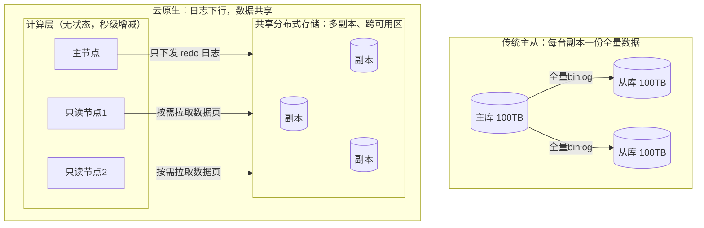
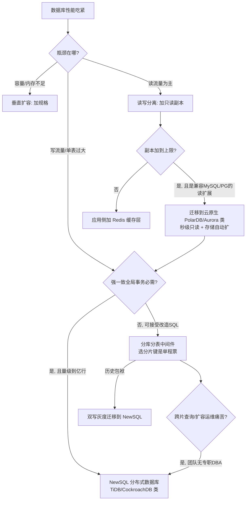

# 数据库选型

> 数据库是大多数系统里最难回退的技术决策：代码换框架是重构，数据换引擎是搬家。这篇面向要做选型、或者正在为"当年随手选的库"还债的工程师和架构师，讲清楚四件事：**数据库版图长什么样、云原生数据库到底新在哪、规模化该沿哪条路走、以及一线踩过的坑怎么绕开**。读完你应该能回答：我的业务在选型三角里牺牲什么、保住什么。

## 是什么：一张版图和一场迁移

先给数据库选型下一个从业者口径的定义：**在访问模式、一致性、规模、成本四个约束下，为业务数据选择一个"运维得起"的存储引擎组合**。注意是组合——我做了十余年云架构，几乎没有见过一个中大型系统只靠一种数据库活到今天的。

看版图最省事的坐标是 DB-Engines 流行度排行（按搜索热度、招聘、社区指标打分的热度榜，不代表技术优劣）。截至 2026 年 8 月的榜单头部：Oracle（约 1123 分）、MySQL（约 842 分）、Microsoft SQL Server、PostgreSQL 占据前四，MongoDB（约 385 分）和 Redis（约 157 分）分别是 NoSQL 阵营里最主流的名字；值得注意的趋势是 PostgreSQL 近年的增长领跑全行业，而 MySQL 的份额开始承压——开源关系型这面大旗正在从 MySQL 向 PG 系转移。

按"解决什么问题"划分，今天摆在桌面上的是四类：

| 阵营 | 代表 | 一句话定位 |
| --- | --- | --- |
| 关系型（RDBMS） | MySQL、PostgreSQL 及其云托管版（RDS 类） | 事务与复杂查询的默认答案 |
| 云原生数据库 | Aurora、PolarDB 类 | 关系型语义 + 存算分离的弹性 |
| NoSQL | Redis、MongoDB、Tablestore 类、时序库 | 用一致性/通用性换特定场景的规模与延迟 |
| NewSQL / 分布式 SQL | TiDB、CockroachDB、OceanBase | SQL + 强一致 ACID + 水平扩展，三者兼得 |
| 向量数据库 | pgvector、Milvus、专用托管向量服务 | RAG/语义检索时代的新基础设施 |

最后这一类是近三两年才挤进选型桌的：大模型应用落地让"向量相似度检索"从冷门能力变成了标配需求。我的判断是：**向量库短期内不会取代任何一类数据库，但会长期寄生在它们身上**——中小规模场景 pgvector 这类扩展够用，十亿级向量、高 QPS 才值得上 Milvus 这类专用引擎。

## 为什么重要：选错库的代价不对称

云把"买错机器"的代价摊薄到了小时级，却没有摊薄"选错引擎"的代价，原因有三：

1. **数据迁移是整个技术栈里最重的变更**。表结构、SQL 方言、事务语义、驱动与 ORM、周边工具链（备份、监控、DTS 同步）全要重来，而且迁移窗口内业务不能停——这决定了选型错了也只能带着债往前走。
2. **一致性语义是不可逆的架构假设**。先选了最终一致的 NoSQL 再想补强事务，等于重做业务层的对账与补偿；反过来，先选了强一致分布式库再想省成本，至少能缩节点。
3. **运维能力是隐性成本**。同样一款开源数据库，"云托管版"和"自建版"是两个物种：前者团队买的是业务，后者团队买的是 DBA 编制。

DB-Engines 榜上常年前列的 Oracle/MySQL 说明一件事：**数据库选型的主流压力不是"追新"，而是"别掉坑"**。选一个有二十年存量用户、社区和文档充沛的引擎，本身就是最稳健的技术判断；新引擎要等到你的场景恰好是它的靶心时再上。

## 架构与原理：四张必须看懂的骨架

### 骨架一：单机一切性能的来源——B+ 树与内存池

不管上面包装了多少云概念，MySQL/PostgreSQL 的存储引擎内核仍然是"**内存缓冲池 + 磁盘上的 B+ 树**"：

*图源：Wikimedia Commons（[文件页](https://commons.wikimedia.org/wiki/File:B%2B-tree-organization.png)）*

选 B+ 树而不是 B 树/红黑树的工程理由，一线视角看两条就够：

- **矮**：每个节点是一页（InnoDB 默认 16KB），扇出几百，两三层的树就能索引千万行——一次点查最多 2-3 次页读取；
- **叶子成链**：范围查询（`BETWEEN`、`ORDER BY`、前缀匹配）沿叶子链表走，这就是"最左前缀能用、跳列用不上"的物理原因。

由此推出的实操判断：**数据库性能问题八成是"访问模式与索引结构不匹配"**。buffer pool 命中率掉下来（数据量超过内存），延迟立刻从微秒级跳到毫秒级——云上扩容第一反应应该是加内存规格，而不是加计算核数。PostgreSQL 与 MySQL 在这层的主要差异之一是 MVCC 实现：PG 旧版本行留在原表里靠 vacuum 清理（长事务导致表膨胀是 PG 特色坑），InnoDB 把旧版本放 undo log——同一个"长事务有害"的结论，两种发病机制。

### 骨架二：高可用的地基——主从复制与读写分离

云上"高可用"的默认形态就是主从复制：主库写，二进制日志（binlog）经 dump 线程推给从库的 I/O 线程落进 relay log，再由 SQL 线程回放。

*图源：Wikipedia / MySQL 官方文档复制原理图（[文件页](https://en.wikipedia.org/wiki/File:Tony_May%27s_replication_diagram.png)）*

关键性质与坑，都在"异步"两个字上：

- **社区 MySQL 默认异步复制**：主库提交成功不代表从库收到，主库硬宕机可能丢最后一段事务；半同步（semi-sync）把确认提前到"至少一个从库收到 binlog"，代价是写延迟增加。**别把"有从库"当成"不丢数据"**，丢不丢取决于复制模式和切换时机。
- **复制延迟是读写分离的原罪**：业务"下单后立刻查订单"如果查询路由到延迟中的从库，用户就看到"订单消失"。一线的标准解法不是消灭延迟（做不到），而是**给"必须读己之写"的路径强制走主库**，或者用 GTID/位点做会话级等待。
- **只读副本不是备份**：误 `DROP TABLE` 会忠实地同步到所有从库。副本防误操作，快照 + binlog 才能回到时间点（PITR）。

### 骨架三：云原生数据库的核心思想——存算分离

传统主从的瓶颈在"每台副本都要完整复制数据、回放日志"。云原生数据库（Aurora、PolarDB 类）把存储抽成一个共享的、多副本的分布式层，计算节点变成"无状态"的数据库进程：

*注：左为传统异步复制架构，右为云原生存算分离架构示意。*

这个架构换了什么，论文里讲得很清楚：

- **Aurora（SIGMOD 2017）**：口号是 "the log is the database"——计算节点只把 redo log 发给存储层，页的物化、崩溃恢复都下推到存储节点完成。数据在 3 个可用区存 6 份，写需 5 份中 4 份确认、读需 2 份确认（quorum），持久化所需 I/O 约为传统 MySQL 部署的十分之一，故障恢复从分钟级降到秒级。
- **PolarDB（VLDB 2018 的 PolarFS 论文 + PVLDB 2019 综述）**：走的是"共享存储 + 改进 InnoDB"路线——PolarFS 用全用户态 I/O 栈（RDMA + SPDK 内核旁路）、Parallel-Raft 保证存储层低延迟高可用；数据库层一个主节点最多带 15 个只读节点共享同一份 100TB 级存储，加只读节点不再复制数据，所以是秒级。

一线怎么读这套架构红利：**扩只读副本从"小时级、双倍存储成本"变成"秒级、只花计算钱"**，读多写少的系统因此敢用"临时加节点扛峰值、峰值过后退掉"的打法；但写仍然只有一个主节点（多写架构是另一回事），**存算分离解决的是扩展弹性，不解决单点写入上限**。

### 骨架四：NoSQL 的一致性坐标系——CAP 与取舍

*图源：Wikimedia Commons（[文件页](https://commons.wikimedia.org/wiki/File:CAP_theorem_diagram.png)）*

CAP 定理（Gilbert–Lynch 形式化证明）的实用翻译只有一句：**网络分区不是"会不会发生"而是"何时发生"，所以真正的选择题发生在分区那一刻——保 C 还是保 A**。进一步还有 PACELC：没有分区时，仍在延迟 L 与一致性 C 之间做选择（跨区强一致读写就是它的代价）。

这解释了 NoSQL 版图的设计逻辑：

- Redis 单机强一致、集群走异步复制，定位是"缓存 + 数据结构服务器"，从不承诺跨节点持久强一致；
- MongoDB 默认读主写主，可选 write concern / read concern 提升一致性等级；
- Cassandra/Dynamo 类选择 AP，用最终一致换多活可用；
- TiDB/CockroachDB 这类 NewSQL 选择 CP：Raft/Paxos 多数派复制，分区时宁可拒绝服务也不返回旧数据。

**选型时把"C 还是 A"写进需求，比写"要分布式"有意义得多**。多数互联网业务真正的需求是"单行原子 + 可容忍秒级延迟的最终一致"，被销售话术带进"全局强一致分布式"的采购，通常是为用不到的保证付钱。

## 实践与选型

### 选型四问（先于任何产品对比）

1. **访问模式**：点查/范围查/聚合分析？读写比？——决定引擎类别。OLTP 与 OLAP 用同一个库是痛苦之源（HTAP 是平台方给的和解方案，不是魔法）。
2. **一致性要求**：强一致，还是最终一致可接受的窗口多长？——决定复制拓扑与是否付 NewSQL/多活的成本。
3. **规模与增长**：单表量级、QPS、三年后的数据量？——决定垂直还是水平路径，务必按三年后而非今天选型。
4. **运维与成本**：团队有没有 DBA？预算？容灾等级？——决定托管还是自建、单可用区还是跨区。

### 数据库类型对比表

| 类型 | 典型产品 | 数据模型 | 一致性 | 扩展方式 | 适用 | 一线警示 |
| --- | --- | --- | --- | --- | --- | --- |
| 开源关系（托管） | RDS MySQL/PG | 表 + SQL | 单机 ACID | 垂直 + 只读副本 | 默认 OLTP | 参数与备份策略决定生死，别裸用默认值 |
| 云原生关系 | PolarDB/Aurora 类 | 兼容 MySQL/PG | 单机 ACID | 计算垂直扩 + 只读秒级加，存储自动扩 | 读扩展频繁、容量增长快 | 写主仍单点；按存储量计费要盯冷数据 |
| 键值缓存 | Redis/Tair 类 | 内存数据结构 | 异步复制 | 集群分片 | 缓存、锁、排行榜、会话 | 它是缓存不是存储；容量规划 = 内存规划 |
| 文档 | MongoDB 类 | JSON 文档 | 单文档强一致可选 | 分片集群 | Schema 多变、内容类 | 无 JOIN 的代价最终由业务层还 |
| 宽表/多模托管 | Tablestore/Bigtable 类 | 行键宽表 | 行级强一致 | 自动水平分片 | 海量写、元数据、IM 消息 | 查询模式被行键设计锁死，设计期就是终局 |
| 时序 | InfluxDB/Prometheus 类 | 时间线 | 追加语义 | 按时间分片 | 监控、IoT | 通用库硬扛时序数据 = 索引爆炸 |
| NewSQL | TiDB/CockroachDB/OceanBase | SQL，分布式 | 跨行跨节点强一致 | 水平（加节点即扩写） | 单表亿级+强一致+想免分库分表 | 延迟下限由跨节点共识决定，P99 不如单机库 |
| 向量 | pgvector/Milvus | 向量 + ANN 索引 | 最终/弱事务 | 分片副本 | RAG、语义检索、推荐 | ANN 是"用召回率换速度"，要盯 recall@k |

### "什么场景选什么"决策表

| 场景 | 我的默认选择 | 升级触发线（经验值，按实例规格浮动） |
| --- | --- | --- |
| 新项目 OLTP，团队无 DBA | 托管 RDS MySQL/PG | 存储或读吞吐见顶 → 云原生（PolarDB 类）原地升级 |
| 读多写少，报表/查询流量抖动 | 云原生 + 读写分离（1 主 N 只读） | 只读加到上限仍不够 → 应用侧缓存层 |
| 高并发热点读（秒杀详情、榜单） | Redis 扛读，回源数据库 | 单 Key QPS 上千级即热 key（Redis 官方参考阈值约 1000 次/秒） |
| 单表持续超 500GB / 数十亿行 | 先归档与索引治理，再谈拆分 | 写也见顶 → 分库分表或 NewSQL |
| 强一致 + 数据量确定会到分布式规模 | TiDB/CockroachDB 类，直接买水平扩展 | 跨区容灾需求 → 多副本多区部署 |
| 日志/指标/IoT 上报 | 时序库或大数据侧列存 | 别用 MySQL 存监控明细 |
| 内容管理、字段频繁演化 | 文档数据库或 PG（JSONB） | PG 的 JSONB 常常让"要不要上 MongoDB"变成伪命题 |
| RAG 知识库，千万向量以内 | pgvector（贴业务库） | 十亿级/高 QPS/多租户 → Milvus 类专用引擎 |
| 异地多活、单元化 | 双向复制 + 冲突解决或多活专用产品 | 强一致跨区域写请三思，物理延迟无解 |

### 规模化：两条路的分界

提纲里那句经验我仍然坚持，并补充边界：**能不拆就不拆；要拆先拆"读"（读写分离、缓存），再拆"写"（分库分表）**。分库分表的真实成本在拆分之后才显现：跨分片 JOIN 与聚合要业务层改写、分页变成归并、全局唯一 ID 要发号器、扩容涉及数据搬迁、热点分片（某个大商家占满一个分片）需要二次打散。分片键一旦选定就是单程票——我见过的失败案例里，八成是拿"查询最方便列"当分片键，而不是"写入最均匀列"。

分布式数据库（NewSQL 类）本质是把上述苦役产品化：TiDB 的 SQL 层/存储层（TiKV，Raft 多副本）分离、CockroachDB 的 Range 级 Raft 复制，对上层保持 MySQL/PG 协议兼容。**判断线：单表十亿行级别、需要跨行跨表强一致事务、又不想养分库分表的隐性复杂度，上 NewSQL；否则它带来的跨节点延迟和成本会反噬你**。

### 自建 vs 托管：决策点收敛为三个

- **人力**：没有专职 DBA 的团队自建开源库，等于给未来预定一次半夜的数据恢复事故。多数情况选托管（RDS/PolarDB 类）。
- **版本与内核控制**：需要特定插件、内核 patch、非主流版本（典型如某些内核定制需求）才考虑自建或数据库内核服务。
- **合规与成本错觉**：合规要求自建数据面时可以自建，但把"自建省许可费"当理由前先算全成本——托管版按小时计的价格，通常比一支 24 小时待命 DBA 团队便宜。

### 数据迁移：可逆的状态机推进

提纲里的三段式我沿用并加细：**全量 → 增量追平 → 一致性校验**（DTS 类工具的标准流程，校验不是可选项，是切换门禁）。切换阶段用"双写灰度"：新库影子写 → 比对无误后读切新库 → 写切新库 → 保留旧库反向同步作为回滚通道。整个过程的每一步都必须有预案好的回退动作——**迁移的本质不是"把数据搬过去"，而是"让系统在任意时刻可回退"**。切换瞬间的窗口期约束（停写、或双写冲突仲裁）要提前和业务方签字确认，这是流程问题不是技术问题。

## 常见坑

| 坑 | 现象 | 根因与对策 |
| --- | --- | --- |
| 大事务 | 主库长时间行锁、从库延迟飙升、DDL 期间卡死、回滚段暴涨 | 一条 UPDATE 改百万行是"逻辑上的大事务"；分批提交，批量作业按主键区间切片；监控 `Seconds_Behind_Master` 与长事务（`information_schema.innodb_trx`），PG 看 vacuum 死元组堆积 |
| 连接风暴 | 应用扩容/故障恢复瞬间，数据库连接数打满，CPU 全耗在上下文切换 | 数据库最大连接数 ≠ 应用连接池之和；上代理层（Proxy 类）做连接收敛，设 `max_connections` 与线程池保护，应用池配超时与熔断 |
| 热点分片/热 key | 集群总分片容量充足，个别分片 CPU/带宽见顶，扩容无效 | 分片键倾斜（时间前缀递增、大客户集中）或单 key QPS 超千级；hash 加盐打散、热点 key 本地二级缓存/读写分离摊读、大 key 拆分（Redis 官方上限 512MB，实践中 value 应控制在 1MB 内） |
| 备份不设防 | 备份"成功"多年，第一次恢复演练就失败；或备份与库同生共死 | 备份三件套缺一不可：自动快照 + 异地存储 + 定期恢复演练（没演练过的备份等于没有备份）；防误删不能靠只读副本，要开回收站/PITR；对象存储桶权限与实例权限隔离 |
| 复制延迟当不存在 | 读写分离后"下单查不到单"、对账差异 | 异步复制天然滞后；读己之写强制走主库或位点等待；大事务是延迟放大器（从库回放串行化时段） |
| 缓存与库双写不一致 | 先删缓存后写库的窗口期脏读、缓存雪崩 | Cache-Aside + 过期兜底 + 关键路径延迟双删；缓存击穿用互斥重建；缓存只是加速层，一致性结论仍以库为准 |
| 选型期用不到三年后 | 上线两年后被迫在线拆库，全团队还债 | 容量按三年业务量估；决策表里的"升级触发线"在选型日就写进设计文档 |

## 站内相关

- [数据库·大数据导读](/cloud/data/) — 本篇在知识体系中的位置
- [大数据体系](/cloud/data/bigdata) — 分析型负载的另一半答案（OLAP 侧）
- [Kubernetes 核心机制与企业级落地](/cloud/native/kubernetes) — 有状态服务（数据库）该不该上 K8s，先看那篇的存储结论

## 参考资料

<Refs>

文字来源（访问日期均为 2026-09-02）：

- Verbitski, Gupta et al. *Amazon Aurora: Design Considerations for High Throughput Cloud-Native Relational Databases*. SIGMOD 2017. [PDF](https://homepages.cwi.nl/~boncz/lsde/papers/aurora.pdf) · [Amazon Science 页面](https://www.amazon.science/publications/amazon-aurora-design-considerations-for-high-throughput-cloud-native-relational-databases)
- Cao, Liu et al. *PolarFS: An Ultra-low Latency and Failure Resilient Distributed File System for Shared Storage Cloud Database*. PVLDB 11(12): 1849–1862, 2018. [ACM DL](https://dl.acm.org/doi/10.14778/3229863.3229872)
- Li et al. *Cloud-Native Database Systems at Alibaba: Opportunities and Challenges*. PVLDB 12(12): 2263–2272, 2019. [PDF](https://www.vldb.org/pvldb/vol12/p2263-li.pdf)
- Hamilton, J. *Weekend Reading: Amazon Aurora Design Considerations*. All Things Distributed. [链接](https://www.allthingsdistributed.com/2017/05/amazon-aurora-design-considerations.html)
- DB-Engines. *Popularity Ranking of DBMS*（2026 年 8-9 月数据：Oracle/MySQL/SQL Server/PostgreSQL/MongoDB/Redis 分数与趋势）. [db-engines.com/en/ranking](https://db-engines.com/en/ranking) · [增长趋势](https://db-engines.com/en/ranking_trend)
- Wikipedia. *CAP theorem*（C/A/P 定义、Gilbert–Lynch 不可能结果、PACELC）. [链接](https://en.wikipedia.org/wiki/CAP_theorem)
- Wikipedia. *NewSQL* / *Distributed SQL*（定义与边界：NewSQL 是更宽泛的类，分布式 SQL 是其共享无存子集）. [NewSQL](https://en.wikipedia.org/wiki/NewSQL) · [Distributed SQL](https://en.wikipedia.org/wiki/Distributed_SQL)
- Wikipedia. *TiDB*（Spanner/F1 启发的 HTAP NewSQL，MySQL 协议兼容）. [链接](https://en.wikipedia.org/wiki/TiDB)
- Redis Documentation. *Keys and values*（512MB 上限、key 设计）· *Persistence*（RDB/AOF）· *Performance Tuning Best Practices* 与 *7 Redis Worst Practices*（大 key/热 key、无界命令）. [Keys and values](https://redis.io/docs/latest/develop/using-commands/keyspace/) · [Worst Practices](https://redis.io/blog/7-redis-worst-practices/) · [Cluster 分片实践](https://redis.io/blog/redis-clustering-best-practices-with-keys/)
- 阿里云帮助文档. *识别和处理大 Key 和热 Key*（大/热 key 判定与治理方法）. [链接](https://help.aliyun.com/zh/redis/user-guide/identify-and-handle-large-keys-and-hotkeys/)
- CockroachDB. *Distributed SQL Glossary*（强一致 + 水平扩展的定义）. [链接](https://www.cockroachlabs.com/glossary/distributed-db/distributed-sql/)
- Zilliz. *ES vs Milvus vs pgvector：LLM 时代的向量数据库选型指南*. [链接](https://zilliz.com.cn/blog/ES-vs-Milvus-vs-PGvector-LLM-Guide)
- Firecrawl. *Best Vector Databases in 2026: A Complete Comparison Guide*. [链接](https://www.firecrawl.dev/blog/best-vector-databases)

图片来源（访问日期均为 2026-09-02）：

- B+ 树结构示意：Wikimedia Commons, [File:B+-tree-organization.png](https://commons.wikimedia.org/wiki/File:B%2B-tree-organization.png)
- MySQL 主从复制线程模型：Wikipedia, [File:Tony May's replication diagram.png](https://en.wikipedia.org/wiki/File:Tony_May%27s_replication_diagram.png)（源自 MySQL 复制文档原理图）
- CAP 定理关系图：Wikimedia Commons, [File:CAP theorem diagram.png](https://commons.wikimedia.org/wiki/File:CAP_theorem_diagram.png)

</Refs>