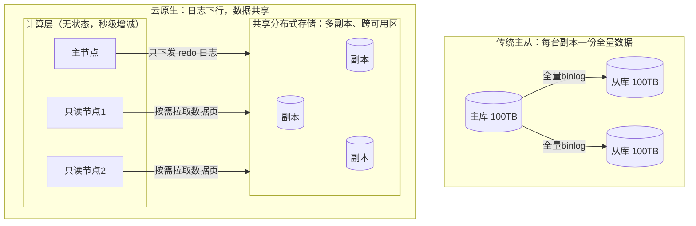
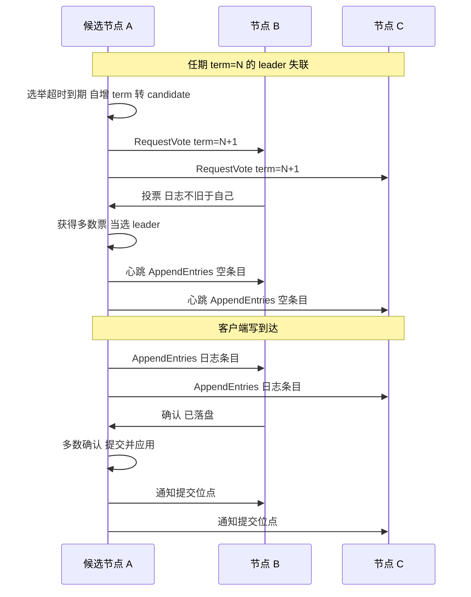
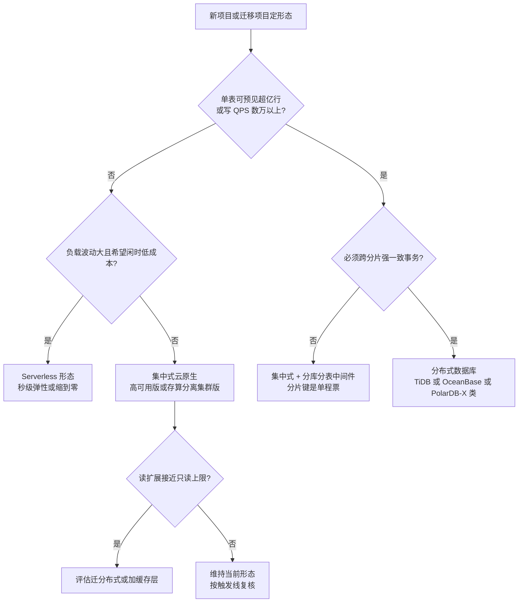
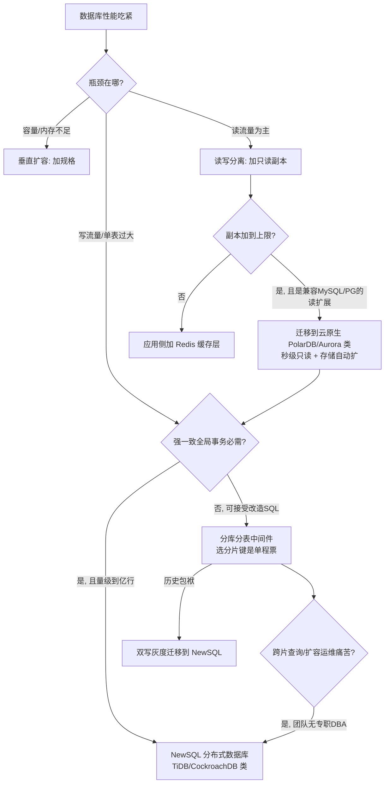
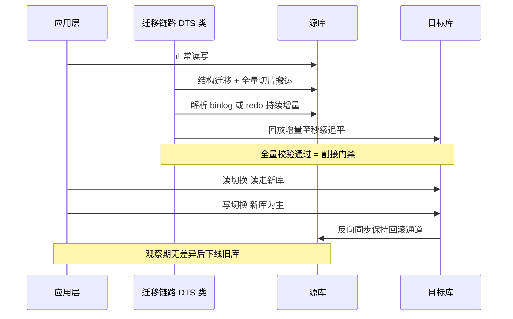

# 数据库选型

> 数据库是大多数系统里最难回退的技术决策：代码换框架是重构，数据换引擎是搬家。这篇面向要做选型、或者正在为"当年随手选的库"还债的工程师和架构师，沿一条主线讲透六件事：**单机内核机制（B+ 树 / LSM-Tree / MVCC / 隔离级别）、云数据库架构演进的三级跳（主备 → 存算分离 → 云原生分布式）、Serverless 数据库的弹性与计费真相、多模谱系与向量检索现状、迁移上云的四阶段方法论、以及一线踩过的坑怎么绕开**。读完你应该能回答：我的业务在选型三角里牺牲什么、保住什么；以及在"集中式云原生 / 分布式 / Serverless"三种形态之间，我的负载该站哪边。

## 是什么：一张版图和一场迁移

先给数据库选型下一个从业者口径的定义：**在访问模式、一致性、规模、成本四个约束下，为业务数据选择一个"运维得起"的存储引擎组合**。注意是组合——我做了十余年云架构，几乎没有见过一个中大型系统只靠一种数据库活到今天的。

看版图最省事的坐标是 DB-Engines 流行度排行（按搜索热度、招聘、社区指标打分的热度榜，不代表技术优劣）。截至 2026 年 8 月的榜单头部：Oracle（约 1123 分）、MySQL（约 842 分）、Microsoft SQL Server、PostgreSQL 占据前四，MongoDB（约 385 分）和 Redis（约 157 分）分别是 NoSQL 阵营里最主流的名字；值得注意的趋势是 PostgreSQL 近年的增长领跑全行业，而 MySQL 的份额开始承压——开源关系型这面大旗正在从 MySQL 向 PG 系转移。

按"解决什么问题"划分，今天摆在桌面上的是四类：

| 阵营 | 代表 | 一句话定位 |
| --- | --- | --- |
| 关系型（RDBMS） | MySQL、PostgreSQL 及其云托管版（RDS 类） | 事务与复杂查询的默认答案 |
| 云原生数据库 | Aurora、PolarDB 类 | 关系型语义 + 存算分离的弹性 |
| NoSQL | Redis、MongoDB、Tablestore 类、时序库 | 用一致性/通用性换特定场景的规模与延迟 |
| NewSQL / 分布式 SQL | TiDB、CockroachDB、OceanBase | SQL + 强一致 ACID + 水平扩展，三者兼得 |
| 向量数据库 | pgvector、Milvus、专用托管向量服务 | RAG/语义检索时代的新基础设施 |

最后这一类是近三两年才挤进选型桌的：大模型应用落地让"向量相似度检索"从冷门能力变成了标配需求。我的判断是：**向量库短期内不会取代任何一类数据库，但会长期寄生在它们身上**——中小规模场景 pgvector 这类扩展够用，十亿级向量、高 QPS 才值得上 Milvus 这类专用引擎。

版图里还有半壁江山——**分析型（OLAP）引擎**：ClickHouse、StarRocks、Doris 这类为聚合分析而生的列存 MPP 数据库。它们的选型逻辑与本文讲的 OLTP 完全不同（不追求单行事务，追求扫描与聚合的吞吐），值得单独成篇，见 [OLAP 引擎：StarRocks、Doris 与 ClickHouse 的架构与选型](/cloud/data/olap)。

## 为什么重要：选错库的代价不对称

云把"买错机器"的代价摊薄到了小时级，却没有摊薄"选错引擎"的代价，原因有三：

1. **数据迁移是整个技术栈里最重的变更**。表结构、SQL 方言、事务语义、驱动与 ORM、周边工具链（备份、监控、DTS 同步）全要重来，而且迁移窗口内业务不能停——这决定了选型错了也只能带着债往前走。
2. **一致性语义是不可逆的架构假设**。先选了最终一致的 NoSQL 再想补强事务，等于重做业务层的对账与补偿；反过来，先选了强一致分布式库再想省成本，至少能缩节点。
3. **运维能力是隐性成本**。同样一款开源数据库，"云托管版"和"自建版"是两个物种：前者团队买的是业务，后者团队买的是 DBA 编制。

DB-Engines 榜上常年前列的 Oracle/MySQL 说明一件事：**数据库选型的主流压力不是"追新"，而是"别掉坑"**。选一个有二十年存量用户、社区和文档充沛的引擎，本身就是最稳健的技术判断；新引擎要等到你的场景恰好是它的靶心时再上。

## 架构与原理：上云之前必须看懂的内核机制

云包装可以换，内核机制换不了。下面五节是"云化之前的底座"——看不懂这些，后面所有云形态的红利与代价都只能靠背结论。

### 骨架一：单机一切性能的来源——B+ 树与内存池

不管上面包装了多少云概念，MySQL/PostgreSQL 的存储引擎内核仍然是"**内存缓冲池 + 磁盘上的 B+ 树**"：


*图源：Wikimedia Commons（[文件页](https://commons.wikimedia.org/wiki/File:B%2B-tree-organization.png)）*

选 B+ 树而不是 B 树/红黑树的工程理由，一线视角看两条就够：

- **矮**：每个节点是一页（InnoDB 默认 16KB），扇出几百，两三层的树就能索引千万行——一次点查最多 2-3 次页读取；
- **叶子成链**：范围查询（`BETWEEN`、`ORDER BY`、前缀匹配）沿叶子链表走，这就是"最左前缀能用、跳列用不上"的物理原因。

由此推出的实操判断：**数据库性能问题八成是"访问模式与索引结构不匹配"**。buffer pool 命中率掉下来（数据量超过内存），延迟立刻从微秒级跳到毫秒级——云上扩容第一反应应该是加内存规格，而不是加计算核数。

buffer pool 命中率是我最先看的一个指标，MySQL 侧的口径：

```sql
SHOW GLOBAL STATUS LIKE 'Innodb_buffer_pool_read%';
-- 命中率 = 1 - Innodb_buffer_pool_reads / Innodb_buffer_pool_read_requests
```

经验边界：OLTP 点查型负载命中率低于 99% 就该警惕（说明热数据放不进了），低于 95% 基本可以确认"内存规格不足"是主因；而分析型混跑负载这个数字天然低，不能套同一阈值。PG 侧对应看 `pg_stat_database` 的 blks_hit / blks_read 比值与 shared_buffers 命中情况，结论同源。

### 骨架二：MVCC——多版本并发控制的两种发病机制

关系型数据库能做到"读不阻塞写、写不阻塞读"，靠的是 MVCC（Multiversion Concurrency Control，多版本并发控制）：每次更新不覆盖旧值，而是保留历史版本，读操作按自己事务的快照挑一个"可见"的版本。两大主流实现路线完全不同，坑也完全不同：

- **InnoDB（MySQL）路线**：行上带隐藏的事务 ID 与回滚指针，旧版本被挪进 undo log，串成版本链；每个事务（准确地说是 RR 级别下每个事务的第一次读）建立一个 Read View（活跃事务列表 + 上下界），读的时候沿版本链从新往旧找第一个"对我可见"的版本。RC 级别每条语句重建 Read View，RR 级别整个事务复用——这就是"RR 能看到旧快照"的根源。
- **PostgreSQL 路线**：旧版本不搬家，行头直接记 xmin（创建事务）/ xmax（删除事务），死元组原地留在表里，靠 vacuum 后台清理。代价是长事务会压住 xmin 水位，死元组清不掉，表持续膨胀——PG 特色坑。

| 引擎 | 旧版本存放 | 清理机制 | 长事务的后果 |
| --- | --- | --- | --- |
| InnoDB（MySQL/PolarDB MySQL 类） | undo log 版本链 | purge 线程按最小活跃事务水位回收 | undo 段暴涨、purge 滞后、历史版本链变长读变慢 |
| PostgreSQL 系 | 表内原位死元组 | vacuum / autovacuum | 表膨胀、索引膨胀、autovacuum 追不上时性能悬崖 |

同一个"长事务有害"的结论，两种发病机制。排查时 MySQL 看 `information_schema.innodb_trx` 与 undo 长度，PG 看死元组堆积与 vacuum 水位，别拿一套经验套两个库。

### 骨架三：索引两大家族——B+ 树 vs LSM-Tree 与放大三角

B+ 树是"读优化"结构：原地更新页，写是随机 I/O。LSM-Tree（Log-Structured Merge-Tree，日志结构合并树）是"写优化"结构：写入先进内存 memtable 并顺序追加 WAL，memtable 满了冻结为不可变的 SSTable 落盘，后台通过 compaction（合并）把多层 SSTable 归并整理。读的时候要跨 memtable + 多层 SSTable 查找，靠布隆过滤器和块缓存止血。


*图源：Wikimedia Commons，File:LSM Tree.png（[文件页](https://commons.wikimedia.org/wiki/File:LSM_Tree.png)，原图出自 Ben Stopford 博客 Log Structured Merge Trees）*

两个家族的取舍用"放大三角"描述最准确——写放大、读放大、空间放大三者此消彼长，任何引擎只能挑一个角站着：

| 放大类型 | B+ 树（InnoDB 类） | LSM-Tree（RocksDB/TiKV 类） | 工程含义 |
| --- | --- | --- | --- |
| 写放大 | 改一个字节要重写整页（16KB）+ redo，且是随机 I/O | 顺序 WAL + flush + compaction 反复重写同一条数据，leveled compaction 典型 10-30 倍 | 写密集、云盘 IOPS 计费的场景 LSM 把随机写变顺序写，更省钱 |
| 读放大 | 一次点查 2-4 次页读，路径确定 | 最坏跨全部层查找，靠布隆过滤器/块缓存压到接近 1-2 次 | 读密集点查、延迟敏感场景 B+ 树下限更稳 |
| 空间放大 | 页分裂与删除留空洞，需 optimize/重建回收 | compaction 期间新旧两份共存 + 墓碑标记，典型 1.1-1.5 倍 | 容量规划要给 compaction 留余量，磁盘水位不能按 90% 算 |

阵营归属上：InnoDB、PostgreSQL 是 B+ 树；RocksDB/LevelDB、TiKV、OceanBase、Cassandra、HBase 系是 LSM-Tree；MongoDB 的 WiredTiger 引擎也是 LSM 路线（这点常被忽略，导致按"B+ 树直觉"调 MongoDB 写性能的人踩坑）。我的经验判断：**写入吞吐与顺序追加为主的负载（时序、消息、事件流）选 LSM 系；点查 + 范围查混合、延迟 P99 敏感的 OLTP 选 B+ 树系**；在云盘（本质是分布式块存储、IOPS 与吞吐解耦）上，LSM 的顺序写优势比本地盘时代小了一些，但 compaction 对 IOPS 的吞噬依然是 LSM 系实例规格规划的第一约束。

compaction 策略是 LSM 系调优的主旋钮，两种主流路线的取舍：

| 策略 | 空间放大 | 写放大 | 读放大 | 代表 |
| --- | --- | --- | --- | --- |
| leveled（分层） | 低（约 1.1 倍） | 高（每层归并一次） | 低（每层最多一个候选文件） | RocksDB 默认、TiKV |
| tiered（分级/全量归并） | 高（层内多份共存） | 低（整组搬移不重写） | 高（层内多文件都要查） | Cassandra 早期、RocksDB universal |

一线含义：磁盘水位紧张选 leveled、写吞吐极端敏感选 tiered；云盘 IOPS 充裕而容量贵的场景（对象存储下沉的存算分离形态）近年又出现"回到 tiered + 对象存储"的回摆，因为对象存储的写是按请求计费、重写次数比空间更贵。

### 骨架四：事务隔离级别与云上默认值

隔离级别定义的是"并发事务之间互相能看到多少"。四个经典异常：脏读（读到未提交）、不可重复读（同事务两次读同一行结果不同）、幻读（同事务两次范围查行数不同）、写倾斜（两个事务各自读后写不同行，合起来破坏约束）。

| 隔离级别 | 脏读 | 不可重复读 | 幻读 | 写倾斜 | 实现代价 |
| --- | --- | --- | --- | --- | --- |
| READ UNCOMMITTED | 有 | 有 | 有 | 有 | 几乎没人用 |
| READ COMMITTED（RC） | 无 | 有 | 有 | 有 | 语句级快照，锁最少 |
| REPEATABLE READ（RR） | 无 | 无 | InnoDB 用 next-key lock 在当前读下防住 | 快照读下理论上存在 | 间隙锁带来额外锁等待 |
| SERIALIZABLE | 无 | 无 | 无 | 无 | 串行化检测/真串行执行，吞吐最低 |

云上各产品的**默认值**差异是选型时最容易忽略的一笔（截至 2026-09 的官方默认配置）：

| 产品/引擎 | 默认隔离级别 | 一线提示 |
| --- | --- | --- |
| MySQL / RDS MySQL / Aurora MySQL / PolarDB MySQL 类 | REPEATABLE READ | binlog 格式与 RR 配合是主从一致的前提；间隙锁是锁等待高发源 |
| PostgreSQL / RDS PG / Aurora PG 类 | READ COMMITTED | 需要防写倾斜时显式上 SERIALIZABLE（SSI 实现，冲突事务回滚重试） |
| Oracle 系 | READ COMMITTED | 快照机制成熟，长读不阻塞写 |
| TiDB | REPEATABLE READ（实质是快照隔离 SI） | 文档明示其 RR 不等价于 MySQL RR 的全部语义，迁移时逐条核对 |
| OceanBase（MySQL 模式） | READ COMMITTED | 从 MySQL RR 迁过来的应用要评估快照语义差异 |
| CockroachDB | SERIALIZABLE | 默认最强，冲突写多时重试率是必须监控的指标 |

我的经验：**九成互联网业务 RC 就够了**，真正需要 RR/SERIALIZABLE 的是账务核对类路径，用显式锁或单事务内完成比抬全局隔离级别便宜。从 MySQL 迁 PG/Oracle 系时，默认隔离级别从 RR 掉到 RC 带来的行为差异（同一事务内两次读结果不同），是回归测试必须覆盖的用例。

### 骨架五：高可用的地基——主从复制与读写分离

云上"高可用"的默认形态就是主从复制：主库写，二进制日志（binlog）经 dump 线程推给从库的 I/O 线程落进 relay log，再由 SQL 线程回放。


*图源：Wikipedia / MySQL 官方文档复制原理图（[文件页](https://en.wikipedia.org/wiki/File:Tony_May%27s_replication_diagram.png)）*

关键性质与坑，都在"异步"两个字上：

- **社区 MySQL 默认异步复制**：主库提交成功不代表从库收到，主库硬宕机可能丢最后一段事务；半同步（semi-sync）把确认提前到"至少一个从库收到 binlog"，代价是写延迟增加。**别把"有从库"当成"不丢数据"**，丢不丢取决于复制模式和切换时机。
- **复制延迟是读写分离的原罪**：业务"下单后立刻查订单"如果查询路由到延迟中的从库，用户就看到"订单消失"。一线的标准解法不是消灭延迟（做不到），而是**给"必须读己之写"的路径强制走主库**，或者用 GTID/位点做会话级等待。
- **只读副本不是备份**：误 `DROP TABLE` 会忠实地同步到所有从库。副本防误操作，快照 + binlog 才能回到时间点（PITR）。

半同步复制的延迟账值得单独算一笔，因为它直接决定你的 P99：

- **异步**：主库本地 fsync 完就返回，从库收没收到不管——丢数据窗口敞开。
- **半同步 after_commit（5.5/5.6 时代）**：引擎提交之后才等从库 ACK，主库崩溃切换后可能出现"应用已收到成功、新主上却没有这条数据"的回退幻影。
- **半同步 after_sync（5.7 增强半同步，lossless）**：binlog 落盘、从库确认收到之后、引擎提交之前返回——已确认的事务不丢，这是目前托管产品高可用版的普遍底座。
- **代价**：每次提交多付一个跨 AZ 往返（同城跨可用区 RTT 通常 0.5-3ms 量级）加从库写盘时间；且半同步有超时降级机制（超时退回异步），**降级发生的那一刻就是丢数据窗口重新打开的时刻**，所以"半同步降级事件"必须进告警，而不是只看复制延迟曲线。

### 骨架六：NoSQL 的一致性坐标系——CAP 与取舍


*图源：Wikimedia Commons（[文件页](https://commons.wikimedia.org/wiki/File:CAP_theorem_diagram.png)）*

CAP 定理（Gilbert–Lynch 形式化证明）的实用翻译只有一句：**网络分区不是"会不会发生"而是"何时发生"，所以真正的选择题发生在分区那一刻——保 C 还是保 A**。进一步还有 PACELC：没有分区时，仍在延迟 L 与一致性 C 之间做选择（跨区强一致读写就是它的代价）。

这解释了 NoSQL 版图的设计逻辑：

- Redis 单机强一致、集群走异步复制，定位是"缓存 + 数据结构服务器"，从不承诺跨节点持久强一致；
- MongoDB 默认读主写主，可选 write concern / read concern 提升一致性等级；
- Cassandra/Dynamo 类选择 AP，用最终一致换多活可用；
- TiDB/CockroachDB 这类 NewSQL 选择 CP：Raft/Paxos 多数派复制，分区时宁可拒绝服务也不返回旧数据。

**选型时把"C 还是 A"写进需求，比写"要分布式"有意义得多**。多数互联网业务真正的需求是"单行原子 + 可容忍秒级延迟的最终一致"，被销售话术带进"全局强一致分布式"的采购，通常是为用不到的保证付钱。

## 云数据库架构演进主线：三级跳

云数据库不是"把数据库搬上虚拟机"，而是沿着一条清晰的架构主线重写了三遍：每一跳都解决上一跳的结构性瓶颈，也引入新的代价。

### 第一跳：单机到主备——用复制换可用

第一跳就是骨架五讲的主从复制 + 主备切换：解决"单点故障"，但没解决任何扩展问题——每个副本一份全量数据、全量回放日志，副本越加存储成本越线性涨，且复制延迟永远存在。这一跳的产物是今天所有云厂商的"高可用版"形态。

### 第二跳：存算分离——"the log is the database"

传统主从的瓶颈在"每台副本都要完整复制数据、回放日志"。云原生数据库（Aurora、PolarDB 类）把存储抽成一个共享的、多副本的分布式层，计算节点变成"无状态"的数据库进程：



*注：左为传统异步复制架构，右为云原生存算分离架构示意。*

**Aurora（SIGMOD 2017）** 的机制拆解，论文给得很硬：

- 口号是 "the log is the database"——计算节点**只把 redo log 发给存储层**，数据页的物化、崩溃恢复全部下推到存储节点后台完成；
- 数据按 10GB 段（protection group）切分，每段在 3 个可用区存 6 份；写需 6 份中 4 份确认（write quorum 4/6），读需 3 份确认（read quorum 3/6）——这个配额能同时容忍"丢一个整 AZ + 再丢任意 1 份"而不丢可用性；
- 跨网络的 I/O 从传统 MySQL 的"redo + binlog + 双写页 + 从库页"七种写，压缩到只剩 redo 一种：论文实测 SysBench 30 分钟，镜像 MySQL 每事务 7.4 次网络 I/O，Aurora 带副本仅 0.95 次；
- 崩溃恢复不再需要重放全量 redo：恢复时间从分钟级降到普遍 10 秒内（论文口径），因为存储层始终在后台把日志物化成页；
- 一个写实例最多带 15 个只读副本，副本不加存储成本、不复制数据。


*图源：Aurora SIGMOD 2017 论文 Figure 3（Network IO in Amazon Aurora）（[论文 PDF](https://homepages.cwi.nl/~boncz/lsde/papers/aurora.pdf) · [Amazon Science 页面](https://www.amazon.science/publications/amazon-aurora-design-considerations-for-high-throughput-cloud-native-relational-databases)）*

存储节点内部是一条八步异步流水线，这正是"计算敢只写日志"的底气所在：收到日志入队（1）→ 落盘并 ACK（2，前台路径只有这两步）→ 按段排序分组（3）→ 节点间 gossip 补洞（4）→ 合并日志生成数据页（5）→ 旧版本与快照回收（6）→ 垃圾回收（7）→ 周期校验页 CRC（8），热点日志与时间点快照异步备份到对象存储。前台只等落盘、其余全异步，是 Aurora 写延迟曲线的形状来源。


*图源：Aurora SIGMOD 2017 论文 Figure 4（IO Traffic in Aurora Storage Nodes）（[论文 PDF](https://homepages.cwi.nl/~boncz/lsde/papers/aurora.pdf)）*

**PolarDB（PVLDB 2018 PolarFS 论文 + PVLDB 2019 综述）** 走的是"共享存储 + 改造 InnoDB"路线，机制上有自己的鲜明特征：

- PolarFS 是全用户态 I/O 栈：RDMA 网络 + SPDK 内核旁路，把分布式存储的访问延迟压到接近本地盘，数据库进程像访问本地文件系统一样访问共享块设备；
- 存储层用 Parallel-Raft（对 Raft 的并行化改造，允许日志乱序提交、按序应用）保证多副本低延迟高可用；
- 数据库层一个主节点最多带 15 个只读节点，共享同一份百 TB 级存储（PolarStore），只读节点靠物理复制（redo）追主节点，加只读节点不复制数据，所以是秒级；
- 计算节点内的 Data Router + 用户态文件系统负责页缓存与路由，主备切换时存储不动、只切计算。


*图源：PVLDB 2019 论文 Cloud-Native Database Systems at Alibaba Figure 4（Architecture of POLARDB）（[PDF](https://www.vldb.org/pvldb/vol12/p2263-li.pdf)）*

把三种架构放在一起对账，红利和代价一目了然：

| 维度 | 传统主从 | Aurora 类 | PolarDB 类 |
| --- | --- | --- | --- |
| 跨网络写的内容 | redo + binlog + 数据页 + 从库数据页 | 仅 redo（4/6 quorum） | 仅 redo/物理日志（共享存储多副本） |
| 加只读副本 | 小时级、全量复制、双倍存储 | 秒级、零额外存储 | 秒级、零额外存储 |
| 存储冗余成本 | 每副本一份全量 | 一份数据 6 副本（存储层统一计费） | 一份数据 3 副本（PolarStore） |
| 崩溃恢复 | 分钟级（重放 redo） | 普遍 10 秒内 | 秒级（存储不恢复、只切计算） |
| 写扩展 | 单主 | 单主 | 单主（多写是分布式版的事） |

一线怎么读这套架构红利：**扩只读副本从"小时级、双倍存储成本"变成"秒级、只花计算钱"**，读多写少的系统因此敢用"临时加节点扛峰值、峰值过后退掉"的打法；但写仍然只有一个主节点（多写架构是另一回事），**存算分离解决的是扩展弹性，不解决单点写入上限**。另外两个隐性代价要写进成本模型：存储按实际用量计费，冷数据不归档会一直收钱；Aurora 类按 I/O 请求数计费的形态下，全表扫描和写放大直接翻译成账单。

两条路线的实现差异值得单独对一次表，因为它们决定了故障行为与调优抓手的不同：

| 维度 | Aurora 类 | PolarDB 类 |
| --- | --- | --- |
| 存储接口 | 自研存储服务协议（日志即接口） | 分布式文件系统（PolarFS，POSIX 语义块设备） |
| 页物化位置 | 存储节点后台 coalesce | 存储层物化 + 计算节点页缓存协作 |
| 一致性协议 | 段级 quorum（4/6 写、3/6 读） | Parallel-Raft 多副本 |
| 网络栈 | 常规内核网络 + 专用协议优化 | 用户态 RDMA + SPDK 内核旁路 |
| 只读节点追主 | 拉取日志流自行应用 | 共享存储 + 物理复制同步元数据 |
| 故障恢复形态 | 计算重启即服务（存储不恢复） | 计算切换即服务（存储不恢复） |

共性结论比差异更重要：**两者都把"持久化"从计算节点拿走了**，所以计算节点可以随意重启、秒级替换；这也是云原生数据库敢承诺秒级 RTO 的物理基础，而不是运维水平问题。

### 第三跳：云原生分布式——分片 + 共识多副本

存算分离解决了"读扩展与存储弹性"，没解决"写扩展"：单主写入上限就是天花板。第三跳把数据水平切成分片（shard/region/分区），每个分片用共识协议（Raft/Paxos）做多数派多副本，多个分片的写入并行推进——这就是 NewSQL/分布式 SQL 的物理基础。

共识协议是这一跳的心脏，以 Raft 为例（Ongaro & Ousterhout, USENIX ATC 2014）：节点分 leader/follower/candidate 三角色，任期（term）递增；选举靠随机化的选举超时（典型 150-300ms）错开投票，拿到多数票者当选；日志复制由 leader 串行发起 AppendEntries，**多数副本确认即提交**，follower 按序应用。工程含义有三条：提交延迟等于"到多数派的 RTT"，所以同城跨 AZ 部署 P99 稳定在毫秒级、跨地域部署会跳到几十毫秒；leader 所在节点是单个分片的写热点；分区时少数派一侧拒绝服务（CP 选择）。官方站点 raft.github.io 提供论文与交互可视化，是理解这套机制最好的入口。



*注：Raft 选举与多数派提交时序。提交点永远在"多数副本落盘确认"之后，这就是分布式数据库写延迟下限的来源。*

**TiDB** 的分工是教科书式的：TiDB Server 是无状态 SQL 层（MySQL 协议兼容，水平扩展）；PD（Placement Driver）管元数据、调度与全局时间戳 TSO（分布式事务的快照一致性靠它）；TiKV 是分布式行存，数据按 Region（默认约 96MiB 一个）切分，每个 Region 三副本 Raft；TiFlash 以 Raft learner 身份异步接收行存变更并转列存，供分析查询——HTAP 由此而来。


*图源：TiDB 官方文档 TiDB Architecture（[文档页](https://docs.pingcap.com/tidb/stable/tidb-architecture/)）*

**OceanBase** 的形态更像"对等节点 + 分区 Paxos"：Zone 是故障域（可对应可用区/机房），每个 Zone 内若干对等 OBServer（SQL 引擎 + 事务引擎 + 存储引擎一体），RootService 负责元数据与调度（自身也 Paxos 多副本），OBProxy 做路由；数据按分区组织、每个分区在各 Zone 一个副本组成 Paxos 组；存储引擎是 LSM-Tree。其公开记录包括 2020 年 TPC-C 70700 万 tpmC（PVLDB 2022 论文口径）。4.x 之后的"单机分布式一体化"形态允许同一套引擎从单节点起步、按需扩成集群，把"要不要一开始就上分布式"的决策压力后移。


*图源：PVLDB 2022 论文 OceanBase: A 707 Million tpmC Distributed Relational Database System Figure 1（[PDF](https://vldb.org/pvldb/vol15/p3385-xu.pdf)）*

这一跳对产品侧的意义是**透明分布式**：PolarDB-X、TiDB、OceanBase 类产品把分片、再均衡、分布式事务（两阶段提交 + 全局快照）做进内核，应用看到的仍是一个"单库"。它替代的不是 MySQL，而是"MySQL + 分库分表中间件 + 一支懂中间件的团队"这个组合。

### 三形态决策：集中式云原生 vs 分布式 vs Serverless

| 形态 | 写上限 | 一致性 | 弹性方向 | 延迟特征 | 成本模型 | 适用 | 一线警示 |
| --- | --- | --- | --- | --- | --- | --- | --- |
| 集中式云原生（RDS 高可用/集群版、PolarDB、Aurora 类） | 单主，垂直扩 | 单机 ACID | 读秒级、存储自动 | 同 AZ 最低、跨 AZ 加一个 RTT | 规格 + 存储 + I/O | 默认 OLTP、读扩展频繁 | 写见顶时只能换形态，不能加节点 |
| 分布式（TiDB/OceanBase/PolarDB-X 类） | 水平加节点 | 跨行跨节点强一致 | 读写均水平 | 下限由跨节点共识决定，P99 高于单机 | 节点数 × 规格 + 存储 | 单表亿级、强一致、免分库分表 | 小规模部署时共识开销是纯浪费 |
| Serverless（Aurora Serverless v2、RDS/PolarDB Serverless 类、Neon 类） | 随基础形态 | 随基础形态 | 秒级垂直、部分可缩到 0 | 弹性瞬间有抖动、缩零后有冷启动 | 按实际用量秒级计费 | 波动大、长尾、多租户 | 稳态高负载用 Serverless 单价更贵 |



*注：形态决策树。先定量级与一致性，再谈弹性与成本；顺序反了就会为用不到的保证付钱。*

## Serverless 数据库：秒级弹性的机制与账单真相

Serverless 不是一种新引擎，而是"弹性 + 计费"两件事的产品化：计算容量按实际用量秒级伸缩、按用量计费，把容量规划从采购动作变成运行时行为。

**弹性机制**三条路线（截至 2026-09 的公开形态）：

- **Aurora Serverless v2**：以 ACU 为单位（1 ACU 约对应 2GiB 内存一档的计算能力），单实例 0.5-128 ACU、以 0.5 ACU 为步长秒级垂直伸缩；不缩到 0，闲时成本靠压到 0.5 ACU 与减副本实现。官方文档明确其 scaling 是响应负载指标的自动垂直扩展。
- **Neon 类（Serverless Postgres）**：存算分离做到极致——计算节点可在空闲超时后自动 suspend（**缩到 0**，默认空闲数分钟触发），唤醒时从共享存储冷启动；分支（branch）用写时复制做数据快照，秒级开出一条隔离的开发/测试分支，这是它对 CI/CD 最值钱的能力。
- **阿里云 RDS MySQL Serverless / PolarDB Serverless 类**：以 RCU/PCU 这类弹性单位按负载秒级伸缩、按量计费，部分形态支持空闲暂停（只收存储费）；具体步长与上限以官方文档当前版本为准。

**冷启动**是缩到零路线必须付的账，拆开看是三段：进程/容器拉起（百毫秒级）、缓冲池冷（前几秒查询全部打到共享存储、I/O 密集）、连接与prepared statement 重建。从暂停态到可服务，量级是秒级到十秒级；从最小弹性单位往上扩则是亚秒到秒级。所以**缩到零适合"能接受首请求秒级延迟"的负载**，把缩零用在用户请求路径上又要求 P99 稳定，是架构评审里最常见的自相矛盾。

**计费模型与适用负载**：

| 维度 | 预置规格 | Serverless |
| --- | --- | --- |
| 计费粒度 | 按规格小时/包年包月 | 按实际 ACU/RCU 秒级累计 + 存储 + I/O |
| 闲时成本 | 全额照付 | 接近零（缩零形态）或最低弹性单位 |
| 峰值成本 | 按峰值规格长期付费 | 只为峰值时段付费，但单位单价有溢价 |
| 适配负载 | 稳态、可预测 | 开发测试、周期报表、活动脉冲、多租户长尾 |
| 不适配 | —— | 稳态高负载（溢价吃掉弹性收益）、毫秒级 SLA 路径（弹性抖动与冷启动） |

我的经验判断：**负载曲线峰谷比大于 5 倍、或存在大量"开着没人用"的实例（开发测试环境是重灾区），Serverless 是净省钱；峰谷比小于 2 倍的稳态负载，预置规格 + 预留实例更便宜**。先把监控里的 CPU/连接数曲线画出来再决定，别先决定再找理由。

给一个量级化的算例帮助建立直觉（数字为示意量级，非报价）：某负载每天 8 小时峰值需要 16 核档算力、其余 16 小时接近空闲。预置形态要按 16 核档付满 24 小时；Serverless 形态峰值时段按 16 核档计费 8 小时、闲时压到最小弹性单位（约 1 核档以下）计费 16 小时，即使单价溢价三成，总账仍显著低于预置；但若把同样负载换成 24 小时平稳跑满，Serverless 的溢价部分就是纯多付。**弹性收益 = 峰谷差 × 时长 × 单价差，先把这三项估出来再选形态**。

## 多模数据库谱系：一张全家福与向量现状

云厂商的数据库产品线早已不是"关系型 + 缓存"两件套。以阿里云在 PVLDB 2019 综述里公开的产品全景为例，一条存储基础设施之上并列着 OLTP（PolarDB/PolarDB-X）、OLAP（AnalyticDB 类）、NoSQL（宽表、图、文档、缓存、时序）与一整排工具链（迁移 DTS 类、备份 DBS 类、自治诊断类）——选型时把工具链成本一起算，才是全成本。


*图源：PVLDB 2019 论文 Cloud-Native Database Systems at Alibaba Figure 3（[PDF](https://www.vldb.org/pvldb/vol12/p2263-li.pdf)）*

| 家族 | 代表 | 模型与一致性 | 典型场景 | 一线警示 |
| --- | --- | --- | --- | --- |
| 宽表 | HBase / Lindorm 类 / Bigtable 类 | 行键宽表、行级强一致、自动水平分片 | 元数据、IM 消息、画像明细 | 查询模式被行键设计锁死，设计期就是终局 |
| 时序 | InfluxDB / TDengine / TSDB 类 | 时间线追加语义、按时间分片 | 监控指标、IoT 上报 | 保留策略与降采样决定成本，别只看不写 |
| 文档 | MongoDB 类 | JSON 文档、单文档 ACID、分片集群 | 内容管理、Schema 频繁演化 | 无 JOIN 的代价最终由业务层还 |
| 缓存/KV | Redis / Tair 类（含持久内存形态） | 内存数据结构、异步复制、集群分片 | 缓存、榜单、会话、分布式锁 | 它是缓存不是存储；持久内存形态用非易失介质换价格，延迟略高于纯内存档 |
| 图 | Neo4j / GDB 类 | 属性图、遍历查询 | 风控关系、社交、知识图谱 | 查询语言与生态锁定强，迁移成本高于关系型 |
| 向量 | pgvector / Milvus / 各库内建向量能力 | 向量 + ANN 索引（HNSW/IVF 类） | RAG、语义检索、推荐召回 | ANN 是"用召回率换速度"，验收盯 recall@k 而不是 QPS |

**向量检索的现状（截至 2026-09）**：主流关系型数据库已经把向量能力内建化——PostgreSQL 生态的 pgvector 迭代到 0.8 系（迭代式索引扫描、并行索引构建），MySQL 在 9.x 创新版本线引入 VECTOR 类型，Oracle 自 23ai 起推 AI Vector Search，SQL Server 2025 版加入原生向量支持；专用引擎（Milvus、Qdrant 类）则守住十亿级向量、高 QPS、多租户过滤检索的高地。HNSW 是这轮内建化的共同底座：多层跳表式的小世界图，上层稀疏做路由、下层稠密做精查，把暴力相似度搜索的 O(N) 压到对数级路径。


*图源：Wikimedia Commons，File:Hierarchical Navigable Small World (HNSW).png（[文件页](https://commons.wikimedia.org/wiki/File:Hierarchical_Navigable_Small_World_(HNSW).png)，对应 HNSW 论文 arXiv:1603.09320 的分层思想）*

我的判断与三年前一致但边界更清晰：**千万级向量以内、过滤条件与业务表强耦合的场景，直接用业务库内建向量（少一个系统、少一次同步）；十亿级、或召回质量与 QPS 是产品命脉的场景，上专用引擎**。向量索引只是 RAG 链路的一环，召回-重排-生成的整体设计见 [RAG 架构](/ai/application/rag-architecture)。

**HTAP 一句话**：TiFlash 列存副本、OceanBase 实时分析、Aurora 零 ETL 类能力，解决的是"TP 数据低延迟可见于 AP 查询"；但分析占比超过三成、或有复杂多表报表时，独立 OLAP 集群（ClickHouse/StarRocks/Doris 类）仍然是吞吐与成本的最优解——详细对比见 [OLAP 引擎篇](/cloud/data/olap)，HTAP 是和解方案，不是替代方案。

## 实践与选型

### 选型四问（先于任何产品对比）

1. **访问模式**：点查/范围查/聚合分析？读写比？——决定引擎类别。OLTP 与 OLAP 用同一个库是痛苦之源（HTAP 是平台方给的和解方案，不是魔法）。
2. **一致性要求**：强一致，还是最终一致可接受的窗口多长？——决定复制拓扑与是否付 NewSQL/多活的成本。
3. **规模与增长**：单表量级、QPS、三年后的数据量？——决定垂直还是水平路径，务必按三年后而非今天选型。
4. **运维与成本**：团队有没有 DBA？预算？容灾等级？——决定托管还是自建、单可用区还是跨区。

### 数据库类型对比表

| 类型 | 典型产品 | 数据模型 | 一致性 | 扩展方式 | 适用 | 一线警示 |
| --- | --- | --- | --- | --- | --- | --- |
| 开源关系（托管） | RDS MySQL/PG | 表 + SQL | 单机 ACID | 垂直 + 只读副本 | 默认 OLTP | 参数与备份策略决定生死，别裸用默认值 |
| 云原生关系 | PolarDB/Aurora 类 | 兼容 MySQL/PG | 单机 ACID | 计算垂直扩 + 只读秒级加，存储自动扩 | 读扩展频繁、容量增长快 | 写主仍单点；按存储量计费要盯冷数据 |
| 键值缓存 | Redis/Tair 类 | 内存数据结构 | 异步复制 | 集群分片 | 缓存、锁、排行榜、会话 | 它是缓存不是存储；容量规划 = 内存规划 |
| 文档 | MongoDB 类 | JSON 文档 | 单文档强一致可选 | 分片集群 | Schema 多变、内容类 | 无 JOIN 的代价最终由业务层还 |
| 宽表/多模托管 | Tablestore/Bigtable 类 | 行键宽表 | 行级强一致 | 自动水平分片 | 海量写、元数据、IM 消息 | 查询模式被行键设计锁死，设计期就是终局 |
| 时序 | InfluxDB/Prometheus 类 | 时间线 | 追加语义 | 按时间分片 | 监控、IoT | 通用库硬扛时序数据 = 索引爆炸 |
| NewSQL | TiDB/CockroachDB/OceanBase | SQL，分布式 | 跨行跨节点强一致 | 水平（加节点即扩写） | 单表亿级+强一致+想免分库分表 | 延迟下限由跨节点共识决定，P99 不如单机库 |
| 向量 | pgvector/Milvus | 向量 + ANN 索引 | 最终/弱事务 | 分片副本 | RAG、语义检索、推荐 | ANN 是"用召回率换速度"，要盯 recall@k |

### "什么场景选什么"决策表

| 场景 | 我的默认选择 | 升级触发线（经验值，按实例规格浮动） |
| --- | --- | --- |
| 新项目 OLTP，团队无 DBA | 托管 RDS MySQL/PG | 存储或读吞吐见顶 → 云原生（PolarDB 类）原地升级 |
| 读多写少，报表/查询流量抖动 | 云原生 + 读写分离（1 主 N 只读） | 只读加到上限仍不够 → 应用侧缓存层 |
| 高并发热点读（秒杀详情、榜单） | Redis 扛读，回源数据库 | 单 Key QPS 上千级即热 key（Redis 官方参考阈值约 1000 次/秒） |
| 单表持续超 500GB / 数十亿行 | 先归档与索引治理，再谈拆分 | 写也见顶 → 分库分表或 NewSQL |
| 强一致 + 数据量确定会到分布式规模 | TiDB/CockroachDB 类，直接买水平扩展 | 跨区容灾需求 → 多副本多区部署 |
| 日志/指标/IoT 上报 | 时序库或大数据侧列存 | 别用 MySQL 存监控明细 |
| 内容管理、字段频繁演化 | 文档数据库或 PG（JSONB） | PG 的 JSONB 常常让"要不要上 MongoDB"变成伪命题 |
| RAG 知识库，千万向量以内 | pgvector（贴业务库） | 十亿级/高 QPS/多租户 → Milvus 类专用引擎 |
| 异地多活、单元化 | 双向复制 + 冲突解决或多活专用产品 | 强一致跨区域写请三思，物理延迟无解 |
| 波动剧烈的长尾/活动型负载 | Serverless 形态 | 峰谷比降到 2 倍以内 → 回预置规格更省 |

### 规模化：两条路的分界



提纲里那句经验我仍然坚持，并补充边界：**能不拆就不拆；要拆先拆"读"（读写分离、缓存），再拆"写"（分库分表）**。分库分表的真实成本在拆分之后才显现：跨分片 JOIN 与聚合要业务层改写、分页变成归并、全局唯一 ID 要发号器、扩容涉及数据搬迁、热点分片（某个大商家占满一个分片）需要二次打散。分片键一旦选定就是单程票——我见过的失败案例里，八成是拿"查询最方便列"当分片键，而不是"写入最均匀列"。

分布式数据库（NewSQL 类）本质是把上述苦役产品化：TiDB 的 SQL 层/存储层（TiKV，Raft 多副本）分离、CockroachDB 的 Range 级 Raft 复制，对上层保持 MySQL/PG 协议兼容。**判断线：单表十亿行级别、需要跨行跨表强一致事务、又不想养分库分表的隐性复杂度，上 NewSQL；否则它带来的跨节点延迟和成本会反噬你**。

### 产品形态谱系：把"版本"也当架构选

同一家云厂商的关系型产品线通常按架构切成几档，选错档比选错引擎更隐蔽：

| 形态 | 架构 | 高可用 | 弹性 | 公开形态代表 | 适用 |
| --- | --- | --- | --- | --- | --- |
| 基础版 | 单节点 + 存储多副本 | 存储级，节点故障有重建时间 | 垂直 | RDS 基础版类 | 开发测试、可容忍分钟级恢复 |
| 高可用版 | 主备半同步 + 自动切换 | AZ 级，秒级到分钟级切换 | 垂直 + 只读副本 | RDS 高可用版类 | 生产默认档 |
| 集群版（存算分离） | 共享存储 + 1 主 N 只读 | AZ 级，秒级恢复 | 只读秒级、存储自动扩 | PolarDB 集群版 / Aurora 集群类 | 读扩展频繁、容量增长快 |
| 分布式版 | shared-nothing 分片 + Paxos/Raft | AZ 级到地域级 | 水平扩写 | PolarDB-X / TiDB / OceanBase 类 | 亿级单表、强一致 |
| Serverless 版 | 上述任一 + 按量弹性 | 随基础形态 | 秒级、部分缩零 | Aurora Serverless v2 / RDS、PolarDB Serverless 类 | 波动大、长尾 |

经验规则：**生产默认从高可用版起步；读扩展需求出现时在同产品线内升集群版（通常可原地升级，避免迁移）；只有量级与一致性同时越线才跨到分布式版**——跨档即迁移，同档升级才是弹性。

### 自建 vs 托管：决策点收敛为三个

- **人力**：没有专职 DBA 的团队自建开源库，等于给未来预定一次半夜的数据恢复事故。多数情况选托管（RDS/PolarDB 类）。
- **版本与内核控制**：需要特定插件、内核 patch、非主流版本（典型如某些内核定制需求）才考虑自建或数据库内核服务。
- **合规与成本错觉**：合规要求自建数据面时可以自建，但把"自建省许可费"当理由前先算全成本——托管版按小时计的价格，通常比一支 24 小时待命 DBA 团队便宜。

### 运维与成本：谁负责调参，账单在哪失控

托管不等于免运维，边界画清楚能省一半扯皮：

| 事项 | 托管版谁负责 | 自建谁负责 |
| --- | --- | --- |
| 实例/OS/内核补丁、主备切换、备份调度 | 云厂商 | 自己的 DBA |
| 参数模板与关键参数（buffer pool、连接数、semi-sync 超时） | 厂商给默认与模板，**业务适配由客户调** | 全责 |
| SQL 与索引治理、慢查询、容量规划 | 客户（厂商工具辅助） | 客户 |
| 备份恢复演练 | **客户**——厂商只保证备份成功，不保证你恢复得快 | 客户 |
| 账单治理 | 客户 | 客户（但换成机器与人力成本） |

备份恢复演练是被低估最严重的一项：我的底线要求是**核心库每季度一次真实恢复演练**（拉快照到新实例 + 校验 + 计时），演练记录进 runbook；没演练过的备份等于没有备份。PITR（按时间点恢复）要验的最坏情况不是"恢复到昨天"，而是"误删表后 5 分钟发现、要求恢复到误删前 10 秒"。

连接池容量是另一个可以用公式收敛的争议点。经验公式：**数据库侧并发执行数 ≈ 核心数 × 1.5-2（OLTP 短事务）**，应用侧连接池总量按"实例数 × 单实例池上限"收敛到该值以内，多出来的并发用排队换吞吐而不是用连接换；微服务动辄上百实例时，中间必须加代理层（数据库 Proxy 类）做连接复用，否则连接数打满只是时间问题。这个公式的适用边界是短事务 OLTP；长事务或分析混跑负载要单独划配额，不能让报表查询占满执行并发。

账单结构里容易失控的四项，按我见过的超支频率排序：

| 账单项 | 说明 | 失控信号 | 对策 |
| --- | --- | --- | --- |
| 存储容量 | 按 GB-月计，含冷数据、膨胀表、未清理 undo/死元组 | 存储增速持续高于业务数据增速 | 归档分区、表治理、vacuum/optimize 常态化 |
| IOPS / I/O 请求数 | 云盘按 IOPS 档位、Aurora 类按百万次 I/O 请求计费 | 小写高频、全表扫描型读、compaction 高峰 | 索引治理、批量化、缓存层、LSM 系错峰 compaction |
| 备份存储 | 免费额度通常与实例容量同量级，超期保留全额计费 | 保留策略"当年拍脑袋设的 30 天"从未复核 | 分级保留（近 7 天全量 + 月度长留）、增量优先 |
| 网络流量 | 公网出方向、跨地域复制、部分产品跨 AZ 流量 | 应用走公网连库、跨地域副本承担读流量 | 内网 endpoint、读流量收敛到同地域 |

## 迁移上云：评估-改造-双跑-割接四阶段

异构迁移（典型如 Oracle 迁到分布式 PG/MySQL 系）不是数据搬运项目，是**语义翻译项目**。四阶段各自有门禁，任一门禁不过不进下一阶段：

1. **评估**：用工具扫描源库对象（表/视图/存储过程/触发器/自定义类型），输出兼容性报告与改造清单；同步采集性能基线（TOP SQL、TPS/QPS 曲线、容量增速）作为目标库规格与验收依据。Oracle 系的重点是 PL/SQL 存量、序列与同义词、字符集与排序规则、隐式类型转换。

   兼容性评估的产出物建议是一张映射表，逐类对象标注"直接兼容 / 改写后可兼容 / 需应用层重构"三档，例如：

   | 源对象类别 | 典型映射（Oracle → PG/MySQL 系） | 档位 |
   | --- | --- | --- |
   | NUMBER 无精度 | DECIMAL/NUMERIC 或按业务定精度 | 直接兼容 |
   | VARCHAR2/CHAR | VARCHAR/CHAR（注意字节与字符语义差异） | 直接兼容 |
   | 序列 + 触发器模拟自增 | SERIAL/IDENTITY 列 | 改写后可兼容 |
   | PL/SQL 包与存储过程 | 目标库过程语言重写，或上移到应用层 | 需重构（成本主体） |
   | 隐式类型转换（字符串与数字比较） | 显式转换（目标库语义不同会导致索引失效） | 改写后可兼容 |
   | 全局临时表语义 | 会话级临时表语义逐条核对 | 需逐条验证 |
2. **改造**：SQL 方言与类型映射（NUMBER→DECIMAL/NUMERIC、CLOB→TEXT 类）、存储过程向应用层或目标库过程语言迁移、驱动与 ORM 版本适配；每改一类对象补一组回归用例，**隔离级别默认值差异（RR→RC）单独列回归项**。
3. **双跑**：迁移链路全量 + 增量追平后，开全量校验（行数 + 抽样 checksum + 关键表全字段比对）；应用层影子读或灰度写，双跑比对差异归零并保持稳定窗口。
4. **割接**：停写窗口或双写仲裁二选一（与业务方签字确认窗口约束），读切新库 → 写切新库 → 旧库保留反向同步作为回滚通道 → 观察期结束后下线旧库。

DTS 类工具的机制是这套流程的物理基础：结构迁移（建表/索引/约束）→ 全量迁移（按主键切片并行搬运）→ 增量迁移（解析源库 binlog/redo 日志持续回放）→ 追平至秒级延迟后达到可割接状态 → 一致性校验作为门禁 → 反向同步链路预建好供回滚。关键点：**增量追平不等于可以割接，校验通过才是门禁**；我见过追平后割接、三天后发现某类 DDL 事件在增量链路里被跳过导致两库结构分叉的事故——割接前核对结构版本与校验报告，比盯延迟曲线重要。



*注：割接状态机。每一步都有预置回退动作——迁移的本质不是"把数据搬过去"，而是"让系统在任意时刻可回退"。*

提纲里的三段式我沿用并加细：**全量 → 增量追平 → 一致性校验**（DTS 类工具的标准流程，校验不是可选项，是切换门禁）。切换阶段用"双写灰度"：新库影子写 → 比对无误后读切新库 → 写切新库 → 保留旧库反向同步作为回滚通道。整个过程的每一步都必须有预案好的回退动作。切换瞬间的窗口期约束（停写、或双写冲突仲裁）要提前和业务方签字确认，这是流程问题不是技术问题。

## 常见坑

| 坑 | 现象 | 根因与对策 |
| --- | --- | --- |
| 大事务 | 主库长时间行锁、从库延迟飙升、DDL 期间卡死、回滚段暴涨 | 一条 UPDATE 改百万行是"逻辑上的大事务"；分批提交，批量作业按主键区间切片；监控 `Seconds_Behind_Master` 与长事务（`information_schema.innodb_trx`），PG 看 vacuum 死元组堆积 |
| 连接风暴 | 应用扩容/故障恢复瞬间，数据库连接数打满，CPU 全耗在上下文切换 | 数据库最大连接数 ≠ 应用连接池之和；上代理层（Proxy 类）做连接收敛，设 `max_connections` 与线程池保护，应用池配超时与熔断 |
| 热点分片/热 key | 集群总分片容量充足，个别分片 CPU/带宽见顶，扩容无效 | 分片键倾斜（时间前缀递增、大客户集中）或单 key QPS 超千级；hash 加盐打散、热点 key 本地二级缓存/读写分离摊读、大 key 拆分（Redis 官方上限 512MB，实践中 value 应控制在 1MB 内） |
| 备份不设防 | 备份"成功"多年，第一次恢复演练就失败；或备份与库同生共死 | 备份三件套缺一不可：自动快照 + 异地存储 + 定期恢复演练（没演练过的备份等于没有备份）；防误删不能靠只读副本，要开回收站/PITR；对象存储桶权限与实例权限隔离 |
| 复制延迟当不存在 | 读写分离后"下单查不到单"、对账差异 | 异步复制天然滞后；读己之写强制走主库或位点等待；大事务是延迟放大器（从库回放串行化时段） |
| 缓存与库双写不一致 | 先删缓存后写库的窗口期脏读、缓存雪崩 | Cache-Aside + 过期兜底 + 关键路径延迟双删；缓存击穿用互斥重建；缓存只是加速层，一致性结论仍以库为准 |
| DDL 锁表 | 大表加索引/改列类型，写请求排队分钟级 | 在线 DDL 仍要短暂元数据锁，被长事务堵住就雪崩；先清长事务再上 DDL、低峰执行、超大表用 gh-ost/pt-osc 类外部工具或内核 instant DDL 能力 |
| 跨 AZ 延迟敏感 | 上了多可用区高可用后 P99 抬升数毫秒 | 半同步/Paxos 多数派确认必须付跨 AZ RTT，物理延迟无解；对延迟极端敏感的链路重新评估"同 AZ 部署 + 存储级冗余"与 AZ 级 HA 的取舍 |
| Serverless 冷启动误判 | 暂停后首个请求秒级超时，SLA 告警 | 缩到零是"用钱换时间"的反向操作；SLA 路径保留最小弹性单位或预热，缩零只给离线与长尾负载 |
| 选型期用不到三年后 | 上线两年后被迫在线拆库，全团队还债 | 容量按三年业务量估；决策表里的"升级触发线"在选型日就写进设计文档 |

## 站内相关

- [数据库·大数据导读](/cloud/data/) — 本篇在知识体系中的位置
- [OLAP 引擎：StarRocks、Doris 与 ClickHouse](/cloud/data/olap) — 分析型引擎的架构与选型，与本篇分工互补
- [大数据体系](/cloud/data/bigdata) — 分析型负载在数据平台里的全景位置
- [RAG 架构](/ai/application/rag-architecture) — 向量检索在检索增强生成链路中的位置与召回-重排设计
- [Kubernetes 核心机制与企业级落地](/cloud/native/kubernetes) — 有状态服务（数据库）该不该上 K8s，先看那篇的存储结论

## 参考资料

<Refs>

原始论文（PDF 均已下载核验，访问日期 2026-09-05）：

- [Amazon Aurora: Design Considerations for High Throughput Cloud-Native Relational Databases（SIGMOD 2017，Verbitski, Gupta et al.）](https://homepages.cwi.nl/~boncz/lsde/papers/aurora.pdf) — 存算分离与 "the log is the database"、4/6 写 quorum、存储节点八步流水线的原始出处；另见 [Amazon Science 页面](https://www.amazon.science/publications/amazon-aurora-design-considerations-for-high-throughput-cloud-native-relational-databases)（PDF 已下载核验，访问日期 2026-09-05）
- [PolarFS: An Ultra-low Latency and Failure Resilient Distributed File System for Shared Storage Cloud Database（PVLDB 2018，Cao, Liu et al.）](https://www.vldb.org/pvldb/vol11/p1849-cao.pdf) — 用户态 I/O 栈、RDMA + SPDK、Parallel-Raft（PDF 已下载核验，访问日期 2026-09-05）
- [Cloud-Native Database Systems at Alibaba: Opportunities and Challenges（PVLDB 2019，Li et al.）](https://www.vldb.org/pvldb/vol12/p2263-li.pdf) — PolarDB 架构与阿里云数据库产品全景图出处（PDF 已下载核验，访问日期 2026-09-05）
- [OceanBase: A 707 Million tpmC Distributed Relational Database System（PVLDB 2022，Xu et al.）](https://vldb.org/pvldb/vol15/p3385-xu.pdf) — Zone/OBServer/RootService/分区 Paxos 架构与 TPC-C 记录（PDF 已下载核验，访问日期 2026-09-05）
- [TiDB: A Raft-based HTAP Database（PVLDB 2020，Huang et al.）](https://www.vldb.org/pvldb/vol13/p3072-huang.pdf) — TiDB/TiKV/PD/TiFlash 分工与 Region Raft 复制（PDF 已下载核验，访问日期 2026-09-05）
- [In Search of an Understandable Consensus Algorithm（Raft，USENIX ATC 2014，Ongaro & Ousterhout）](https://raft.github.io/) — 任期、选举、多数派提交机制，官方站点含论文与可视化（访问日期 2026-09-05）
- [Efficient and robust approximate nearest neighbor search using Hierarchical Navigable Small World graphs（arXiv:1603.09320，Malkov & Yashunin）](https://arxiv.org/abs/1603.09320) — HNSW 分层近邻图原始论文（访问日期 2026-09-05）
- [Log-structured merge-tree（Wikipedia）](https://en.wikipedia.org/wiki/Log-structured_merge-tree) — LSM-Tree 定义、compaction 与放大权衡，原始文献为 O'Neil et al. 1996（访问日期 2026-09-05）

官方博客与文档（访问日期 2026-09-05）：

- [Amazon Aurora ascendant: How we designed a cloud-native relational database（All Things Distributed，Amazon 官方 CTO 博客）](https://www.allthingsdistributed.com/2019/03/amazon-aurora-design-cloud-native-relational-database.html) — Aurora 设计思想的一手叙述
- [Using Aurora Serverless v2（AWS Documentation）](https://docs.aws.amazon.com/AmazonRDS/latest/AuroraUserGuide/aurora-serverless-v2.html) — ACU 单位、0.5-128 范围、秒级垂直扩展
- [Architecture overview（Neon Documentation）](https://neon.tech/docs/introduction/architecture-overview) — 存算分离、scale-to-zero、写时复制分支
- [TiDB Architecture（PingCAP Documentation）](https://docs.pingcap.com/tidb/stable/tidb-architecture/) — TiDB Server/PD/TiKV/TiFlash 组件说明
- [OceanBase（GitHub 官方仓库）](https://github.com/oceanbase/oceanbase) — 开源代码与文档入口
- [What is DTS（Alibaba Cloud Documentation）](https://www.alibabacloud.com/help/en/data-transmission-service/product-overview/what-is-dts) — 结构/全量/增量迁移与校验机制
- [Popularity Ranking of DBMS（DB-Engines）](https://db-engines.com/en/ranking) — 2026 年 8-9 月头部排名分数；[增长趋势](https://db-engines.com/en/ranking_trend) 看 PG 领涨、MySQL 承压
- [CAP theorem（Wikipedia）](https://en.wikipedia.org/wiki/CAP_theorem) — C/A/P 定义、Gilbert-Lynch 不可能结果、PACELC
- [NewSQL（Wikipedia）](https://en.wikipedia.org/wiki/NewSQL) 与 [Distributed SQL（Wikipedia）](https://en.wikipedia.org/wiki/Distributed_SQL) — 定义与边界
- [TiDB（Wikipedia）](https://en.wikipedia.org/wiki/TiDB) — Spanner/F1 启发的 HTAP NewSQL，MySQL 协议兼容
- [Keys and values（Redis Documentation）](https://redis.io/docs/latest/develop/using-commands/keyspace/) 与 [7 Redis Worst Practices（Redis Blog）](https://redis.io/blog/7-redis-worst-practices/) — 512MB 上限、大 key/热 key、无界命令
- [识别和处理大 Key 和热 Key（阿里云帮助文档）](https://help.aliyun.com/zh/redis/user-guide/identify-and-handle-large-keys-and-hotkeys/) — 大/热 key 判定与治理方法
- [Distributed SQL Glossary（CockroachDB）](https://www.cockroachlabs.com/glossary/distributed-db/distributed-sql/) — 强一致 + 水平扩展的定义
- [pgvector（GitHub 官方仓库）](https://github.com/pgvector/pgvector) — PostgreSQL 向量扩展，内建向量路线代表
- [ES vs Milvus vs pgvector：LLM 时代的向量数据库选型指南（Zilliz 博客）](https://zilliz.com.cn/blog/ES-vs-Milvus-vs-PGvector-LLM-Guide) — 向量引擎选型对比
- [Best Vector Databases in 2026: A Complete Comparison Guide（Firecrawl 博客）](https://www.firecrawl.dev/blog/best-vector-databases) — 2026 年向量数据库格局横评

图片来源（访问日期 2026-09-05）：

- bplus-tree.png：B+ 树结构示意，Wikimedia Commons [File:B+-tree-organization.png](https://commons.wikimedia.org/wiki/File:B%2B-tree-organization.png)
- mysql-replication.png：MySQL 主从复制线程模型，Wikipedia [File:Tony May's replication diagram.png](https://en.wikipedia.org/wiki/File:Tony_May%27s_replication_diagram.png)
- cap-theorem.png：CAP 定理关系图，Wikimedia Commons [File:CAP theorem diagram.png](https://commons.wikimedia.org/wiki/File:CAP_theorem_diagram.png)
- lsm-tree.png：LSM-Tree 结构示意，Wikimedia Commons [File:LSM Tree.png](https://commons.wikimedia.org/wiki/File:LSM_Tree.png)（原图出自 Ben Stopford 博客）
- aurora-network-io.png：Aurora SIGMOD 2017 论文 Figure 3（[论文 PDF](https://homepages.cwi.nl/~boncz/lsde/papers/aurora.pdf)）
- aurora-storage-node.png：Aurora SIGMOD 2017 论文 Figure 4（[论文 PDF](https://homepages.cwi.nl/~boncz/lsde/papers/aurora.pdf)）
- polardb-architecture.png：PVLDB 2019 论文 Figure 4，Architecture of POLARDB（[PDF](https://www.vldb.org/pvldb/vol12/p2263-li.pdf)）
- polardb-panorama.png：PVLDB 2019 论文 Figure 3，阿里云数据库产品全景（[PDF](https://www.vldb.org/pvldb/vol12/p2263-li.pdf)）
- oceanbase-architecture.png：PVLDB 2022 论文 Figure 1，System Architecture of OceanBase（[PDF](https://vldb.org/pvldb/vol15/p3385-xu.pdf)）
- tidb-architecture.png：TiDB 官方文档架构图（[文档页](https://docs.pingcap.com/tidb/stable/tidb-architecture/)，图片取自 pingcap/docs 仓库 media 目录）
- hnsw.png：HNSW 分层结构示意，Wikimedia Commons [File:Hierarchical Navigable Small World (HNSW).png](https://commons.wikimedia.org/wiki/File:Hierarchical_Navigable_Small_World_(HNSW).png)

站内相关：[OLAP 引擎](/cloud/data/olap) · [大数据体系](/cloud/data/bigdata) · [RAG 架构](/ai/application/rag-architecture) · [Kubernetes 核心机制](/cloud/native/kubernetes)

</Refs>
