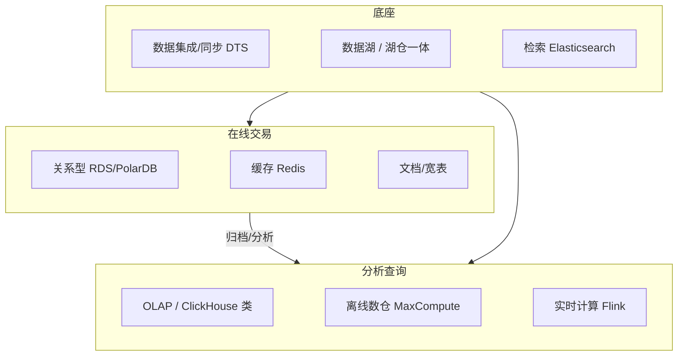

# 数据库 · 大数据

*本站生成的高清全文阅读地图；具体版本、参数与结论以正文引用的一手来源为准。*

> 数据层是系统架构里"最难替换"的一层。计算可以重买，网络可以重拉，数据库选错一次要还很多年。这一域的核心是选型框架：业务特征 → 数据模型 → 一致性要求 → 成本与运维复杂度。

## 这个域回答什么问题

- 关系型、KV、文档、列存、时序、图数据库的边界与选型依据？
- 什么时候用云数据库（RDS/PolarDB），什么时候自建？
- 离线数仓、实时计算、数据湖如何组合成一套数据平台？

## 知识框架

## 文章列表

| 文章 | 状态 | 说明 |
| --- | --- | --- |
| [数据库选型](/cloud/data/database) | 已发布 | 选型框架、读写分离、分库分表与云原生数据库 |
| [OLAP 引擎](/cloud/data/olap) | 已发布 | 五大引擎谱系机制拆解、列存与向量化、实时湖仓与选型工程 |
| [大数据体系](/cloud/data/bigdata) | 已发布 | 离线/实时/湖仓一体的典型架构与取舍 |

## 2026-09-26 版本与选型更新

### PostgreSQL：区分测试版与生产版本

[PostgreSQL 19 Beta 4](https://www.postgresql.org/about/news/postgresql-19-beta-4-released-3386/) 于 2026-09-24 发布，公告将 RC 与正式版安排描述为后续计划；不能因为已有 19 版文档，就把它写成 GA。生产迁移先确认受支持版本、扩展兼容、驱动、备份恢复和回滚方法。Beta 适合隔离环境验证，不作为默认生产建议。

### 一致性与向量检索按功能核对

DynamoDB 全局表区分 MREC 与 MRSC，不能简单归为“最终一致”；关系型数据库也不能仅凭 VECTOR 类型就认定具有完整 ANN 索引。按索引类型、过滤、召回、更新与运维要求选型，详见[数据库机制与选型](/cloud/data/database)。没有统一的“十亿向量才值得专用引擎”门槛。

### 湖格式：规范、实现、互操作分开看

[Iceberg 规范](https://iceberg.apache.org/spec/)定义表格式能力，某个引擎能够读表不代表支持同样的写入、删除向量、类型和并发提交。REST Catalog 统一接口也不能消除版本与授权差异。升级前保留“引擎版本 × 格式版本 × 读写操作”兼容矩阵，不能把单项 benchmark 的提升倍数当作普遍保证。

## 精选资源

> 筛选标准：官方与一手来源优先，近两年内容优先，经典明确标注。更新于 2026-09-01。

### 数据库

- [Amazon Aurora: Design considerations](https://www.amazon.science/publications/amazon-aurora-design-considerations-for-high-throughput-cloud-native-relational-databases) — 云原生数据库存算分离奠基论文，"日志即数据库"思想源头（2017 · 论文）
- [The lakebase architecture — Neon Docs](https://neon.com/docs/introduction/architecture-overview) — Serverless Postgres 存算分离架构官方详解（2026 · 官方文档）
- [Redis 8 GA: Fast, scalable, and feature-rich](https://redis.io/blog/redis-8-ga/) — Redis 8 官方发布：性能优化与 Vector Sets（2025 · 官方文档）
- [美团万亿级 KV 存储架构与实践](https://tech.meituan.com/2020/07/01/KV-Squirrel-Cellar.html) — 自研 KV 存储演进与一线踩坑复盘（2020 · 工程博客）

### 分析引擎

- [ClickHouse — Lightning Fast Analytics for Everyone (PVLDB Vol.17)](https://www.vldb.org/pvldb/vol17/p3731-schulze.pdf) — ClickHouse 首篇官方论文，列存与向量化执行全景（2024 · 论文）
- [Slash your cost by 90% with Apache Doris 存算分离](https://doris.apache.org/blog/doris-compute-storage-decoupled/) — 存算分离的成本、弹性与负载隔离设计（2025 · 工程博客）

### 大数据计算与湖仓

- [Apache Flink 2.0.0: A new Era of Real-Time Data Processing](https://flink.apache.org/2025/03/24/apache-flink-2.0.0-a-new-era-of-real-time-data-processing/) — Flink 2.0 官方发布：API 变更与流批一体方向（2025 · 官方文档）
- [Apache Spark 4.0.0 Release Notes](https://spark.apache.org/releases/spark-release-4-0-0.html) — Spark 4.0 发布说明：VARIANT、ANSI 模式与迁移要点（2025 · 官方文档）
- [什么是 MaxCompute](https://help.aliyun.com/zh/maxcompute/product-overview/what-is-maxcompute) — Serverless 离线数仓架构与场景（2026 · 官方文档）
- [Spec — Apache Iceberg](https://iceberg.apache.org/spec/) — 湖仓表格式权威规范（2025 · 官方文档）
- [vivo 基于 Paimon 的湖仓一体架构设计优化与迁移](https://developer.aliyun.com/article/1656030) — 湖仓一体落地复盘：选型、优化与迁移（2025 · 工程博客）

### 经典

- [Vonng/ddia —《数据密集型应用系统设计》中文翻译](https://github.com/Vonng/ddia) — 数据系统架构公认经典的中文开源翻译（2017 · 开源项目）

## 一句话入门

数据库选型的本质是**为数据访问模式选最优的数据结构 + 一致性级别 + 运维形态**——先问访问模式，再谈产品。
