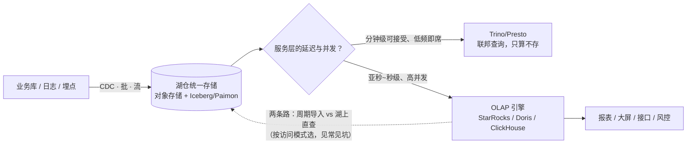
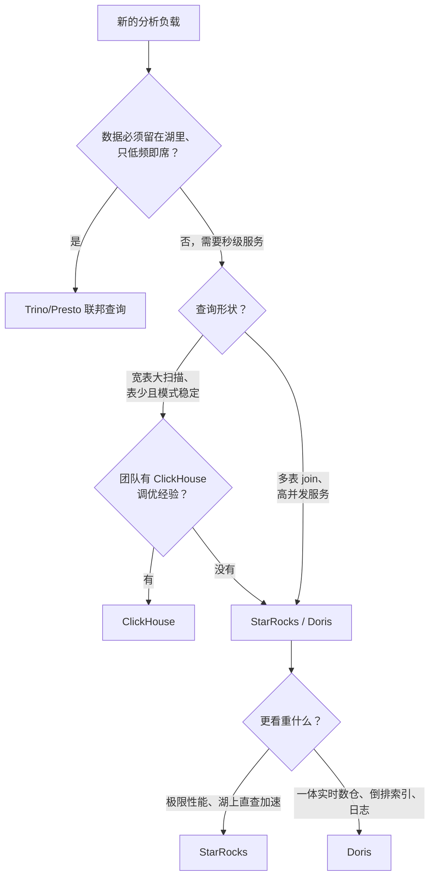

# OLAP 引擎：StarRocks、Doris 与 ClickHouse 的架构与选型

> 这篇写给正在做 OLAP 选型的数据平台架构师，和被"报表太慢、并发扛不住、湖上查询能不能直接服务业务"这类问题缠住的技术负责人。读完你应该能：说清 OLAP 与 OLTP 在访问模式、存储布局、索引策略上的本质差异；看懂 StarRocks、Doris、ClickHouse 三个 MPP 引擎和 Trino 的架构骨架与分野；并带走一张对比表、一张场景表、一张 MergeTree 表族速查表和一张决策流程图，用来给新项目选第一台引擎。

## 是什么：OLAP 不是"更快的 SQL"，而是另一种数据访问范式

OLAP（联机分析处理）这个术语出自 Codd 1993 年的定义，从诞生起就是 OLTP 的对照面：OLTP 服务"日常事务"，OLAP 服务"多维分析"。三十年过去产品换了无数代，这个分野反而更锋利。它与 OLTP 的差异不在性能参数，而在**访问模式**，由此推出完全不同的存储与索引设计：

| 维度 | OLTP（事务） | OLAP（分析） |
| --- | --- | --- |
| 访问模式 | 高并发小事务，按行读写少数几条 | 低并发大扫描，按列聚合几百万到几十亿行 |
| 存储布局 | 行存：一行连续写盘，点写友好 | 列存：同列连续，压缩比高（常见 7~10 倍），扫描只读用到的列 |
| 索引策略 | B+ 树/唯一索引，精确定位行 | 稀疏索引/物化视图/预聚合，"跳过无关数据"而非"命中行" |
| 延迟与并发 | 毫秒级事务，千~万级 QPS | 百毫秒~秒级扫描，几十~几百 QPS |
| 典型产品 | MySQL/PostgreSQL（RDS/PolarDB 类，见站内[数据库选型](/cloud/data/database)） | StarRocks / Doris / ClickHouse |

把"列存"拆开会看到三个连环红利：**只读用到的列**（分析查询通常只碰宽表里少数几列，I/O 直接降一个数量级）、**同列数据相似所以压缩比极高**（进一步减少 I/O）、**列内类型一致所以向量化执行友好**（CPU 一次处理一批值，分支预测命中率高）。而索引策略的反转最反直觉：OLTP 的 B+ 树追求"一次点中那一行"，OLAP 的稀疏索引只追求"排除掉不相关的几百万行"——精确度换内存，这在后面 ClickHouse 一节还会展开。

把 OLAP 引擎放进数据平台的经典分层里看，位置更清楚：

| 层 | 典型组件 | 回答什么 |
| --- | --- | --- |
| 采集与缓冲 | CDC / 日志采集 / Kafka 类 | 数据怎么进来 |
| 存储 | 对象存储 + Iceberg/Paimon | 数据在哪、是否可信 |
| 计算 | 批 Spark/MaxCompute 类、流 Flink 类 | 数据怎么加工 |
| 服务 | **OLAP 引擎**、检索、KV | 数据怎么被查、查得快不快 |

在数据平台里，OLAP 引擎的位置是**湖仓之上的分析服务层**。按本域导读页 2026-09 的口径：Iceberg 已是湖表格式的事实标准，竞争转向 REST Catalog 目录互操作，Paimon 2.0 把流批与 AI 多模态写进定位——**"一份湖上数据、多个引擎读写"的格局已经成立**，而 OLAP 引擎承担的就是其中"秒级、高并发服务业务"的那一格（整体分层见站内[大数据体系](/cloud/data/bigdata)）。它不替代湖，也不替代批计算，而是把湖里"查得慢但存得便宜"的数据，以导入或直查的方式变成业务可用的响应速度。

## 为什么重要

- **OLTP 扛不住分析流量是物理规律。** 在业务库上跑聚合，扫描会吃掉为事务预留的 CPU 和 I/O，交易跟着变慢。分析流量从业务库剥离、落到专用引擎，是我见过的几乎所有数据平台的第一次架构升级。
- **湖仓"存得起"但"查不快"。** 对象存储上的 Iceberg 表用 Spark/Trino 查，分钟级是常态；而大屏、风控、经营看板要的是秒级甚至亚秒。没有 OLAP 服务层，湖仓就只是便宜的文件柜。
- **它离业务价值最近。** 数据平台里被业务方直接感知的，不是湖格式也不是调度系统，而是"看板快不快、数准不准"。OLAP 层是数据团队的脸面，也是最容易背锅的一层——所以它的选型必须从访问模式出发，而不是从跑分出发。
- **引擎选型决定未来三年的成本与运维形态。** 存算一体还是分离、自建还是托管、导入还是湖上直查——这些决定一旦做了，迁移成本远高于计算框架。这也是为什么我把这一篇和[数据库选型](/cloud/data/database)放在一起读：先定访问模式，再谈产品。
- **引擎层是"数据平台 AI 化"最先落地的地方。** 特征低延迟服务、混合检索、语料筛选，AI 管线正在复用 OLAP 的宽表扫描与高并发服务能力；Doris 4.x 把向量检索写进产品定位、ClickHouse 在 26.x 持续加码向量与全文索引，都是这个信号（检索侧的整体框架见站内 [RAG 架构设计](/ai/application/rag-architecture)）。

## 架构与原理

先看 OLAP 在数据平台里的位置和第一个决策点——**服务层要不要、以及怎么加速湖上数据**：

三个引擎骨架都是 MPP（大规模并行处理）：SQL 进来后由前端节点做解析和优化，拆成子任务分发到各存储/计算节点，每个节点只扫自己那份数据分片，中间结果经 shuffle 汇总——**并行度的上限就是数据分片数的上限**，这是后面所有容量规划的起点。MPP 的性格是"快但娇气"：所有节点同步推进、最慢的节点决定整体延迟（木桶效应），所以它天然适合"扫描大、中间结果小"的分析查询，而不适合把海量中间结果来回搬运的复杂多阶段任务——后者是 Spark 类批引擎的地盘。三家引擎的分歧，在于存储模型和"为谁优化"。

顺带把四家来龙去脉一段话交代清，后面选型时就不会被"同源"二字绕进去：**ClickHouse** 2012 年生于 Yandex、2016 年开源，单节点极致的基因来自搜索日志分析；**Doris** 源自百度 Palo、2017 年开源、2022 年成为 Apache 顶级项目；**StarRocks** 2020 年由 Doris 核心创建者分叉创立，商业化公司与社区并行；**Trino** 则是 2019 年从 Presto 分叉的另一支。同源意味着上手经验可以迁移，不意味着能力清单可以互抄。

### StarRocks：FE/BE 双形态，把 MPP 性能与湖仓直查都做到前排

StarRocks 官方文档把架构描述得极其克制：整个系统只有两类组件——FE 与 BE/CN，不依赖任何外部组件。FE（Frontend）负责元数据管理、客户端连接、查询规划与调度，元数据用 BDB JE 全量常驻内存、节点间以 Raft 协议同步，分 leader/follower/observer 三种角色；BE（Backend）负责数据存储与 SQL 执行，**全向量化执行引擎 + CBO 优化器**是它性能的底座。数据模型上，除了明细和聚合模型，我最常用的是**主键模型（Primary Key）**：面向 CDC 高频 upsert 和部分列更新，靠内存/磁盘上的持久化索引避免"先删后写"，实时更新场景下比传统的 Unique 模型快一个身位。

*图源：StarRocks 官方文档（[Architecture | StarRocks](https://docs.starrocks.io/docs/introduction/Architecture/)，访问日期 2026-09-04）*

读图要点：FE 以 Raft 组独立于 BE 存在，元数据通路与数据通路物理分开；图中 BE 的多副本意味着"用磁盘换可用性与读并发"——这正是一体形态的成本侧。

存算一体追求极限延迟，但扩缩容要搬数据。于是 StarRocks 另有 **shared-data（存算分离）形态**：BE 换成只算和缓存热数据的 CN（Compute Node），数据落在 S3/GCS/MinIO 类对象存储，**加减 CN 不需要重平衡数据**——弹性这一局补齐了。一个集群能在两种形态间按负载挑，是它架构上最务实的地方。

*图源：StarRocks 官方文档（[Architecture | StarRocks](https://docs.starrocks.io/docs/introduction/Architecture/)，访问日期 2026-09-04）*

读图要点：单一数据源下沉到对象存储，CN 只持缓存——图上的弹性边界（CN 可随意加减）就是选型时的成本边界。

**物化视图是 StarRocks 的另一张牌**，分两种：同步物化视图随基表写入自动维护，只覆盖单表简单聚合，但查询改写完全透明；异步物化视图按周期刷新，可建在多表 join 甚至外部湖表之上，支持分区级增量刷新和自动查询改写。我的用法是：**同步视图当"免费索引"，异步视图当"受控的预计算层"**——后者必须有刷新周期和责任人，否则就是下一个口径事故现场（见常见坑）。

湖仓侧，StarRocks 通过 external catalog 对 **Iceberg/Paimon/Hudi 湖上直查**，再用异步物化视图把热点湖表加速到本地查询的速度——"直查兜底、物化视图加速"是我目前给湖仓配服务层的默认组合。导入侧，Stream Load/Routine Load 原生接 Kafka 与文件批，Flink connector 做 CDC 入仓的 exactly-once。我的一条经验：**OLAP 的实时性上限往往不由引擎决定，而由导入链路的攒批与反压决定**——三条引擎都怕逐条小批量写，ClickHouse 更是明确拒绝高频小批（要么 async insert，要么外部攒批）。版本口径（2026-09 核实）：最新发布线 4.1，稳定维护线 3.5。

### Apache Doris：同根同源，走"一体化实时数仓 + 湖仓"路线

先说关系：StarRocks 由原百度 Palo 团队于 2020 年前后从 **Apache Doris 分叉**而出，两者共享 FE/BE 命名、MPP 骨架和 MySQL 协议兼容这套基因，之后分头演进——StarRocks 更强调极限性能与湖仓直查，Doris 更强调**一体化实时数仓**：一套引擎同时接住实时导入、日志分析和联邦查询，减少"一个需求引一套系统"的碎片化。对中小团队，这种"All in One"的吸引力是真实的。

存算分离方面，Doris 自 3.0 起提供分离模式，官方博客把它拆成三层：**共享存储层**（对象存储持久化，成本与可靠性交给成熟存储）、**计算组**（无状态计算节点，本地盘做高速缓存，每个查询在单一计算组内执行，组间物理隔离）、**元数据服务**（独立可扩展）。注意对照一体形态：2.x 的 Workload Group 只提供软隔离，官方博客也承认只有分离形态的计算组才做到物理隔离——这类坦诚的边界声明，值得在评审时原文引用。官方对分离模式的成本叙事是"大规模冷数据场景成本降约 90%"——我对其具体数字保持经验性怀疑，但"存算一体保延迟、存算分离保成本"的双形态策略本身是成立的。版本口径（2026-09 核实）：最新发布线 4.1.x。

*图源：Apache Doris 官方博客（[Slash your cost by 90% with Apache Doris Compute-Storage Decoupled Mode](https://doris.apache.org/blog/doris-compute-storage-decoupled/)，访问日期 2026-09-04）*

读图要点：多个计算组共享同一份共享存储与元数据服务——"隔离靠加组、不靠拆库"，这是它与传统多集群方案的本质区别，也是多租户硬隔离的答案。

Doris 差异化里我最有体感的是 **2.x 起内置的倒排索引**：在列存之上对文本/标签列建倒排，`MATCH` 类查询不必全表扫，日志检索、标签圈选这类原本要引一套 Elasticsearch 的场景，多数可以在数仓内闭环。4.x 又沿这条路加了向量检索（4.1 已支持 Iceberg V3 读写、向量检索扩展到十亿级），"分析 + 检索 + AI 混合负载"是它当前最鲜明的旗号。判断边界留在这里：如果存量日志链路已经在 Elasticsearch 上跑得稳、团队技能栈也成熟，不必为"收敛"而收敛；但新建一条日志分析链路时，"Doris 一份存储同时出报表和检索"通常是总成本更低的路。

### ClickHouse：单表极致与 MergeTree 表族，"引擎即业务契约"

ClickHouse 的第一篇官方论文（PVLDB Vol.17）把它的哲学讲得很透：**为硬件极限优化的列存 + 向量化执行**，加上一个刻意"不精确"的索引设计——**稀疏主键索引**只记录每个粒度（granule，默认 8192 行）首行的主键值，非唯一、只用于跳过无关粒度、不定位行。举例：主键是时间列时，查"某个小时的订单"可以跳过其余时间的粒度块；但查"某个订单号"它帮不上忙，那是 OLTP 索引的活。这是用"索引内存极小"换"扫描略多"的工程取舍。

主键只管前缀列，非主键列的裁剪要靠**数据跳过索引**（minmax/set/bloom filter）和 **projection** 补上"二次裁剪"——这两个是 ClickHouse 性价比最高的调优手段，但都要求对数据分布有判断，属于经验活。

*图源：ClickHouse PVLDB 论文 Figure 2（[ClickHouse: Lightning Fast Analytics for Everyone](https://www.vldb.org/pvldb/vol17/p3731-schulze.pdf)，访问日期 2026-09-04）*

读图要点：存储层三列引擎（MergeTree 族/特殊用途/虚拟）分别对应"自有数据、特殊结构、外部数据"三种来源；底部的 Distributed + Keeper 就是它集群层的全部故事——没有中心化的存储调度，协调只做元数据与副本同步。

存储核心是 **MergeTree 表族**：写入先落成不可变的 part，后台异步 merge 成大 part——类 LSM 的思路，但 merge 的"语义"由建表时选的引擎族决定。**选错引擎族，数据就再也"合不对"**，这是 ClickHouse 最陡的学习曲线：

| 引擎族 | 合并语义 | 典型场景 |
| --- | --- | --- |
| MergeTree | 无特殊语义，原样合并 | 明细事实表（默认选择） |
| ReplacingMergeTree | 同主键保留最新版本 | CDC 去重导入（需配合查询侧去重或 finalize） |
| AggregatingMergeTree | 同主键按聚合函数合并 | 预聚合报表、物化视图底座 |
| SummingMergeTree | 同主键数值列求和 | 计数/金额类汇总 |
| CollapsingMergeTree | 按 sign 列正负抵消 | 行级更新的状态表 |

集群侧，副本用 ReplicatedMergeTree + **ClickHouse Keeper**（官方自研、协议兼容 ZooKeeper 的协调服务）同步；分片靠 **Distributed 表引擎**——它只是一层路由，不存数据，所以"分片键"选错导致的倾斜没有引擎兜底，扩容也不自动重平衡。把拓扑一句话讲清：**分片持有不同数据，副本持有相同数据**——分片数换写入与存储的规模，副本数换可用性与读并发，两个旋钮各管各的；跨分片的 JOIN 与聚合靠各分片本地算、发起节点归并，所以"分片键不对齐的 join"会把网络打成广播。论文 Figure 2 里还能看到它的集成层：虚拟表引擎对接外部 DBMS、数据湖/对象存储、消息系统——**ClickHouse 也能查湖，但它的主场永远是把数据吃进 MergeTree 之后**。版本口径（2026-09 核实）：26.8 LTS（2026-08 发布）。

### Trino / Presto：只算不存的联邦查询层

Trino 与 Presto 同源：2012 年 Meta 开源 Presto，2019 年核心创建者出走成立 Trino（原名 PrestoSQL），两者此后分头演进，SQL 方言与 connector 生态大体兼容但已不可混称。Trino 没有自己的存储：coordinator 分派、worker 通过 **connector 直连各类数据源**（湖表、关系库、KV、消息队列），MPP 全内存流水线执行，中间结果不落盘、在 worker 间流式交换。它的定位是**联邦即席查询**——"数据不动、计算过去"，适合湖上低频探索和多源 join；代价是不维护索引和物化状态，**高并发、亚秒级服务不是它的战场**。让它和 OLAP 引擎分工：Trino 做"湖的查询入口"，OLAP 做"业务的服务入口"。也别因为"只算不存"就放养：生产上要在前面加并发与路由治理（Trino Gateway 类）、用资源组和内存配额挡住单条失控即席——它的正确姿势是数据工程师与分析师的查询入口，不是业务系统的服务入口。版本口径（2026-09 核实）：Trino 483（2026-07）。

## 实践与选型

下面两张表是我的第一轮过滤器：场景表定"用它干什么"，对照表定"用谁"；随后用决策流程图把"谁来运维、什么形态"也定下来。

### 四引擎对照表

| 维度 | StarRocks | Apache Doris | ClickHouse | Trino |
| --- | --- | --- | --- | --- |
| 架构形态 | FE + BE/CN；存算一体或分离（shared-data） | FE + BE；一体或分离（3.0+，计算组） | 无中心单节点/分片集群 + Keeper | Coordinator + Worker，无自有存储 |
| 湖仓能力 | Iceberg/Paimon/Hudi 直查 + 异步物化视图加速 | external catalog + Iceberg V3 读写（4.1） | 集成层直查湖/对象存储 | 联邦生态最全，湖上即席的事实标准 |
| 并发与延迟 | 高并发、亚秒级服务层见长 | 高并发、实时数仓均衡 | 单查询极致，高并发偏弱 | 秒~分钟级，并发低 |
| 运维复杂度 | 中（双形态、物化视图需治理） | 中（分离模式降低存储运维） | 较高（分片键、merge、内存调优吃经验） | 低（无存储），但资源治理不能省 |
| 托管形态 | 云上 EMR Serverless StarRocks 等 | VeloDB/SelectDB Cloud 等 | ClickHouse Cloud | 云上 EMR/Starburst 等 |

### 典型场景选型表

| 典型场景 | 首选 | 理由与替代 |
| --- | --- | --- |
| 实时报表/高并发服务层 | StarRocks 或 Doris | 物化视图 + 主键模型成熟；二者择一主要看团队手感与生态 |
| 日志/行为明细分析 | ClickHouse 或 Doris | CH 压缩比与单表扫描极致；Doris 倒排索引对 SQL 用户更友好 |
| 湖仓联邦即席分析 | Trino | 只算不存、connector 全；要亚秒再叠加 OLAP 直查/物化视图 |
| 超大规模低成本明细 | ClickHouse / Doris 分离模式 | 对象存储打底 + 存算分离弹性 |
| 高并发点查明细 | 主键模型（StarRocks/Doris） | 真正点查需求大时回到 OLTP/KV 更诚实 |
| AI 特征/检索服务 | Doris 4.x / ClickHouse 向量与全文索引 | 新兴方向；成熟度要求高时按站内 RAG 框架评估 |

选型决策流程——我给新项目画的第一张判断图：

### 数据模型速览：先选存储语义，再看性能

性能之前是语义：各引擎的表模型决定"更新与聚合"在写入和合并时如何处理，选错模型，后面一辈子都在查询侧还债。

| 引擎 | 表模型 | 更新语义 | 适合 |
| --- | --- | --- | --- |
| StarRocks | 明细 / 聚合 / 主键 | 主键模型：持久化索引 + 行级 upsert、部分列更新 | 高频 CDC 更新 + 高并发服务 |
| Doris | 明细 / 聚合 / Unique | Unique 行级更新，分离模式降低更新成本 | 一体化实时数仓、日志与检索 |
| ClickHouse | MergeTree 表族 | 更新=合并语义（Replacing/Collapsing），异步最终一致 | 追加为主，更新靠查询侧或批次 |

划线：**前两者把更新当一等公民，ClickHouse 把更新当例外路径**。业务核心是"高频行级修正"时从前两者里选；"追加为主、偶尔修正"时 ClickHouse 的成本优势才出得来。

### 导入链路与延迟经验值

| 导入方式 | 典型组合 | 边界 |
| --- | --- | --- |
| CDC 实时入仓 | Flink + 官方 connector → StarRocks/Doris | exactly-once 依赖 connector 与引擎事务两端，别只信一头 |
| 消息队列消费 | Routine Load（Kafka） | 攒批默认值通常够用，单批过大要调内存与反压 |
| 批/文件导入 | Broker Load / Spark connector / 湖表 INSERT INTO SELECT | 别拿它跑高频微批，批就该有批的样子 |
| ClickHouse 写入 | 大批次 + async insert | 高频小批是禁区，写入形状要服从引擎假设 |

容量评审时我用的延迟经验值（量级口径，随数据量与硬件浮动）：服务层亚秒~秒级是三家 MPP 引擎的常态；ClickHouse 单宽表大扫描秒~十秒级；Trino 湖上即席十秒~分钟级。**跨档时先改架构，不是先调参数**——把分钟级查询优化到"快一点的分钟级"，不如把它换成物化视图后的秒级。

并发侧的经验值同样先给量级：

| 负载形态 | 并发量级（经验值） | 说明 |
| --- | --- | --- |
| 报表服务（带物化视图/缓存） | 百~千 QPS | 并发上限取决于隔离与缓存，不取决于引擎名 |
| 交互式 BI 即席 | 几十 QPS | 三家 MPP 同档，差距在数据形状匹配度 |
| 大表即席 / 湖上直查 | 个位数 | 延迟下限由扫描量与缓存命中决定 |
| 点查（主键模型） | 千 QPS 级 | 再往上就回到 OLTP/KV，别硬撑 |

### 自建与托管、一体与分离：两个高频追问

- **自建还是托管？** 判断线和大数据域一致：有没有专职平台团队。OLAP 引擎的运维量集中在版本升级、compaction/merge 治理、容量与隔离，三人以下的数据团队我建议直接上托管形态（EMR Serverless StarRocks、SelectDB/VeloDB Cloud、ClickHouse Cloud 类），把内核运维外包、把建模和口径留在自己手里。
- **存算一体还是分离？** 一体为极限延迟和可预测性付硬件钱，分离为弹性和存储成本付缓存治理的钱。**延迟敏感且负载平稳选一体，数据量大、冷热分明、要弹性选分离**；同一集群里"热服务走一体、冷分析走分离"的组合也开始常见。

| 团队与负载形态 | 建议形态 |
| --- | --- |
| 数据团队 ≤3 人，负载为报表 + 部分实时 | 全托管（EMR Serverless StarRocks / SelectDB / ClickHouse Cloud 类） |
| 有专职平台团队，规模大且负载平稳 | 自建一体形态，摊薄硬件成本 |
| 数据量大、冷热分明、弹性需求明显 | 分离形态（自建或托管均可） |
| 多租户且要求硬隔离 | 分离计算组 / 独立集群 |

几条带边界的经验判断：

- **性能跑分在选型里权重最低。** 三个引擎在同规格硬件上的差距，通常小于"数据形状与引擎假设是否匹配"带来的差距；我见过的多数选型争议，本质是团队技能栈之争。
- **存算分离不是免费午餐。** 缓存命中率决定延迟，冷启动和元数据开销是真实成本；它为弹性和存储成本付钱，不为极限延迟付钱。
- **Trino 与 OLAP 的分工是"湖是底线、引擎是加速"。** 先用联邦查询保证"查得到"，再按访问热度把少部分数据加速到服务层——而不是反过来全量导入。
- **三家趋同是事实，差异仍在默认值。** 到 2026 年，存算分离、湖表直查、向量检索三家都在做；但"开箱默认的强项"没变：StarRocks 的查询性能与湖上加速、Doris 的一体化与检索、ClickHouse 的单表极致与压缩。按默认值选型，别按路线图选型。

## 常见坑

下表按"我遇到得最多"排序，前两行几乎在每次平台评审里都会重现。

| 坑 | 现象 | 对策 |
| --- | --- | --- |
| 物化视图时效错觉 | 业务把异步物化视图当实时表，大屏与明细对不上数 | 交付时声明刷新周期并展示"数据截至时间"；高时效指标走明细表或湖上直查兜底 |
| 主键模型内存开销 | 高基数主键 + 高频 upsert 下，持久化索引吃内存、compaction 抖动 | 按主键基数规划索引内存，大表落盘持久化索引，控制写入批次频率 |
| 高并发与大查询混跑 | 一条大扫描打满 CPU/内存，并发报表集体超时 | 负载分池：Doris 计算组物理隔离、StarRocks 分离集群拆形态、ClickHouse 限制大查询资源或拆副本组 |
| 湖上直查与导入的取舍摇摆 | 直查慢怪引擎、导入又造成双份数据与口径漂移 | 按访问模式二分：高频亚秒=导入或物化视图加速；低频即席=直查；消灭中间态 |
| 资源隔离不足 | Workload Group 只做了软隔离，租户大查询仍影响他人 | 要硬隔离就上存算分离计算组/独立集群；隔离粒度在架构评审时定，别等事故后补 |
| ClickHouse 分片键选错 | 部分 shard 热点、join 全集群广播、扩容不匀 | 高基数键做分片键，高频 join 键同分布；倾斜先在系统表确认 Top key 再动 |
| ReplacingMergeTree 当实时去重用 | 查询结果偶尔出现重复行，业务质疑数据质量 | 合并是异步的，查询侧加 FINAL 或按版本去重，或导入端就保证幂等——引擎语义要在交付文档里写清 |
| 拿 OLAP 当 OLTP 点查 | 高并发主键点查把分析集群打垮，延迟还不稳定 | 点查走主键模型 + 行缓存，或老实回到 OLTP/KV；OLAP 的稀疏索引天生不为点查设计 |
| 迷信跑分选型 | POC 第一名的引擎上生产后最慢 | POC 用自己的数据形状与查询混合、跑并发混载而非单条查询；跑分只用来校准量级，不决定名次 |

收束一句：**OLAP 选型不是选"最好的引擎"，而是让引擎的默认强项对上你的数据形状**——更新多选主键模型系、追加海量选 ClickHouse、联邦即席交给 Trino；形态上再叠"托管优先、按需分离"。引擎可以换，数据模型与口径难迁移，选型时花在数据形状上的时间，应多于花在跑分上的时间。

## 参考资料

<Refs>

- [StarRocks Documentation — Architecture](https://docs.starrocks.io/docs/introduction/Architecture/)（访问日期 2026-09-04）
- [StarRocks version 4.1 Release Notes](https://docs.starrocks.io/releasenotes/release-4.1/)（访问日期 2026-09-04）
- [Apache Doris — Slash your cost by 90% with Compute-Storage Decoupled Mode](https://doris.apache.org/blog/doris-compute-storage-decoupled/)（访问日期 2026-09-04）
- [Apache Doris — Core Release Notes](https://doris.apache.org/releases/core/)（访问日期 2026-09-04）
- [ClickHouse: Lightning Fast Analytics for Everyone (PVLDB Vol.17)](https://www.vldb.org/pvldb/vol17/p3731-schulze.pdf)（访问日期 2026-09-04）
- [ClickHouse Documentation — Changelog 2026](https://clickhouse.com/docs/resources/changelogs/oss/2026)（访问日期 2026-09-04）
- [Trino Documentation — Release notes](https://trino.io/docs/current/release.html)（访问日期 2026-09-04）
- 站内相关：[大数据体系](/cloud/data/bigdata) · [数据库选型](/cloud/data/database)

**图片来源**：StarRocks shared-nothing/shared-data 架构图取自官方文档 Architecture 页（[docs.starrocks.io](https://docs.starrocks.io/docs/introduction/Architecture/)）；Apache Doris 存算分离三层架构图取自官方博客（[doris.apache.org/blog/doris-compute-storage-decoupled](https://doris.apache.org/blog/doris-compute-storage-decoupled/)）；ClickHouse 高层架构图取自 PVLDB Vol.17 论文 Figure 2（[vldb.org/pvldb/vol17/p3731-schulze.pdf](https://www.vldb.org/pvldb/vol17/p3731-schulze.pdf)）。均于 2026-09-04 访问并下载本地。

</Refs>
