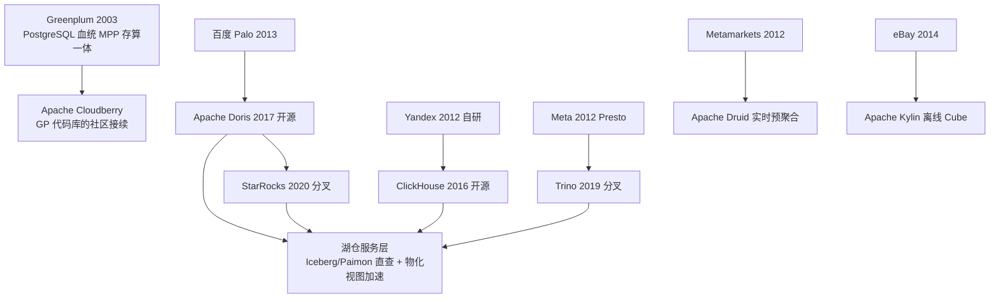
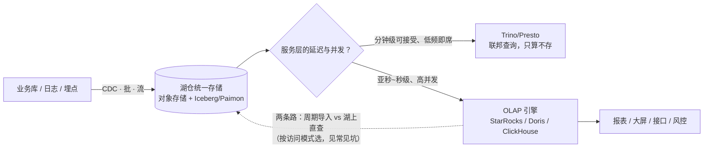
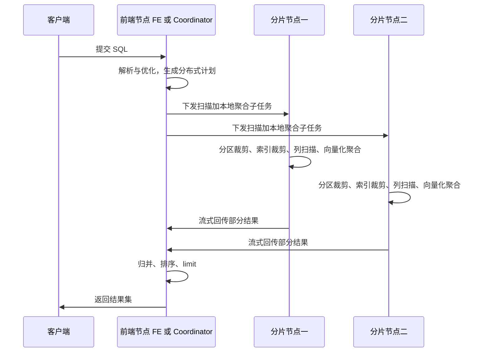
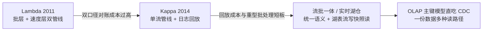
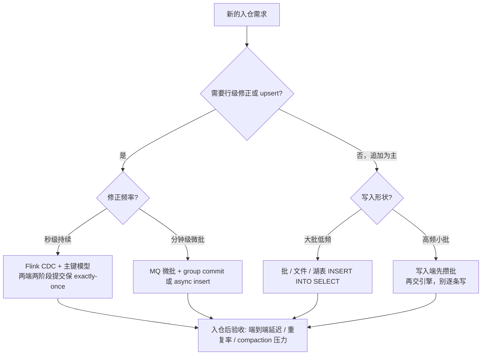
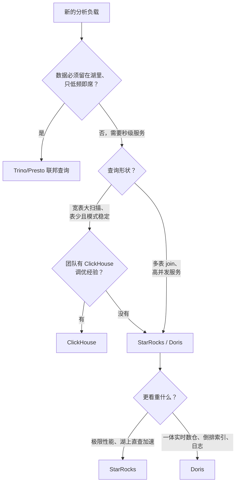

# OLAP 引擎：谱系机制拆解与选型工程

> 这篇写给正在做 OLAP 选型的数据平台架构师，和被"报表太慢、并发扛不住、湖上查询能不能直接服务业务"这类问题缠住的技术负责人。全文沿一条主线展开：**先按存储模型与计算模型把 OLAP 引擎分成五条谱系（MPP 存算一体、预聚合 Cube、大宽表明细、联邦计算、湖仓服务层），再逐层拆列存机制（压缩编码、稀疏索引、向量化执行、物化视图），然后把实时化演进（Lambda → Kappa → 流批一体）与 CDC 入仓链路讲透，最后落到场景 × 数据量 × 团队能力的选型决策与成本工程**。读完你应该能：说清 OLAP 与 OLTP 在访问模式、存储布局、索引策略上的本质差异；看懂 StarRocks、Doris、ClickHouse、Druid、Trino 各自"为谁优化"；并带走一张谱系表、一张机制对照表、多张场景决策表和一棵选型决策树，用来给新项目选第一台引擎。

## 是什么：OLAP 不是"更快的 SQL"，而是另一种数据访问范式

OLAP（联机分析处理）这个术语出自 Codd 1993 年的定义，从诞生起就是 OLTP 的对照面：OLTP 服务"日常事务"，OLAP 服务"多维分析"。三十年过去产品换了无数代，这个分野反而更锋利。它与 OLTP 的差异不在性能参数，而在**访问模式**，由此推出完全不同的存储与索引设计：

| 维度 | OLTP（事务） | OLAP（分析） |
| --- | --- | --- |
| 访问模式 | 高并发小事务，按行读写少数几条 | 低并发大扫描，按列聚合几百万到几十亿行 |
| 存储布局 | 行存：一行连续写盘，点写友好 | 列存：同列连续，压缩比高（常见 7~10 倍），扫描只读用到的列 |
| 索引策略 | B+ 树/唯一索引，精确定位行 | 稀疏索引/物化视图/预聚合，"跳过无关数据"而非"命中行" |
| 延迟与并发 | 毫秒级事务，千~万级 QPS | 百毫秒~秒级扫描，几十~几百 QPS |
| 典型产品 | MySQL/PostgreSQL（RDS/PolarDB 类，见站内[数据库选型](/cloud/data/database)） | StarRocks / Doris / ClickHouse / Druid / Trino |

把"列存"拆开会看到三个连环红利：**只读用到的列**（分析查询通常只碰宽表里少数几列，I/O 直接降一个数量级）、**同列数据相似所以压缩比极高**（进一步减少 I/O）、**列内类型一致所以向量化执行友好**（CPU 一次处理一批值，分支预测命中率高）。而索引策略的反转最反直觉：OLTP 的 B+ 树追求"一次点中那一行"，OLAP 的稀疏索引只追求"排除掉不相关的几百万行"——精确度换内存，这在后面列存机制一节还会展开。

把 OLAP 引擎放进数据平台的经典分层里看，位置更清楚：

| 层 | 典型组件 | 回答什么 |
| --- | --- | --- |
| 采集与缓冲 | CDC / 日志采集 / Kafka 类 | 数据怎么进来 |
| 存储 | 对象存储 + Iceberg/Paimon | 数据在哪、是否可信 |
| 计算 | 批 Spark/MaxCompute 类、流 Flink 类 | 数据怎么加工 |
| 服务 | **OLAP 引擎**、检索、KV | 数据怎么被查、查得快不快 |

在数据平台里，OLAP 引擎的位置是**湖仓之上的分析服务层**。按本域导读页 2026-09 的口径：Iceberg 已是湖表格式的事实标准（1.11.x 线上版本，V3 规范的行级血缘等能力仍在快速落地），竞争转向 REST Catalog 目录互操作，Paimon 2.0（2026-08 发布）把流批与 AI 多模态写进定位——**"一份湖上数据、多个引擎读写"的格局已经成立**，而 OLAP 引擎承担的就是其中"秒级、高并发服务业务"的那一格（整体分层见站内[大数据体系](/cloud/data/bigdata)）。它不替代湖，也不替代批计算，而是把湖里"查得慢但存得便宜"的数据，以导入或直查的方式变成业务可用的响应速度。

## 为什么重要

- **OLTP 扛不住分析流量是物理规律。** 在业务库上跑聚合，扫描会吃掉为事务预留的 CPU 和 I/O，交易跟着变慢。分析流量从业务库剥离、落到专用引擎，是我见过的几乎所有数据平台的第一次架构升级。
- **湖仓"存得起"但"查不快"。** 对象存储上的 Iceberg 表用 Spark/Trino 查，分钟级是常态；而大屏、风控、经营看板要的是秒级甚至亚秒。没有 OLAP 服务层，湖仓就只是便宜的文件柜。
- **它离业务价值最近。** 数据平台里被业务方直接感知的，不是湖格式也不是调度系统，而是"看板快不快、数准不准"。OLAP 层是数据团队的脸面，也是最容易背锅的一层——所以它的选型必须从访问模式出发，而不是从跑分出发。
- **引擎选型决定未来三年的成本与运维形态。** 存算一体还是分离、自建还是托管、导入还是湖上直查——这些决定一旦做了，迁移成本远高于计算框架。这也是为什么我把这一篇和[数据库选型](/cloud/data/database)放在一起读：先定访问模式，再谈产品。
- **引擎层是"数据平台 AI 化"最先落地的地方。** 特征低延迟服务、混合检索、语料筛选，AI 管线正在复用 OLAP 的宽表扫描与高并发服务能力；Doris 4.x 把向量检索写进产品定位、ClickHouse 在 26.x 持续加码向量与全文索引、ChatBI 类产品把 NL2SQL 的执行层压在 OLAP 上，都是这个信号（检索侧的整体框架见站内 [RAG 架构设计](/ai/application/rag-architecture)）。

## 引擎谱系总览：五条路线一张图

选 OLAP 引擎最容易被产品名绕晕，我的习惯是先问三个问题：**数据怎么存（存储模型）、查询怎么算（计算模型）、为哪种负载优化（适用边界）**。按这三问，市面上所有产品都能归进五条谱系：



| 谱系 | 代表 | 存储模型 | 计算模型 | 擅长的负载 | 不擅长的负载 |
| --- | --- | --- | --- | --- | --- |
| MPP 存算一体 | Greenplum/Cloudberry、StarRocks、Doris | 本地列存 + 多副本，数据分片到节点 | MPP：计划下推、分片内本地算、shuffle 归并 | 多表 join、高并发服务层、实时数仓 | PB 级冷数据的存储成本 |
| 预聚合 Cube | Druid、Kylin | 不可变 segment/cuboid + 位图索引 | 查询只读预聚合结果，位图交并做布尔过滤 | 固定维度的实时看板、秒级 top-N | 维度组合爆炸、明细回溯 |
| 大宽表明细 | ClickHouse | MergeTree 族列存 part，稀疏索引 | 单节点极致向量化 + 分片本地算 | 超宽明细大扫描、日志、压缩比敏感 | 高并发小查询、复杂多表 join |
| 联邦计算 | Trino/Presto、Spark SQL | 无自有存储，connector 直读外部 | 全内存流水线 MPP / 分批 DAG | 湖上即席、多源 join、数据不动 | 亚秒服务、高并发点查 |
| 湖仓服务层 | StarRocks/Doris/Trino + Iceberg/Paimon | 湖表为源、本地缓存或物化视图为加速 | 直查兜底 + 预计算加速双通道 | "一份数据多种读法"的平台形态 | 极端延迟下仍需导入 |

**MPP 存算一体是这一切的地基，血统来自 Greenplum。** Greenplum 2003 年把 PostgreSQL 改造成 MPP 数据库：coordinator 出计划、segment 节点各自存各自的分片并本地执行，节点间走专用 interconnect 交换中间结果——今天 StarRocks/Doris 的 FE/BE 骨架与它同构。这条血统后来的商业变迁（EMC → Pivotal → VMware → Broadcom，2024 年起 Broadcom 收紧免费分发）催生了社区接续者 **Apache Cloudberry**（进入 Apache 孵化器，代码库源自 Greenplum 7，2026-09 仍在活跃提交）。我提这段历史不是为了怀旧，而是说明一件事：**MPP 存算一体这个范式跑了二十多年依然是企业数仓的默认形态**，新引擎的创新都发生在"存储放哪、更新怎么做、湖怎么接"这三个变量上，而不是推翻 MPP 本身。

MPP 的性格是"快但娇气"：SQL 进来后由前端节点做解析和优化，拆成子任务分发到各存储/计算节点，每个节点只扫自己那份数据分片，中间结果经 shuffle 汇总——**并行度的上限就是数据分片数的上限**，这是后面所有容量规划的起点。所有节点同步推进、最慢的节点决定整体延迟（木桶效应），所以它天然适合"扫描大、中间结果小"的分析查询，而不适合把海量中间结果来回搬运的复杂多阶段任务——后者是 Spark 类批引擎的地盘。

再看 OLAP 在数据平台里的位置和第一个决策点——**服务层要不要、以及怎么加速湖上数据**：



顺带把几家来龙去脉一段话交代清，后面选型时就不会被"同源"二字绕进去：**ClickHouse** 2012 年生于 Yandex、2016 年开源，单节点极致的基因来自搜索日志分析；**Doris** 源自百度 Palo、2017 年开源、2022 年成为 Apache 顶级项目；**StarRocks** 2020 年由 Doris 核心创建者分叉创立，商业化公司与社区并行；**Trino** 则是 2019 年从 Presto 分叉的另一支；**Druid** 2012 年出自 Metamarkets、**Kylin** 2014 年出自 eBay，两者代表预聚合路线的两个时代。同源意味着上手经验可以迁移，不意味着能力清单可以互抄。

## 列存机制深拆：压缩、稀疏索引、向量化与物化视图

这一节是全文的"原理地基"。五条谱系的差异再大，底层吃的都是这四样红利；看懂它们，后面每个引擎的设计取舍都能自己推出来。

### 列存为什么快：一笔 I/O 与 CPU 的账

用一笔量级账说明列存的三段红利（经验量级，随表宽与查询形状浮动）：一张 200 列的明细宽表，典型分析查询只碰其中 8~12 列。行存下每行都要整行读入再丢弃无关字段，有效数据占比约 5%；列存只读用到的列，**I/O 先降约 20 倍**。同列数据类型一致、取值相似，字典/RLE/delta 编码叠加通用压缩后，落盘体积通常只有原始数据的 1/7~1/10，**I/O 再降一个量级**。最后，列内连续的同类型数据让 CPU 可以按批处理并吃到 SIMD 指令与缓存行红利——这就是向量化执行的前提。三段相乘，列存对行存的优势在分析负载上是百倍级，这不是优化技巧，是物理布局的差异。

| 编码 | 原理 | 对哪类数据最有效 | 工程含义 |
| --- | --- | --- | --- |
| 字典编码 | distinct 值建字典，列内存整数 ID | 低基数列：城市、状态、渠道 | 字符串列常见十倍级收益；基数失控时字典本身变大，引擎会放弃字典 |
| RLE 游程编码 | 连续相同值存"值 + 重复次数" | 排序后连续同值的列 | **排序键的直接红利**：ORDER BY/分桶键选得好，RLE 与稀疏索引同时受益 |
| Delta + 位打包 | 存相邻值差值，再按最小位宽打包 | 时间戳、自增 ID、单调指标 | 时间列几乎免费压缩；乱序写入会让差值变大、收益缩水 |
| 通用压缩 LZ4/ZSTD | 字节级熵压缩，兜底叠加在编码之上 | 所有列 | LZ4 解压速度优先（ClickHouse 默认），ZSTD 换更高压缩比但吃 CPU；冷数据值得换 ZSTD |

表中的倍数都是我所在场景的量级经验，边界写清楚：**收益取决于数据分布与排序键设计，不取决于引擎名字**。同一份日志数据，按时间排序与按用户 ID 排序，压缩比能差出数倍——这也是下一小节"排序键是调优第一旋钮"的原因。

### 稀疏索引与 data skipping：用"不精确"换"常驻内存"

ClickHouse 的第一篇官方论文（PVLDB Vol.17）把稀疏索引的哲学讲得很透：**稀疏主键索引只记录每个粒度（granule，默认 8192 行）首行的主键值**，非唯一、只用于跳过无关粒度、不定位行。下图是官方文档给出的结构：数据按 granule 切块，每个 granule 在各列文件中的偏移记为 mark，primary-idx 只存每个 granule 首行的主键列值。


*图源：ClickHouse 官方文档《Designing a sparse primary index》插图（[clickhouse.com/docs/optimize/sparse-primary-indexes](https://clickhouse.com/docs/optimize/sparse-primary-indexes)，访问日期 2026-09-05）*

读图要点：十亿行表的主键索引只有约 12 万条记录（10^9 ÷ 8192），**整个索引可以常驻内存**——这是用"裁剪粒度是 8192 行而不是 1 行"换来的。查询"某个小时的订单"时，二分 primary-idx 定位 granule 区间，读 mark 得到列文件字节偏移，只解压命中的块；但查"某个订单号"它帮不上忙，那是 OLTP 索引的活。举例：主键是时间列时范围查询可以跳过其余时间的粒度块；等值查非主键列则要靠下面这层补：

| 二次裁剪手段 | 机制 | 典型产品 | 适用 |
| --- | --- | --- | --- |
| 数据跳过索引 minmax | 每 granule 记录列的最小/最大值 | ClickHouse | 与主键顺序不一致但大致单调的列 |
| 数据跳过索引 set/bloom | 每 granule 记录取值集合或布隆指纹 | ClickHouse | 中等基数等值过滤 |
| 倒排/全文索引 | 列上建 token 倒排，match 类查询不扫全表 | Doris 2.x+、ClickHouse text index | 日志检索、标签圈选 |
| Projection | 预排序/预聚合的"表内小副本"，查询自动路由 | ClickHouse | 同一基表多种查询形状 |
| 分区裁剪 | 按时间等粗粒度物理切分，查询直接跳过分区 | 全部 | 第一道、也是最便宜的一道裁剪 |

我的排序建议：**先分区（时间），再排序键（最高频的过滤 + join 前缀列），最后才轮到跳过索引补漏**。跳过索引与 projection 是 ClickHouse 性价比最高的调优手段，但都要求对数据分布有判断，属于经验活——索引建在随机分布的列上等于白建。

### 向量化执行：为什么一次处理一批会快

行式执行器每处理一行要做一次虚函数分发、一次类型判断、若干次分支跳转，CPU 流水线经常因分支预测失败而空转。向量化执行把循环反过来：**外层遍历批次（常见 4096~8192 行一块），内层对一整块同类型连续内存做同一个运算**。收益来自三处：分支只判断一次而不是每行一次；连续内存让缓存行与预取器满负荷；固定类型数组可以直接上 SIMD 指令（AVX2/AVX-512 一条指令算 8~16 个值）。叠加列存的"只读用到的列"，同样的查询在行式引擎与向量化列存引擎之间差一个数量级是常态。这也解释了为什么三家 MPP 引擎都把"全向量化"写进架构底座（StarRocks 官方文档明确以全向量化执行引擎 + CBO 优化器为性能底座），以及为什么**自定义 UDF 一旦写不好就会把向量化打断回行式路径**——生产上 UDF 导致的性能跳水我遇到过不止一次。

### 物化视图与 rollup：把计算搬到写入侧

预聚合是 OLAP 的第三段红利：既然查询形状有限，就把聚合结果提前算好。各引擎的实现形态不同，工程含义也不同：

| 引擎 | 同步物化视图 / rollup | 异步物化视图 | 工程含义 |
| --- | --- | --- | --- |
| StarRocks | 同步 MV：随基表写入维护，单表简单聚合，查询改写完全透明 | 异步 MV：可建在多表 join 与外部湖表上，分区级增量刷新 + 自动改写 | 同步当"免费索引"，异步当"受控预计算层" |
| Doris | 同步 rollup/MV：换排序键、加聚合列 | 异步 MV：2.x 起逐步完善，支持湖表 | 与 StarRocks 同思路，治理责任在自己 |
| ClickHouse | MATERIALIZED VIEW 写入目标表（常配 AggregatingMergeTree） | 无独立异步 MV，靠 projection 与合并语义 | 预聚合是"写入时多写一张表"，查询侧要懂合并语义 |
| Druid/Kylin | 摄入即预聚合（segment/cuboid 就是物化结果） | 不适用 | 预聚合的极端形态，代价见谱系表 |

我的用法始终是：**同步视图当"免费索引"，异步视图当"受控的预计算层"**——后者必须有刷新周期和责任人，否则就是下一个口径事故现场（见常见坑）。判断边界：查询形状稳定、聚合 expensive 时物化视图收益最大；即席形状多变时物化视图覆盖率低，不如把预算投在排序键与缓存上。

## 一条查询的解剖：时间花在哪

选型争论经常停在"哪个引擎快"，而一线排障需要的是"这条查询的时间花在哪一段"。把三家 MPP 引擎的执行路径对齐看，一条分布式分析查询固定走六段：



各段的时间占比（扫描聚合型查询的经验量级，join 重的查询 shuffle 占比会显著上升）：

| 阶段 | 典型占比 | 由什么决定 | 慢了的第一个动作 |
| --- | --- | --- | --- |
| 计划与分发 | 小于 5% | 计划复杂度、元数据规模、CBO 统计信息 | 看统计信息是否过期、计划是否走了意外 join 顺序 |
| 扫描与解压 | 50%~80% | 裁剪有效性、压缩编码、缓存命中 | 看分区/索引裁剪掉了多少、缓存命中率 |
| 本地聚合 | 10%~30% | 向量化程度、是否有 UDF 打断 | 看执行计划里算子是否向量化 |
| Shuffle 与归并 | 5%~20% | 中间结果大小、网络带宽 | 看能否先聚合再 shuffle、能否下沉物化视图 |
| 排队与资源等待 | 0%~不定 | 并发隔离与配额 | 看资源组排队时间，这段最容易被误判为"引擎慢" |

这张表的用法：延迟超标时先定位段、再谈优化。**我见过太多"优化扫描"的案例，根因其实在排队段**——大查询与报表混跑时，P95 的增量几乎全部来自等待。同理，POC 里单条查询的耗时只覆盖前四段，生产上的体感还包含第五段，这是 POC 与生产差距的结构性来源（见 POC 清单）。

## 引擎族机制级拆解

### StarRocks：FE/BE 双形态，把 MPP 性能与湖仓直查都做到前排

StarRocks 官方文档把架构描述得极其克制：整个系统只有两类组件——FE 与 BE/CN，不依赖任何外部组件。FE（Frontend）负责元数据管理、客户端连接、查询规划与调度，元数据用 BDB JE 全量常驻内存、节点间以 Raft 协议同步，分 leader/follower/observer 三种角色；BE（Backend）负责数据存储与 SQL 执行，**全向量化执行引擎 + CBO 优化器**是它性能的底座。数据模型上，除了明细和聚合模型，我最常用的是**主键模型（Primary Key）**：面向 CDC 高频 upsert 和部分列更新，靠内存/磁盘上的持久化索引避免"先删后写"，实时更新场景下比传统的 Unique 模型快一个身位。


*图源：StarRocks 官方文档（[Architecture | StarRocks](https://docs.starrocks.io/docs/introduction/Architecture/)，访问日期 2026-09-04）*

读图要点：FE 以 Raft 组独立于 BE 存在，元数据通路与数据通路物理分开；图中 BE 的多副本意味着"用磁盘换可用性与读并发"——这正是一体形态的成本侧。

存算一体追求极限延迟，但扩缩容要搬数据。于是 StarRocks 另有 **shared-data（存算分离）形态**：BE 换成只算和缓存热数据的 CN（Compute Node），数据落在 S3/GCS/MinIO 类对象存储，**加减 CN 不需要重平衡数据**——弹性这一局补齐了。一个集群能在两种形态间按负载挑，是它架构上最务实的地方。


*图源：StarRocks 官方文档（[Architecture | StarRocks](https://docs.starrocks.io/docs/introduction/Architecture/)，访问日期 2026-09-04）*

读图要点：单一数据源下沉到对象存储，CN 只持缓存——图上的弹性边界（CN 可随意加减）就是选型时的成本边界。

**物化视图是 StarRocks 的另一张牌**，分两种：同步物化视图随基表写入自动维护，只覆盖单表简单聚合，但查询改写完全透明；异步物化视图按周期刷新，可建在多表 join 甚至外部湖表之上，支持分区级增量刷新和自动查询改写。湖仓侧，StarRocks 通过 external catalog 对 **Iceberg/Paimon/Hudi 湖上直查**，再用异步物化视图把热点湖表加速到本地查询的速度——"直查兜底、物化视图加速"是我目前给湖仓配服务层的默认组合。导入侧，Stream Load/Routine Load 原生接 Kafka 与文件批，Flink connector 做 CDC 入仓的 exactly-once。版本口径（2026-09 核实）：最新发布线 4.1（release notes 已列 4.1.0/4.1.1），稳定维护线 3.5（3.5.21 补丁至 2026-08）。

### Apache Doris：同根同源，走"一体化实时数仓 + 湖仓"路线

先说关系：StarRocks 由原百度 Palo 团队于 2020 年前后从 **Apache Doris 分叉**而出，两者共享 FE/BE 命名、MPP 骨架和 MySQL 协议兼容这套基因，之后分头演进——StarRocks 更强调极限性能与湖仓直查，Doris 更强调**一体化实时数仓**：一套引擎同时接住实时导入、日志分析和联邦查询，减少"一个需求引一套系统"的碎片化。对中小团队，这种"All in One"的吸引力是真实的。

存算分离方面，Doris 自 3.0 起提供分离模式，官方博客把它拆成三层：**共享存储层**（对象存储持久化，成本与可靠性交给成熟存储）、**计算组**（无状态计算节点，本地盘做高速缓存，每个查询在单一计算组内执行，组间物理隔离）、**元数据服务**（独立可扩展）。注意对照一体形态：2.x 的 Workload Group 只提供软隔离，官方博客也承认只有分离形态的计算组才做到物理隔离——这类坦诚的边界声明，值得在评审时原文引用。官方对分离模式的成本叙事是"大规模冷数据场景成本降约 90%"——我对其具体数字保持经验性怀疑，但"存算一体保延迟、存算分离保成本"的双形态策略本身是成立的。版本口径（2026-09 核实）：最新发布线 4.1.x（4.1.3，2026-07）。


*图源：Apache Doris 官方博客（[Slash your cost by 90% with Apache Doris Compute-Storage Decoupled Mode](https://doris.apache.org/blog/doris-compute-storage-decoupled/)，访问日期 2026-09-04）*

读图要点：多个计算组共享同一份共享存储与元数据服务——"隔离靠加组、不靠拆库"，这是它与传统多集群方案的本质区别，也是多租户硬隔离的答案。

Doris 差异化里我最有体感的是 **2.x 起内置的倒排索引**：在列存之上对文本/标签列建倒排，`MATCH` 类查询不必全表扫，日志检索、标签圈选这类原本要引一套 Elasticsearch 的场景，多数可以在数仓内闭环。4.x 又沿这条路加了向量检索（4.1 已支持 Iceberg V3 读写、向量检索扩展到十亿级），"分析 + 检索 + AI 混合负载"是它当前最鲜明的旗号。判断边界留在这里：如果存量日志链路已经在 Elasticsearch 上跑得稳、团队技能栈也成熟，不必为"收敛"而收敛；但新建一条日志分析链路时，"Doris 一份存储同时出报表和检索"通常是总成本更低的路。

### ClickHouse：单表极致与 MergeTree 表族，"引擎即业务契约"

ClickHouse 的哲学是**为硬件极限优化的列存 + 向量化执行**，加上上一节讲透的刻意"不精确"的稀疏索引。存储核心是 **MergeTree 表族**：写入先落成不可变的 part，后台异步 merge 成大 part——类 LSM 的思路，但 merge 的"语义"由建表时选的引擎族决定。**选错引擎族，数据就再也"合不对"**，这是 ClickHouse 最陡的学习曲线：

| 引擎族 | 合并语义 | 典型场景 |
| --- | --- | --- |
| MergeTree | 无特殊语义，原样合并 | 明细事实表（默认选择） |
| ReplacingMergeTree | 同主键保留最新版本 | CDC 去重导入（需配合查询侧去重或 finalize） |
| AggregatingMergeTree | 同主键按聚合函数合并 | 预聚合报表、物化视图底座 |
| SummingMergeTree | 同主键数值列求和 | 计数/金额类汇总 |
| CollapsingMergeTree | 按 sign 列正负抵消 | 行级更新的状态表 |


*图源：ClickHouse PVLDB 论文 Figure 2（[ClickHouse: Lightning Fast Analytics for Everyone](https://www.vldb.org/pvldb/vol17/p3731-schulze.pdf)，访问日期 2026-09-04）*

读图要点：存储层三列引擎（MergeTree 族/特殊用途/虚拟）分别对应"自有数据、特殊结构、外部数据"三种来源；底部的 Distributed + Keeper 就是它集群层的全部故事——没有中心化的存储调度，协调只做元数据与副本同步。

集群侧，副本用 ReplicatedMergeTree + **ClickHouse Keeper**（官方自研、协议兼容 ZooKeeper 的协调服务）同步；分片靠 **Distributed 表引擎**——它只是一层路由，不存数据，所以"分片键"选错导致的倾斜没有引擎兜底，扩容也不自动重平衡。把拓扑一句话讲清：**分片持有不同数据，副本持有相同数据**——分片数换写入与存储的规模，副本数换可用性与读并发，两个旋钮各管各的；跨分片的 JOIN 与聚合靠各分片本地算、发起节点归并，所以"分片键不对齐的 join"会把网络打成广播。论文 Figure 2 里还能看到它的集成层：虚拟表引擎对接外部 DBMS、数据湖/对象存储、消息系统——**ClickHouse 也能查湖，但它的主场永远是把数据吃进 MergeTree 之后**。

写入形状上 ClickHouse 的态度最鲜明：part 是不可变文件，高频小批量写入会制造海量小 part，merge 追不上就是"Too many parts"报错——**要么 async insert 在服务端攒批，要么写入端自己攒批**，没有第三条路。更新与删除长期是例外路径（Replacing/Collapsing 语义或 lightweight update），26.x 补齐了轻量更新的易用性，但"追加为主"的假设没有变。版本口径（2026-09 核实）：26.8 LTS（2026-08 发布，26.3 LTS 并行维护）。

### 预聚合 Cube 路线：Druid 与 Kylin，快得有道理、贵得也有道理

预聚合路线把计算前置到摄入时刻：**数据进来时就按维度组合聚合成不可变的 segment（Druid）或 cuboid（Kylin）**，查询时只做位图交并与少量归并，所以固定维度的看板查询能做到亚秒且并发极高。下图是 Druid 的官方架构：Master 上的 Coordinator/Overlord 管元数据与摄入任务，Data 服务器上的 Middle Manager 负责摄入建 segment、Historical 负责装载历史 segment 服务查询，Broker 做查询路由与归并，三者依赖外部三件套——元数据库、ZooKeeper、深存储（对象存储/HDFS）。


*图源：Apache Druid 官方文档 Architecture（[druid.apache.org/docs/latest/design/architecture](https://druid.apache.org/docs/latest/design/architecture)，访问日期 2026-09-05）*

读图要点：注意虚线（元数据）与点线（数据/segment）都穿过 ZooKeeper 与深存储——**Druid 的节点是无状态的，状态全在外部三件套里**，这与 MPP 引擎"节点本地持有数据"正好相反；它换来的是水平扩缩容简单，代价是外部依赖的运维量。

这条路线快的原因和贵的原因是同一个：**预聚合结果只对"建过的维度组合"快**。维度组合数随维度个数指数增长（n 个维度的全组合 cuboid 是 2^n 量级），Kylin 时代构建任务跑不动、存储翻几倍是常态，工程上只能沿高频查询路径挑组合构建——这就是"维度爆炸"。Druid 用"不做全组合 cube、只做列存 segment + 位图索引 + 摄入期 rollup"把爆炸控制住，代价是高基数维度列的 segment 依然很大。2026 年的格局我说得直接一点：**Druid 仍活跃（37.0.0，2026-05）但新建项目明显变少**，实时看板的增量需求大多被 StarRocks/Doris 的异步物化视图接走；**Kylin 5.x 转向以湖表为源的构建模式（5.0.2，2025-04），社区节奏已放缓**，存量系统维护为主。预聚合没有死，它只是从"独立系统"变成了"OLAP 引擎里的一个功能"（物化视图），这个迁移本身就是过去五年 OLAP 领域最重要的结构变化之一。

### Trino / Presto 与 Spark SQL：只算不存的两种性格

Trino 与 Presto 同源：2012 年 Meta 开源 Presto，2019 年核心创建者出走成立 Trino（原名 PrestoSQL），两者此后分头演进，SQL 方言与 connector 生态大体兼容但已不可混称。Trino 没有自己的存储：coordinator 分派、worker 通过 **connector 直连各类数据源**（湖表、关系库、KV、消息队列），MPP 全内存流水线执行，中间结果不落盘、在 worker 间流式交换。它的定位是**联邦即席查询**——"数据不动、计算过去"，适合湖上低频探索和多源 join；代价是不维护索引和物化状态，**高并发、亚秒级服务不是它的战场**。让它和 OLAP 引擎分工：Trino 做"湖的查询入口"，OLAP 做"业务的服务入口"。也别因为"只算不存"就放养：生产上要在前面加并发与路由治理（Trino Gateway 类）、用资源组和内存配额挡住单条失控即席——它的正确姿势是数据工程师与分析师的查询入口，不是业务系统的服务入口。版本口径（2026-09 核实）：Trino 483（2026-07）。

同属"只算不存"但性格相反的是 **Spark SQL**：分批 DAG、中间结果可落盘、为吞吐与容错优化，一条查询分钟级是常态。我的分工口径：**Spark SQL 做加工与回刷（写湖），Trino 做联邦即席（读湖），OLAP 引擎做服务（读自己或读加速层）**——三者不是竞争关系，是一条数据生命周期上的三个工位。

### 湖仓上的 OLAP：Iceberg/Paimon 直查与加速层

湖仓一体把"存储"标准化之后，OLAP 引擎与湖的关系变成两个通道：**直查**（external catalog 读 Iceberg/Paimon 元数据与文件，利用分区裁剪、文件级统计信息做 data skipping）与**加速**（异步物化视图/缓存把热点湖表提到本地速度）。2026-09 的现状：Iceberg 1.11.x 是线上版本线，V3 规范（行级血缘、deletion vector 等）在各引擎的读写支持仍在快速补齐；Paimon 2.0（2026-08）把"流式湖仓 + 多模态/AI 数据"写进定位，主键表的流读流写让它成为 CDC 入湖的常见选择；REST Catalog 成为跨引擎目录互操作的事实接口。我的一条经验：**直查的性能上限由湖表的小文件治理与统计信息新鲜度决定**——compaction 不管、统计信息过期的湖表，任何引擎直查都慢，这不是引擎的锅。

## 实时化演进：Lambda → Kappa → 流批一体

OLAP 的"实时"二字过去十五年换过三次架构含义，每一次换代都是为了消灭上一代的对口径成本。


*图源：Wikimedia Commons《Diagram of Lambda Architecture (named components)》（[commons.wikimedia.org](https://commons.wikimedia.org/wiki/File:Diagram_of_Lambda_Architecture_(named_components).png)，访问日期 2026-09-05）*

读图要点：同一份数据源被送进两条完全独立的管线——批层（Hadoop 全量重算）与速度层（Storm 类流处理增量补差），查询时再合并两个 serving 存储的结果。**两条管线、两套语义、一个对口径的坑**，这就是 Lambda 的全部故事：它用复杂度换来了"批的准确 + 流的及时"，代价是任何指标都要写两遍并对账。

2014 年 Jay Kreps 提出 **Kappa**：只留流管线，需要重算时把消息队列的日志回放一遍。语义统一了，但两个新坑出现——全量回放的消息队列存储与算力成本、流引擎扛不住重型批处理（大规模 shuffle 与复杂聚合）。2020 年后的**流批一体/实时湖仓**才是第三次回答：Flink 统一流批语义，湖格式（Paimon/Iceberg）支持流式写入与快照读，OLAP 引擎的主键模型直接吃 CDC——**一份数据、多种读路径，口径天然唯一**。

| 架构 | 管线数 | 时效 | 主要成本 | 典型组件 | 适用边界 |
| --- | --- | --- | --- | --- | --- |
| Lambda | 2（批 + 速） | 秒级增量 + 天级修正 | 双管线开发与对账 | Hadoop + Storm + HBase 类 | 指标口径允许最终对齐的存量体系 |
| Kappa | 1（流） | 秒级 | 回放存储与算力 | Kafka + 流引擎 | 日志型、可回放、重算不重的负载 |
| 流批一体/实时湖仓 | 1 套语义多读路径 | 秒级写入、分钟级湖上可见 | 湖表 compaction 与缓存治理 | Flink + Paimon/Iceberg + OLAP 引擎 | 2026 年新建实时体系的默认形态 |



### CDC 入仓链路：从 binlog 到秒级可见

实时化的最后一公里是 CDC（变更数据捕获，读业务库 binlog/redo 把行级变更变成事件流）。Flink CDC 是当前事实标准入口：全量 + 增量一体化读取、断点续传、支持整库同步与 schema 演进，下游接数据库、数据湖、数据仓库与分析/BI（官方文档的产品图把这条扇入扇出画得很清楚）。2026-03 发布的 3.6.0 仍是当前稳定线。


*图源：Apache Flink CDC 官方文档（[nightlies.apache.org/flink/flink-cdc-docs-release-3.6](https://nightlies.apache.org/flink/flink-cdc-docs-release-3.6/)，访问日期 2026-09-05）*

读图要点：CDC 是"扇入扇出"的中枢而不是端到端方案——**exactly-once 要靠两端共同成立**：源端 offset/快照位点 + 引擎端事务标签（两阶段提交）任何一头漏了都会重复或丢数，评审时别只信一头。

引擎端的写入形状决定实时性的真实上限。我的经验是：**OLAP 的实时性上限往往不由引擎决定，而由导入链路的攒批与反压决定**——三条引擎都怕逐条小批量写。各引擎给出的"合规写法"：

| 导入方式 | 典型组合 | 边界 |
| --- | --- | --- |
| CDC 实时入仓 | Flink CDC + 官方 connector → StarRocks/Doris 主键模型 | exactly-once 依赖 connector 与引擎事务两端；connector 的攒批参数决定写入频率 |
| 消息队列消费 | Routine Load（Kafka） | 攒批默认值通常够用，单批过大要调内存与反压 |
| 批/文件导入 | Broker Load / Spark connector / 湖表 INSERT INTO SELECT | 别拿它跑高频微批，批就该有批的样子 |
| ClickHouse 写入 | 大批次 + async insert | 高频小批是禁区，写入形状要服从引擎假设 |
| 微批归并写入 | Doris group commit / StarRocks stream load 合批 | 把"高频小批"在引擎入口归并成"低频大批"，是实时与稳定的折中点 |



延迟经验值（量级口径，随数据量与硬件浮动）：CDC 入仓端到端秒级是三家 MPP 引擎的常态；服务层查询亚秒~秒级；ClickHouse 单宽表大扫描秒~十秒级；Trino 湖上即席十秒~分钟级。**跨档时先改架构，不是先调参数**——把分钟级查询优化到"快一点的分钟级"，不如把它换成物化视图后的秒级。

## 实践与选型

下面几张表是我的过滤器：谱系表定"哪条路线"，场景表定"用它干什么"，对照表定"用谁"；随后用决策流程图把"谁来运维、什么形态"也定下来。

### 四引擎对照表

| 维度 | StarRocks | Apache Doris | ClickHouse | Trino |
| --- | --- | --- | --- | --- |
| 架构形态 | FE + BE/CN；存算一体或分离（shared-data） | FE + BE；一体或分离（3.0+，计算组） | 无中心单节点/分片集群 + Keeper | Coordinator + Worker，无自有存储 |
| 湖仓能力 | Iceberg/Paimon/Hudi 直查 + 异步物化视图加速 | external catalog + Iceberg V3 读写（4.1） | 集成层直查湖/对象存储 | 联邦生态最全，湖上即席的事实标准 |
| 并发与延迟 | 高并发、亚秒级服务层见长 | 高并发、实时数仓均衡 | 单查询极致，高并发偏弱 | 秒~分钟级，并发低 |
| 运维复杂度 | 中（双形态、物化视图需治理） | 中（分离模式降低存储运维） | 较高（分片键、merge、内存调优吃经验） | 低（无存储），但资源治理不能省 |
| 托管形态 | 云上 EMR Serverless StarRocks 等 | VeloDB/SelectDB Cloud 等 | ClickHouse Cloud | 云上 EMR/Starburst 等 |

### 场景 × 数据量 × 团队能力决策表

选型第一轮我不看产品看约束。这张表按"场景—数据量—时效—团队"四约束给出默认答案，边界写在最后一列：

| 场景 | 数据量与形状 | 时效要求 | 团队能力 | 建议形态 |
| --- | --- | --- | --- | --- |
| 实时大屏/经营看板 | TB 级明细，查询形状稳定 | 亚秒~秒级 | 小团队、无内核人力 | 托管 StarRocks/Doris + 异步物化视图 |
| 自助 BI 即席 | 10~100 TB 湖表 | 秒~分钟级 | 有分析师与语义层 | Trino 直查兜底 + OLAP 加速热点表 |
| 明细圈选/用户分群 | 百亿行级宽表明细 | 分钟级可接受 | 有 ClickHouse 调优经验 | ClickHouse 宽表 + 跳过索引 + projection |
| 日志检索与审计 | PB 级追加写 | 秒级 | 任意 | Doris 倒排或 ClickHouse 全文索引；存量 ES 稳定则不迁 |
| 多源联邦即席 | 跨库跨湖 | 分钟级 | 任意 | Trino + 网关与资源组治理 |
| AI 混合检索/特征服务 | TB 级，分析 + 向量混合 | 秒级 | 有 RAG 管线 | Doris 4.x / ClickHouse 向量与全文索引 |

### 典型场景选型表

| 典型场景 | 首选 | 理由与替代 |
| --- | --- | --- |
| 实时报表/高并发服务层 | StarRocks 或 Doris | 物化视图 + 主键模型成熟；二者择一主要看团队手感与生态 |
| 日志/行为明细分析 | ClickHouse 或 Doris | CH 压缩比与单表扫描极致；Doris 倒排索引对 SQL 用户更友好 |
| 湖仓联邦即席分析 | Trino | 只算不存、connector 全；要亚秒再叠加 OLAP 直查/物化视图 |
| 超大规模低成本明细 | ClickHouse / Doris 分离模式 | 对象存储打底 + 存算分离弹性 |
| 高并发点查明细 | 主键模型（StarRocks/Doris） | 真正点查需求大时回到 OLTP/KV 更诚实 |
| 固定维度实时看板 | Druid 存量可用，新建优先 OLAP 异步物化视图 | 预聚合路线的增量已被物化视图吸收，见谱系一节 |
| AI 特征/检索服务 | Doris 4.x / ClickHouse 向量与全文索引 | 新兴方向；成熟度要求高时按站内 RAG 框架评估 |

选型决策流程——我给新项目画的第一张判断图：



### 数据模型速览：先选存储语义，再看性能

性能之前是语义：各引擎的表模型决定"更新与聚合"在写入和合并时如何处理，选错模型，后面一辈子都在查询侧还债。

| 引擎 | 表模型 | 更新语义 | 适合 |
| --- | --- | --- | --- |
| StarRocks | 明细 / 聚合 / 主键 | 主键模型：持久化索引 + 行级 upsert、部分列更新 | 高频 CDC 更新 + 高并发服务 |
| Doris | 明细 / 聚合 / Unique | Unique 行级更新，分离模式降低更新成本 | 一体化实时数仓、日志与检索 |
| ClickHouse | MergeTree 表族 | 更新=合并语义（Replacing/Collapsing），异步最终一致 | 追加为主，更新靠查询侧或批次 |

划线：**前两者把更新当一等公民，ClickHouse 把更新当例外路径**。业务核心是"高频行级修正"时从前两者里选；"追加为主、偶尔修正"时 ClickHouse 的成本优势才出得来。

### 性能与成本工程：分区、分桶、分层与副本账

引擎选定后，成本的六个旋钮都在这里。我的默认值与边界：

| 旋钮 | ClickHouse | Doris / StarRocks | 工程含义 |
| --- | --- | --- | --- |
| 分区 | PARTITION BY 按天/月 | PARTITION BY RANGE 按时间 | 第一道裁剪；分区过细会让元数据与小文件压力爆炸 |
| 排序键/分桶 | ORDER BY 即排序键即稀疏索引，granule 8192 行 | 排序键 + DISTRIBUTED BY HASH 分桶，单 tablet 压缩后常见 1~10 GB（官方经验区间） | 排序键决定 RLE 与稀疏索引收益；分桶数决定并行度上限与倾斜面 |
| 副本数 | ReplicatedMergeTree 2~3 副本 + Keeper | 一体 3 副本；分离形态 1 副本 + 对象存储多可用区 | 副本数是存储成本的直接乘数，见下面的副本账 |
| 冷热分层 | TTL move 到冷盘/对象存储 | cooldown 到对象存储；分离形态天然分层 | 冷数据换 ZSTD + 对象存储，热数据留 SSD 缓存；分层边界按访问热度而非表龄 |
| 写入形状 | 大批次 + async insert | group commit / stream load 攒批 | 写入频率是引擎契约，违规先坏 compaction 再坏延迟 |
| merge/compaction 治理 | 监控 parts 数量与 merge 延迟 | 监控 compaction score 与 tablet 版本数 | 导入后的性能劣化大多是 compaction 债，不是查询问题 |

**副本账要单独算一笔。** 存算一体三副本意味着：存储成本 ×3、写入放大 ×3、Keeper/ZK 的元数据压力随 part/tablet 数线性涨。我见过的多数"存储成本超预期"事故，根因不是数据量而是"全表三副本 + 冷数据不分层"。分离形态把这笔账改写成"单副本 + 对象存储多可用区冗余 + 缓存命中率"，代价是冷启动与缓存治理——所以**副本策略应该跟着数据温度走，而不是全表统一**。

分桶键选错的代价也单独提：分桶键基数太低会出现大 tablet 热点（单节点 I/O 打满、其余节点看戏），基数太高又碎出海量小 tablet 拖元数据。经验做法：**用最高基数且参与等值过滤的列做分桶键，高频 join 的两侧同分布**；动键之前先在系统表里看 tablet 大小分布与 Top key，别凭感觉改。

### 建表模板：把成本旋钮写进 DDL

成本旋钮最终都落在建表语句里。下面是我评审时要求团队照抄再改的三份模板（语法以各引擎官方文档为准，此处取常用子集）：

```sql
-- ClickHouse：排序键即稀疏索引，跳过索引与 projection 补二次裁剪
CREATE TABLE events
(
    event_time DateTime,
    user_id    UInt64,
    channel    LowCardinality(String),
    amount     Decimal64(2),
    INDEX idx_amount  amount  TYPE minmax   GRANULARITY 4,
    INDEX idx_channel channel TYPE set(100) GRANULARITY 4,
    PROJECTION p_daily (SELECT toDate(event_time) AS d, channel,
                               sum(amount) AS s
                        GROUP BY d, channel)
)
ENGINE = MergeTree
PARTITION BY toYYYYMM(event_time)
ORDER BY (event_time, user_id)
SETTINGS index_granularity = 8192;
```

```sql
-- Doris：明细模型 + 倒排索引 + 自动分桶；副本数显式写清，别留默认值糊涂账
CREATE TABLE dwd_order
(
    order_date DATE        NOT NULL,
    order_id   BIGINT      NOT NULL,
    city       VARCHAR(32),
    remark     STRING,
    amount     DECIMAL(18, 2),
    INDEX idx_remark (remark) USING INVERTED
)
DUPLICATE KEY(order_date, order_id)
PARTITION BY RANGE(order_date) ()
DISTRIBUTED BY HASH(order_id) BUCKETS AUTO
PROPERTIES ("replication_num" = "3", "compression" = "ZSTD");
```

```sql
-- StarRocks：主键模型接 CDC，异步物化视图做受控预计算层
CREATE TABLE dim_user
(
    user_id    BIGINT,
    level      INT,
    updated_at DATETIME
)
PRIMARY KEY(user_id)
DISTRIBUTED BY HASH(user_id);

CREATE MATERIALIZED VIEW mv_daily_gmv
DISTRIBUTED BY HASH(channel)
REFRESH ASYNC EVERY (INTERVAL 5 MINUTE)
AS SELECT date_trunc('day', o.order_time) AS d, o.channel,
          sum(o.amount) AS gmv
   FROM dwd_order o JOIN dim_user u ON o.user_id = u.user_id
   GROUP BY 1, 2;
```

三份模板共同的评审点只有四个：**分区键是否是第一过滤维度、排序键是否覆盖最高频过滤与 join 前缀、副本数是否按数据温度设定、预计算是否有刷新周期与责任人**。DDL 评审五分钟，能挡掉后面半年的多数性能事故。

### 容量测算：一个量级算例

容量评审我不信"拍节点数"，只做量级算算。例：明细表 100 亿行、平均行宽 500 B。

```text
原始体积   = 10^10 行 × 500 B        ≈ 5 TB
压缩后     = 5 TB ÷ 8（列存+编码经验比） ≈ 640 GB
三副本存储 = 640 GB × 3              ≈ 1.9 TB
单节点扫描吞吐（列存+缓存命中，量级）≈ 1~2 GB/s
单机全表扫描耗时 = 640 GB ÷ 1.5 GB/s ≈ 7 分钟
若要求全表聚合 ≤ 10 s → 分片数 ≥ 420 s ÷ 10 s ≈ 40 个分片起步
节点数 = max(容量约束, 分片数 ÷ 单节点承载分片数)，再为 merge/compaction 预留 30% 余量
```

三个边界必须写在评审记录里：压缩比 8 倍是"排序键合理、列分布正常"的经验值，日志类文本列可能只有 4~5 倍；单节点吞吐在缓存未命中、冷数据在对象存储时会掉一个量级；**分片数一旦定了，扩容只能加副本或加分片重导，所以第一次建模就要把三年增量算进去**。这就是我反复说"选型时花在数据形状上的时间应多于跑分"的原因——分片与排序键是少数几个事后改不动的决定。

并发侧的经验值同样先给量级：

| 负载形态 | 并发量级（经验值） | 说明 |
| --- | --- | --- |
| 报表服务（带物化视图/缓存） | 百~千 QPS | 并发上限取决于隔离与缓存，不取决于引擎名 |
| 交互式 BI 即席 | 几十 QPS | 三家 MPP 同档，差距在数据形状匹配度 |
| 大表即席 / 湖上直查 | 个位数 | 延迟下限由扫描量与缓存命中决定 |
| 点查（主键模型） | 千 QPS 级 | 再往上就回到 OLTP/KV，别硬撑 |

### 自建与托管、一体与分离：两个高频追问

- **自建还是托管？** 判断线和大数据域一致：有没有专职平台团队。OLAP 引擎的运维量集中在版本升级、compaction/merge 治理、容量与隔离，三人以下的数据团队我建议直接上托管形态（EMR Serverless StarRocks、SelectDB/VeloDB Cloud、ClickHouse Cloud 类），把内核运维外包、把建模和口径留在自己手里。
- **存算一体还是分离？** 一体为极限延迟和可预测性付硬件钱，分离为弹性和存储成本付缓存治理的钱。**延迟敏感且负载平稳选一体，数据量大、冷热分明、要弹性选分离**；同一集群里"热服务走一体、冷分析走分离"的组合也开始常见。
- **Serverless OLAP 是什么形态？** 2026 年托管侧的主流叙事是 Serverless：按查询量或 CU-小时计费、计算秒级弹性、存储按对象存储实付（ClickHouse Cloud、EMR Serverless StarRocks、SelectDB Cloud 都在此列）。它的甜区是**负载波动大、不想养集群**的团队；它的坑是**稳态高负载下单价高于自建**——把负载曲线画出来再算账，别按峰值配自建集群、也别按均值买 Serverless。

| 团队与负载形态 | 建议形态 |
| --- | --- |
| 数据团队 ≤3 人，负载为报表 + 部分实时 | 全托管（EMR Serverless StarRocks / SelectDB / ClickHouse Cloud 类） |
| 负载波动大、峰谷比高 | Serverless 托管，按 CU-小时计费 |
| 有专职平台团队，规模大且负载平稳 | 自建一体形态，摊薄硬件成本 |
| 数据量大、冷热分明、弹性需求明显 | 分离形态（自建或托管均可） |
| 多租户且要求硬隔离 | 分离计算组 / 独立集群 |

### POC 与上线验收清单

POC 的价值不在"跑出没报错"，而在提前暴露生产才会出现的第五段时间（排队）与写入形状问题。我的清单按"不通过即一票否决"执行：

| 检查项 | 通过标准 | 常见造假/失误 |
| --- | --- | --- |
| 数据形状 | 用生产表结构与真实分布，保留倾斜 key 与空值 | 用均匀分布的造数，裁剪与倾斜全部失真 |
| 查询混合 | Top 20 高频 SQL + 3 条边界形状（大 join、深分页、超高基数 group by） | 只跑厂商 demo SQL |
| 并发混载 | 报表并发跑满的同时注入大查询，看 P95 与失败率 | 只看单条查询平均延迟 |
| 写入形状 | 按生产频率与批次回放 24 小时，观察 compaction/merge 水位 | POC 期间只导一次批量数据 |
| 更新语义 | CDC 回放后抽查去重与乱序到达的正确性 | 不测 Replacing/主键模型的边界语义 |
| 故障演练 | 杀一个存储/计算节点，记录恢复时间与期间查询失败率 | 不演练，把"理论多副本"当可用性 |
| 运维基线 | 记录 parts 数、compaction score、内存水位、缓存命中率基线 | 只看业务指标，上线后无基线可比 |
| 成本核算 | 按三副本、冷热比例、三年增量算 TCO；Serverless 按负载曲线积分 | 按单副本理想值或峰值配资源 |

清单最后一行值得展开：**成本核算必须含"治理人力"**。托管形态把内核运维外包出去的那部分，正是自建方案里最贵也最难招的一项；三人以下团队把这笔算进去，结论几乎没有悬念。

几条带边界的经验判断：

- **性能跑分在选型里权重最低。** 三个引擎在同规格硬件上的差距，通常小于"数据形状与引擎假设是否匹配"带来的差距；我见过的多数选型争议，本质是团队技能栈之争。
- **存算分离不是免费午餐。** 缓存命中率决定延迟，冷启动和元数据开销是真实成本；它为弹性和存储成本付钱，不为极限延迟付钱。
- **Trino 与 OLAP 的分工是"湖是底线、引擎是加速"。** 先用联邦查询保证"查得到"，再按访问热度把少部分数据加速到服务层——而不是反过来全量导入。
- **三家趋同是事实，差异仍在默认值。** 到 2026 年，存算分离、湖表直查、向量检索三家都在做；但"开箱默认的强项"没变：StarRocks 的查询性能与湖上加速、Doris 的一体化与检索、ClickHouse 的单表极致与压缩。按默认值选型，别按路线图选型。

## 与 AI 的结合点：ChatBI 与混合检索

2025–26 年 OLAP 与 AI 的交汇落在两处，都是"OLAP 当执行层与存储层、AI 当交互层"的结构。

**第一处是 ChatBI/NL2SQL。** 商业侧 Databricks Genie、Snowflake Cortex Analyst 把"自然语言问数"做成了托管空间/语义层之上的产品能力；开源侧各类 NL2SQL 框架（检索 schema、生成 SQL、执行回修的三段式）也在快速迭代。我的工程判断：**NL2SQL 的准确率上限由语义层与 schema 治理决定，下限才由模型决定**——列名注释、指标口径、few-shot 示例库这些"脏活"不做，换任何模型都是抽奖。OLAP 引擎在其中的角色很务实：提供亚秒执行与稳定并发，让"生成—执行—回修"的循环跑得够快；以及用物化视图把高频问法预计算掉。复杂多表 SQL 仍需人工审核，这条边界 2026 年没有变。

**第二处是向量与全文检索进入 OLAP 引擎。** Doris 4.x 把向量索引写进产品定位（4.1 扩展到十亿级），ClickHouse 在 MergeTree 的跳过索引体系里加入了 vector similarity（近似最近邻）与 text index（倒排全文）两种索引类型。工程含义是：**"分析 + 检索"混合负载可以在一个引擎里闭环**——RAG 管线里的元数据过滤、特征圈选、混合召回不必再单独跳一趟向量数据库或搜索引擎。边界同样清楚：召回质量与超大规模的天花板仍在专用向量数据库手里，OLAP 的向量能力最适合"结构化过滤为主、向量相似度为辅"的混合查询（检索侧整体框架见站内 [RAG 架构设计](/ai/application/rag-architecture)）。

| 形态 | 代表（公开产品） | OLAP 引擎的角色 | 边界 |
| --- | --- | --- | --- |
| ChatBI / NL2SQL | Databricks Genie、Snowflake Cortex Analyst、开源 NL2SQL 框架 | 亚秒执行层 + 稳定并发；物化视图兜底高频问法 | 准确率靠语义层与 schema 治理，不靠引擎；复杂 SQL 需人工审核 |
| 引擎内混合检索 | Doris 4.x 向量索引、ClickHouse vector similarity + text index | 一份存储承担分析与检索，减少 RAG 管线一跳 | 召回与规模天花板在专用向量库；适合结构化过滤为主的混合查询 |

## 常见坑

下表按"我遇到得最多"排序，前两行几乎在每次平台评审里都会重现。

| 坑 | 现象 | 对策 |
| --- | --- | --- |
| 物化视图时效错觉 | 业务把异步物化视图当实时表，大屏与明细对不上数 | 交付时声明刷新周期并展示"数据截至时间"；高时效指标走明细表或湖上直查兜底 |
| 主键模型内存开销 | 高基数主键 + 高频 upsert 下，持久化索引吃内存、compaction 抖动 | 按主键基数规划索引内存，大表落盘持久化索引，控制写入批次频率 |
| 高并发与大查询混跑 | 一条大扫描打满 CPU/内存，并发报表集体超时 | 负载分池：Doris 计算组物理隔离、StarRocks 分离集群拆形态、ClickHouse 限制大查询资源或拆副本组 |
| 湖上直查与导入的取舍摇摆 | 直查慢怪引擎、导入又造成双份数据与口径漂移 | 按访问模式二分：高频亚秒=导入或物化视图加速；低频即席=直查；消灭中间态 |
| 资源隔离不足 | Workload Group 只做了软隔离，租户大查询仍影响他人 | 要硬隔离就上存算分离计算组/独立集群；隔离粒度在架构评审时定，别等事故后补 |
| ClickHouse 分片键选错 | 部分 shard 热点、join 全集群广播、扩容不匀 | 高基数键做分片键，高频 join 键同分布；倾斜先在系统表确认 Top key 再动 |
| ReplacingMergeTree 当实时去重用 | 查询结果偶尔出现重复行，业务质疑数据质量 | 合并是异步的，查询侧加 FINAL 或按版本去重，或导入端就保证幂等——引擎语义要在交付文档里写清 |
| 拿 OLAP 当 OLTP 点查 | 高并发主键点查把分析集群打垮，延迟还不稳定 | 点查走主键模型 + 行缓存，或老实回到 OLTP/KV；OLAP 的稀疏索引天生不为点查设计 |
| 迷信跑分选型 | POC 第一名的引擎上生产后最慢 | POC 用自己的数据形状与查询混合、跑并发混载而非单条查询；跑分只用来校准量级，不决定名次 |
| 高频小批量导入 | ClickHouse 报 Too many parts、Doris tablet 版本堆积、compaction score 告警 | 写入形状服从引擎假设：async insert / group commit / 写入端攒批，把写入频率压到分钟级或单批足够大 |
| 预聚合维度爆炸 | Kylin cuboid 构建跑不完、Druid 高基数维度 segment 膨胀 | 只沿高频查询路径构建；高基数列不进 cube 维度；明细回溯需求交还明细引擎 |
| 大 join 打爆内存 | Trino worker OOM、ClickHouse 跨分片 join 网络风暴 | 控制广播阈值与 join 顺序；先聚合再 join；固定形状下沉物化视图；超大中间结果交批引擎 |
| 分桶键选错数据倾斜 | 个别 tablet 热点、单节点 I/O 告警、扩容不缓解 | 高基数列做分桶键、join 两侧同分布；动手前先看 tablet 大小分布；极端场景接受随机分桶牺牲裁剪 |

收束一句：**OLAP 选型不是选"最好的引擎"，而是让引擎的默认强项对上你的数据形状**——更新多选主键模型系、追加海量选 ClickHouse、固定维度看板用物化视图、联邦即席交给 Trino；形态上再叠"托管优先、按需分离、Serverless 看负载曲线"。引擎可以换，数据模型与口径难迁移，选型时花在数据形状上的时间，应多于花在跑分上的时间。

## 参考资料

<Refs>

**原始论文**

- [ClickHouse: Lightning Fast Analytics for Everyone (PVLDB Vol.17)](https://www.vldb.org/pvldb/vol17/p3731-schulze.pdf) — ClickHouse 首篇官方论文，稀疏索引、MergeTree 与整体架构的权威出处（访问日期 2026-09-04）

**官方博客与文档**

- [StarRocks Documentation — Architecture](https://docs.starrocks.io/docs/introduction/Architecture/) — FE/BE 与 shared-nothing/shared-data 双形态的官方描述（访问日期 2026-09-04）
- [StarRocks version 4.1 Release Notes](https://docs.starrocks.io/releasenotes/release-4.1/) — 4.1 发布线口径核实（访问日期 2026-09-05）
- [Apache Doris — Slash your cost by 90% with Compute-Storage Decoupled Mode](https://doris.apache.org/blog/doris-compute-storage-decoupled/) — Doris 存算分离三层架构与计算组物理隔离的官方叙事（访问日期 2026-09-04）
- [Apache Doris — Core Release Notes](https://doris.apache.org/releases/core/) — Doris 4.1.x 版本线核实（访问日期 2026-09-04）
- [ClickHouse Documentation — MergeTree](https://clickhouse.com/docs/engines/table-engines/mergetree-family/mergetree) — MergeTree 表族、跳过索引（含 text index 与 vector similarity）的官方文档（访问日期 2026-09-05）
- [ClickHouse Documentation — Designing a sparse primary index](https://clickhouse.com/docs/optimize/sparse-primary-indexes) — granule/mark/primary-idx 结构的官方图解（访问日期 2026-09-05）
- [ClickHouse Documentation — Changelog 2026](https://clickhouse.com/docs/resources/changelogs/oss/2026) — 26.x 版本线核实（访问日期 2026-09-04）
- [Apache Druid Documentation — Architecture](https://druid.apache.org/docs/latest/design/architecture) — Druid 三类服务器与外部依赖的官方架构图出处（访问日期 2026-09-05）
- [Trino Documentation — Release notes](https://trino.io/docs/current/release.html) — Trino 483 版本口径核实（访问日期 2026-09-04）
- [Apache Flink CDC Documentation](https://nightlies.apache.org/flink/flink-cdc-docs-release-3.6/) — CDC 全增量一体与扇入扇出数据流（访问日期 2026-09-05）
- [Apache Iceberg Releases](https://iceberg.apache.org/releases/) — Iceberg 1.11.x 与 V3 规范落地进度核实（访问日期 2026-09-05）
- [Apache Paimon Releases](https://github.com/apache/paimon/releases) — Paimon 2.0.0（2026-08）发布核实（访问日期 2026-09-05）
- [Apache Cloudberry (GitHub)](https://github.com/apache/cloudberry) — Greenplum 代码库的社区接续项目，MPP 血统现状（访问日期 2026-09-05）
- [Apache Kylin Releases](https://github.com/apache/kylin/releases) — Kylin 5.0.2 版本与社区节奏核实（访问日期 2026-09-05）
- [Databricks Documentation — AI/BI Genie](https://docs.databricks.com/aws/en/genie/) — 商业 ChatBI 形态代表（访问日期 2026-09-05）
- [Snowflake Documentation — Cortex Analyst](https://docs.snowflake.com/en/user-guide/snowflake-cortex/cortex-analyst) — 语义层之上的 NL2SQL 产品形态代表（访问日期 2026-09-05）

**图片来源**

- `starrocks-shared-nothing.png` / `starrocks-shared-data.png` — StarRocks 官方文档 Architecture 页（[docs.starrocks.io](https://docs.starrocks.io/docs/introduction/Architecture/)，访问日期 2026-09-04）
- `doris-compute-storage-decoupled.jpg` — Apache Doris 官方博客存算分离一文（[doris.apache.org/blog/doris-compute-storage-decoupled](https://doris.apache.org/blog/doris-compute-storage-decoupled/)，访问日期 2026-09-04）
- `clickhouse-architecture-pvldb.png` — ClickHouse PVLDB 论文 Figure 2（[vldb.org/pvldb/vol17/p3731-schulze.pdf](https://www.vldb.org/pvldb/vol17/p3731-schulze.pdf)，访问日期 2026-09-04）
- `clickhouse-sparse-index-granules.webp` — ClickHouse 官方文档《Designing a sparse primary index》插图（[clickhouse.com/docs/optimize/sparse-primary-indexes](https://clickhouse.com/docs/optimize/sparse-primary-indexes)，访问日期 2026-09-05）
- `druid-architecture.png` — Apache Druid 官方文档 Architecture 页架构图（SVG 转 PNG，[druid.apache.org/docs/latest/design/architecture](https://druid.apache.org/docs/latest/design/architecture)，访问日期 2026-09-05）
- `lambda-architecture.png` — Wikimedia Commons《Diagram of Lambda Architecture (named components)》（[commons.wikimedia.org](https://commons.wikimedia.org/wiki/File:Diagram_of_Lambda_Architecture_(named_components).png)，访问日期 2026-09-05）
- `flink-cdc-flow.png` — Apache Flink CDC 官方文档数据流图（[nightlies.apache.org/flink/flink-cdc-docs-release-3.6](https://nightlies.apache.org/flink/flink-cdc-docs-release-3.6/)，访问日期 2026-09-05）

站内相关：[大数据体系](/cloud/data/bigdata) · [数据库选型](/cloud/data/database) · [RAG 架构设计](/ai/application/rag-architecture)

</Refs>

