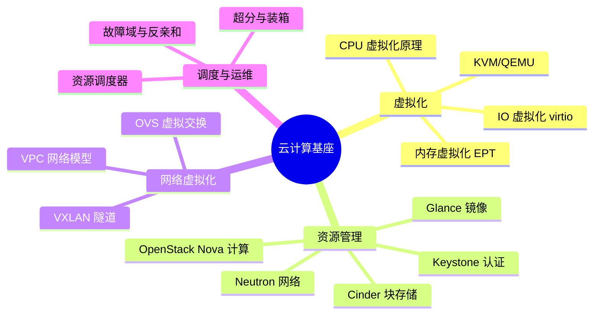

# 云计算基座

> 理解云从哪里来。在公有云产品（ECS、VPC、SLB……）成为"水电煤"之前，先有一代工程师在 OpenStack 与虚拟化层之上手工搭建"私有云"。理解基座，才能理解今天所有云产品底层的设计取舍。

## 这个域回答什么问题

- 一台物理机如何变成可以弹性供给的"计算资源池"？
- 虚拟机的网络、存储、镜像在云内部如何流转？
- 公有云 IaaS 产品与 OpenStack 这类开源基座的异同与演进关系？

## 知识框架

## 文章列表

| 文章 | 状态 | 说明 |
| --- | --- | --- |
| [OpenStack 架构与十年演进](/cloud/foundation/openstack) | 已发布 | 种子文：组件全景、数据流与基座的兴衰思考 |
| [虚拟化与 KVM](/cloud/foundation/virtualization) | 已发布 | KVM/QEMU、virtio、性能开销 |
| [SDN / NFV](/cloud/foundation/sdn-nfv) | 已发布 | 控制面/数据面分离、云网络实现 |

## 精选资源

> 筛选标准：官方与一手来源优先，近两年内容优先，经典明确标注。更新于 2026-09-01。

### 虚拟化

- [QEMU Documentation](https://www.qemu.org/docs/master/) — QEMU 官方完整手册，覆盖系统模拟与 KVM 加速机制（滚动更新 · 官方文档）
- [KVM — The Linux Kernel documentation](https://docs.kernel.org/virt/kvm/index.html) — 内核官方 KVM API 与 vCPU/内存虚拟化权威文档（滚动更新 · 官方文档）
- [KVM 原理简介（《KVM 实战》系列）](https://developer.aliyun.com/article/724399) — 系统讲透 CPU/内存/IO 虚拟化原理的中文经典（2019 · 工程博客）

### OpenStack

- [OpenStack Docs: 2026.1](https://docs.openstack.org/2026.1/index.html) — 最新版官方文档门户，含架构、组件与部署运维（2026 · 官方文档）
- [OpenStack Architecture Design Guide](https://docs.openstack.org/arch-design/) — 官方架构指南，讲透计算/存储/网络的设计权衡（持续维护 · 官方文档）

### SDN 与云网络

- [The Design and Implementation of Open vSwitch](https://www.usenix.org/conference/nsdi15/technical-sessions/presentation/pfaff) — NSDI'15 最佳论文，虚拟交换机与 SDN 设计公认经典（2015 · 论文）
- [Cilium Documentation](https://docs.cilium.io/en/stable/) — eBPF 云网络数据面，K8s CNI 与网络策略的现代实现（2026 · 开源项目）
- [从 0 到 3.0，揭秘阿里云洛神云网络的进化之路](https://developer.aliyun.com/article/1004251) — SDN+NFV 生产架构三代演进复盘（2022 · 工程博客）

### DPU / 智能网卡

- [A cloud-optimized transport protocol for elastic and scalable HPC](https://www.amazon.science/publications/a-cloud-optimized-transport-protocol-for-elastic-and-scalable-hpc) — AWS 官方披露的 SRD 智能网卡传输协议（2020 · 论文）
- [Overview of Azure Boost](https://learn.microsoft.com/en-us/azure/azure-boost/overview) — DPU 卸载网络/存储/虚拟化的官方架构解读（2025 · 官方文档）
- [云基础设施处理器 CIPU 2.0 技术解读](https://developer.aliyun.com/article/1647617) — 自研 DPU 架构与核心能力深度解读（2024 · 工程博客）

### 通读

- [云计算的全球变局与中国故事](https://www.infoq.cn/article/PFNc5TVyFlLR5Fr8NsBo) — 十五年云计算演进全景复盘，历史脉络清晰（2022 · 行业报告）

## 一句话入门

云计算的本质是**把硬件抽象成资源池，再用 API 把资源变成服务**。基座层决定了上层所有云产品的能力边界与成本结构。
