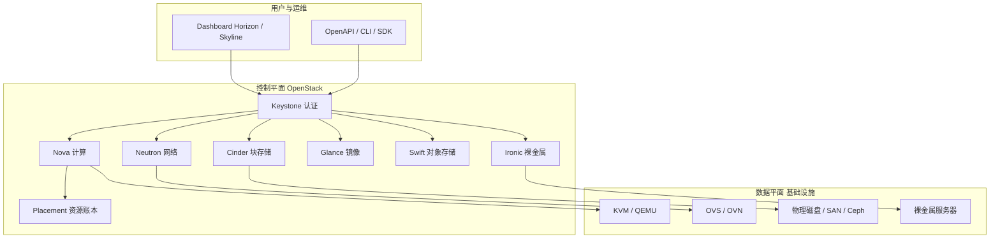
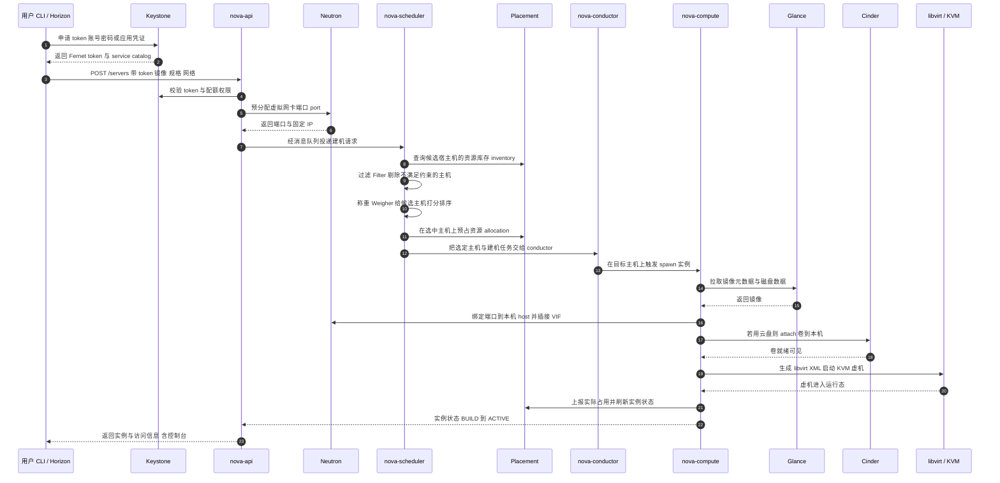
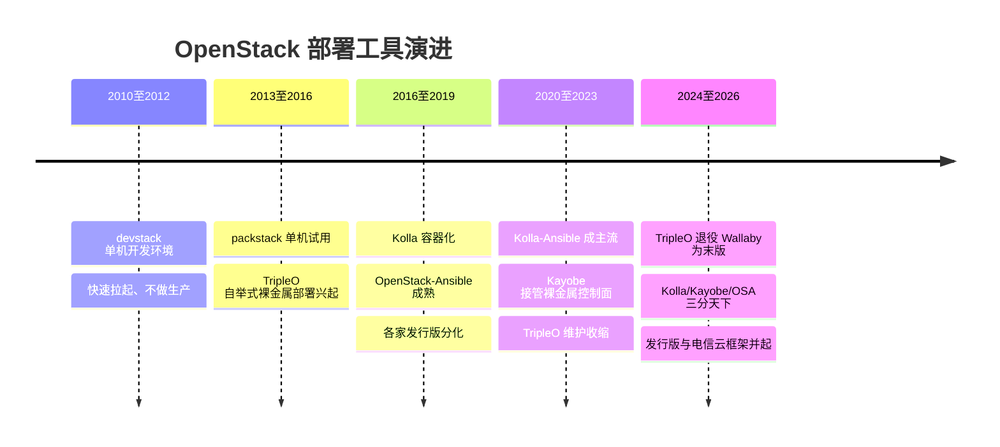
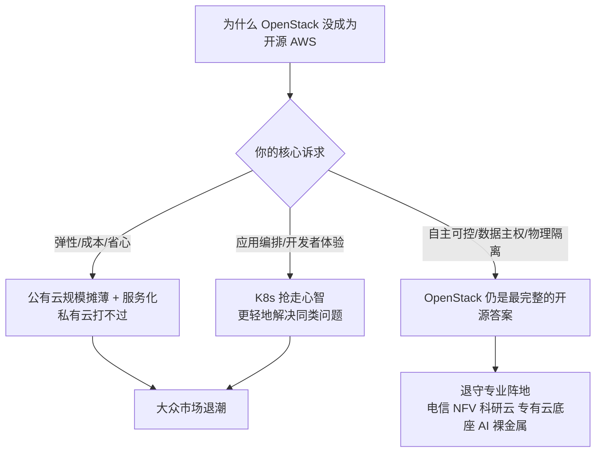
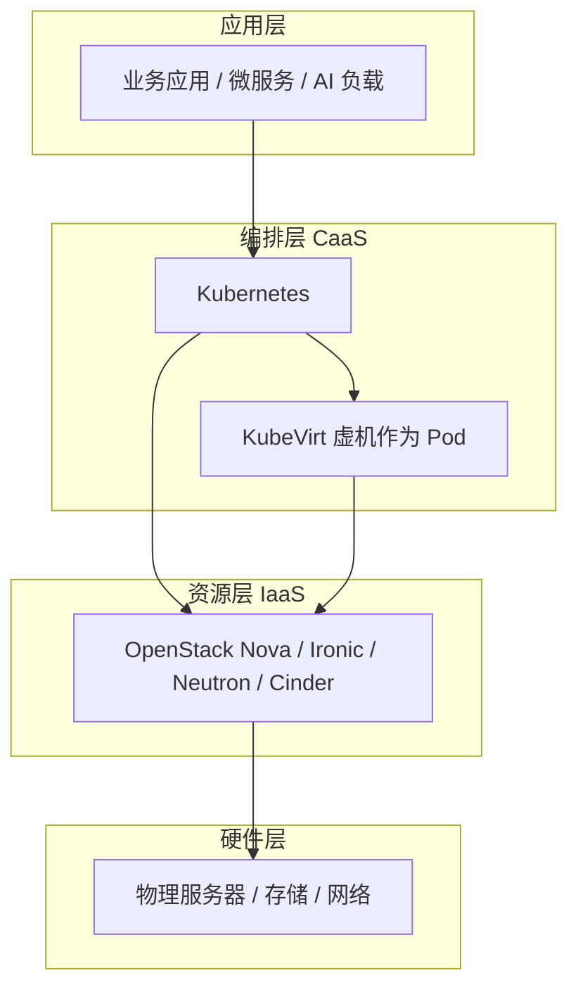
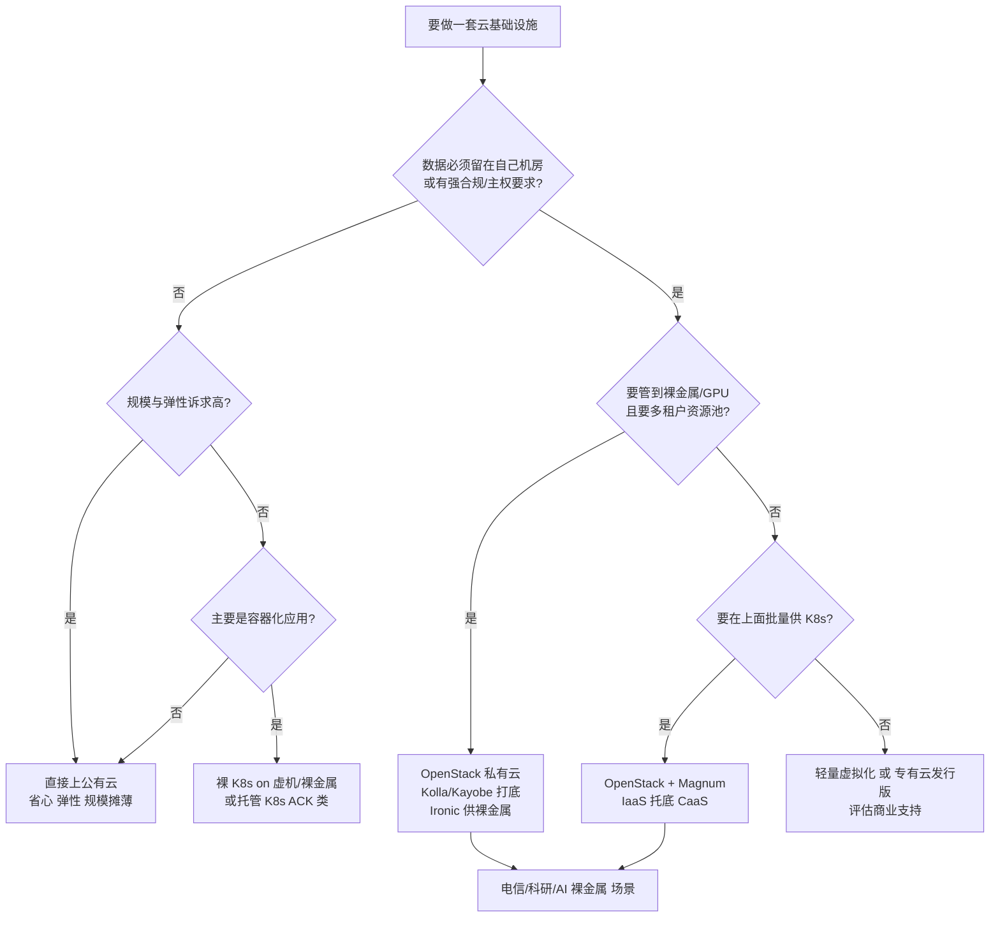

# OpenStack 架构与十年演进

> 面向要接手存量私有云、评估专有云底座、或想真正搞懂"云是怎么被一层层抽象出来"的工程师与解决方案架构师。这一篇不按文档目录平铺，而是抓一条主线：**跟着"创建一台虚拟机"的请求，从 API 入口一路走到 KVM 把虚机拉起来**，沿途把 Keystone、Glance、Nova、Placement、Neutron、Cinder、Swift、Ironic 逐个拆开讲清楚（职责 / 关键机制 / 一线运维痛点）。读完你会得到四样东西：一张能默画出来的全链路时序图、一套判断"组件为什么这么设计"的心智模型、对"OpenStack 为什么没成为开源 AWS、又在哪里活得很好"的明确判断，以及 2026 年站在 SA 视角"什么场景该上 OpenStack、什么场景直接公有云或裸 K8s"的选型尺子。全文以官方公开文档与公开发布信息为准，截至 2026-09。

## OpenStack 是什么：把硬件抽象成 API 的控制平面

一句话：**OpenStack 是一组用 Python 编写的控制平面服务，把机房里的计算、存储、网络硬件抽象成可以通过 API 供给的资源池**。

它不是操作系统，不是 Hypervisor，也不是虚拟化软件。KVM 负责真正运行虚拟机，OpenStack 负责回答："这台物理机上还能不能再塞一台 4C8G 的虚拟机？塞在哪台最合适？网络怎么通？镜像从哪来？系统盘放哪块存储上？"把这几个问号拆开，你会发现它们分别落在不同的服务上——这正是后面组件深拆的索引。

理解了这一点，就理解了它在技术栈中的位置：**OpenStack 是"控制平面"，它指挥但不亲自搬运数据**。真正跑虚机的是 KVM/QEMU，真正转发报文的是 OVS/OVN，真正存数据的是本地盘、SAN 或 Ceph。

::: tip 关键认知
OpenStack 的每个组件本质上都是一个"带状态机的 API 服务 + 消息队列驱动的异步执行器"。创建一台虚拟机的请求，会在 Nova、Neutron、Cinder、Glance、Placement 之间通过消息总线（多数部署用 RabbitMQ）接力——**这也是它所有复杂性与故障模式的根源**：一次失败往往横跨多个服务和一条消息队列，定位问题要同时在好几处看日志。
:::

下面这张官方"主要服务"图，把上面的文字版组件关系画成了官方口径，可对照着记：

*图源：OpenStack main services（[Wikimedia Commons](https://commons.wikimedia.org/wiki/File:OpenStack_main_services.svg)）。*

## 核心组件全景

| 组件 | 职责 | 一句话理解 |
| --- | --- | --- |
| **Keystone** | 认证与授权 | 所有服务的入口守卫，管 token 和 service catalog |
| **Glance** | 镜像服务 | 系统镜像的元数据登记与数据仓库 |
| **Nova** | 计算资源编排 | 虚拟机生命周期管理，但不含虚拟化本身 |
| **Placement** | 资源账本 | 记录每台宿主机有多少可分配资源、已被谁占用 |
| **Neutron** | 网络即服务 | 虚拟网络、子网、路由、安全组、浮动 IP |
| **Cinder** | 块存储 | 把存储后端抽象成"云盘"，挂给虚拟机 |
| **Swift** | 对象存储 | 海量非结构化数据，架构上是独立的分布式系统 |
| **Ironic** | 裸金属纳管 | 把物理服务器当成"实例"来供给，AI/GPU 集群常用 |
| **Heat** | 编排 | 用模板声明式地拉起整套资源（IaC 的先声） |
| **Horizon / Skyline** | 前端 | Web 控制台，Skyline 是新一代前端 |

下面这张是官方的组件全景图（OpenStack Map，v2026.04.01，即 Gazpacho 版），可以当作上表的扩展版来读：除了 Horizon、Skyline 两个前端，还有 Cyborg（加速器驱动）、Manila（共享文件系统）、Designate（DNS）、Barbican（密钥管理）、Octavia（负载均衡）、Ceilometer/Aodh（计量告警）等一大批"卫星项目"——它们围绕核心服务按需启用。后文 AI 场景会再提到 Cyborg 与 Ironic。

*图源：OpenStack 官方组件全景图 OpenStack Map（v2026.04.01），[openstack.org Software Overview](https://www.openstack.org/software/)。*

把这套组件和今天的公有云产品对照着看，能同时理解两边的设计取舍——**公有云的很多产品，本质是 OpenStack 同类组件的"工业化 + 规模化"版本**：

| OpenStack 组件 | 公有云对应（通用名） | 一句话对照 |
| --- | --- | --- |
| Nova + 调度器 | 弹性计算（ECS 类） | 公有云在调度规模、预测与机器学习上走得更远 |
| Cinder | 云盘 / 块存储（EBS 类） | Cinder 的工业化版本，后端与可靠性由厂商兜底 |
| Neutron | 专有网络 VPC | 同一套"模型与实现分离"思想的规模化实现 |
| Glance | 镜像服务 | 镜像仓库与分发，语义几乎一致 |
| Swift | 对象存储（S3 / OSS 类） | 公有云规模近乎无限、用 SLA 承诺持久性 |
| Keystone | IAM 访问控制 | token / RBAC / 服务目录，概念可直接对应 |
| Ironic | 弹性裸金属服务器 | 把物理机做成 API 供给，AI/GPU 集群常用 |

## 一条主线：创建一台 VM 的完整旅程

理解 OpenStack 最好的方式，不是背组件清单，而是**跟着一台虚拟机的诞生走完全程**。下面这条时序图是全文的"骨架"——后面每个组件的深拆，本质上都是在放大其中某一步。

把这条链路用大白话串一遍：

1. **先拿令牌**：任何请求第一步都是找 Keystone 换 token，并据此知道"各服务的 API 地址在哪"（service catalog）。OpenStack 没有 token 寸步难行。
2. **建机请求落到 nova-api**：API 层做鉴权、校验配额、落库一条 `BUILD` 状态的实例记录，并向 Neutron 预订一个网卡端口（拿到固定 IP）。注意此时**还没决定放哪台宿主机**。
3. **调度选址**：请求经消息队列到 nova-scheduler。调度器先问 Placement"哪些主机还有这么多 CPU/内存/磁盘"，再用一串**过滤器**剔除不满足约束（可用区、反亲和、镜像缓存等）的主机，用**加权器**给剩下的打分，选出最优主机，并让 Placement 把这份资源**预占**下来。
4. **conductor 兜底数据库**：选中主机后，任务交给 nova-conductor。conductor 的核心价值是"替计算节点读写数据库"——计算节点本身不直连 DB（见后文 Nova 一节）。
5. **compute 真正干活**：目标主机上的 nova-compute 接到 spawn 指令，向 Glance 取镜像、向 Cinder 挂云盘（如果用云盘）、把 Neutron 端口**绑定到本机并插接 VIF**，最后生成 libvirt XML 调 KVM 把虚机拉起来。
6. **回报状态**：虚机跑起来后，compute 经 conductor 把状态刷成 `ACTIVE`，用户通过 API/控制台看到实例可用。

::: warning 一线经验
这条链路里**最容易出问题的三处**，恰好是跨服务边界的地方：Neutron 端口绑定（VIF 插接失败 → 实例卡在 `BUILD`）、Cinder 卷 attach（多路径/后端没就绪 → 卡住或超时）、以及调度阶段（资源账本与实际不一致 → 选到一台其实放不下、或反复重试）。接手陌生环境，先盯这三处日志，能省一半时间。
:::

## 组件深拆

> 这一节按"职责 / 关键机制 / 常见运维痛点"的统一结构逐个拆。不必逐字读完——把它当成一张"哪里出问题该翻哪一页"的速查地图。

### Keystone：认证与 token 的十年演进

**职责**：Keystone 是身份服务（Identity Service），管三件事——**认证**（你是谁）、**授权**（你能干什么，基于角色 RBAC）、**服务目录**（各服务的 API 端点在哪）。所有其他服务都把它当"门卫"。

**关键机制——概念模型**：Keystone 用 `Domain → Project（租户）→ User → Role → Endpoint` 这套模型组织权限。用户拿到 token 后，token 里编码了"这个人属于哪个 project、有哪些 role"，下游服务据此做策略判断（policy）。

**关键机制——token 的演进**，这是 Keystone 最值得讲的一段，因为它直接反映了"规模化运行的痛"：

| Token 类型 | 机制 | 是否需要持久化 | 命运 |
| --- | --- | --- | --- |
| UUID | 32 字节随机串，本身不含信息 | 必须存后端（DB/缓存），每次校验都要查 | 最早默认，已移除 |
| PKI / PKIZ | Keystone 变身 CA，token 是自包含的签名（PKIZ 再压缩）载荷 | 不需要存，离线可验签 | 因 HTTP 头过大、证书运维复杂被弃用 |
| **Fernet** | 对称密钥加密 + 签名的紧凑自包含 token | **不需要存**，靠密钥仓库即可验 | 现代默认且长期唯一 |

Fernet 之所以胜出，核心是**"无状态、不落库"**：UUID token 在高并发下会把 token 表写爆、校验变成 DB 瓶颈；PKI token 又太大（动辄几 KB 的 HTTP 头，还会撞上各种代理的头长度限制）。Fernet 用一个**密钥仓库（key repository，编号 0~N 的多把对称密钥）**来签发和验证——签发用最高编号的主密钥，验证时按 token 里带的密钥编号挑对应密钥。

**常见运维痛点**：

- **Fernet 密钥轮换与分发**：多节点 Keystone 必须共享同一份密钥仓库，轮换（rotation）时若分发不及时，会出现"刚签发的 token 在另一台 Keystone 上验不过"。生产上要靠配置管理工具保证密钥仓库一致。
- **token 过期风暴**：默认 token 有效期 1 小时，大量客户端在整点集中过期、集中续签，会给 Keystone 和后端 DB 打出尖峰。我遇到的情况是，把过期时间适当打散、并让客户端提前续签，能明显削峰。
- **时钟漂移**：自包含 token 的有效期判断依赖各节点时间一致，NTP 没配好会出现"莫名其妙 401"。

### Glance：镜像服务

**职责**：Glance 管虚拟机镜像——但要注意一个常被误解的点：**Glance 主要存的是镜像的"元数据 + 数据指针"，磁盘数据本体可以放在多种后端**（本地文件系统、Swift、Ceph/RBD、NFS 等）。Nova 建机时先来 Glance 问"这个镜像在哪、什么格式、多大"，再去对应后端拉数据。

**关键机制**：

- **元数据与数据分离**：镜像记录里有 `location`（指向后端的具体位置）、`disk_format`（qcow2/raw 等）、`container_format`、`visibility`（public/private/shared）、`properties`（如最小 CPU/磁盘、是否支持某 hypervisor 特性）。
- **与 Nova 的握手**：Nova 计算节点本地有镜像缓存（`base` 目录），第一次用某镜像时从 Glance/后端拉下来缓存，后续同镜像建机直接复用——这也是调度器有"镜像本地缓存过滤器"的原因（优先选已缓存该镜像的主机，省去拉取时间）。
- **后端选型**：把镜像数据直接放 Ceph/RBD 是大规模部署的常见做法，配合 Nova 的 RBD 后端能做到"克隆即建盘"（copy-on-write），建机飞快。

**常见运维痛点**：镜像格式与 hypervisor 不匹配（如上传了 raw 却期望 qcow2 的特性）、镜像属性缺失导致调度/建机失败、本地镜像缓存把计算节点磁盘塞满。

### Nova：计算编排（conductor / compute / scheduler 分工）

**职责**：Nova 是计算服务，管虚拟机的全生命周期（创建、启停、迁移、销毁、重建）。**但 Nova 自己不做虚拟化**——它通过 virt driver 调用底层 hypervisor（绝大多数生产环境是 libvirt + KVM，也支持 VMware、Hyper-V 等）。

Nova 的内部由多个协作进程组成，下面这张官方架构图把它们的关系画得很清楚：

*图源：Nova System Architecture，OpenStack 官方文档（[docs.openstack.org/nova](https://docs.openstack.org/nova/latest/admin/architecture.html)）。*

**关键机制——进程分工**：

| 进程 | 角色 | 部署位置 |
| --- | --- | --- |
| nova-api | 接收 REST 请求、鉴权、落库、投递任务 | 控制节点 |
| nova-scheduler | 决定实例放哪台宿主机（过滤 + 称重） | 控制节点 |
| nova-conductor | 替计算节点读写数据库、协调建机流程 | 控制节点 |
| nova-compute | 调 libvirt/hypervisor 真正起停虚机 | 每台计算节点 |
| Placement | 资源库存与分配的"账本"（独立服务） | 控制节点 |

**为什么要有 conductor？** 这是 Nova 一个很关键的设计决定。早期 nova-compute 直连数据库，带来两个问题：一是**安全**——成百上千台计算节点都揣着 DB 凭证，任何一台被攻破都能动整个云的数据；二是**升级与扩展**——DB schema 一变，所有计算节点的代码都得同步。conductor 把 DB 访问收敛到控制节点，**计算节点不再直连数据库**，只通过 RPC 向 conductor 请求"帮我读/写这条记录"。这让计算节点变成"无状态、易扩展、易升级"的角色。

**关键机制——调度器的"过滤 + 称重"**：Nova 默认用 Filter Scheduler，分两步：

- **过滤（Filter）**：依次用一组过滤器筛掉不合格主机。常见默认过滤器包括 `RetryFilter`（排除上次重试失败的主机）、`AvailabilityZoneFilter`（可用区匹配）、`ComputeFilter`（主机存活且能跑计算）、`ComputeCapabilitiesFilter`（满足实例规格声明的能力）、`RamFilter`/`DiskFilter`（内存、磁盘够）、`ServerGroupAntiAffinityFilter`（反亲和：同组实例打散到不同主机）。**过滤是"硬约束"，过不了就直接出局**。
- **称重（Weigher）**：在通过过滤的候选集里打分排序。最典型的是 `RamWeigher`——默认行为是**把实例打散**（spread，优先选剩余内存多的主机），避免单台主机过载；但也能反向配置成**装箱**（bin-packing，优先填满一台再用下一台，提高利用率、便于腾空主机做维护）。

这里藏着云计算最经典的取舍：**装箱提高资源利用率、便于关机维护，但放大故障半径（一台宕机倒一片）；打散提高可用性、负载更均衡，但降低密度、碎片化**。公有云的调度系统至今仍在解同一道题，只是规模大了三个数量级、解法从静态权重进化到了预测与机器学习。多数私有云场景里，我倾向"默认打散 + 对需要腾空的维护场景临时切装箱"。

**Cell v2**：现代 Nova 用"cell（单元）"来横向扩展——每个 cell 有独立的消息队列和数据库，把计算节点分组，避免单一 DB/MQ 成为规模瓶颈。理解 cell 对排障很重要（实例属于哪个 cell、API 与 cell 的数据库怎么同步）。

**常见运维痛点**：live migration（在线热迁移）对共享存储、CPU 特性、网络有要求，跨异构主机常失败；DB 同步与 cell 映射错配导致"实例查不到/状态不一致"；compute 服务 flapping（心跳超时被判宕机）引发不必要的实例重建。

### Placement：从 Nova 拆出来的资源账本

**职责**：Placement 是相对年轻的服务（早期是 Nova 的一部分，后来独立出来），专门回答一个问题：**"每台宿主机/资源提供者有多少可分配资源（inventory），已经被哪些消费者占用（allocation）"**。CPU、内存、磁盘、GPU、SR-IOV VF、NUMA 节点……都建模成"资源提供者（Resource Provider）+ 库存（Inventory）+ 分配（Allocation）"。

**关键机制**：

- **资源提供者与 trait**：每台计算节点、每块 GPU、每个 NUMA 单元都是一个 Resource Provider，带一组 `trait`（特征标签，如 `HW_CPU_X86_AVX2`、`CUSTOM_GOLD`）。调度器用 trait 表达"我要一台支持某指令集/某类加速卡的主机"。
- **allocation 预占**：调度选中主机后，Placement 立即把这份资源"记账扣减"，避免并发建机时多个请求抢同一份资源（超卖）。这也是前面时序图里第 9、15 步的本质。
- **跨服务复用**：Placement 不只服务 Nova——Cinder（存储后端容量）、Neutron、Cyborg（加速器）都可以用它做资源记账，是 OpenStack 走向"统一资源账本"的基础设施。

**常见运维痛点**：账本与实际漂移（compute 重启、异常退出后 allocation 没回收，出现"幽灵占用"），需要用 `placement audit`/工具对账；GPU、SR-IOV 等自定义资源的 trait/inventory 没正确上报，导致带加速卡的实例调度不到。

### Neutron：网络即服务与 ML2 插件体系

**职责**：Neutron 是网络服务，把"网络"抽象成可编程对象——`Network`（二层网络/VLAN）、`Subnet`（三层子网）、`Port`（虚拟网卡）、`Router`（虚拟路由）、`Security Group`（分布式防火墙）、`Floating IP`（公网浮动地址）。租户能在 API 上"画"出自己的虚拟网络拓扑。

**关键机制——ML2 的"模型与实现分离"**：Neutron 最精妙的设计是 **ML2（Modular Layer 2，模块化二层插件）**。它把网络拆成两层：

- **核心模型（Type Driver，类型驱动）**：定义"网络是什么类型"——VLAN、VXLAN、Geneve、GRE、Flat。这一层是统一的、与厂商无关的抽象。
- **机制驱动（Mechanism Driver）**：定义"这个网络由谁、用什么去真实实现"——OVS、OVN、Linux Bridge、或硬件 SDN 控制器。可以同时启用多个机制驱动。

这个"模型与实现分离"的设计非常超前——**今天公有云的 VPC 产品，本质上是同一思想的工业化版本**：控制面统一定义网络模型，数据面由自研转发引擎（甚至智能网卡/DPU）实现。理解了 ML2，就理解了现代云网络的通用骨架。

*图源：OpenStack 官方博客 OVS and OVN Explained（[openstack.org](https://www.openstack.org/blog/ovs-and-ovn-explained-the-networking-stack-behind-openstack/)）。*

**关键机制——OVS 到 OVN 的演进**，这是 Neutron 近五年最大的一条变化线：

- **ML2/OVS（传统，agent 架构）**：每台计算/网络节点上跑一堆 Python agent——`neutron-openvswitch-agent`（配 OVS 流表）、`neutron-dhcp-agent`、`neutron-l3-agent`（虚拟路由/NAT）、`neutron-metadata-agent`。Neutron server 通过 RabbitMQ RPC 把网络变更推给这些 agent，agent 再去配本机 OVS。安全组用 `iptables_hybrid` 驱动时，还会在数据路径里插一座 Linux bridge（`qbr`）和一对 veth（`qvo`/`qvb`）——**这是众所周知的性能与延迟来源**。
- **ML2/OVN（现代，数据库驱动）**：OVN（Open Virtual Network）不是替换 OVS，而是**给 OVS 装了一个分布式控制平面**。Neutron 把网络对象写进 **OVN 北向数据库（NBDB）**，`ovn-northd` 把它编译进**南向数据库（SBDB）**，每台主机上的 `ovn-controller` 订阅 SBDB、在本机把逻辑流表落地到 OVS。**整条链路是事件驱动、数据库驱动的，砍掉了大部分独立 agent，也不再依赖消息队列来配置数据面**。安全组直接用 OVS openflow 实现，**没有 Linux bridge 被"伤害"**。隧道协议首选 Geneve。

*图源：OpenStack 官方博客 OVS and OVN Explained（[openstack.org](https://www.openstack.org/blog/ovs-and-ovn-explained-the-networking-stack-behind-openstack/)）。*

演进的时间线很清楚：Linux Bridge agent 在 Wallaby（2021）被弃用；ML2/OVN 上游成为默认机制驱动已有数年；Red Hat 在 RHOSP 17.0 弃用 ML2/OVS、新功能基本只在 ML2/OVN 上做；OpenStack-Ansible 自 2023.1（Antelope）起默认供给 ML2/OVN。**2026 年新部署，OVN 基本是默认答案**；存量 OVS 环境则有成熟的 in-place 迁移路径（先盘点并移除旧 agent、核对安全组规则兼容性、扩展 networker 角色）。

一个能直观体现两者差异的例子是路由：Neutron 的一个 `Router` 在 ML2/OVN 下被映射成 OVN 的一个**逻辑路由器（Logical Router）**，分布式路由天然落在各主机的 OVS 上，东西向流量不必再绕到集中的 L3 agent。

*图源：OpenStack 官方博客 OVS and OVN Explained（[openstack.org](https://www.openstack.org/blog/ovs-and-ovn-explained-the-networking-stack-behind-openstack/)）。*

**常见运维痛点**：

- **OVS 时代**：L3 agent 是集中式单点（不开 DVR 时，所有东西向/南北向路由都绕网络节点），网络节点一挂大面积断网；`qbr` bridge + veth 带来的额外跳数压低吞吐、抬高延迟；DHCP/metadata agent 异常导致新实例拿不到 IP 或元数据。
- **OVN 时代**：功能仍有少量 gap（如 IPv6 元数据访问、provider 网络下的浮动 IP 端口转发等，官方 "Gaps from ML2/OVS" 文档有清单）；`ovn-controller` 与 Neutron 的状态偶尔不同步，需要清理重复 chassis；从 OVS 迁移过程本身要小心（迁移期双栈并存）。
- **共性**：安全组规则、浮动 IP、DVR（分布式虚拟路由）三者的交互是故障高发区，排障要同时看 Neutron、OVN/OVS、宿主机内核网络栈。

### Cinder：块存储、后端驱动与多路径

**职责**：Cinder 是块存储服务，把五花八门的存储后端抽象成统一的"云盘（volume）"，可创建、扩容、快照、挂载给实例。它对标公有云的"云硬盘/EBS 类"产品。

**关键机制——后端驱动**：Cinder 通过 **volume driver** 对接具体后端，常见有：

- **LVM**（本地卷组，简单但不适合大规模/共享）
- **Ceph/RBD**（分布式存储，生产主流，配合 Nova 可做克隆即建盘）
- **NFS / 共享文件系统**
- **商业存储阵列**（各厂商有专属驱动，如 IBM、Dell、NetApp、Pure 等）

一个 volume 的"创建 → attach 到实例"流程会跨越 Cinder、Nova、宿主机三层：Cinder 在后端开出卷，Nova 把卷信息传给目标计算节点，计算节点通过存储协议（iSCSI/FC/NVMe-oF/RBD）把卷"接"到本机，再由 libvirt 挂给虚机。

**关键机制——多路径（multipath）**：对接 FC/iSCSI 等 SAN 后端时，计算节点到存储往往有**多条物理路径**（冗余 + 负载分担）。Linux 的 `multipathd` 把这些路径聚合成一个块设备。Cinder 的 attach 流程要正确发现、配置多路径，否则一条路径抖动就可能导致 IO 挂起。

**常见运维痛点**：

- **attach/detach 卡死**：这是 Cinder 最经典的坑——卷状态停在 `attaching`/`detaching`/`error`，根因常在后端没就绪、存储网络不通、或宿主机上残留的映射没清干净。排障要同时看 cinder-volume、nova-compute、宿主机 `multipath -ll` 与内核日志。
- **多路径路径抖动**：某条路径 flapping，multipath 反复 failover，IO 延迟尖峰甚至挂起。需要核对存储侧 zoning/网络、multipath 配置（path policy、超时）。
- **快照与备份混淆**：Cinder 快照（volume 级、依赖后端能力）和备份（backup，可落到 Swift/独立后端）是两回事，运维上常被搞混导致恢复时找不到东西。

### Swift：对象存储，与商业云对象存储的对照

**职责**：Swift 是对象存储——存海量非结构化数据（备份、归档、静态资源、镜像后端），通过 HTTP REST API 按 `容器（container）/对象（object）` 存取。它在架构上是一个**独立的分布式系统**，不强依赖 OpenStack 其他组件（只用 Keystone 做认证），甚至可以单独部署。

**关键机制**：

- **四类服务 + 代理**：`Proxy`（对外 API 入口、路由请求）、`Account`（账户元数据）、`Container`（容器元数据）、`Object`（对象数据本体）分层负责。
- **Ring（环）与一致性哈希**：Swift 用"环"把对象名哈希到分区（partition），再把分区映射到物理磁盘/节点。**Ring 是 Swift 的灵魂**——它决定了数据分布、副本放置和扩缩容时的数据迁移。
- **副本与纠删码、最终一致**：默认多副本（常见 3 副本）保证可靠性；新版本支持纠删码（EC）降低冷数据成本。Swift 是**最终一致**系统，写入后通过 anti-entropy（read-repair、replicator）收敛——这与追求强一致的数据库类负载不同，适合对象存储的典型场景。

**与商业云对象存储的对照**（帮助从私有云视角理解公有云对象存储）：

| 维度 | Swift | 商业云对象存储（S3 / OSS 类） | 工程含义 |
| --- | --- | --- | --- |
| API | Swift 原生 API（也常配 S3 兼容层） | S3 / 各家原生 API | 迁移要看是否需要 S3 兼容 |
| 规模 | 自建集群，规模受限于自己运维能力 | 近乎无限、按需弹性 | 超大规模冷数据公有云更省心 |
| 可靠性 | 自己保证副本/EC 与机房冗余 | SLA 承诺多个 9 的持久性 | 私有云要靠 Ring 与多机房设计兜底 |
| 一致性 | 最终一致 | 多数已提供强一致读 | 对一致性敏感的负载需确认 |
| 定位 | 私有云内部的海量存储底座 | 面向公网的服务化存储 | Swift 更像"自建版对象存储" |

**常见运维痛点**：Ring 变更（加盘、换盘、扩容）后 rebalance 期间的数据迁移压力与时长；某账户/容器元数据膨胀拖慢查询；和 Glance/Cinder backup 等"把 Swift 当后端"的服务耦合时，Swift 抖动会传导上去。

### Ironic：裸金属纳管，AI/GPU 集群的供给层

**职责**：Ironic 是裸金属（Bare Metal）服务——**把物理服务器当成"实例"来供给**，让用户像开虚机一样开物理机。它不是虚拟化，而是"物理机的生命周期管理"：纳管、清理、装系统、交付、回收。

**关键机制**：

- **conductor + IPA（ironic-python-agent）**：Ironic conductor 通过带外管理接口（IPMI、Redfish）控制物理机上下电；装机时在目标机内存里启动一个临时的 **ironic-python-agent** 小系统，由它执行擦盘、分区、写镜像、装 bootloader 等动作。
- **provisioning 状态机**：裸金属节点在 `enroll → verifiable → manageable → available → active` 等状态间流转，每一步对应一段自动化动作。
- **与 Nova 的关系**：Ironic 可以作为 Nova 的一种 virt driver 暴露——用户在 Nova API 上请求一个"裸金属 flavor"，调度到 Ironic 节点，体验和开虚机一致。

**为什么在 AI 时代更重要**：GPU 训练/推理集群普遍要**裸金属 + GPU 直通 + 高速网络（RDMA/RoCE/InfiniBand）**，虚拟化会损耗性能、且 GPU 直通在虚机里限制多。Ironic 正好补上"把成排 GPU 服务器纳入云 API 统一供给"的能力，配合 Cyborg（加速器驱动，管 GPU/FPGA/QAT/智能网卡）、PCI 直通、NUMA 感知调度，构成"OpenStack 做 AI 基础设施底座"的主线（详见后文"OpenStack 的 2026"）。

**常见运维痛点**：带外管理（IPMI/Redfish）固件版本参差导致上下电/装机偶发失败；擦盘（cleaning）耗时长影响交付速度；裸金属的"租户隔离"比虚机更依赖装机时的彻底清理，安全上要格外谨慎。

### Heat、Horizon 与 Skyline：编排与前端

- **Heat**：编排服务，用模板（HOT/CFN）**声明式地一次性拉起整套资源**（一组虚机 + 网络 + 卷 + 浮动 IP + 安全组），是 Infrastructure as Code 在 OpenStack 里的先声。今天很多场景被 Terraform 的 OpenStack provider 或 Ansible 取代，但 Heat 仍是"原生编排"的参考实现。
- **Horizon**：老牌 Web 控制台（Django 实现）。**Skyline** 是新一代前端，界面与现代交互体验更好，逐步成为推荐前端。

## 部署形态演进：从 devstack 到容器化与退役的 TripleO

OpenStack "怎么装"这件事，本身就是一部浓缩的演进史——它直接反映了运维社区对"复杂度管理"的反复摸索。

**几条主线**：

- **devstack**：单机、一把脚本拉起全部服务，**只为开发/试用，绝不用于生产**。它的价值是让你几分钟内摸到 OpenStack 的全貌。
- **TripleO（OpenStack-on-OpenStack）**：用一套 OpenStack 去部署另一套 OpenStack 的"自举"思路，曾是 Red Hat 系（RHOSP）的生产部署引擎。**已正式退役，Wallaby 是最后一个完整支持的版本**——新项目不要再选它。
- **Kolla / Kolla-Ansible**：把每个 OpenStack 服务打成容器镜像，用 Ansible 编排部署。**2025–2026 社区共识的生产首选**，容器化让升级、回滚、调试都更可控（"重跑一次 deploy"就能拉齐版本）。
- **Kayobe**：Kolla 的子项目，= Kolla-Ansible + Bifrost（裸金属供给），把**控制面服务部署到裸金属**并管好底层主机的网络/系统配置，StackHPC 等团队重度维护，科研云/HPC 场景常见。
- **OpenStack-Ansible（OSA）**：纯 Ansible、服务跑在容器/裸金属上的成熟方案，仍积极维护（2026.x 系列跟进 Gazpacho/Hibiscus），自带跨大版本升级路径。
- **商业发行版**：RHEL OpenStack Platform（Red Hat）、Mirantis OpenStack for Kubernetes（MOSK）、Canonical Charmed OpenStack、SUSE、以及国内多家厂商的发行版——把上游 + 部署工具 + 支持打包成产品。

**部署工具选型表（2026）**：

| 工具 | 适用场景 | 工程含义 / 怎么选 |
| --- | --- | --- |
| devstack | 学习、开发、CI | 别上生产，只为摸全貌 |
| Kolla-Ansible | 通用生产私有云 | 容器化、社区主流，多数新部署默认它 |
| Kayobe | 控制面要跑在裸金属、HPC/科研云 | Kolla + 裸金属供给，运维一体化 |
| OpenStack-Ansible | 偏好纯 Ansible、要成熟升级路径 | 仍在维护，跨版本升级文档完善 |
| TripleO | —— | 已退役，存量考虑迁移 |
| 商业发行版 | 要厂商支持/SLA、合规采购 | 用产品换运维人力与责任边界 |

## 十年兴衰：基座为什么没成为"开源 AWS"

我入行的头几年，OpenStack 就是"云"的代名词，大有"开源 AWS、砸碎西方云垄断"之势。但回头看，它终究没成为大众市场的默认底座。下面这几条判断，是我事后复盘的结论——敢下判断，但都标了边界。

### 一、成本账算不过来（大众市场的致命伤）

- **运维成本**：一支能维护 OpenStack 的团队，人力成本远超中小企业的整个 IT 预算。升级一次大版本，往往需要数月的兼容性验证。
- **资源利用率**：小规模集群里，管理组件自身就要吃掉相当比例的资源；规模效应出不来，单位成本永远打不过公有云。
- **迭代速度**：公有云以周为单位发布新产品；私有云的 OpenStack 集群，三年不动是常态。

### 二、组件间"耦合松散"——灵活的另一面是难调试

OpenStack 的美学是"每个服务独立、用 API + 消息队列松耦合"。这在设计上是优点（可替换、可水平扩展），但在**运维上是双刃剑**：一次建机失败，线索散落在 nova-api、scheduler、conductor、compute、neutron、cinder 的日志和一条 RabbitMQ 队列里，**没有单一权威视图告诉你"卡在哪、为什么"**。相比公有云把这一切封进一个产品、给你一个工单入口，OpenStack 把"集成与排障"的成本甩给了使用方。多数场景里，我看到的真实痛点不是"功能不够"，而是"出了问题要跨五六个服务去拼线索"。

### 三、升级痛苦——SLURP 本身就是问题的注脚

OpenStack 半年一个大版本，每个版本都带数据库 schema 变更、配置项增删、组件行为变化。**在线升级生产云、还要保证不中断业务，是一件高风险的难事**；回滚更是几乎不可能（DB schema 向前迁移后难退）。社区后来专门发明 **SLURP（Skip Level Upgrade Release Process，跳级升级发布流程）**——每年指定一个版本，允许从上一个 SLURP 版直接跳级升级，中间版本可跳过——**这恰恰说明"每版都升"在生产上扛不住**。升级痛苦是私有云团队最普遍的抱怨之一。

### 四、与 Kubernetes 的生态位重叠

容器与 Kubernetes 改变了应用与基础设施的关系。应用不再关心"我在哪台虚拟机上"，只关心"有没有 API 可以调、能不能弹性伸缩"。**基础设施的消费方式从"管资源"变成了"用服务"**——而这恰恰需要巨大的规模来摊薄服务化的成本，公有云的护城河因此越挖越深。更关键的是，K8s 直接抢走了"应用编排/资源调度"这一层的开发者心智：很多原本要在 OpenStack 上做的事（拉起一组带网络的服务、自动扩缩、滚动升级），在 K8s 里以更轻的方式解决了。**OpenStack 管"硬件资源池"、K8s 管"应用编排"，两者本可分层共存，但市场叙事上 K8s 的崛起确实分流了 OpenStack 的注意力与人才**。

### 五、公有云的"降维打击"

公有云用规模把单位成本压到私有云无法企及，用服务化把运维复杂度对用户隐藏，用迭代速度把功能差距越拉越大。对一个不追求物理隔离/数据主权的普通企业，"自建 OpenStack"在 2026 年几乎总是一笔亏本买卖。

### 它在哪里还活得很好

退潮退的是大众市场，不是全部。在这些阵地上，OpenStack 仍是默认选项：

1. **运营商 NFV / 电信云**：5G 核心网、边缘计算的虚拟化基础设施层，OpenStack + StarlingX 仍是主流开源组合（与 [SDN / NFV](/cloud/foundation/sdn-nfv) 互链）。电信对"自主可控、管到硬件、长期运行"的刚需，正好是 OpenStack 的强项。
2. **科研云 / HPC**：大学、国家实验室的计算平台，要裸金属 + 调度 + 多租户，Kayobe/Kolla 在这类环境里很常见。
3. **专有云 / 政企私有云底座**：要数据不出机房、要合规、要管到硬件的客户，OpenStack 仍是最完整的开源 IaaS。
4. **电信、金融的存量环境**：大量已建成的生产云在跑，迁移成本高，会长期存在并持续打补丁、做版本升级。
5. **VMware 迁移的新引擎**：Broadcom 改变 VMware 授权策略后，"迁出 VMware"成了 OpenStack 的新增长点（见下一节）。

### 留给行业的东西

OpenStack 没有消失，而是完成了历史使命后的"退隐"：

1. 它培养了中国第一代云计算工程师——今天公有云厂商的核心团队里，有大量 OpenStack 出身的工程师；
2. 它的 API 语义（实例、卷、网络、镜像）成了行业通用语言；
3. 它的教训同样宝贵：控制面的复杂度管理、大规模状态机的工程化、升级兼容性、松耦合系统的可观测性——这些坑，后来的云厂商都绕着走或填得更平。

## OpenStack 的 2026：现状与定位

写完上面的"退场"，常有刚入行的同事问我："所以 OpenStack 死了？"没有。这一节用 2026 年的官网数据补上另一半图景——它不再是"全民热潮"，但早已在特定阵地里回到默认选项的位置。

先核对几个事实（截至 2026-09）：

- **发布节奏没变，已走到第 33 个版本。** 官方维持约 6 个月一轮、一年两版的节奏：**2026.1 'Gazpacho' 于 2026-04-01 发布**，2026.2 'Hibiscus' 预计 2026-09-30；每年有一个 **SLURP** 版（允许跨版本跳级升级的长支持版）——Gazpacho 正是 SLURP 版，维护期预计到 2027-10，下一个 SLURP 是 2027.1（预计 2027-03）。Gazpacho 的发布亮点集中在**并行热迁移、vTPM 热迁移等工作负载迁移能力、OVN BGP、Ironic 裸金属增强，以及与 NVIDIA 历时约半年的硬件使能合作**。
- **规模没有萎缩。** OpenInfra Foundation 披露：OpenStack 支撑全球 300+ 个公有云数据中心、部署在 5500 万+ 核心上，背后有 560+ 支持组织；Gazpacho 一个版本就有约 500 名贡献者、来自约 100 个组织（含 Ericsson、Red Hat、Walmart、NVIDIA），半年合入近 9000 项变更。
- **治理早已"去 OpenStack 化"。** OpenStack Foundation 更名为 **OpenInfra Foundation** 后，又成为 Linux Foundation 旗下成员；OpenStack 只是其与 StarlingX（边缘/电信云）、Kata Containers、Zuul 并列的项目之一，遵循 **Four Opens**（开放源码、开放设计、开放开发、开放社区）原则，技术方向由社区选举的 Technical Committee 负责。

*图源：OpenStack 官方概念架构图（2025 版）。注意上层工作负载：K8s 集群、AI 训练、AI 推理与传统虚拟机并列；底层把硬件统一抽象为裸金属/虚拟机/容器。[openstack.org Software Overview](https://www.openstack.org/software/)。*

结合官方材料，我对它 2026 年定位的判断有四条：

- **私有云/专有云底座，"VMware 迁移"是新引擎。** 自 Broadcom 改变 VMware 授权策略以来，官方把 "VMware Migration to OpenStack" 列为独立用例，近几个版本的发布亮点里，并行热迁移、vTPM 热迁移等虚机迁移能力常居前列。对要自主可控、要管到硬件的客户，OpenStack 仍是最完整的开源答案。
- **电信云没有退场，只是更聚焦——但要看清两个框架的分工。** OpenInfra 这边是 **OpenStack + StarlingX**（边缘/电信云）；另有一个容易混淆的 **Sylva** 项目——它**不是 OpenInfra 的项目，而是 Linux Foundation Europe 旗下的电信云原生框架**，由 Orange、德国电信、Telefónica、Vodafone、意大利电信等欧洲运营商发起，目标是把成千上万个 K8s 集群、云原生网元统一到一层开源云原生栈上，2025–2026 已迭代到 Sylva 1.5（纳入 K8s 1.32、Canonical Kubernetes，Red Hat OpenShift 通过 Sylva 1.5 合规）。**简单说：传统 NFV/VNF 偏 OpenStack+StarlingX，云原生 CNF 偏 Sylva+K8s**，两者在电信云里并存。
- **与 K8s 的关系已经定形：分层共存，而非谁替代谁。** 官方概念图把 Kubernetes 集群画成 OpenStack 之上的工作负载之一——K8s 管应用、OpenStack 管硬件；我见过的多数生产环境，最终形态都是"OpenStack 打底跑 K8s"（详见下一节）。
- **AI 基础设施是新增长点。** 官方开了 "OpenStack for AI" 专栏并发布白皮书 *Open Infrastructure for AI: OpenStack's Role in the Next Generation Cloud*；落点不是训练编排，而是 **IaaS 打底**——Ironic 做 GPU 集群的裸金属供给、Cyborg 加速器驱动（GPU/FPGA/QAT/网卡等）、PCI 直通与 NUMA 感知调度、多租户 GPU 调度。近年的 GPU 云、主权云项目，多数走的正是这条路。

一句话总结：**2026 年的 OpenStack 不再试图做"所有人的云"，而是落定为私有云/专有云、电信云、AI/HPC 裸金属云三类场景的专业底座。** 上面写的"退场"，退的是大众市场；在这些阵地上，它仍在以一年两版的节奏积极迭代。

## OpenStack + Kubernetes：分层共存的三种姿势

"OpenStack 和 K8s 到底谁替代谁"是个伪命题——它们在不同层。理解清楚分层，才能选对组合。

*图源：OpenStack Magnum Architecture（[Wikimedia Commons](https://commons.wikimedia.org/wiki/File:OpenStack_Magnum_Architecture.png)）。*

### 姿势一：Magnum——OpenStack 之上原生开 K8s（"IaaS 托底 CaaS"）

**Magnum** 是 OpenStack 的容器基础设施管理服务（Container Infrastructure Management）。它把"一个 Kubernetes 集群"建模成 OpenStack 的一等资源（`ClusterTemplate` + `Cluster`），底层用 Heat 模板在 Nova 虚机（或 Ironic 裸金属）上自动拉起 master/worker、配好网络与证书，交给用户一个可用的 K8s API。**这是最经典的"IaaS 托底 CaaS"分层**：OpenStack 管硬件资源池与多租户隔离，Magnum 在其上批量供给 K8s 集群，应用在 K8s 里跑。多数生产环境的"OpenStack + K8s"最终都是这个形态。

### 姿势二：KubeVirt——方向相反的"把虚机塞进 K8s"

**KubeVirt** 是 CNCF 项目，思路和 Magnum 相反：它让 K8s **把虚拟机当成一种工作负载（VM 作为 Pod 来调度）**，用容器化的方式跑 KVM 虚机。也就是说，Magnum 是"在 IaaS 上开 CaaS"，KubeVirt 是"在 CaaS 里跑 IaaS 式负载"。当组织想"用一套 K8s 同时管容器和虚机、统一运维平面"时，KubeVirt 是热门选择——但它对底层裸金属/虚拟化栈的要求（KVM、设备插件、网络存储对接）和 OpenStack 解决的问题并不完全重叠。

### 姿势三：裸 K8s on VM——不要 OpenStack 这层

很多团队直接在公有云虚机或自有虚机上装 K8s，**根本不需要 OpenStack**。这是大多数中小规模场景的现实答案。

**三种姿势对照**：

| 方案 | 谁在下、谁在上 | 适合谁 | 工程含义 |
| --- | --- | --- | --- |
| Magnum（OpenStack + K8s） | OpenStack 托底，K8s 在上 | 要自建多租户 IaaS、又要在上面批量供 K8s 的大组织/电信/科研 | 一套云同时给 VM 和 K8s，运维统一但栈最重 |
| KubeVirt（K8s + VM as Pod） | K8s 托底，虚机作为负载 | 想"一套 K8s 管容器+虚机"、统一运维平面 | 运维平面收敛到 K8s，但放弃 OpenStack 的成熟 IaaS 能力 |
| 裸 K8s on VM/裸金属 | 只有 K8s | 绝大多数中小规模、不需要多租户 IaaS | 最轻，但失去 OpenStack 的资源池/多租户/裸金属供给 |

## 与国产云平台的关系：二次开发与自研的分野

> 本节只依据公开报道与官方资料，不涉及任何未公开信息。

中国云平台的发展，清晰地分成了两条路线，理解这个分野对判断"信创/自主可控"场景的技术选型很有帮助（另见 [信创编年史](/chronicle/xinchuang)）：

- **基于 OpenStack 二次开发的路线**：以**私有云/专有云/电信云**为主战场。公开资料显示，华为的 FusionSphere（后演进为 Huawei Cloud Stack）长期以 OpenStack 为底座做深度增强；早期一批创业公司如 UnitedStack（被公开称为"中国首家基于 OpenStack 的云服务提供商"）、EasyStack、ZStack（早期，后转向更轻量的自研路线）等，以及浪潮、新华三等厂商的私有云产品，都走过 OpenStack 二次开发的路子。逻辑很直接：**OpenStack 提供了最完整的开源 IaaS 骨架，厂商在其上做产品化、本地化、行业适配与商业支持**，比拼"从零造云"快得多。OpenStack 官方的商业发行版市场（Marketplace/Distros）里也能看到中国厂商的身影。
- **完全自研的路线**：以**头部公有云**为代表。阿里云的**飞天（Apsara）**是公开资料中明确的全自研大规模分布式云操作系统——从底层资源调度到上层服务都自研，没有走 OpenStack 路线。原因也好理解：**超大规模公有云的核心竞争力恰恰在于"突破开源框架的规模与性能天花板"**，OpenStack 松耦合、Python 控制面的架构在极限规模和极致性能上会成为约束，自研才能把调度、存储、网络做到自己想要的样子。

**分野的本质判断**：**规模与定位决定路线。** 要做面向公网、追求极限规模与性能的公有云，自研是必然；要做面向单一组织、追求自主可控与硬件纳管的私有云/专有云/电信云，基于 OpenStack 二次开发是性价比最高的起步方式。这也解释了为什么 2026 年 OpenStack 在中国的主战场是政企专有云、电信云与信创场景，而不是头部公有云。

## SA 视角：2026 年该怎么选

把前面所有判断收敛成一把可操作的尺子。

**场景 → 推荐 决策表**：

| 场景 | 2026 推荐 | 理由 |
| --- | --- | --- |
| 普通企业上云、要弹性省心 | 公有云 | 规模摊薄成本，运维复杂度对用户隐藏 |
| 中小规模、以容器化应用为主 | 裸 K8s / 托管 K8s（ACK 类） | 不需要多租户 IaaS，K8s 足够 |
| 数据主权 / 强合规 / 物理隔离 | OpenStack 私有云 / 专有云 | 最完整的开源 IaaS，管到硬件 |
| 电信 NFV / 边缘 | OpenStack + StarlingX（VNF）/ Sylva + K8s（CNF） | 电信云刚需，长期运行、自主可控 |
| 科研云 / HPC | OpenStack（Kayobe）+ Ironic 裸金属 | 裸金属 + 多租户 + 调度 |
| AI / GPU 集群供给 | OpenStack（Ironic + Cyborg + PCI 直通）托底，上层 K8s 编排 | OpenStack 做硬件供给，K8s 做训练/推理编排（另见 [GPU 集群与高速网络](/ai/infra/cluster)） |
| 要从 VMware 迁出 | OpenStack（迁移能力是近年发布重点） | 授权成本驱动，热迁移能力成熟中 |

**迁移路径要点**：

- **VMware → OpenStack**：先做虚机镜像格式转换与网络/存储映射，灰度迁移非核心负载验证，再迁核心；用好近版本的并行热迁移、vTPM 迁移能力。
- **OpenStack → 公有云 / K8s**：把"资源"语义翻译成"服务"语义——虚机改容器或托管实例、Cinder 卷改云盘/对象存储、Neutron 网络改 VPC。这条路本质是"从管资源回到用服务"，应用改造量往往比想象大。

## 常见坑

| 坑 | 现象 | 根因与对策 |
| --- | --- | --- |
| Fernet 密钥不一致 | 间歇性 401、token 时好时坏 | 多节点 Keystone 密钥仓库没同步；用配置管理统一分发并校验 |
| token 过期风暴 | 整点 Keystone/DB CPU 尖峰 | 大量客户端集中过期续签；打散过期时间、客户端提前续签 |
| 调度选错/选不到主机 | 实例卡 `BUILD`、反复 retry | Placement 账本与实际漂移、trait/inventory 没上报；做 placement 对账、核对资源上报 |
| 幽灵资源占用 | 主机明明空闲却调度不上 | compute 异常退出后 allocation 没回收；用 audit 工具清理 |
| Neutron 端口绑定失败 | 实例卡 `BUILD`、VIF 未插接 | OVN/OVS 状态不同步、网络节点异常；查 neutron + ovn-controller/OVS + 宿主机内核网络 |
| L3/DVR/浮动 IP 交互故障 | 南北向断网、浮动 IP 不通 | 集中式 L3 agent 单点或 DVR 配置问题；优先 OVN 分布式路由，核对安全组 |
| Cinder attach/detach 卡死 | 卷停在 `attaching`/`error` | 后端未就绪、存储网络不通、宿主机残留映射；三处日志联查 |
| 多路径路径抖动 | IO 延迟尖峰甚至挂起 | SAN 路径 flapping；核对 zoning/网络与 multipath 配置 |
| live migration 失败 | 热迁移报错、回退 | 共享存储/CPU 特性/网络不满足；迁移前校验异构主机兼容性 |
| 大版本升级翻车 | 升级后服务起不来、schema 不一致 | 跨版本 schema 与配置变更；走 SLURP 跳级路径、先在非生产演练、备齐回滚预案 |
| RabbitMQ 消息堆积 | 操作大面积变慢、状态不刷新 | 队列积压/消费者异常；监控队列深度、扩容或重启异常消费者 |
| 时钟漂移 | 莫名 401、证书/调度异常 | NTP 未配好；统一时间源并监控 |
| Ironic 带外管理失败 | 裸金属上下电/装机偶发失败 | IPMI/Redfish 固件参差；统一固件基线、核对带外网络 |

## 参考资料

<Refs>

**官方发布与治理**

- [OpenStack Releases：发布系列状态表（2026.1 Gazpacho、2026.2 Hibiscus 等排期）](https://releases.openstack.org/) — 各版本状态、发布日期与 SLURP 标记（访问日期 2026-09-05）
- [OpenStack 2026.1 'Gazpacho' 发布页](https://www.openstack.org/software/openstack-gazpacho) — 第 33 版、SLURP、迁移/OVN BGP/Ironic 等亮点（访问日期 2026-09-05）
- [Introducing OpenStack Gazpacho（官方博客）](https://www.openstack.org/blog/openstack-gazpacho-built-by-a-global-community-designed-for-real-world-infrastructure/) — Gazpacho 贡献者与变更规模（访问日期 2026-09-05）
- [Release Cadence Adjustment: SLURP Model（官方文档）](https://docs.openstack.org/project-team-guide/release-cadence-adjustment.html) — 跳级升级发布流程说明（访问日期 2026-09-05）
- [OpenStack Software Overview（含概念架构图与 OpenStack Map）](https://www.openstack.org/software/) — 官方组件全景与概念架构（访问日期 2026-09-05）
- [OpenStack for AI（含白皮书 Open Infrastructure for AI）](https://www.openstack.org/openstack-for-ai/) — Ironic/Cyborg/GPU 等 AI 底座定位（访问日期 2026-09-05）
- [OpenInfra Foundation 官网](https://openinfra.dev/) · [The Four Opens](https://openinfra.dev/four-opens/) — 治理与开放原则（访问日期 2026-09-05）
- [StarlingX（OpenInfra 边缘/电信云项目）](https://www.starlingx.io/) — 电信云开源组合（访问日期 2026-09-05）

**官方组件文档**

- [Keystone：All about tokens](https://docs.openstack.org/keystone/latest/admin/tokens.html) — UUID/PKI/PKIZ/Fernet 演进与选型（访问日期 2026-09-05）
- [Nova：System Architecture](https://docs.openstack.org/nova/latest/admin/architecture.html) · [Nova：Compute schedulers](https://docs.openstack.org/nova/latest/admin/scheduling.html) — 进程分工与过滤/称重（访问日期 2026-09-05）
- [Placement 文档](https://docs.openstack.org/placement/latest/) — 资源提供者/库存/分配模型（访问日期 2026-09-05）
- [Glance 文档](https://docs.openstack.org/glance/latest/) — 镜像元数据与后端（访问日期 2026-09-05）
- [Neutron：ML2 Plug-in](https://docs.openstack.org/neutron/latest/admin/config-ml2.html) · [OVS and OVN requirements](https://docs.openstack.org/neutron/latest/install/ovs-ovn-requirements.html) · [Gaps from ML2/OVS](https://docs.openstack.org/neutron/latest/ovn/gaps.html) — ML2 模型与 OVN 现状（访问日期 2026-09-05）
- [OVN 官方文档](https://docs.ovn.org/en/latest/) — 北向/南向数据库与 ovn-controller（访问日期 2026-09-05）
- [Cinder 文档](https://docs.openstack.org/cinder/latest/) — 后端驱动与卷生命周期（访问日期 2026-09-05）
- [Swift：Architecture Overview](https://docs.openstack.org/swift/latest/overview_architecture.html) — 四类服务、Ring、副本/EC、最终一致（访问日期 2026-09-05）
- [Ironic：Architecture](https://docs.openstack.org/ironic/latest/admin/architecture.html) — conductor + IPA、裸金属状态机（访问日期 2026-09-05）
- [Magnum 文档](https://docs.openstack.org/magnum/latest/) · [Heat 文档](https://docs.openstack.org/heat/latest/) — 容器基础设施与编排（访问日期 2026-09-05）

**官方博客与部署生态**

- [OVS and OVN Explained: The Networking Stack Behind OpenStack（官方博客）](https://www.openstack.org/blog/ovs-and-ovn-explained-the-networking-stack-behind-openstack/) — OVS/OVN 关系与 ML2/OVN 演进（访问日期 2026-09-05）
- [Kolla-Ansible 文档](https://docs.openstack.org/kolla-ansible/latest/) · [Kayobe 文档](https://docs.openstack.org/kayobe/latest/) · [OpenStack-Ansible 文档](https://docs.openstack.org/openstack-ansible/latest/) — 2026 主流部署工具（访问日期 2026-09-05）
- [OpenStack-Ansible OVN 默认场景说明](https://docs.openstack.org/openstack-ansible-os_neutron/latest/app-ovn.html) — 自 2023.1 默认 ML2/OVN（访问日期 2026-09-05）
- [OpenStack 商业发行版市场（Marketplace/Distros）](https://www.openstack.org/marketplace/distros/) — 各厂商发行版一览（访问日期 2026-09-05）

**电信云、行业与国产云（公开报道）**

- [Sylva Project（Linux Foundation Europe 电信云原生框架）](https://sylvaproject.org/) — Sylva 1.5、云原生 CNF 路线（访问日期 2026-09-05）
- [China's First OpenStack-based Cloud Service Provider: UnitedStack（OIN 公开报道）](https://openinventionnetwork.com/chinas-first-openstack-based-cloud-service-provider-unitedstack-joins-our-community/) — 国产 OpenStack 路线早期代表（访问日期 2026-09-05）
- [Huawei Cloud Stack 产品页](https://www.huaweicloud.com/intl/en-us/product/huaweicloudstack.html) — 以 OpenStack 为底座的专有云（公开资料）（访问日期 2026-09-05）
- [A Brief History of Alibaba Cloud Apsara System（阿里云官方博客）](https://www.alibabacloud.com/blog/a-brief-history-of-alibaba-cloud-apsara-system_593843) — 飞天全自研路线（访问日期 2026-09-05）
- [In 2012 China vowed OpenStack will smash the monopoly of Western cloud providers（The Register）](https://www.theregister.com/on-prem/2017/03/14/in-2012-china-vowed-openstack-will-smash-the-monopoly-of-western-cloud-providers/986555) — 中国 OpenStack 热潮的行业回顾（访问日期 2026-09-05）

**图片来源**

- `openstack-map.png`、`openstack-conceptual-architecture.png` — [openstack.org Software Overview](https://www.openstack.org/software/)（访问日期 2026-09-05）
- `openstack-main-services.svg` — [Wikimedia Commons: OpenStack main services.svg](https://commons.wikimedia.org/wiki/File:OpenStack_main_services.svg)（访问日期 2026-09-05）
- `nova-architecture.svg` — [Nova System Architecture，docs.openstack.org](https://docs.openstack.org/nova/latest/admin/architecture.html)（访问日期 2026-09-05）
- `neutron-ovn-high-level.webp`、`ovn-architecture.webp`、`neutron-router-ovn-logical.webp` — [OVS and OVN Explained，openstack.org 官方博客](https://www.openstack.org/blog/ovs-and-ovn-explained-the-networking-stack-behind-openstack/)（访问日期 2026-09-05）
- `magnum-architecture.png` — [Wikimedia Commons: OpenStack Magnum Architecture.png](https://commons.wikimedia.org/wiki/File:OpenStack_Magnum_Architecture.png)（访问日期 2026-09-05）

站内相关：[虚拟化与 KVM](/cloud/foundation/virtualization) · [SDN / NFV](/cloud/foundation/sdn-nfv) · [Kubernetes 核心机制与企业级落地](/cloud/native/kubernetes) · [云网络](/cloud/infra/network) · [云存储](/cloud/infra/storage) · [GPU 集群与高速网络](/ai/infra/cluster) · [信创编年史](/chronicle/xinchuang)

</Refs>
