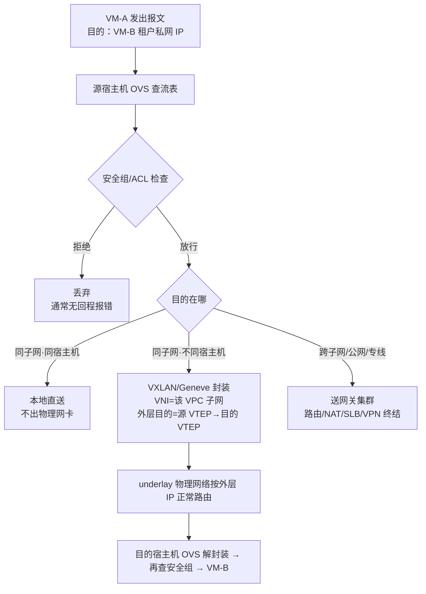
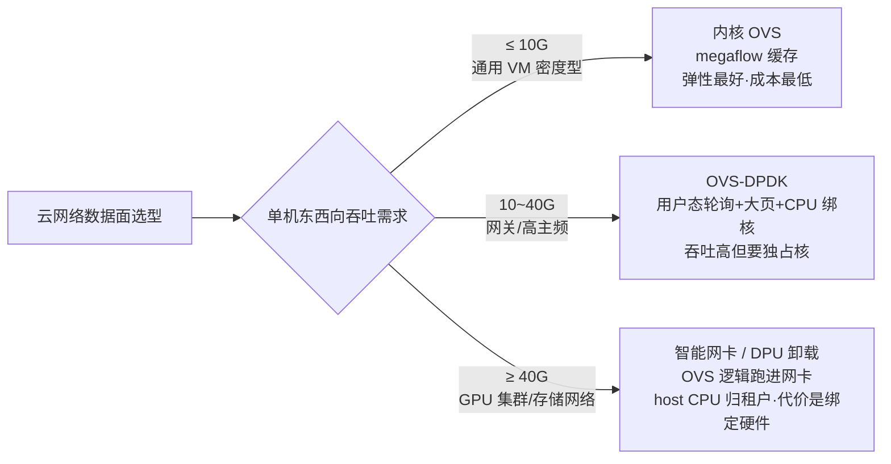

# SDN / NFV：云网络的软件化

> 这篇讲两件事：**SDN 和 NFV 这两条技术线各自解决什么问题、今天在云厂商和私有云里实际是怎么落地的**，以及**做云上网络规划时真正要做的选择和容易踩的坑**。适合已经用过 VPC/安全组/负载均衡、想知道"水面之下发生了什么"的工程师和架构师。读完你应该能回答：一台云主机的报文如何跨越物理网络到达另一台云主机、安全组规则为什么"改一条就全生效"、以及数据面该用内核 vSwitch 还是 DPDK/DPU 卸载。

## 是什么：两条独立又合流的技术线

SDN（Software-Defined Networking，软件定义网络）和 NFV（Network Functions Virtualization，网络功能虚拟化）经常被放在一起说，但从诞生起它们就是**两个不同的问题**：

- **SDN 解决"网络怎么被控制"**：把转发决策（数据面/转发面，负责按表转包）从每一台交换机里抽出来，交给集中的控制程序（控制面），设备只留一张可编程的转发表。
- **NFV 解决"网络功能跑在哪"**：把防火墙、负载均衡、NAT 这些原本跑在专用硬件盒子（俗称"网络设备一体机"）里的功能，变成跑在通用 x86 服务器上的软件。ETSI ISG NFV 在 2012 年 10 月于德国达姆施塔特发表的白皮书就是这轮运动的起点，其核心主张是把网络功能软件与专用硬件解耦（separability）。

ETSI 白皮书特意强调：**NFV 与 SDN 高度互补，但彼此不依赖**——一个 VNF（虚拟网络功能）完全可以不碰 SDN 独立部署。但在云厂商的实践中，两者几乎总是一起出现：VPC 就是"SDN 控制面 + NFV 数据面"的产品化合体。

## 背景：传统网络为什么撑不住云

我在交付中做过不少"传统网络架构改造上云"的项目，传统模式的三个痛点非常一致：

1. **控制逻辑固化在设备里**。改一条策略，要逐台登录交换机/防火墙敲 CLI；变更靠"变更窗口 + 回滚脚本"的人肉流程，出错半径大。
2. **网络能力等于硬件采购**。要加一台负载均衡、一套防火墙，意味着选型、招标、上架、割接，周期以月计。而互联网业务的节奏是按周迭代。
3. **云的根本需求是"网络随 API 创建"**。开一台云主机的同时，它的 IP、安全组、路由、公网出口必须一起就绪——这要求网络具备计算同等级别的可编程性。

把控制面从设备里抽出来（SDN）、把网络功能搬进服务器（NFV），本质都是同一件事：**让网络变成软件**。2004 年前后 IETF 就开始讨论控制与转发分离，2011 年 OpenFlow 协议与 ONF（开放网络基金会）让 SDN 成为产业运动，同年 VMware 以超过 12 亿美元收购 Nicira——后者用 OVS + 集中控制器在通用服务器上做出多租户虚拟网络，是今天所有公有云 VPC 的思想原型。

## 架构与原理：从三层模型到一颗 VXLAN 报文

### SDN 三层：应用 / 控制 / 数据

SDN 的标准分层是把"业务意图"逐层翻译成"转发表项"：


*图源：Wikimedia Commons（[File:SDN-architecture-overview-transparent.png](https://commons.wikimedia.org/wiki/File:SDN-architecture-overview-transparent.png)）*

- **应用平面**：租户 API、编排系统、安全策略引擎，通过**北向接口（NBI）**把"我要一个隔离网络"这类意图下发。
- **控制平面**：SDN 控制器，网络的"大脑"。把意图翻译成每台设备的具体表项，并通过**南向接口**（OpenFlow 是代表协议，实践中也有 NETCONF/gRPC 等）下发。
- **数据平面**：交换机/网卡里的转发引擎，只按表转包，不做决策。

这个模型要注意一个**实践中的偏差**：教科书式"一切查表问控制器"的集中式 SDN 在云里活不久——首包全部上送控制器，性能和时延都崩。云的实现都是"**集中控制、分布式转发 + 本地缓存**"：控制器只在状态变化时重算表项，宿主机上的 vSwitch 用多级缓存自己处理绝大多数报文。

### 云内实现：OVS 与宿主机 vSwitch

Open vSwitch（OVS）是 Linux 内核里的虚拟交换机 + 用户态管理程序，是云网络的"最后一级设备"。它的一个关键设计是**有两层流表**（官方 FAQ 明确区分）：

- **OpenFlow 流表**：控制器/管理程序真正操作的表，支持多表、优先级、通配——表达能力强，但查找慢。
- **数据路径流表（megaflow 缓存）**：OVS 自己管理，单表、无优先级，**只会被动填充**——未命中的报文走"慢路径"上送用户态处理，处理完顺便把结果写进缓存，后续同流报文走"快路径"直达。

这就是 OVS 能做到线速级的原因，也是运维上的第一个坑源：`ovs-ofctl dump-flows` 看的是 OpenFlow 表，`ovs-dpctl dump-flows` 看的是缓存，两者不一致时（比如流表改了但旧缓存未老化）就会出现"策略明明下了却不生效"的假象。

在云的场景里，OVS 的角色是"分布式接入层"——每台宿主机一个实例，逻辑上拼成一整台覆盖全集群的大交换机：


*图源：Wikimedia Commons（[File:Distributed Open vSwitch instance.svg](https://commons.wikimedia.org/wiki/File:Distributed_Open_vSwitch_instance.svg)）*

### VPC 的本质：隧道封装 + 流表隔离

VPC（虚拟私有云）用一句话概括：**在共享物理网络（underlay）之上，用 VXLAN/Geneve 隧道封装 + 流表，"虚拟"出互相隔离的租户网络（overlay）**。

VXLAN 把二层以太网帧封进 UDP（IANA 默认端口 4789，早期实现用 8472），封装头里有 24 位的 VNI（虚拟网络标识）。对比传统 VLAN 的 12 位 ID 只有 4094 个可用网络，VXLAN 提供约 1677 万个段——多租户公有云的前提。两端终结隧道的设备叫 VTEP。它解决了两个运维层面的硬问题：

1. **地址空间可以重叠**：租户 A 和 B 都可以用 10.0.0.0/16，因为封装隔离了"租客地址"与"房东地址"（外层 underlay IP），VM 迁移也不用改 IP。
2. **跨三层跑二层**：以太网帧装在 UDP 里就能穿越任何 IP 路由，同子网的两台 VM 可以分布在机房两端。

一颗报文在 VPC 里的完整旅程（这就是"控制面下发流表、数据面本地缓存"的具体化）：



注意**两次安全组检查**：入方向规则在目的宿主机上执行，出方向在源宿主机上执行。这决定了"安全组是分布式的"这一系列行为特征（后面坑表里会讲）。

BUM 流量（广播/组播/未知单播）是 overlay 的阿喀琉斯之踵：VXLAN 默认要么靠组播复制要么靠头端复制（HER）全网泛洪。Neutron 里的 `l2population` 机制驱动就是专门解决这个的——把远端 MAC 表项直接下发到本地，让未知单播不再泛洪（它不能独立使用，必须搭配 OVS 机制驱动）。

### OVN：给 OVS 加上"逻辑网络"抽象

OVS 只有流表这一层抽象，写 VPC 逻辑全靠上层程序拼。OVN（Open Virtual Network）是 OVS 项目向上长出来的 SDN 控制面：引入**逻辑交换机、逻辑路由器、ACL**这些"网络设备级"抽象，由每台宿主机的 `ovn-controller` 把逻辑拓扑分布式地编译成本机 OpenFlow 流表。它的管线是两库一进程：

- **NB（北向库）**：CMS（OpenStack Neutron、Kubernetes 的 ovn-kubernetes）写入逻辑意图。
- **ovn-northd**：把逻辑意图编译成**SB（南向库）**里的"每主机该做什么"。
- **ovn-controller**：每台宿主机一个，监听 SB，转成 OVS 流表。

这个"中心化编译、分布式执行"的架构解决了集中式控制器的规模与单点问题，是今天开源云网络（以及 K8s 的 OVN-Kubernetes CNI）的主流路线。

### NFV：把网络功能装进服务器

NFV 的参考架构（ETSI）把虚拟化网络拆成三块：


*图源：Wikimedia Commons（[File:NFV Architecture v15 Wiki.svg](https://commons.wikimedia.org/wiki/File:NFV_Architecture_v15_Wiki.svg)）*

- **VNF**：虚拟化的网络功能本体（vFW、vLB、vRouter、vNAT……），跑在 VM 或容器里。
- **NFVI + VIM**：通用服务器/存储/网络硬件 + 虚拟化层，由 VIM（虚拟基础设施管理器，OpenStack 是典型实现）管理。
- **MANO（NFVO/VNFM/EM）**：编排层——服务链怎么串、实例怎么扩缩、故障怎么自愈。运营商场景里这层最难做，也最容易被低估。

公有云的"网络即产品"就是 NFV 思想的产品化：

| 云上产品形态 | 对应 VNF | 典型实现 |
| --- | --- | --- |
| 负载均衡（SLB/ALB 类） | vLB | 网关集群上的软件 LB（LVS/代理类），四层为主、七层独立部署 |
| NAT 网关 | vNAT | 网关集群做 SNAT/DNAT，EIP 终结在网关 |
| 弹性公网 IP（EIP） | 公网地址 + NAT 绑定 | 地址池 + 流表绑定，解耦于实例生命周期 |
| VPN 网关 | vIPSec | 控制面协商 + 数据面集群转发 |
| 专线网关 / VBR | vRouter | 与 underlay 边界路由互连（BGP） |
| 全球加速 / 企业级骨干（CEN 类） | 骨干 vRouter + 隧道 | 跨地域 VPC 互联，利用自建骨干降时延降丢包 |

### 性能演进：内核 → DPDK → DPU

数据面搬到 x86 后最大的质疑就是性能。三代方案的本质是"把 CPU 从收发包里解放出来"的程度不同：



我的经验：**多数私有云场景内核 OVS 加 tuned 参数就够，真正需要 DPDK/DPU 的是两类点——集中网关集群（NAT/LB 流量收口）和 GPU/高性能存储场景**。DPU 卸载是公有云头部玩家近年的军备竞赛方向（把 overlay 封装、安全组、virtio 全搬进网卡），私有云选型时要清醒：DPU 意味着网络能力被锁进硬件供应商的型号清单。

## 实践与选型要点

### 从私有云到公有云：Neutron 的 ML2 插件体系

OpenStack Neutron 是"云网络抽象层"的开源标准实现。ML2（Modular Layer 2）的设计是两类驱动的组合，选型时分别回答"网络用什么技术实现"和"怎么打通"：

| 维度 | 选项 | 适用边界 |
| --- | --- | --- |
| Type driver（网络类型） | flat / vlan / vxlan / gre / geneve | 纯二层通信用 flat/vlan（如裸金属、存储网）；多租户 overlay 用 vxlan/geneve |
| Mechanism driver（落地机制） | openvswitch / **ovn** / sriov / macvtap + l2population（必搭配项） | OVS 路线成熟灵活；**OVN 是演进方向**（大规模、逻辑路由器分布式）；SR-IOV 给低时延裸金属但丧失迁移能力 |
| 路由/NAT 实现 | 集中节点（Network Node）vs 分布式路由（DVR）vs OVN 分布式逻辑路由器 | 集中网关是早期默认，南北向流量大时成瓶颈；生产上至少开 DVR，规模大直接上 OVN |

一段典型的生产配置（ml2_conf.ini），能直观看到三层抽象：

```ini
[ml2]
type_drivers = flat,vlan,vxlan
tenant_network_types = vxlan
mechanism_drivers = openvswitch,l2population
[ml2_type_vxlan]
vni_ranges = 10:1000
```

### 大规模网关集群的三个关键词

公有云把"网关"做成了一个独立问题域（它不在任何 VM 里，而是集群化的 NFV）：

1. **ECMP 横向扩展**：多个网关实例共享一个 VIP/anycast，underlay 用等价多路由负载均衡打散。单点网关故障只是损失 1/N 流量。
2. **一致性哈希会话保持**：同一五元组要稳定落到同一网关实例（否则防火墙会话、SNAT 端口映射会断），扩容时只影响被重映射的少数流。
3. **会话与流量分级**：NAT 网关的瓶颈几乎总是**新建速率（CPS）和并发会话数**，不是带宽——评估云厂商 NAT 产品规格时先看这两个数。

### 混合云接入：专线 + VPN + 骨干

| 方案 | 特点 | 选择建议 |
| --- | --- | --- |
| 物理专线（Direct Connect/VBR 类） | 低时延、稳定带宽、成本高、交付周期长 | 核心系统/数据库同步/大数据上云迁移 |
| IPsec VPN | 当天开通、成本低、加密走公网 | 办公网接入、分支、灾备链路 |
| 骨干互联（CEN 类） | 跨地域 VPC 互联，走运营商/自建骨干 | 多地部署、就近接入；注意它解决的是"云内跨地域"，不是"云下接入" |

经验：**专线 + VPN 互备是标配**，专线断掉时 BGP 走 VPN 备份路径接管。混合云最大的坑不在带宽，在**路由策略**——云上 VPC 路由表、IDC 核心路由、骨干的选路要一张图管起来，否则会出现"能 ping 通 IP 但不通业务"的非对称路由（见坑表）。

### 用户视角：不需要懂 SDN，但要懂 VPC 的三个抽象

给业务方做上云培训时我只讲三件事：

- **地址空间**：一个 VPC 就是一块你独占的私网 CIDR。规划时的铁律见下节。
- **路由**：VPC 是"默认路由到公网出口（IGW/NAT）+ 自定义路由表"的集合，一个子网绑定一张表。
- **安全组**：**有状态**的虚拟防火墙，作用在弹性网卡上——入方向放行后，出方向自动允许回程。规则是"白名单累加"逻辑，且分散在每台宿主机执行。

## 常见坑

| 坑 | 现象 | 根因与对策 |
| --- | --- | --- |
| 安全组"没生效"或"误生效" | 加了 deny 规则流量还在通 / 放行后 ping 不通 | 安全组多数实现是白名单累加（无 deny 语义），排查看"有没有别的安全组放行"；云上没有 ICMP 回程不一定是安全组，查网关侧限速 |
| 只看 OpenFlow 表排障 | `ovs-ofctl` 看到规则没问题，但流量就是不通 | 报文走的是 megaflow 缓存，用 `ovs-dpctl dump-flows` 对照；改表后等缓存老化或手动 `ovs-appctl dpctl/flush`（谨慎） |
| MTU/分片黑洞 | 小包正常、大包卡死，PMTUD 失效 | VXLAN 封装吃 50 字节；underlay 交换机 MTU 没放大到 1600+，或安全组把 ICMP Fragmentation Needed 挡了。统一规划 underlay jumbo frame |
| BUM 泛洪风暴 | 网络周期性抖动，ARP 广播打满 CPU | overlay 未启用 l2population/OVN 本地 MAC 学习，未知单播全网复制。VPC 子网别规划太大（/24 级为宜），控制广播域 |
| VPC CIDR 规划冲突 | 上云两年后混合云互联做不了 / 多 VPC 合并无从下手 | VPC 网段与 IDC 网段重叠、多个收购来的 VPC 网段互撞——**这是最难回滚的上云错误**，只能重建。先规划后建设：留出一段专用于云上，全网 CIDR 一张台账 |
| 安全组当防火墙用 | 全通安全组、规则膨胀到上千条 | 安全组作用于 ENI 粒度、规则宜精不宜多；东西向微隔离交给子网 ACL/微隔离产品或主机层策略，别堆安全组规则（规则规模直接影响宿主机 CPU 开销） |
| VNF 上通用云的弹性幻觉 | 自动扩缩容后吞吐不升反降 | 电信级 VNF 常按 DPDK 独占核设计，弹性调度与绑核冲突；vLB 会话同步在扩容瞬间丢包。NFV 落地要区分"能虚拟化的状态机简单功能"与"高会话状态功能"（后者上集群化网关，别塞进 VM 自扩） |
| 网关集群扩容惊群 | NAT/LB 扩容瞬间大量长连接重置 | 一致性哈希重映射 + 会话未同步。选支持会话热同步的方案，或错峰扩容 + 优雅摘流 |
| 非对称路由 | TCP 建连成功但业务超时/单向通 | 出方向走 NAT 网关、回方向走专线路由，两路径不一致被有状态设备丢弃。混合云排障第一动作：**查双向路径**（云上 `traceroute` + IDC 回程路由核对） |
| 裸金属/SR-IOV 与 overlay 不兼容 | 高性能实例开不进 VPC 特性（安全组/迁移） | SR-IOV 直通绕过 vSwitch，享受了性能就放弃了 SDN 能力；需要二者兼得时选 DPU 方案或接受降级 |

## 实践观点

- **SDN/NFV 是"云的网络地基"，但它的成功恰恰在于用户感知不到它**。评估一个云网络产品好坏的标准不是"用了什么协议"，而是：创建 VPC/SLB 是否秒级、API 语义是否与资源生命周期一致、故障时爆炸半径是否受控。
- **集中控制 + 分布式转发是唯一活下来的架构**。纯集中式控制器（一切查控制器）性能和时延都死在规模化路上；OpenStack 从集中路由节点 → DVR → OVN 分布式路由的十年演进，就是这条规律的注脚。选私有云网络栈同理：逻辑路由器能不能下沉到每台宿主机，是判断架构代际的分水岭。
- **网络是上云规划里唯一"几乎不可回滚"的一层**。计算资源选错可以换、存储选错可以迁，VPC 地址空间规划错了，混合云、多地域、并购整合的债要还很多年。
- **DPU/硬件卸载是头部玩家的游戏**。私有云和中小规模场景，先把内核 OVS + OVN + MTU/泛洪治理这些"软件基本功"做扎实，收益远大于上硬件。

## 站内相关

- [云计算基座导读](/cloud/foundation/) — 本文所在知识域的全貌
- [虚拟化：从 Hypervisor 到云](/cloud/foundation/virtualization) — vSwitch 依附的虚拟机技术底座
- [OpenStack：私有云的操作系统](/cloud/foundation/openstack) — Neutron 所在的开源云平台全貌
- [云网络：VPC、负载均衡与混合云](/cloud/infra/network) — 从租户/使用者视角看云网络产品
- [Kubernetes 核心机制与企业级落地](/cloud/native/kubernetes) — CNI 插件（OVN-Kubernetes/Calico）是 SDN 在容器世界的延伸

## 参考资料

<Refs>

### 文字来源

- [Implementation Details — Open vSwitch FAQ（双层流表与快慢路径）](https://docs.openvswitch.org/en/stable/faq/design/)，访问日期：2026-09-02
- [Architecture — OVN, Open Virtual Network（OVN 组件与逻辑网络抽象）](https://www.ovn.org/en/architecture/)，访问日期：2026-09-02
- [ML2 Plug-in — OpenStack Neutron Documentation（Type/Mechanism 驱动体系与配置）](https://docs.openstack.org/neutron/latest/admin/config-ml2.html)，访问日期：2026-09-02
- [Software-defined networking — Wikipedia（SDN 定义、控制/转发分离、OpenFlow 历史）](https://en.wikipedia.org/wiki/Software-defined_networking)，访问日期：2026-09-02
- [Network function virtualization — Wikipedia（VNF/MANO 定义、ETSI ISG NFV 历史、与 SDN 关系）](https://en.wikipedia.org/wiki/Network_function_virtualization)，访问日期：2026-09-02
- [VXLAN — Wikipedia（封装格式、VNI 规模、VTEP、端口）](https://en.wikipedia.org/wiki/VXLAN)，访问日期：2026-09-02
- [Network Functions Virtualisation (NFV) — ETSI ISG NFV 官方页](https://www.etsi.org/technical-groups/nfv/)，访问日期：2026-09-02
- [ETSI ISG NFV: White Paper — Introductory Technical Perspectives（2012 白皮书，NFV 与 SDN separable 关系）](https://www.cs.princeton.edu/courses/archive/fall13/cos597E/papers/nfv.pdf)，访问日期：2026-09-02

### 图片来源

- [File:SDN-architecture-overview-transparent.png — Wikimedia Commons](https://commons.wikimedia.org/wiki/File:SDN-architecture-overview-transparent.png)，访问日期：2026-09-02
- [File:Distributed Open vSwitch instance.svg — Wikimedia Commons](https://commons.wikimedia.org/wiki/File:Distributed_Open_vSwitch_instance.svg)，访问日期：2026-09-02
- [File:NFV Architecture v15 Wiki.svg — Wikimedia Commons](https://commons.wikimedia.org/wiki/File:NFV_Architecture_v15_Wiki.svg)，访问日期：2026-09-02

</Refs>