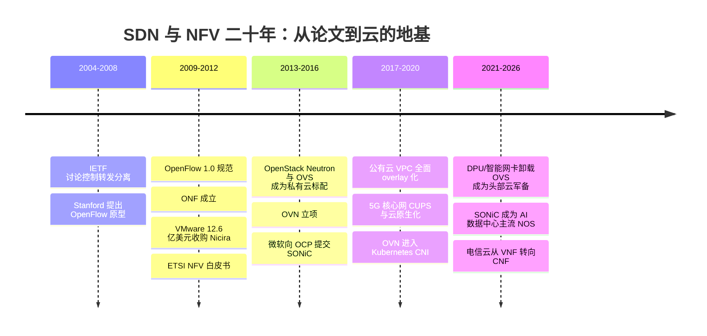
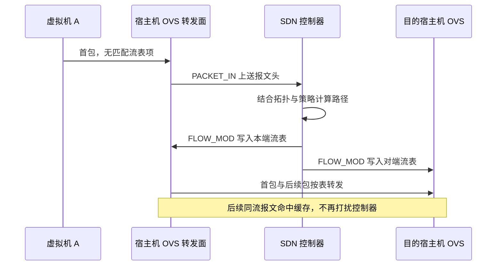
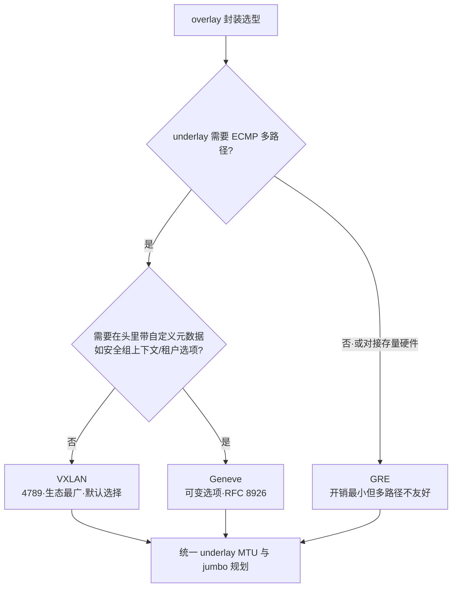
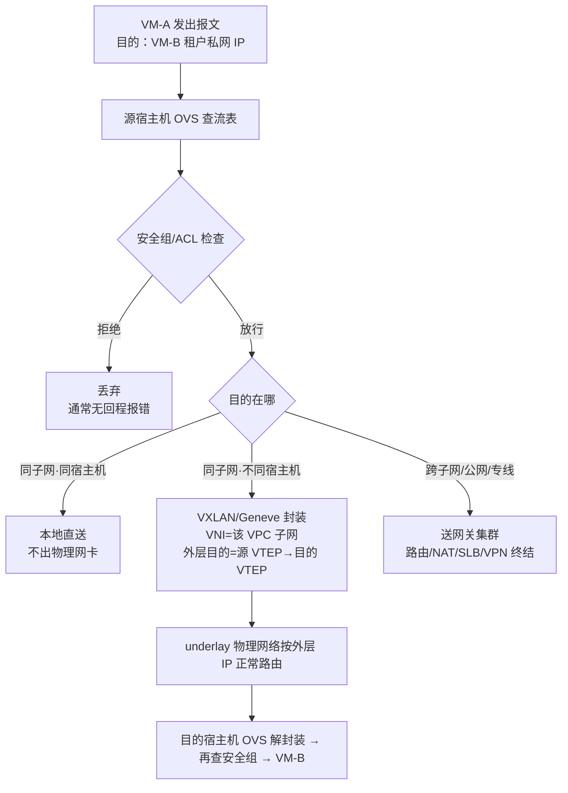
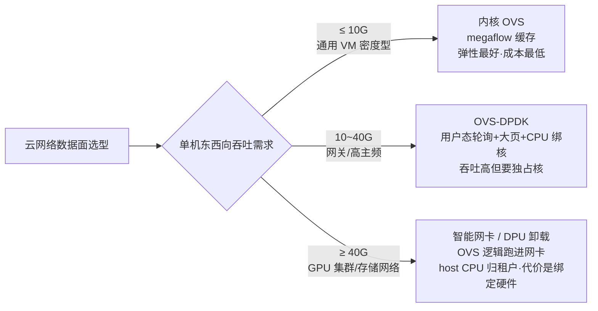

# SDN / NFV：云网络的软件化

> 这篇讲两件事：**SDN 和 NFV 这两条技术线各自解决什么问题、今天在云厂商和私有云里实际是怎么落地的**，以及**做云上网络规划时真正要做的选择和容易踩的坑**。适合已经用过 VPC/安全组/负载均衡、想知道"水面之下发生了什么"的工程师和架构师。读完你应该能回答：一台云主机的报文如何跨越物理网络到达另一台云主机、安全组规则为什么"改一条就全生效"、OpenFlow 流表到底怎么匹配和动作、OVS 的快慢路径差在哪、以及数据面该用内核 vSwitch 还是 DPDK/DPU 卸载。全文主线是"**机制拆开看，再回到工程决策**"：先把控制/转发分离、match-action 流表、VXLAN 封装逐字段拆透，再讲 NFV 电信云为什么起大早赶晚集、白盒交换机与 DPU 把战场推到了哪里，最后收在选型与坑。

## 是什么：两条独立又合流的技术线

SDN（Software-Defined Networking，软件定义网络）和 NFV（Network Functions Virtualization，网络功能虚拟化）经常被放在一起说，但从诞生起它们就是**两个不同的问题**：

- **SDN 解决"网络怎么被控制"**：把转发决策（控制面，负责算路、算策略、算表项）从每一台交换机里抽出来，交给集中的控制程序，设备只留一张可编程的转发表（数据面/转发面，负责按表转包）。
- **NFV 解决"网络功能跑在哪"**：把防火墙、负载均衡、NAT 这些原本跑在专用硬件盒子（俗称"网络设备一体机"）里的功能，变成跑在通用 x86 服务器上的软件。ETSI ISG NFV 在 2012 年 10 月于德国达姆施塔特发表的白皮书就是这轮运动的起点，其核心主张是把网络功能软件与专用硬件解耦（separability）。

ETSI 白皮书特意强调：**NFV 与 SDN 高度互补，但彼此不依赖**——一个 VNF（虚拟网络功能）完全可以不碰 SDN 独立部署。但在云厂商的实践中，两者几乎总是一起出现：VPC 就是"SDN 控制面 + NFV 数据面"的产品化合体。

把两条线放在一起对比，能看清它们各自动的是哪一层：

| 维度 | SDN | NFV |
| --- | --- | --- |
| 回答的问题 | 网络怎么被控制、表项怎么下发 | 网络功能跑在什么硬件上 |
| 动的层 | 交换/路由设备的控制逻辑 | 防火墙/LB/NAT 等功能载体 |
| 核心抽象 | 流表、逻辑拓扑、意图 API | VNF、NFVI、MANO 编排 |
| 代表协议/项目 | OpenFlow、NETCONF/gNMI、OVN、ONOS/OpenDaylight | ETSI NFV 架构、OpenStack Tacker、ONAP/OSM |
| 云产品映射 | VPC 控制面、安全组下发、逻辑路由 | SLB/NAT/VPN 网关集群、云防火墙 |
| 独立成立吗 | 可以（纯转发面可编程） | 可以（VNF 不碰 SDN 也能跑） |

### 一条时间线看两条线怎么合流



## 背景：传统网络为什么撑不住云

我在交付中做过不少"传统网络架构改造上云"的项目，传统模式的三个痛点非常一致：

1. **控制逻辑固化在设备里**。改一条策略，要逐台登录交换机/防火墙敲 CLI；变更靠"变更窗口 + 回滚脚本"的人肉流程，出错半径大。
2. **网络能力等于硬件采购**。要加一台负载均衡、一套防火墙，意味着选型、招标、上架、割接，周期以月计。而互联网业务的节奏是按周迭代。
3. **云的根本需求是"网络随 API 创建"**。开一台云主机的同时，它的 IP、安全组、路由、公网出口必须一起就绪——这要求网络具备计算同等级别的可编程性。

把控制面从设备里抽出来（SDN）、把网络功能搬进服务器（NFV），本质都是同一件事：**让网络变成软件**。IETF 在 2004 年前后就开始讨论控制与转发分离（ForCES 方向的工作），2008 年 Stanford 的 Clean Slate 团队把 OpenFlow 做成可运行的协议，2011 年 ONF（开放网络基金会）成立让它成为产业运动；2012 年 VMware 以约 12.6 亿美元收购 Nicira——后者用 OVS + 集中控制器在通用服务器上做出多租户虚拟网络（NVP，后来演化为 NSX），是今天所有公有云 VPC 的思想原型。

### 控制/转发分离的根本动机

教科书常说"分离是为了集中控制"，但我更愿意从**变更频率的错配**讲起：一台核心交换机的转发行为（查 FIB、匹配 ACL、改写字段、排队出端口）一旦部署就高度稳定，而控制逻辑（路由协议收敛、策略调整、租户开通）却天天在变。把天天变的部分和几乎不变的部分焊在同一颗芯片、同一个固件里，结果是每次改策略都要动转发设备——爆炸半径最大化的设计。分离之后：

- **控制面**承担"算"：跑路由协议/算租户拓扑/翻译策略，输出的是表项；它可以是集群、可以多副本、可以灰度。
- **转发面**承担"跑"：只按表匹配和动作，不产生决策；它因此可以做到极简、极快、可硬件化。
- 两者之间靠一条**可编程接口**连接，这条接口就是后面所有故事的起点（OpenFlow、NETCONF、gNMI、P4Runtime 都是它的不同答案）。

第二个动机是**规模**：云里"一台逻辑交换机"可能横跨几千台宿主机，任何单设备的 CLI 模型都表达不了"全集群一致的一张表"；只有把表的计算权收上来，才能保证几千个数据面节点看到的是同一份意图的编译结果。

### OpenFlow：把分离变成协议的第一次尝试

OpenFlow 是南向接口的开山协议，机制上只有三个词：**match、action、pipeline**。

- **match（匹配）**：一条流表项是一组字段的匹配条件——入端口、源/目的 MAC、VLAN、EtherType、源/目的 IP、IP 协议号、TCP/UDP 端口等。OpenFlow 1.0 是固定 12 元组匹配，1.3 之后字段集合扩展并引入 OXM 编码。
- **action / instructions（动作）**：匹配命中后执行——转发出端口、改写头字段（set-field）、进组表（group，用于广播/ECMP 多出口）、丢弃、或 goto-table 跳下一张表。
- **pipeline（多表流水线）**：交换机内部是 table 0 → table N 的串行流水线，报文从 table 0 进入，按优先级逐表匹配；每张表可以有 table-miss 流表项兜底（送控制器、丢弃或继续）。多表的意义是**职责分层**：table 0 做接入校验、中间表做路由、后表做 ACL 与改写——和云里"安全组表 + 路由表 + NAT 表"的分层是一回事。

控制器与交换机之间走 OpenFlow 通道（TCP/TLS，端口 6653，早期 6633），关键消息只有几类：交换机遇到无表可匹配的报文发 **PACKET_IN** 上送报文头；控制器算好后发 **FLOW_MOD** 写表；**FLOW_STATS / MULTIPART** 拉统计。反应式建流的时序如下：



这张图里藏着云网络的第一性原理：**控制器只处理"状态变化"，不处理"每一个包"**。纯反应式（每个首包都上送）在数据中心规模下时延和控制器容量都撑不住，所以真实系统全部是"集中控制 + 分布式转发 + 本地缓存"。

一组典型的 OpenFlow 流表长这样（用 `ovs-ofctl dump-flows br0` 看到的就是这个形态）：

| 表 | 优先级 | 匹配（match） | 动作（instructions/actions） | 语义 |
| --- | --- | --- | --- | --- |
| 0 | 100 | in_port=1, dl_vlan=100 | goto_table:10 | 接入校验：只认带指定 VLAN 的入口 |
| 10 | 200 | ip, nw_dst=10.0.1.0/24 | set_field:00:00:00:aa:bb:01→eth_dst, output:3 | 子网路由 + 改写目的 MAC |
| 10 | 100 | ip | goto_table:20 | 其余 IP 流量交给 ACL 表 |
| 20 | 300 | tcp, tp_dst=22, nw_src≠10.0.9.0/24 | drop | 安全组语义：非管理网段禁 SSH |
| 20 | 0 | （table-miss） | controller / drop | 兜底：上送控制器或丢弃 |

读这张表要抓住三个工程要点：**优先级决定同表内谁先匹配**（数字大者先）；**多表之间靠 goto-table 串联**，形成"接入 → 路由 → 策略"的流水线；**table-miss 是安全底线**——生产上我要求它必须是 drop 或送控制器审计，绝不允许"默认转发"。OpenFlow 1.3 还引入了 group 表（all/indirect/select 等类型，对应广播与 ECMP 多出口）和 meter 表（限速），云网关的"一个 VIP 打散到 N 个实例"在协议层就是 select group。

南向/北向接口的谱系值得单独记一张表，因为 2026 年的现实是 OpenFlow 已经不是唯一答案：

| 接口方向 | 代表协议 | 语义 | 今天的地位 |
| --- | --- | --- | --- |
| 南向·流表级 | OpenFlow 1.3/1.5 | 下发 match-action 表项 | 学术界与 OVS 生态仍在用；公有云普遍自研协议 |
| 南向·配置级 | NETCONF/YANG、gNMI | 下发配置模型与订阅遥测 | 设备管理主流，白盒与厂商设备通吃 |
| 南向·芯片级 | SAI、P4Runtime | 抽象交换机芯片/可编程流水线 | SONiC 的基石；P4 在电信 UPF 场景活跃 |
| 北向 | REST/意图 API | 提交"我要一个隔离网络" | 各云自研；开源侧由 Neutron/OVN NB 承担 |

### 控制器格局：2025–2026 的现实

截至 2026-09，开源 SDN 控制器的格局和五年前已经完全不同：

| 控制器 | 现状（2026-09 核实） | 工程含义 |
| --- | --- | --- |
| OpenDaylight（LF Networking） | 仍按半年节奏发版：2025.03 Titanium（要求 Java 21）、2025.09 Vanadium 及其 SR 版本；自述"部署最广的开源 SDN 控制器" | 电信与传输网场景的稳妥选择；升级要跟上 Java 版本 |
| ONOS（ONF） | 实质停摆：最后一个大版本是 2.7.0 LTS；ONF 于 2023 年 12 月并入 Linux 基金会并关闭，移交的只有 LF Broadband、Aether、P4 三个项目，ONOS 不在其中；2024 年 11 月批量归档周边仓库 | 新项目不建议选；存量商用发行版另议 |
| OVN（OVS 社区） | 活跃，25.09/26.03 系列持续发版；是 OpenStack 与 Kubernetes（OVN-Kubernetes、Kube-OVN）的事实控制面 | 云网络虚拟化的默认答案，见下文 |
| 公有云自研控制器 | 不公开细节，但行为特征一致：逻辑集中、表项分布式编译下发 | 评估云厂商时看 API 语义与故障半径，不看协议名字 |

我的判断：**"通用开源 SDN 控制器"这条产品路线在云里已经证伪**——云厂商最终都自己写了控制面，开源社区的能量转移到了 OVN（面向虚拟网络）和 SONiC/SAI（面向白盒硬件）这两个更具体的抽象上。ONOS 的退场和 ODL 在电信侧的存续，正好是这条分化的两面。


*图源：Wikimedia Commons（[File:OpenFlow-network-architecture.svg](https://commons.wikimedia.org/wiki/File:OpenFlow-network-architecture.svg)，原图标签为波兰语：上为控制面控制器、中为数据面 OpenFlow 交换机、下为接入主机，橙色线为 OpenFlow 控制通道）*

## 架构与原理：从三层模型到一颗 VXLAN 报文

### SDN 三层：应用 / 控制 / 数据

SDN 的标准分层是把"业务意图"逐层翻译成"转发表项"：


*图源：Wikimedia Commons（[File:SDN-architecture-overview-transparent.png](https://commons.wikimedia.org/wiki/File:SDN-architecture-overview-transparent.png)）*

- **应用平面**：租户 API、编排系统、安全策略引擎，通过**北向接口（NBI）**把"我要一个隔离网络"这类意图下发。
- **控制平面**：SDN 控制器，网络的"大脑"。把意图翻译成每台设备的具体表项，并通过**南向接口**（OpenFlow 是代表协议，实践中也有 NETCONF/gRPC 等）下发。
- **数据平面**：交换机/网卡里的转发引擎，只按表转包，不做决策。

这个模型要注意一个**实践中的偏差**：教科书式"一切查表问控制器"的集中式 SDN 在云里活不久——首包全部上送控制器，性能和时延都崩。云的实现都是"**集中控制、分布式转发 + 本地缓存**"：控制器只在状态变化时重算表项，宿主机上的 vSwitch 用多级缓存自己处理绝大多数报文。

### 云内实现：OVS 深拆

Open vSwitch（OVS）是 Linux 内核里的虚拟交换机 + 用户态管理程序，是云网络的"最后一级设备"。它的一个关键设计是**有两层流表**（官方 FAQ 明确区分）：

- **OpenFlow 流表**：控制器/管理程序真正操作的表，支持多表、优先级、通配——表达能力强，但查找慢。
- **数据路径流表（megaflow 缓存）**：OVS 自己管理，单表、无优先级，**只会被动填充**——未命中的报文走"慢路径"上送用户态处理，处理完顺便把结果写进缓存，后续同流报文走"快路径"直达。

报文的完整查找路径是三级：**EMC（Exact Match Cache，精确匹配缓存）→ megaflow 分类器（带通配的缓存表）→ 慢路径上送 ovs-vswitchd**。EMC 按报文全键哈希，命中即转发，是热流的最快路径；未命中进 megaflow 表做通配匹配（键被"通配化"，一条 megaflow 能覆盖一族流，这是缓存不爆炸的关键）；再未命中才 upcall 到用户态，走完 OpenFlow 流水线后把结果以通配形式回填。后台 revalidator 线程周期性校验缓存表项是否仍与 OpenFlow 表一致、并老化空闲项。

这就是 OVS 能做到线速级的原因，也是运维上的第一个坑源：`ovs-ofctl dump-flows` 看的是 OpenFlow 表，`ovs-dpctl dump-flows` 看的是缓存，两者不一致时（比如流表改了但旧缓存未老化）就会出现"策略明明下了却不生效"的假象。

把三级查找写成伪代码，排障时脑子里跑的就是它：

```text
packet_in(skb):
  key = extract_flow_key(skb)          # 五元组 + 入端口 + VLAN 等
  if hit = emc_lookup(key):            # ① 精确匹配缓存：全键哈希，O(1)
      return execute(hit.actions)
  if hit = megaflow_lookup(key):       # ② 通配缓存：一条表项覆盖一族流
      if emc_should_insert(): emc_insert(key, hit.actions)
      return execute(hit.actions)
  flow = upcall_to_vswitchd(key)       # ③ 慢路径：走完整 OpenFlow 流水线
  megaflow_insert(wildcarded(key), flow.actions)   # 回填通配表项
  return execute(flow.actions)
# 后台 revalidator：周期校验缓存与 OpenFlow 表一致性，老化空闲项
```

日常用得上的命令就四条：`ovs-vsctl show` 看桥与端口拓扑；`ovs-ofctl dump-flows <br>` 看"策略面"；`ovs-dpctl dump-flows` 看"缓存面"（对照两者是排障第一课）；`ovs-appctl dpctl/show` 与 `ovs-appctl upcall/show` 看慢路径压力——**upcall 速率持续升高就是流表抖动或缓存容量不足的信号**，比看 CPU 更早发现问题。

在云的场景里，OVS 的角色是"分布式接入层"——每台宿主机一个实例，逻辑上拼成一整台覆盖全集群的大交换机：


*图源：Wikimedia Commons（[File:Distributed Open vSwitch instance.svg](https://commons.wikimedia.org/wiki/File:Distributed_Open_vSwitch_instance.svg)）*

OVS 的三种数据路径形态，是后面所有性能讨论的地基：

| 数据路径 | 机制 | 量级与代价 | 适用 |
| --- | --- | --- | --- |
| kernel datapath | 内核模块做快路径，upcall 到用户态建缓存 | 缓存命中时 10G 级单机东西向常见；首包与流表抖动时 CPU 冲高 | 通用私有云默认 |
| OVS-DPDK | 用户态 PMD 线程轮询收包，绕开内核协议栈；大页内存 + CPU 绑核 | 单核数 Mpps 级转发、时延更稳；但 PMD 核 7×24 满载，"独占核"是硬成本 | 网关集群、NFV、低时延场景 |
| 硬件卸载（TC flower / DPU） | 把 megaflow 表项写进网卡/DPU 硬件 | 宿主机 CPU 近零开销；受硬件流表容量与特性集限制 | 公有云头部、GPU/存储网络 |

### OVN：给 OVS 加上"逻辑网络"抽象

OVS 只有流表这一层抽象，写 VPC 逻辑全靠上层程序拼。OVN（Open Virtual Network）是 OVS 项目向上长出来的 SDN 控制面：引入**逻辑交换机、逻辑路由器、ACL**这些"网络设备级"抽象，由每台宿主机的 `ovn-controller` 把逻辑拓扑分布式地编译成本机 OpenFlow 流表。它的管线是两库一进程：

- **NB（北向库）**：CMS（OpenStack Neutron、Kubernetes 的 ovn-kubernetes）写入逻辑意图。
- **ovn-northd**：把逻辑意图编译成**SB（南向库）**里的"每主机该做什么"——逻辑流水线被展开成 ingress 管道（端口安全、ACL、二层/三层转发）与 egress 管道（出端口校验、投递）两段。
- **ovn-controller**：每台宿主机一个，监听 SB，转成 OVS 流表。

这个"中心化编译、分布式执行"的架构解决了集中式控制器的规模与单点问题，是今天开源云网络（以及 K8s 的 OVN-Kubernetes CNI）的主流路线。Kube-OVN 的这张拓扑图把"逻辑设备"和"物理节点"的关系画得很清楚——租户 A/B 各自拥有逻辑交换机、逻辑路由器、逻辑 LB，而 VM/Pod 散落在不同物理节点上：


*图源：Kube-OVN 官方仓库文档插图（docs/ovn-network-topology.png，[github.com/kubeovn/kube-ovn](https://github.com/kubeovn/kube-ovn)）*

ovn-northd 把逻辑意图展开成的流水线阶段，理解它才能理解"ACL 为什么不生效"这类问题出在哪一段：

| 管道段 | 代表阶段 | 做什么 |
| --- | --- | --- |
| 逻辑交换机 ingress | port_sec_l2 / acl_eval / l2_lkup | 入端口安全校验、ACL 求值、二层查表 |
| 逻辑交换机 → 路由器 | l3 入口阶段 | 跨子网流量进入逻辑路由器：策略路由、路由查表、TTL、ARP 代答 |
| 逻辑路由器 egress | gw 决策 / nat | 出向网关选择、SNAT/DNAT 应用 |
| 逻辑交换机 egress | acl_eval / port_sec / delivery | 出方向 ACL、端口安全、最终投递到 vif 或隧道 |

排障含义很直接：**同一条 ACL 在 ingress 与 egress 各求值一次**，方向语义和"安全组两次检查"是同构的；而 NAT 发生在路由器段，所以"ACL 放行了但 NAT 后端口不对"要去路由器阶段查。

### VPC 的本质：隧道封装 + 流表隔离

VPC（虚拟私有云）用一句话概括：**在共享物理网络（underlay）之上，用 VXLAN/Geneve 隧道封装 + 流表，"虚拟"出互相隔离的租户网络（overlay）**。

VXLAN（RFC 7348）把二层以太网帧封进 UDP（IANA 默认端口 4789，早期实现用 8472），封装头里有 24 位的 VNI（虚拟网络标识）。对比传统 VLAN 的 12 位 ID 只有 4094 个可用网络，VXLAN 提供约 1677 万个段——多租户公有云的前提。两端终结隧道的设备叫 VTEP。它解决了两个运维层面的硬问题：

1. **地址空间可以重叠**：租户 A 和 B 都可以用 10.0.0.0/16，因为封装隔离了"租客地址"与"房东地址"（外层 underlay IP），VM 迁移也不用改 IP。
2. **跨三层跑二层**：以太网帧装在 UDP 里就能穿越任何 IP 路由，同子网的两台 VM 可以分布在机房两端。

**封装逐字段拆**，这是算 MTU 和带宽账的前提：

| 层 | 字段与长度 | 作用与坑点 |
| --- | --- | --- |
| 外层以太网头 | 14B | 源/目的 MAC = 两台宿主机（VTEP）的 underlay MAC |
| 外层 IP 头 | 20B | 源/目的 IP = VTEP 地址；TTL 独立，overlay 与 underlay 生存期互不影响 |
| 外层 UDP 头 | 8B | 目的端口 4789；**源端口 = 内层流哈希**，给 underlay ECMP 提供熵——这是 VXLAN 能多路径的关键设计 |
| VXLAN 头 | 8B | Flags（I 位有效）+ 24 位 VNI + 保留位；没有 per-hop 状态，纯标识 |
| 内层原始帧 | 完整保留 | 租户的以太网帧原封不动，含其 MAC 与 VLAN（如有） |

合计固定开销 **50 字节**。算两笔账：内层 1500B 的满包，开销约 3.2%；内层 64B 的小包（RPC/ACK 密集场景），开销高达 44%——所以存储与 RPC 型业务评估 overlay 时必须按小包口径复核带宽。MTU 侧的推论：underlay 要么放大到 1550+（通常直接规划 jumbo 9000+），要么接受内层 MTU 降级；PMTUD 被安全组挡掉 ICMP 时就是黑洞（见坑表）。


*图源：Wikimedia Commons（[File:VXLAN-Tunnel.png](https://commons.wikimedia.org/wiki/File:VXLAN-Tunnel.png)，原图西语标签：VTEP 间 VXLAN 隧道跨越 IP 网络）*

一颗单播报文在 overlay 里的标准五步（学习、封装、路由、解封装、投递）：


*图源：Wikimedia Commons（[File:VXLAN-Unicast-2.png](https://commons.wikimedia.org/wiki/File:VXLAN-Unicast-2.png)，编号 1–5 为转发步骤）*

封装不止 VXLAN 一种，选型对比如下：

| 维度 | VXLAN（RFC 7348） | Geneve（RFC 8926） | GRE |
| --- | --- | --- | --- |
| 传输 | UDP 4789 | UDP 6081 | IP 协议号 47，无 UDP |
| 标识 | 24 位 VNI | 24 位 VNI + 协议类型 | 32 位 Key |
| 扩展性 | 头固定 8B，无选项 | **可变长 TLV 选项**，可携带安全组/租户元数据 | 无选项机制 |
| ECMP 友好 | 好（UDP 源端口熵） | 好（同左） | 差（无 L4 端口，靠 Key 熵，部分硬件不支持） |
| 固定开销 | 50B | 50B + 选项 | 约 28–32B |
| 生态 | 最广，云与网络设备默认 | OVN/NSX 等新栈偏好 | 存量专线/老设备互联 |



**underlay 的要求**随之固定下来：足够的 MTU 余量、三层 ECMP 多路径（_leaf-spine 等价路由_）、不依赖组播（用头端复制 HER 或控制面下发 MAC 表项）、以及稳定的 VTEP 地址规划。BUM 流量（广播/组播/未知单播）是 overlay 的阿喀琉斯之踵：VXLAN 默认要么靠组播复制要么靠头端复制（HER）全网泛洪。Neutron 里的 `l2population` 机制驱动就是专门解决这个的——把远端 MAC 表项直接下发到本地，让未知单播不再泛洪（它不能独立使用，必须搭配 OVS 机制驱动）；OVN 路线则天然由控制面维护 MAC 绑定，问题更小。

一颗报文在 VPC 里的完整旅程（这就是"控制面下发流表、数据面本地缓存"的具体化）：



注意**两次安全组检查**：入方向规则在目的宿主机上执行，出方向在源宿主机上执行。这决定了"安全组是分布式的"这一系列行为特征（后面坑表里会讲）。

## NFV：把网络功能装进服务器

### ETSI 参考架构：三层各自负责什么

NFV 的参考架构（ETSI）把虚拟化网络拆成三块：


*图源：Wikimedia Commons（[File:NFV Architecture v15 Wiki.svg](https://commons.wikimedia.org/wiki/File:NFV_Architecture_v15_Wiki.svg)）*

- **VNF**：虚拟化的网络功能本体（vFW、vLB、vRouter、vNAT……），跑在 VM 或容器里。
- **NFVI + VIM**：通用服务器/存储/网络硬件 + 虚拟化层，由 VIM（虚拟基础设施管理器，OpenStack 是典型实现）管理。
- **MANO（NFVO/VNFM/EM)**：编排层——NFVO 管服务与跨 VIM 资源编排，VNFM 管单个 VNF 的生命周期（实例化、扩缩、终止），EM 管功能自身的网管语义。服务链怎么串、实例怎么扩缩、故障怎么自愈都在这层。运营商场景里这层最难做，也最容易被低估：开源的 OSM、ONAP 做了十年，真正跑顺的仍是各家自研或深度定制。

公有云的"网络即产品"就是 NFV 思想的产品化：

| 云上产品形态 | 对应 VNF | 典型实现 |
| --- | --- | --- |
| 负载均衡（SLB/ALB 类） | vLB | 网关集群上的软件 LB（LVS/代理类），四层为主、七层独立部署 |
| NAT 网关 | vNAT | 网关集群做 SNAT/DNAT，EIP 终结在网关 |
| 弹性公网 IP（EIP） | 公网地址 + NAT 绑定 | 地址池 + 流表绑定，解耦于实例生命周期 |
| VPN 网关 | vIPSec | 控制面协商 + 数据面集群转发 |
| 专线网关 / VBR | vRouter | 与 underlay 边界路由互连（BGP） |
| 全球加速 / 企业级骨干（CEN 类） | 骨干 vRouter + 隧道 | 跨地域 VPC 互联，利用自建骨干降时延降丢包 |

### 电信云为什么起大早赶晚集

NFV 最早的买主是运营商：2013–2017 年间，某运营商级别的电信云项目普遍选择"OpenStack + vEPC/vIMS"路线，把 4G 核心网虚拟化成 VNF。十年后回看，这条路线的教训比成果更有价值。vEPC 虚拟化的对象是下面这张 3GPP EPC 架构图里的网元（MME 控制面、S-GW/P-GW 用户面、HSS 等）：


*图源：Wikimedia Commons（[File:Evolved_Packet_Core.svg](https://commons.wikimedia.org/wiki/File:Evolved_Packet_Core.svg)）*

**vEPC 的性能坑**，我归纳为四类（都是公开讨论过的共性问题）：

1. **数据面与调度器打架**。电信级用户面要 DPDK 独占核 + 大页 + NUMA 绑定，而云调度器的假设恰恰是"核可以超卖和迁移"。VNF 一上弹性扩缩，绑核拓扑被打破，吞吐不升反降。
2. **状态让横向扩展失效**。GTP-U 隧道、承载上下文、会话表都是有状态且要求同流同实例的，scale-out 要先解决会话同步——这和公有云网关集群是同一个问题，但电信信令的会话语义复杂一个量级。
3. **MANO 与 OSS/BSS 的集成税**。TOSCA 模板、VNFM 与 EMS 的接口对齐、计费与开通流程改造，往往吃掉项目一半以上工期；"VNF 部署成功"和"业务开通成功"之间隔着整个运营系统。
4. **可用性文化的冲突**。电信要五个九与确定性故障恢复，云要快速迭代与最终一致；两者的变更节奏、灰度方式、回滚语义在同一套平台上长期拉锯。

于是 2019 年之后行业整体转向 **CNF（云原生网络功能）**：5G 核心网从设计上是 SBA（服务化架构，网元间走 HTTP/2 服务接口），控制面网元天然无状态、适合 K8s + Operator 编排；用户面（UPF）单独下沉、单独加速。GSMA 与 TM Forum 的近年的复盘报告给出的结论也一致：先云原生架构、后谈虚拟化收益，顺序反了的项目普遍超期。运营商私有云里 NFV 的真实落地形态（泛化表述）因此是**混合态**：集中 DC 跑 NFVI 承载存量 VNF，边缘 MEC 与 5G 核心新建部分走 K8s + CNF，两套编排并存——这也是我评估电信类项目时默认的起点假设。

### 5G UPF：用户面加速的现状

5G 的 CUPS（控制与用户面分离）把 UPF 变成纯粹的"数据面函数"：GTP-U 封装/解封装、QoS 执行、计费上报、上行分类。它的加速路线分四档：

| 路线 | 机制 | 量级与边界 |
| --- | --- | --- |
| 内核 + XDP/eBPF | 驱动层早丢弃/早转发，保留内核生态 | 10–40G 级，通用 NIC 即可，运维最友好 |
| DPDK / VPP（FD.io） | 用户态轮询，绕过内核 | 单 socket 100G 级；独占核与大页是前提，云原生调度受限 |
| 智能网卡 / DPU 卸载 | GTP-U 与流表进硬件，host 核归业务 | 400G 级单卡；绑定硬件型号与固件生态 |
| P4 可编程流水线 | 交换机/网卡可编程解析 GTP-U | 吞吐与丢包表现好（2025 年 SLICES-SC 的实测对比中 P4-UPF 在吞吐与丢包上领先，VPP-UPF 在功能完整性上占优），但可编程人才稀缺 |

截至 2026-09，公开资料里厂商宣称的单实例 UPF 吞吐已到数百 Gbps 量级（配合智能网卡加速），而学术侧的独立实测仍在提醒：**加速档位的选择不改变"会话状态管理才是 UPF 的复杂源"这一事实**。

顺带把封装账补全：5G 用户面在 overlay 之上还有一层 GTP-U（外层 IP 20B + UDP 8B + GTP-U 头 8B = 36B），所以"运营商租户报文跑在公有云 overlay 上"的极端场景是 GTP-U + VXLAN 双层封装、固定开销 86 字节——做 MEC 与云互联方案时，内层 MTU 与小包带宽效率必须按这个口径复核，这也是 UPF 尽量下沉到靠近用户侧（减少一层隧道）的工程动机之一。

### VNF 谱系：性能量级与硬件对比

| VNF 类型 | 典型实现 | 软件方案量级（公开资料/经验量级） | 对照专用硬件 | 状态敏感度 |
| --- | --- | --- | --- | --- |
| vRouter | FRR、DPDK 路由套件 | 单节点数 Mpps–数十 Mpps 转发 | ASIC 路由器 T 级 | 低（转发表可重建） |
| vFW | 状态检测防火墙软件 | 10–100G，受会话表与检测深度限制 | 专用 FW 盒子百 G–T 级 | 高（会话表） |
| vLB | LVS/DPDK/代理类 | 四层 10–100G、百万级 CPS | 硬件 LB 已边缘化 | 中（连接表可同步） |
| vNAT / CGNAT | 网关集群软件 | 瓶颈在 CPS 与并发会话（千万级端口映射） | 专用 CGN 设备 | 高 |
| SD-WAN CPE / vCPE | 分支盒子或云端实例 | 百 M–数 G 每站点 | — | 中 |
| vEPC / vUPF | 见上节 | 视加速档位 10G–400G | 专用核心网设备 | 高 |

经验结论：**状态机简单、可无状态化的功能（LB 四层、NAT 无会话模式、路由）虚拟化收益最大；强会话状态 + 深度检测的功能（FW、CGNAT）虚拟化后要么接受性能折损，要么走上"集群化网关 + 会话同步"的专用设计**——公有云最终选的是后者。

### 服务链 SFC 与 NSH：一个"标准赢了论文、输了工程"的案例

SFC（Service Function Chaining，RFC 7665）要解决的问题是：让流量按"防火墙 → IPS → 负载均衡"的顺序穿过一串网络功能，而不是靠手工串 VLAN。架构角色有：分类器（Classifier，给流量打链标记）、SFF（转发器，把流量递送给功能节点）、SF（功能本体）。承载标记的协议是 **NSH（Network Service Header，RFC 8300）**：8 字节基础头 + 服务路径头（24 位 SPI 路径标识 + 8 位 SI 路径内位置索引）+ 可选元数据（MD Type 1 固定 16 字节上下文）。


我的判断：NSH 作为标准是完备的，但在云里**几乎没有赢过"流表 + 网关串联"的工程方案**——云的每个 vSwitch 本来就握着全量流表，用流表把下一跳指向某个 SF 集群的 VIP，比在报文里塞一个新头更简单、对硬件更友好；SI/SPI 的语义被"服务链策略对象 + 流表重定向"替代。SFC/NSH 真正存活的地方是运营商跨域编排和多厂商互联场景。做企业方案时我的默认建议：**先用云厂商的服务链/网关串联能力，把 NSH 留给确有多厂商互通需求的场景**。

## 白盒与开放网络：SDN 思想对硬件的反向征服

### SONiC：从 Azure 内部工具到行业默认 NOS

SONiC（Software for Open Networking in the Cloud）是微软 2016 年在 OCP 上开源的交换机操作系统：把交换机软件拆成一组容器（swss/orchagent、syncd、bgp、snmp、telemetry、teamd、pmon……），中间用 Redis 数据库做总线，向下经 **SAI（Switch Abstraction Interface）** 统一不同芯片 SDK。这个"容器化 NOS + 芯片抽象层"的结构，本质是把 SDN 的"控制逻辑软件化"推进到了盒式交换机内部：


*图源：SONiC DASH 项目官方高层设计文档插图（[github.com/sonic-net/DASH](https://github.com/sonic-net/DASH)，single DPU 架构：SONiC 容器栈 + SAI/DASH 接口 + 硬件）*

一张真实的 SONiC 交换机 CLI 长这样（Ubuntu 24.04 基座的发行版，`show platform syseeprom` 读白盒 EEPROM）：


*图源：Canonical 官方博客 SONiC 一文（[ubuntu.com/blog](https://ubuntu.com/blog/sonic-the-open-source-network-operating-system-for-modern-data-centers)）*

截至 2026-09 的采用情况（公开资料核实）：

- **微软 Azure 全网默认 NOS**：官方博客称 SONiC 是驱动 Microsoft Global Cloud 的交换软件；Azure 的 DASH SmartSwitch 把云网络服务（NAT/LB/网关）卸载到智能交换层，生产规模数据为 1.53 Tbps 吞吐、1920 万 CPS、2.56 亿并发连接，该工作发表于 NSDI 2026 并获 Community Award。
- **治理与生态**：SONiC 现由 Linux 基金会下的 SONiC Foundation 治理（2025 年 10 月 OCP Global Summit 上宣布加速企业 AI 负载方向）；Cisco、Nokia、Dell、Arista 生态外的白盒厂商（Edge-core 等）与 Ubuntu/Canonical 均提供发行版。
- **市场量级**：650 Group 预计 SONiC 相关数据中心交换收入 2026 年超过 50 亿美元、同比约 25% 增长，AI 数据中心是主要拉动。
- **与 SDN 的关系**：SONiC 本身不带集中控制器，但它把"交换机可被软件定义"做成了硬件侧的事实标准——gNMI/OpenConfig 管理、SAI 芯片抽象、容器化组件，都是 SDN 思想的延续。

**边界判断**：白盒 + SONiC 的收益（成本、迭代速度、可编程性）只在"有团队能 own 住 NOS"的前提下成立——超大规模云、大型互联网公司、运营商数据中心是天然用户；企业园区网没有这个团队时，商用 NOS 的支持合同仍然是更便宜的选择。

### OpenConfig / gNMI：配置与遥测的模型驱动化

SDN 的另一个遗产是"设备管理也要模型驱动"。OpenConfig 是运营商主导的开源 YANG 模型集，gNMI 是其配套的 gRPC 接口：`Get/Set` 读写配置树、`Subscribe` 订阅遥测流（STREAM/ONCE/POLL 三种模式）。它替代的是 SNMP 轮询模型——后者典型轮询间隔 5–30 分钟，而 gNMI 是设备侧变化即推送，秒级甚至亚秒级可见。

| 世代 | 接口 | 模型 | 故障可见性 | 现状 |
| --- | --- | --- | --- | --- |
| 第一代 | SNMP + CLI | MIB / 自由文本 | 分钟级轮询 | 存量巨大，不会消失 |
| 第二代 | NETCONF/RESTCONF + YANG | IETF 模型 + 厂商模型 | 配置可靠、遥测仍弱 | 传输网/电信主流 |
| 第三代 | gNMI + OpenConfig | 运营商统一模型 | 推送式流遥测 | 数据中心/白盒事实标准；厂商覆盖深度不一 |

实践提醒两点：一是**模型存在 ≠ 设备实现**，同一 OpenConfig 路径在不同厂商（甚至同厂商不同芯片）上的覆盖深度差异很大，落地前必须逐路径验证；二是 IETF 的 YANG-Push（RFC 8639–8641）与 gNMI 长期并存，跨域选型时先确认对端生态站哪边。工具侧 gNMIc 是事实标准的 CLI 客户端，做验证和排障都很好用。

## 性能演进：内核 → DPDK → DPU

数据面搬到 x86 后最大的质疑就是性能。三代方案的本质是"把 CPU 从收发包里解放出来"的程度不同：



我的经验：**多数私有云场景内核 OVS 加 tuned 参数就够，真正需要 DPDK/DPU 的是两类点——集中网关集群（NAT/LB 流量收口）和 GPU/高性能存储场景**。DPU 卸载是公有云头部玩家近年的军备竞赛方向（把 overlay 封装、安全组、virtio 全搬进网卡）：AWS 的 Nitro、Azure 的 Boost、Google 的 IPU 是同一思路的自研实现，商用侧以 NVIDIA BlueField 系列为代表（BlueField-3 为 400Gb/s 档，2025 年发布的 BlueField-4 进一步面向 AI 工厂的统一网络管理），单卡可承接相当于数百个 CPU 核的基础设施工作量级（厂商标称口径）。


*图源：NVIDIA 官网 BlueField DPU 产品页（[nvidia.com](https://www.nvidia.com/en-us/networking/products/data-processing-unit/)）*

卸载的具体内容是：把 OVS 的 megaflow 表项（含连接跟踪 conntrack）写进 DPU 硬件流表，host 侧只保留控制面与慢路径；收益是 host CPU 100% 归租户、转发时延更确定。但"卸载"不是全有或全无，硬件流表有自己的能力边界：

| 能力 | 卸载到 DPU 的成熟度 | 说明 |
| --- | --- | --- |
| VXLAN/Geneve 封装解封装 | 成熟 | 最基础的卸载项 |
| megaflow 通配表项 | 成熟但容量有限 | 硬件表项数是硬上限，流表规模大的租户要评估 |
| conntrack 连接跟踪 | 成熟（近世代） | 安全组有状态语义的前提 |
| NAT / 限速 / 计数 | 基本成熟 | 与流表联动 |
| 复杂 ACL（千条级规则组） | 视型号 | 规则编译进硬件的时延与容量差异大 |
| 慢路径与首包处理 | 不卸载 | 仍回 host 或 DPU 内 ARM 核，这是兜底正确性的关键 |

与虚拟化的关系见站内[虚拟化一文](/cloud/foundation/virtualization)：SR-IOV 解决"VM 直连物理网卡"，DPU 解决"直连之后 SDN 能力不丢"——两者是同一枚硬币的两面。私有云选型时要清醒：**DPU 意味着网络能力被锁进硬件供应商的型号清单**，固件升级节奏、流表容量上限、特性集差异都变成新的供应链问题。

## 实践与选型要点

### 从私有云到公有云：Neutron 的 ML2 插件体系

OpenStack Neutron 是"云网络抽象层"的开源标准实现。ML2（Modular Layer 2）的设计是两类驱动的组合，选型时分别回答"网络用什么技术实现"和"怎么打通"：

| 维度 | 选项 | 适用边界 |
| --- | --- | --- |
| Type driver（网络类型） | flat / vlan / vxlan / gre / geneve | 纯二层通信用 flat/vlan（如裸金属、存储网）；多租户 overlay 用 vxlan/geneve |
| Mechanism driver（落地机制） | openvswitch / **ovn** / sriov / macvtap + l2population（必搭配项） | OVS 路线成熟灵活；**OVN 是演进方向**（大规模、逻辑路由器分布式）；SR-IOV 给低时延裸金属但丧失迁移能力 |
| 路由/NAT 实现 | 集中节点（Network Node）vs 分布式路由（DVR）vs OVN 分布式逻辑路由器 | 集中网关是早期默认，南北向流量大时成瓶颈；生产上至少开 DVR，规模大直接上 OVN |

一段典型的生产配置（ml2_conf.ini），能直观看到三层抽象：

```ini
[ml2]
type_drivers = flat,vlan,vxlan
tenant_network_types = vxlan
mechanism_drivers = openvswitch,l2population
[ml2_type_vxlan]
vni_ranges = 10:1000
```

### 大规模网关集群的三个关键词

公有云把"网关"做成了一个独立问题域（它不在任何 VM 里，而是集群化的 NFV）：

1. **ECMP 横向扩展**：多个网关实例共享一个 VIP/anycast，underlay 用等价多路由负载均衡打散。单点网关故障只是损失 1/N 流量。
2. **一致性哈希会话保持**：同一五元组要稳定落到同一网关实例（否则防火墙会话、SNAT 端口映射会断），扩容时只影响被重映射的少数流。
3. **会话与流量分级**：NAT 网关的瓶颈几乎总是**新建速率（CPS）和并发会话数**，不是带宽——评估云厂商 NAT 产品规格时先看这两个数。

### 混合云接入：专线 + VPN + 骨干

| 方案 | 特点 | 选择建议 |
| --- | --- | --- |
| 物理专线（Direct Connect/VBR 类） | 低时延、稳定带宽、成本高、交付周期长 | 核心系统/数据库同步/大数据上云迁移 |
| IPsec VPN | 当天开通、成本低、加密走公网 | 办公网接入、分支、灾备链路 |
| 骨干互联（CEN 类） | 跨地域 VPC 互联，走运营商/自建骨干 | 多地部署、就近接入；注意它解决的是"云内跨地域"，不是"云下接入" |

经验：**专线 + VPN 互备是标配**，专线断掉时 BGP 走 VPN 备份路径接管。混合云最大的坑不在带宽，在**路由策略**——云上 VPC 路由表、IDC 核心路由、骨干的选路要一张图管起来，否则会出现"能 ping 通 IP 但不通业务"的非对称路由（见坑表）。

### 云网络控制面的故障域：评估云厂商时问这四个问题

SDN 架构把"控制"集中之后，故障域也随之改变。我做云厂商评估时固定问四个问题，答案直接决定生产事故的形态：

| 组件失效 | 数据面行为 | 爆炸半径 | 我要求的兜底 |
| --- | --- | --- | --- |
| 控制器/控制面整体不可用 | 已下发流表继续转发，**存量业务不断**；新建资源与变更冻结 | 变更停摆而非业务中断 | 控制面多 AZ 部署、变更队列可回放 |
| 单台宿主机 OVS/agent 异常 | 仅该宿主机上的实例网络异常 | 单宿主机 | agent 崩溃重启后表项可从控制面全量重建 |
| 网关集群单实例故障 | ECMP 收敛，损失 1/N 容量 | 秒级抖动 | 会话同步或客户端重试可吸收 |
| underlay 单链路/单 leaf 故障 | overlay 隧道重收敛到其余路径 | 取决于 ECMP 重新哈希的范围 | 隧道源端口熵 + 对称哈希，避免全量重哈希 |

这张表的读法：**好的云网络设计让每一行的爆炸半径都严格小于上一行**。如果厂商答不出"控制面挂了存量流量会怎样"，基本可以判断其数据面对控制面存在运行时依赖——这是架构代际问题，不是运维问题。

### 企业视角：SD-WAN 与 SASE 的 2026 现状

SD-WAN 是 SDN 思想在企业分支侧的产品化：集中控制器下发分支选路策略，underlay 可以是 MPLS、宽带、4G/5G 任意组合。到 2026 年，这条线已经被安全叙事吸收——**SASE（Secure Access Service Edge，把 SD-WAN 与零信任/云安全网关捆成一个服务边缘）**成为采购单元：

- Gartner 已把"Single-Vendor SASE"品类更名为 **SASE Platforms** 并发布 2026 年魔力象限；其早年预测"到 2026 年 60% 的新 SD-WAN 采购将作为单厂商 SASE 的一部分"（2022 年该比例为 15%）基本兑现了方向。
- Dell'Oro 数据：2026 年一季度 SASE 收入超 30 亿美元、同比 +21%，并上调长期预测至 2030 年约 238 亿美元；AI 治理与分支安全是新增拉动。
- 格局上 Netskope、Palo Alto、Cato、Zscaler、Fortinet、Cisco 等在各家口径的 2026 MQ 中互有胜负；选型时别只看象限，看**分支形态与云化程度**。

| 场景 | 建议路线 | 理由 |
| --- | --- | --- |
| 分支少、核心在 IDC | 传统路由 + 专线/VPN | SD-WAN 的收益（多链路选路、集中策略）不抵复杂度 |
| 分支多、应用已云化 | SD-WAN 或单厂商 SASE | 分支直连云入口，回传流量消失；策略集中下发 |
| 远程办公占比高、安全合规强 | SASE（含零信任访问） | 安全策略跟随身份而非位置，分支盒子瘦身 |
| 多厂商存量安全投资重 | 双厂商/集成式 SASE | 保留 SSE 投资，WAN 侧渐进替换 |

分支切到 SD-WAN/SASE 时我的验收清单（按顺序执行，跳步必返工）：

1. **先盘应用流向**：哪些应用已云化（应直连云入口）、哪些还在 IDC（保留回传路径），这张表决定策略模板；
2. **双链路并行跑两周**：新链路与旧 MPLS/专线并存，用拨测对比时延与丢包，不靠厂商 PPT 决策；
3. **策略平移而非重写**：把现有防火墙策略按"身份 + 应用"重述一遍再下发，直接搬 IP 五元组会把 SD-WAN 用成贵一点的专线；
4. **回退路径常备**：分支设备保留本地 breakout 与旧链路热备，控制器失联时分支必须能自主转发（这是"控制/转发分离"在分支侧的同一原则）；
5. **把遥测接进现有监控**：gNMI/流遥测或厂商 API 对接到统一看板，避免"又多一个孤立控制台"。

### 用户视角：不需要懂 SDN，但要懂 VPC 的三个抽象

给业务方做上云培训时我只讲三件事：

- **地址空间**：一个 VPC 就是一块你独占的私网 CIDR。规划时的铁律见下节。
- **路由**：VPC 是"默认路由到公网出口（IGW/NAT）+ 自定义路由表"的集合，一个子网绑定一张表。
- **安全组**：**有状态**的虚拟防火墙，作用在弹性网卡上——入方向放行后，出方向自动允许回程。规则是"白名单累加"逻辑，且分散在每台宿主机执行。

## 常见坑

| 坑 | 现象 | 根因与对策 |
| --- | --- | --- |
| 安全组"没生效"或"误生效" | 加了 deny 规则流量还在通 / 放行后 ping 不通 | 安全组多数实现是白名单累加（无 deny 语义），排查看"有没有别的安全组放行"；云上没有 ICMP 回程不一定是安全组，查网关侧限速 |
| 只看 OpenFlow 表排障 | `ovs-ofctl` 看到规则没问题，但流量就是不通 | 报文走的是 megaflow 缓存，用 `ovs-dpctl dump-flows` 对照；改表后等缓存老化或手动 `ovs-appctl dpctl/flush`（谨慎） |
| MTU/分片黑洞 | 小包正常、大包卡死，PMTUD 失效 | VXLAN 封装吃 50 字节；underlay 交换机 MTU 没放大到 1600+，或安全组把 ICMP Fragmentation Needed 挡了。统一规划 underlay jumbo frame |
| BUM 泛洪风暴 | 网络周期性抖动，ARP 广播打满 CPU | overlay 未启用 l2population/OVN 本地 MAC 学习，未知单播全网复制。VPC 子网别规划太大（/24 级为宜），控制广播域 |
| VPC CIDR 规划冲突 | 上云两年后混合云互联做不了 / 多 VPC 合并无从下手 | VPC 网段与 IDC 网段重叠、多个收购来的 VPC 网段互撞——**这是最难回滚的上云错误**，只能重建。先规划后建设：留出一段专用于云上，全网 CIDR 一张台账 |
| 安全组当防火墙用 | 全通安全组、规则膨胀到上千条 | 安全组作用于 ENI 粒度、规则宜精不宜多；东西向微隔离交给子网 ACL/微隔离产品或主机层策略，别堆安全组规则（规则规模直接影响宿主机 CPU 开销） |
| VNF 上通用云的弹性幻觉 | 自动扩缩容后吞吐不升反降 | 电信级 VNF 常按 DPDK 独占核设计，弹性调度与绑核冲突；vLB 会话同步在扩容瞬间丢包。NFV 落地要区分"能虚拟化的状态机简单功能"与"高会话状态功能"（后者上集群化网关，别塞进 VM 自扩） |
| 网关集群扩容惊群 | NAT/LB 扩容瞬间大量长连接重置 | 一致性哈希重映射 + 会话未同步。选支持会话热同步的方案，或错峰扩容 + 优雅摘流 |
| 非对称路由 | TCP 建连成功但业务超时/单向通 | 出方向走 NAT 网关、回方向走专线路由，两路径不一致被有状态设备丢弃。混合云排障第一动作：**查双向路径**（云上 `traceroute` + IDC 回程路由核对） |
| 裸金属/SR-IOV 与 overlay 不兼容 | 高性能实例开不进 VPC 特性（安全组/迁移） | SR-IOV 直通绕过 vSwitch，享受了性能就放弃了 SDN 能力；需要二者兼得时选 DPU 方案或接受降级 |
| OVS-DPDK 独占核的隐性账单 | 集群 CPU 账面充足但可售卖率莫名低 | PMD 核 7×24 满载且不参与调度；规划时按"每 NUMA 节点至少 1–2 个 PMD 核 + 每 10G 级流量追加"估，且监控要单独看 PMD 利用率（满载即瓶颈前兆） |
| DPU/卸载的固件与特性集差异 | 升级后个别流表特性失效、流表容量告警 | 硬件流表容量与特性集随固件版本变化；把"卸载命中率的监控"和"固件版本矩阵"纳入变更管理，别把 DPU 当免运维黑盒 |
| 服务链过度设计 | 为两三个安全功能引入 NSH/全链编排，排障复杂度翻倍 | 云内优先用流表重定向 + 网关串联；NSH 留给跨厂商/跨域场景（见 SFC 一节） |

## 实践观点

- **SDN/NFV 是"云的网络地基"，但它的成功恰恰在于用户感知不到它**。评估一个云网络产品好坏的标准不是"用了什么协议"，而是：创建 VPC/SLB 是否秒级、API 语义是否与资源生命周期一致、故障时爆炸半径是否受控。
- **集中控制 + 分布式转发是唯一活下来的架构**。纯集中式控制器（一切查控制器）性能和时延都死在规模化路上；OpenStack 从集中路由节点 → DVR → OVN 分布式路由的十年演进，就是这条规律的注脚。选私有云网络栈同理：逻辑路由器能不能下沉到每台宿主机，是判断架构代际的分水岭。
- **网络是上云规划里唯一"几乎不可回滚"的一层**。计算资源选错可以换、存储选错可以迁，VPC 地址空间规划错了，混合云、多地域、并购整合的债要还很多年。
- **DPU/硬件卸载是头部玩家的游戏**。私有云和中小规模场景，先把内核 OVS + OVN + MTU/泛洪治理这些"软件基本功"做扎实，收益远大于上硬件。
- **电信云的教训适用于所有"把硬实时系统搬进通用云"的项目**：先改架构（无状态化、控制用户面分离），再谈虚拟化与编排；顺序反了，MANO 再强也救不回绑核与会话状态。
- **开放网络的红利属于有工程团队的组织**。SONiC/白盒/gNMI 把选择权还给用户的同时，也把 NOS 的运维责任还给用户；没有团队 own 住它时，商业支持合同仍是更便宜的保险。

## 站内相关

- [云计算基座导读](/cloud/foundation/) — 本文所在知识域的全貌
- [虚拟化：从 Hypervisor 到云](/cloud/foundation/virtualization) — vSwitch/SR-IOV/DPU 依附的虚拟机技术底座
- [OpenStack：私有云的操作系统](/cloud/foundation/openstack) — Neutron 所在的开源云平台全貌
- [云网络：VPC、负载均衡与混合云](/cloud/infra/network) — 从租户/使用者视角看云网络产品
- [Kubernetes 核心机制与企业级落地](/cloud/native/kubernetes) — CNI 插件（OVN-Kubernetes/Kube-OVN/Calico）是 SDN 在容器世界的延伸

## 参考资料

<Refs>

### 标准与原始文献

- [RFC 7348: VXLAN — A Framework for Overlaying Virtualized Layer 2 Networks over Layer 3 Networks](https://www.rfc-editor.org/rfc/rfc7348) — VXLAN 封装格式、VNI、4789 端口的权威定义（访问日期 2026-09-05）
- [RFC 8926: Geneve — Generic Network Virtualization Encapsulation](https://www.rfc-editor.org/rfc/rfc8926) — Geneve 可变选项头与 6081 端口（访问日期 2026-09-05）
- [RFC 8300: Network Service Header (NSH)](https://www.rfc-editor.org/rfc/rfc8300) — NSH 基础头/SPI/SI/元数据结构（访问日期 2026-09-05）
- [RFC 7665: Service Function Chaining (SFC) Architecture](https://www.rfc-editor.org/rfc/rfc7665) — SFC 的 Classifier/SFF/SF 角色模型（访问日期 2026-09-05）
- [ETSI ISG NFV: White Paper — Introductory Technical Perspectives（2012 白皮书，NFV 与 SDN separable 关系）](https://www.cs.princeton.edu/courses/archive/fall13/cos597E/papers/nfv.pdf) — NFV 运动起点原文（访问日期 2026-09-05）

### 官方博客与文档

- [Implementation Details — Open vSwitch FAQ（双层流表与快慢路径）](https://docs.openvswitch.org/en/stable/faq/design/) — EMC/megaflow/慢路径机制的官方说明（访问日期 2026-09-05）
- [Releases — Open vSwitch documentation（版本节奏：3.5/3.6/3.7 LTS/4.0）](https://docs.openvswitch.org/en/stable/faq/releases/) — OVS 发版与 LTS 策略（访问日期 2026-09-05）
- [Architecture — OVN, Open Virtual Network（OVN 组件与逻辑网络抽象）](https://www.ovn.org/en/architecture/) — 两库一进程与逻辑流水线（访问日期 2026-09-05）
- [Releases — OVN project（25.09/26.03 系列）](https://www.ovn.org/en/releases/) — OVN 版本现状（访问日期 2026-09-05）
- [ML2 Plug-in — OpenStack Neutron Documentation（Type/Mechanism 驱动体系与配置）](https://docs.openstack.org/neutron/latest/admin/config-ml2.html) — ML2 驱动组合与 ml2_conf 示例（访问日期 2026-09-05）
- [OpenDaylight Downloads — Vanadium documentation](https://docs.opendaylight.org/en/stable-vanadium/downloads.html) — ODL 2025–26 发版现状（访问日期 2026-09-05）
- [Why the ONF shut down — Light Reading](https://www.lightreading.com/open-ran/why-the-onf-shut-down) — ONF 2023 年 12 月并入 Linux 基金会、ONOS 未随迁的背景（访问日期 2026-09-05）
- [SONiC: The networking switch software that powers the Microsoft Global Cloud — Azure Blog](https://azure.microsoft.com/en-us/blog/sonic-the-networking-switch-software-that-powers-the-microsoft-global-cloud/) — SONiC 在 Azure 的地位（访问日期 2026-09-05）
- [SONiC Foundation Accelerates Ecosystem Growth — Linux Foundation（2025-10 OCP）](https://www.linuxfoundation.org/press/sonic-foundation-accelerates-ecosystem-growth-and-global-adoption-as-the-leading-open-source-nos-optimized-for-enterprise-ai-workloads) — SONiC 治理与 AI 负载方向（访问日期 2026-09-05）
- [Offloading Cloud Network Services at Production Scale with SONiC DASH SmartSwitch — Microsoft Research（NSDI 2026）](https://www.microsoft.com/en-us/research/publication/offloading-cloud-network-services-at-production-scale-with-sonic-dash-smartswitch/) — Azure 生产规模卸载数据（1.53 Tbps/19.2M CPS/256M 并发）（访问日期 2026-09-05）
- [SONiC DASH High Level Design — github.com/sonic-net/DASH](https://github.com/sonic-net/DASH) — SONiC 容器栈/SAI/DASH 架构图来源（访问日期 2026-09-05）
- [SONiC: The open source network operating system for modern data centers — Canonical Blog](https://ubuntu.com/blog/sonic-the-open-source-network-operating-system-for-modern-data-centers) — Ubuntu 基座 SONiC 发行版与 CLI 截图来源（访问日期 2026-09-05）
- [BlueField Networking Platform — NVIDIA](https://www.nvidia.com/en-us/networking/products/data-processing-unit/) — DPU 产品线与卸载定位（访问日期 2026-09-05）
- [OpenConfig](https://www.openconfig.net/) — 运营商主导的 YANG 模型与 gNMI 遥测项目（访问日期 2026-09-05）
- [gNMIc — OpenConfig 官方 CLI 客户端](https://gnmic.openconfig.net/) — gNMI 验证与排障工具（访问日期 2026-09-05）
- [Migration from Physical to Virtual Network Functions: Best Practices and Lessons Learned — GSMA](https://www.gsma.com/futurenetworks/5g/migration-from-physical-to-virtual-network-functions-best-practices-and-lessons-learned/) — 运营商 VNF 迁移复盘（访问日期 2026-09-05）
- [Cloud Native in Telecom — Ericsson](https://www.ericsson.com/en/cloud-native) — 电信云原生化（CNF）路线与部署经验（访问日期 2026-09-05）
- [Five characteristics of a cloud-native network function — RCR Wireless（2025-03）](https://rcrwireless.com/20250320/5g/five-cnf-traits) — CNF 特征清单（访问日期 2026-09-05）
- [Software-defined networking — Wikipedia（SDN 定义、控制/转发分离、OpenFlow 历史）](https://en.wikipedia.org/wiki/Software-defined_networking) — 背景与历史校核（访问日期 2026-09-05）
- [Network function virtualization — Wikipedia（VNF/MANO 定义、ETSI ISG NFV 历史、与 SDN 关系）](https://en.wikipedia.org/wiki/Network_function_virtualization) — 背景与历史校核（访问日期 2026-09-05）
- [VXLAN — Wikipedia（封装格式、VNI 规模、VTEP、端口）](https://en.wikipedia.org/wiki/VXLAN) — 封装参数校核（访问日期 2026-09-05）
- [Network Functions Virtualisation (NFV) — ETSI ISG NFV 官方页](https://www.etsi.org/technical-groups/nfv/) — ETSI NFV 规范族入口（访问日期 2026-09-05）

### 行业报告与数据

- [SONiC Market to Exceed $5B in 2026 for Data Center Switching — 650 Group](https://650group.com/press-releases/sonic-market-to-exceed-5b-in-2026-for-data-center-switching-according-to-650-group/) — 白盒/SONiC 市场量级（访问日期 2026-09-05）
- [SASE 1Q 2026 Revenue Climbs 21 Percent to Over $3B — Dell'Oro Group](https://www.delloro.com/news/sase-1q-2026-revenue-climbs-21-percent-to-over-3-b-driven-by-ai-governance/) — SASE/SD-WAN 市场现状（访问日期 2026-09-05）

### 图片来源

- [File:SDN-architecture-overview-transparent.png — Wikimedia Commons](https://commons.wikimedia.org/wiki/File:SDN-architecture-overview-transparent.png) → `sdn-architecture-overview.png`（访问日期 2026-09-05）
- [File:Distributed Open vSwitch instance.svg — Wikimedia Commons](https://commons.wikimedia.org/wiki/File:Distributed_Open_vSwitch_instance.svg) → `distributed-ovs-instance.png`（访问日期 2026-09-05）
- [File:NFV Architecture v15 Wiki.svg — Wikimedia Commons](https://commons.wikimedia.org/wiki/File:NFV_Architecture_v15_Wiki.svg) → `nfv-architecture.png`（访问日期 2026-09-05）
- [File:OpenFlow-network-architecture.svg — Wikimedia Commons](https://commons.wikimedia.org/wiki/File:OpenFlow-network-architecture.svg) → `openflow-network-architecture.png`（访问日期 2026-09-05）
- [File:VXLAN-Tunnel.png — Wikimedia Commons](https://commons.wikimedia.org/wiki/File:VXLAN-Tunnel.png) → `vxlan-tunnel-encapsulation.png`（访问日期 2026-09-05）
- [File:VXLAN-Unicast-2.png — Wikimedia Commons](https://commons.wikimedia.org/wiki/File:VXLAN-Unicast-2.png) → `vxlan-unicast-flow.png`（访问日期 2026-09-05）
- [File:Evolved_Packet_Core.svg — Wikimedia Commons](https://commons.wikimedia.org/wiki/File:Evolved_Packet_Core.svg) → `evolved-packet-core.png`（访问日期 2026-09-05）
- [kube-ovn 仓库 docs/ovn-network-topology.png — GitHub](https://github.com/kubeovn/kube-ovn) → `ovn-network-topology.png`（访问日期 2026-09-05）
- [sonic-net/DASH 仓库 HLD 插图 — GitHub](https://github.com/sonic-net/DASH) → `dash-single-dpu-architecture.svg`（访问日期 2026-09-05）
- [Canonical 博客 SONiC 一文插图](https://ubuntu.com/blog/sonic-the-open-source-network-operating-system-for-modern-data-centers) → `sonic-ubuntu-blog.png`（访问日期 2026-09-05）
- [NVIDIA BlueField 产品页图](https://www.nvidia.com/en-us/networking/products/data-processing-unit/) → `bluefield-platform.jpg`（访问日期 2026-09-05）

站内相关：[虚拟化：从 Hypervisor 到云](/cloud/foundation/virtualization) · [OpenStack：私有云的操作系统](/cloud/foundation/openstack) · [云网络：VPC、负载均衡与混合云](/cloud/infra/network) · [Kubernetes 核心机制与企业级落地](/cloud/native/kubernetes)

</Refs>
