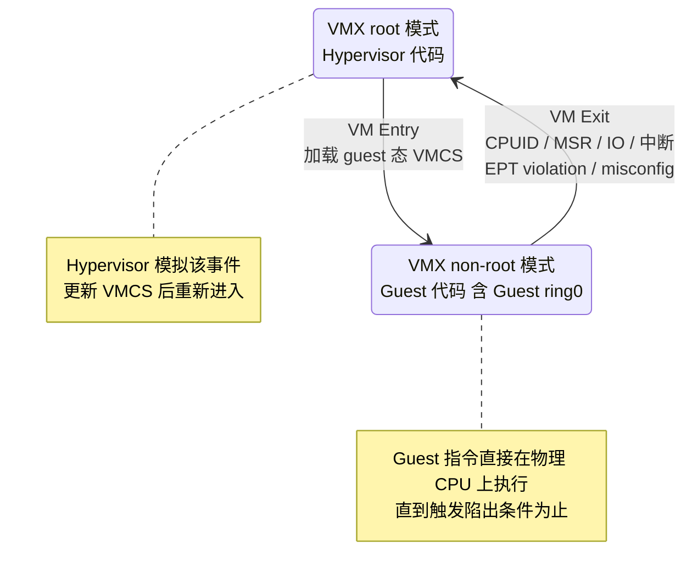
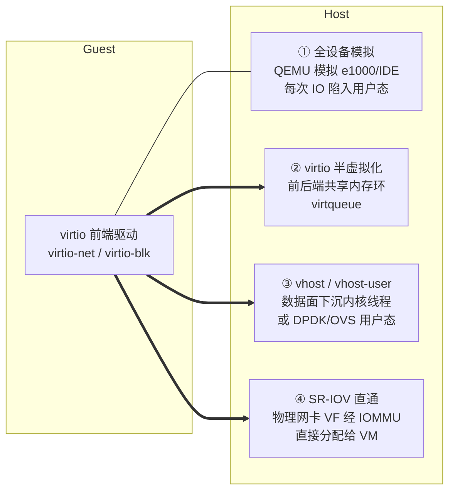
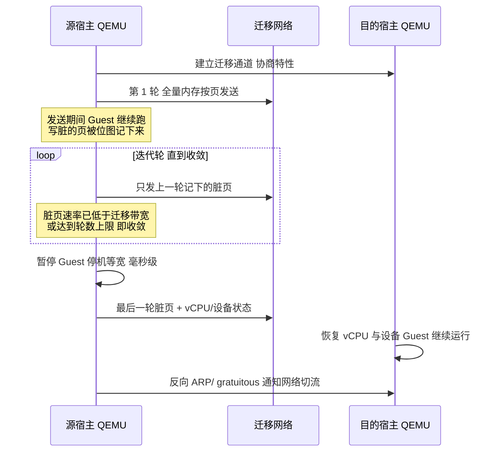
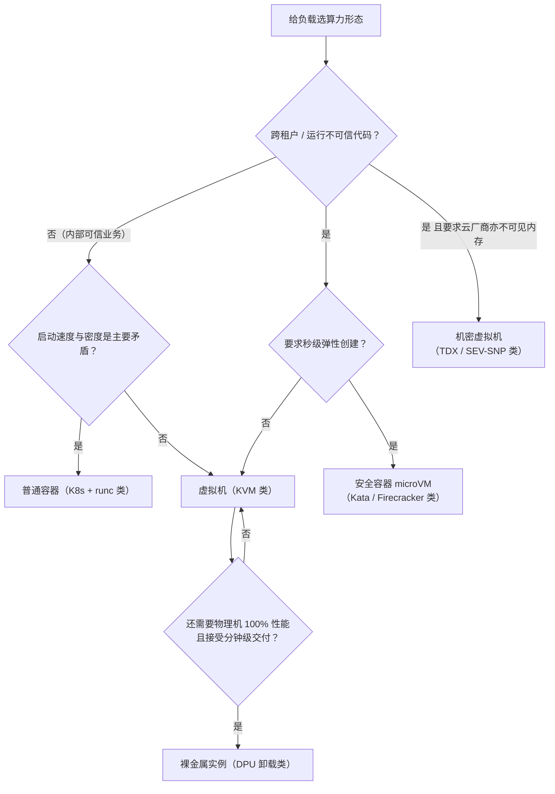
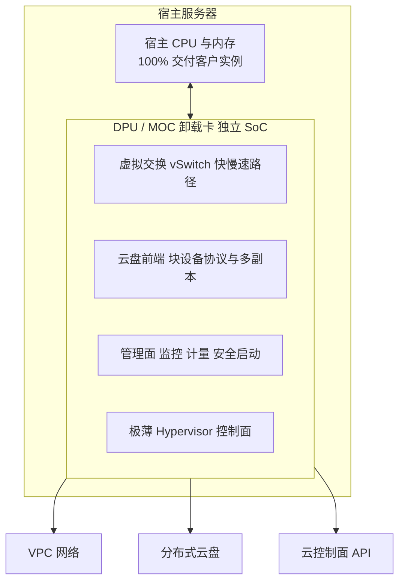

# 虚拟化与 KVM

> 这篇写给两类人：正在理解 IaaS 底层如何工作的工程师，以及需要为负载选算力形态（虚拟机 / 容器 / 安全容器 / 裸金属 / 机密虚拟机）的架构师。全文围绕一个问题展开：**一台物理机如何被安全、高效、弹性地变成 N 台"机器"**。沿这条主线逐层拆开：三条虚拟化技术路线各自解决了什么问题、硬件辅助虚拟化的机制级原理（VT-x 的 root/non-root 模式切换、EPT/NPT 二级地址翻译）、KVM 与 QEMU 为什么长成现在的分工、IO 路径四阶段演进（设备模拟 → virtio → vhost → SR-IOV 直通）的性能差距在哪、内存超卖与热迁移怎么做到生产可用、Nitro/神龙/DPU 如何把虚拟化损耗压到趋零、容器与虚拟机的隔离边界、以及截至 2026 年嵌套虚拟化与机密计算的可用状态；最后给出一串一线最容易踩的坑。不讲论文综述，只讲一线怎么用、坑在哪。

## 是什么：把一台物理机变成 N 台互不干扰的"机器"

虚拟化（Virtualization）在本文的语境里指**硬件平台虚拟化**：在一台物理机上，通过 Hypervisor（虚拟机管理器）同时运行多个彼此隔离的虚拟机（Guest），每台 Guest 都认为独占一套 CPU、内存、磁盘和网卡。


*图源：Wikimedia Commons（[来源页](https://commons.wikimedia.org/wiki/File:Hardware_Virtualization_(copy).svg)）*

几个容易混淆的名词先钉死：

- **Hypervisor / VMM**：真正"骗过"Guest、分配硬件时间的软件层。典型产品：ESXi、Hyper-V、Xen、KVM。
- **Guest / Host**：客户机（跑在里面的 OS）/ 宿主机（承载虚拟化的物理机）。
- **vCPU**：不是一种硬件，而是宿主机上的一个普通线程，被调度进"虚拟 CPU 模式"运行 Guest 代码。这个理解在后面排障时非常关键。
- **VM Entry / VM Exit**：CPU 进入 Guest 模式执行 / 从 Guest 模式陷回 Hypervisor 的两次方向相反的切换。后文几乎所有性能讨论都建立在这对概念上。

历史脉络简版：虚拟化不是 x86 的原创——1960 年代 IBM 大型机 CP/CMS 就是多虚拟机分时；x86 上真正跑通是 1999–2001 年 VMware 用**二进制翻译**技术攻克了 x86 指令集"不可虚拟化"的难题；2003 年 Xen 选择了**半虚拟化**路线；2006–2007 年 Intel VT-x / AMD-V 硬件辅助虚拟化普及，同年 KVM 合入 Linux 内核主线。此后十余年，x86 世界的事实标准收敛为 **KVM + QEMU + virtio** 这一开源组合；2017 年之后，这条主线又长出两个新分支：**IO 与控制面卸载到专用硬件**（AWS Nitro、阿里神龙、各类 DPU）和**机密计算**（Intel TDX / AMD SEV-SNP），本文都会覆盖。

## 为什么需要虚拟化：三个不可回避的矛盾

提纲阶段我列过三点，站在一线视角它们至今成立，而且互相咬合：

1. **利用率矛盾**。一台物理机独占跑一个应用，CPU 平均利用率长期在个位数到百分之十几（我参与的绝大多数传统机房整合项目都在这个量级）；虚拟化把碎片拼成资源池，这是它最初也最硬的商业理由。
2. **隔离性需求**。多租户共用资源池，安全边界必须存在。虚拟机提供的是**硬件级隔离**——Guest 有自己独立内核，跨 VM 逃逸在理论上要攻破 Hypervisor + 内核两道墙，这也是"为什么容器出现多年后，云厂商仍把跨租户算力默认做成虚拟机"的原因。
3. **弹性供给的前提**。虚拟机的本质是**把"机器"这个物理实体变成了可编排的资源单元**：创建/销毁从数周采购压缩到分钟级，快照、热迁移、动态调整都建立在"机器即软件状态"之上。没有这一步，就没有今天的 IaaS 计费模型与自动化运维。

一句话：**虚拟化不是性能优化，是云的生产关系**。它决定了谁能和谁共享一台机器、故障域划多大、资源怎么计费。

## 三条技术路线，与 Type-1 / Type-2 之分

### 全虚拟化、半虚拟化、硬件辅助

| 路线 | 原理 | 代表 | 优点 | 代价 |
| --- | --- | --- | --- | --- |
| 全虚拟化 | Guest 不感知虚拟化，敏感指令由 VMM 拦截翻译（二进制翻译 / 影子页表） | VMware Workstation、VirtualBox、早期 VMware ESX | 不改 Guest，Windows 直接跑 | 实现复杂，早期性能差 |
| 半虚拟化 | Guest 明知自己是虚拟机，主动调用 Hypervisor 接口（hypercall） | Xen 早期（需改内核）、virtio 驱动 | 避开最昂贵的指令拦截 | Guest 必须装特定驱动，闭源系统难适配 |
| 硬件辅助 | CPU/芯片组原生提供虚拟化指令与模式切换 | Intel VT-x / AMD-V、EPT / NPT、VT-d / AMD-Vi | 性能接近原生，全虚拟化的兼容性 | 依赖硬件，仍要解决 IO 与内存开销 |

三者不是替代关系，而是**叠加关系**：今天的 KVM = 硬件辅助 CPU 虚拟化 + 硬件辅助内存虚拟化 + 半虚拟化 IO（virtio），Guest 里的 Windows/Linux 一个都不用改内核。

### 补一节：x86 为什么曾经"不可虚拟化"

理解硬件辅助为什么是革命，得先知道它革的是谁的命。经典虚拟化理论（Popek–Goldberg 准则）要求：**所有敏感指令在低特权级执行时必须陷入陷阱**，VMM 才有机会接管。x86 偏偏不满足——有一批指令的行为依赖当前特权级（读标志寄存器、改中断使能、访问段寄存器等），但它们在用户态执行时**静默成功或静默失败，不产生异常**。VMware 的解法是二进制翻译：把 Guest 内核代码在装载时动态改写，将敏感指令替换成陷入调用，同时把 Guest 内核压在 ring 1、Guest 应用留在 ring 3（ring 压缩）。内存侧对应的是**影子页表**：Guest 维护自己的页表，VMM 在背后维护一份"Guest 虚拟地址 → 宿主机物理地址"的影子页表给 MMU 用，Guest 每次写 CR3、每次改页表项，VMM 都要靠写保护陷阱同步一遍。

这套软件方案工程上极其精彩，但代价也直接：翻译缓存的维护、页表同步的陷阱风暴、TLB 的频繁刷新，构成了早期虚拟化性能损耗的两大来源——**特权指令陷出**与**内存翻译同步**。硬件辅助虚拟化正是把这两件事交给了 CPU。

### 硬件辅助 CPU 虚拟化：VT-x / AMD-V 的模式切换机制

VT-x 给 CPU 增加了两种操作模式：**VMX root 模式**（Hypervisor 自己跑）与 **VMX non-root 模式**（Guest 代码跑）。Guest 即使在 non-root 的 ring 0 里执行特权指令，也碰不到真实硬件状态——CPU 硬件保证：一旦 Guest 做了约定的"敏感动作"（执行 CPUID、访问特定 MSR、IO 端口访问、EPT 页表缺失、外部中断到达等），自动触发 **VM Exit** 切换到 root 模式，由 Hypervisor 模拟该动作的效果后再 **VM Entry** 回去。两次切换之间的 Guest 全部状态（寄存器、中断状态、控制位）保存在一块内存结构 **VMCS** 里（AMD SVM 对应 VMCB），切换时由硬件加载/保存，不需要软件逐条搬运。



这张状态机的工程含义有三条：

1. **Guest 的绝大多数指令零开销直跑**，损耗集中在 VM Exit/Entry 的切换本身。一次切换的成本在微秒量级（不同代际 CPU 与 exit 原因下从数百纳秒到数微秒不等），所以优化方向是**减少 exit 次数**而不是"让 exit 更快"。
2. **exit 原因分布就是病因分布**。宿主侧用 `perf kvm stat live` 看热点：外部中断类 exit 过多往往是中断路由没开 APICv/AVIC（硬件中断虚拟化，把虚拟中断注入也交给 CPU）；EPT violation 集中说明 Guest 在频繁建页表；MMIO 类 exit 集中说明 IO 还在走设备模拟。
3. **VMCS 是每 vCPU 一份的硬件契约**。这也是嵌套虚拟化（VM 里再跑 Hypervisor）复杂度的根源：L1 的 VMCS 要被 L0 再虚拟一层，靠 VMCS shadowing 等特性缓解，后文另述。

### 内存虚拟化：从影子页表到 EPT/NPT 二级地址翻译

CPU 虚拟化解决指令陷出，内存虚拟化解决地址翻译。Guest 看到两级地址：Guest 虚拟地址（GVA）与 Guest 物理地址（GPA）；宿主还有一级宿主机物理地址（HPA）。MMU 最终需要 GVA→HPA 的映射，问题是谁来维护它：

- **影子页表（软件方案）**：VMM 直接维护 GVA→HPA 页表喂给 MMU。Guest 每次切页表（写 CR3）、每次改页表项都要陷出同步，且 VMM 必须对 Guest 页表内存做写保护监控；TLB 里缓存的是影子映射，Guest 与宿主之间切换还要刷 TLB。页表密集型负载（进程频繁创建销毁、大内存 mmap/munmap）下陷阱风暴非常明显。
- **EPT / NPT（硬件方案，合称 SLAT 二级地址翻译）**：CPU 里放**两套页表机构**——Guest 自己的页表负责 GVA→GPA，Hypervisor 维护的 EPT 页表负责 GPA→HPA，MMU 硬件自动做**两级串行走表**。Guest 改页表完全无感知、无陷出，影子页表的同步成本整体消失。


*图源：ACRN 项目官方文档 Memory Management High-Level Design 插图（[来源页](https://projectacrn.github.io/latest/developer-guides/hld/hv-memmgt.html)）*

代价是页表行走变贵：理论上一次 GVA→HPA 翻译最坏要走"4 层 Guest 页表 × 每层再走 EPT"的二维行走，常被引用的最坏值是二十余次内存访问（原生只需 4–5 次）。但实践中这个最坏值几乎不出现——**TLB 与各级 translation cache 会缓存二级翻译结果**，配合 **VPID/ASID**（给 TLB 表项打虚拟机标签，VM 切换不必刷 TLB），稳态下的内存访问开销可以忽略。我的经验边界：EPT 开启 + 大页 + 绑核的 CPU/内存密集负载，虚拟化损耗在个位数百分比内；而影子页表时代同样的负载能差出数倍，这就是"2008 年前后 EPT/NPT 落地是内存虚拟化分水岭"的含义。

| 维度 | 影子页表 | EPT / NPT（SLAT） |
| --- | --- | --- |
| 映射维护者 | VMM 软件同步 | 硬件两级走表 |
| Guest 改页表代价 | 写保护陷阱 + 同步 | 无陷出，零感知 |
| TLB 切换 | 需刷新 | VPID/ASID 打标免刷 |
| 最坏翻译成本 | 低（一级表） | 高（二维走表，靠 cache 兜底） |
| 工程含义 | 仅存在于无 SLAT 的老硬件/嵌套场景 | 今天所有生产环境的默认前提 |

### Type-1 还是 Type-2

这是面试和选型里被问烂但值得说清的分类：


*图源：Wikimedia Commons（[来源页](https://commons.wikimedia.org/wiki/File:Hyperviseur.svg)）*

- Type-1（裸金属型）：ESXi、Xen、Hyper-V。生产数据中心主流。
- Type-2（宿主型）：VirtualBox、VMware Workstation、桌面 KVM/QEMU。开发测试方便。
- **KVM 的定位有争议**：Red Hat 官方口径是把 Linux 内核变成 Type-1 Hypervisor（KVM 以内核模块身份直接管理 VM Entry/Exit）；也有观点认为 Linux 依然直接跑在硬件上、整体更像 Type-2 结构。**我的判断是：这个分类对排障和选型没有实际意义，知道争议存在即可**——工程上更该关心的是下一节的实际分工。

## KVM/QEMU 架构：内核管 CPU 和内存，用户态管设备

KVM 的设计哲学是"不重造操作系统"：它不做调度、不做内存分配、不做驱动——这些 Linux 内核已经干了四十年。KVM 只往内核里加了一个 `/dev/kvm` 字符设备和一组 ioctl API（官方文档《The Definitive KVM API》），把内核改造成能承载虚拟机的宿主；**设备模拟（磁盘、网卡、主板芯片组、ACPI……）全部交给用户态的 QEMU**。


*图源：Wikimedia Commons（[来源页](https://commons.wikimedia.org/wiki/File:Kernel-based_Virtual_Machine_zh-CN.svg)）*

从这张图能读出三个关键工程事实：

1. **vCPU = QEMU 进程里的线程**。Guest 的调度公平性、CPU 配额、绑核，全部复用 Linux 调度器（cgroup 也能直接管 vCPU）——这是"内核即 Hypervisor"红利：宿主运维工具（top、perf、cgroup）对虚拟机同样有效。
2. **Guest 执行不经过模拟**。有 VT-x 后，Guest 指令直接在物理 CPU 上跑到触发 VM Exit 为止。所以**纯计算负载的虚拟化开销可以做到个位数百分比以内（我压测的经验值：CPU-bound 基准 <5%，边界条件是绑核、无超分、开 EPT）**。
3. **每次 VM Exit 都有成本**（保存/恢复上下文 + 陷入用户态），中断、异常、影子页表缺失都触发 VM Exit。优化虚拟化性能的半壁江山，就是在**减少 VM Exit 次数**。

### 一条完整请求路径：从 /dev/kvm 的 ioctl 到 VM Exit

把上面三句话落成调用链，QEMU 启动一台 VM 的主干是：

```text
open("/dev/kvm")
  ioctl KVM_CREATE_VM            # 得到一个 VM fd，代表一台虚拟机的内核态上下文
  ioctl KVM_SET_USER_MEMORY_REGION  # 把 QEMU 进程的内存注册为 Guest 物理内存
                                    # 内核据此建 EPT 映射：GPA -> 这段 HVA/HPA
  ioctl KVM_CREATE_VCPU          # 每个 vCPU 一个 fd，QEMU 为它起一个线程
  ioctl KVM_SET_SREGS / MSR...   # 灌入初始寄存器状态，让 Guest 从复位向量起步

vCPU 线程主循环:
  while true:
    ioctl KVM_RUN                # 进入 non-root 模式，Guest 开跑
    # ---- 硬件在 Guest 态直跑，直到触发 VM Exit ----
    switch exit_reason:
      KVM_EXIT_IO / KVM_EXIT_MMIO:   # Guest 访问了模拟设备
          交给 QEMU 设备模型模拟（读写 virtio 寄存器 / e1000 寄存器等）
      KVM_EXIT_HLT / IRQ_WINDOW...:  内核态直接处理或调度让位
      KVM_EXIT_SHUTDOWN / FAIL:      异常路径，记录并处置
```

注意两个细节。其一，**Guest 物理内存就是 QEMU 进程的一段匿名内存**，EPT 把 GPA 映射到它——所以宿主机视角下"VM 的内存"完全服从 Linux 内存管理（大页、NUMA 策略、OOM、swap 都作用于它），这也是后文内存超卖全部手段的立足点。其二，**慢路径才进用户态**：纯计算不 exit；内存访问走 EPT 不 exit；只有"碰到模拟设备"和"外部事件到达"才 exit。于是 KVM 后来补了两个关键机制把 virtio 的通知路径也变成快路径：**ioeventfd**（Guest 写某个 MMIO 地址 → 内核直接通知后端，不必 exit 到 QEMU）与 **irqfd**（后端完成 IO → 内核直接注入虚拟中断，不必回到 QEMU 线程）。这两者是 virtio 数据面能下沉到 vhost 的前提。

### 设备模型与机型版本：QEMU 侧的"ABI 契约"

QEMU 承担的不只是设备模拟，还有一台"整机"的定义：芯片组（q35 / 老 pc-i440fx）、ACPI 表、PCI 拓扑、固件（SeaBIOS/OVMF）。这套定义就是**机型（machine type）**，它是 Guest 可见的硬件 ABI——Guest 内核按它枚举设备、按 ACPI 表理解拓扑。由此产生一条容易被忽视的生产纪律：**机型与 QEMU 版本要一起进"兼容性账本"**。

- 升级 QEMU 而保持机型不变，Guest 看到的硬件不变，这是热迁移与快照跨版本存活的前提；QEMU 的机型版本化（pc-q35-x.y 逐年冻结）就是为这个设计的。
- 反过来，**换机型等于换主板**：Guest 里驱动枚举、PCI 槽位、固件变量都可能变，必须按"换硬件"的流程灰度重启验证，绝不能跟着 QEMU 升级顺手切换。
- 固件选择上，新池子我默认 OVMF（UEFI）：安全启动链、大磁盘（>2T 的 GPT 体验）、与现代 OS 的兼容性都更顺；SeaBIOS 只留给老镜像兼容池。

这套"ABI 契约"思维也解释了云厂商的行为：实例族的"代际"背后往往就是机型 + CPU 基线模型 + 固件的组合冻结，同代内可迁、跨代要评估，不是营销话术而是兼容性工程。

### 中断与时钟虚拟化：两个隐性税种

IO 路径之外，还有两笔常被忽略的虚拟化税：**中断**与**时钟**。

中断侧的朴素路径是：物理中断到达 → VM Exit → Hypervisor 判断该投给哪个 vCPU → 等该 vCPU 进入"中断窗口"时通过 VMCS 注入虚拟中断 → Guest 的中断处理程序开始跑。一次外部中断至少一次 exit，网卡每秒几十万中断就是几十万次 exit——这就是早期"单 VM 打满整台宿主"的经典病因。硬件中断虚拟化（Intel APICv / AMD AVIC，配合 **posted interrupt**）把这件事改成：中断直接写入一块"posted-interrupt 描述符"，CPU 硬件在 vCPU 运行时**无需 exit** 直接投递虚拟中断；vCPU 不在运行时才通知宿主调度。直通场景（SR-IOV/GPU）下这项几乎是必开项，否则设备中断风暴会把宿主吃掉。

时钟侧同理：Guest 的周期定时器（PIT/HPET/RTC 模拟）每次 tick 都是一次 exit。解法是半虚拟化时钟——**kvm-clock**（Linux Guest）/**pvticlock**（Windows Guest）：宿主把时间信息写进一块共享页，Guest 读页即得时间，零 exit；再配合宿主对 TSC 的 offset/scaling 管理，保证迁移、暂停恢复后 Guest 时间连续。时钟类故障的根因几乎都是"Guest 没用对时钟源"或"宿主 TSC 不稳"：老硬件跨 socket TSC 不同步、Guest 里被误切成 hpet 时钟源、高 steal 下时间记账偏差，表现都是 Guest 时间漂移或跳变。对策是镜像层就固定时钟源、宿主侧 chrony/PTP 兜底、监控里加 Guest 与宿主的时间偏差项。

| 机制 | 无硬件辅助 | 有硬件辅助 | 工程含义 |
| --- | --- | --- | --- |
| 外部中断投递 | 每次中断 VM Exit + 软件注入 | APICv/AVIC + posted interrupt，运行中免 exit | 高 PPS 与直通场景的先决条件 |
| vCPU 间 IPI | exit 模拟 | IPI virtualization 硬件合并 | 多 vCPU Guest 的调度噪声下降 |
| 周期定时 | PIT/HPET 模拟，每 tick exit | kvm-clock/pvticlock 共享页读时间 | 镜像交付时就要确认时钟源 |
| 迁移后时间连续 | 依赖软件补偿 | TSC offset/scaling | 异构宿主迁移前验证 TSC 特性 |

### IO 虚拟化演进：真正的性能战场

CPU 几乎免费之后，差距全在 IO 路径。演进四步：



| IO 路径 | 性能量级 | 热迁移 | 故障域 | 适用边界 |
| --- | --- | --- | --- | --- |
| 设备模拟（如 e1000、IDE） | 最差，与原生差数倍 | 完全支持 | QEMU 进程 | 只用于装不上 virtio 驱动的老旧 Guest |
| virtio（QEMU 后端） | 接近原生 IO 的 7–8 成 | 完全支持 | QEMU 进程 | 通用默认，云盘/虚拟网络后端 |
| vhost-net / vhost-user | 数据面绕过 QEMU，延迟再降 | 支持（vhost-user 依赖后端） | 扩大到内核线程/DPDK 进程 | 高 PPS 网络、OVS/DPDK 场景 |
| SR-IOV / VFIO 直通 | 最接近硬件，但仍受 IOMMU 映射影响 | **基本丧失**（VF 与宿主机绑定） | 硬件故障直达 VM | 高性能网络/HFT/GPU；确认你接受运维代价再用 |

一线排障工具链：Guest 里看 `top` 的 **%st（steal time）**判断 CPU 争抢；宿主上用 `perf kvm stat live` 看 VM Exit 热点（PENDING 中断过多、EPT 冲突、MMIO 模拟各对应不同病因）；IO 慢先确认驱动是不是 virtio 再查存储后端。

### virtio 机制拆解：为什么比全模拟快一个量级

virtio 的本质是**前后端约定一块共享内存环（virtqueue / vring），用内存读写代替设备寄存器陷阱**。一个 split virtqueue 由三段组成，各段只允许一方写：

- **Descriptor Table（描述符表）**：描述符数组，每项指向一块 Guest 内存 buffer 的地址与长度，可用 next 指针串成链（一个 IO 请求 = 一条描述符链）；
- **Available Ring（可用环）**：前端驱动把"已填好、可供设备消费"的描述符头索引写进这里；
- **Used Ring（已用环）**：后端设备处理完后，把"已完成"的描述符头索引与结果长度写回这里。


*图源：Red Hat 官方博客 Virtqueues and virtio ring: How the data travels 图 1（[来源页](https://www.redhat.com/en/blog/virtqueues-and-virtio-ring-how-data-travels)）*

把它和 e1000 全模拟对比，快在哪里就清楚了：

| 环节 | 全模拟 e1000 | virtio |
| --- | --- | --- |
| 提交一个包 | Guest 写网卡寄存器（MMIO/PIO）→ 每次写都 VM Exit 到 QEMU 模拟 | 填描述符 + 写 avail 环，**整批只需一次通知**（写 doorbell，可被 ioeventfd 在内核截获） |
| 完成通知 | 模拟设备抬 IRQ → 陷入 → 注入 | 后端写 used 环 + 一次中断（irqfd 直接注入），且可用**中断抑制**合并 |
| 数据搬运 | QEMU 按寄存器语义逐段拷贝 | 后端直接按描述符 DMA 式读写 Guest 内存，零寄存器语义 |
|  batching | 几乎不可能 | 天然批量：一次 kick 提交 N 个描述符 |

再叠加三个规范级特性：**通知抑制**（event index / used event，双方协商"没新东西别叫我"，空闲方向的通知直接省掉）、**indirect descriptor**（描述符链放间接表，减小环上竞争）、**packed virtqueue**（virtio 1.1 起，单环布局对 cache 更友好）。量级上我的经验值（x86 服务器、25G 网卡、单队列到多队列）：e1000 模拟的小包吞吐在十万 pps 量级且宿主 CPU 打满；virtio-net 多队列到百万 pps 量级；vhost-user + DPDK 轮询到千万 pps 量级；SR-IOV 直通逼近线速。**差的不是一点百分比，是陷出次数差了一到两个数量级**——这就是"半虚拟化 IO"四个字的含金量。

### 存储侧选型：virtio-blk、virtio-scsi 与 NVMe 路线

网络讲 virtio-net，存储侧则是三个候选的取舍，一线问得很多：

| 设备模型 | 队列与并发 | 功能面 | 典型选择 |
| --- | --- | --- | --- |
| virtio-blk | 早期单队列，现代实现多队列（mq） | 极简：裸块设备 | 云盘默认，路径最短、开销最小 |
| virtio-scsi | 多队列 + 每目标多 LUN | 完整 SCSI 语义：热插拔、多 lun、错误处理、passthrough 命令 | 需要在线扩盘/多盘编排、或 Guest 内要用 SCSI 特性时 |
| NVMe 路线（模拟 NVMe / vhost / SPDK / 直通） | 硬件级多队列语义 | 贴近真实 NVMe 行为 | 高性能本地盘、数据库池；公有云虚拟化 NVMe 存储池的可靠性实践见 Spool（ATC'20） |

我的经验边界：**默认 virtio-blk 多队列**（配合宿主侧多队列后端，单盘 IOPS 天花板通常在后端而不在前端）；需要"一块控制器挂很多盘、在线热插拔"的平台型场景换 virtio-scsi；只有当 Guest 内应用对 NVMe 语义有硬依赖（某些数据库/驱动绑定）或追求本地盘极限时才上 NVMe 路线——并同步接受它带来的设备模型复杂度。无论哪条，**先确认 Guest 内看到的是哪种设备再谈性能对比**，这是存储类性能工单里最常见的第一步返工点。

### vhost 与 DPDK：把数据面沉出 QEMU

virtio 的环在共享内存里，"谁来消费环"就可以换人，这给了三级下沉空间：

1. **vhost-net**：后端从 QEMU 线程换成**内核线程**。数据拷贝与环处理在内核完成，QEMU 只在建链时通过 ioctl 把环地址交出去；省掉"exit 到用户态 QEMU"这一跳，延迟与 CPU 占用都明显下降，且对 Guest 完全透明（还是 virtio 前端）。
2. **vhost-user**：后端换成**任意用户态进程**（典型是 OVS-DPDK / SPDK），通过 Unix socket 协商共享内存（hugepage  backing）与环地址。后端可以**轮询** used/avail 环而不是等中断——轮询吃掉一个核，换来的是微秒级且方差极小的延迟，这是 NFV 与高性能云网络的标准做法。
3. **SR-IOV 直通**：连后端都不要了，见下一节。

### SR-IOV 与设备直通：把硬件直接交给 Guest

SR-IOV（Single Root I/O Virtualization）是 PCIe 规范特性：一块物理网卡（**PF，Physical Function**）可以在硬件上切出多个轻量级 PCIe 功能（**VF，Virtual Function**），每个 VF 有独立的队列、中断与配置空间，看起来就是一块独立网卡。配合 **IOMMU**（Intel VT-d / AMD-Vi，把设备的 DMA 地址也做一层翻译与隔离，防止 VF 越权读写别的 VM 内存）与 **VFIO** 框架，可以把一个 VF 直接分配给 VM：Guest 里加载真实硬件驱动，DMA 与中断直达硬件，中间没有任何软件后端。


*图源：DPDK 官方文档 I40E/IXGBE/IGB Virtual Function Driver 章节插图（[来源页](https://doc.dpdk.org/guides-16.04/nics/intel_vf.html)）*

直通不是免费午餐，取舍非常硬：

| 维度 | virtio（含 vhost） | SR-IOV / VFIO 直通 | 工程含义 |
| --- | --- | --- | --- |
| 数据路径 | 共享环 + 软件后端 | DMA/中断直达硬件 | 直通延迟最低、CPU 最省 |
| 热迁移 | 完全支持 | 基本丧失（设备状态在硬件里，搬不走） | 直通池要单独规划运维窗口 |
| 热插拔/变配 | 支持 | 受限（VF 数量、PCI 拓扑固定） | 弹性诉求强的池子慎用 |
| 多租户密度 | 无硬件数量限制 | 每卡 VF 数有上限（常见几十） | 一台宿主能切出的直通 VM 有天花板 |
| 故障域 | 后端可隔离、可限流 | 硬件故障/固件 bug 直达 Guest | 吵闹邻居与故障爆炸半径更大 |
| 典型场景 | 云盘、通用 VPC 网络 | HFT、GPU、超高性能网络 | 先问"是否真的需要最后 10%" |

两个一线坑提前说：一是 **IOMMU group**——同一 group 内的设备必须一起直通，VF 与 PF 分组不合理时会出现"想直一个 VF 却被迫带上整卡"；二是**直通与云管能力的冲突**（迁移、快照、热变配全部受限），这也是云厂商默认给 virtio、把直通做成"增强型实例"单独售卖的原因。

## 内存虚拟化进阶：大页、气球、KSM 与超卖的安全边界

前面说过，Guest 物理内存就是 QEMU 进程的一段内存，所以宿主 Linux 的全部内存手段都对它生效——也全部可能被误用。

### 大页：TLB 才是内存性能的瓶颈点

4K 页下，大内存 Guest 的页表本身就有几层几十 MB，TLB 覆盖率低意味着频繁的页表行走（开了 EPT 还是二维行走）。**显式大页（hugetlbfs，2M/1G）**把宿主 backing 换成大页，EPT 也相应使用大页映射，TLB 命中率与页表体积同时改善，是延迟敏感负载（数据库、内存计算、DPDK）的标配；代价是预分配与碎片管理（1G 页基本要靠启动期预留）。**透明大页（THP）**则是我名单上的反模式：khugepaged 后台合并内存会在宿主侧引入不可预测的延迟毛刺与内存锁竞争，数据库类 Guest 的"偶发秒级卡顿"排查到最后是 THP 的案例我遇到不止一次。结论：**要大页就走显式 hugetlbfs，Guest 内外都关掉 THP 的 always 模式**。

### 气球（ballooning）：让 Guest 主动还内存

virtio-balloon 的机制是"Guest 里的驱动假装自己需要更多/更少内存"：宿主想回收时，后端要求前端驱动在 Guest 内申请并"吹大"气球，把这些页的物理地址告诉宿主，宿主随即将其从 EPT 映射中摘走挪作他用；反之放气归还。它是内存**动态再平衡**的手段（配合 KSM、配合超卖），不是免费内存：气球吹大后 Guest 可用内存真的变少，Guest 内业务高峰 + 宿主不肯放气 = Guest 内 swap 风暴或 OOM。我的做法是**给气球设上限（比如标称内存的 10–20%），并让监控同时看宿主与 Guest 两侧**；新一代的 free page reporting/hinting 思路类似但只上报空闲页，侵入更小。

### KSM：页合并的甜头与代价

KSM（Kernel Same-page Merging）在宿主侧扫描内容相同的内存页并合并为一份（写时复制分开）。多租户跑同构镜像时能省出可观内存（官方与社区的观测都在"同构负载可观、异构负载寥寥"的量级）。代价有两个：扫描本身吃 CPU（大内存宿主上不容忽视）；**合并相同页会制造侧信道**——学术上已有通过页合并时序推断他租户数据的公开研究。因此我的默认策略一直是：**数据库与涉敏负载的池子不开 KSM**；要开也只开在同构、非敏感的批量计算池，并限制扫描速率。

### 内存超卖比的安全边界

CPU 超卖卖的是"时间"，内存超卖卖的是"别人不会同时用满"的假设——后者一旦破产就是 OOM 杀进程，比 CPU 偷时严重得多。我给不同池子的经验边界（适用条件：有监控、有气球/超卖告警、可驱逐或可迁移）：

| 池子类型 | 内存超卖比经验区间 | 边界说明 |
| --- | --- | --- |
| 数据库 / 内存计算 / 缓存 | 1.0（不超卖） | 这类负载的内存就是它的性能本身，超卖等于偷性能 |
| 通用应用 / 微服务池 | 1.0–1.2 | 配合气球与水位告警；超过 1.2 我开始睡不着 |
| 同构批量计算 / CI | 1.2–1.5 | 依赖 KSM/气球且负载同构；必须配 OOM 优先级与驱逐预案 |
| 桌面云 / VDI | 看镜像同构度 | KSM 收益最大的场景，也是侧信道权衡最要写进安全评审的场景 |

无论哪个池子：**超卖比不是配置项，是观测结果**——先有"各 VM 实际驻留内存 vs 标称"的分布数据，再定比例；没有数据就别超。

## 热迁移：把一台正在运行的机器搬走

热迁移（live migration）是"机器即软件状态"这句话最硬的证据：VM 的全部状态 = 内存内容 + vCPU 寄存器/设备状态，前者占绝对体积，所以迁移算法本质是**在业务不停的前提下搬运持续被修改的内存**。

### pre-copy：迭代收敛的过程

主流算法是 pre-copy，过程是一个收敛循环：



停机时间（downtime）的构成就三块：**最后一轮脏页的传输时间 + 设备/vCPU 状态的序列化与恢复 + 目的端重启 Guest 的开销**。要把停机压到毫秒到百毫秒级，关键是让"最后一轮脏页"足够小，工程手段有四类：

1. **脏页跟踪精度**：从 QEMU 软脏日志到 KVM dirty ring（内核侧环状记录脏页），跟踪本身不再是瓶颈；
2. **auto-converge**：发现脏页速率追不上迁移带宽时，**主动 throttle vCPU**（逐步降低 Guest 算力）强制收敛——用短暂的性能损失换确定的收敛，生产上我默认开；
3. **xbzrle 压缩**：对"变化很小"的页只传差异（run-length 编码），对写多但改动碎的负载（如页表、计数器页）效果显著；
4. **multifd 多通道并行**：单 TCP 流打不满万兆网时，用多条通道并行搬内存，把全量阶段从分钟压到几十秒。

**post-copy** 是另一族：先搬 vCPU/设备状态让 Guest 在目的端先跑，缺哪页再回源端取（userfaultfd 机制）。优点是总传输量小、不受脏页速率影响；缺点是迁移期间源端宕机即丢机，且缺页延迟抖动大。我的立场：**默认 pre-copy + auto-converge + multifd，post-copy 只作为"写密集型负载 pre-copy 永不收敛"时的兜底开关**。

把这些手段落到 QEMU 迁移参数上，我常用的旋钮与经验边界如下（量级值来自我压测与公开文档口径，换硬件换负载要重测）：

| 参数/开关 | 作用 | 经验取值 | 边界说明 |
| --- | --- | --- | --- |
| max-bandwidth | 迁移通道带宽上限 | 迁移网络容量的 60–80% | 不设限会挤占业务；块迁移场景再降一档 |
| downtime-limit（downtime） | 允许的最大停机时间 | 通用负载数百毫秒；交互类 100ms 内 | 设太小会导致永不收敛、迁移挂死 |
| auto-converge | 不收敛时 throttle vCPU | 默认步进即可，初始 10% 量级 | 牺牲 Guest 性能换收敛，延迟敏感负载要评估 |
| xbzrle + cache size | 只传页内差异 | 写碎负载开，cache 给到内存的百分之几 | 对整页重写的负载（视频缓冲类）收益近零 |
| multifd channels | 并行迁移通道数 | 4–8，按迁移网络 RSS 能力定 | 单通道打不满万兆时才需要 |
| postcopy-ram | 切换为 post-copy | 仅兜底 | 源端故障即丢机，必须配合监控与回退预案 |

### 同源原语：快照、克隆与变配

热迁移不是孤立能力，它和快照/克隆共享同一套"状态序列化"机制，理解这层同源关系能少走很多弯路：

- **快照** = 磁盘状态（依赖存储层的写时复制/多副本）+ 内存与设备状态（与迁移的停等序列化同构）。"秒级快照"宣传里秒的通常是磁盘元数据操作，**带内存的快照**（可恢复运行态）才有迁移量级的成本。
- **克隆/镜像派生** = 磁盘层的 CoW 派生 + 新机启动，不涉及运行态；所以克隆快、快照恢复慢、迁移最重，三者不要混着承诺 SLA。
- **变配（resize）** 是"停机换规格"或"热加 CPU/内存"（依赖 Guest 内热插拔支持，内存热加需要 Guest 与机型配合），OpenStack 的 resize 工作流本质是"迁移到另一规格的目的端"。因此**变配与迁移共用同一组兼容性约束**：CPU 基线、机型、直通设备限制一个都跑不掉。

### 生产上的三个硬约束

- **CPU 兼容性是失败头号原因**（我遇到的热迁移事故里占比最高）：用 `-cpu host` 暴露宿主全特性集的 VM 无法迁到不同代 CPU 的宿主，迁移前校验失败还算好的，迁过去 Guest panic 才是事故。生产池必须用**基线 CPU 模型**（只暴露池内所有代际共有的特性集），异构代际大的池子分开管理。OpenStack 官方文档同样把迁移分成**共享存储迁移**（只搬内存，源宿与目的宿挂载同一存储，快）与**块迁移**（连盘一起搬，官方原话是"耗时更长、对网络压力更大"）。
- **迁移带宽与并发必须限流**：一次机柜腾空触发几十台并发迁移，能把自己的业务网络 DDoS 了。Nova 侧有 `max_total_migrations` 之类的并发闸口，QEMU 侧有带宽上限参数；两者都要设，且要按"迁移网络与业务网络是否分离"分别定值。
- **直通设备与机密计算都会打断迁移**：SR-IOV/GPU 直通的 VM 基本不可迁（设备状态在硬件里）；机密虚拟机（TDX/SEV-SNP）的内存是加密的，传统迁移语义不成立，各云的方案与限制差异大（Azure 已发布面向 TDX 机密 VM 的 confidential live migration 能力，见后文），上线前先查官方文档的当季口径。

## 虚拟机 vs 容器 vs 安全容器 vs 裸金属

先保留提纲里那张经典对比，再补两个我认为更影响选型的维度：

| 维度 | 虚拟机 | 容器 |
| --- | --- | --- |
| 隔离级别 | 硬件级（独立内核） | 进程级（共享宿主内核，namespace + cgroup） |
| 启动速度 | 分钟级 | 秒级 |
| 密度 | 低（每台 GB 级内存开销起步） | 高（单宿主数百实例常见） |
| 适用 | 强隔离、异构内核、有状态传统负载 | 微服务、弹性伸缩、标准化交付 |
| 逃逸攻击面 | Hypervisor + Guest 内核 | 宿主内核（内核 0day 即全漏），这是跨租户场景不敢默认用容器的根因 |
| 与云管面的关系 | 热迁移/快照等全套编排原语 | 弹性靠调度器重建，不靠迁移 |

共享内核的风险不是理论：容器逃逸类漏洞（利用内核子系统缺陷从容器内拿到宿主权限）每年都有公开 CVE 与在野利用报道，而一次成功的逃逸意味着**同宿主所有租户同时失守**。这就是"跨租户信任边界默认落在独立内核这一级"的原因，也是安全容器存在的理由。

### 安全容器谱系：Kata、Firecracker、gVisor

**实践观点：这不是替代关系，而是融合**。Serverless 与多租户容器平台的底座大量收敛到"安全容器"——用虚拟机级隔离包住容器级体验：


*图源：Kata Containers 官方设计文档 architecture 插图（[来源页](https://github.com/kata-containers/documentation/blob/master/design/architecture.md)）*

- **Kata Containers**：OCI 运行时换成 kata-runtime，每个 Pod 起一个轻量虚拟机（QEMU/Cloud Hypervisor/Firecracker 皆可作后端），对 K8s 完全透明。图里看得很清楚：containerd/shim 之上什么都没变，变的只是 shim 下面接的是 VM。代价是每个 Pod 一份内核与几百 MB 量级的内存底噪、秒级（而非毫秒级）启动。
- **Firecracker**：AWS 为 Lambda/Fargate 自研的 microVM VMM（Rust 编写），公开论文（NSDI'20）给出的数字是**每 microVM 内存开销 <5 MiB、启动到用户态 <125 ms、单宿主每秒可创建上百个 microVM**；设备模型裁剪到只剩几个 virtio 设备加串口，攻击面随之收缩。


*图源：Firecracker 官方仓库 docs/images 之 host integration 图（[来源页](https://github.com/firecracker-microvm/firecracker/blob/main/docs/design.md)）*


*图源：Firecracker 官方仓库 docs/images 之 threat containment 图（[来源页](https://github.com/firecracker-microvm/firecracker/blob/main/docs/design.md)）*

第二张图是理解 microVM 安全模型的关键：**两道屏障叠加**——KVM 虚拟化屏障隔离 Guest 与宿主内核，Jailer 屏障（seccomp、cgroup、chroot、net/pid/usr namespace、降权）隔离 VMM 进程本身与宿主。即使 VMM 被攻破，攻击者拿到的也是一个几乎无系统调用可用的沙箱进程。
- **gVisor**：不走真虚拟机，用用户态内核（Sentry）拦截并重新实现系统调用，Guest 应用的内核请求在 Sentry 里被"软件翻译"后再以极小的系统调用面接触宿主内核。启动与密度接近容器，隔离强于容器但弱于独立内核（Sentry 本身是复杂度集中点），且部分系统调用语义有兼容差异——选型前拿真实 workload 做兼容矩阵。

选型时的决策路径：



注意最后两跳：**裸金属不是虚拟化的对立面，而是虚拟化的尽头**（见下节）；**机密虚拟机把信任边界从"信云厂商"再推进到"只信硬件"**，是 2024–2026 年隔离模型的新变量。

## 云场景下的虚拟化：管理一万台宿主机才是难点

单机跑 KVM 是及格线，云厂商的真实竞争力在下面三件事上。

### 1. 大规模宿主机管理

- **热迁移**：机制见前文。运维侧的经验是：迁移能力要按池子登记（哪些池可迁、基线 CPU 模型是什么、迁移网络带宽多少），而不是临时查；批量腾空（机柜下电、固件升级）前先用演练窗口验证收敛时间。
- **超分策略**：CPU 超分（vCPU:物理线程 2:1 甚至更高）是利润来源，但要按延迟敏感度分池；内存超分靠气球与 KSM，边界见前文表格——**对数据库和敏感数据负载我默认不开 KSM**。
- **NUMA 感知**：vCPU 与内存不绑同一 NUMA 节点，跨节点访存能白丢 20–30% 性能。生产上 vCPU pinning + 绑大页（hugetlbfs）是延迟敏感负载标配，Guest 里也要暴露 NUMA 拓扑让应用自己感知。

把单机与池子两层的配置项合成一张清单，是我给新池子做上线评审时的对照表（默认面向 KVM 宿主，延迟敏感池全表执行，通用池可放宽标注项）：

| 层 | 配置项 | 推荐 | 理由 |
| --- | --- | --- | --- |
| BIOS/固件 | VT-x/AMD-V、VT-d/AMD-Vi、SR-IOV | 按需开启 | 直通池必开 VT-d/SR-IOV；纯 virtio 池开 VT-d 也无害 |
| BIOS/固件 | 省电模式/C-state | performance、限制深 C-state | 深 C-state 的唤醒延迟是尾延迟毛刺的常见源 |
| 宿主内核 | cpufreq governor | performance | 频率浮动干扰基准与尾延迟 |
| 宿主内存 | hugetlbfs 预留 + VM 绑大页 | 延迟敏感池标配 | TLB 与页表开销，见大页一节 |
| 宿主内存 | THP | madvise 或关闭 | khugepaged 毛刺反模式 |
| 宿主内存 | KSM | 默认关 | CPU 成本与侧信道，见前文 |
| 宿主 CPU | 管理面/IO 线程与 vCPU 分核隔离 | isolcpus/绑核 + cgroup | 避免管理代理偷 vCPU 的时间 |
| 中断 | irqbalance | DPDK/轮询池关闭，手动亲和 | 轮询模式与自动均衡互相打架 |
| Guest 镜像 | virtio 驱动、kvm-clock/pvticlock、THP 关 | 镜像层固化 | 三类最高频 Guest 侧坑都在镜像层解决 |
| 监控 | 双侧 steal、宿主机空闲、Guest 时间偏差、迁移收敛时长 | 全量采集 | 超卖与迁移的所有判断都依赖这几条曲线 |

### 2. 裸金属与 DPU 卸载：虚拟化开销下沉到硬件

KVM 方案里，宿主 OS 本身要占 CPU/内存，软件 IO 栈（虚拟交换、云盘前端、加解密、监控代理）吃掉可观算力与百万级 PPS 的能力。先看卸载前的账：


*图源：Werner Vogels 官方博客 Reinventing virtualization with the AWS Nitro System 插图（[来源页](https://www.allthingsdistributed.com/2020/09/reinventing-virtualization-with-nitro.html)，图出自 AWS Nitro System 安全设计白皮书）*


*图源：Werner Vogels 官方博客 Reinventing virtualization with the AWS Nitro System 插图（[来源页](https://www.allthingsdistributed.com/2020/09/reinventing-virtualization-with-nitro.html)，图出自 AWS Nitro System 安全设计白皮书）*

"神龙类"架构（公开同类还有 AWS Nitro、Azure Boost）的思路正是这两张图的差值：**把虚拟交换、云盘访问、Hypervisor 控制面全部卸载到专用 DPU/MOC 卡上**，宿主 CPU 100% 交付给客户，而云的管理面能力（弹性、镜像、网络编排、计费）一样不少。



这是"云的弹性 + 物理机的性能"的真正工程含义——不是取消了虚拟化，而是**换了一套硬件实现的虚拟化**：弹性、隔离、计量的语义都在，只是执行者从宿主 CPU 换成了卡上的 SoC。注意一个容易误解的点：**卸载架构下 Guest 默认看到的网卡/磁盘通常仍是半虚拟化设备**（如各云的自研 virtio 系前端），快路径在 DPU 上终结；SR-IOV 类直通只是可选增强。也就是说"损耗趋零"靠的是把后端搬进硬件，而不是把前端变成真实硬件——前端保持半虚拟化，才保住了热迁移与弹性这些云语义。对客沟通时我会强调：裸金属实例的运维模型（分钟级交付、快照、VPC 组网）来自虚拟化管控面，这是它区别于传统托管物理机的地方。阿里侧的公开口径是神龙架构已迭代多代（第四代起公开提及 SMC-R 等网络优化），AWS 侧白皮书则把 Nitro 拆为 Nitro 卡、Nitro Security Chip、Nitro Hypervisor 三个组件并给出了控制面隔离设计；学术侧对这类"SmartNIC/DPU 承载 VPC 快慢速路径"的公开研究可参考阿里云 VPC 网络论文（NSDI'26）。DPU 赛道的兴起（NVIDIA BlueField、Intel IPU、AMD Pensando 等）本质是同一条路线的外溢：**当卸载成为标配，"虚拟化损耗"从软件优化问题变成了硬件采购问题**。

### 3. GPU 虚拟化：直通、vGPU、MIG 怎么选

AI 负载下这是新高频问题：

| 方式 | 粒度 | 性能 | 隔离 | 典型场景 |
| --- | --- | --- | --- | --- |
| 整卡直通（VFIO，GPU 也是 PCIe 设备） | 1 卡 = 1 VM | 最好；受 IOMMU 映射影响，小数据量 D2H 场景 overhead 可能反而高 | 硬件级 | 单机多卡训练、大模型推理整机 |
| vGPU（时间片切分） | 1:N 共享一卡 | 有调度损耗，显存按档切分 | 软隔离 | 桌面云、小规模多租户推理 |
| MIG（Ampere 起的硬件分区） | 每卡最多 7 个硬切片 | 切片内性能可预期 | 硬件级（计算+内存独立） | 大卡多租户推理、K8s 里按切片调度 |

我的经验边界：训练一律直通整卡（多卡还要配好 PCIe 拓扑亲和，否则 AllReduce 跨 CPU 掉带宽）；推理多租户优先看 MIG（硬隔离、可预期），需要超密度假设或老卡再退回 vGPU。GPU 直通同样牺牲热迁移能力——和网卡直通是一个取舍。

## 嵌套虚拟化与机密计算

### 嵌套虚拟化：VM 里再跑 Hypervisor

嵌套虚拟化允许 Guest 里再启用 VT-x/SVM 跑一层 Hypervisor（L0 宿主 → L1 Hypervisor → L2 Guest）。机制上的难点是**两级 VMCS 的合成**：L2 每次 exit 理想情况应由 L1 处理，但 L1 自己也在 non-root 模式，于是 L0 要判断"这个 exit 该给 L1 还是自己吞"，并把 L1 为 L2 维护的 VMCS 与 L0 自己的 VMCS 合成一份硬件 VMCS（VMCS shadowing 让 L1 读写其 VMCS 不必每次陷出）。性能上，L2 的 exit 路径比 L1 长一截，**我的使用边界很窄：开发测试、CI 里跑 K8s-in-VM、教学环境可以用嵌套；任何对延迟与吞吐有要求的生产负载不放 L2**。各云对嵌套虚拟化的开放范围（哪些实例族、是否默认可用）差异大且随代际变化，以各家官方文档当季口径为准。

### 机密计算：TDX / SEV-SNP 与 2026 年的云上可用状态

传统虚拟化的信任模型里，**云厂商的宿主软件（含 Hypervisor）始终在信任边界内**——它能读任何 Guest 的内存。机密计算把这条边界改写：Intel TDX 与 AMD SEV-SNP 用硬件把每个 VM 的内存**加密 + 完整性保护**，密钥由 CPU 硬件管理、宿主与 Hypervisor 不可得，并提供**远程证明**（attestation）让租户验证"我的代码确实跑在真 TDX/SNP 环境、镜像未被篡改"。一句话区别：SEV-SNP 以内存加密与页完整性为主、TDX 在此之上强化了 TD 粒度的隔离与证明体系；两者都解决"运行时数据对云平台不可见"。

截至 2026-09，主流云的公开可用状态（以官方公告/文档为准）：

| 云 | 机密 VM 技术线与状态 | 备注 |
| --- | --- | --- |
| Azure | AMD SEV-SNP：DCasv5/ECasv5 已 GA；DCasv6/ECasv6（第 4 代 EPYC）2025-09 GA。Intel TDX：DCesv6/ECesv6 等 2026-02 GA | 另发布面向 TDX 机密 VM 的 confidential live migration 能力 |
| Google Cloud | AMD SEV/SEV-SNP：N2D、C3D 等 GA。Intel TDX：C3 系列 2024-09 GA，C4（Xeon 6）preview | Confidential Space 与 TDX 结合面向多 VM/集群场景 |
| AWS | AMD SEV-SNP：M6a/C6a/R6a 等实例 GA；2026-07 起 Dedicated Hosts 支持 SEV-SNP | 自有路线为 Nitro + Nitro Enclaves（ enclave 级隔离） |
| 阿里云 | Intel TDX：ECS g8i/g9i 等实例族支持，官方文档含 TDX 环境构建与远程证明流程；ACK 支持 TDX 机密计算节点池 | 与神龙卸载架构同栈演进 |
| IBM Cloud | Intel TDX / SGX：Virtual Servers for VPC 可用，2025-10 扩展法兰克福区域 | 主打数据主权场景 |

工程上三条提醒：**证明链路要进 CI**（启动时验证度量值，而不是人工看一眼）；**机密 VM 的生态限制先验证**（驱动、GPU 直通、迁移、调试工具的支持矩阵各云不同）；**性能预期放在个位数百分比量级**（公开测试多为低到个位数损耗，但加密内存带来的特定路径开销与证明时延要单独测），别拿它当免费午餐。

## 常见坑

| 坑 | 现象 | 根因与对策 |
| --- | --- | --- |
| Guest 不用 virtio 驱动 | Windows 装完就挂 IDE 磁盘 + e1000 网卡，IO 差数倍 | 交付镜像阶段就注入 virtio-win/virtio 驱动；性能对比测试前先查驱动类型 |
| CPU 超分不设限 | 业务高峰期 Guest 内 %st 飙升、尾延迟爆炸 | 按延迟敏感度分池；监测宿主与 Guest 双侧 steal time |
| NUMA 不亲和 | 同规格 VM 性能忽高忽低，跨节点访存丢 20–30% | vCPU/内存同节点 pinning + Guest 暴露 NUMA 拓扑；numastat 验证 |
| 透明大页 THP 不关 | 数据库延迟毛刺、偶发秒级卡顿 | 已知反模式：数据库 Guest 关 THP，需要大页就走显式 hugetlbfs |
| `-cpu host` 上生产 | 热迁移到异构宿主失败，或迁移后 Guest panic | 用基线 CPU 模型；异构代际大的池子分开管理 |
| 块迁移不限流 | 一次批量迁移打满业务网络 | 共享存储场景优先共享存储迁移；块迁移必须限带宽并控制并发 |
| 磁盘 cache=writeback 裸用 | 宿主断电/内核 panic 后 Guest 数据丢 | 金融类负载用 none/directsync，或依赖云盘多副本 + 掉电保护盘 |
| 直通用得很爽 | 某天发现这批 VM 全不能热迁移、宿主维护只能冷停 | SR-IOV/GPU 直通天然绑定硬件：直通实例数量要与运维窗口规划挂钩，别把全池子直通满 |
| 单 VM 中断风暴 | 宿主上邻居 VM 集体变慢 | IO 线程/pinned 隔离、cgroup 配额，中断亲和调整；KVM 场景下"吵闹邻居"仍在，虚拟化不消除它 |
| Guest 时钟漂移 | 迁移后或高 steal 场景下 Guest 时间跳变、定时任务错乱 | 虚拟化下时钟源选择是坑：确认 Guest 用 kvm-clock/pvticlock 类半虚拟化时钟或稳定 TSC，配 chrony/PTP 兜底；别在 Guest 里乱换 clocksource |
| 气球不设上限 | 宿主内存紧张时气球猛吹，Guest 内 swap 风暴/OOM | 气球配额化（标称的 10–20%）；监控同时看宿主空闲与 Guest 内内存压力 |
| KSM 开在敏感池 | 省了内存，安全评审被问住；扫描 CPU 偷了业务 | 默认关；仅限同构非敏感池并限速；侧信道风险写进评审记录 |
| 机密 VM 按普通 VM 运维 | 迁移失败、GPU 用不了、调试工具进不去 | 上线前核对当季官方支持矩阵；证明与密钥流程单独设计 |

## 实践观点

- **KVM 的胜利不是技术的胜利，是生态的胜利**：内核即 Hypervisor（复用 Linux 调度器、驱动、运维体系）+ 用户态 QEMU（灵活演进）+ virtio 标准（把半虚拟化接口开放成跨 Hypervisor 的通用协议）+ libvirt 管理面。评估任何虚拟化/容器底座，先看它复用了多少成熟生态，而不是自研了多"先进"的轮子。
- **CPU 虚拟化已经接近免费，IO 才是差距所在**。报价和测试里"虚拟化损耗"的争论，最后几乎都是 IO 路径选择的争论——先定 virtio/vhost/直通的路线，再谈百分比。
- **虚拟化的形态之争会一直存在，但隔离模型已经收敛**：跨租户信任边界默认落在"独立内核"这一级，容器解决速度、虚拟机解决信任、安全容器解决"既要又要"、裸金属解决性能极限、机密计算解决"连云厂商也不信"。
- **虚拟化的尽头是硬件**。从影子页表到 EPT、从 QEMU 模拟到 virtio/vhost、从宿主软件栈到 Nitro/神龙/DPU，三十年主线始终是同一件事：把虚拟化的税从客户算力里搬出去。评估裸金属与 DPU 方案时，问的不是"有没有虚拟化"，而是"虚拟化语义由谁执行、故障域划在哪"。
- **做选型先想清楚"退出策略"**：一个用了直通的实例、一个用了 `-cpu host` 的实例，未来某天就会锁死你的整池运维模式。今天多 5% 的性能，可能要用明天全部不可迁移来换。
- **把虚拟化栈当供应链管**：QEMU/libvirt/固件/宿主内核 KVM 的漏洞与版本，和业务依赖同等对待；宿主集群的升级灰度路径要与机型、CPU 基线这本"兼容性账本"联动维护——虚拟化层的变更管理，本质上就是 IaaS 的变更管理。

## 参考资料

<Refs>

**原始论文与规范**（访问日期：2026-09-05）：

- [Virtual I/O Device (VIRTIO) v1.2 规范 — OASIS](https://docs.oasis-open.org/virtio/virtio/v1.2/virtio-v1.2.html) — virtqueue/vring、前后端通知语义的权威规范
- [Virtual I/O Device (VIRTIO) v1.3 CSD01 — OASIS](https://docs.oasis-open.org/virtio/virtio/v1.3/csd01/virtio-v1.3-csd01.html) — 现行规范草案，split/packed virtqueue 定义
- [Intel 64 and IA-32 Architectures Software Developer's Manual, Volume 3C（VMX 章节）](https://cdrdv2-public.intel.com/812396/326019-sdm-vol-3c.pdf) — VT-x root/non-root、VMCS、VM Entry/Exit 的权威定义
- [Firecracker: Lightweight Virtualization for Serverless Applications（NSDI'20）](https://www.usenix.org/conference/nsdi20/presentation/agache) — microVM 设计、<125ms 启动与 <5MiB 内存开销的出处
- [Spool: Reliable Virtualized NVMe Storage Pool in Public Cloud（USENIX ATC'20）](https://www.usenix.org/conference/atc20/presentation/xue) — 公有云 NVMe 虚拟化（直通/虚拟块设备/SPDK 三路线）的可靠性实践
- [Bifrost: Alibaba's Next-Generation VPC Network（NSDI'26）](https://www.usenix.org/system/files/nsdi26-fan.pdf) — 阿里云 VPC 快慢速路径与 SmartNIC 卸载的公开论文

**官方博客与文档**（访问日期：2026-09-05）：

- [KVM — The Linux Kernel documentation](https://docs.kernel.org/virt/kvm/index.html) — 内核官方 KVM 文档索引（kernel.org）
- [The Definitive KVM API Documentation](https://docs.kernel.org/virt/kvm/api.html) — `/dev/kvm` ioctl API 的权威规范（docs.kernel.org）
- [VirtIO Devices — QEMU documentation](https://www.qemu.org/docs/master/system/devices/virtio/index.html) — virtio 半虚拟化设备官方手册（qemu.org）
- [QEMU 迁移开发文档](https://www.qemu.org/docs/master/devel/migration/index.html) — pre-copy/post-copy、multifd、xbzrle 等机制的官方说明（qemu.org）
- [QEMU 文档主页](https://www.qemu.org/docs/master/) — 系统模拟、设备与迁移机制总入口（qemu.org）
- [What is KVM? — Red Hat](https://www.redhat.com/en/topics/virtualization/what-is-KVM) — KVM 概念与 Type-1 定位的官方口径（redhat.com）
- [Virtqueues and virtio ring: How the data travels — Red Hat](https://www.redhat.com/en/blog/virtqueues-and-virtio-ring-how-data-travels) — vring 三环结构与数据流的逐图讲解，本文 virtio 配图来源
- [Red Hat Enterprise Linux 7: Virtualization Deployment and Administration Guide](https://docs.redhat.com/en/documentation/red_hat_enterprise_linux/7/html/virtualization_deployment_and_administration_guide/chap-kvm_para_virtualized_virtio_drivers) — KVM 部署运维与 virtio 驱动章节（docs.redhat.com）
- [OpenStack Nova: Configure live migrations](https://docs.openstack.org/nova/latest/admin/configuring-migrations.html) — 共享存储迁移 vs 块迁移、限流参数（docs.openstack.org）
- [OpenStack Nova: Resize an instance](https://docs.openstack.org/nova/latest/user/resize.html) — 动态资源调整（变配）工作流（docs.openstack.org）
- [KSM — Linux 内核管理文档](https://docs.kernel.org/admin-guide/mm/ksm.html) — 页合并机制与开关语义（docs.kernel.org）
- [HugeTLB Pages — Linux 内核管理文档](https://docs.kernel.org/admin-guide/mm/hugetlbpage.html) — 显式大页的配置语义（docs.kernel.org）
- [The Components of the Nitro System — AWS 白皮书](https://docs.aws.amazon.com/whitepapers/latest/security-design-of-aws-nitro-system/the-components-of-the-nitro-system.html) — Nitro 卡 / Nitro Security Chip / Nitro Hypervisor 的官方组件划分
- [Reinventing virtualization with the AWS Nitro System — Werner Vogels](https://www.allthingsdistributed.com/2020/09/reinventing-virtualization-with-nitro.html) — Nitro 卸载前后宿主算力对比图出处（AWS CTO 官方博客）
- [Introducing the Sixth Generation of Alibaba Cloud ECS — Alibaba Cloud Blog](https://www.alibabacloud.com/blog/introducing-the-sixth-generation-of-alibaba-clouds-elastic-compute-service_595716) — 神龙/X-Dragon 架构的官方公开介绍
- [Alibaba Cloud Releases the Fourth Generation X-Dragon Architecture — Alibaba Cloud Blog](https://www.alibabacloud.com/blog/alibaba-cloud-releases-fourth-generation-x-dragon-architecture-smc-r-improves-network-performance-by-20%25_598669) — 神龙四代与 SMC-R 网络优化的官方口径
- [Build a TDX confidential computing environment — Alibaba Cloud 文档](https://www.alibabacloud.com/help/en/ecs/user-guide/build-a-tdx-confidential-computing-environment) — 阿里云 TDX 机密计算实例与远程证明的官方文档
- [SR-IOV Architecture Overview — Microsoft Learn](https://learn.microsoft.com/en-us/windows-hardware/drivers/network/sr-iov-architecture) — PF/VF/miniport 结构的官方图解（learn.microsoft.com）
- [I40E/IXGBE/IGB Virtual Function Driver — DPDK 文档](https://doc.dpdk.org/guides-16.04/nics/intel_vf.html) — SR-IOV VF 直通与 DPDK vSwitch 配合的官方文档，本文 SR-IOV 配图来源
- [Memory Management High-Level Design — ACRN 项目文档](https://projectacrn.github.io/latest/developer-guides/hld/hv-memmgt.html) — GVA/GPA/HPA 与 EPT 两级翻译的公开图解，本文 EPT 配图来源
- [Kata Containers Architecture — 官方设计文档](https://github.com/kata-containers/documentation/blob/master/design/architecture.md) — Kata 运行时与 containerd/shim 对接方式，本文 Kata 配图来源
- [Firecracker design.md — 官方仓库](https://github.com/firecracker-microvm/firecracker/blob/main/docs/design.md) — microVM 宿主集成与威胁 containment 两张配图来源
- [Announcing GA of Azure Intel TDX confidential VMs — Microsoft Tech Community](https://techcommunity.microsoft.com/blog/azureconfidentialcomputingblog/announcing-general-availability-of-azure-intel%C2%AE-tdx-confidential-vms/4495693) — Azure TDX 机密 VM GA（2026-02）官方公告
- [GA: DCasv6 and ECasv6 confidential VMs (AMD SEV-SNP) — Microsoft Tech Community](https://techcommunity.microsoft.com/blog/azureconfidentialcomputingblog/ga-dcasv6-and-ecasv6-confidential-vms-based-on-4th-generation-amd-epyc%E2%84%A2-processo/4451460) — Azure SEV-SNP v6 系列 GA（2025-09）官方公告
- [Confidential Computing expands with Intel TDX — Google Cloud Blog](https://cloud.google.com/blog/products/identity-security/from-clicks-to-clusters-confidential-computing-expands-with-intel-tdx) — GCP C3 系列 TDX GA 与 Confidential Space 官方公告
- [Confidential VM release notes — Google Cloud 文档](https://docs.cloud.google.com/confidential-computing/confidential-vm/docs/release-notes) — GCP 机密 VM 各代际 GA 时间线（docs.cloud.google.com）
- [AMD SEV-SNP for Amazon EC2 instances — AWS 文档](https://docs.aws.amazon.com/AWSEC2/latest/UserGuide/sev-snp.html) — AWS 侧 SEV-SNP 实例支持与限制的官方口径
- [AMD Secure Encrypted Virtualization (SEV)](https://www.amd.com/en/developer/sev.html) — SEV/SEV-SNP 机制的厂商权威页（amd.com）
- [Confidential computing for x86 Virtual Servers for VPC — IBM Cloud 文档](https://cloud.ibm.com/docs/vpc?topic=vpc-about-confidential-computing-vpc) — IBM Cloud TDX/SGX 虚拟服务器官方文档
- [x86 virtualization — Wikipedia](https://en.wikipedia.org/wiki/X86_virtualization) — VT-x/AMD-V、VMCS、二进制翻译历史（en.wikipedia.org）
- [Second Level Address Translation — Wikipedia](https://en.wikipedia.org/wiki/Second_Level_Address_Translation) — EPT/NPT（SLAT）与影子页表（en.wikipedia.org）
- [Kernel-based Virtual Machine — Wikipedia](https://en.wikipedia.org/wiki/Kernel-based_Virtual_Machine) — KVM 发展史与架构综述（en.wikipedia.org）
- [linux-kvm.org FAQ](https://linux-kvm.org/page/FAQ) — KVM 社区官方 FAQ（linux-kvm.org）

**图片来源**（访问日期：2026-09-05）：

- [File:Hardware Virtualization (copy).svg — Wikimedia Commons](https://commons.wikimedia.org/wiki/File:Hardware_Virtualization_(copy).svg) — `hardware-virtualization.png`，虚拟化概念图
- [File:Hyperviseur.svg — Wikimedia Commons](https://commons.wikimedia.org/wiki/File:Hyperviseur.svg) — `hypervisor-types.png`，Type-1 / Type-2 Hypervisor 结构对比图
- [File:Kernel-based Virtual Machine zh-CN.svg — Wikimedia Commons](https://commons.wikimedia.org/wiki/File:Kernel-based_Virtual_Machine_zh-CN.svg) — `kvm-qemu-stack-zh.png`，KVM/QEMU 架构示意图（中文标注版）
- [Virtqueues and virtio ring — Red Hat Blog](https://www.redhat.com/en/blog/virtqueues-and-virtio-ring-how-data-travels) — `virtio-split-ring-datapath.png`，virtio 共享环数据面图
- [ACRN Memory Management HLD](https://projectacrn.github.io/latest/developer-guides/hld/hv-memmgt.html) — `ept-two-stage-translation.png`，EPT 两级地址翻译图
- [DPDK I40E/IXGBE/IGB VF Driver 文档](https://doc.dpdk.org/guides-16.04/nics/intel_vf.html) — `sriov-vf-dpdk-vswitch.png`，SR-IOV VF 直通 + DPDK vSwitch 图
- [Reinventing virtualization with the AWS Nitro System — Werner Vogels](https://www.allthingsdistributed.com/2020/09/reinventing-virtualization-with-nitro.html) — `nitro-host-tax-before.png` 与 `nitro-offload-after.png`，Nitro 卸载前后宿主算力对比（原图出自 AWS Nitro 安全设计白皮书）
- [Kata Containers architecture 设计文档](https://github.com/kata-containers/documentation/blob/master/design/architecture.md) — `kata-vs-runc.png`，runc 与 kata-runtime 对接对比图
- [Firecracker 官方仓库 docs/images](https://github.com/firecracker-microvm/firecracker/blob/main/docs/design.md) — `firecracker-host-integration.png` 与 `firecracker-threat-containment.png`，microVM 宿主集成与威胁 containment 图

**站内相关**：[基座导读](/cloud/foundation/) · [OpenStack 架构与十年演进](/cloud/foundation/openstack) · [SDN / NFV](/cloud/foundation/sdn-nfv) · [弹性计算](/cloud/infra/compute) · [块存储与云盘](/cloud/infra/storage) · [云网络](/cloud/infra/network) · [Kubernetes 核心机制与企业级落地](/cloud/native/kubernetes)

</Refs>

