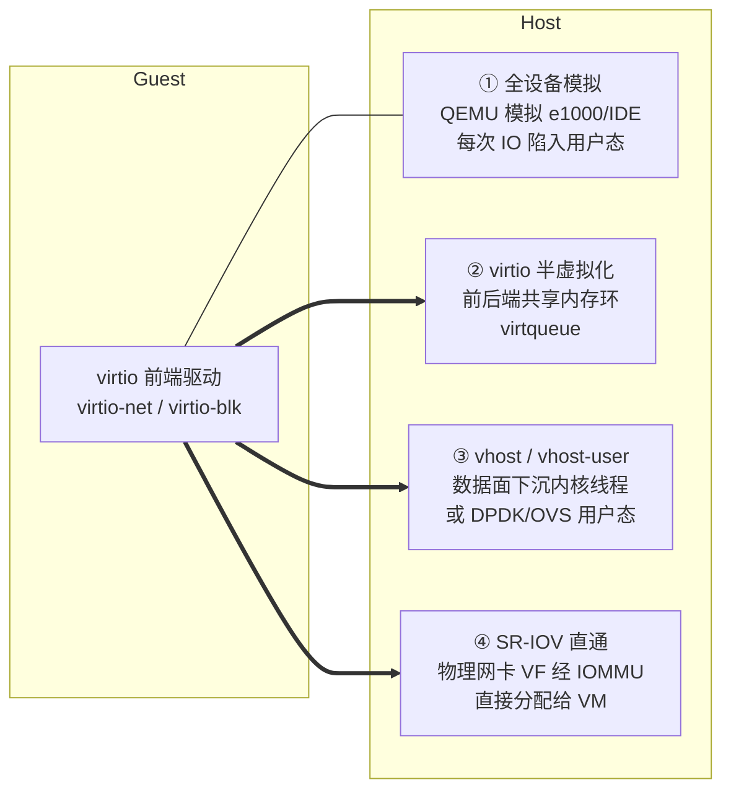
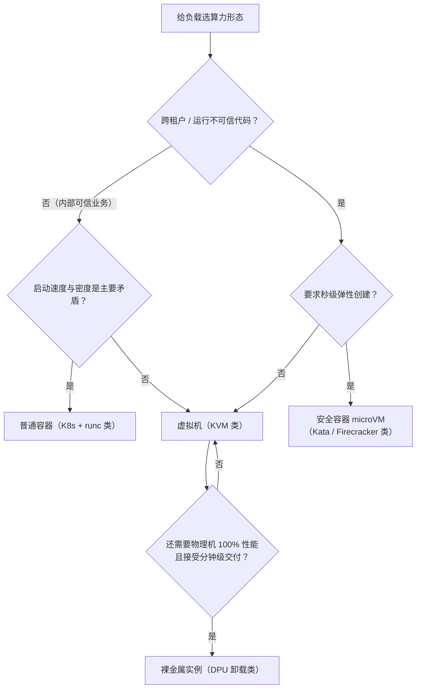

# 虚拟化与 KVM

> 这篇写给两类人：正在理解 IaaS 底层如何工作的工程师，以及需要为负载选算力形态（虚拟机 / 容器 / 安全容器 / 裸金属）的架构师。读完你应该带走：**三条虚拟化技术路线分别解决了什么问题、KVM 与 QEMU 为什么长成现在的分工、IO 路径（设备模拟 → virtio → vhost → 直通）的性能差距在哪、以及一线最容易踩的一串坑**。不讲论文，只讲一线怎么用。

## 是什么：把一台物理机变成 N 台互不干扰的"机器"

虚拟化（Virtualization）在本文的语境里指**硬件平台虚拟化**：在一台物理机上，通过 Hypervisor（虚拟机管理器）同时运行多个彼此隔离的虚拟机（Guest），每台 Guest 都认为独占一套 CPU、内存、磁盘和网卡。

*图源：Wikimedia Commons（[来源页](https://commons.wikimedia.org/wiki/File:Hardware_Virtualization_(copy).svg)）*

几个容易混淆的名词先钉死：

- **Hypervisor / VMM**：真正"骗过"Guest、分配硬件时间的软件层。典型产品：ESXi、Hyper-V、Xen、KVM。
- **Guest / Host**：客户机（跑在里面的 OS）/ 宿主机（承载虚拟化的物理机）。
- **vCPU**：不是一种硬件，而是宿主机上的一个普通线程，被调度进"虚拟 CPU 模式"运行 Guest 代码。这个理解在后面排障时非常关键。

历史脉络简版：虚拟化不是 x86 的原创——1960 年代 IBM 大型机 CP/CMS 就是多虚拟机分时；x86 上真正跑通是 1999–2001 年 VMware 用**二进制翻译**技术攻克了 x86 指令集"不可虚拟化"的难题；2003 年 Xen 选择了**半虚拟化**路线；2006–2007 年 Intel VT-x / AMD-V 硬件辅助虚拟化普及，同年 KVM 合入 Linux 内核主线。此后十余年，x86 世界的事实标准收敛为 **KVM + QEMU + virtio** 这一开源组合。

## 为什么需要虚拟化：三个不可回避的矛盾

提纲阶段我列过三点，站在一线视角它们至今成立，而且互相咬合：

1. **利用率矛盾**。一台物理机独占跑一个应用，CPU 平均利用率长期在个位数到百分之十几（我参与的绝大多数传统机房整合项目都在这个量级）；虚拟化把碎片拼成资源池，这是它最初也最硬的商业理由。
2. **隔离性需求**。多租户共用资源池，安全边界必须存在。虚拟机提供的是**硬件级隔离**——Guest 有自己独立内核，跨 VM 逃逸在理论上要攻破 Hypervisor + 内核两道墙，这也是"为什么容器出现多年后，云厂商仍把跨租户算力默认做成虚拟机"的原因。
3. **弹性供给的前提**。虚拟机的本质是**把"机器"这个物理实体变成了可编排的资源单元**：创建/销毁从数周采购压缩到分钟级，快照、热迁移、动态调整都建立在"机器即软件状态"之上。没有这一步，就没有今天的 IaaS 计费模型与自动化运维。

一句话：**虚拟化不是性能优化，是云的生产关系**。它决定了谁能和谁共享一台机器、故障域划多大、资源怎么计费。

## 三条技术路线，与 Type-1 / Type-2 之分

### 全虚拟化、半虚拟化、硬件辅助

| 路线 | 原理 | 代表 | 优点 | 代价 |
| --- | --- | --- | --- | --- |
| 全虚拟化 | Guest 不感知虚拟化，敏感指令由 VMM 拦截翻译（二进制翻译 / 影子页表） | VMware Workstation、VirtualBox、早期 VMware ESX | 不改 Guest，Windows 直接跑 | 实现复杂，早期性能差 |
| 半虚拟化 | Guest 明知自己是虚拟机，主动调用 Hypervisor 接口（hypercall） | Xen 早期（需改内核）、virtio 驱动 | 避开最昂贵的指令拦截 | Guest 必须装特定驱动，闭源系统难适配 |
| 硬件辅助 | CPU/芯片组原生提供虚拟化指令与模式切换 | Intel VT-x / AMD-V、EPT / NPT、VT-d / AMD-Vi | 性能接近原生，全虚拟化的兼容性 | 依赖硬件，仍要解决 IO 与内存开销 |

三者不是替代关系，而是**叠加关系**：今天的 KVM = 硬件辅助 CPU 虚拟化 + 硬件辅助内存虚拟化 + 半虚拟化 IO（virtio），Guest 里的 Windows/Linux 一个都不用改内核。

**CPU 虚拟化**：VT-x 引入 root / non-root 两种模式，Guest 代码跑在 non-root，特权动作触发 **VM Exit** 陷入宿主处理，状态保存在 VMCS 结构里（AMD 对应 SVM/VMCB）。**内存虚拟化**：早期用影子页表（每一次 Guest 页表变更都要 VMM 同步，TLB 频繁刷新）；2008 年前后 Intel EPT / AMD NPT 提供了**二级地址翻译（SLAT）**——GVA→GPA→HPA 两级页表由硬件走表，这是内存虚拟化真正的分水岭。

**Type-1 还是 Type-2**，是面试和选型里被问烂但值得说清的分类：

*图源：Wikimedia Commons（[来源页](https://commons.wikimedia.org/wiki/File:Hyperviseur.svg)）*

- Type-1（裸金属型）：ESXi、Xen、Hyper-V。生产数据中心主流。
- Type-2（宿主型）：VirtualBox、VMware Workstation、桌面 KVM/QEMU。开发测试方便。
- **KVM 的定位有争议**：Red Hat 官方口径是把 Linux 内核变成 Type-1 Hypervisor（KVM 以内核模块身份直接管理 VM Entry/Exit）；也有观点认为 Linux 依然直接跑在硬件上、整体更像 Type-2 结构。**我的判断是：这个分类对排障和选型没有实际意义，知道争议存在即可**——工程上更该关心的是下一节的实际分工。

## KVM/QEMU 架构：内核管 CPU 和内存，用户态管设备

KVM 的设计哲学是"不重造操作系统"：它不做调度、不做内存分配、不做驱动——这些 Linux 内核已经干了四十年。KVM 只往内核里加了一个 `/dev/kvm` 字符设备和一组 ioctl API（官方文档《The Definitive KVM API》），把内核改造成能承载虚拟机的宿主；**设备模拟（磁盘、网卡、主板芯片组、ACPI……）全部交给用户态的 QEMU**。

*图源：Wikimedia Commons（[来源页](https://commons.wikimedia.org/wiki/File:Kernel-based_Virtual_Machine_zh-CN.svg)）*

从这张图能读出三个关键工程事实：

1. **vCPU = QEMU 进程里的线程**。Guest 的调度公平性、CPU 配额、绑核，全部复用 Linux 调度器（cgroup 也能直接管 vCPU）——这是"内核即 Hypervisor"红利：宿主运维工具（top、perf、cgroup）对虚拟机同样有效。
2. **Guest 执行不经过模拟**。有 VT-x 后，Guest 指令直接在物理 CPU 上跑到触发 VM Exit 为止。所以**纯计算负载的虚拟化开销可以做到个位数百分比以内（我压测的经验值：CPU-bound 基准 <5%，边界条件是绑核、无超分、开 EPT）**。
3. **每次 VM Exit 都有成本**（保存/恢复上下文 + 陷入用户态），中断、异常、影子页表缺失都触发 VM Exit。优化虚拟化性能的半壁江山，就是在**减少 VM Exit 次数**。

### IO 虚拟化演进：真正的性能战场

CPU 几乎免费之后，差距全在 IO 路径。演进四步：

| IO 路径 | 性能量级 | 热迁移 | 故障域 | 适用边界 |
| --- | --- | --- | --- | --- |
| 设备模拟（如 e1000、IDE） | 最差，与原生差数倍 | 完全支持 | QEMU 进程 | 只用于装不上 virtio 驱动的老旧 Guest |
| virtio（QEMU 后端） | 接近原生 IO 的 7–8 成 | 完全支持 | QEMU 进程 | 通用默认，云盘/虚拟网络后端 |
| vhost-net / vhost-user | 数据面绕过 QEMU，延迟再降 | 支持（vhost-user 依赖后端） | 扩大到内核线程/DPDK 进程 | 高 PPS 网络、OVS/DPDK 场景 |
| SR-IOV / VFIO 直通 | 最接近硬件，但仍受 IOMMU 映射影响 | **基本丧失**（VF 与宿主机绑定） | 硬件故障直达 VM | 高性能网络/HFT/GPU；确认你接受运维代价再用 |

一线排障工具链：Guest 里看 `top` 的 **%st（steal time）**判断 CPU 争抢；宿主上用 `perf kvm stat live` 看 VM Exit 热点（PENDING 中断过多、EPT 冲突、MMIO 模拟各对应不同病因）；IO 慢先确认驱动是不是 virtio 再查存储后端。

## 虚拟机 vs 容器 vs 安全容器 vs 裸金属

先保留提纲里那张经典对比，再补两个我认为更影响选型的维度：

| 维度 | 虚拟机 | 容器 |
| --- | --- | --- |
| 隔离级别 | 硬件级（独立内核） | 进程级（共享宿主内核，namespace + cgroup） |
| 启动速度 | 分钟级 | 秒级 |
| 密度 | 低（每台 GB 级内存开销起步） | 高（单宿主数百实例常见） |
| 适用 | 强隔离、异构内核、有状态传统负载 | 微服务、弹性伸缩、标准化交付 |
| 逃逸攻击面 | Hypervisor + Guest 内核 | 宿主内核（内核 0day 即全漏），这是跨租户场景不敢默认用容器的根因 |
| 与云管面的关系 | 热迁移/快照等全套编排原语 | 弹性靠调度器重建，不靠迁移 |

**实践观点：这不是替代关系，而是融合**。Serverless 与多租户容器平台的底座大量收敛到"安全容器"——用虚拟机级隔离包住容器级启动速度：Kata Containers（每 Pod 一个轻量 KVM 虚拟机）、Firecracker（AWS 为 Lambda 自研的 microVM，几百毫秒启动、内存开销 MB 级）、gVisor（用户态内核拦截系统调用，不跑真虚拟机）。选型时的决策路径：

注意最后一跳：**裸金属不是虚拟化的对立面，而是虚拟化的尽头**——见下一节。

## 云场景下的虚拟化：管理一万台宿主机才是难点

单机跑 KVM 是及格线，云厂商的真实竞争力在下面三件事上。

### 1. 大规模宿主机管理

- **热迁移**：pre-copy 迭代搬运脏页，收敛后停机数百毫秒切换。OpenStack 官方文档把它分成两类：**共享存储热迁移**（只搬内存，源宿与目的宿挂载同一存储，快）与 **块迁移**（连盘一起搬，官方原话是"耗时更长、对网络压力更大"）。生产上热迁移失败的头号原因我遇到的都是 **CPU 兼容性**：用 `-cpu host` 暴露宿主全特性集的 VM 无法迁到不同代 CPU 的宿主，必须用基线 CPU 模型集。迁移带宽与并发数（如 Nova 的 `max_total_migrations`）要限流，否则一次机柜腾空能把自己 DDoS 了。
- **超分策略**：CPU 超分（vCPU:物理线程 2:1 甚至更高）是利润来源，但要按延迟敏感度分池；内存超分靠气球（virtio-balloon）与 KSM 页合并，**对数据库和敏感数据负载我默认不开 KSM**——省内存的代价是 CPU 开销和理论上被研究过的侧信道风险。
- **NUMA 感知**：vCPU 与内存不绑同一 NUMA 节点，跨节点访存能白丢 20–30% 性能。生产上 vCPU pinning + 绑大页（hugetlbfs）是延迟敏感负载标配，Guest 里也要暴露 NUMA 拓扑让应用自己感知。

### 2. 裸金属与 DPU 卸载：虚拟化开销下沉到硬件

KVM 方案里，宿主 OS 本身要占 CPU/内存、软件 IO 栈吃掉百万级 PPS 的能力。"神龙类"架构（公开同类还有 AWS Nitro、Azure Boost）的思路是：**把虚拟交换、云盘访问、Hypervisor 控制面全部卸载到专用 DPU 卡上**，宿主 CPU 100% 交付给客户，而云的管理面能力（弹性、镜像、网络编排、计费）一样不少。这是"云的弹性 + 物理机的性能"的真正工程含义——不是取消了虚拟化，而是换了一套硬件实现的虚拟化。对客沟通时我会强调：裸金属实例的运维模型（分钟级交付、快照、VPC 组网）来自虚拟化管控面，这是它区别于传统托管物理机的地方。

### 3. GPU 虚拟化：直通、vGPU、MIG 怎么选

AI 负载下这是新高频问题：

| 方式 | 粒度 | 性能 | 隔离 | 典型场景 |
| --- | --- | --- | --- | --- |
| 整卡直通（VFIO，GPU 也是 PCIe 设备） | 1 卡 = 1 VM | 最好；受 IOMMU 映射影响，小数据量 D2H 场景 overhead 可能反而高 | 硬件级 | 单机多卡训练、大模型推理整机 |
| vGPU（时间片切分） | 1:N 共享一卡 | 有调度损耗，显存按档切分 | 软隔离 | 桌面云、小规模多租户推理 |
| MIG（Ampere 起的硬件分区） | 每卡最多 7 个硬切片 | 切片内性能可预期 | 硬件级（计算+内存独立） | 大卡多租户推理、K8s 里按切片调度 |

我的经验边界：训练一律直通整卡（多卡还要配好 PCIe 拓扑亲和，否则 AllReduce 跨 CPU 掉带宽）；推理多租户优先看 MIG（硬隔离、可预期），需要超密度假设或老卡再退回 vGPU。GPU 直通同样牺牲热迁移能力——和网卡直通是一个取舍。

## 常见坑

| 坑 | 现象 | 根因与对策 |
| --- | --- | --- |
| Guest 不用 virtio 驱动 | Windows 装完就挂 IDE 磁盘 + e1000 网卡，IO 差数倍 | 交付镜像阶段就注入 virtio-win/virtio 驱动；性能对比测试前先查驱动类型 |
| CPU 超分不设限 | 业务高峰期 Guest 内 %st 飙升、尾延迟爆炸 | 按延迟敏感度分池；监测宿主与 Guest 双侧 steal time |
| NUMA 不亲和 | 同规格 VM 性能忽高忽低，跨节点访存丢 20–30% | vCPU/内存同节点 pinning + Guest 暴露 NUMA 拓扑；numastat 验证 |
| 透明大页 THP 不关 | 数据库延迟毛刺、偶发秒级卡顿 | 已知反模式：数据库 Guest 关 THP，需要大页就走显式 hugetlbfs |
| `-cpu host` 上生产 | 热迁移到异构宿主失败，或迁移后 Guest panic | 用基线 CPU 模型；异构代际大的池子分开管理 |
| 块迁移不限流 | 一次批量迁移打满业务网络 | 共享存储场景优先共享存储迁移；块迁移必须限带宽并控制并发 |
| 磁盘 cache=writeback 裸用 | 宿主断电/内核 panic 后 Guest 数据丢 | 金融类负载用 none/directsync，或依赖云盘多副本 + 掉电保护盘 |
| 直通用得很爽 | 某天发现这批 VM 全不能热迁移、宿主维护只能冷停 | SR-IOV/GPU 直通天然绑定硬件：直通实例数量要与运维窗口规划挂钩，别把全池子直通满 |
| 单 VM 中断风暴 | 宿主上邻居 VM 集体变慢 | IO 线程/pinned 隔离、cgroup 配额，中断亲和调整；KVM 场景下"吵闹邻居"仍在，虚拟化不消除它 |

## 实践观点

- **KVM 的胜利不是技术的胜利，是生态的胜利**：内核即 Hypervisor（复用 Linux 调度器、驱动、运维体系）+ 用户态 QEMU（灵活演进）+ virtio 标准（把半虚拟化接口开放成跨 Hypervisor 的通用协议）+ libvirt 管理面。评估任何虚拟化/容器底座，先看它复用了多少成熟生态，而不是自研了多"先进"的轮子。
- **CPU 虚拟化已经接近免费，IO 才是差距所在**。报价和测试里"虚拟化损耗"的争论，最后几乎都是 IO 路径选择的争论——先定 virtio/vhost/直通的路线，再谈百分比。
- **虚拟化的形态之争会一直存在，但隔离模型已经收敛**：跨租户信任边界默认落在"独立内核"这一级，容器解决速度、虚拟机解决信任、安全容器解决"既要又要"、裸金属解决性能极限。
- **做选型先想清楚"退出策略"**：一个用了直通的实例、一个用了 `-cpu host` 的实例，未来某天就会锁死你的整池运维模式。今天多 5% 的性能，可能要用明天全部不可迁移来换。

## 参考资料

<Refs>

**文字来源**（访问日期：2026-09-02）：

- [KVM — The Linux Kernel documentation](https://docs.kernel.org/virt/kvm/index.html) — 内核官方 KVM 文档索引（kernel.org）
- [The Definitive KVM API Documentation](https://docs.kernel.org/virt/kvm/api.html) — `/dev/kvm` ioctl API 的权威规范（docs.kernel.org）
- [VirtIO Devices — QEMU documentation](https://www.qemu.org/docs/master/system/devices/virtio/index.html) — virtio 半虚拟化设备官方手册（qemu.org）
- [QEMU 文档主页](https://www.qemu.org/docs/master/) — 系统模拟、设备与迁移机制总入口（qemu.org）
- [What is KVM? — Red Hat](https://www.redhat.com/en/topics/virtualization/what-is-KVM) — KVM 概念与 Type-1 定位的官方口径（redhat.com）
- [Red Hat Enterprise Linux 7: Virtualization Deployment and Administration Guide](https://docs.redhat.com/en/documentation/red_hat_enterprise_linux/7/html/virtualization_deployment_and_administration_guide/chap-kvm_para_virtualized_virtio_drivers) — KVM 部署运维与 virtio 驱动章节（docs.redhat.com）
- [OpenStack Nova: Configure live migrations](https://docs.openstack.org/nova/latest/admin/configuring-migrations.html) — 共享存储迁移 vs 块迁移、限流参数（docs.openstack.org）
- [OpenStack Nova: Resize an instance](https://docs.openstack.org/nova/latest/user/resize.html) — 动态资源调整（变配）工作流（docs.openstack.org）
- [x86 virtualization — Wikipedia](https://en.wikipedia.org/wiki/X86_virtualization) — VT-x/AMD-V、VMCS、二进制翻译历史（en.wikipedia.org）
- [Second Level Address Translation — Wikipedia](https://en.wikipedia.org/wiki/Second_Level_Address_Translation) — EPT/NPT（SLAT）与影子页表（en.wikipedia.org）
- [Kernel-based Virtual Machine — Wikipedia](https://en.wikipedia.org/wiki/Kernel-based_Virtual_Machine) — KVM 发展史与架构综述（en.wikipedia.org）
- [linux-kvm.org FAQ](https://linux-kvm.org/page/FAQ) — KVM 社区官方 FAQ（linux-kvm.org）

**图片来源**（均为 Wikimedia Commons 自由版权文件，访问日期：2026-09-02）：

- [File:Hardware Virtualization (copy).svg](https://commons.wikimedia.org/wiki/File:Hardware_Virtualization_(copy).svg) — 虚拟化概念图
- [File:Hyperviseur.svg](https://commons.wikimedia.org/wiki/File:Hyperviseur.svg) — Type-1 / Type-2 Hypervisor 结构对比图
- [File:Kernel-based Virtual Machine zh-CN.svg](https://commons.wikimedia.org/wiki/File:Kernel-based_Virtual_Machine_zh-CN.svg) — KVM/QEMU 架构示意图（中文标注版）

**站内相关**：[基座导读](/cloud/foundation/) · [OpenStack 架构与十年演进](/cloud/foundation/openstack) · [SDN / NFV](/cloud/foundation/sdn-nfv) · [弹性计算](/cloud/infra/compute) · [块存储与云盘](/cloud/infra/storage) · [Kubernetes 核心机制与企业级落地](/cloud/native/kubernetes)

</Refs>