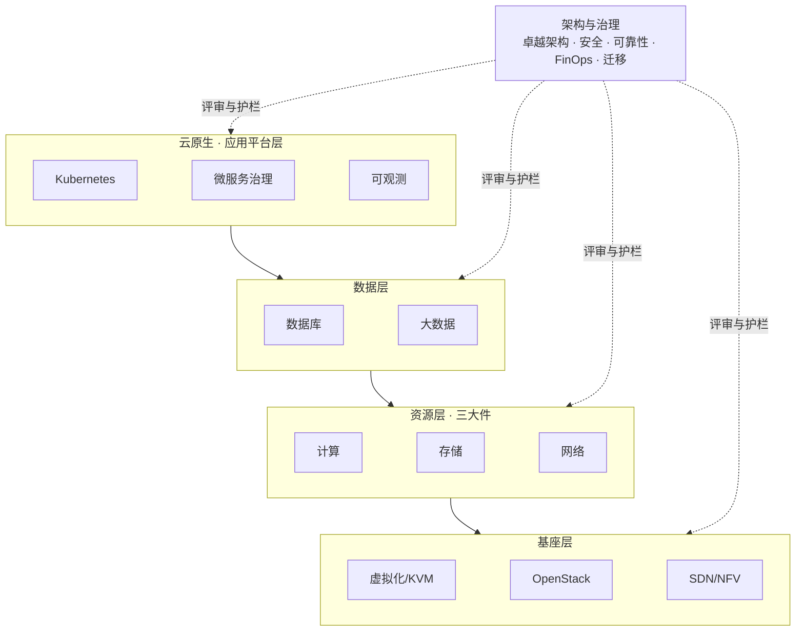

# 云计算：知识全景

*本站生成的高清全文阅读地图；具体版本、参数与结论以正文引用的一手来源为准。*

> 云计算是本知识体系的第一支柱，覆盖从硬件抽象到应用平台，再到生产架构治理的完整体系。四个技术子域按“从下往上”组织：**基座**回答云从哪里来，**计算·存储·网络**是云上三大件，**数据**承载业务的核心资产，**云原生**定义现代应用的构建方式；**架构与治理**横切四层，回答怎样把它们长期组织成安全、可靠、可负担、可演进的生产系统。

## 四层技术栈与横切治理

每一层都有独立的选型逻辑，但理解顺序建议**自底向上**：理解基座的抽象方式，才能看懂三大件产品的设计取舍；理解资源层的边界，才能做好数据层与云原生层的规划。架构与治理不是最上方的第五层，而是贯穿全栈的业务约束、组织机制与持续反馈闭环。

## 五个子域

| 子域 | 回答的问题 | 入口 |
| --- | --- | --- |
| 云计算基座 | 物理机如何变成资源池？云从哪里来？ | [基座导读](/cloud/foundation/) |
|  计算 · 存储 · 网络 | 算力怎么给、数据放哪、流量怎么走？ | [三大件导读](/cloud/infra/) |
|  数据库 · 大数据 | 为数据访问模式选最优解 | [数据层导读](/cloud/data/) |
|  云原生 | 声明式基础设施与现代化应用 | [云原生导读](/cloud/native/) |
| 架构与治理 | 用卓越架构、安全、可靠性、FinOps 与迁移机制把全栈带入生产 | [架构与治理导读](/cloud/architecture/) |

## 从技术组件到生产系统

| 阶段 | 首要问题 | 推荐入口 |
| --- | --- | --- |
| 认识底座 | 虚拟化、资源池和网络抽象怎样工作？ | [云计算基座](/cloud/foundation/) |
| 设计系统 | 算力、数据与流量怎样组合？ | [计算·存储·网络](/cloud/infra/) · [数据库·大数据](/cloud/data/) |
| 构建平台 | 应用怎样声明式交付、治理和观测？ | [云原生](/cloud/native/) |
| 进入生产 | 目标、身份、故障、成本和变更怎样持续受控？ | [架构与治理](/cloud/architecture/) |

## 与人工智能支柱的关系

云计算与 AI 不是割裂的两块：**AI 是长在云上的应用形态，云是 AI 的算力与工程底座**。GPU 资源池、存储带宽、网络拓扑直接决定训练与推理的成本结构——参见 [人工智能支柱](/ai/)。
